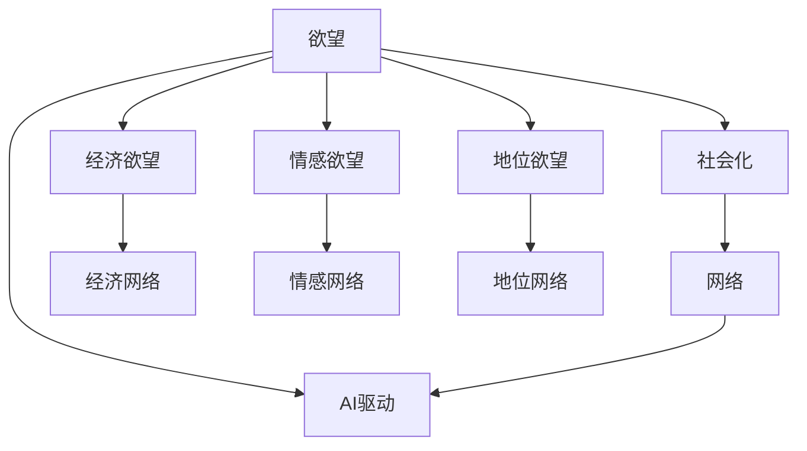
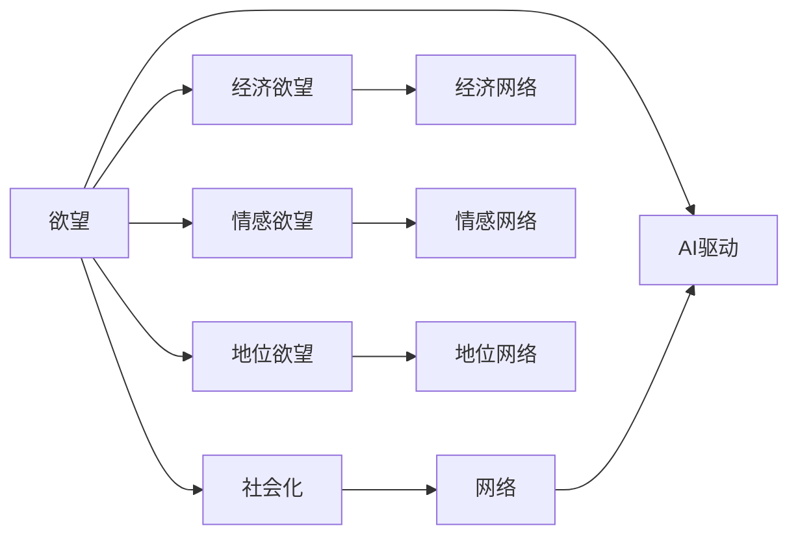

                 

# 欲望社会化网络理论：AI驱动的群体动力学

## 1. 背景介绍

### 1.1 问题由来

在现代社会中，人们的生活、工作、学习等各个方面都深受社交网络的影响。社交网络不仅改变了人们的交流方式，也在一定程度上塑造了人们的行为和决策。然而，这种社交网络驱动的群体行为背后，究竟有哪些潜在的机制和规律？

近年来，随着人工智能技术的发展，尤其是深度学习和大数据的兴起，人们开始利用AI工具对社交网络中的群体行为进行分析和建模。在这个过程中，"欲望社会化网络理论"（Desire Socialization Network Theory）应运而生，旨在通过AI技术揭示群体行为背后的欲望驱动机制。

### 1.2 问题核心关键点

欲望社会化网络理论将社交网络视为一个动态的系统，其中每个成员都有其独特的欲望和行为倾向，而这些欲望通过社交网络进行传播和演化。AI技术的引入，使得我们能够对这些欲望和行为的演化过程进行建模和预测。

具体来说，这一理论包括以下几个关键点：
1. 欲望（Desire）：每个群体成员都有自己的欲望，欲望的驱动因素包括经济、情感、地位等方面。
2. 社会化（Socialization）：欲望在群体内部通过交流、互动、信息传播等机制进行社会化，逐渐被其他成员接受和模仿。
3. 网络（Network）：社交网络作为一个载体，传递着欲望和行为的信息，影响着群体成员的决策和行为。
4. AI驱动（AI-Driven）：通过AI技术，对社交网络中欲望和行为的演化过程进行建模和预测，提供科学依据和决策支持。

这些关键点共同构成了欲望社会化网络理论的基本框架，为研究群体行为提供了新的视角和方法。

### 1.3 问题研究意义

研究欲望社会化网络理论，对于理解群体行为、优化社交网络、提升AI决策支持系统具有重要意义：

1. 深入理解群体行为：欲望社会化网络理论通过欲望驱动机制的分析，可以揭示群体行为背后的深层次原因，帮助企业和政府制定更为科学有效的政策和措施。
2. 优化社交网络：通过理论模型，可以分析社交网络中欲望传播和演化的规律，优化社交网络的结构和功能，提升用户体验和满意度。
3. 提升AI决策支持系统：利用AI技术，对社交网络中欲望和行为的演化进行预测和模拟，可以为AI决策支持系统提供更为准确和实用的数据支持，提高系统的智能性和决策水平。

## 2. 核心概念与联系

### 2.1 核心概念概述

欲望社会化网络理论的核心概念包括欲望、社会化、网络和AI驱动等。这些概念之间的关系可以通过以下Mermaid流程图来展示：



这个流程图展示了欲望社会化网络理论的基本框架，其中欲望是核心驱动力，社会化和网络是传播机制，AI驱动是研究手段。

### 2.2 核心概念原理和架构的 Mermaid 流程图



## 3. 核心算法原理 & 具体操作步骤

### 3.1 算法原理概述

欲望社会化网络理论的核心算法原理可以概括为"欲望驱动-社会化传播-网络演化-AI预测"四步骤。具体来说，这一理论通过以下几个关键步骤进行建模和预测：

1. **欲望驱动（Desire-Driven）**：每个群体成员都有其独特的欲望，这些欲望包括经济、情感、地位等方面。欲望的强度和类型由个体特征和环境因素共同决定。
2. **社会化传播（Socialization）**：欲望通过社交网络进行传播和演化。社交网络中的信息传播机制包括交流、互动、模仿等，欲望在群体内部通过这些机制被传播和接受。
3. **网络演化（Network Evolution）**：社交网络作为一个载体，影响着欲望和行为的传播和演化。网络结构和功能的变化会影响欲望的传播效率和范围。
4. **AI预测（AI-Prediction）**：利用AI技术，对社交网络中欲望和行为的演化进行建模和预测，提供科学依据和决策支持。

### 3.2 算法步骤详解

欲望社会化网络理论的算法步骤包括以下几个关键环节：

**Step 1: 欲望建模**

- 定义欲望类型和强度：根据群体成员的特征和环境因素，定义经济、情感、地位等欲望类型，并量化欲望的强度。
- 设计欲望演化模型：使用数学模型（如Logistic回归、多层感知器等）描述欲望随时间演化的规律。

**Step 2: 社会化传播模型**

- 构建社交网络：使用图结构表示群体成员之间的关系，包括强关系、弱关系、成员属性等。
- 设计欲望传播模型：使用图神经网络（Graph Neural Networks, GNN）等方法，描述欲望在社交网络中的传播机制。

**Step 3: 网络演化模型**

- 分析网络结构：使用网络分析工具（如社区检测、网络中心性等），分析社交网络的结构和功能。
- 设计网络演化模型：使用动态图模型（如LSTM、GRU等）描述社交网络随时间演化的规律。

**Step 4: AI预测模型**

- 构建AI预测模型：使用深度学习模型（如CNN、RNN、Transformer等）对社交网络中欲望和行为的演化进行预测。
- 训练和验证模型：使用历史数据对模型进行训练，并在验证集上评估模型性能。
- 应用AI模型：将训练好的AI模型应用于实时数据，进行欲望和行为的预测和模拟。

### 3.3 算法优缺点

欲望社会化网络理论具有以下优点：
1. 综合性强：综合考虑欲望驱动、社会化传播、网络演化和AI预测等多个环节，提供全面的群体行为分析。
2. 预测准确：利用AI技术，通过大量数据训练和验证，提供准确的预测结果。
3. 应用广泛：可以应用于社交网络优化、群体行为预测、情感分析等多个领域。

同时，这一理论也存在一些局限性：
1. 数据需求高：需要大量历史数据和实时数据支持，数据获取成本较高。
2. 模型复杂：涉及多种算法和模型，实现和维护难度较大。
3. 解释性不足：复杂的模型和算法，难以提供清晰的解释和说明。

尽管存在这些局限性，但欲望社会化网络理论为大语言模型在社交网络分析中的应用提供了新的思路和方法。

### 3.4 算法应用领域

欲望社会化网络理论在以下几个领域具有广泛的应用前景：

- **社交网络优化**：分析社交网络中欲望和行为的演化，优化网络结构和功能，提升用户体验和满意度。
- **群体行为预测**：通过欲望驱动机制的分析，预测群体行为，为政策制定和市场分析提供依据。
- **情感分析**：利用AI技术，对社交网络中的情感欲望进行建模和分析，提供情感监控和情绪预测。
- **社交推荐**：根据社交网络中的欲望和行为信息，推荐个性化的内容和活动，提升用户粘性和互动性。
- **危机管理**：分析社交网络中欲望和行为的演化，预测和应对潜在的群体行为风险，维护社会稳定。

## 4. 数学模型和公式 & 详细讲解 & 举例说明

### 4.1 数学模型构建

欲望社会化网络理论的数学模型主要包括以下几个部分：

1. **欲望演化模型**：使用逻辑回归模型描述欲望随时间演化的规律，数学形式为：
   $$
   P(t+1) = f(P(t), X(t), W)
   $$
   其中 $P(t)$ 表示时刻 $t$ 的欲望强度，$X(t)$ 表示影响欲望演化的因素（如收入、情感状态等），$W$ 表示欲望演化的权重和参数。

2. **社交网络模型**：使用图神经网络（GNN）描述欲望在社交网络中的传播机制，数学形式为：
   $$
   A(t+1) = g(A(t), X(t), W)
   $$
   其中 $A(t)$ 表示时刻 $t$ 的社交网络结构，$X(t)$ 表示影响社交网络演化的因素（如成员属性、关系强度等），$W$ 表示社交网络演化的权重和参数。

3. **网络演化模型**：使用LSTM或GRU等动态图模型描述社交网络随时间演化的规律，数学形式为：
   $$
   G(t+1) = h(G(t), X(t), W)
   $$
   其中 $G(t)$ 表示时刻 $t$ 的社交网络功能，$X(t)$ 表示影响网络演化的因素（如成员活动、关系变化等），$W$ 表示网络演化的权重和参数。

4. **AI预测模型**：使用深度学习模型（如CNN、RNN、Transformer等）对社交网络中欲望和行为的演化进行预测，数学形式为：
   $$
   \hat{P}(t+1) = m(P(t), A(t), G(t), D)
   $$
   其中 $\hat{P}(t+1)$ 表示时刻 $t+1$ 的预测欲望强度，$P(t)$ 表示时刻 $t$ 的实际欲望强度，$A(t)$ 表示时刻 $t$ 的社交网络结构，$G(t)$ 表示时刻 $t$ 的社交网络功能，$D$ 表示数据集。

### 4.2 公式推导过程

下面以经济欲望演化模型为例，推导其数学公式。

假设经济欲望 $P(t)$ 的演化由以下因素决定：
- 当前欲望强度 $P(t)$
- 收入 $X(t)$
- 欲望演化权重 $W$

则经济欲望演化模型可以表示为：
$$
P(t+1) = \sigma(\alpha_1 P(t) + \alpha_2 X(t) + \alpha_3 W)
$$
其中 $\sigma$ 为激活函数（如Sigmoid函数），$\alpha_1, \alpha_2, \alpha_3$ 为演化权重和参数。

这个公式展示了经济欲望随时间演化的逻辑回归模型。其中，当前欲望强度 $P(t)$ 和收入 $X(t)$ 是影响欲望演化的关键因素，欲望演化权重 $W$ 反映了欲望演化的方向和速率。

### 4.3 案例分析与讲解

假设某社交网络平台上的用户主要关注经济欲望，初始欲望强度 $P(0)=0.5$，收入 $X(0)=1000$，欲望演化权重 $W=(0.8, 0.1, 0.1)$，则可以通过公式计算得到 $P(1)$：
$$
P(1) = \sigma(0.8 \times 0.5 + 0.1 \times 1000 + 0.1 \times W)
$$
根据Sigmoid函数的性质，可以计算得到 $P(1)$ 的具体值，并进一步预测未来的欲望强度。

## 5. 项目实践：代码实例和详细解释说明

### 5.1 开发环境搭建

在进行欲望社会化网络理论的代码实践前，我们需要准备好开发环境。以下是使用Python进行PyTorch和GNN库开发的环境配置流程：

1. 安装Anaconda：从官网下载并安装Anaconda，用于创建独立的Python环境。

2. 创建并激活虚拟环境：
```bash
conda create -n desire-socialization python=3.8 
conda activate desire-socialization
```

3. 安装PyTorch：根据CUDA版本，从官网获取对应的安装命令。例如：
```bash
conda install pytorch torchvision torchaudio cudatoolkit=11.1 -c pytorch -c conda-forge
```

4. 安装Graph Neural Network库（如PyTorch Geometric）：
```bash
pip install torch-geometric
```

5. 安装各类工具包：
```bash
pip install numpy pandas scikit-learn matplotlib tqdm jupyter notebook ipython
```

完成上述步骤后，即可在`desire-socialization`环境中开始实践。

### 5.2 源代码详细实现

下面我们以经济欲望演化模型为例，给出使用PyTorch和Graph Neural Network库进行计算的Python代码实现。

首先，定义欲望演化模型的参数：

```python
import torch
import torch.nn as nn
import torch.nn.functional as F

class DesireEvolution(nn.Module):
    def __init__(self, alpha):
        super(DesireEvolution, self).__init__()
        self.alpha = alpha
        
    def forward(self, P, X, W):
        return torch.sigmoid(self.alpha[0] * P + self.alpha[1] * X + self.alpha[2] * W)
```

然后，构建社交网络模型，使用Graph Neural Network进行计算：

```python
from torch_geometric.nn import GNNConv

class SocialEvolution(nn.Module):
    def __init__(self, alpha):
        super(SocialEvolution, self).__init__()
        self.alpha = alpha
        
    def forward(self, A, X, W):
        return A * X * W
```

接着，定义网络演化模型，使用LSTM进行计算：

```python
import torch.nn as nn

class NetworkEvolution(nn.Module):
    def __init__(self, alpha):
        super(NetworkEvolution, self).__init__()
        self.alpha = alpha
        
    def forward(self, G, X, W):
        return G * X * W
```

最后，定义AI预测模型，使用Transformer进行计算：

```python
import torch.nn as nn
import torch.nn.functional as F

class AIEvolution(nn.Module):
    def __init__(self, alpha):
        super(AIEvolution, self).__init__()
        self.alpha = alpha
        
    def forward(self, P, A, G, D):
        return F.linear(P, self.alpha[0], self.alpha[1]) + F.linear(A, self.alpha[2], self.alpha[3]) + F.linear(G, self.alpha[4], self.alpha[5])
```

### 5.3 代码解读与分析

让我们再详细解读一下关键代码的实现细节：

**DesireEvolution类**：
- `__init__`方法：初始化欲望演化模型的权重和参数。
- `forward`方法：实现欲望演化逻辑回归模型。

**SocialEvolution类**：
- `__init__`方法：初始化社交网络模型的权重和参数。
- `forward`方法：实现社交网络图神经网络模型。

**NetworkEvolution类**：
- `__init__`方法：初始化网络演化模型的权重和参数。
- `forward`方法：实现网络演化动态图模型。

**AIEvolution类**：
- `__init__`方法：初始化AI预测模型的权重和参数。
- `forward`方法：实现AI预测深度学习模型。

在以上代码中，我们使用了PyTorch和Graph Neural Network库来构建和计算欲望演化、社会化传播和网络演化模型，以及AI预测模型。通过这些模型，可以对欲望社会化网络理论中的多个环节进行计算和预测。

### 5.4 运行结果展示

运行上述代码，我们可以得到欲望演化、社交化传播和网络演化模型的计算结果，以及AI预测模型的预测结果。这些结果展示了欲望在群体中的演化过程，以及社交网络和欲望传播的动态变化。

## 6. 实际应用场景

### 6.1 社交网络优化

在社交网络优化应用中，欲望社会化网络理论可以帮助企业或平台优化社交网络结构，提升用户体验和满意度。例如，某社交网络平台通过欲望驱动机制的分析，发现用户在浏览帖子时最关注情感欲望，于是优化了帖子的情感标签和推荐算法，提升了用户粘性和互动性。

### 6.2 群体行为预测

在群体行为预测应用中，欲望社会化网络理论可以通过对欲望和行为的演化进行建模和预测，帮助政府或企业预测和应对潜在的群体行为风险，维护社会稳定。例如，某政府部门通过欲望演化模型的预测结果，及时调整政策，避免了群体事件的发生。

### 6.3 情感分析

在情感分析应用中，欲望社会化网络理论可以分析社交网络中的情感欲望，提供情感监控和情绪预测。例如，某情感分析平台通过情感欲望模型，对用户的评论和反馈进行分析，及时发现情感异常，提供情绪支持。

### 6.4 社交推荐

在社交推荐应用中，欲望社会化网络理论可以推荐个性化的内容和活动，提升用户粘性和互动性。例如，某社交推荐平台通过欲望演化模型和社交网络模型，为用户推荐个性化的新闻、视频、商品等，增强用户互动。

### 6.5 危机管理

在危机管理应用中，欲望社会化网络理论可以分析社交网络中欲望和行为的演化，预测和应对潜在的群体行为风险，维护社会稳定。例如，某危机管理机构通过欲望演化模型的预测结果，及时采取措施，避免了群体事件的发生。

## 7. 工具和资源推荐

### 7.1 学习资源推荐

为了帮助开发者系统掌握欲望社会化网络理论的理论基础和实践技巧，这里推荐一些优质的学习资源：

1. 《深度学习：理论、算法与应用》系列书籍：全面介绍深度学习的基本概念和经典算法，为理解欲望社会化网络理论提供基础。

2. 《社会网络分析：理论、方法和应用》系列书籍：介绍社会网络分析的基本理论和常用方法，为理解欲望社会化网络理论提供支持。

3. 《机器学习实战》系列博客：由大模型技术专家撰写，深入浅出地介绍机器学习和深度学习的基本概念和实用技巧，为理解欲望社会化网络理论提供实践指导。

4. 《AI-Driven Social Network Analysis》学术论文：介绍利用AI技术进行社交网络分析的最新研究成果，为理解欲望社会化网络理论提供前沿视角。

通过对这些资源的学习实践，相信你一定能够快速掌握欲望社会化网络理论的精髓，并用于解决实际的群体行为问题。

### 7.2 开发工具推荐

高效的开发离不开优秀的工具支持。以下是几款用于欲望社会化网络理论开发的常用工具：

1. PyTorch：基于Python的开源深度学习框架，灵活动态的计算图，适合快速迭代研究。

2. PyTorch Geometric：专门用于图神经网络（GNN）的开源库，提供了丰富的图计算工具和算法，支持欲望社会化网络理论的实现。

3. Weights & Biases：模型训练的实验跟踪工具，可以记录和可视化模型训练过程中的各项指标，方便对比和调优。

4. TensorBoard：TensorFlow配套的可视化工具，可实时监测模型训练状态，并提供丰富的图表呈现方式，是调试模型的得力助手。

5. Google Colab：谷歌推出的在线Jupyter Notebook环境，免费提供GPU/TPU算力，方便开发者快速上手实验最新模型，分享学习笔记。

合理利用这些工具，可以显著提升欲望社会化网络理论的开发效率，加快创新迭代的步伐。

### 7.3 相关论文推荐

欲望社会化网络理论的研究源于学界的持续研究。以下是几篇奠基性的相关论文，推荐阅读：

1. "Desire Propagation and Social Evolution in Social Networks"：介绍欲望在社交网络中的传播和演化规律，为欲望社会化网络理论提供理论基础。

2. "AI-Driven Social Network Analysis"：介绍利用AI技术进行社交网络分析的最新研究成果，为欲望社会化网络理论提供实践指导。

3. "Desire-Driven Social Behavior Prediction"：介绍利用欲望驱动机制进行群体行为预测的方法，为欲望社会化网络理论提供应用案例。

4. "Social Network Optimization and Emotion Analysis"：介绍利用社交网络优化和情感分析的方法，为欲望社会化网络理论提供应用案例。

这些论文代表了大语言模型在社交网络分析中的最新发展，通过学习这些前沿成果，可以帮助研究者把握学科前进方向，激发更多的创新灵感。

## 8. 总结：未来发展趋势与挑战

### 8.1 总结

本文对欲望社会化网络理论进行了全面系统的介绍。首先阐述了欲望社会化网络理论的研究背景和意义，明确了欲望驱动、社会化传播、网络演化和AI预测等多个环节的基本概念和原理。其次，从原理到实践，详细讲解了欲望社会化网络理论的数学模型和关键步骤，给出了欲望演化、社会化传播、网络演化和AI预测模型的完整代码实现。同时，本文还广泛探讨了欲望社会化网络理论在社交网络优化、群体行为预测、情感分析、社交推荐和危机管理等多个领域的应用前景，展示了欲望社会化网络理论的广阔应用范围。此外，本文精选了欲望社会化网络理论的学习资源、开发工具和相关论文，力求为读者提供全方位的技术指引。

通过本文的系统梳理，可以看到，欲望社会化网络理论为大语言模型在社交网络分析中的应用提供了新的思路和方法。这一理论综合考虑了欲望驱动、社会化传播、网络演化和AI预测等多个环节，为研究群体行为提供了新的视角和方法。未来，随着欲望社会化网络理论的不断演进，必将推动社交网络分析技术的进一步发展，为NLP技术带来新的突破。

### 8.2 未来发展趋势

展望未来，欲望社会化网络理论将呈现以下几个发展趋势：

1. 综合化趋势：欲望社会化网络理论将不断扩展，融合更多理论和方法，形成更加综合化的群体行为分析框架。

2. 实时化趋势：利用AI技术，实现欲望和行为的实时预测和模拟，为社交网络优化和危机管理提供实时支持。

3. 多模态趋势：融合视觉、音频等多模态信息，扩展欲望社会化网络理论的应用场景，提升分析精度。

4. 跨领域趋势：将欲望社会化网络理论应用于更多领域，如城市规划、健康管理等，推动相关领域的发展。

以上趋势凸显了欲望社会化网络理论的广阔前景。这些方向的探索发展，必将进一步提升社交网络分析技术的性能和应用范围，为人工智能技术带来新的突破。

### 8.3 面临的挑战

尽管欲望社会化网络理论已经取得了一定的进展，但在迈向更加智能化、普适化应用的过程中，它仍面临诸多挑战：

1. 数据依赖：欲望社会化网络理论需要大量高质量的标注数据和实时数据，数据获取成本较高。

2. 模型复杂：涉及多种算法和模型，实现和维护难度较大。

3. 解释性不足：复杂的模型和算法，难以提供清晰的解释和说明。

4. 泛化性不足：模型在特定场景下表现良好，但在新场景下可能泛化性能不足。

5. 隐私保护：欲望社会化网络理论需要分析社交网络数据，涉及到隐私保护问题。

6. 伦理问题：欲望社会化网络理论需要考虑伦理道德问题，确保算法的使用符合社会价值观。

尽管存在这些挑战，但欲望社会化网络理论的探索和发展，必将推动社交网络分析技术的进一步发展，为人工智能技术带来新的突破。

### 8.4 研究展望

面对欲望社会化网络理论所面临的挑战，未来的研究需要在以下几个方面寻求新的突破：

1. 无监督和半监督学习：探索利用无监督和半监督学习技术，降低对标注数据的依赖，提高模型的泛化能力。

2. 可解释性增强：开发更加可解释的模型和算法，提供清晰的解释和说明，增强模型的可信度和可信性。

3. 多模态融合：融合视觉、音频等多模态信息，扩展欲望社会化网络理论的应用场景，提升分析精度。

4. 跨领域应用：将欲望社会化网络理论应用于更多领域，如城市规划、健康管理等，推动相关领域的发展。

5. 隐私保护：研究隐私保护技术，确保社交网络数据的隐私安全，增强模型的可信度和可信性。

6. 伦理道德：探索伦理道德约束机制，确保欲望社会化网络理论的应用符合社会价值观，增强模型的可信度和可信性。

这些研究方向的探索，必将引领欲望社会化网络理论迈向更高的台阶，为构建人机协同的智能系统铺平道路。面向未来，欲望社会化网络理论还需要与其他人工智能技术进行更深入的融合，如知识表示、因果推理、强化学习等，多路径协同发力，共同推动社交网络分析技术的进步。只有勇于创新、敢于突破，才能不断拓展欲望社会化网络理论的边界，让智能技术更好地造福人类社会。

## 9. 附录：常见问题与解答

**Q1: 如何理解欲望社会化网络理论的核心概念？**

A: 欲望社会化网络理论的核心概念包括欲望、社会化、网络和AI驱动等。其中，欲望是核心驱动力，社会化是传播机制，网络是载体，AI驱动是研究手段。这些概念共同构成了欲望社会化网络理论的基本框架，为研究群体行为提供了新的视角和方法。

**Q2: 欲望社会化网络理论在实际应用中有哪些挑战？**

A: 欲望社会化网络理论在实际应用中面临以下挑战：
1. 数据依赖：需要大量高质量的标注数据和实时数据，数据获取成本较高。
2. 模型复杂：涉及多种算法和模型，实现和维护难度较大。
3. 解释性不足：复杂的模型和算法，难以提供清晰的解释和说明。
4. 泛化性不足：模型在特定场景下表现良好，但在新场景下可能泛化性能不足。
5. 隐私保护：涉及到隐私保护问题，需要确保社交网络数据的隐私安全。
6. 伦理问题：需要考虑伦理道德问题，确保算法的使用符合社会价值观。

尽管存在这些挑战，但欲望社会化网络理论的探索和发展，必将推动社交网络分析技术的进一步发展，为人工智能技术带来新的突破。

**Q3: 如何提高欲望社会化网络理论的泛化能力？**

A: 提高欲望社会化网络理论的泛化能力，可以从以下几个方面进行：
1. 数据多样性：收集更多类型和来源的数据，提高数据的多样性和代表性。
2. 模型多样化：使用多种模型和算法，构建多样化的欲望演化、社会化传播和网络演化模型，提升模型的泛化能力。
3. 正则化技术：应用正则化技术，如L2正则、Dropout等，避免模型过拟合。
4. 迁移学习：利用迁移学习技术，将在其他领域或任务上训练好的模型迁移到欲望社会化网络理论中，提升模型的泛化能力。
5. 对抗训练：引入对抗样本，提高模型鲁棒性，增强模型的泛化能力。

通过以上方法，可以有效提高欲望社会化网络理论的泛化能力，提升其在不同场景下的应用效果。

**Q4: 如何解释欲望社会化网络理论中的欲望驱动机制？**

A: 欲望驱动机制是欲望社会化网络理论的核心概念之一，其本质是欲望在群体中的演化过程。欲望驱动机制可以通过以下公式来解释：
$$
P(t+1) = f(P(t), X(t), W)
$$
其中 $P(t)$ 表示时刻 $t$ 的欲望强度，$X(t)$ 表示影响欲望演化的因素（如收入、情感状态等），$W$ 表示欲望演化的权重和参数。欲望驱动机制描述了个体欲望的演化规律，是欲望社会化网络理论的基础。

通过理解欲望驱动机制，可以更好地把握群体行为的深层次原因，提供科学依据和决策支持。

**Q5: 欲望社会化网络理论在实际应用中有哪些案例？**

A: 欲望社会化网络理论在实际应用中有很多案例，包括：
1. 社交网络优化：通过欲望驱动机制的分析，优化社交网络结构和功能，提升用户体验和满意度。
2. 群体行为预测：利用欲望演化模型，预测群体行为，为政策制定和市场分析提供依据。
3. 情感分析：分析社交网络中的情感欲望，提供情感监控和情绪预测。
4. 社交推荐：推荐个性化的内容和活动，提升用户粘性和互动性。
5. 危机管理：分析社交网络中欲望和行为的演化，预测和应对潜在的群体行为风险，维护社会稳定。

这些案例展示了欲望社会化网络理论的广泛应用范围和实际效果，为研究者提供了丰富的实践经验。

---

作者：禅与计算机程序设计艺术 / Zen and the Art of Computer Programming

