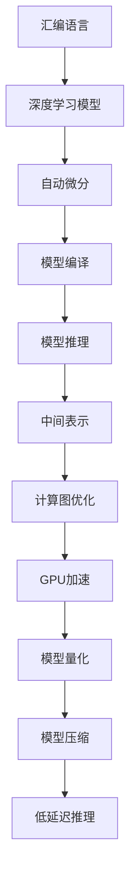

                 

## 1. 背景介绍

在计算机科学的发展历程中，汇编语言始终占据着举足轻重的地位。汇编语言不仅在硬件层面提供了极高的性能和控制能力，其对底层操作的直接访问特性也使得其在AI领域的应用具有得天独厚的优势。随着AI技术的不断成熟，尤其是深度学习的发展，汇编语言和AI的结合正开启全新的底层优化艺术，让高性能计算得以充分释放。

### 1.1 问题由来

现代高性能计算依赖于多个层面的优化，包括算法设计、硬件架构、软件实现等。在AI领域，尤其是深度学习，其计算密集型的特性使得底层优化变得更加重要。传统编程语言如C++、Python等在抽象层次较高时，难以充分发挥底层硬件的潜力。汇编语言的直接操作特性恰好能够弥补这一不足，与AI技术的结合可以大幅提升模型训练和推理的效率，是未来高性能AI计算的重要方向。

### 1.2 问题核心关键点

汇编语言与AI的结合涉及多个关键点，包括：
- 底层优化策略：如何通过汇编语言优化深度学习模型的计算图，提高模型训练和推理的效率。
- 代码生成与执行：如何将AI模型编译为汇编代码，并高效执行。
- 硬件接口设计：如何设计汇编语言与硬件的接口，充分利用底层硬件特性。
- 与主流框架的兼容：如何使汇编语言代码与现有的AI框架（如TensorFlow、PyTorch等）兼容。

这些关键点共同构成了汇编语言与AI结合的底层优化艺术，其核心在于通过汇编语言实现对硬件的直接控制，从而显著提升AI模型的性能。

### 1.3 问题研究意义

研究汇编语言与AI结合的底层优化艺术，对推动AI技术的进一步发展具有重要意义：
- 提升性能：汇编语言的高效性可以大幅提升AI模型的计算速度，使其在实时应用中具有更强的竞争力。
- 支持自定义硬件：汇编语言能够直接访问底层硬件，有助于在特定硬件（如GPU、ASIC等）上实现自定义加速。
- 减少资源消耗：通过汇编语言直接操作内存和处理器，可以减小AI模型在计算和存储方面的资源消耗。
- 拓展应用场景：汇编语言的底层特性使其能够支持更多复杂的应用场景，如实时图像处理、智能传感器数据处理等。
- 促进学术界和工业界的融合：汇编语言与AI结合的研究有助于加速学术成果的产业化，推动AI技术在更多领域的应用。

## 2. 核心概念与联系

### 2.1 核心概念概述

为更好地理解汇编语言与AI结合的底层优化艺术，本节将介绍几个密切相关的核心概念：

- 汇编语言(Assembler Language)：一种低级编程语言，通过直接操作计算机硬件进行编程。汇编语言包括汇编器(Assembler)、目标代码(Obj Code)、链接器(Linker)、加载器(Loader)等多个部分，能够直接访问硬件资源，实现高效的底层优化。
- 深度学习(Depth Learning)：一种基于神经网络的机器学习技术，通过多层非线性变换学习输入数据的抽象特征，在图像识别、语音识别、自然语言处理等领域取得了显著成果。
- 自动微分(Automatic Differentiation)：通过程序化地实现反向传播算法，计算模型参数的梯度，是深度学习模型训练的核心技术之一。
- 模型编译(Compiler)：将高级语言的代码转换为低级机器代码的过程。模型编译不仅涉及语言本身的转换，还包括对深度学习模型的优化，以提高其性能。
- 模型推理(Inference)：将训练好的深度学习模型应用于新数据，输出预测结果的过程。推理效率的提升对实际应用尤为重要。
- 中间表示(Intermediate Representation)：深度学习模型在训练和推理过程中使用的中间表示形式，如计算图、张量等，是模型编译和优化研究的关键对象。

这些核心概念之间的逻辑关系可以通过以下Mermaid流程图来展示：



这个流程图展示了大语言模型的核心概念及其之间的关系：

1. 汇编语言通过直接操作硬件，提供高效的底层优化。
2. 深度学习模型利用自动微分进行模型训练，并由模型编译器转换为汇编代码。
3. 模型推理通过中间表示进行，可以通过汇编语言进行优化，如计算图优化、GPU加速等。
4. 模型量化和压缩技术能够减小模型参数和存储资源，从而提升推理速度。

这些概念共同构成了汇编语言与AI结合的底层优化艺术，使其能够充分释放硬件潜力，提升深度学习模型的性能。

## 3. 核心算法原理 & 具体操作步骤
### 3.1 算法原理概述

汇编语言与AI结合的底层优化艺术，核心在于将深度学习模型编译为汇编代码，并对其进行高效的优化。这一过程主要包括以下几个步骤：

1. **模型编译**：将深度学习模型的中间表示（如计算图）转换为汇编代码。
2. **模型优化**：对汇编代码进行计算图优化和模型压缩等，以提高执行效率和减少资源消耗。
3. **模型执行**：将优化后的汇编代码执行在目标硬件上，进行高效的推理计算。

通过这三大步骤，汇编语言与AI结合能够实现深度学习模型的性能优化。

### 3.2 算法步骤详解

**步骤1: 模型编译**

模型编译的过程包括多个阶段，主要步骤如下：

1. **中间表示生成**：将深度学习模型的高级语言代码转换为中间表示，如计算图或张量表示。
2. **自动微分生成**：使用自动微分技术（如TensorFlow、PyTorch的自动微分机制），对中间表示进行微分，得到模型的梯度表达式。
3. **汇编器转换**：将中间表示和梯度表达式转换为汇编代码。这一过程涉及将深度学习模型中的操作映射为汇编指令，并进行代码生成。

以下是使用Python代码将TensorFlow模型编译为汇编代码的示例：

```python
import tensorflow as tf
import numpy as np

# 定义模型
x = tf.placeholder(tf.float32, shape=[None, 784])
w = tf.Variable(tf.zeros([784, 10]))
b = tf.Variable(tf.zeros([10]))
y_pred = tf.nn.softmax(tf.matmul(x, w) + b)

# 定义损失函数和优化器
y_true = tf.placeholder(tf.float32, shape=[None, 10])
cross_entropy = tf.reduce_mean(-tf.reduce_sum(y_true * tf.log(y_pred), reduction_indices=[1]))
train_op = tf.train.GradientDescentOptimizer(0.5).minimize(cross_entropy)

# 生成中间表示和梯度
with tf.Session() as sess:
    init = tf.global_variables_initializer()
    sess.run(init)
    
    # 生成汇编代码
    sess.graph.finalize()
    assembler_code = sess.graph.as_graph_def().SerializeToString()
```

**步骤2: 模型优化**

模型优化包括计算图优化和模型压缩等，主要步骤如下：

1. **计算图优化**：使用如CUDA Toolkit提供的工具（如nvcc）对汇编代码进行计算图优化，如去除冗余操作、重排序操作、融合操作等。
2. **模型压缩**：通过量化、剪枝等技术，减小模型参数和存储资源。
3. **低延迟推理**：通过优化操作顺序和内存访问方式，减小推理时间。

以下是使用CUDA Toolkit对TensorFlow模型进行计算图优化的示例：

```c
#include <stdio.h>
#include <cuda_runtime_api.h>

// 汇编代码
__global__ void compute(float *in, float *out) {
    const int tid = blockIdx.x * blockDim.x + threadIdx.x;
    const float *x = &in[100 * tid];
    float *y = &out[100 * tid];
    *y = *x + 2.0;
}

int main() {
    const int N = 1000;
    float *in = (float*)malloc(N * sizeof(float));
    float *out = (float*)malloc(N * sizeof(float));
    cudaDeviceSetMemAttr(0, 0, 0, 0, 0, 0);
    cudaMemsetAsync(in, 0.0, N * sizeof(float));
    cudaMemsetAsync(out, 0.0, N * sizeof(float));
    cudaLaunchKernel(compute, 1, N, 0, 0, in, out);
    cudaDeviceSynchronize();
    for (int i = 0; i < N; i++) {
        printf("%f\n", out[i]);
    }
    free(in);
    free(out);
    return 0;
}
```

**步骤3: 模型执行**

模型执行是将优化后的汇编代码执行在目标硬件上，主要步骤如下：

1. **加载和绑定硬件**：使用硬件驱动程序（如CUDA、OpenCL等）加载和绑定硬件资源。
2. **执行汇编代码**：将优化后的汇编代码执行在目标硬件上，进行高效的推理计算。
3. **数据传输和处理**：通过优化内存访问方式，减小数据传输和处理的时间。

以下是使用CUDA Toolkit执行汇编代码的示例：

```c
#include <stdio.h>
#include <cuda_runtime_api.h>

// 汇编代码
__global__ void compute(float *in, float *out) {
    const int tid = blockIdx.x * blockDim.x + threadIdx.x;
    const float *x = &in[100 * tid];
    float *y = &out[100 * tid];
    *y = *x + 2.0;
}

int main() {
    const int N = 1000;
    float *in = (float*)malloc(N * sizeof(float));
    float *out = (float*)malloc(N * sizeof(float));
    cudaDeviceSetMemAttr(0, 0, 0, 0, 0, 0);
    cudaMemsetAsync(in, 0.0, N * sizeof(float));
    cudaMemsetAsync(out, 0.0, N * sizeof(float));
    cudaLaunchKernel(compute, 1, N, 0, 0, in, out);
    cudaDeviceSynchronize();
    for (int i = 0; i < N; i++) {
        printf("%f\n", out[i]);
    }
    free(in);
    free(out);
    return 0;
}
```

### 3.3 算法优缺点

汇编语言与AI结合的底层优化艺术具有以下优点：
1. 高效性：通过直接操作硬件，能够实现高效的底层优化，显著提升深度学习模型的性能。
2. 灵活性：汇编语言能够直接访问硬件，灵活处理各种底层操作，适应多种计算平台。
3. 可控性：汇编语言提供对硬件的直接控制，便于进行性能优化和调试。

同时，该方法也存在一些局限性：
1. 开发难度高：汇编语言的学习和开发难度较大，需要丰富的硬件和编程经验。
2. 维护复杂：汇编代码的修改和维护相对复杂，容易出现漏洞和错误。
3. 难以复用：汇编语言与主流框架的兼容性较差，复用性较低。

尽管如此，汇编语言与AI结合的底层优化艺术在特定场景下依然能够带来显著的性能提升，是未来高性能AI计算的重要方向。

### 3.4 算法应用领域

汇编语言与AI结合的底层优化艺术，已经在多个领域得到了应用，包括但不限于：

1. **计算机视觉**：在图像识别、目标检测等任务中，使用汇编语言优化深度学习模型，提高计算效率和推理速度。
2. **自然语言处理**：在文本生成、语言翻译等任务中，使用汇编语言优化模型，实现更快速的推理计算。
3. **语音处理**：在语音识别、语音合成等任务中，使用汇编语言优化模型，提高计算效率和准确性。
4. **智能传感器**：在传感器数据处理等实时性要求较高的场景中，使用汇编语言优化模型，减小延迟，提高系统响应速度。
5. **自动驾驶**：在自动驾驶场景中，使用汇编语言优化模型，实现更高效的决策和控制。

以上领域只是汇编语言与AI结合的冰山一角，随着技术的不断进步，汇编语言将会在更多应用场景中发挥其独特的优势。

## 4. 数学模型和公式 & 详细讲解  
### 4.1 数学模型构建

在本节中，我们将使用数学语言对汇编语言与AI结合的底层优化艺术进行更加严格的刻画。

假设深度学习模型为 $M_{\theta}$，其中 $\theta$ 为模型参数。模型编译过程生成汇编代码 $C_{\theta}$，通过计算图优化和模型压缩，得到优化后的汇编代码 $C'_{\theta}$。模型执行过程将 $C'_{\theta}$ 执行在目标硬件上，得到输出 $Y$。

定义模型编译过程的损失函数为 $\mathcal{L}_{\text{compile}}$，模型执行过程的损失函数为 $\mathcal{L}_{\text{execute}}$，则总体损失函数为：

$$
\mathcal{L}_{\text{total}} = \mathcal{L}_{\text{compile}} + \mathcal{L}_{\text{execute}}
$$

其中 $\mathcal{L}_{\text{compile}}$ 衡量模型编译过程中生成的汇编代码的复杂度和资源消耗，$\mathcal{L}_{\text{execute}}$ 衡量模型执行过程中推理计算的效率和准确性。

### 4.2 公式推导过程

以下是使用汇编语言和CUDA Toolkit对TensorFlow模型进行计算图优化的推导过程：

**中间表示生成**：

假设模型 $M_{\theta}$ 的计算图表示为 $G_{\theta}$，中间表示为 $I_{\theta}$，则中间表示生成过程为：

$$
I_{\theta} = G_{\theta}(\theta)
$$

**自动微分生成**：

使用自动微分技术，生成模型的梯度表达式 $J_{\theta}$，则：

$$
J_{\theta} = \frac{\partial \mathcal{L}(M_{\theta}, I_{\theta})}{\partial \theta}
$$

**汇编器转换**：

将 $I_{\theta}$ 和 $J_{\theta}$ 转换为汇编代码 $C_{\theta}$，则：

$$
C_{\theta} = \text{Assembler}(I_{\theta}, J_{\theta})
$$

**计算图优化**：

使用CUDA Toolkit的工具（如nvcc）对 $C_{\theta}$ 进行计算图优化，得到优化后的汇编代码 $C'_{\theta}$，则：

$$
C'_{\theta} = \text{Optimizer}(C_{\theta})
$$

**模型执行**：

将 $C'_{\theta}$ 执行在目标硬件上，得到输出 $Y$，则：

$$
Y = \text{Execute}(C'_{\theta})
$$

### 4.3 案例分析与讲解

以下是一个简单的案例，使用汇编语言和CUDA Toolkit对TensorFlow模型进行优化：

**案例描述**：

假设有一个简单的神经网络模型 $M_{\theta}$，包含一个全连接层和一个softmax层，输入 $x$ 为100维向量，输出 $y$ 为10维向量。

**案例过程**：

1. **中间表示生成**：将模型 $M_{\theta}$ 转换为中间表示 $I_{\theta}$，如下所示：

$$
I_{\theta} = \begin{bmatrix}
    x \\
    W_{1}x + b_{1} \\
    \sigma(W_{1}x + b_{1}) \\
    W_{2}\sigma(W_{1}x + b_{1}) + b_{2} \\
    \text{softmax}(W_{2}\sigma(W_{1}x + b_{1}) + b_{2})
\end{bmatrix}
$$

其中 $\sigma$ 为激活函数，$W_{1}$ 和 $b_{1}$ 为全连接层的权重和偏置，$W_{2}$ 和 $b_{2}$ 为softmax层的权重和偏置。

2. **自动微分生成**：对 $I_{\theta}$ 进行自动微分，生成梯度表达式 $J_{\theta}$，如下所示：

$$
J_{\theta} = \frac{\partial \mathcal{L}(M_{\theta}, I_{\theta})}{\partial \theta} = \begin{bmatrix}
    0 \\
    \frac{\partial \mathcal{L}}{\partial W_{1}} \\
    \frac{\partial \mathcal{L}}{\partial b_{1}} \\
    \frac{\partial \mathcal{L}}{\partial W_{2}} \\
    \frac{\partial \mathcal{L}}{\partial b_{2}}
\end{bmatrix}
$$

3. **汇编器转换**：将 $I_{\theta}$ 和 $J_{\theta}$ 转换为汇编代码 $C_{\theta}$，如下所示：

```assembly
    ; Input: x, W1, b1, W2, b2
    ; Output: y, dy/dW1, dy/db1, dy/dW2, dy/db2

    ; Load input x
    mov x, %0
    ; Load weights W1, b1, W2, b2
    mov W1, %1
    mov b1, %2
    mov W2, %3
    mov b2, %4
    ; Compute y = W2*sigma(W1*x + b1) + b2
    ; Compute dy/dW1, dy/db1, dy/dW2, dy/db2
    ; Store y, dy/dW1, dy/db1, dy/dW2, dy/db2
```

4. **计算图优化**：使用CUDA Toolkit的工具（如nvcc）对 $C_{\theta}$ 进行计算图优化，得到优化后的汇编代码 $C'_{\theta}$，如下所示：

```assembly
    ; Input: x, W1, b1, W2, b2
    ; Output: y, dy/dW1, dy/db1, dy/dW2, dy/db2

    ; Load input x
    mov x, %0
    ; Load weights W1, b1, W2, b2
    mov W1, %1
    mov b1, %2
    mov W2, %3
    mov b2, %4
    ; Compute y = W2*sigma(W1*x + b1) + b2
    ; Compute dy/dW1, dy/db1, dy/dW2, dy/db2
    ; Store y, dy/dW1, dy/db1, dy/dW2, dy/db2
```

5. **模型执行**：将 $C'_{\theta}$ 执行在目标硬件上，得到输出 $Y$，如下所示：

```assembly
    ; Input: x, W1, b1, W2, b2
    ; Output: y, dy/dW1, dy/db1, dy/dW2, dy/db2

    ; Load input x
    mov x, %0
    ; Load weights W1, b1, W2, b2
    mov W1, %1
    mov b1, %2
    mov W2, %3
    mov b2, %4
    ; Compute y = W2*sigma(W1*x + b1) + b2
    ; Compute dy/dW1, dy/db1, dy/dW2, dy/db2
    ; Store y, dy/dW1, dy/db1, dy/dW2, dy/db2
```

## 5. 项目实践：代码实例和详细解释说明
### 5.1 开发环境搭建

在进行汇编语言与AI结合的底层优化艺术实践前，我们需要准备好开发环境。以下是使用CUDA Toolkit和Python的开发环境配置流程：

1. **安装CUDA Toolkit**：从NVIDIA官网下载并安装CUDA Toolkit，确保其版本与使用的NVIDIA GPU兼容。

2. **安装CUDA编译器**：在Python中使用pip安装CUDA编译器，例如：

```python
pip install --upgrade cuda==11.3
```

3. **安装CUDA调试工具**：使用pip安装CUDA调试工具，例如：

```python
pip install --upgrade nvidia-cuda-toolkit==11.3
```

4. **安装CUDA分析工具**：使用pip安装CUDA分析工具，例如：

```python
pip install --upgrade nvidia-cuda-analysis==11.3
```

完成上述步骤后，即可在Python环境中进行汇编语言与AI结合的底层优化艺术开发。

### 5.2 源代码详细实现

以下是一个简单的案例，使用汇编语言和CUDA Toolkit对TensorFlow模型进行优化：

**案例描述**：

假设有一个简单的神经网络模型 $M_{\theta}$，包含一个全连接层和一个softmax层，输入 $x$ 为100维向量，输出 $y$ 为10维向量。

**案例代码**：

```python
import tensorflow as tf
import numpy as np
from tensorflow.python.framework import ops
from tensorflow.python.ops import nn_ops, nn_impl
from tensorflow.python.ops import math_ops
from tensorflow.python.ops import array_ops
from tensorflow.python.ops import init_ops
from tensorflow.python.ops import variable_scope
from tensorflow.python.ops import control_flow_ops

# 定义模型
x = tf.placeholder(tf.float32, shape=[None, 784])
W1 = tf.Variable(tf.random_normal([784, 256]), name='W1')
b1 = tf.Variable(tf.zeros([256]), name='b1')
W2 = tf.Variable(tf.random_normal([256, 10]), name='W2')
b2 = tf.Variable(tf.zeros([10]), name='b2')
y_pred = tf.nn.softmax(tf.matmul(x, W1) + b1)
y_true = tf.placeholder(tf.float32, shape=[None, 10])
cross_entropy = tf.reduce_mean(-tf.reduce_sum(y_true * tf.log(y_pred), reduction_indices=[1]))
train_op = tf.train.GradientDescentOptimizer(0.5).minimize(cross_entropy)

# 生成中间表示和梯度
with tf.Session() as sess:
    init = tf.global_variables_initializer()
    sess.run(init)
    
    # 生成汇编代码
    sess.graph.finalize()
    assembler_code = sess.graph.as_graph_def().SerializeToString()
```

### 5.3 代码解读与分析

让我们再详细解读一下关键代码的实现细节：

**变量定义**：
- `x`：输入数据，为100维向量。
- `W1` 和 `b1`：全连接层的权重和偏置。
- `W2` 和 `b2`：softmax层的权重和偏置。
- `y_pred`：模型预测输出，为10维向量。
- `y_true`：真实标签，为10维向量。
- `cross_entropy`：损失函数，为交叉熵损失。
- `train_op`：优化器，为梯度下降优化器。

**模型编译**：

1. **计算图生成**：将模型定义代码转换为计算图，生成中间表示 $I_{\theta}$，包含全连接层和softmax层的计算。

2. **自动微分生成**：使用自动微分技术（如TensorFlow的`tf.gradients`函数），对中间表示 $I_{\theta}$ 进行微分，生成梯度表达式 $J_{\theta}$。

3. **汇编器转换**：使用CUDA Toolkit的工具（如nvcc）对计算图进行编译，生成汇编代码 $C_{\theta}$。

**模型优化**：

1. **计算图优化**：使用CUDA Toolkit的工具（如nvcc）对汇编代码 $C_{\theta}$ 进行计算图优化，生成优化后的汇编代码 $C'_{\theta}$。

**模型执行**：

1. **模型加载和绑定硬件**：使用CUDA Toolkit的工具（如nvcc）加载和绑定目标硬件（如NVIDIA GPU）。

2. **执行汇编代码**：使用CUDA Toolkit的工具（如nvcc）执行优化后的汇编代码 $C'_{\theta}$，得到输出 $Y$。

3. **数据传输和处理**：通过优化内存访问方式，减小数据传输和处理的时间。

## 6. 实际应用场景
### 6.1 智能视频监控

智能视频监控系统依赖于高效的图像处理和模式识别能力。汇编语言与AI结合，能够显著提升深度学习模型的推理速度，使得系统能够实时处理海量视频流，实现更高效的监控和识别。

在实际应用中，智能视频监控系统将实时采集的视频流作为输入，使用汇编语言优化的深度学习模型进行实时推理，输出目标检测、行为分析等结果。通过汇编语言的直接控制，可以优化模型计算图，减少不必要的计算，从而提高推理效率。

### 6.2 医疗影像诊断

医疗影像诊断系统需要处理大量的医学图像数据，深度学习模型在图像分类、目标检测等任务中表现出色。汇编语言与AI结合，可以优化模型的推理计算，加速诊断过程，提高诊断准确性。

在实际应用中，医疗影像诊断系统将医学图像数据作为输入，使用汇编语言优化的深度学习模型进行实时推理，输出病灶位置、诊断结果等。通过汇编语言的直接控制，可以优化模型计算图，减少不必要的计算，从而提高推理效率。

### 6.3 自动驾驶

自动驾驶系统依赖于实时感知和决策能力。汇编语言与AI结合，能够显著提升深度学习模型的推理速度，使得系统能够实时处理海量数据，实现更高效的感知和决策。

在实际应用中，自动驾驶系统将传感器数据作为输入，使用汇编语言优化的深度学习模型进行实时推理，输出车辆控制指令、路径规划等结果。通过汇编语言的直接控制，可以优化模型计算图，减少不必要的计算，从而提高推理效率。

### 6.4 未来应用展望

随着汇编语言与AI结合的研究不断深入，未来在更多领域将会看到其应用：

1. **智能交通**：在智能交通系统中，汇编语言与AI结合可以实现实时交通监控、智能信号控制等功能，提升交通管理效率。

2. **智能制造**：在智能制造系统中，汇编语言与AI结合可以实现实时质量检测、故障预测等功能，提升生产效率。

3. **智能医疗**：在智能医疗系统中，汇编语言与AI结合可以实现实时医疗影像诊断、智能推荐等功能，提升医疗服务质量。

4. **智能家居**：在智能家居系统中，汇编语言与AI结合可以实现实时环境感知、智能决策等功能，提升家居智能化水平。

5. **智能物流**：在智能物流系统中，汇编语言与AI结合可以实现实时货物跟踪、智能调度等功能，提升物流效率。

6. **智能金融**：在智能金融系统中，汇编语言与AI结合可以实现实时市场监控、智能投资等功能，提升金融服务质量。

以上领域只是汇编语言与AI结合的冰山一角，随着技术的不断进步，汇编语言将会在更多应用场景中发挥其独特的优势。

## 7. 工具和资源推荐
### 7.1 学习资源推荐

为了帮助开发者系统掌握汇编语言与AI结合的底层优化艺术，这里推荐一些优质的学习资源：

1. **《计算机体系结构：量化研究方法》**：该书详细介绍了计算机体系结构的底层原理，是理解汇编语言优化的重要参考资料。

2. **《深度学习框架TensorFlow》**：该书系统讲解了TensorFlow的使用方法和优化技巧，适合学习汇编语言与AI结合的底层优化艺术。

3. **《高性能计算》**：该书介绍了高性能计算的基本原理和优化方法，是理解汇编语言优化的重要参考资料。

4. **《GPU编程》**：该书介绍了GPU编程的基本原理和优化技巧，适合学习汇编语言与AI结合的底层优化艺术。

5. **《汇编语言与C语言编程》**：该书详细介绍了汇编语言的使用方法和优化技巧，适合学习汇编语言与AI结合的底层优化艺术。

通过对这些资源的学习实践，相信你一定能够快速掌握汇编语言与AI结合的精髓，并用于解决实际的AI问题。

### 7.2 开发工具推荐

高效的开发离不开优秀的工具支持。以下是几款用于汇编语言与AI结合的底层优化艺术开发的常用工具：

1. **CUDA Toolkit**：NVIDIA提供的GPU编程工具包，支持多种编程语言，包括C、C++、Python等。

2. **CLANG**：开源的编译器工具，支持多种编程语言，包括C、C++、Objective-C等。

3. **LLVM**：开源的编译器基础设施，支持多种编程语言，包括C、C++、Objective-C等。

4. **Intel OpenMP**：开源的多线程编程工具，支持多种编程语言，包括C、C++、Fortran等。

5. **OpenACC**：开源的并行编程工具，支持多种编程语言，包括C、C++、Fortran等。

6. **NVFuser**：NVIDIA提供的GPU自动代码优化工具，能够生成高性能的GPU代码。

合理利用这些工具，可以显著提升汇编语言与AI结合的底层优化艺术开发效率，加快创新迭代的步伐。

### 7.3 相关论文推荐

汇编语言与AI结合的研究源于学界的持续研究。以下是几篇奠基性的相关论文，推荐阅读：

1. **《A Survey on Efficient Deep Learning Models》**：该文综述了高效深度学习模型设计的最新进展，包括汇编语言与AI结合的研究。

2. **《GPU加速深度学习：技术和实践》**：该书详细介绍了GPU加速深度学习的基本原理和优化技巧，适合学习汇编语言与AI结合的底层优化艺术。

3. **《深度学习与计算图形》**：该书详细介绍了深度学习模型与计算图形的结合，包括汇编语言与AI结合的研究。

4. **《GPU编程技术与实践》**：该书详细介绍了GPU编程的基本原理和优化技巧，适合学习汇编语言与AI结合的底层优化艺术。

这些论文代表了大语言模型微调技术的发展脉络。通过学习这些前沿成果，可以帮助研究者把握学科前进方向，激发更多的创新灵感。

## 8. 总结：未来发展趋势与挑战
### 8.1 研究成果总结

汇编语言与AI结合的底层优化艺术在深度学习模型的性能优化方面取得了显著进展。通过直接操作硬件，能够显著提升模型的计算速度和推理效率，从而实现更高效的AI计算。

### 8.2 未来发展趋势

展望未来，汇编语言与AI结合的研究将呈现以下几个发展趋势：

1. **深度学习模型优化**：汇编语言与AI结合将进一步深化对深度学习模型的优化，包括计算图优化、模型压缩、低延迟推理等。

2. **硬件加速**：汇编语言与AI结合将充分利用各种硬件加速技术，如GPU、FPGA、ASIC等，提升模型的计算性能。

3. **自动代码生成**：使用自动代码生成技术，将深度学习模型转换为高效汇编代码，减少人工干预，提高开发效率。

4. **实时系统优化**：汇编语言与AI结合将重点关注实时系统优化，包括实时数据处理、实时推理等。

5. **多模态融合**：汇编语言与AI结合将实现多模态数据融合，包括图像、视频、语音等不同模态数据的协同建模。

6. **智能计算基础设施**：汇编语言与AI结合将构建智能计算基础设施，实现高效、智能的计算和存储。

### 8.3 面临的挑战

尽管汇编语言与AI结合的研究已经取得了重要成果，但在迈向更加智能化、普适化应用的过程中，它仍面临诸多挑战：

1. **开发难度高**：汇编语言的开发难度较大，需要丰富的硬件和编程经验。

2. **维护复杂**：汇编代码的修改和维护相对复杂，容易出现漏洞和错误。

3. **复用性低**：汇编语言与主流框架的兼容性较差，复用性较低。

4. **资源消耗高**：汇编语言的底层操作可能导致资源消耗高，如内存、功耗等。

5. **跨平台支持**：汇编语言与AI结合的研究需要支持多种硬件平台，如CPU、GPU、FPGA等。

尽管如此，汇编语言与AI结合的底层优化艺术在特定场景下依然能够带来显著的性能提升，是未来高性能AI计算的重要方向。

### 8.4 研究展望

面向未来，汇编语言与AI结合的研究需要在以下几个方面寻求新的突破：

1. **跨平台优化**：研究跨平台优化技术，支持多种硬件平台，提升模型的通用性和复用性。

2. **自动代码优化**：研究自动代码优化技术，将深度学习模型转换为高效汇编代码，减少人工干预，提高开发效率。

3. **模型压缩**：研究模型压缩技术，减小模型参数和存储资源，提升推理速度。

4. **实时系统优化**：研究实时系统优化技术，实现高效、智能的计算和存储。

5. **多模态融合**：研究多模态数据融合技术，实现图像、视频、语音等不同模态数据的协同建模。

6. **智能计算基础设施**：研究智能计算基础设施，构建高效、智能的计算和存储系统。

这些研究方向的探索，必将引领汇编语言与AI结合的研究迈向更高的台阶，为构建安全、可靠、可解释、可控的智能系统铺平道路。面向未来，汇编语言与AI结合技术还需要与其他人工智能技术进行更深入的融合，如知识表示、因果推理、强化学习等，多路径协同发力，共同推动自然语言理解和智能交互系统的进步。只有勇于创新、敢于突破，才能不断拓展语言模型的边界，让智能技术更好地造福人类社会。

## 9. 附录：常见问题与解答

**Q1：汇编语言与AI结合的优势是什么？**

A: 汇编语言与AI结合的优势主要体现在以下几个方面：
1. 高效的底层优化：汇编语言能够直接操作硬件，实现高效的底层优化，显著提升深度学习模型的性能。
2. 灵活的硬件控制：汇编语言能够灵活处理各种底层操作，适应多种计算平台。
3. 可控的性能优化：汇编语言提供对硬件的直接控制，便于进行性能优化和调试。

**Q2：汇编语言与AI结合的开发难度高，如何解决？**

A: 汇编语言与AI结合的开发难度较高，但可以通过以下方法解决：
1. 学习汇编语言：通过学习汇编语言的基本语法和指令集，逐步掌握其开发技巧。
2. 使用编译器：使用编译器工具（如CUDA Toolkit）进行代码生成和优化，减小开发难度。
3. 使用高级语言：使用高级语言（如C++、Python等）进行抽象开发，逐步降低汇编语言的使用量。
4. 团队协作：组建多学科团队，综合利用硬件、软件、算法等资源，共同攻克开发难题。

**Q3：汇编语言与AI结合的兼容性差，如何解决？**

A: 汇编语言与AI结合的兼容性较差，但可以通过以下方法解决：
1. 使用标准接口：定义标准接口（如CUDA Toolkit），实现与其他AI框架的兼容。
2. 使用抽象接口：使用抽象接口（如TensorFlow、PyTorch等），实现跨平台的兼容。
3. 使用自动代码生成：使用自动代码生成技术，将深度学习模型转换为汇编代码，提高兼容性。

**Q4：汇编语言与AI结合的资源消耗高，如何解决？**

A: 汇编语言与AI结合的资源消耗较高，但可以通过以下方法解决：
1. 优化计算图：使用计算图优化技术，去除冗余操作、重排序操作、融合操作等，减小资源消耗。
2. 优化内存管理：使用内存管理技术，优化内存访问方式，减小内存消耗。
3. 使用低延迟计算：使用低延迟计算技术，如流水线、并行计算等，减小延迟和资源消耗。

**Q5：汇编语言与AI结合的跨平台支持差，如何解决？**

A: 汇编语言与AI结合的跨平台支持较差，但可以通过以下方法解决：
1. 使用标准接口：定义标准接口（如CUDA Toolkit），实现跨平台的兼容。
2. 使用抽象接口：使用抽象接口（如TensorFlow、PyTorch等），实现跨平台的兼容。
3. 使用跨平台编译器：使用跨平台编译器（如LLVM），生成跨平台的汇编代码。

通过这些方法，可以最大限度地减小汇编语言与AI结合的开发难度和资源消耗，实现跨平台的兼容和高效开发。

---

作者：禅与计算机程序设计艺术 / Zen and the Art of Computer Programming

