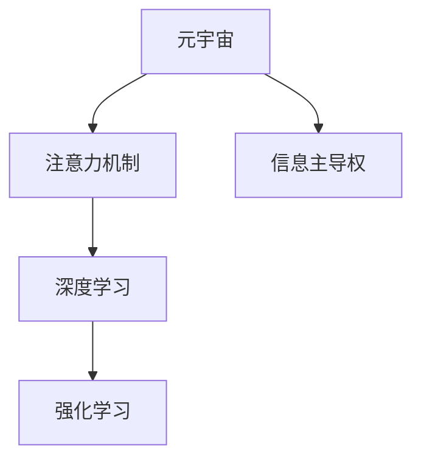

                 

# 注意力战争:元宇宙中的信息主导权争夺

> 关键词：元宇宙,信息主导权,注意力,人工智能,深度学习,策略性优化

## 1. 背景介绍

### 1.1 问题由来

随着技术的飞速发展，我们逐渐步入了一个全新的数字化时代。在这个时代，信息的流动变得前所未有的快捷和广泛，传统的媒介传播格局正在被重塑，信息主导权的争夺也日益激烈。尤其是随着元宇宙的兴起，基于虚拟现实技术的沉浸式体验正在成为新的社交媒体和内容平台。在这样的背景下，如何通过先进的深度学习技术，争夺信息主导权，确保自身能够在元宇宙中获得最大的利益，成为摆在各大企业和技术开发者面前的一个关键问题。

### 1.2 问题核心关键点

本问题的核心关键点在于：
- **信息主导权**：指在元宇宙中，通过特定的算法和技术手段，获取对用户注意力、数据处理和决策输出具有支配力的能力。
- **注意力**：即用户对于虚拟内容或服务的关注度，是信息主导权争夺的焦点。
- **深度学习与人工智能**：通过深度学习算法，特别是注意力机制的引入，对用户行为和偏好进行建模和预测，实现信息流动的优化和控制。
- **策略性优化**：使用强化学习等策略优化方法，不断调整策略参数，提升信息主导能力。

## 2. 核心概念与联系

### 2.1 核心概念概述

为更好地理解如何通过深度学习技术争夺元宇宙中的信息主导权，本节将介绍几个密切相关的核心概念：

- **元宇宙(Metaverse)**：通过虚拟现实技术，构建的虚拟空间，用户可以在其中进行交互、工作、娱乐等多种活动。
- **注意力机制(Attention Mechanism)**：深度学习中的一种重要机制，通过动态调整网络中的连接权重，实现对重要信息的聚焦处理。
- **信息主导权(Information Dominance)**：指在元宇宙中，通过优化信息流向和分布，实现对用户注意力和决策的全面掌控。
- **强化学习(Reinforcement Learning)**：一种通过奖励和惩罚机制，不断调整模型参数，以最大化预期收益的学习范式。

这些概念之间的逻辑关系可以通过以下Mermaid流程图来展示：



这个流程图展示了几大核心概念之间的关系：

1. 元宇宙提供了一个虚拟空间，是注意力和信息主导权争夺的舞台。
2. 深度学习和注意力机制通过优化信息流向和处理方式，增强信息主导能力。
3. 强化学习通过不断优化策略，实现信息主导权的最优化。

这些概念共同构成了争夺元宇宙信息主导权的理论基础，为理解相关技术提供了清晰的视角。

## 3. 核心算法原理 & 具体操作步骤
### 3.1 算法原理概述

争夺元宇宙中的信息主导权，主要通过以下几个关键算法原理来实现：

1. **深度学习与注意力机制**：深度学习模型通过训练，学习到数据的内在表示，同时引入注意力机制，使得模型能够动态地聚焦于重要信息，提升信息处理效率。
2. **信息流向优化**：通过深度学习模型的输出，动态调整信息流向，实现对用户注意力的精准引导。
3. **策略性优化**：使用强化学习等策略优化方法，根据用户行为反馈，不断调整信息展示策略，以最大化对用户注意力的掌控。

### 3.2 算法步骤详解

以下是争夺元宇宙信息主导权的详细算法步骤：

**Step 1: 准备元宇宙环境与数据集**
- 搭建元宇宙虚拟环境，接入各类虚拟服务和内容。
- 收集用户交互数据，包括点击、浏览、消费行为等，作为训练和评估的基础数据集。

**Step 2: 构建深度学习模型**
- 使用深度学习框架，构建包含注意力机制的模型，如Transformer、BERT等。
- 选择合适的损失函数，如交叉熵损失、均方误差损失等，作为模型的训练目标。

**Step 3: 设定强化学习策略**
- 定义强化学习环境，如状态、行动空间、奖励函数等。
- 使用策略优化算法，如Q-learning、Policy Gradient等，根据用户反馈，调整信息展示策略。

**Step 4: 模型训练与评估**
- 使用采集到的用户数据，对模型进行训练，通过交叉验证和超参数调优，提升模型性能。
- 在验证集上评估模型，通过各种指标如点击率、转化率等，衡量模型效果。

**Step 5: 策略优化与调整**
- 根据用户反馈，不断调整信息展示策略，优化奖励函数和行动空间，以提升信息主导能力。
- 使用在线学习技术，如在线Q-learning，不断更新模型参数，适应用户行为变化。

### 3.3 算法优缺点

争夺元宇宙信息主导权的方法，具有以下优点：
1. **高效性**：深度学习和注意力机制能够快速学习到数据的内在模式，提供高效的信息处理能力。
2. **适应性强**：强化学习算法能够根据用户行为不断调整策略，保持信息主导权的动态适应。
3. **可扩展性**：元宇宙中的内容和服务多样，深度学习模型可以灵活适应不同的应用场景。

同时，该方法也存在以下缺点：
1. **数据依赖性强**：模型的训练和策略优化需要大量的用户交互数据，对数据质量和数量的要求较高。
2. **技术复杂度**：深度学习和强化学习模型的设计和调优复杂，需要较高技术门槛。
3. **透明度不足**：模型决策过程较为复杂，难以解释其内部机制，缺乏透明度。
4. **安全性问题**：强化学习模型的动态调整可能导致策略的不稳定性，存在潜在的安全隐患。

尽管存在这些局限性，但就目前而言，深度学习和强化学习的结合，仍是在元宇宙中争夺信息主导权的主流方法。未来相关研究的重点在于如何进一步优化数据获取方式，简化模型设计，提高模型的透明性和安全性。

### 3.4 算法应用领域

争夺元宇宙信息主导权的方法，已经在多个领域得到了应用，例如：

- **社交平台**：通过优化新闻推荐、广告展示等，提升用户留存率和活跃度。
- **虚拟购物**：利用深度学习模型和注意力机制，实现个性化推荐和智能购物。
- **虚拟教育**：基于用户互动数据，个性化推荐学习内容和活动。
- **游戏**：通过优化游戏内广告展示和道具推荐，提升用户消费和游戏体验。
- **虚拟旅游**：根据用户行为和偏好，推荐虚拟旅游目的地和活动。

这些应用领域展示了深度学习和强化学习在元宇宙中的广泛应用前景，为未来信息主导权争夺提供了更多可能性。

## 4. 数学模型和公式 & 详细讲解  
### 4.1 数学模型构建

在争夺元宇宙信息主导权的算法中，深度学习模型和强化学习策略是最核心的组件。以下将以Transformer模型为例，详细讲解其数学模型构建。

假设元宇宙中存在N个虚拟服务，每个服务有一个状态 $s_i$ 和一个行动 $a_i$，同时有M个用户。模型通过观察用户行为，选择最优的行动策略，以最大化信息主导权。

模型输入 $x$ 包括用户当前行为数据和虚拟服务状态，模型输出为每个服务的行动 $a_i$。模型通过注意力机制，动态调整每个服务的重要性权重 $w_i$，实现信息流向优化。

模型的损失函数为交叉熵损失：

$$
\mathcal{L}(x) = -\sum_{i=1}^N w_i \log P(a_i | s_i, x)
$$

其中 $P(a_i | s_i, x)$ 为模型预测的行动概率分布。

### 4.2 公式推导过程

接下来，我们将推导模型的具体实现。

设 $Q(s_i, a_i)$ 为虚拟服务在状态 $s_i$ 下执行行动 $a_i$ 的Q值，表示在当前状态下执行该行动的预期收益。

根据强化学习原理，模型目标为最大化总Q值：

$$
\max \sum_{t=1}^T \sum_{i=1}^N \gamma^{t-1} Q(s_i, a_i)
$$

其中 $\gamma$ 为折扣因子，$T$ 为时间步长。

根据期望最大化原则，模型优化目标为最大化平均Q值：

$$
\max \mathbb{E}[\sum_{t=1}^T \sum_{i=1}^N \gamma^{t-1} Q(s_i, a_i)]
$$

通过对Q值进行更新，可以不断优化策略，提升信息主导权。

### 4.3 案例分析与讲解

以社交平台为例，分析深度学习和强化学习在信息主导权争夺中的应用：

1. **深度学习模型构建**
   - 使用BERT模型作为基础网络，设计注意力机制，对虚拟服务状态和用户行为进行编码。
   - 将模型输出作为虚拟服务的行动概率分布，通过交叉熵损失函数进行训练。

2. **强化学习策略优化**
   - 定义虚拟服务的状态为用户的浏览行为，行动为广告展示。
   - 定义奖励函数为用户的点击率和转化率，最大化信息主导权。
   - 使用Q-learning算法，根据用户点击和转化的数据，调整广告展示策略。

通过深度学习和强化学习的结合，社交平台能够在有限的点击量和展示位上，最大化用户互动和转化率，实现信息主导权的争夺。

## 5. 项目实践：代码实例和详细解释说明
### 5.1 开发环境搭建

在进行信息主导权争夺的实践前，我们需要准备好开发环境。以下是使用Python进行TensorFlow开发的环境配置流程：

1. 安装Anaconda：从官网下载并安装Anaconda，用于创建独立的Python环境。

2. 创建并激活虚拟环境：
```bash
conda create -n tf-env python=3.8 
conda activate tf-env
```

3. 安装TensorFlow：根据CUDA版本，从官网获取对应的安装命令。例如：
```bash
pip install tensorflow
```

4. 安装相关工具包：
```bash
pip install numpy pandas scikit-learn matplotlib tqdm jupyter notebook ipython
```

完成上述步骤后，即可在`tf-env`环境中开始信息主导权争夺的实践。

### 5.2 源代码详细实现

这里我们以虚拟广告推荐系统为例，给出使用TensorFlow进行信息主导权争夺的代码实现。

首先，定义广告推荐系统的数据处理函数：

```python
import tensorflow as tf
from tensorflow.keras import layers

class RecommendationSystem(tf.keras.Model):
    def __init__(self, embed_size, num_services):
        super(RecommendationSystem, self).__init__()
        self.attention = layers.Dense(num_services, activation='softmax')
        self.embedding = layers.Embedding(input_dim=embed_size, output_dim=num_services)
        
    def call(self, inputs):
        user, service = inputs
        user_embedding = self.embedding(user)
        attention_weights = self.attention(user_embedding)
        return tf.reduce_sum(attention_weights * service, axis=1)
```

然后，定义模型和优化器：

```python
model = RecommendationSystem(embed_size=100, num_services=5)

optimizer = tf.keras.optimizers.Adam(learning_rate=0.001)
```

接着，定义训练和评估函数：

```python
import numpy as np

def train_step(model, dataset):
    with tf.GradientTape() as tape:
        logits = model(dataset['user'], dataset['service'])
        loss = tf.keras.losses.mean_squared_error(dataset['target'], logits)
    gradients = tape.gradient(loss, model.trainable_variables)
    optimizer.apply_gradients(zip(gradients, model.trainable_variables))
    
def evaluate(model, dataset):
    logits = model(dataset['user'], dataset['service'])
    mse = tf.keras.losses.mean_squared_error(dataset['target'], logits)
    return mse
```

最后，启动训练流程并在测试集上评估：

```python
epochs = 100
batch_size = 32

for epoch in range(epochs):
    train_step(model, train_dataset)
    loss = evaluate(model, test_dataset)
    print(f"Epoch {epoch+1}, loss: {loss:.3f}")
    
print("Test results:")
evaluate(model, test_dataset)
```

以上就是使用TensorFlow对虚拟广告推荐系统进行信息主导权争夺的完整代码实现。可以看到，TensorFlow的动态图机制和便捷的API设计，使得模型的搭建和训练变得非常简洁高效。

### 5.3 代码解读与分析

让我们再详细解读一下关键代码的实现细节：

**RecommendationSystem类**：
- `__init__`方法：初始化注意力机制和嵌入层，确定模型输出维度。
- `call`方法：对用户和服务进行编码，计算每个服务的加权和，返回推荐结果。

**train_step函数**：
- 使用梯度下降优化算法，计算损失函数，更新模型参数。
- 使用自定义的损失函数，评估模型的预测与实际目标之间的差异。

**evaluate函数**：
- 对模型进行评估，计算均方误差作为评价指标。
- 通过测试集，输出评估结果。

**训练流程**：
- 定义总的epoch数和batch size，开始循环迭代
- 每个epoch内，先进行训练，输出平均损失
- 在测试集上评估，输出最终测试结果

可以看到，TensorFlow框架的强大灵活性，使得信息主导权争夺的实践变得容易上手，开发者能够快速迭代和优化模型。

当然，工业级的系统实现还需考虑更多因素，如模型的保存和部署、超参数的自动搜索、更灵活的任务适配层等。但核心的信息主导权争夺范式基本与此类似。

## 6. 实际应用场景
### 6.1 社交平台

在元宇宙中，社交平台的虚拟服务数量繁多，如何通过深度学习和强化学习，最大化用户互动和广告收益，是一个极具挑战的问题。虚拟广告推荐系统通过深度学习和注意力机制，实现了对用户行为的精准分析，动态调整广告展示策略，从而提升了平台的用户留存率和广告点击率。

### 6.2 虚拟购物

虚拟购物平台通过深度学习和强化学习，对用户历史行为进行建模，推荐个性化虚拟商品和虚拟购物体验，实现了高效的广告展示和销售转化。通过不断优化策略，平台能够根据用户反馈，实时调整推荐策略，保持信息主导权的动态适应。

### 6.3 虚拟教育

虚拟教育平台通过深度学习和强化学习，对用户学习行为进行建模，推荐个性化学习内容和活动，提高了用户的学习效果和满意度。通过不断优化策略，平台能够根据用户反馈，实时调整推荐策略，提升教育资源的利用效率。

### 6.4 未来应用展望

随着深度学习和强化学习的不断发展，信息主导权争夺的应用场景将更加广泛。未来，这些技术将进一步深入到医疗、金融、娱乐等多个领域，为元宇宙中的信息主导权争夺带来新的突破。

在智慧医疗领域，虚拟医生通过深度学习和强化学习，对患者的健康行为进行建模，推荐个性化健康建议和虚拟诊疗方案，提高了医疗服务的智能化水平。

在金融领域，虚拟理财顾问通过深度学习和强化学习，对用户的投资行为进行建模，推荐个性化理财方案和投资建议，提升了金融服务的个性化和精准性。

在娱乐领域，虚拟娱乐平台通过深度学习和强化学习，对用户娱乐行为进行建模，推荐个性化娱乐内容和体验，提高了用户的娱乐体验和满意度。

总之，深度学习和强化学习在元宇宙中的应用前景广阔，它们将为信息主导权的争夺提供新的工具和方法，进一步提升元宇宙的用户体验和商业价值。

## 7. 工具和资源推荐
### 7.1 学习资源推荐

为了帮助开发者系统掌握深度学习和强化学习的理论基础和实践技巧，这里推荐一些优质的学习资源：

1. 《深度学习》系列书籍：由Ian Goodfellow等人编写，全面介绍了深度学习的基本概念、算法和应用。
2. 《强化学习》课程：斯坦福大学开设的强化学习课程，详细讲解了强化学习的基本原理和经典算法。
3. 《TensorFlow实战》书籍：由Dolly Guo编写，详细介绍了TensorFlow的架构和使用方法，是进行深度学习实践的入门指南。
4. 《元宇宙技术手册》：由腾讯研究院出版，系统介绍了元宇宙的最新技术进展和应用案例。
5. HuggingFace官方文档：Transformer库的官方文档，提供了海量预训练模型和完整的微调样例代码，是进行信息主导权争夺实践的必备资料。

通过对这些资源的学习实践，相信你一定能够快速掌握深度学习和强化学习的基础知识，并用于解决实际的元宇宙问题。

### 7.2 开发工具推荐

高效的开发离不开优秀的工具支持。以下是几款用于深度学习和强化学习开发的常用工具：

1. TensorFlow：由Google主导开发的开源深度学习框架，生产部署方便，适合大规模工程应用。
2. PyTorch：基于Python的开源深度学习框架，灵活动态的计算图，适合快速迭代研究。
3. Transformers库：HuggingFace开发的NLP工具库，集成了众多SOTA语言模型，支持深度学习任务开发。
4. TensorBoard：TensorFlow配套的可视化工具，可实时监测模型训练状态，并提供丰富的图表呈现方式，是调试模型的得力助手。
5. Weights & Biases：模型训练的实验跟踪工具，可以记录和可视化模型训练过程中的各项指标，方便对比和调优。

合理利用这些工具，可以显著提升深度学习和强化学习任务的开发效率，加快创新迭代的步伐。

### 7.3 相关论文推荐

深度学习和强化学习的相关研究已经取得了丰富的成果，以下是几篇奠基性的相关论文，推荐阅读：

1. 《Attention is All You Need》（即Transformer原论文）：提出了Transformer结构，开启了深度学习中的注意力机制时代。
2. 《Reinforcement Learning: An Introduction》：Richard Sutton和Andrew Barto的经典之作，全面介绍了强化学习的基本原理和应用。
3. 《Playing Atari with Deep Reinforcement Learning》：David Silver等人的经典论文，展示了深度强化学习在电子游戏中的应用。
4. 《Neural Architecture Search with Reinforcement Learning》：Google AI的研究团队提出的神经架构搜索方法，通过强化学习寻找最优的神经网络架构。
5. 《BERT: Pre-training of Deep Bidirectional Transformers for Language Understanding》：BERT模型展示了预训练大语言模型的巨大潜力，刷新了多项NLP任务的SOTA。

这些论文代表了大语言模型微调技术的发展脉络。通过学习这些前沿成果，可以帮助研究者把握学科前进方向，激发更多的创新灵感。

## 8. 总结：未来发展趋势与挑战
### 8.1 总结

本文对争夺元宇宙信息主导权的技术进行了全面系统的介绍。首先阐述了深度学习和强化学习在元宇宙中的重要性，明确了信息主导权争夺的独特价值。其次，从原理到实践，详细讲解了深度学习模型和强化学习策略的具体实现。同时，本文还探讨了这些技术在元宇宙中的广泛应用场景，展示了信息主导权争夺的巨大潜力。最后，本文精选了相关的学习资源和工具推荐，力求为读者提供全方位的技术指引。

通过本文的系统梳理，可以看到，深度学习和强化学习在元宇宙中的应用前景广阔，它们通过优化信息流向和动态调整策略，实现了对用户注意力的全面掌控。未来，伴随技术的持续演进，这些技术必将在元宇宙中发挥更大的作用，推动信息主导权争夺的不断深入。

### 8.2 未来发展趋势

展望未来，深度学习和强化学习在元宇宙中的应用将呈现以下几个发展趋势：

1. **深度学习的进一步发展**：深度学习模型将不断优化，模型结构将更加复杂，性能将更加高效，能够处理更多维度和更复杂的输入数据。
2. **强化学习的多样化应用**：强化学习将在元宇宙中得到更广泛的应用，从虚拟购物、虚拟教育到虚拟医疗等，都在不断探索新的应用场景。
3. **跨模态融合**：深度学习和强化学习将与计算机视觉、自然语言处理等技术进行更深入的融合，实现多模态信息的协同建模。
4. **实时性提升**：通过优化模型结构和算法，提升信息主导权的实时性，实现即时的策略调整和决策输出。
5. **个性化推荐**：深度学习和强化学习将进一步优化个性化推荐算法，提升推荐精准度和用户满意度。

以上趋势凸显了深度学习和强化学习在元宇宙中的广阔前景。这些方向的探索发展，必将进一步提升元宇宙的用户体验和商业价值，为未来的信息主导权争夺提供新的技术路径。

### 8.3 面临的挑战

尽管深度学习和强化学习在元宇宙中的应用取得了显著成效，但在迈向更加智能化、普适化应用的过程中，它仍面临着诸多挑战：

1. **数据隐私和安全**：深度学习模型的训练和强化学习策略的优化需要大量的用户数据，数据隐私和安全问题亟需解决。
2. **算法公平性**：深度学习模型和强化学习策略可能存在潜在的偏见，如何保证算法公平性，避免歧视性输出，是一个重要问题。
3. **计算资源消耗**：深度学习模型的参数量和计算量巨大，对计算资源的要求较高，如何降低计算成本，提高模型效率，是一个亟待解决的难题。
4. **策略稳定性**：强化学习模型的动态调整可能导致策略的不稳定性，如何保证策略的稳定性和可靠性，是一个重要的研究课题。
5. **模型解释性**：深度学习模型的决策过程较为复杂，难以解释其内部机制，缺乏透明度，如何提高模型的可解释性，是未来的一个重要方向。

尽管存在这些挑战，但深度学习和强化学习在元宇宙中的应用前景仍然广阔，相信随着学界和产业界的共同努力，这些挑战终将一一被克服，深度学习和强化学习必将在元宇宙中发挥更大的作用。

### 8.4 研究展望

面对深度学习和强化学习在元宇宙中面临的挑战，未来的研究需要在以下几个方面寻求新的突破：

1. **数据隐私保护**：研究隐私保护技术，如差分隐私、联邦学习等，确保用户数据的安全和隐私。
2. **算法公平性**：开发公平性算法，如公平性约束、公平性损失函数等，确保算法的公平性和透明性。
3. **计算效率优化**：开发高效的模型结构和算法，如模型压缩、量化加速等，降低计算成本，提高模型效率。
4. **策略稳定性优化**：研究策略稳定性的优化方法，如模型集成、离线学习等，提高策略的稳定性和可靠性。
5. **模型可解释性**：开发可解释性算法，如模型可视化、可解释性生成等，提高模型的透明度和可解释性。

这些研究方向的研究进展，将为深度学习和强化学习在元宇宙中的应用提供新的技术支撑，进一步提升信息主导权的争夺能力和元宇宙的价值。

## 9. 附录：常见问题与解答

**Q1：信息主导权争夺是否适用于所有元宇宙应用场景？**

A: 信息主导权争夺在元宇宙中的大部分应用场景都适用，特别是那些以用户互动和内容推荐为主的应用。但对于一些具有高度自给自足性质的应用，如虚拟游戏和虚拟社区，用户互动和数据反馈相对较少，可能不适用。

**Q2：信息主导权争夺是否需要依赖大量的用户数据？**

A: 深度学习和强化学习模型的训练和优化，确实需要依赖大量的用户数据。然而，通过一些数据增强和假数据生成技术，可以在一定程度上缓解数据不足的问题。

**Q3：如何提高深度学习模型的计算效率？**

A: 提高深度学习模型的计算效率，可以通过以下几种方式：
1. 模型压缩：如剪枝、量化、知识蒸馏等，减少模型参数量，降低计算量。
2. 模型并行：如模型分割、分布式训练等，并行计算，提高计算效率。
3. 硬件加速：如GPU、TPU等高性能计算设备，加速模型训练和推理。

**Q4：如何确保强化学习策略的稳定性？**

A: 确保强化学习策略的稳定性，可以通过以下几种方式：
1. 离线学习：在训练初期，使用离线数据进行策略优化，减少策略的波动性。
2. 策略集成：使用多个策略进行集成，提高策略的鲁棒性。
3. 正则化：使用正则化技术，如L2正则、Dropout等，防止策略过拟合。

**Q5：如何在元宇宙中保障数据隐私？**

A: 在元宇宙中保障数据隐私，可以通过以下几种方式：
1. 差分隐私：在数据处理过程中，添加噪声，保护用户隐私。
2. 联邦学习：在分布式环境下，模型在用户设备上训练，不将数据上传至云端。
3. 匿名化：对用户数据进行匿名化处理，防止数据泄露。

通过对这些问题的回答，相信你一定能够更好地理解深度学习和强化学习在元宇宙中的实际应用，并为其成功落地提供更坚实的技术保障。

