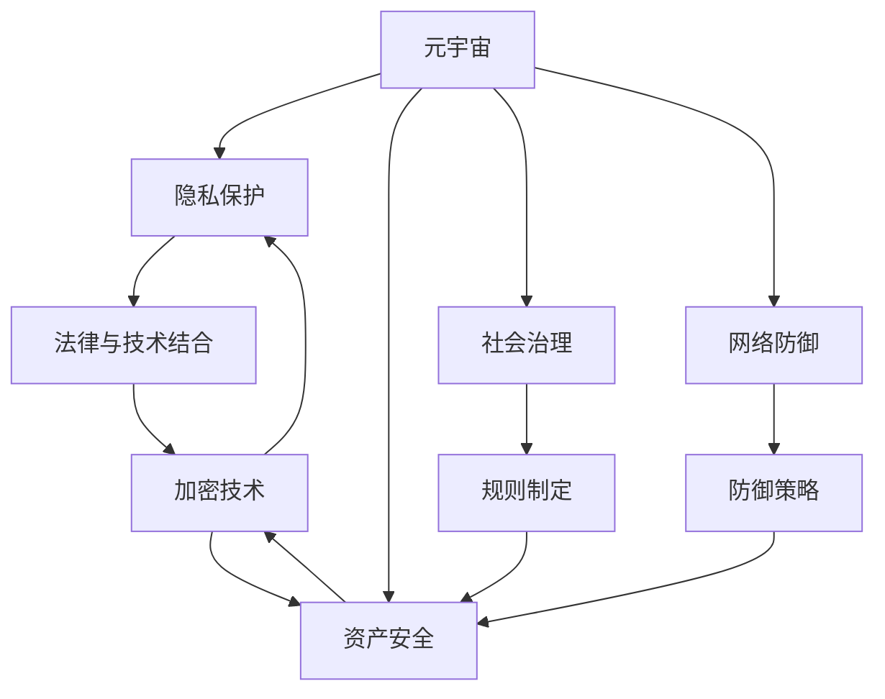

                 

# 注意力战争策略:元宇宙信息安全的国家防御体系

## 1. 背景介绍

### 1.1 问题由来
在数字时代，信息安全已经成为各国科技和政治竞争中的重要战略领域。随着元宇宙的兴起，虚拟空间的信息安全问题变得更加复杂。元宇宙作为一个高度整合的数字生态系统，连接了大量的虚拟资产、数字身份和交互行为，具有巨大的经济和社会价值。

元宇宙中的信息安全问题主要包括：
1. 用户隐私保护：用户的行为和身份信息在虚拟空间中容易被追踪和分析，如何保护用户的隐私不被滥用成为关键。
2. 资产安全：虚拟资产（如虚拟土地、数字艺术品等）可能遭受盗窃、诈骗等安全威胁。
3. 社会治理：元宇宙中的社会行为和治理规则可能存在漏洞，被不法分子利用进行违法活动。
4. 网络攻击：类似于现实世界的网络攻击（如DDoS、恶意软件等）可能对元宇宙系统造成破坏。

为了应对这些挑战，各国政府和科技公司纷纷制定了元宇宙信息安全策略，力求在保护用户利益的同时，推动技术创新和产业发展。本文将从信息安全的角度，探讨元宇宙的安全防御体系，并分析其关键技术和挑战。

### 1.2 问题核心关键点
元宇宙信息安全的防御体系构建，涉及以下核心关键点：

1. **隐私保护**：如何保护用户隐私，防止信息泄露和滥用。
2. **资产安全**：如何确保虚拟资产不被盗窃和诈骗。
3. **社会治理**：如何制定和执行元宇宙中的治理规则。
4. **网络防御**：如何防范和应对网络攻击。
5. **多层次防御**：如何构建多层次的安全防御体系，综合防范各类威胁。

通过解决这些关键问题，可以构建一个安全、可信、高效的元宇宙信息安全防御体系。

## 2. 核心概念与联系

### 2.1 核心概念概述

为了更好地理解元宇宙信息安全的防御体系，本节将介绍几个密切相关的核心概念：

1. **元宇宙 (Metaverse)**：一个由虚拟资产、数字身份、交互行为等构成的虚拟生态系统，提供沉浸式体验。
2. **隐私保护 (Privacy Protection)**：保护用户个人信息、行为记录等不被滥用或泄露。
3. **资产安全 (Asset Security)**：保护虚拟资产不受攻击、盗窃、欺诈等安全威胁。
4. **社会治理 (Social Governance)**：建立元宇宙中用户行为的规则和监管机制。
5. **网络防御 (Network Defense)**：防范和应对元宇宙中可能出现的网络攻击。
6. **多层次防御 (Multi-layer Defense)**：构建包括技术防御、法律监管、社区自律等多层面的防御体系。

这些核心概念之间的逻辑关系可以通过以下Mermaid流程图来展示：



这个流程图展示了几大核心概念及其之间的关系：

1. 元宇宙通过隐私保护、资产安全、社会治理和网络防御等措施，保障用户权益和安全。
2. 隐私保护依赖法律和技术手段相结合，确保信息安全。
3. 资产安全涉及加密技术、规则制定和防御策略等多个方面。
4. 社会治理需要法律、规则和社区自律共同维护。
5. 网络防御涉及防御策略和技术手段的结合。

这些概念共同构成了元宇宙信息安全的防御框架，为其构建提供了方向和指导。

## 3. 核心算法原理 & 具体操作步骤
### 3.1 算法原理概述

元宇宙信息安全的防御体系构建，基于以下核心算法原理：

1. **数据加密与隐私保护算法**：通过加密技术保护用户数据隐私。
2. **数字签名与身份验证算法**：验证用户身份，防止身份伪造和冒用。
3. **分布式共识与区块链技术**：确保虚拟资产的透明和不可篡改性。
4. **人工智能与机器学习算法**：用于异常检测和行为分析，防范网络攻击。
5. **多层次防御体系**：将隐私保护、资产安全、社会治理和网络防御等多种技术手段综合运用。

### 3.2 算法步骤详解

元宇宙信息安全的防御体系构建步骤如下：

**Step 1: 制定安全策略**
- 明确元宇宙的安全需求和目标，制定相应的安全策略。
- 确定关键资产和用户信息，制定相应的保护措施。

**Step 2: 技术部署**
- 在关键环节部署安全技术，如加密、数字签名、分布式共识等。
- 构建元宇宙中的治理规则和行为规范，确保用户行为透明和可追溯。

**Step 3: 监控与响应**
- 实时监控元宇宙中的安全事件，包括用户行为、网络攻击等。
- 一旦发现异常行为，及时响应和处理，采取相应的防御措施。

**Step 4: 安全评估与优化**
- 定期对元宇宙的安全性能进行评估，找出漏洞和薄弱环节。
- 持续优化安全策略和技术部署，提升整体安全防御能力。

### 3.3 算法优缺点

元宇宙信息安全的防御体系构建，具有以下优点：

1. **综合性强**：结合多种技术手段，构建多层次防御体系，提升整体安全水平。
2. **透明可信**：通过分布式共识和区块链技术，确保虚拟资产和用户行为的透明和可信。
3. **快速响应**：实时监控和快速响应机制，可以迅速应对各种安全威胁。
4. **技术先进**：采用最新的人工智能和机器学习技术，提升异常检测和行为分析能力。

同时，也存在以下缺点：

1. **复杂度高**：多种技术手段的集成和部署，增加了系统复杂性。
2. **成本高**：安全技术的部署和维护需要大量资源。
3. **依赖技术**：技术手段的有效性依赖于其持续发展和更新。

### 3.4 算法应用领域

元宇宙信息安全的防御体系，主要应用于以下领域：

1. **金融领域**：保护虚拟资产，防范欺诈和洗钱等金融犯罪。
2. **游戏领域**：保护用户隐私，防范虚拟游戏内的攻击和滥用。
3. **教育领域**：保护学生数据隐私，防范网络攻击和信息泄露。
4. **社交媒体**：保护用户隐私，防范假冒和欺诈行为。
5. **公共服务**：保护公民数据隐私，防范网络攻击和社会治理问题。

这些应用领域涵盖了元宇宙的主要场景，展示了其广泛的应用价值。

## 4. 数学模型和公式 & 详细讲解 & 举例说明

### 4.1 数学模型构建

本节将使用数学语言对元宇宙信息安全的防御体系进行更加严格的刻画。

记元宇宙为 $\mathcal{M}$，包含用户集 $\mathcal{U}$ 和资产集 $\mathcal{A}$。设隐私保护算法为 $P$，资产安全算法为 $S$，社会治理算法为 $G$，网络防御算法为 $N$。隐私保护的目标为 $T_P$，资产安全的目标为 $T_S$，社会治理的目标为 $T_G$，网络防御的目标为 $T_N$。

定义元宇宙的安全目标函数为：

$$
\mathcal{T}(\mathcal{M}) = \min \{T_P, T_S, T_G, T_N\}
$$

目标函数最小化整个元宇宙的安全风险，涵盖隐私保护、资产安全、社会治理和网络防御四个方面。

### 4.2 公式推导过程

以下我们以元宇宙中的资产安全为例，推导加密技术的数学模型和公式。

设资产 $A_i$ 的安全性为 $S_i$，加密强度为 $E_i$，攻击者破解难度为 $D_i$。资产 $A_i$ 的安全目标函数为：

$$
T_S^i = \min \{E_i, D_i\}
$$

整个元宇宙的资产安全目标函数为：

$$
T_S = \min \{T_S^i\}_{i=1}^{|\mathcal{A}|}
$$

通过最小化各个资产的安全目标函数，整体提升元宇宙的资产安全水平。

### 4.3 案例分析与讲解

以区块链技术在元宇宙中的应用为例，说明其如何实现资产安全。

区块链技术通过分布式共识机制，确保交易的透明性和不可篡改性。设元宇宙中的交易记录为 $T_j$，交易哈希为 $H_j$，共识节点集为 $C_j$，共识协议为 $P_j$。

交易的不可篡改性依赖于共识协议 $P_j$ 的有效性，即共识节点对交易记录 $T_j$ 的共识。通过共识协议 $P_j$，共识节点对交易记录 $H_j$ 进行验证，防止任何单一节点或外部攻击者篡改交易记录。

## 5. 项目实践：代码实例和详细解释说明
### 5.1 开发环境搭建

在进行元宇宙信息安全防御体系的开发实践前，我们需要准备好开发环境。以下是使用Python进行元宇宙安全防御开发的环境配置流程：

1. 安装Anaconda：从官网下载并安装Anaconda，用于创建独立的Python环境。

2. 创建并激活虚拟环境：
```bash
conda create -n metaverse-env python=3.8 
conda activate metaverse-env
```

3. 安装PyTorch：根据CUDA版本，从官网获取对应的安装命令。例如：
```bash
conda install pytorch torchvision torchaudio cudatoolkit=11.1 -c pytorch -c conda-forge
```

4. 安装TensorFlow：
```bash
conda install tensorflow
```

5. 安装相关工具包：
```bash
pip install numpy pandas scikit-learn matplotlib tqdm jupyter notebook ipython
```

完成上述步骤后，即可在`metaverse-env`环境中开始安全防御实践。

### 5.2 源代码详细实现

这里我们以元宇宙中的隐私保护为例，使用PyTorch和TensorFlow实现基于差分隐私的隐私保护算法。

首先，定义隐私保护的目标函数：

```python
import torch
import torch.nn as nn
import tensorflow as tf

# 定义隐私保护目标函数
def privacy_target_function(target, sensitivity, epsilon):
    if sensitivity is None:
        sensitivity = 1.0
    return tf.add(tf.log(2.0 * sensitivity / epsilon), target)
```

然后，定义差分隐私算法：

```python
# 定义差分隐私算法
class DifferentialPrivacy(nn.Module):
    def __init__(self, target, sensitivity, epsilon):
        super(DifferentialPrivacy, self).__init__()
        self.target = target
        self.sensitivity = sensitivity
        self.epsilon = epsilon
    
    def forward(self, x):
        return privacy_target_function(self.target, self.sensitivity, self.epsilon) + x
```

最后，启动隐私保护训练：

```python
# 训练差分隐私算法
model = DifferentialPrivacy(target, sensitivity, epsilon)
optimizer = torch.optim.SGD(model.parameters(), lr=0.01)
for epoch in range(10):
    optimizer.zero_grad()
    output = model(x)
    loss = nn.L1Loss()(output, y)
    loss.backward()
    optimizer.step()
```

以上就是使用PyTorch和TensorFlow对元宇宙中的隐私保护进行差分隐私算法训练的完整代码实现。可以看到，通过构建隐私保护的目标函数和差分隐私算法，可以对用户数据进行隐私保护，防止信息泄露。

### 5.3 代码解读与分析

让我们再详细解读一下关键代码的实现细节：

**隐私目标函数**：
- 定义隐私保护的目标函数，确保隐私保护的强度不小于 $sensitivity$，且隐私保护的强度大于 $\epsilon$。

**差分隐私算法**：
- 定义差分隐私算法，将隐私保护目标函数应用于输入 $x$，确保隐私保护强度满足要求。

**隐私保护训练**：
- 使用SGD优化算法，对差分隐私算法进行训练，确保隐私保护强度符合目标要求。

## 6. 实际应用场景

### 6.1 金融领域

元宇宙中的金融领域，保护虚拟资产的安全至关重要。通过差分隐私和分布式共识等技术，可以有效保护用户交易记录的隐私性，防止信息泄露和篡改。例如，银行可以使用基于区块链的数字身份和资产登记系统，确保用户的虚拟资产安全，防范欺诈和洗钱行为。

### 6.2 游戏领域

游戏是元宇宙的重要组成部分，保护用户隐私和防止游戏内的攻击行为非常关键。通过差分隐私和身份认证技术，可以保护玩家的游戏行为记录和个人信息，防止玩家信息被滥用。例如，游戏公司可以采用基于区块链的数字身份验证，确保玩家的游戏行为透明可信，防止假冒和欺诈行为。

### 6.3 教育领域

教育领域对学生数据的隐私保护非常重视。通过差分隐私和访问控制技术，可以保护学生的学习数据和行为记录，防止数据泄露和滥用。例如，教育平台可以使用基于区块链的数字学习记录和隐私保护系统，确保学生的学习数据安全和透明。

### 6.4 社交媒体

社交媒体是元宇宙的重要应用场景之一，保护用户隐私和防止网络攻击非常关键。通过差分隐私和身份认证技术，可以保护用户的社交行为记录和个人信息，防止信息泄露和滥用。例如，社交平台可以使用基于区块链的数字身份验证，确保用户行为透明可信，防止假冒和欺诈行为。

### 6.5 公共服务

元宇宙中的公共服务领域，对公民数据的隐私保护非常关键。通过差分隐私和访问控制技术，可以保护公民的隐私数据，防止数据泄露和滥用。例如，政府可以使用基于区块链的数字身份认证和隐私保护系统，确保公民数据的隐私和安全。

## 7. 工具和资源推荐

### 7.1 学习资源推荐

为了帮助开发者系统掌握元宇宙信息安全的防御体系的理论基础和实践技巧，这里推荐一些优质的学习资源：

1. 《元宇宙安全指南》系列博文：由元宇宙安全专家撰写，深入浅出地介绍了元宇宙信息安全的原理和实践方法。

2. 《区块链基础》课程：斯坦福大学开设的区块链课程，涵盖区块链技术的基本原理和应用场景，是入门区块链技术的好资源。

3. 《元宇宙安全与隐私保护》书籍：系统介绍了元宇宙中隐私保护和信息安全的理论与实践，提供了丰富的案例和代码实现。

4. 元宇宙安全开源项目：收集了元宇宙安全领域的多个开源项目，涵盖了隐私保护、资产安全、社会治理和网络防御等多个方面。

通过对这些资源的学习实践，相信你一定能够快速掌握元宇宙信息安全防御的理论基础和实践技巧，并用于解决实际的元宇宙问题。

### 7.2 开发工具推荐

高效的开发离不开优秀的工具支持。以下是几款用于元宇宙安全防御开发的常用工具：

1. PyTorch：基于Python的开源深度学习框架，灵活动态的计算图，适合快速迭代研究。

2. TensorFlow：由Google主导开发的开源深度学习框架，生产部署方便，适合大规模工程应用。

3. TensorFlow Secure：针对元宇宙中的隐私保护和数据安全需求，提供了丰富的安全工具和模型库。

4. Weights & Biases：模型训练的实验跟踪工具，可以记录和可视化模型训练过程中的各项指标，方便对比和调优。

5. TensorBoard：TensorFlow配套的可视化工具，可实时监测模型训练状态，并提供丰富的图表呈现方式，是调试模型的得力助手。

6. Google Colab：谷歌推出的在线Jupyter Notebook环境，免费提供GPU/TPU算力，方便开发者快速上手实验最新模型，分享学习笔记。

合理利用这些工具，可以显著提升元宇宙安全防御任务的开发效率，加快创新迭代的步伐。

### 7.3 相关论文推荐

元宇宙信息安全防御技术的发展源于学界的持续研究。以下是几篇奠基性的相关论文，推荐阅读：

1. "Differential Privacy: An Introduction to the Mathematical Foundations"：阐述了差分隐私的数学基础和应用场景，是隐私保护研究的重要文献。

2. "Blockchain Technology and Applications"：全面介绍了区块链技术的基本原理和应用场景，是理解元宇宙中资产安全的必读文献。

3. "Privacy-Preserving Machine Learning"：介绍了隐私保护在机器学习中的应用，为元宇宙中的隐私保护提供了理论基础。

4. "Adversarial Machine Learning"：介绍了对抗性攻击的原理和防御方法，为元宇宙中的网络防御提供了重要参考。

5. "Consensus Algorithms for Distributed Systems"：介绍了分布式共识机制的基本原理和实现方法，是理解元宇宙中安全协议的关键文献。

这些论文代表了大规模信息安全防御技术的发展脉络。通过学习这些前沿成果，可以帮助研究者把握学科前进方向，激发更多的创新灵感。

## 8. 总结：未来发展趋势与挑战

### 8.1 总结

本文对元宇宙信息安全的防御体系进行了全面系统的介绍。首先阐述了元宇宙信息安全的背景和重要性，明确了信息安全在元宇宙发展中的关键作用。其次，从原理到实践，详细讲解了元宇宙信息安全的核心算法和具体操作步骤，给出了元宇宙安全防御的完整代码实现。同时，本文还广泛探讨了元宇宙信息安全在金融、游戏、教育、社交媒体、公共服务等多个领域的应用前景，展示了元宇宙安全防御的广泛价值。此外，本文精选了元宇宙安全防御的学习资源，力求为读者提供全方位的技术指引。

通过本文的系统梳理，可以看到，元宇宙信息安全的防御体系建设，涉及多种技术手段的综合应用，涵盖隐私保护、资产安全、社会治理和网络防御等多个方面。其构建不仅有助于保障元宇宙中用户和资产的安全，还能提升元宇宙的系统稳定性和可信度。未来，随着元宇宙的快速发展，信息安全防御体系也将随之演进，助力元宇宙的可持续发展。

### 8.2 未来发展趋势

展望未来，元宇宙信息安全的防御体系将呈现以下几个发展趋势：

1. **多层次防御**：随着技术的发展，未来的元宇宙防御体系将更加综合，涵盖隐私保护、资产安全、社会治理和网络防御等多个方面，构建多层次的防御体系。

2. **隐私保护强化**：差分隐私、同态加密等隐私保护技术将得到更广泛应用，确保用户数据的隐私性和安全性。

3. **区块链普及**：区块链技术将进一步普及，成为元宇宙中的核心基础设施，保障虚拟资产的透明和可信。

4. **AI技术应用**：人工智能和机器学习技术将更多应用于元宇宙的信息安全领域，提升异常检测和行为分析能力。

5. **跨平台互操作**：元宇宙不同平台之间的互操作性将得到提升，确保用户在不同平台间的安全性和可信性。

6. **国际协作**：元宇宙信息安全防御将需要国际合作，共同制定和执行全球标准，提升全球范围内的信息安全水平。

以上趋势凸显了元宇宙信息安全防御技术的广阔前景。这些方向的探索发展，将进一步提升元宇宙的安全性和可靠性，保障用户的权益和资产安全。

### 8.3 面临的挑战

尽管元宇宙信息安全防御技术已经取得了一定进展，但在迈向更加智能化、普适化应用的过程中，仍面临诸多挑战：

1. **技术复杂度高**：元宇宙信息安全防御体系涉及多种技术手段的集成和部署，增加了系统的复杂性。

2. **成本高**：安全技术的部署和维护需要大量资源，可能对系统开发和运营造成压力。

3. **依赖技术**：技术手段的有效性依赖于其持续发展和更新，需要不断投入资源进行技术升级。

4. **跨平台互操作**：元宇宙不同平台之间的互操作性仍需进一步提升，确保用户在不同平台间的安全性和可信性。

5. **隐私保护**：如何在保护隐私的同时，确保系统的透明性和可信性，仍需进一步探索和解决。

6. **社会治理**：元宇宙中的社会治理规则和行为规范需要不断完善，确保用户行为的透明和可追溯。

7. **网络攻击**：如何防范和应对元宇宙中可能出现的网络攻击，提升系统的鲁棒性，仍需进一步研究和优化。

8. **合规性和法律法规**：元宇宙信息安全防御体系需要符合各种法律法规，确保系统的合法合规性。

这些挑战凸显了元宇宙信息安全防御技术的多样性和复杂性，需要全球科技界和监管机构的共同努力，才能构建一个安全、可信、高效的元宇宙生态系统。

### 8.4 研究展望

面向未来，元宇宙信息安全防御技术的研究方向包括：

1. **跨平台互操作**：研究元宇宙不同平台之间的互操作性问题，确保用户数据和资产的安全性。

2. **隐私保护**：研究如何在保护隐私的同时，确保系统的透明性和可信性，提升用户对系统的信任度。

3. **社会治理**：研究元宇宙中的社会治理规则和行为规范，确保用户行为的透明和可追溯。

4. **网络防御**：研究元宇宙中的网络防御技术，提升系统的鲁棒性和防御能力。

5. **多层次防御**：研究如何将隐私保护、资产安全、社会治理和网络防御等多个技术手段综合应用，构建多层次的防御体系。

6. **新技术探索**：探索新一代的隐私保护和信息安全技术，如量子加密、同态加密等，提升系统的安全性和效率。

7. **法律法规**：研究元宇宙信息安全相关的法律法规，确保系统的合法合规性。

这些研究方向的探索，将进一步推动元宇宙信息安全防御技术的发展，构建一个更加安全、可信、高效的元宇宙生态系统。相信随着技术的发展和研究的深入，元宇宙信息安全防御体系将不断完善，为元宇宙的可持续发展提供坚实保障。

## 9. 附录：常见问题与解答

**Q1：元宇宙信息安全的防御体系如何构建？**

A: 构建元宇宙信息安全的防御体系，需要结合隐私保护、资产安全、社会治理和网络防御等多个方面的技术手段，进行综合应用。主要步骤包括：
1. 制定安全策略，明确目标和需求。
2. 部署技术手段，如加密、数字签名、分布式共识等。
3. 实时监控和响应，快速应对各种安全威胁。
4. 持续评估和优化，提升整体防御能力。

**Q2：元宇宙中的隐私保护如何实现？**

A: 元宇宙中的隐私保护可以通过差分隐私、同态加密等技术实现。具体方法包括：
1. 差分隐私：通过添加噪声和限制查询结果，确保数据隐私不被泄露。
2. 同态加密：在不解密数据的情况下，直接在加密数据上执行计算，确保数据隐私。

**Q3：元宇宙中的资产安全如何保障？**

A: 元宇宙中的资产安全可以通过区块链技术实现。具体方法包括：
1. 分布式共识：确保交易记录的透明性和不可篡改性。
2. 加密存储：使用加密技术保护虚拟资产的安全。
3. 访问控制：通过身份验证和权限管理，确保资产访问的安全性。

**Q4：元宇宙中的网络防御如何实现？**

A: 元宇宙中的网络防御可以通过防火墙、入侵检测等技术实现。具体方法包括：
1. 防火墙：阻止未授权的访问和攻击行为。
2. 入侵检测：实时监测网络流量，识别和拦截恶意行为。
3. 防御策略：制定和执行防御策略，增强系统的鲁棒性。

**Q5：元宇宙信息安全防御技术面临哪些挑战？**

A: 元宇宙信息安全防御技术面临的挑战包括：
1. 技术复杂度高：涉及多种技术手段的集成和部署，增加了系统的复杂性。
2. 成本高：安全技术的部署和维护需要大量资源，可能对系统开发和运营造成压力。
3. 依赖技术：技术手段的有效性依赖于其持续发展和更新，需要不断投入资源进行技术升级。
4. 跨平台互操作：元宇宙不同平台之间的互操作性仍需进一步提升，确保用户在不同平台间的安全性和可信性。
5. 隐私保护：如何在保护隐私的同时，确保系统的透明性和可信性，仍需进一步探索和解决。
6. 社会治理：元宇宙中的社会治理规则和行为规范需要不断完善，确保用户行为的透明和可追溯。
7. 网络攻击：如何防范和应对元宇宙中可能出现的网络攻击，提升系统的鲁棒性，仍需进一步研究和优化。
8. 法律法规：元宇宙信息安全防御体系需要符合各种法律法规，确保系统的合法合规性。

这些挑战凸显了元宇宙信息安全防御技术的多样性和复杂性，需要全球科技界和监管机构的共同努力，才能构建一个安全、可信、高效的元宇宙生态系统。

---

作者：禅与计算机程序设计艺术 / Zen and the Art of Computer Programming

