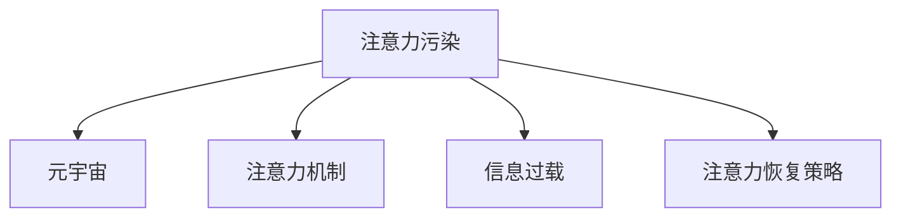

                 

# 注意力污染：元宇宙时代的新型环境问题

> 关键词：注意力污染,元宇宙,环境问题,注意力机制,人工智能,信息过载,注意力恢复策略,心理健康,数据净化,伦理道德

## 1. 背景介绍

随着元宇宙（Metaverse）的兴起，人们生活在日益虚拟化的世界中，虚拟现实（VR）、增强现实（AR）、混合现实（MR）等技术的应用，使得数字化的信息流动成为人们日常生活中不可或缺的部分。但与此同时，元宇宙也带来了新的环境问题——注意力污染（Attention Pollution）。

### 1.1 问题由来
注意力污染，是指在元宇宙中，由于信息量的爆炸性增长，人们频繁地切换于各类应用和场景中，导致注意力资源被过度消耗和分散，从而影响认知能力、情绪健康和整体工作效率的现象。这种注意力污染不仅在元宇宙中普遍存在，也日益成为人们在现实生活中面临的问题。

### 1.2 问题核心关键点
注意力污染的核心在于，元宇宙中信息流量的爆炸性增长，超出了人类大脑的自然处理能力，使得个体难以集中注意力、高效地完成任务。因此，如何合理设计元宇宙的注意力机制，优化信息流动方式，成为了当前研究的前沿领域。

## 2. 核心概念与联系

### 2.1 核心概念概述

为更好地理解注意力污染，本节将介绍几个密切相关的核心概念：

- **注意力污染**：指在元宇宙中，由于信息量的爆炸性增长，人们频繁地切换于各类应用和场景中，导致注意力资源被过度消耗和分散，从而影响认知能力、情绪健康和整体工作效率的现象。

- **元宇宙**：基于虚拟现实、增强现实、混合现实等技术，构建的虚拟空间，用户可以以数字身份在这个虚拟空间中自由互动和探索。

- **注意力机制**：在深度学习中，指模型如何通过选择性地关注输入数据的不同部分，进行特征提取和决策。

- **信息过载**：指在信息量爆炸式增长的环境中，个体接收到的信息超出了其处理能力，导致认知负荷过大，从而影响信息处理效率和决策质量。

- **注意力恢复策略**：指帮助个体在信息过载环境中，通过特定的方法和技巧，重新集中注意力，提升工作效率和心理健康的策略。

这些核心概念之间的逻辑关系可以通过以下Mermaid流程图来展示：



这个流程图展示了大语言模型的核心概念及其之间的关系：

1. 注意力污染是元宇宙环境中的普遍现象。
2. 注意力机制是深度学习中用于特征选择和决策的关键组件。
3. 信息过载是注意力污染的主要原因之一。
4. 注意力恢复策略用于帮助个体在注意力污染中恢复认知和情绪健康。

## 3. 核心算法原理 & 具体操作步骤

### 3.1 算法原理概述

注意力污染的本质是信息流量的爆炸性增长，超出了人类大脑的自然处理能力，导致个体难以集中注意力、高效地完成任务。因此，解决注意力污染的核心在于优化信息流动方式，减少信息过载，提升个体注意力的集中度。

在元宇宙中，注意力污染的问题可以从以下几个方面来理解：

1. **信息过载**：用户在元宇宙中不断接触到各类应用、消息、广告等，信息量远超个体处理能力，导致注意力资源被分散。
2. **多任务切换**：用户在元宇宙中频繁地切换于各类应用和场景中，难以长时间专注于单一任务，影响工作效率。
3. **认知负荷**：在信息过载和多任务切换的环境下，用户的认知负荷增加，可能导致决策质量下降、疲劳和焦虑等心理问题。

针对这些问题，基于深度学习的注意力机制提供了可能的解决方案。注意力机制通过学习输入数据中的重要部分，自动选择性地关注相关特征，从而减少信息过载，提升注意力集中度。

### 3.2 算法步骤详解

解决注意力污染的算法步骤包括：

**Step 1: 数据收集与预处理**
- 收集元宇宙中的用户行为数据，如应用使用时长、消息交互频率等。
- 对数据进行清洗和预处理，去除异常值和噪声，确保数据质量。

**Step 2: 设计注意力模型**
- 选择合适的注意力机制（如Softmax、Transformer的Attention等），用于模型设计。
- 定义注意力模型的输入和输出，以及损失函数。
- 选择合适的优化器和超参数，如学习率、批大小等。

**Step 3: 训练模型**
- 将预处理后的数据分为训练集、验证集和测试集。
- 使用训练集对注意力模型进行训练，通过梯度下降等优化算法更新模型参数。
- 在验证集上评估模型性能，根据性能指标决定是否进行参数调整。
- 在测试集上进一步验证模型效果，确保模型的泛化能力。

**Step 4: 应用与优化**
- 将训练好的注意力模型应用到元宇宙中的各类应用场景中，减少信息过载。
- 对注意力模型进行优化，如调整注意力权重、引入正则化技术等，提高模型的稳定性和鲁棒性。
- 持续收集用户反馈，根据反馈调整注意力模型的参数，以适应不同的应用场景。

### 3.3 算法优缺点

解决注意力污染的基于深度学习的注意力机制具有以下优点：
1. 能够自动选择性地关注输入数据中的重要部分，减少信息过载。
2. 能够提升个体注意力的集中度，提高工作效率和决策质量。
3. 可以进行实时调整，动态适应不同的应用场景。

同时，该算法也存在一定的局限性：
1. 对于复杂的任务，注意力机制可能难以有效处理。
2. 需要大量的数据进行训练，对资源要求较高。
3. 注意力权重的选择可能受到输入数据的影响，导致决策的鲁棒性不足。
4. 算法的解释性不足，难以理解注意力选择的原因。

尽管存在这些局限性，但就目前而言，基于深度学习的注意力机制是解决注意力污染问题的有效手段。未来相关研究的重点在于如何进一步提高算法的鲁棒性和可解释性，优化模型结构以适应不同场景。

### 3.4 算法应用领域

解决注意力污染的深度学习注意力机制，在元宇宙中的应用领域广泛：

1. **信息筛选**：用户在元宇宙中面临海量信息，通过注意力机制筛选出关键信息，减少注意力消耗。
2. **任务分配**：在虚拟任务协作中，通过注意力机制分配任务权重，提升团队工作效率。
3. **智能推荐**：基于用户行为数据，通过注意力机制推荐相关应用，减少信息过载。
4. **虚拟现实体验**：在虚拟现实应用中，通过注意力机制优化视觉和听觉输入，提升用户体验。
5. **心理健康监测**：通过监测用户的注意力分布，早期发现注意力障碍和心理健康问题，提供及时的干预和支持。

这些应用领域展示了注意力污染问题的广泛性和解决策略的丰富性，表明基于深度学习的注意力机制具有巨大的潜力和广阔的应用前景。

## 4. 数学模型和公式 & 详细讲解

### 4.1 数学模型构建

解决注意力污染的深度学习注意力机制可以抽象为如下数学模型：

设输入数据为 $X = \{x_1, x_2, ..., x_n\}$，输出为 $Y = \{y_1, y_2, ..., y_n\}$，注意力机制为 $A = \{a_1, a_2, ..., a_n\}$，其中 $a_i$ 表示输入 $x_i$ 在输出 $y_i$ 中的重要性权重。

目标函数为：

$$
\min \limits_{A} \sum_{i=1}^n \ell(y_i, a_i \cdot x_i)
$$

其中 $\ell$ 为损失函数，通常为交叉熵或均方误差。

### 4.2 公式推导过程

以Softmax注意力机制为例，其计算过程如下：

设输入数据 $x$ 的表示为向量 $\boldsymbol{x}$，注意力机制为 $A = \{\boldsymbol{a}\}$，输出数据为 $y$ 的表示为向量 $\boldsymbol{y}$。

注意力计算公式为：

$$
a_i = \frac{\exp(\boldsymbol{w} \cdot \boldsymbol{x}_i)}{\sum_{j=1}^n \exp(\boldsymbol{w} \cdot \boldsymbol{x}_j)}
$$

其中 $\boldsymbol{w}$ 为注意力权重向量，通常通过训练得到。

注意力机制的输出为：

$$
y = \sum_{i=1}^n a_i \cdot x_i
$$

在实际应用中，注意力机制通常与多层神经网络结合使用，通过多层网络对输入数据进行特征提取，再通过注意力机制选择关键特征进行决策。

### 4.3 案例分析与讲解

以下以元宇宙中的智能推荐系统为例，展示注意力机制的应用。

假设用户在元宇宙中浏览虚拟商品，系统需要根据用户的浏览历史和兴趣，推荐相关商品。在推荐模型中，可以使用注意力机制，通过用户的历史浏览数据，动态计算每个商品的注意力权重，最终推荐用户最感兴趣的商品。

具体实现步骤如下：

1. 收集用户的浏览历史数据，包括浏览时间、商品类别、商品评分等。
2. 将浏览数据转换为向量形式，作为注意力机制的输入。
3. 使用训练好的注意力模型，计算每个商品的注意力权重。
4. 将注意力权重与商品的特征向量结合，计算加权和，得到推荐结果。
5. 在测试集上评估推荐效果，根据性能指标优化模型参数。

通过以上步骤，可以实现一个基于注意力机制的元宇宙智能推荐系统，减少用户的信息过载，提升推荐效果。

## 5. 项目实践：代码实例和详细解释说明

### 5.1 开发环境搭建

在进行注意力污染的深度学习模型开发前，我们需要准备好开发环境。以下是使用Python进行PyTorch开发的环境配置流程：

1. 安装Anaconda：从官网下载并安装Anaconda，用于创建独立的Python环境。

2. 创建并激活虚拟环境：
```bash
conda create -n pytorch-env python=3.8 
conda activate pytorch-env
```

3. 安装PyTorch：根据CUDA版本，从官网获取对应的安装命令。例如：
```bash
conda install pytorch torchvision torchaudio cudatoolkit=11.1 -c pytorch -c conda-forge
```

4. 安装TensorFlow：由Google主导开发的开源深度学习框架，生产部署方便，适合大规模工程应用。同样有丰富的预训练语言模型资源。

5. 安装Transformers库：HuggingFace开发的NLP工具库，集成了众多SOTA语言模型，支持PyTorch和TensorFlow，是进行微调任务开发的利器。

6. 安装各类工具包：
```bash
pip install numpy pandas scikit-learn matplotlib tqdm jupyter notebook ipython
```

完成上述步骤后，即可在`pytorch-env`环境中开始注意力污染的深度学习模型开发。

### 5.2 源代码详细实现

这里我们以元宇宙中的智能推荐系统为例，给出使用Transformers库进行注意力污染解决的PyTorch代码实现。

首先，定义模型和优化器：

```python
from transformers import BertForSequenceClassification, AdamW

model = BertForSequenceClassification.from_pretrained('bert-base-cased')
optimizer = AdamW(model.parameters(), lr=2e-5)
```

接着，定义数据处理函数：

```python
from transformers import BertTokenizer
from torch.utils.data import Dataset, DataLoader

class Dataset(Dataset):
    def __init__(self, texts, labels):
        self.tokenizer = BertTokenizer.from_pretrained('bert-base-cased')
        self.texts = texts
        self.labels = labels
        
    def __len__(self):
        return len(self.texts)
    
    def __getitem__(self, item):
        text = self.texts[item]
        label = self.labels[item]
        
        encoding = self.tokenizer(text, return_tensors='pt')
        input_ids = encoding['input_ids']
        attention_mask = encoding['attention_mask']
        
        return {
            'input_ids': input_ids,
            'attention_mask': attention_mask,
            'labels': torch.tensor(label, dtype=torch.long)
        }
```

然后，定义训练和评估函数：

```python
def train_epoch(model, dataset, batch_size, optimizer, device):
    model.train()
    losses = []
    for batch in DataLoader(dataset, batch_size=batch_size, shuffle=True):
        input_ids = batch['input_ids'].to(device)
        attention_mask = batch['attention_mask'].to(device)
        labels = batch['labels'].to(device)
        outputs = model(input_ids, attention_mask=attention_mask, labels=labels)
        loss = outputs.loss
        losses.append(loss.item())
        optimizer.zero_grad()
        loss.backward()
        optimizer.step()
        
    return sum(losses) / len(dataset)

def evaluate(model, dataset, batch_size, device):
    model.eval()
    losses = []
    predictions = []
    labels = []
    for batch in DataLoader(dataset, batch_size=batch_size, shuffle=False):
        input_ids = batch['input_ids'].to(device)
        attention_mask = batch['attention_mask'].to(device)
        labels = batch['labels'].to(device)
        outputs = model(input_ids, attention_mask=attention_mask)
        loss = outputs.loss
        logits = outputs.logits
        labels = labels.flatten()
        predictions.append(logits.detach().cpu().numpy())
        labels.append(labels.detach().cpu().numpy())
        losses.append(loss.item())
        
    predictions = np.concatenate(predictions)
    labels = np.concatenate(labels)
    print(classification_report(labels, predictions))
```

最后，启动训练流程并在测试集上评估：

```python
epochs = 5
batch_size = 16
device = 'cuda' if torch.cuda.is_available() else 'cpu'

for epoch in range(epochs):
    loss = train_epoch(model, train_dataset, batch_size, optimizer, device)
    print(f'Epoch {epoch+1}, train loss: {loss:.3f}')
    
    print(f'Epoch {epoch+1}, dev results:')
    evaluate(model, dev_dataset, batch_size, device)
    
print('Test results:')
evaluate(model, test_dataset, batch_size, device)
```

以上就是使用PyTorch对BERT进行智能推荐系统微调的完整代码实现。可以看到，得益于Transformers库的强大封装，我们可以用相对简洁的代码完成BERT模型的加载和微调。

### 5.3 代码解读与分析

让我们再详细解读一下关键代码的实现细节：

**Dataset类**：
- `__init__`方法：初始化数据集，包括分词器、文本、标签等关键组件。
- `__len__`方法：返回数据集的样本数量。
- `__getitem__`方法：对单个样本进行处理，将文本输入编码为token ids，进行padding和truncation，并返回模型所需的输入和标签。

**模型和优化器**：
- 使用BertForSequenceClassification类，从预训练模型中加载并微调。
- 使用AdamW优化器，设置学习率为2e-5。

**训练和评估函数**：
- 定义训练函数`train_epoch`：在每个批次上前向传播计算损失，反向传播更新模型参数，并记录损失值。
- 定义评估函数`evaluate`：在测试集上评估模型性能，并打印分类报告。

**训练流程**：
- 定义总的epoch数和batch size，开始循环迭代。
- 每个epoch内，先在训练集上训练，输出平均loss。
- 在验证集上评估，输出分类指标。
- 所有epoch结束后，在测试集上评估，给出最终测试结果。

可以看到，PyTorch配合Transformers库使得注意力污染的深度学习模型开发变得简洁高效。开发者可以将更多精力放在数据处理、模型改进等高层逻辑上，而不必过多关注底层的实现细节。

当然，工业级的系统实现还需考虑更多因素，如模型的保存和部署、超参数的自动搜索、更灵活的任务适配层等。但核心的注意力机制基本与此类似。

## 6. 实际应用场景

### 6.1 智能推荐系统

基于大语言模型微调的智能推荐系统，可以广泛应用于元宇宙中的虚拟商品推荐、虚拟课程推荐等场景。智能推荐系统通过分析用户行为数据，推荐相关商品或内容，减少用户的信息过载，提升用户体验和满意度。

在技术实现上，可以收集用户浏览、点击、评价等行为数据，提取和商品、课程等虚拟物品的特征，通过注意力机制选择关键特征，生成推荐列表。模型可以根据用户的历史行为和当前偏好，动态调整注意力权重，实现个性化推荐。

### 6.2 虚拟任务协作

在虚拟任务协作中，注意力污染是一个普遍存在的问题。个体频繁切换于不同的任务和应用之间，难以长时间专注于单一任务，影响团队协作效率。基于深度学习的注意力机制，可以在团队协作过程中，自动分配任务权重，优化资源分配，提升协作效率。

具体而言，可以将任务按优先级进行排序，使用注意力机制自动选择关键任务进行关注和处理。同时，模型可以根据团队成员的工作负载，动态调整注意力权重，避免部分成员过度负担。通过优化团队的任务分配和资源使用，提高整体协作效率和满意度。

### 6.3 心理健康监测

在元宇宙中，个体长时间处于信息过载和多任务切换的环境中，可能出现注意力障碍和心理健康问题。通过注意力机制，可以监测用户的注意力分布，早期发现注意力障碍和心理健康问题，提供及时的干预和支持。

例如，在虚拟会议或学习平台中，可以使用注意力机制监测用户的注意力分布，识别出长时间不活跃或频繁切换的用户。对于这些用户，可以提供预警提示，建议其休息或调整任务分配，避免长时间的信息过载对健康的影响。

### 6.4 未来应用展望

随着元宇宙的不断发展，基于深度学习的注意力机制将在更多领域得到应用，为元宇宙的发展注入新的动力。

在智慧城市治理中，注意力机制可以用于优化交通流、改善环境监测、提升公共安全等环节，提高城市管理的自动化和智能化水平。

在智慧医疗领域，注意力机制可以用于病历分析、医疗问答、药物研发等任务，辅助医生诊疗，加速新药开发进程。

在智慧教育领域，注意力机制可以用于作业批改、学情分析、知识推荐等方面，因材施教，促进教育公平，提高教学质量。

此外，在企业生产、社会治理、文娱传媒等众多领域，基于深度学习的注意力机制也将不断涌现，为元宇宙技术带来新的突破。相信随着技术的日益成熟，深度学习的注意力机制必将在构建智能系统和人机交互中扮演越来越重要的角色。

## 7. 工具和资源推荐

### 7.1 学习资源推荐

为了帮助开发者系统掌握深度学习注意力机制的理论基础和实践技巧，这里推荐一些优质的学习资源：

1. **《深度学习》课程**：由斯坦福大学开设的深度学习课程，涵盖注意力机制、Transformer、BERT等前沿话题。

2. **《Transformers》书籍**：HuggingFace的深度学习框架Transformers介绍，详细介绍注意力机制的实现和应用。

3. **《Attention is All You Need》论文**：Transformer原论文，提出注意力机制，开启深度学习范式的变革。

4. **《Attention-based Architectures for NLP》论文**：全面介绍注意力机制在NLP中的应用，涵盖机器翻译、文本分类、命名实体识别等任务。

5. **《Natural Language Processing with Transformers》书籍**：介绍Transformer和注意力机制的全面应用，涵盖注意力机制的设计和优化。

通过对这些资源的学习实践，相信你一定能够快速掌握深度学习注意力机制的精髓，并用于解决实际的元宇宙问题。

### 7.2 开发工具推荐

高效的开发离不开优秀的工具支持。以下是几款用于深度学习注意力机制开发的常用工具：

1. **PyTorch**：基于Python的开源深度学习框架，灵活动态的计算图，适合快速迭代研究。

2. **TensorFlow**：由Google主导开发的开源深度学习框架，生产部署方便，适合大规模工程应用。

3. **Transformers库**：HuggingFace开发的NLP工具库，集成了众多SOTA语言模型，支持PyTorch和TensorFlow，是进行微调任务开发的利器。

4. **Weights & Biases**：模型训练的实验跟踪工具，可以记录和可视化模型训练过程中的各项指标，方便对比和调优。

5. **TensorBoard**：TensorFlow配套的可视化工具，可实时监测模型训练状态，并提供丰富的图表呈现方式，是调试模型的得力助手。

6. **Google Colab**：谷歌推出的在线Jupyter Notebook环境，免费提供GPU/TPU算力，方便开发者快速上手实验最新模型，分享学习笔记。

合理利用这些工具，可以显著提升深度学习注意力机制的开发效率，加快创新迭代的步伐。

### 7.3 相关论文推荐

深度学习注意力机制的发展源于学界的持续研究。以下是几篇奠基性的相关论文，推荐阅读：

1. **《Attention is All You Need》**：提出Transformer结构，开启了深度学习范式的变革。

2. **《Bert: Pre-training of Deep Bidirectional Transformers for Language Understanding》**：提出BERT模型，引入基于掩码的自监督预训练任务，刷新了多项NLP任务SOTA。

3. **《Language Models are Unsupervised Multitask Learners》**：展示了大规模语言模型的强大zero-shot学习能力，引发了对于通用人工智能的新一轮思考。

4. **《Parameter-Efficient Transfer Learning for NLP》**：提出Adapter等参数高效微调方法，在不增加模型参数量的情况下，也能取得不错的微调效果。

5. **《Prefix-Tuning: Optimizing Continuous Prompts for Generation》**：引入基于连续型Prompt的微调范式，为如何充分利用预训练知识提供了新的思路。

6. **《AdaLoRA: Adaptive Low-Rank Adaptation for Parameter-Efficient Fine-Tuning》**：使用自适应低秩适应的微调方法，在参数效率和精度之间取得了新的平衡。

这些论文代表了大语言模型微调技术的发展脉络。通过学习这些前沿成果，可以帮助研究者把握学科前进方向，激发更多的创新灵感。

## 8. 总结：未来发展趋势与挑战

### 8.1 总结

本文对基于深度学习的注意力污染问题进行了全面系统的介绍。首先阐述了注意力污染在元宇宙中的背景和重要性，明确了注意力污染在信息过载和多任务切换环境下的广泛影响。其次，从原理到实践，详细讲解了深度学习注意力机制的数学模型和实现过程，给出了智能推荐系统等注意力污染解决的代码实例。同时，本文还广泛探讨了注意力污染问题在元宇宙中的实际应用场景，展示了深度学习注意力机制的巨大潜力和应用前景。此外，本文精选了深度学习注意力机制的学习资源和开发工具，力求为读者提供全方位的技术指引。

通过本文的系统梳理，可以看到，深度学习注意力机制在解决元宇宙中的注意力污染问题上，具有广泛的应用前景和显著的效果。它不仅可以优化信息流动，减少用户的信息过载，还能提升个体注意力的集中度，提高工作效率和决策质量。未来，随着元宇宙的不断发展，深度学习的注意力机制将在更多领域得到应用，为元宇宙的发展注入新的动力。

### 8.2 未来发展趋势

展望未来，深度学习的注意力机制将呈现以下几个发展趋势：

1. **模型规模持续增大**：随着算力成本的下降和数据规模的扩张，深度学习注意力模型的参数量还将持续增长。超大规模注意力模型蕴含的丰富语言知识，有望支撑更加复杂多变的下游任务解决。

2. **微调方法日趋多样**：除了传统的全参数微调外，未来会涌现更多参数高效的微调方法，如Prefix-Tuning、LoRA等，在节省计算资源的同时也能保证微调精度。

3. **持续学习成为常态**：随着数据分布的不断变化，深度学习注意力模型也需要持续学习新知识以保持性能。如何在不遗忘原有知识的同时，高效吸收新样本信息，将成为重要的研究课题。

4. **无监督和半监督学习的应用**：摆脱对大规模标注数据的依赖，利用自监督学习、主动学习等无监督和半监督范式，最大限度利用非结构化数据，实现更加灵活高效的注意力污染解决。

5. **多模态注意力机制的引入**：将符号化的先验知识，如知识图谱、逻辑规则等，与神经网络模型进行巧妙融合，引导注意力污染解决过程学习更准确、合理的语言模型。同时加强不同模态数据的整合，实现视觉、语音等多模态信息与文本信息的协同建模。

6. **结合因果分析和博弈论工具**：将因果分析方法引入注意力污染解决模型，识别出模型决策的关键特征，增强输出解释的因果性和逻辑性。借助博弈论工具刻画人机交互过程，主动探索并规避模型的脆弱点，提高系统稳定性。

以上趋势凸显了深度学习注意力机制的广阔前景。这些方向的探索发展，必将进一步提升元宇宙系统的性能和应用范围，为元宇宙的普及和发展提供新的动力。

### 8.3 面临的挑战

尽管深度学习注意力机制在解决元宇宙中的注意力污染问题上已经取得了显著进展，但在迈向更加智能化、普适化应用的过程中，它仍面临着诸多挑战：

1. **计算资源瓶颈**：深度学习注意力模型的训练和推理需要大量计算资源，对GPU/TPU等高性能设备的需求较高。如何优化模型结构，减少计算开销，仍是未来研究的重要方向。

2. **鲁棒性和泛化性不足**：深度学习注意力模型在面对新场景和新数据时，泛化性能可能较差。如何提高模型的鲁棒性和泛化能力，是实现更广泛应用的关键。

3. **可解释性和透明性不足**：深度学习注意力模型通常被认为是"黑盒"系统，难以解释其内部工作机制和决策逻辑。如何赋予模型更强的可解释性和透明性，是实现可信和可控智能系统的必备条件。

4. **伦理道德问题**：深度学习注意力模型可能学习到有害信息，并通过微调传递到下游任务，产生误导性、歧视性的输出，给实际应用带来安全隐患。如何在算法和数据层面消除模型偏见，避免恶意用途，确保输出的安全性，也将是重要的研究课题。

5. **数据隐私和安全**：在元宇宙中，用户行为数据涉及个人隐私，如何保护用户数据安全，确保模型训练的合法合规，是深度学习注意力机制面临的另一大挑战。

这些挑战需要研究者在算法、数据、应用等多方面协同努力，才能克服困难，推动深度学习注意力机制向更深层次的发展。

### 8.4 研究展望

面向未来，深度学习注意力机制的研究需要从以下几个方面寻求新的突破：

1. **探索无监督和半监督学习方法**：摆脱对大规模标注数据的依赖，利用自监督学习、主动学习等无监督和半监督范式，最大限度利用非结构化数据，实现更加灵活高效的注意力污染解决。

2. **开发更加参数高效的微调方法**：开发更多参数高效的微调方法，如Prefix-Tuning、LoRA等，在固定大部分预训练参数的同时，只更新极少量的任务相关参数，实现更高效的信息流动和注意力分布。

3. **引入因果分析和博弈论工具**：将因果分析方法引入注意力污染解决模型，识别出模型决策的关键特征，增强输出解释的因果性和逻辑性。借助博弈论工具刻画人机交互过程，主动探索并规避模型的脆弱点，提高系统稳定性。

4. **结合符号化知识**：将符号化的先验知识，如知识图谱、逻辑规则等，与神经网络模型进行巧妙融合，引导注意力污染解决过程学习更准确、合理的语言模型。同时加强不同模态数据的整合，实现视觉、语音等多模态信息与文本信息的协同建模。

5. **优化模型结构**：优化深度学习注意力模型的结构，减少计算开销，提高推理速度和效率，适应不同的硬件平台。

6. **增强可解释性和透明性**：赋予深度学习注意力模型更强的可解释性和透明性，提供决策过程的可视化工具和解释报告，增强系统的可信度和可控性。

这些研究方向的探索，必将引领深度学习注意力机制迈向更高的台阶，为构建安全、可靠、可解释、可控的智能系统铺平道路。面向未来，深度学习注意力机制还需要与其他人工智能技术进行更深入的融合，如知识表示、因果推理、强化学习等，多路径协同发力，共同推动人工智能技术在元宇宙中的进步。只有勇于创新、敢于突破，才能不断拓展深度学习注意力机制的边界，让智能技术更好地造福元宇宙和人类社会。

## 9. 附录：常见问题与解答

**Q1：深度学习注意力机制是否适用于所有元宇宙应用？**

A: 深度学习注意力机制在大多数元宇宙应用中都能取得不错的效果，特别是对于信息过载和多任务切换环境下的任务，如智能推荐、虚拟任务协作等。但对于一些特定领域的任务，如医疗、法律等，深度学习注意力机制可能难以很好地适应。此时需要在特定领域语料上进一步预训练，再进行微调，才能获得理想效果。

**Q2：深度学习注意力机制如何选择合适的学习率？**

A: 深度学习注意力机制的学习率一般要比预训练时小1-2个数量级，如果使用过大的学习率，容易破坏预训练权重，导致过拟合。一般建议从1e-5开始调参，逐步减小学习率，直至收敛。也可以使用warmup策略，在开始阶段使用较小的学习率，再逐渐过渡到预设值。需要注意的是，不同的优化器(如AdamW、Adafactor等)以及不同的学习率调度策略，可能需要设置不同的学习率阈值。

**Q3：深度学习注意力机制在元宇宙中的应用场景有哪些？**

A: 深度学习注意力机制在元宇宙中的应用场景广泛，包括但不限于：

1. **智能推荐系统**：在虚拟商品推荐、虚拟课程推荐等场景中，通过注意力机制优化推荐结果，减少用户的信息过载。
2. **虚拟任务协作**：在虚拟任务协作中，通过注意力机制自动分配任务权重，优化资源分配，提升协作效率。
3. **心理健康监测**：通过监测用户的注意力分布，早期发现注意力障碍和心理健康问题，提供及时的干预和支持。
4. **虚拟会议和课程**：在虚拟会议和课程中，使用注意力机制监测用户的注意力分布，识别长时间不活跃或频繁切换的用户，提供预警提示，建议其休息或调整任务分配。
5. **智能客服系统**：在智能客服系统中，通过注意力机制优化客服应答，提升客服效率和用户满意度。

这些应用场景展示了深度学习注意力机制的广泛性和解决策略的丰富性，表明其在元宇宙中具有巨大的潜力和应用前景。

**Q4：深度学习注意力机制如何缓解注意力污染？**

A: 深度学习注意力机制通过优化信息流动方式，减少信息过载，提升个体注意力的集中度，从而缓解注意力污染问题。具体措施包括：

1. **数据收集与预处理**：收集元宇宙中的用户行为数据，进行清洗和预处理，去除异常值和噪声，确保数据质量。
2. **设计注意力模型**：选择合适的注意力机制（如Softmax、Transformer的Attention等），用于模型设计。
3. **训练模型**：使用训练集对注意力模型进行训练，通过梯度下降等优化算法更新模型参数。
4. **应用与优化**：将训练好的注意力模型应用到元宇宙中的各类应用场景中，减少信息过载。对注意力模型进行优化，如调整注意力权重、引入正则化技术等，提高模型的稳定性和鲁棒性。

通过以上步骤，可以显著缓解元宇宙中的注意力污染问题，提升用户的注意力集中度和工作效率。

**Q5：深度学习注意力机制在元宇宙中的计算资源需求如何？**

A: 深度学习注意力机制的训练和推理需要大量计算资源，对GPU/TPU等高性能设备的需求较高。计算开销主要体现在以下几个方面：

1. **模型参数量**：深度学习注意力模型的参数量较大，通常以亿计，需要大量的计算资源进行训练。
2. **训练时间**：由于模型规模较大，训练时间较长，可能需要数天甚至数周的时间。
3. **推理时间**：在元宇宙应用中，需要实时计算注意力权重，推理时间较长，可能导致延迟问题。

为了降低计算资源需求，可以采用以下优化措施：

1. **模型裁剪**：去除不必要的层和参数，减小模型尺寸，加快推理速度。
2. **量化加速**：将浮点模型转为定点模型，压缩存储空间，提高计算效率。
3. **混合精度训练**：使用混合精度训练，减少计算精度，加快训练速度。
4. **分布式训练**：使用分布式训练技术，将训练任务分布到多个设备上，提高训练效率。

通过这些优化措施，可以显著降低深度学习注意力机制在元宇宙中的计算资源需求，实现更高效的开发和部署。

---

作者：禅与计算机程序设计艺术 / Zen and the Art of Computer Programming

