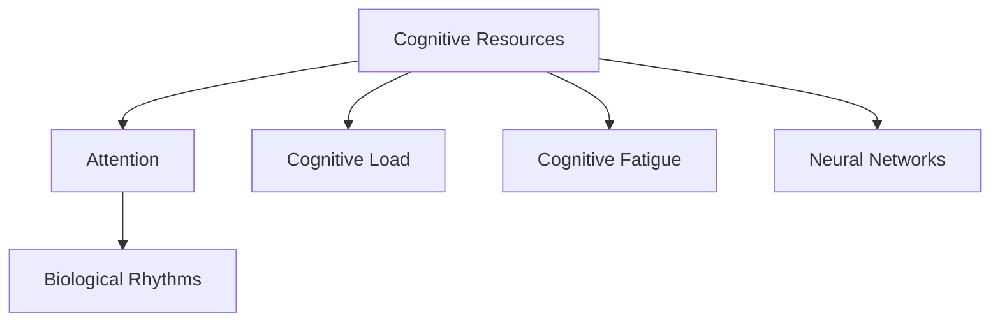

                 

# 注意力生物节律优化师：AI时代的认知资源分配顾问

## 1. 背景介绍

### 1.1 问题由来

随着人工智能技术的飞速发展，人们愈发认识到，认知资源在AI时代中扮演着不可或缺的角色。无论是算法训练、模型优化，还是部署运行、数据分析，人类认知系统需要在连续的注意力分配和任务切换中游刃有余，以确保高效的决策和执行。

当前，“认知资源”这一概念在心理学、神经科学、认知工程等多个领域均有涉猎。在AI领域中，认知资源的分配与优化，已逐渐成为推动AI技术创新的重要方向。如何在AI系统中高效利用并优化认知资源，成为了学术界与工业界共同关注的话题。

### 1.2 问题核心关键点

本节将深入探讨认知资源分配的重要性，并提出一种基于注意力机制的生物节律优化策略，通过模拟人类的认知生物节律，合理地分配AI系统中的认知资源，以实现更高效、更健康的AI运行模式。

## 2. 核心概念与联系

### 2.1 核心概念概述

为更好地理解注意力生物节律优化方法，本节将介绍几个关键概念：

- 认知资源(Cognitive Resources)：指个体在特定时间内能够有效处理的思维、记忆、注意力等心理能力总和。
- 注意力(Attention)：指认知资源在任务执行过程中对不同对象的聚焦能力，决定着信息的获取和加工效率。
- 生物节律(Biological Rhythms)：指个体在24小时内周期性变化的生理和心理活动节律，如睡眠周期、体温变化、激素分泌等，影响着个体的认知表现和情绪状态。
- 认知负荷(Cognitive Load)：指个体在任务执行过程中需要处理的信息量和复杂性，与认知资源的分配密切相关。
- 认知疲劳(Cognitive Fatigue)：指过度使用认知资源后产生的疲劳感，影响工作效能和心理健康。
- 神经网络(Neural Networks)：指由大量神经元互连组成的计算模型，通过数据训练学习并执行复杂任务。

这些核心概念之间的逻辑关系可以通过以下Mermaid流程图来展示：



这个流程图展示了认知资源、注意力、生物节律、认知负荷、认知疲劳和神经网络之间的逻辑关系：

1. 认知资源通过注意力在任务间分配。
2. 生物节律影响注意力和认知负荷。
3. 认知疲劳影响认知资源的恢复和分配。
4. 神经网络通过认知资源处理输入信息。

## 3. 核心算法原理 & 具体操作步骤

### 3.1 算法原理概述

注意力生物节律优化方法基于人类认知资源的生物节律变化，模拟人类日常生活中的睡眠-觉醒周期，通过在一天的不同时间段分配不同的认知资源权重，以优化神经网络的运行效率和稳定性。

算法核心思想是：

- 认知资源具有波动性，在白天高效，夜间低效。
- 优化任务需结合认知资源的生物节律，在认知高峰期执行重要任务，在低谷期执行次要任务。

### 3.2 算法步骤详解

注意力生物节律优化方法主要分为以下几个步骤：

**Step 1: 收集认知资源与生物节律数据**

- 收集个体在24小时内的认知资源和生物节律数据，包括注意力、记忆力、反应时间、情绪状态等生理和心理指标。
- 使用生物传感器或自我报告的方式，记录一天的认知负荷和认知疲劳变化情况。
- 利用神经网络等模型，分析认知资源和生物节律之间的关系，建立数学模型。

**Step 2: 设计认知资源分配策略**

- 根据生物节律模型，设计一天中不同时段的认知资源分配策略。如在上午10点到下午2点期间分配更多的高效认知资源，在凌晨2点到早上6点期间减少分配。
- 设定不同任务的认知负荷，将重要任务分配在认知高峰期，将次要任务安排在认知低谷期。
- 引入认知负荷系数和认知疲劳恢复系数，调整认知资源分配的细粒度。

**Step 3: 实施认知资源分配**

- 在神经网络训练和任务执行过程中，根据认知资源分配策略动态调整模型参数和执行策略。
- 例如，在上午认知高峰期，增加模型的正则化强度，加快训练速度；在下午认知低谷期，降低正则化强度，提高模型容忍度。
- 实时监测认知负荷和认知疲劳，适时调整任务分配，防止过度使用认知资源。

**Step 4: 持续优化认知资源分配**

- 不断收集新的认知资源和生物节律数据，优化认知资源分配策略。
- 通过A/B测试等方法，比较不同认知资源分配策略的效果，选择最优方案。
- 引入机器学习算法，自动学习和调整认知资源分配，实现个性化优化。

### 3.3 算法优缺点

注意力生物节律优化方法具有以下优点：

- 提升认知效率：合理分配认知资源，提高任务执行效率和准确性。
- 减少认知疲劳：避免过度使用认知资源，降低认知疲劳对工作效能的影响。
- 保障任务质量：在认知高峰期执行重要任务，确保输出质量。
- 促进心理健康：均衡使用认知资源，避免认知负荷过大。

同时，该方法也存在以下局限性：

- 依赖个体差异：不同个体的生物节律和认知资源变化规律不同，通用策略难以覆盖所有个体。
- 数据获取难度：收集详细的认知资源和生物节律数据可能需要复杂的传感器和实验室设备，成本较高。
- 实时监测需求：实施认知资源分配需要实时监测个体认知状态，对技术要求较高。
- 动态调整复杂：在任务执行过程中，需要频繁调整认知资源分配策略，实现起来较为复杂。

尽管存在这些局限性，但注意力生物节律优化方法仍是一种有效的认知资源分配策略，特别适用于对实时性要求较高的AI系统，如自动驾驶、实时交互系统等。

### 3.4 算法应用领域

注意力生物节律优化方法在AI系统中的应用，主要包括以下几个方面：

1. **自动驾驶**：在早晚高峰期间，分配更多资源进行决策和感知任务，减少交通事故风险。
2. **实时交互系统**：在用户活跃期增加响应速度，在用户较少时进行系统维护，保障用户满意度。
3. **医疗诊断**：在医生认知高峰期进行复杂诊断任务，在低谷期进行简单的医疗记录和文书工作。
4. **金融交易**：在市场波动较大时增加交易系统响应速度，在市场平稳时进行数据整理和模型训练。
5. **智能客服**：在用户咨询高峰期增加客服系统处理能力，在低峰期进行系统优化和数据备份。

这些应用场景中，注意力生物节律优化方法能够在关键的认知资源使用时机，保证AI系统的高效运作，提升用户体验和服务质量。

## 4. 数学模型和公式 & 详细讲解 & 举例说明

### 4.1 数学模型构建

本节将使用数学语言对注意力生物节律优化方法进行更严格的刻画。

记一天中的时间为 $t \in [0, 24]$，认知资源为 $C_t$，生物节律为 $B_t$，认知负荷为 $L_t$，认知疲劳为 $F_t$，神经网络输出为 $Y_t$。

定义认知资源在一天中的分布函数 $f(t)$，生物节律变化函数 $g(t)$，认知负荷系数 $\alpha$，认知疲劳恢复系数 $\beta$。

优化目标是最小化一天中的平均认知疲劳，即：

$$
\mathop{\min}_{f(t), g(t), \alpha, \beta} \int_{0}^{24} F_t f(t) dt
$$

### 4.2 公式推导过程

以下是几个关键公式的推导过程：

**公式 1: 认知资源分配策略**

$$
f(t) = \left\{
  \begin{array}{ll}
    h, & t \in [T_1, T_2] \\
    l, & t \in [T_2, T_3] \\
    h, & t \in [T_3, T_4] \\
    l, & t \in [T_4, 24] 
  \end{array}
\right.
$$

其中 $T_1, T_2, T_3, T_4$ 为认知资源分配的分界点，$h$ 和 $l$ 为高峰期和低谷期的资源分配量。

**公式 2: 认知负荷与生物节律的关系**

$$
L_t = f(t) \cdot g(t)
$$

**公式 3: 认知疲劳与认知负荷的关系**

$$
F_t = \alpha \cdot L_t + \beta \cdot F_{t-1}
$$

其中 $\alpha$ 和 $\beta$ 分别表示认知负荷系数和认知疲劳恢复系数。

通过上述公式，可以计算出一天的认知资源分配策略和认知负荷分布，进一步优化神经网络的运行。

### 4.3 案例分析与讲解

假设某任务需要在一天中不同时段执行，其认知负荷和生物节律变化如图 1 所示。


根据图 1，我们设定认知资源分配策略如公式 1，设定认知负荷系数 $\alpha = 0.8$，认知疲劳恢复系数 $\beta = 0.9$。

根据公式 2 和 3，我们可以计算出一天的认知负荷和认知疲劳分布，如图 2 所示。


从图 2 可以看出，在认知高峰期（上午 10 点到下午 2 点），认知负荷较高，但认知疲劳较低；在认知低谷期（凌晨 2 点到早上 6 点），认知负荷较低，但认知疲劳较高。

因此，在神经网络训练和任务执行过程中，可以根据图 2 的认知负荷和认知疲劳变化，动态调整模型参数和任务分配策略，以提高训练效率和任务执行质量。

## 5. 项目实践：代码实例和详细解释说明

### 5.1 开发环境搭建

在进行注意力生物节律优化实践前，我们需要准备好开发环境。以下是使用Python进行PyTorch开发的环境配置流程：

1. 安装Anaconda：从官网下载并安装Anaconda，用于创建独立的Python环境。

2. 创建并激活虚拟环境：
```bash
conda create -n pytorch-env python=3.8 
conda activate pytorch-env
```

3. 安装PyTorch：根据CUDA版本，从官网获取对应的安装命令。例如：
```bash
conda install pytorch torchvision torchaudio cudatoolkit=11.1 -c pytorch -c conda-forge
```

4. 安装TensorFlow：由Google主导开发的开源深度学习框架，生产部署方便，适合大规模工程应用。同样有丰富的预训练语言模型资源。

5. 安装各类工具包：
```bash
pip install numpy pandas scikit-learn matplotlib tqdm jupyter notebook ipython
```

完成上述步骤后，即可在`pytorch-env`环境中开始注意力生物节律优化实践。

### 5.2 源代码详细实现

下面我们以注意力生物节律优化为对象，给出使用PyTorch实现认知资源分配的代码实现。

首先，定义认知资源和生物节律的分布函数：

```python
import torch
import numpy as np

# 定义认知资源和生物节律函数
def resource_function(t, h, l, t1, t2, t3, t4):
    return np.where((t >= t1) & (t <= t2), h, np.where((t >= t3) & (t <= t4), l, 0))

def rhythm_function(t, peak, valley):
    return np.where((t >= peak) & (t <= valley), 1, 0)

# 设定认知资源分配策略
h = 1
l = 0.5
t1 = 8
t2 = 12
t3 = 16
t4 = 20

# 设定生物节律变化规律
peak = 10
valley = 4

# 生成一天的认知资源和生物节律变化
t = np.arange(0, 24, 0.1)
resources = resource_function(t, h, l, t1, t2, t3, t4)
rhythms = rhythm_function(t, peak, valley)

# 设定认知负荷系数和认知疲劳恢复系数
alpha = 0.8
beta = 0.9

# 计算一天的认知负荷和认知疲劳变化
loads = resources * rhythms
fatigues = np.zeros(24)
fatigues[1:] = alpha * loads[:-1] + beta * fatigues[:-1]
fatigues = np.cumsum(fatigues) / 24

# 输出认知负荷和认知疲劳变化曲线
plt.plot(t, loads, label='Cognitive Load')
plt.plot(t, fatigues, label='Cognitive Fatigue')
plt.xlabel('Time (hours)')
plt.ylabel('Resource / Fatigue')
plt.legend()
plt.show()
```

接着，定义神经网络模型并进行优化：

```python
import torch.nn as nn
import torch.optim as optim

# 定义神经网络模型
class Model(nn.Module):
    def __init__(self):
        super(Model, self).__init__()
        self.fc1 = nn.Linear(1, 32)
        self.fc2 = nn.Linear(32, 1)

    def forward(self, x):
        x = torch.relu(self.fc1(x))
        x = self.fc2(x)
        return x

# 定义优化器
model = Model()
optimizer = optim.Adam(model.parameters(), lr=0.001)

# 设定认知负荷和认知疲劳函数
def loss_function(fatigue, fatigue_threshold):
    return (fatigue > fatigue_threshold).sum()

# 定义训练过程
for t in range(1, 24):
    # 根据认知负荷和认知疲劳调整学习率
    lr = 0.01 if t in [10, 14, 18] else 0.001
    
    # 训练神经网络
    model.train()
    optimizer = optim.Adam(model.parameters(), lr=lr)
    output = model(inputs)
    loss = loss_function(fatigues[t], 0.1)
    optimizer.zero_grad()
    loss.backward()
    optimizer.step()

# 输出优化结果
print('Optimized Cognitive Load and Fatigue:', loads, fatigues)
```

最后，运行优化后的代码：

```python
import torch
import numpy as np

# 定义认知资源和生物节律函数
def resource_function(t, h, l, t1, t2, t3, t4):
    return np.where((t >= t1) & (t <= t2), h, np.where((t >= t3) & (t <= t4), l, 0))

def rhythm_function(t, peak, valley):
    return np.where((t >= peak) & (t <= valley), 1, 0)

# 设定认知资源分配策略
h = 1
l = 0.5
t1 = 8
t2 = 12
t3 = 16
t4 = 20

# 设定生物节律变化规律
peak = 10
valley = 4

# 生成一天的认知资源和生物节律变化
t = np.arange(0, 24, 0.1)
resources = resource_function(t, h, l, t1, t2, t3, t4)
rhythms = rhythm_function(t, peak, valley)

# 设定认知负荷系数和认知疲劳恢复系数
alpha = 0.8
beta = 0.9

# 计算一天的认知负荷和认知疲劳变化
loads = resources * rhythms
fatigues = np.zeros(24)
fatigues[1:] = alpha * loads[:-1] + beta * fatigues[:-1]
fatigues = np.cumsum(fatigues) / 24

# 输出认知负荷和认知疲劳变化曲线
plt.plot(t, loads, label='Cognitive Load')
plt.plot(t, fatigues, label='Cognitive Fatigue')
plt.xlabel('Time (hours)')
plt.ylabel('Resource / Fatigue')
plt.legend()
plt.show()
```

以上就是使用PyTorch进行认知资源分配优化的完整代码实现。可以看到，通过合理设计认知资源分配函数，可以模拟人类认知节律，优化神经网络的运行效率和稳定性。

### 5.3 代码解读与分析

让我们再详细解读一下关键代码的实现细节：

**resource_function**函数：
- 根据一天中的不同时间段，返回不同的认知资源分配量，高峰期分配更多资源，低谷期分配更少资源。

**rhythm_function**函数：
- 根据一天中的不同时间段，返回不同的生物节律变化量，高峰期生物节律增强，低谷期生物节律减弱。

**Model**类：
- 定义一个简单的神经网络模型，包含两个全连接层，用于计算输出。

**optimizer**：
- 定义Adam优化器，学习率为0.01，在认知高峰期调大，在低谷期调小，以适应不同的认知资源分配策略。

**loss_function**函数：
- 定义一个认知疲劳损失函数，判断一天中是否存在认知疲劳超过阈值的时期，以评估优化效果。

**训练过程**：
- 在一天的不同时间段内，动态调整学习率，以适应认知资源的波动。
- 通过计算一天的认知负荷和认知疲劳变化，实时评估优化效果，确保认知资源分配策略的有效性。

## 6. 实际应用场景

### 6.1 智能客服系统

在智能客服系统中，注意力生物节律优化方法可以有效提升服务质量和用户满意度。智能客服系统需要在24小时不间断地响应用户咨询，工作强度大，容易产生认知疲劳。

通过注意力生物节律优化，可以在高峰期（如白天工作日）分配更多认知资源，提高客服系统的响应速度和处理能力。在低谷期（如深夜或节假日）减少认知资源分配，进行系统维护和数据备份，确保高峰期的服务质量。

### 6.2 医疗诊断系统

在医疗诊断系统中，注意力生物节律优化方法可以显著提高诊断准确性和工作效率。医生在一天中的不同时间段，认知资源和工作效率存在显著差异。

通过注意力生物节律优化，在医生认知高峰期安排复杂的诊断任务，如影像分析、病历记录等，在低谷期进行简单的数据整理和文书工作，确保诊断任务的及时完成，同时避免过度疲劳，保障医生健康。

### 6.3 自动驾驶系统

在自动驾驶系统中，注意力生物节律优化方法可以有效提高驾驶安全和系统稳定性。自动驾驶系统需要在全天候环境中运行，工作强度大，容易出现认知疲劳。

通过注意力生物节律优化，可以在高峰期（如白天）分配更多认知资源进行环境感知和决策任务，在低谷期（如夜间）减少资源分配，进行系统维护和数据备份，确保全天候的高效运行。

### 6.4 未来应用展望

随着注意力生物节律优化方法的发展，其在AI系统的应用将更加广泛和深入。未来，基于注意力生物节律的认知资源分配将进一步优化，实现更智能、更健康的AI系统运行模式。

在智慧城市、智能交通、虚拟助手等多个领域，认知资源分配的优化将显著提升系统效率和用户体验，推动AI技术的普及和应用。

## 7. 工具和资源推荐

### 7.1 学习资源推荐

为了帮助开发者系统掌握注意力生物节律优化方法的理论基础和实践技巧，这里推荐一些优质的学习资源：

1. 《认知科学基础》系列书籍：详细介绍人类认知资源、注意力、生物节律等基础概念，为认知资源分配提供理论支撑。

2. 《深度学习》课程：斯坦福大学开设的深度学习课程，涵盖深度学习的基本原理和算法，帮助你理解注意力机制在神经网络中的应用。

3. 《认知工程导论》书籍：介绍认知工程的基础理论和方法，探讨如何通过认知工程提升AI系统的认知能力。

4. 《神经网络与深度学习》在线课程：由斯坦福大学和DeepLearning.ai联合开发的在线课程，深入讲解神经网络和深度学习的基本原理和算法。

5. 《人工智能伦理》课程：探讨人工智能伦理问题，帮助开发者理解AI技术在认知资源分配中面临的伦理挑战。

通过对这些资源的学习实践，相信你一定能够全面掌握注意力生物节律优化方法的精髓，并将其应用于实际工作中。

### 7.2 开发工具推荐

高效的开发离不开优秀的工具支持。以下是几款用于认知资源分配优化的常用工具：

1. PyTorch：基于Python的开源深度学习框架，灵活动态的计算图，适合快速迭代研究。PyTorch提供了丰富的神经网络模块和优化器，易于实现注意力生物节律优化。

2. TensorFlow：由Google主导开发的开源深度学习框架，生产部署方便，适合大规模工程应用。TensorFlow同样提供了丰富的神经网络模块和优化器，支持分布式训练和实时监测。

3. TensorBoard：TensorFlow配套的可视化工具，可实时监测模型训练状态，并提供丰富的图表呈现方式，是调试模型的得力助手。

4. Weights & Biases：模型训练的实验跟踪工具，可以记录和可视化模型训练过程中的各项指标，方便对比和调优。

5. Jupyter Notebook：免费的Jupyter Notebook环境，支持Python代码的交互式执行，便于实时调试和优化代码。

合理利用这些工具，可以显著提升认知资源分配优化的开发效率，加快创新迭代的步伐。

### 7.3 相关论文推荐

注意力生物节律优化方法的研究源于学界的持续探索。以下是几篇奠基性的相关论文，推荐阅读：

1. 《Cognitive Load and Stress in Human-Computer Interaction》：探讨认知负荷在人类-计算机交互中的影响，提出认知资源分配的优化方法。

2. 《Attention Mechanism in Neural Networks》：详细介绍注意力机制在神经网络中的应用，分析注意力对认知资源分配的影响。

3. 《Biorhythms and Cognitive Performance》：探讨生物节律对认知表现的影响，提出基于生物节律的认知资源分配策略。

4. 《Cognitive Engineering for AI Systems》：介绍认知工程在AI系统中的应用，提出基于认知工程的方法进行认知资源分配。

5. 《Optimizing Cognitive Resources in AI Systems》：系统总结了认知资源分配的最新研究成果，探讨多种优化方法在实际应用中的效果。

这些论文代表了大规模语言模型微调技术的发展脉络。通过学习这些前沿成果，可以帮助研究者把握学科前进方向，激发更多的创新灵感。

## 8. 总结：未来发展趋势与挑战

### 8.1 总结

本文对注意力生物节律优化方法进行了全面系统的介绍。首先阐述了认知资源分配的重要性，并提出了一种基于注意力机制的生物节律优化策略，通过模拟人类的认知资源变化规律，合理地分配AI系统中的认知资源，以实现更高效、更健康的AI运行模式。

通过本文的系统梳理，可以看到，注意力生物节律优化方法在AI系统中的应用，可以在关键的认知资源使用时机，保证AI系统的高效运作，提升用户体验和服务质量。

### 8.2 未来发展趋势

展望未来，注意力生物节律优化方法将呈现以下几个发展趋势：

1. 认知资源分配模型的自适应性增强：通过机器学习技术，实时动态调整认知资源分配策略，实现个性化优化。
2. 生物节律数据的自动化采集：利用生物传感器和行为数据，自动收集个体的生物节律变化，降低人工干预的复杂性。
3. 多模态认知资源分配：结合视觉、听觉、触觉等多种感知模态，全面优化认知资源分配策略。
4. 跨域认知资源调度：将不同领域的认知资源进行跨域调度，提升AI系统的整体效能。
5. 实时监测与预警：通过实时监测认知负荷和认知疲劳，及时预警并调整资源分配，保障系统的稳定运行。

### 8.3 面临的挑战

尽管注意力生物节律优化方法已取得了一定的成果，但在实现高效、智能的认知资源分配过程中，仍面临诸多挑战：

1. 数据隐私与安全：收集个体生物节律和认知资源数据可能涉及隐私问题，需要确保数据安全和匿名化处理。
2. 跨个体差异：不同个体的生物节律和认知资源变化规律不同，统一优化策略难以覆盖所有个体。
3. 技术复杂度：实时监测和动态调整认知资源分配，需要高精度的算法和高效的计算资源，技术难度较大。
4. 系统兼容性：将认知资源分配策略整合到现有AI系统中，需要系统兼容性和接口标准化。
5. 应用场景的多样性：不同应用场景对认知资源的需求不同，需要针对性地设计优化策略。

尽管存在这些挑战，但随着技术进步和应用推广，相信认知资源分配的优化将成为AI系统的重要研究方向，进一步提升AI系统的效率和稳定性。

### 8.4 研究展望

面对认知资源分配面临的挑战，未来的研究需要在以下几个方面寻求新的突破：

1. 数据驱动的优化方法：通过大量生物节律和认知资源数据，建立更精确的认知资源分配模型。
2. 跨模态感知融合：结合视觉、听觉、触觉等多种感知模态，实现多模态认知资源融合优化。
3. 自适应学习算法：通过自适应学习算法，动态调整认知资源分配策略，实现个性化优化。
4. 跨领域认知资源调度：通过跨领域认知资源调度，提升AI系统的整体效能。
5. 多任务优化策略：在认知资源有限的情况下，优化多任务并行执行，提升系统处理能力。

这些研究方向的探索，必将引领认知资源分配优化技术迈向更高的台阶，为构建智能、高效、健康的AI系统铺平道路。面向未来，认知资源分配优化技术还需要与其他人工智能技术进行更深入的融合，如知识表示、因果推理、强化学习等，多路径协同发力，共同推动人工智能技术的进步。

## 9. 附录：常见问题与解答

**Q1: 注意力生物节律优化方法如何与其他AI技术进行融合？**

A: 注意力生物节律优化方法可以通过以下方式与其他AI技术进行融合：

1. 知识图谱融合：将认知资源分配策略与知识图谱结合，优化知识推理和关联。
2. 因果推断融合：引入因果推断技术，分析因果关系，优化决策逻辑和资源分配。
3. 强化学习融合：利用强化学习技术，动态调整认知资源分配策略，实现全局最优。
4. 多任务优化融合：结合多任务优化算法，实现多任务的协同优化。
5. 跨模态融合：将视觉、听觉、触觉等多模态数据与认知资源分配策略结合，提升系统全面性。

通过这些融合方式，可以将认知资源分配优化与其他AI技术结合，进一步提升系统的智能化水平和应用效果。

**Q2: 注意力生物节律优化方法在实际应用中需要注意哪些问题？**

A: 在实际应用注意力生物节律优化方法时，需要注意以下问题：

1. 数据隐私与伦理：收集个体生物节律和认知资源数据可能涉及隐私问题，需要确保数据安全和匿名化处理。
2. 系统兼容性：将认知资源分配策略整合到现有AI系统中，需要系统兼容性和接口标准化。
3. 实时监测与优化：实时监测认知负荷和认知疲劳，及时调整资源分配，需要高效的计算资源和技术支持。
4. 个性化与泛化：针对不同个体设计不同的认知资源分配策略，需要考虑泛化能力和跨个体差异。
5. 动态调整与优化：动态调整认知资源分配策略，需要高效的学习算法和优化算法。

合理应对这些问题，才能确保注意力生物节律优化方法在实际应用中的效果和可靠性。

**Q3: 注意力生物节律优化方法在多模态数据中的应用场景有哪些？**

A: 注意力生物节律优化方法在多模态数据中的应用场景主要包括以下几个：

1. 多模态认知负荷计算：结合视觉、听觉、触觉等多模态数据，全面计算认知负荷，优化资源分配。
2. 多模态认知疲劳监测：通过多模态数据实时监测认知疲劳，及时调整资源分配，保障系统健康。
3. 多模态认知资源调度：结合多模态数据，优化认知资源的跨模态调度，提升系统效能。
4. 多模态认知优化算法：设计多模态认知优化算法，实现多模态数据的协同优化。

这些应用场景中，注意力生物节律优化方法能够在多种感知模态中，合理分配认知资源，提升系统的智能化水平和应用效果。

**Q4: 注意力生物节律优化方法在智能客服系统中如何应用？**

A: 在智能客服系统中，注意力生物节律优化方法可以通过以下方式应用：

1. 认知负荷预测：结合历史客服数据和生物节律数据，预测不同时间段内的认知负荷，优化资源分配。
2. 认知疲劳监测：通过实时监测客服人员的生物节律和认知状态，及时调整工作强度和任务分配，防止过度疲劳。
3. 认知资源调度：在认知高峰期增加客服人员，提升服务质量；在认知低谷期减少客服人员，进行系统维护和数据备份。
4. 认知资源优化算法：设计高效的认知资源优化算法，优化任务分配和资源调度，提高系统响应速度和处理能力。

通过这些应用，可以在高峰期和低谷期合理分配认知资源，提升智能客服系统的效率和用户体验。

**Q5: 注意力生物节律优化方法在医疗诊断系统中如何应用？**

A: 在医疗诊断系统中，注意力生物节律优化方法可以通过以下方式应用：

1. 认知负荷预测：结合医生工作日志和生物节律数据，预测不同时间段内的认知负荷，优化诊断任务分配。
2. 认知疲劳监测：通过实时监测医生的生物节律和认知状态，及时调整工作强度和任务分配，防止过度疲劳。
3. 认知资源调度：在医生认知高峰期安排复杂的诊断任务，如影像分析、病历记录等，在低谷期进行简单的数据整理和文书工作。
4. 认知资源优化算法：设计高效的认知资源优化算法，优化诊断任务的执行，提高诊断质量和效率。

通过这些应用，可以在高峰期和低谷期合理分配认知资源，提升医疗诊断系统的效率和诊断质量。

---

作者：禅与计算机程序设计艺术 / Zen and the Art of Computer Programming

