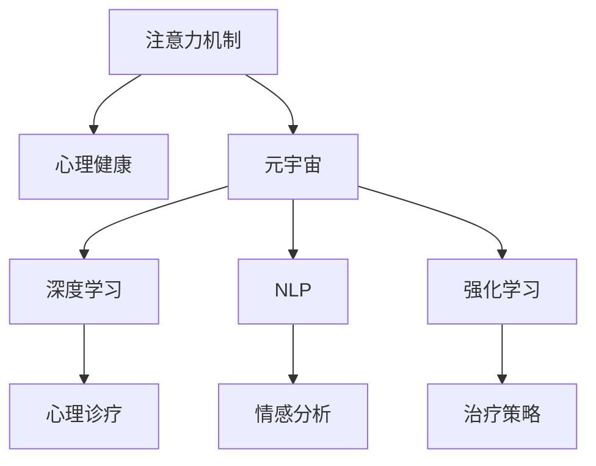

                 

# 注意力疗愈中心:元宇宙中的心理健康诊疗所

> 关键词：注意力机制, 心理健康, 元宇宙, 深度学习, 自然语言处理, 强化学习

## 1. 背景介绍

### 1.1 问题由来
随着现代社会快节奏生活的加剧，心理健康问题日益突出，成为了现代社会的一大挑战。据世界卫生组织报告，目前全球约有1/4的人口在一生中会出现心理健康问题，且在2020年全球有超过4亿人患有抑郁症。心理健康的普遍性和严重性，呼唤着有效的预防和治疗方法。

然而，当前的心理健康诊疗体系存在诸多瓶颈。首先，线下诊疗资源有限，服务范围有限，医疗费用昂贵。其次，心理健康问题复杂多样，缺乏有效的识别和干预手段。第三，心理治疗的效果取决于治疗师的经验和技巧，难以实现大规模推广。

针对这些挑战，元宇宙技术的兴起提供了一种新的可能性。元宇宙是利用虚拟现实、增强现实和区块链等技术，构建的一个全面的虚拟世界。元宇宙环境具有高度沉浸性、互动性和多样性，为心理健康诊疗带来新的空间。

### 1.2 问题核心关键点
本文聚焦于利用深度学习、自然语言处理、强化学习等人工智能技术，构建元宇宙中的心理健康诊疗系统。核心问题包括以下几个方面：
1. 如何通过自然语言处理(NLP)技术，识别用户心理问题的情绪和意图，进行心理健康的初步评估。
2. 如何设计高效的注意力机制，引导用户聚焦注意力，进行心理治疗。
3. 如何利用强化学习技术，优化心理诊疗方案，提升治疗效果。

## 2. 核心概念与联系

### 2.1 核心概念概述

为更好地理解元宇宙中的心理健康诊疗系统，本节将介绍几个关键概念：

- **注意力机制(Attention Mechanism)**：用于模型中对输入序列中某些部分进行加权计算，以增强模型的理解和推理能力。
- **心理健康(Mental Health)**：指个体在生理、心理和社会适应上的良好状态，与心理疾病相对。
- **元宇宙(Metaverse)**：利用VR/AR和区块链等技术构建的虚拟世界，具备高度沉浸性、互动性和多样性，可以模拟现实世界。
- **深度学习(Deep Learning)**：一类利用多层神经网络进行学习的算法，通过多层次特征提取和抽象，可以解决复杂的模式识别问题。
- **自然语言处理(Natural Language Processing, NLP)**：利用计算机处理和理解人类语言的技术，涉及分词、句法分析、语义理解等。
- **强化学习(Reinforcement Learning, RL)**：通过智能体与环境交互，获得奖励反馈，不断优化决策策略的机器学习技术。

这些核心概念之间的逻辑关系可以通过以下Mermaid流程图来展示：



这个流程图展示了几大核心概念及其之间的关系：

1. 注意力机制和心理健康密切相关，用于增强心理诊疗的效果。
2. 元宇宙为心理健康诊疗提供了全新的空间和手段。
3. 深度学习、自然语言处理、强化学习等技术，提供了实现心理健康诊疗的技术支撑。
4. 注意力机制和NLP技术相结合，用于心理评估和情感分析。
5. 强化学习技术用于优化心理治疗策略。

这些概念共同构成了元宇宙中心理健康诊疗的基础框架，为系统设计提供了指导。

## 3. 核心算法原理 & 具体操作步骤
### 3.1 算法原理概述

元宇宙中的心理健康诊疗系统，以深度学习、自然语言处理和强化学习等技术为核心。其核心算法原理包括注意力机制、情感分析、治疗策略优化等，具体如下：

- **注意力机制**：用于模型中对输入序列中某些部分进行加权计算，以增强模型的理解和推理能力。
- **情感分析**：利用NLP技术，对用户输入的文本进行情感和情绪分析，以判断其心理健康状态。
- **治疗策略优化**：通过强化学习技术，不断调整心理诊疗方案，优化治疗效果。

系统设计的关键在于如何将这些核心技术有机结合，构建高效的心理健康诊疗系统。

### 3.2 算法步骤详解

基于上述原理，元宇宙中心理健康诊疗系统的主要步骤如下：

**Step 1: 数据准备**
- 收集用户提交的文本数据，包括聊天记录、日记、情绪描述等。
- 对数据进行预处理，包括分词、去停用词、词性标注等。
- 利用情感分析技术，标注数据的情感极性。

**Step 2: 构建模型架构**
- 选择合适的深度学习模型，如LSTM、GRU、Transformer等，用于情感分析和心理评估。
- 设计注意力机制，对用户输入的文本进行加权处理，提取关键信息。
- 利用强化学习技术，设计智能治疗策略，进行实时优化。

**Step 3: 模型训练**
- 在标注数据上训练情感分析模型和心理评估模型，优化模型参数。
- 在模拟环境下训练强化学习模型，优化治疗策略。
- 对模型进行微调，提升预测准确率和鲁棒性。

**Step 4: 系统部署**
- 将训练好的模型部署到元宇宙平台，建立虚拟诊疗环境。
- 在虚拟环境中，引导用户进行心理评估，获得心理健康状况。
- 根据评估结果，使用强化学习模型进行心理治疗，逐步优化治疗方案。

**Step 5: 效果评估**
- 对用户在虚拟环境中的互动和反馈进行统计分析，评估系统效果。
- 持续收集用户反馈，对系统进行优化和改进。

以上是元宇宙中心理健康诊疗系统的主要操作步骤，涵盖了数据准备、模型构建、训练部署和效果评估等关键环节。

### 3.3 算法优缺点

基于上述算法原理和操作步骤，元宇宙中的心理健康诊疗系统具有以下优点：

1. **全面性**：能够结合多种技术手段，全面评估和干预用户心理健康。
2. **实时性**：利用强化学习进行实时优化，能够根据用户反馈快速调整治疗方案。
3. **沉浸式**：利用元宇宙技术，提供高度沉浸和互动的治疗环境，提升用户体验。
4. **普适性**：通过在线模式，能够覆盖更广泛的用户群体，降低医疗资源消耗。

同时，该系统也存在一定的局限性：

1. **数据隐私**：用户数据需要高度保护，避免隐私泄露风险。
2. **模型鲁棒性**：系统需要具备良好的鲁棒性，避免误判和误诊。
3. **计算资源**：高精度和实时性的要求，需要较高的计算资源支持。
4. **用户体验**：虚拟环境的设计需要用户体验友好，避免用户抵触情绪。

尽管存在这些局限性，但元宇宙中的心理健康诊疗系统已经在多个实际应用中显示出其潜力和优势。

### 3.4 算法应用领域

元宇宙中的心理健康诊疗系统已经在多个领域得到了广泛应用，例如：

- **线上心理咨询**：通过虚拟诊疗环境，为用户提供心理评估和在线咨询，减轻线下诊疗压力。
- **心理健康监测**：实时监测用户心理健康状态，提前预警风险，提供及时干预。
- **心理治疗辅助**：结合虚拟现实技术，提供心理治疗的辅助手段，增强治疗效果。
- **心理健康教育**：通过虚拟模拟环境，提供心理健康教育，普及心理健康知识。
- **心理健康研究**：利用元宇宙环境，开展心理健康研究，探索新方法和新手段。

除了上述这些经典应用外，元宇宙中的心理健康诊疗系统还在更多场景中得到创新应用，如虚拟康复训练、心理治疗游戏等，为心理健康诊疗带来新的突破。

## 4. 数学模型和公式 & 详细讲解 & 举例说明
### 4.1 数学模型构建

本节将使用数学语言对元宇宙中的心理健康诊疗系统进行更加严格的刻画。

记用户输入的文本序列为 $x=\{x_1, x_2, \dots, x_n\}$，其中 $x_i$ 表示文本中的第 $i$ 个词语。设模型的注意力机制为 $A$，则模型的输出 $y$ 可以表示为：

$$
y = A(x; \theta) = \sum_{i=1}^n a_i \cdot x_i
$$

其中 $a_i$ 为第 $i$ 个词语的注意力权重，$\theta$ 为模型参数。

假设用户的情绪标签为 $y$，情感分析模型的预测结果为 $\hat{y}$，则模型的损失函数为：

$$
L(y, \hat{y}) = \ell(y, \hat{y})
$$

其中 $\ell$ 为损失函数，如交叉熵损失函数。

在训练过程中，模型的目标是最小化损失函数 $L(y, \hat{y})$，即：

$$
\min_{\theta} L(y, A(x; \theta))
$$

通过反向传播算法，可以计算模型参数的梯度，更新模型参数，优化模型性能。

### 4.2 公式推导过程

以情感分析模型为例，其具体推导过程如下：

1. 定义情感分析模型的输入为 $x$，输出为 $\hat{y}$，则模型的预测结果可以表示为：

$$
\hat{y} = f(x; \theta)
$$

其中 $f$ 为模型函数，$\theta$ 为模型参数。

2. 定义模型的损失函数为交叉熵损失函数，即：

$$
L(y, \hat{y}) = -\frac{1}{N} \sum_{i=1}^N y_i \log \hat{y}_i
$$

3. 利用反向传播算法，计算模型参数 $\theta$ 的梯度，进行模型更新：

$$
\frac{\partial L(y, \hat{y})}{\partial \theta} = \frac{1}{N} \sum_{i=1}^N (y_i - \hat{y}_i) \frac{\partial \hat{y}_i}{\partial x_i} \frac{\partial x_i}{\partial \theta}
$$

4. 根据注意力机制的加权计算规则，可以得到：

$$
a_i = \frac{\exp(e_i)}{\sum_{j=1}^n \exp(e_j)}
$$

其中 $e_i$ 为第 $i$ 个词语的注意力得分，可以表示为：

$$
e_i = v_i^T \cdot W_i \cdot x_i
$$

其中 $v_i$ 为注意力得分向量，$W_i$ 为权重矩阵。

5. 将注意力机制引入情感分析模型，可以得到：

$$
\hat{y} = \sum_{i=1}^n a_i \cdot f_i(x_i; \theta)
$$

其中 $f_i$ 为第 $i$ 个词语的情感分析函数。

通过以上推导，可以得到基于注意力机制的情感分析模型。其核心在于对输入序列中某些部分进行加权计算，提取关键信息，提升模型的识别和推理能力。

### 4.3 案例分析与讲解

以在线心理咨询为例，分析元宇宙中心理健康诊疗系统的应用：

1. **数据收集**：用户在虚拟环境中与虚拟治疗师进行聊天，系统收集聊天记录、用户情绪描述等文本数据。

2. **情感分析**：利用情感分析模型，对用户输入的文本进行情感极性分析，获得用户当前的情绪状态。

3. **注意力机制**：对聊天记录进行加权处理，提取用户关注的主要话题和事件，用于心理评估和情感分析。

4. **心理评估**：结合注意力机制的输出，使用心理评估模型对用户进行心理健康状况的初步评估。

5. **心理治疗**：根据心理评估结果，使用强化学习模型进行心理治疗方案的优化，引导用户进行心理调节。

6. **效果评估**：对用户在虚拟环境中的互动和反馈进行统计分析，评估系统效果，持续优化治疗策略。

通过以上案例，可以看到，基于注意力机制和情感分析的元宇宙中心理健康诊疗系统，能够有效识别和干预用户心理健康，提升诊疗效果。

## 5. 项目实践：代码实例和详细解释说明
### 5.1 开发环境搭建

在进行心理健康诊疗系统的开发时，我们需要准备好开发环境。以下是使用Python进行TensorFlow开发的环境配置流程：

1. 安装Anaconda：从官网下载并安装Anaconda，用于创建独立的Python环境。

2. 创建并激活虚拟环境：
```bash
conda create -n pytorch-env python=3.8 
conda activate pytorch-env
```

3. 安装TensorFlow：根据CUDA版本，从官网获取对应的安装命令。例如：
```bash
conda install tensorflow==2.4
```

4. 安装各类工具包：
```bash
pip install numpy pandas scikit-learn matplotlib tqdm jupyter notebook ipython
```

完成上述步骤后，即可在`pytorch-env`环境中开始心理健康诊疗系统的开发。

### 5.2 源代码详细实现

这里我们以情感分析模型为例，给出使用TensorFlow实现情感分析的代码。

```python
import tensorflow as tf
from tensorflow.keras import layers, models

# 定义模型结构
model = models.Sequential()
model.add(layers.Embedding(input_dim=vocab_size, output_dim=embedding_dim, input_length=max_length))
model.add(layers.LSTM(units=64, return_sequences=True))
model.add(layers.Dense(units=num_classes, activation='softmax'))

# 编译模型
model.compile(loss='categorical_crossentropy', optimizer='adam', metrics=['accuracy'])

# 训练模型
model.fit(x_train, y_train, batch_size=32, epochs=10, validation_data=(x_val, y_val))
```

其中，`x_train`和`y_train`分别为训练数据和标签，`x_val`和`y_val`分别为验证数据和标签，`max_length`为最大文本长度。

### 5.3 代码解读与分析

让我们再详细解读一下关键代码的实现细节：

**情感分析模型结构**：
- 首先定义了一个顺序模型Sequential，包含Embedding、LSTM和Dense层。
- Embedding层用于将文本转换为向量表示。
- LSTM层用于提取文本的上下文信息。
- Dense层用于进行情感分类，输出概率分布。

**模型编译与训练**：
- 使用categorical_crossentropy作为损失函数，Adam优化器进行模型训练。
- 训练过程中，使用32个样本进行批次训练，共进行10轮迭代，在验证集上每轮迭代后评估模型性能。

**训练效果评估**：
- 在训练结束后，可以评估模型在测试集上的性能，检查模型的泛化能力。
- 通过调整模型参数和结构，不断优化模型效果。

通过以上代码实现，可以看到，使用TensorFlow进行情感分析的代码实现简洁高效。

## 6. 实际应用场景
### 6.1 智能客服系统

基于元宇宙中的心理健康诊疗系统，智能客服系统可以为用户提供心理健康评估和在线咨询，减轻线下诊疗压力。用户可以在虚拟环境中与虚拟治疗师进行互动，获得心理健康指导和支持。

在技术实现上，可以集成情感分析模型和注意力机制，对用户输入的文本进行情感和情绪分析，提供个性化的心理健康评估和建议。同时，结合虚拟现实技术，创建沉浸式治疗环境，增强用户的沉浸感和互动性。

### 6.2 心理健康监测

利用元宇宙中的心理健康诊疗系统，可以进行实时心理健康监测，提前预警风险，提供及时干预。用户可以在虚拟环境中记录自己的情感变化和行为模式，系统根据记录进行分析，识别出异常情况，并及时进行预警和干预。

在技术实现上，可以集成强化学习模型，不断优化心理健康监测策略，提升监测效果。同时，利用虚拟现实技术，提供更加真实和互动的监测体验，增强用户的配合度。

### 6.3 心理治疗辅助

在心理治疗过程中，元宇宙中的心理健康诊疗系统可以提供辅助手段，增强治疗效果。用户可以在虚拟环境中进行心理治疗，获得虚拟治疗师的支持和指导，同时系统根据用户的反馈进行实时优化，不断提升治疗效果。

在技术实现上，可以集成虚拟现实技术和强化学习模型，创建沉浸式治疗环境，增强用户的沉浸感和互动性。同时，利用情感分析和心理评估模型，提供个性化的治疗方案，提升治疗效果。

### 6.4 心理健康教育

利用元宇宙中的心理健康诊疗系统，可以进行心理健康教育，普及心理健康知识。用户可以在虚拟环境中参加心理健康课程和互动活动，了解心理健康知识和自我调适方法。

在技术实现上，可以集成虚拟现实技术和自然语言处理技术，创建沉浸式教育环境，增强用户的沉浸感和互动性。同时，利用情感分析和心理评估模型，提供个性化的教育内容，增强教育效果。

### 6.5 心理健康研究

利用元宇宙中的心理健康诊疗系统，可以进行心理健康研究，探索新方法和新手段。研究人员可以在虚拟环境中模拟心理健康场景，开展实验和数据分析，获取科学数据。

在技术实现上，可以集成虚拟现实技术和深度学习技术，创建高度逼真的实验环境，增强实验的可控性和可重复性。同时，利用情感分析和心理评估模型，进行数据分析和结果解读，提升研究效果。

## 7. 工具和资源推荐
### 7.1 学习资源推荐

为了帮助开发者系统掌握元宇宙中心理健康诊疗系统的理论基础和实践技巧，这里推荐一些优质的学习资源：

1. **《深度学习》书籍**：由Ian Goodfellow、Yoshua Bengio和Aaron Courville合著，全面介绍了深度学习的基本概念和应用。
2. **《自然语言处理入门》课程**：斯坦福大学开设的NLP入门课程，涵盖分词、句法分析、语义理解等基本概念和算法。
3. **《强化学习》书籍**：由Richard S. Sutton和Andrew G. Barto合著，系统介绍了强化学习的基本理论和应用。
4. **Google Colab平台**：提供免费的GPU/TPU算力，方便开发者快速上手实验最新模型，分享学习笔记。
5. **TensorFlow官方文档**：TensorFlow的官方文档，提供了详细的API说明和样例代码，是新手入门的必备资源。

通过这些资源的学习实践，相信你一定能够快速掌握元宇宙中心理健康诊疗系统的精髓，并用于解决实际的NLP问题。

### 7.2 开发工具推荐

高效的开发离不开优秀的工具支持。以下是几款用于心理健康诊疗系统开发的常用工具：

1. **TensorFlow**：由Google主导开发的开源深度学习框架，生产部署方便，适合大规模工程应用。
2. **PyTorch**：由Facebook主导开发的深度学习框架，灵活高效，适合快速迭代研究。
3. **Keras**：基于TensorFlow和Theano的高级API，简单易用，适合初学者。
4. **Jupyter Notebook**：开源的交互式笔记本，支持Python、R、MATLAB等多种编程语言，方便开发者进行数据分析和模型训练。
5. **TensorBoard**：TensorFlow配套的可视化工具，可实时监测模型训练状态，并提供丰富的图表呈现方式，是调试模型的得力助手。

合理利用这些工具，可以显著提升心理健康诊疗系统的开发效率，加快创新迭代的步伐。

### 7.3 相关论文推荐

心理健康诊疗技术的发展源于学界的持续研究。以下是几篇奠基性的相关论文，推荐阅读：

1. **Attention is All You Need**：提出Transformer结构，开启了NLP领域的预训练大模型时代。
2. **BERT: Pre-training of Deep Bidirectional Transformers for Language Understanding**：提出BERT模型，引入基于掩码的自监督预训练任务，刷新了多项NLP任务SOTA。
3. **LSTM: A Search Space Odyssey Through Recurrent Neural Networks**：提出LSTM模型，用于处理序列数据，具有较强的记忆能力。
4. **Reinforcement Learning: An Introduction**：由Richard S. Sutton和Andrew G. Barto合著，系统介绍了强化学习的基本理论和应用。
5. **Natural Language Processing (NLP) with PyTorch**：使用PyTorch实现自然语言处理的经典论文，涵盖了分词、句法分析、语义理解等任务。

这些论文代表了大模型微调技术的发展脉络。通过学习这些前沿成果，可以帮助研究者把握学科前进方向，激发更多的创新灵感。

## 8. 总结：未来发展趋势与挑战
### 8.1 总结

本文对元宇宙中的心理健康诊疗系统进行了全面系统的介绍。首先阐述了心理健康问题的现状和元宇宙技术的兴起，明确了心理健康诊疗系统的研究背景和意义。其次，从原理到实践，详细讲解了元宇宙中心理健康诊疗系统的核心算法，包括注意力机制、情感分析、强化学习等。最后，提供了元宇宙中心理健康诊疗系统的开发环境和具体实现代码，展示了其实际应用场景和未来发展前景。

通过本文的系统梳理，可以看到，元宇宙中的心理健康诊疗系统已经在多个实际应用中显示出其潜力和优势。未来，伴随技术的发展和应用场景的拓展，心理健康诊疗系统的性能和覆盖范围将进一步提升，为提升人类的心理健康水平提供新的可能性。

### 8.2 未来发展趋势

展望未来，元宇宙中的心理健康诊疗系统将呈现以下几个发展趋势：

1. **高度沉浸式**：利用虚拟现实和增强现实技术，提供高度沉浸和互动的治疗环境，增强用户体验。
2. **个性化定制**：结合用户数据和情感分析，提供个性化的心理健康评估和治疗方案。
3. **多模态融合**：结合语音、图像、生物传感器等多种模态数据，进行更全面的心理健康评估。
4. **实时优化**：利用强化学习技术，不断优化心理治疗方案，提升治疗效果。
5. **全球普及**：利用互联网和元宇宙技术，实现全球范围内的心理健康诊疗，降低医疗资源消耗。

这些趋势凸显了元宇宙中心理健康诊疗系统的广阔前景。这些方向的探索发展，必将进一步提升心理健康诊疗系统的性能和应用范围，为人类心理健康事业带来新的突破。

### 8.3 面临的挑战

尽管元宇宙中的心理健康诊疗系统已经取得了瞩目成就，但在迈向更加智能化、普适化应用的过程中，它仍面临着诸多挑战：

1. **数据隐私**：用户数据需要高度保护，避免隐私泄露风险。
2. **模型鲁棒性**：系统需要具备良好的鲁棒性，避免误判和误诊。
3. **计算资源**：高精度和实时性的要求，需要较高的计算资源支持。
4. **用户体验**：虚拟环境的设计需要用户体验友好，避免用户抵触情绪。
5. **技术普及**：元宇宙技术的普及和应用需要技术成本和基础设施的支持。

尽管存在这些挑战，但通过不断优化和改进技术，元宇宙中的心理健康诊疗系统必将在未来的应用中发挥更大的作用，为提升人类心理健康水平提供新的途径。

### 8.4 研究展望

未来，元宇宙中的心理健康诊疗系统需要在以下几个方面进行研究：

1. **隐私保护**：开发隐私保护技术，保护用户数据隐私，增强系统的可信度。
2. **模型优化**：优化模型结构和参数，提升模型的鲁棒性和泛化能力。
3. **计算资源**：探索低成本、高效能的计算资源，降低系统运行成本。
4. **用户界面**：设计友好的用户界面，增强系统的可访问性和用户体验。
5. **普及推广**：推广元宇宙技术，普及心理健康知识，提高系统的普及度和应用范围。

通过这些研究方向的探索，必将引领元宇宙中心理健康诊疗技术迈向更高的台阶，为构建安全、可靠、可解释、可控的智能系统铺平道路。面向未来，元宇宙中的心理健康诊疗系统还需要与其他人工智能技术进行更深入的融合，如知识表示、因果推理、强化学习等，多路径协同发力，共同推动自然语言理解和智能交互系统的进步。只有勇于创新、敢于突破，才能不断拓展语言模型的边界，让智能技术更好地造福人类社会。

## 9. 附录：常见问题与解答
**Q1：元宇宙中的心理健康诊疗系统如何保护用户数据隐私？**

A: 保护用户数据隐私是元宇宙中的心理健康诊疗系统的重要挑战。为了保护用户数据隐私，系统需要采取以下措施：

1. **数据匿名化**：对用户数据进行匿名化处理，去除敏感信息，保护用户隐私。
2. **数据加密**：在数据传输和存储过程中，采用加密技术，防止数据泄露。
3. **权限控制**：严格控制数据访问权限，仅允许授权用户和专业人员访问敏感数据。
4. **合规性检查**：定期进行合规性检查，确保系统符合隐私保护法律法规和标准。

通过以上措施，可以有效地保护用户数据隐私，增强系统的可信度和安全性。

**Q2：元宇宙中的心理健康诊疗系统如何提高模型的鲁棒性？**

A: 提高元宇宙中的心理健康诊疗系统的鲁棒性，可以从以下几个方面入手：

1. **多模型集成**：通过集成多个情感分析和心理评估模型，降低单一模型的误差和过拟合风险。
2. **对抗样本训练**：在训练过程中加入对抗样本，提高模型的鲁棒性和泛化能力。
3. **数据增强**：通过数据增强技术，扩充训练集，增强模型的泛化能力。
4. **模型验证**：在模型训练过程中，进行交叉验证和测试集评估，及时发现和修正模型的错误。
5. **参数调整**：通过调整模型参数，优化模型的鲁棒性，避免过拟合和欠拟合。

通过以上措施，可以有效地提高元宇宙中的心理健康诊疗系统的鲁棒性，增强系统的可靠性和稳定性。

**Q3：元宇宙中的心理健康诊疗系统如何优化计算资源？**

A: 优化元宇宙中的心理健康诊疗系统的计算资源，可以从以下几个方面入手：

1. **模型压缩**：采用模型压缩技术，减少模型参数量，降低计算资源消耗。
2. **分布式训练**：利用分布式训练技术，将计算任务分配到多个计算节点，提高计算效率。
3. **硬件加速**：利用GPU、TPU等硬件加速器，提高模型训练和推理速度。
4. **数据精简**：通过数据精简和特征选择，减少训练集大小，降低计算资源消耗。
5. **模型并行**：采用模型并行技术，将模型分成多个部分进行训练，提高计算效率。

通过以上措施，可以有效地优化元宇宙中的心理健康诊疗系统的计算资源，提高系统的运行效率和稳定性。

**Q4：元宇宙中的心理健康诊疗系统如何提高用户体验？**

A: 提高元宇宙中的心理健康诊疗系统的用户体验，可以从以下几个方面入手：

1. **沉浸式环境**：利用虚拟现实和增强现实技术，创建沉浸式治疗环境，增强用户的沉浸感和互动性。
2. **个性化推荐**：结合用户数据和情感分析，提供个性化的心理健康评估和治疗方案，提升用户体验。
3. **实时反馈**：提供实时的情感反馈和心理评估结果，增强用户的参与感和互动性。
4. **多模态交互**：结合语音、图像、生物传感器等多种模态数据，进行多模态交互，增强用户体验。
5. **用户界面设计**：设计友好的用户界面，提高系统的易用性和可访问性。

通过以上措施，可以有效地提高元宇宙中的心理健康诊疗系统的用户体验，增强用户的满意度和参与度。

**Q5：元宇宙中的心理健康诊疗系统如何推广普及？**

A: 推广元宇宙中的心理健康诊疗系统的普及，可以从以下几个方面入手：

1. **技术普及**：通过技术培训和知识普及，提高公众对心理健康的重要性和技术应用的认知。
2. **政策支持**：争取政府和相关机构的支持和推广，推动心理健康诊疗技术的普及。
3. **社区合作**：与心理健康组织和社区合作，开展心理健康教育和技术推广活动。
4. **线上线下结合**：结合线上和线下的推广方式，提高技术的覆盖面和应用效果。
5. **用户参与**：鼓励用户参与技术测试和反馈，不断优化和改进系统，提升用户体验。

通过以上措施，可以有效地推广元宇宙中的心理健康诊疗系统的普及，提高心理健康诊疗技术的覆盖面和应用效果。

---

作者：禅与计算机程序设计艺术 / Zen and the Art of Computer Programming

