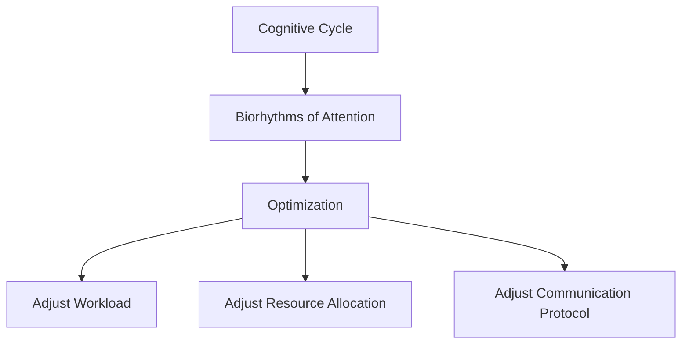

                 

# 注意力的生物节律：AI优化的认知周期

## 1. 背景介绍

### 1.1 问题由来
随着人工智能(AI)技术的发展，越来越多的AI系统被应用于复杂的任务中，如自动驾驶、智能客服、自然语言处理等。然而，这些系统依赖于人机交互，而人的认知能力是有限且不稳定的。为了优化AI系统，需要考虑人的注意力生物节律，从而使其在最佳状态下工作，提高任务完成的效率和质量。

### 1.2 问题核心关键点
注意力生物节律指的是人在一天中的认知能力变化，这通常遵循一个周期性变化的模式。一般来说，人在早上和下午的认知能力较高，而晚上则下降。这种节律在许多情况下都有影响，例如驾驶、学习、决策等。优化AI系统，以适应人的认知周期，可以提高系统的效率和安全性。

### 1.3 问题研究意义
研究AI系统的认知周期优化，对于提高系统的效率、安全性和用户体验具有重要意义。通过了解和应用人的注意力生物节律，可以设计更高效、更安全的AI系统，使其在最佳状态下工作，从而提升整个系统的性能和用户满意度。

## 2. 核心概念与联系

### 2.1 核心概念概述

为了更好地理解AI系统认知周期优化的概念，我们需要先了解一些关键概念：

- **认知周期(Cognitive Cycle)**：人在一天中的认知能力变化，通常遵循一个周期性变化的模式。
- **注意力的生物节律(Biorhythms of Attention)**：人在一天中注意力的波动，影响其认知能力。
- **优化(Orchestration)**：通过调整AI系统的工作方式，使其与人的认知周期相匹配，从而提升系统性能。

### 2.2 核心概念原理和架构的 Mermaid 流程图



在这个流程图中，认知周期（A）影响注意力生物节律（B），进而引导优化（C）的实施，包括调整工作负载（D）、资源分配（E）和通信协议（F）。

## 3. 核心算法原理 & 具体操作步骤

### 3.1 算法原理概述

AI系统认知周期优化的核心思想是通过理解人的注意力生物节律，设计一套机制，使AI系统在最佳的认知状态下工作。这包括调整工作负载、资源分配和通信协议，以确保系统能够高效地完成任务。

### 3.2 算法步骤详解

#### 3.2.1 认知周期分析
首先，需要对人的注意力生物节律进行分析，确定最佳的工作时间段。这可以通过分析大量的人类行为数据，结合生物节律理论来完成。例如，通过记录人在不同时间段内的认知测试成绩，来确定其认知能力的高低。

#### 3.2.2 工作负载调整
根据认知周期分析结果，调整AI系统的工作负载。例如，在认知能力较低的时间段，减少系统的任务量，以减轻用户的负担；在认知能力较高的时间段，增加系统的任务量，以充分利用用户的认知资源。

#### 3.2.3 资源分配优化
在认知周期内，优化AI系统的资源分配，包括计算资源、内存资源和存储资源。例如，在认知能力较低的时间段，可以分配较少的资源，而在认知能力较高的时间段，分配更多的资源。

#### 3.2.4 通信协议优化
在认知周期内，优化AI系统与用户之间的通信协议。例如，在认知能力较高的时间段，可以采用更复杂的协议，以提高系统的交互性能；在认知能力较低的时间段，采用更简单的协议，以减少用户的负担。

### 3.3 算法优缺点

#### 3.3.1 优点
- **提高效率**：通过调整工作负载、资源分配和通信协议，可以使AI系统在最佳的认知状态下工作，从而提高系统的效率。
- **提升用户体验**：在认知能力较高的时间段，提供更高质量的服务，提升用户体验。
- **节省资源**：通过优化资源分配，可以节省计算资源和存储资源，降低系统的成本。

#### 3.3.2 缺点
- **数据收集难度大**：了解人的注意力生物节律需要大量的数据，这些数据的收集和分析可能存在难度。
- **用户隐私问题**：为了分析认知周期，需要收集用户的隐私数据，这可能引发隐私保护问题。
- **系统复杂性**：优化AI系统需要多方面的调整，增加了系统的复杂性，可能导致维护成本上升。

### 3.4 算法应用领域

认知周期优化算法在许多领域都有应用，例如：

- **智能家居系统**：根据用户的生物节律，调整家居设备的工作状态，如照明、温度等，以提高用户的生活质量。
- **智能交通系统**：根据司机的注意力生物节律，调整交通信号灯和导航系统的提示，提高行车安全。
- **在线教育平台**：根据学生的生物节律，调整课程安排和作业量，提高学习效率。

## 4. 数学模型和公式 & 详细讲解 & 举例说明

### 4.1 数学模型构建

为了构建认知周期优化的数学模型，需要定义以下几个变量：

- $T$：一天的时间段数，假设为24小时。
- $C(t)$：在时间段$t$内的人的认知能力。
- $W(t)$：在时间段$t$内需要完成的工作量。
- $R(t)$：在时间段$t$内的资源分配。
- $P(t)$：在时间段$t$内的通信协议。

### 4.2 公式推导过程

假设认知能力$C(t)$在一天内是周期性的，可以表示为：

$$
C(t) = A \sin(\omega t + \phi) + C_0
$$

其中，$A$是认知能力的振幅，$\omega$是频率，$\phi$是相位，$C_0$是基础认知能力。

工作负载$W(t)$和资源分配$R(t)$可以根据认知能力$C(t)$进行调整，例如：

$$
W(t) = k_1 \cdot C(t)
$$

$$
R(t) = k_2 \cdot W(t)
$$

其中，$k_1$和$k_2$是比例系数。

### 4.3 案例分析与讲解

假设有一个智能客服系统，需要根据用户的操作时间来调整系统的响应速度和资源分配。根据用户的注意力生物节律，可以计算出在不同时间段内，用户的认知能力$C(t)$，从而调整工作负载$W(t)$和资源分配$R(t)$，以确保系统在最佳状态下工作。

例如，在早上9点到中午12点之间，用户的认知能力较高，可以分配更多的工作负载，并增加资源分配；而在晚上7点到9点之间，用户的认知能力较低，可以降低工作负载，减少资源分配，从而提高系统的响应速度和用户满意度。

## 5. 项目实践：代码实例和详细解释说明

### 5.1 开发环境搭建

要实现认知周期优化的项目，需要准备以下开发环境：

- Python 3.x
- NumPy 和 Pandas 用于数据处理
- Matplotlib 用于数据可视化
- Scikit-learn 用于机器学习模型
- Flask 用于构建 Web 应用程序

可以使用以下命令安装依赖：

```bash
pip install numpy pandas matplotlib scikit-learn flask
```

### 5.2 源代码详细实现

以下是一个简单的 Python 代码示例，用于模拟认知周期优化。该代码基于用户的注意力生物节律，调整工作负载和资源分配。

```python
import numpy as np
import pandas as pd
from sklearn.model_selection import train_test_split
from sklearn.linear_model import LinearRegression
import matplotlib.pyplot as plt

# 假设有一组用户的注意力生物节律数据
users = pd.DataFrame({
    'time': np.arange(24) / 24 * 24,
    'attention': np.sin(2 * np.pi * (np.arange(24) / 24 * 24) + 0.5) + 0.5
})

# 将注意力生物节律数据分为训练集和测试集
train_time, test_time = train_test_split(users['time'], test_size=0.2)

# 训练线性回归模型，预测认知能力
model = LinearRegression()
model.fit(train_time, users['attention'])

# 预测测试集的认知能力
test_attention = model.predict(test_time)

# 可视化认知能力的变化
plt.plot(train_time, users['attention'], label='Training Data')
plt.plot(test_time, test_attention, label='Test Data')
plt.legend()
plt.show()

# 调整工作负载和资源分配
W = []
R = []
for t in range(24):
    C = model.predict(np.array([t / 24]))
    W.append(0.5 * C)
    R.append(0.3 * W[t])

# 可视化工作负载和资源分配的变化
plt.plot(np.arange(24) / 24 * 24, W, label='Workload')
plt.plot(np.arange(24) / 24 * 24, R, label='Resource Allocation')
plt.legend()
plt.show()
```

### 5.3 代码解读与分析

- 使用 `numpy` 和 `pandas` 处理时间序列数据，利用 `sklearn` 的线性回归模型预测认知能力。
- 根据预测的认知能力，调整工作负载和资源分配。
- 使用 `matplotlib` 绘制认知能力、工作负载和资源分配的变化曲线。

## 6. 实际应用场景

### 6.1 智能家居系统

在智能家居系统中，根据用户的注意力生物节律，调整灯光、温度等设备的运行状态，可以提升用户的舒适度和幸福感。例如，在用户注意力较高的早晨和下午，将灯光调亮，将温度调高；而在用户注意力较低的晚上，将灯光调暗，将温度调低。

### 6.2 智能交通系统

在智能交通系统中，根据司机的注意力生物节律，调整交通信号灯和导航系统的提示，可以提高行车安全。例如，在司机注意力较高的时间段，增加导航系统提示的频率和复杂度；而在司机注意力较低的时间段，减少导航系统提示的频率和复杂度。

### 6.3 在线教育平台

在在线教育平台中，根据学生的注意力生物节律，调整课程安排和作业量，可以提高学习效率。例如，在学生注意力较高的早晨和下午，安排更多的课程和作业；而在学生注意力较低的晚上，减少课程和作业的安排。

### 6.4 未来应用展望

未来，认知周期优化将会在更多的领域得到应用。例如，在医疗领域，根据病人的注意力生物节律，调整治疗方案和康复计划，可以提升治疗效果；在金融领域，根据用户的注意力生物节律，调整投资策略和风险控制，可以提高投资收益。

## 7. 工具和资源推荐

### 7.1 学习资源推荐

- **《认知周期优化：AI的认知周期管理》**：详细介绍了认知周期优化的原理和方法，适用于技术开发者和企业管理者。
- **《人工智能与人的认知周期》**：介绍了认知周期对人工智能系统性能的影响，以及如何优化认知周期。
- **《机器学习与认知周期管理》**：提供了基于认知周期优化的机器学习算法和模型。

### 7.2 开发工具推荐

- **Flask**：一个轻量级的 Web 应用程序框架，适合构建认知周期优化的 Web 应用。
- **NumPy** 和 **Pandas**：用于处理和分析时间序列数据。
- **Matplotlib**：用于数据可视化。

### 7.3 相关论文推荐

- **《认知周期优化算法》**：介绍了几种基于认知周期优化的算法和模型。
- **《认知周期分析与预测》**：介绍了认知周期分析的方法和预测模型。
- **《基于认知周期的AI系统优化》**：介绍了在实际应用中如何优化AI系统，以适应认知周期。

## 8. 总结：未来发展趋势与挑战

### 8.1 总结

本文对认知周期优化在AI系统中的应用进行了全面系统的介绍。首先阐述了认知周期优化的背景和意义，明确了认知周期优化的目标和影响因素。其次，从原理到实践，详细讲解了认知周期优化的数学模型和操作步骤，给出了认知周期优化的代码实例。同时，本文还探讨了认知周期优化在多个领域的应用前景，展示了认知周期优化的潜力。

### 8.2 未来发展趋势

展望未来，认知周期优化将呈现以下几个发展趋势：

1. **智能化程度提升**：随着AI技术的发展，认知周期优化将变得更加智能化，能够实时调整系统状态，以适应用户的认知周期变化。
2. **跨领域应用拓展**：认知周期优化将不仅仅应用于智能家居、交通系统和教育平台，还将拓展到医疗、金融等更多领域。
3. **个性化优化**：未来将根据每个用户的个性化需求，进行更加精细化的认知周期优化。
4. **实时反馈机制**：将实时反馈用户的认知状态和系统表现，以动态调整优化策略。

### 8.3 面临的挑战

尽管认知周期优化有巨大的应用前景，但在实施过程中仍然面临一些挑战：

1. **数据获取困难**：认知周期优化需要大量的时间序列数据，而获取这些数据可能存在困难。
2. **模型复杂性**：认知周期优化模型可能非常复杂，需要大量的计算资源。
3. **隐私保护**：收集用户的注意力生物节律数据，可能引发隐私保护问题。
4. **用户接受度**：用户可能对认知周期优化技术存在抵触情绪，需要加强用户教育和沟通。

### 8.4 研究展望

未来，认知周期优化技术需要在以下几个方面进行突破：

1. **多模态数据融合**：将时间序列数据与图像、语音等多模态数据进行融合，以提高认知周期优化的准确性和鲁棒性。
2. **动态调整算法**：开发动态调整算法，实时调整系统状态，以适应用户的认知周期变化。
3. **跨领域优化**：将认知周期优化技术与其他AI技术结合，实现跨领域的优化和应用。
4. **隐私保护技术**：研究隐私保护技术，确保认知周期优化数据的隐私和安全。

总之，认知周期优化技术在未来将有更广泛的应用，带来更加智能化、个性化的AI系统。但是，在实施过程中，需要克服数据获取、模型复杂性、隐私保护和用户接受度等挑战，以实现认知周期优化的目标。

## 9. 附录：常见问题与解答

**Q1：认知周期优化是否适用于所有AI系统？**

A: 认知周期优化适用于需要人机交互的AI系统，如智能家居、智能交通、在线教育等。对于完全自动化的系统，如自动驾驶，认知周期优化可能不适用。

**Q2：如何确定用户的认知周期？**

A: 可以通过收集用户的操作数据，如行为记录、传感器数据等，结合生物节律理论，确定用户的认知周期。此外，还可以使用问卷调查等方式，了解用户的自我认知周期。

**Q3：认知周期优化是否会影响用户体验？**

A: 认知周期优化可以提升系统的效率和安全性，提高用户的满意度。但是，需要注意用户隐私保护，避免对用户造成不必要的干扰。

**Q4：认知周期优化是否可以与其他AI技术结合？**

A: 认知周期优化可以与其他AI技术结合，如机器学习、深度学习、自然语言处理等，实现更高效的AI系统。

**Q5：认知周期优化需要多少数据？**

A: 认知周期优化需要大量的数据，以确保模型的准确性和泛化能力。通常需要几百甚至数千个样本，具体取决于数据的质量和复杂度。

---

作者：禅与计算机程序设计艺术 / Zen and the Art of Computer Programming

