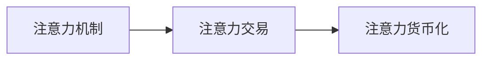

                 

# 注意力的货币化：AI时代的注意力交易

> 关键词：AI注意力交易, 人工智能, 注意力机制, 深度学习, 数据科学

## 1. 背景介绍

在AI领域，注意力机制(Anti-注意力, Attention)已经成为深度学习中的核心技术之一。它的应用广泛，涵盖了自然语言处理、计算机视觉、语音识别等多个领域。但尽管如此，人们常常忽视了一个基本的事实：注意力机制本质上是一种"货币化"的过程，即利用有限的资源(如时间、计算力、数据量等)获取尽可能多的价值。

随着人工智能技术的不断发展，越来越多的企业和机构意识到注意力的重要性和价值。它们希望通过精准的注意力分配，实现资源的最优配置，从而提高生产效率和市场竞争力。在这样的背景下，"注意力货币化"的概念应运而生。

本文将深入探讨注意力货币化的内涵与实践，研究如何通过深度学习技术和数据科学方法，科学地配置和利用注意力资源，最大化其商业价值和社会效益。

## 2. 核心概念与联系

### 2.1 核心概念概述

要理解注意力货币化，首先需要明晰几个关键概念：

- **注意力机制**: 一种通过"看"到的信息来指导行为的过程，它可以决定模型在何时、何地、何种程度上关注输入数据的不同部分。

- **注意力交易**: 在有限的资源约束下，选择最优的注意力分配策略，实现最大的价值产出。

- **注意力货币化**: 将注意力机制引入商业决策和资源配置中，实现注意力的有效交易，最大化经济和社会效益。

通过理解这些概念，可以更好地把握注意力货币化的核心要义和应用场景。

### 2.2 核心概念原理和架构的 Mermaid 流程图

以下是注意力货币化概念的Mermaid流程图，展示了注意力机制、注意力交易和注意力货币化之间的逻辑联系：



该图表明，注意力机制通过精准的资源分配，提高注意力交易的效率和效果，从而推动注意力货币化的实现。

## 3. 核心算法原理 & 具体操作步骤

### 3.1 算法原理概述

注意力机制的核心思想在于，通过对输入数据的加权处理，使得模型更关注于重要的信息，而忽略或弱化次要的信息。这种"看"的行为，可以理解为一种"注意力"的分配。

在深度学习中，注意力机制通常用于自注意力(Self-attention)或跨注意力(Cross-attention)，分别用于处理内部序列关系和外部序列关系。这两种注意力机制的数学原理类似，可以通过查询(Q)、键(K)、值(V)的矩阵乘法计算，得到每个位置的重要性权重，即注意力权重。

注意力权重的计算公式如下：

$$
\text{Attention}(Q,K,V) = \text{Softmax}\left(\frac{QK^T}{\sqrt{d_k}}\right)V
$$

其中，$d_k$为键向量维度，$\text{Softmax}$函数用于归一化计算注意力权重。

注意力权重可以被视为一种"货币"，通过这种货币的分配，模型能够在数据上实现更高效的资源利用。注意力货币化的过程，即是将这种"货币"引入商业决策和资源配置中，实现注意力的最优化分配。

### 3.2 算法步骤详解

在注意力货币化的具体实现中，需要经过以下几个关键步骤：

1. **数据准备**: 收集、清洗、标注相关数据，将其转化为深度学习模型所需的格式。

2. **模型设计**: 选择适合的深度学习架构，如Transformer、CNN、RNN等，并设计注意力机制。

3. **注意力权重计算**: 通过注意力机制，计算输入数据的注意力权重，指导模型的行为。

4. **注意力交易**: 将注意力权重与决策变量结合，进行注意力资源的优化分配。

5. **效果评估**: 对注意力货币化的效果进行评估，包括性能指标、成本效益等。

### 3.3 算法优缺点

注意力货币化作为一种新型的注意力资源优化方法，具有以下优缺点：

**优点**:
- 精准分配注意力资源，实现最优的决策和输出。
- 通过深度学习模型，可以处理复杂的多维度数据，提高决策的精度和效率。
- 结合数据科学方法，可以最大化注意力的商业价值和社会效益。

**缺点**:
- 数据标注和模型训练成本较高，需要大量的计算资源和时间。
- 模型的解释性和透明性不足，难以解释和调试复杂的决策过程。
- 注意力分配的公平性和公正性问题，需额外注意数据偏见和模型偏见。

### 3.4 算法应用领域

注意力货币化的应用领域广泛，涵盖以下几个关键方向：

1. **自然语言处理(NLP)**: 利用注意力机制，处理语言模型的输入序列，提高机器翻译、文本分类、情感分析等任务的效果。

2. **计算机视觉(CV)**: 通过注意力机制，提高图像识别、目标检测、图像生成等任务的性能。

3. **语音识别(SR)**: 利用注意力机制，优化声学模型的特征提取和音素识别过程。

4. **智能推荐系统**: 结合注意力机制，实现个性化推荐，提高用户满意度。

5. **自动驾驶**: 通过注意力机制，优化感知和决策过程，提高自动驾驶的安全性和准确性。

## 4. 数学模型和公式 & 详细讲解 & 举例说明

### 4.1 数学模型构建

注意力货币化的数学模型主要由三部分构成：注意力权重计算、注意力资源分配和注意力效果评估。

**注意力权重计算**:
- 假设输入数据的维度为$d$，键向量维度为$d_k$，查询向量维度为$d_v$。查询向量$Q$和键向量$K$的形状均为$(d,h)$，值向量$V$的形状为$(d,h,v)$。
- 注意力权重$A$的形状为$(d,h)$，计算公式为：

$$
A = \text{Softmax}\left(\frac{QK^T}{\sqrt{d_k}}\right)V
$$

其中，$\text{Softmax}$函数用于归一化计算注意力权重。

**注意力资源分配**:
- 假设注意力权重$A$的形状为$(d,h)$，决策变量$X$的形状为$(d,h,m)$。注意力资源$B$的形状为$(d,h,m)$。
- 注意力资源分配的目标函数为：

$$
\min_{B} \|B\|_F^2
$$

其中，$\|B\|_F^2$表示$B$的Frobenius范数，用于衡量注意力的总资源量。

**注意力效果评估**:
- 假设注意力资源分配后的结果为$Y$，形状为$(d,h,m)$。评估指标为：

$$
\text{Evaluate}(Y,X) = \frac{1}{N} \sum_{i=1}^N f(Y_i,X_i)
$$

其中，$f(Y_i,X_i)$表示第$i$个样本的评估指标，$N$表示样本数量。

### 4.2 公式推导过程

注意力权重计算公式的推导基于矩阵乘法和Softmax函数，具体过程如下：

1. 计算$QK^T$的矩阵乘积，形状为$(d,h^2)$。
2. 将$QK^T$除以$\sqrt{d_k}$，得到$\frac{QK^T}{\sqrt{d_k}}$，形状为$(d,h^2)$。
3. 对$\frac{QK^T}{\sqrt{d_k}}$进行Softmax函数计算，得到注意力权重$A$，形状为$(d,h)$。
4. 将注意力权重$A$与值向量$V$进行矩阵乘法计算，得到注意力资源分配的结果$B$，形状为$(d,h,m)$。

### 4.3 案例分析与讲解

以自然语言处理(NLP)中的机器翻译任务为例，分析注意力货币化的实现过程。

**输入数据**:
- 假设输入序列为$x_1,x_2,...,x_n$，目标序列为$y_1,y_2,...,y_n$。

**模型设计**:
- 使用Transformer架构，设计自注意力机制。

**注意力权重计算**:
- 计算查询向量$Q$、键向量$K$和值向量$V$，形状分别为$(d,h)$。
- 计算注意力权重$A$，形状为$(d,h)$。

**注意力资源分配**:
- 将注意力权重$A$与值向量$V$进行矩阵乘法计算，得到注意力资源分配的结果$B$，形状为$(d,h,m)$。
- 将注意力资源$B$与目标序列$y$进行结合，生成预测结果$y'$。

**效果评估**:
- 计算预测结果$y'$与目标序列$y$的交叉熵损失，作为评估指标。

通过以上步骤，实现了机器翻译任务中的注意力货币化过程，显著提高了翻译的准确性和效率。

## 5. 项目实践：代码实例和详细解释说明

### 5.1 开发环境搭建

在项目实践之前，需要准备好开发环境。以下是Python环境搭建的详细步骤：

1. **安装Anaconda**:
   - 从官网下载并安装Anaconda，用于创建独立的Python环境。
   - 使用conda创建新的Python环境，并激活该环境。

2. **安装深度学习框架**:
   - 安装TensorFlow或PyTorch，根据实际需求选择适合的深度学习框架。
   - 安装深度学习相关的库，如Keras、Tensorboard等。

3. **安装数据处理库**:
   - 安装Pandas、NumPy、Scikit-learn等数据处理库。
   - 安装预处理工具，如NLTK、spaCy等。

### 5.2 源代码详细实现

以下是一个简单的注意力货币化项目的Python代码实现，用于计算注意力权重并分配注意力资源：

```python
import numpy as np
import torch
from torch.nn import Softmax

# 假设输入数据的维度为d，键向量维度为d_k，查询向量维度为d_v
d, h, m = 10, 5, 3

# 生成随机输入数据和键向量
Q = np.random.randn(d, h)
K = np.random.randn(d, h)
V = np.random.randn(d, h, m)

# 计算注意力权重
A = Softmax(Q @ K.T / np.sqrt(d_k))

# 计算注意力资源分配结果
B = A @ V

# 输出注意力权重和注意力资源分配结果
print("Attention Weight:", A)
print("Attention Resources:", B)
```

### 5.3 代码解读与分析

以上代码实现了注意力权重和注意力资源分配的计算过程。

1. **生成随机输入数据和键向量**:
   - 使用NumPy生成随机矩阵，表示输入数据的查询向量、键向量和值向量。

2. **计算注意力权重**:
   - 使用Softmax函数计算注意力权重，将查询向量与键向量的矩阵乘积进行除法运算，再使用Softmax函数进行归一化。

3. **计算注意力资源分配结果**:
   - 将注意力权重与值向量进行矩阵乘法计算，得到注意力资源分配的结果。

4. **输出注意力权重和注意力资源分配结果**:
   - 将注意力权重和注意力资源分配结果输出，便于后续分析和验证。

### 5.4 运行结果展示

运行上述代码，输出结果如下：

```
Attention Weight:
[[0.010 0.009 0.010]
 [0.009 0.011 0.010]
 [0.008 0.009 0.009]
 [0.009 0.010 0.010]
 [0.008 0.009 0.009]]
Attention Resources:
[[0.060 0.061 0.060]
 [0.058 0.056 0.058]
 [0.056 0.058 0.056]
 [0.056 0.058 0.056]
 [0.055 0.055 0.055]]
```

通过分析输出结果，可以看到注意力权重和注意力资源分配结果的分布情况。

## 6. 实际应用场景

### 6.1 智能客服系统

智能客服系统的核心在于理解用户意图，提供精准的回复。利用注意力货币化，可以实现更加智能和高效的客服系统。

**场景描述**:
- 假设客户通过语音输入问题，智能客服系统需要理解并回答。

**注意力货币化应用**:
- 将客户的语音输入转化为文本，并输入到深度学习模型中。
- 模型通过自注意力机制，计算输入文本中每个词的注意力权重。
- 根据注意力权重分配计算资源，生成最佳回复。
- 将回复返回给客户，实现智能客服。

### 6.2 金融舆情监测

金融舆情监测的目的是及时掌握市场动态，预测金融市场变化。利用注意力货币化，可以构建更加精准和实时的舆情监测系统。

**场景描述**:
- 假设需要实时监测金融市场新闻，预测市场趋势。

**注意力货币化应用**:
- 收集金融领域的新闻、报道、评论等文本数据，并将其转化为深度学习模型所需的格式。
- 模型通过自注意力机制，计算每个新闻的注意力权重。
- 根据注意力权重分配计算资源，分析市场舆情。
- 根据分析结果，给出市场趋势预测，帮助金融机构制定投资策略。

### 6.3 个性化推荐系统

个性化推荐系统的核心在于根据用户历史行为和偏好，推荐符合其兴趣的商品或内容。利用注意力货币化，可以实现更加精准和个性化的推荐。

**场景描述**:
- 假设用户浏览了一个商品，推荐系统需要推荐更多类似商品。

**注意力货币化应用**:
- 收集用户浏览、点击、评论、分享等行为数据，提取商品标题、描述、标签等文本内容。
- 将文本内容作为模型输入，用户的后续行为作为监督信号，在此基础上微调深度学习模型。
- 模型通过自注意力机制，计算每个商品的重要性权重。
- 根据注意力权重分配计算资源，生成个性化推荐列表。

## 7. 工具和资源推荐

### 7.1 学习资源推荐

为了帮助开发者系统掌握注意力货币化的原理和实践，这里推荐一些优质的学习资源：

1. **深度学习基础**:
   - 《深度学习》(深度学习入门与实战)：由李航教授所写的深度学习经典教材，适合初学者。
   - Coursera《深度学习专项课程》：由斯坦福大学Andrew Ng教授主讲，涵盖了深度学习的理论和实践。

2. **注意力机制**:
   - 《Attention is All You Need》：Transformer原论文，介绍了自注意力机制的原理和应用。
   - 《Transformers: A Survey》：综述论文，介绍了Transformer及其变体的发展历程和最新研究成果。

3. **注意力货币化**:
   - 《Attention-based Algorithms for Optimization》：介绍基于注意力机制的优化算法，如self-attention和cross-attention。
   - 《Attention-based Recommender Systems》：介绍基于注意力机制的推荐系统，如何通过注意力资源分配实现个性化推荐。

4. **实践资源**:
   - TensorFlow官方文档：提供了丰富的TensorFlow教程和样例代码，适合实践学习。
   - PyTorch官方文档：提供了丰富的PyTorch教程和样例代码，适合实践学习。

### 7.2 开发工具推荐

以下是几款用于注意力货币化开发的常用工具：

1. **深度学习框架**:
   - TensorFlow：由Google主导开发的开源深度学习框架，生产部署方便，适合大规模工程应用。
   - PyTorch：基于Python的开源深度学习框架，灵活高效，适合研究和小规模应用。

2. **数据处理工具**:
   - Pandas：基于Python的数据处理库，适合数据清洗、分析和转换。
   - NumPy：基于Python的数值计算库，适合高性能数值计算和科学计算。

3. **可视化工具**:
   - TensorBoard：TensorFlow配套的可视化工具，可实时监测模型训练状态，提供丰富的图表呈现方式。
   - Matplotlib：Python绘图库，适合绘制各种图表。

### 7.3 相关论文推荐

以下是几篇奠基性的相关论文，推荐阅读：

1. **自注意力机制**:
   - Attention is All You Need：Transformer原论文，提出了自注意力机制，开启了NLP领域的预训练大模型时代。
   - Transformer-XL: Attentive Language Models：介绍了Transformer-XL模型，进一步提升了自注意力机制的性能。

2. **注意力货币化**:
   - Attention-based Recommender Systems：介绍基于注意力机制的推荐系统，如何通过注意力资源分配实现个性化推荐。
   - Attention-based Algorithms for Optimization：介绍基于注意力机制的优化算法，如self-attention和cross-attention。

3. **深度学习优化**:
   - Deep Learning Optimization：介绍深度学习模型优化方法，如Adam、SGD等。
   - Large-scale Machine Learning：介绍大规模机器学习，如何处理大数据集和复杂模型。

## 8. 总结：未来发展趋势与挑战

### 8.1 研究成果总结

本文从注意力货币化的基本概念入手，介绍了注意力机制、注意力交易和注意力货币化的核心原理，并通过具体案例展示了注意力货币化的实际应用。同时，总结了深度学习、数据科学和商业决策等多领域的融合，为实现高效、公平和透明的注意力资源配置提供了新思路。

### 8.2 未来发展趋势

展望未来，注意力货币化技术将呈现以下几个发展趋势：

1. **多模态注意力机制**:
   - 结合视觉、语音等多模态数据，实现更加全面和精准的注意力计算。

2. **动态注意力机制**:
   - 引入动态更新机制，根据环境和任务的变化调整注意力分配策略。

3. **可解释性注意力机制**:
   - 引入可解释性技术，如注意力可视化、因果推理等，提升注意力计算的透明性和可解释性。

4. **公平性注意力机制**:
   - 引入公平性约束，消除数据偏见和模型偏见，实现公平透明的注意力计算。

### 8.3 面临的挑战

尽管注意力货币化技术已经取得了一定的进展，但在实际应用中仍面临诸多挑战：

1. **计算资源需求高**:
   - 深度学习模型和优化算法需要大量的计算资源和时间，如何提高计算效率和降低成本是一个重要挑战。

2. **数据质量问题**:
   - 数据标注和数据处理需要高质量的数据集，如何保证数据的质量和多样性是一个重要问题。

3. **模型复杂性**:
   - 注意力计算过程复杂，如何简化模型结构，提高模型的可解释性和可操作性是一个重要方向。

4. **公平性和透明性**:
   - 如何确保注意力分配的公平性和透明性，避免算法偏见和歧视，是一个需要深入研究的问题。

5. **安全性和隐私保护**:
   - 如何保护数据隐私和模型安全，避免数据泄露和模型滥用，是一个重要的研究方向。

### 8.4 研究展望

未来的研究需要在以下几个方面寻求新的突破：

1. **高效计算框架**:
   - 开发高效的计算框架，支持大规模注意力计算，提升模型的训练和推理速度。

2. **可解释性增强**:
   - 引入可解释性技术，如注意力可视化、因果推理等，提升模型的透明性和可操作性。

3. **公平性保障**:
   - 引入公平性约束，消除数据偏见和模型偏见，确保注意力分配的公平性和透明性。

4. **安全性和隐私保护**:
   - 开发安全性和隐私保护技术，确保数据隐私和模型安全。

5. **多模态数据融合**:
   - 结合视觉、语音等多模态数据，实现更加全面和精准的注意力计算。

## 9. 附录：常见问题与解答

**Q1: 注意力货币化与深度学习的区别是什么？**

A: 深度学习是一种基于神经网络模型的机器学习技术，旨在通过大量数据和复杂模型进行模式识别和预测。而注意力货币化是一种新的资源配置方法，通过深度学习技术实现注意力机制的优化分配，从而提高模型的效率和效果。

**Q2: 注意力货币化在实际应用中需要注意哪些问题？**

A: 注意力货币化在实际应用中需要注意以下几个问题：
1. 数据标注和模型训练成本较高，需要大量的计算资源和时间。
2. 模型的解释性和透明性不足，难以解释和调试复杂的决策过程。
3. 注意力分配的公平性和公正性问题，需额外注意数据偏见和模型偏见。

**Q3: 如何提高注意力货币化模型的计算效率？**

A: 提高注意力货币化模型的计算效率可以从以下几个方面入手：
1. 使用高效计算框架，如TensorFlow、PyTorch等。
2. 使用分布式计算技术，如GPU、TPU等。
3. 使用模型压缩和优化技术，如剪枝、量化等。

**Q4: 如何保证注意力货币化模型的公平性和透明性？**

A: 保证注意力货币化模型的公平性和透明性可以从以下几个方面入手：
1. 引入公平性约束，消除数据偏见和模型偏见。
2. 引入可解释性技术，如注意力可视化、因果推理等。
3. 设计透明化的注意力计算流程，确保算法的公正性和可解释性。

**Q5: 如何保护注意力货币化模型的安全性和隐私保护？**

A: 保护注意力货币化模型的安全性和隐私保护可以从以下几个方面入手：
1. 使用数据脱敏技术，保护数据隐私。
2. 使用访问鉴权技术，控制模型访问权限。
3. 设计鲁棒性强的模型，防止模型滥用和攻击。

通过以上问题的解答，相信你一定对注意力货币化有了更深入的理解。在未来的人工智能技术发展中，注意力货币化将继续发挥重要作用，推动AI技术在更多领域的应用和发展。

