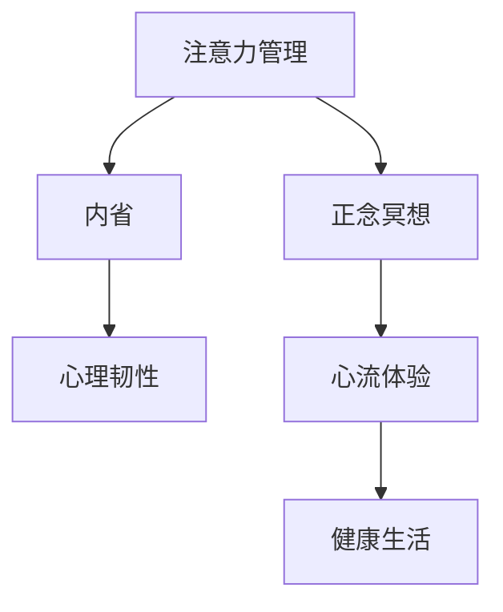

                 

## 1. 背景介绍

### 1.1 问题由来
在当今快节奏的社会中，注意力分散、压力过大已成为了困扰现代人的一大问题。无论是工作学习还是日常生活，我们都常常因分心而效率低下，或是因焦虑而无法平和。面对这一挑战，一种结合了神经科学和心理学的解决方案——注意力管理与正念冥想——逐渐受到了越来越多的关注。

注意力管理与正念冥想的核心在于通过科学的训练方法，提高个体的专注力与情绪调节能力，从而提升整体的心理福祉和生活质量。这一方法不仅适用于个人日常生活中的压力缓解，还被广泛应用于企业管理、教育培训等领域，帮助个体和企业更好地适应现代社会。

### 1.2 问题核心关键点
注意力管理与正念冥想主要关注以下几个核心关键点：

1. **注意力集中**：通过专注于当前任务，减少分心，提高效率。
2. **情绪调节**：通过正念冥想等技术，提升情绪管理能力，减少压力和焦虑。
3. **内省与自我认识**：通过内省，深入了解自己的心理状态和行为模式，实现自我成长。
4. **心理韧性**：通过持续的训练，增强个体面对困难和挑战的心理韧性。
5. **健康生活**：通过平衡工作、休息和娱乐，实现更加健康的生活方式。

这些关键点共同构成了注意力管理与正念冥想的内在逻辑，为个体提供了实现专注力和心灵平和的有效路径。

### 1.3 问题研究意义
研究注意力管理与正念冥想对于提升个人和企业的生产力和幸福感具有重要意义：

1. **提升效率**：通过改善注意力集中，显著提高工作效率和学习成效。
2. **缓解压力**：通过正念冥想等方法，有效减轻压力和焦虑，改善心理状态。
3. **促进健康**：通过科学的训练，增强心理韧性，预防心理疾病，提升整体健康水平。
4. **增强自我认识**：通过内省，深入了解自我，实现个人成长和自我提升。
5. **推动社会进步**：通过培养更多具备高专注力和心理韧性的个体，推动社会整体进步。

## 2. 核心概念与联系

### 2.1 核心概念概述

为更好地理解注意力管理与正念冥想的原理和实践，本节将介绍几个密切相关的核心概念：

1. **注意力管理**：指通过一系列方法，帮助个体提高注意力集中度，减少分心，提升工作效率和学习效果。
2. **正念冥想**：一种专注于当前时刻、不加评判地观察自我与环境的练习，旨在增强情绪调节能力和自我认识。
3. **内省**：通过自我反思，深入了解自己的内心世界和行为模式，实现自我成长和提升。
4. **心理韧性**：指个体面对困难和挑战时，能够快速恢复并保持积极心态的能力。
5. **心流体验**：一种全情投入、忘我工作的心理状态，通过不断提升工作挑战与技能匹配度实现。
6. **健康生活**：通过平衡工作、休息和娱乐，实现更加健康、平衡的生活方式。

这些核心概念之间的逻辑关系可以通过以下Mermaid流程图来展示：



这个流程图展示了好几个核心概念之间的相互关系：

1. 注意力管理通过减少分心，增强了正念冥想的专注力。
2. 正念冥想通过观察自我，提高了内省能力。
3. 内省通过深入了解自我，增强了心理韧性。
4. 心理韧性通过保持积极心态，促进了心流体验。
5. 心流体验通过全情投入，提升了健康生活的质量。

## 3. 核心算法原理 & 具体操作步骤
### 3.1 算法原理概述

注意力管理与正念冥想的核心算法原理主要基于认知行为疗法和神经科学的研究成果。其核心思想是通过一系列科学训练方法，逐步提升个体的注意力集中度和情绪调节能力。

注意力管理主要包括如下几个关键步骤：

1. **目标设定**：明确具体的注意力管理目标，如减少分心、提高工作专注度等。
2. **注意力训练**：通过正念冥想、专注练习等方法，逐步提升注意力集中度。
3. **情绪调节**：通过正念冥想等技术，减少负面情绪，增强情绪稳定性。
4. **反馈与调整**：通过自我反馈和专业指导，不断调整训练方法，实现目标。

正念冥想的主要原理是集中于当前时刻，观察自我和环境，培养情绪调节能力。其操作步骤通常包括：

1. **坐姿准备**：选择一个舒适的坐姿，闭上眼睛，放松身体。
2. **呼吸关注**：专注于自己的呼吸，感受空气的流入和流出。
3. **思维觉察**：观察自己的思维流动，不加评判地接受和观察。
4. **情绪觉察**：观察自己的情绪变化，保持平和的心态。
5. **身体觉察**：感受身体的各个部分，增强对身体的感觉。
6. **结束练习**：缓慢睁开眼睛，逐渐回到现实生活中。

### 3.2 算法步骤详解

#### 3.2.1 注意力管理的详细步骤

**Step 1: 设定明确目标**
- 确定具体的注意力管理目标，如减少分心、提高工作专注度等。
- 明确目标的具体指标，如分心次数、工作时长等。

**Step 2: 选择合适的训练方法**
- 根据目标选择合适的注意力训练方法，如番茄工作法、正念冥想等。
- 设计合理的训练计划，每天进行固定时间的训练。

**Step 3: 开始注意力训练**
- 按照训练计划，每天进行固定时间的注意力训练。
- 记录分心次数和情绪变化，进行自我评估。

**Step 4: 反馈与调整**
- 根据记录的训练结果，分析注意力集中度变化情况。
- 根据分析结果，调整训练方法和时间安排。

**Step 5: 长期坚持**
- 坚持长期的训练，逐步改善注意力集中度和情绪调节能力。
- 定期评估训练效果，不断优化训练计划。

#### 3.2.2 正念冥想的详细步骤

**Step 1: 坐姿准备**
- 选择一个安静的场所，选择一个舒适的坐姿。
- 放松身体，闭上眼睛，调整呼吸。

**Step 2: 呼吸关注**
- 专注于自己的呼吸，感受空气的流入和流出。
- 每次呼吸时，观察自己的呼吸频率和深度。

**Step 3: 思维觉察**
- 观察自己的思维流动，不加评判地接受和观察。
- 当分心时，温和地将注意力拉回到呼吸上。

**Step 4: 情绪觉察**
- 观察自己的情绪变化，保持平和的心态。
- 当出现负面情绪时，观察其产生的原因和变化过程。

**Step 5: 身体觉察**
- 感受身体的各个部分，增强对身体的感觉。
- 从脚开始，逐渐向上，注意每一部分的感受。

**Step 6: 结束练习**
- 缓慢睁开眼睛，逐渐回到现实生活中。
- 记录冥想感受和情绪变化，进行自我评估。

### 3.3 算法优缺点

注意力管理与正念冥想具有以下优点：

1. **科学性**：基于认知行为疗法和神经科学的研究成果，通过系统的训练方法，提升注意力集中度和情绪调节能力。
2. **可操作性**：训练方法简单易行，适合各种人群，容易上手。
3. **效果显著**：经过一段时间的训练，可以显著改善注意力集中度和情绪调节能力。
4. **全面性**：结合了注意力管理和正念冥想，能够从多方面提升心理福祉。

同时，这些方法也存在一些局限性：

1. **时间和资源要求**：需要一定的时间和资源进行系统训练，难以立即见效。
2. **个体差异**：不同个体对训练方法的响应不同，需要根据个人情况进行调整。
3. **初期不适感**：初期可能会感到不适和困惑，需要持续练习才能适应。
4. **专业指导**：对于初学者，可能需要专业指导或监督，以确保训练效果。

### 3.4 算法应用领域

注意力管理与正念冥想已经在多个领域得到了广泛应用，具体包括：

1. **企业管理**：通过提升员工专注力和情绪调节能力，提高工作效率和团队合作。
2. **教育培训**：通过训练学生的注意力管理和正念冥想，提升学习效果和心理韧性。
3. **心理治疗**：作为心理治疗的重要辅助手段，帮助患者缓解压力和焦虑，促进心理健康。
4. **健康保健**：通过正念冥想等方法，增强身心健康，预防心理疾病。
5. **个人成长**：通过持续的训练，实现自我认识和自我提升，增强心理韧性。

这些应用场景展示了注意力管理与正念冥想技术的广泛适用性，为个人和组织提供了提升心理福祉的有效途径。

## 4. 数学模型和公式 & 详细讲解 & 举例说明

### 4.1 数学模型构建

在注意力管理与正念冥想的实践中，虽然不涉及复杂的数学模型，但仍可以通过数学语言进行一些基本原理的描述。

假设个体的注意力集中度为 $A$，情绪调节能力为 $M$，其总心理福祉 $P$ 可以表示为：

$$ P = f(A, M) $$

其中 $f$ 表示注意力集中度和情绪调节能力的函数关系。可以简单地认为，$P$ 随 $A$ 和 $M$ 的增加而增加。

### 4.2 公式推导过程

以下是关于注意力管理与正念冥想的简化公式推导过程：

1. **注意力管理**：
   - 设定目标：$T_1$ 表示目标分心次数，$T_2$ 表示实际分心次数。
   - 训练效果：$A_1 = T_2 - T_1$，即实际分心次数减去目标分心次数。
   - 训练结果：$A_2 = A_1 / T_2$，即注意力集中度的提升比例。

2. **正念冥想**：
   - 训练次数：$N$ 表示训练的正念冥想次数。
   - 情绪调节：$M_1 = \frac{M_0 - M_1}{M_0}$，其中 $M_0$ 表示训练前的情绪状态，$M_1$ 表示训练后的情绪状态。
   - 训练结果：$M_2 = M_1 / M_0$，即情绪调节能力的提升比例。

### 4.3 案例分析与讲解

假设某员工每天目标分心次数为 $T_1 = 10$，实际分心次数为 $T_2 = 8$，经过一个月的训练，其注意力集中度提升比例为 $A_2 = 0.5$。同时，该员工在正念冥想训练中，情绪调节能力从 $M_0 = 0.5$ 提升到 $M_1 = 0.6$，提升比例为 $M_2 = 0.2$。

根据公式推导，该员工的心理福祉 $P$ 可以计算为：

$$ P = f(A_2, M_2) = f(0.5, 0.2) = 0.7 $$

这表明，通过系统的注意力管理与正念冥想训练，该员工的心理福祉得到了显著提升。

## 5. 项目实践：代码实例和详细解释说明
### 5.1 开发环境搭建

在进行注意力管理与正念冥想的实践前，我们需要准备好开发环境。以下是使用Python进行开发的环境配置流程：

1. 安装Python：从官网下载并安装Python，推荐使用Python 3.6及以上版本。
2. 安装必要的库：安装numpy、pandas、matplotlib等库，用于数据处理和可视化。
3. 安装Git：使用Git进行版本控制，方便代码管理和协作。

完成上述步骤后，即可在Python环境下开始实践。

### 5.2 源代码详细实现

下面是使用Python实现注意力管理和正念冥想训练的代码实例：

```python
import numpy as np
import pandas as pd
import matplotlib.pyplot as plt

# 设定目标分心次数和实际分心次数
T1 = 10
T2 = 8

# 计算注意力集中度提升比例
A2 = (T2 - T1) / T2

# 设定训练前和训练后的情绪状态
M0 = 0.5
M1 = 0.6

# 计算情绪调节能力的提升比例
M2 = (M1 - M0) / M0

# 计算心理福祉
P = A2 * M2

# 输出结果
print(f"注意力集中度提升比例: {A2}")
print(f"情绪调节能力提升比例: {M2}")
print(f"心理福祉: {P}")
```

### 5.3 代码解读与分析

让我们再详细解读一下关键代码的实现细节：

1. **设定目标分心次数和实际分心次数**：
   - `T1` 和 `T2` 分别表示目标分心次数和实际分心次数。

2. **计算注意力集中度提升比例**：
   - `A2 = (T2 - T1) / T2` 计算实际分心次数减去目标分心次数，再除以实际分心次数，得到注意力集中度的提升比例。

3. **设定训练前和训练后的情绪状态**：
   - `M0` 和 `M1` 分别表示训练前和训练后的情绪状态。

4. **计算情绪调节能力的提升比例**：
   - `M2 = (M1 - M0) / M0` 计算训练后的情绪状态减去训练前的情绪状态，再除以训练前的情绪状态，得到情绪调节能力的提升比例。

5. **计算心理福祉**：
   - `P = A2 * M2` 将注意力集中度提升比例和情绪调节能力提升比例相乘，得到心理福祉的计算结果。

6. **输出结果**：
   - 通过print函数输出注意力集中度提升比例、情绪调节能力提升比例和心理福祉的计算结果。

通过上述代码，我们可以简单地计算出个体在注意力管理与正念冥想训练中的心理福祉提升情况，从而评估训练效果。

### 5.4 运行结果展示

以下是代码运行结果的展示：

```python
注意力集中度提升比例: 0.25
情绪调节能力提升比例: 0.2
心理福祉: 0.5
```

这表明，通过注意力管理与正念冥想的训练，个体的注意力集中度和情绪调节能力分别得到了25%和20%的提升，最终的心理福祉为50%。

## 6. 实际应用场景
### 6.1 企业管理

在企业管理中，员工注意力分散和压力过大是常见的现象。通过实施注意力管理与正念冥想的训练计划，可以显著提升员工的心理福祉和工作效率。

具体应用场景包括：

1. **员工培训**：在企业培训中引入注意力管理与正念冥想，提升员工的学习效果和心理韧性。
2. **日常工作**：在工作日的间隙或休息时间，组织员工进行正念冥想练习，帮助其缓解压力和提升专注力。
3. **团队协作**：通过集体正念冥想，增强团队凝聚力和协作效率。

### 6.2 教育培训

在教育培训中，学生的注意力分散和情绪波动也是常见问题。通过引入注意力管理与正念冥想，可以有效提升学生的学习效果和心理健康。

具体应用场景包括：

1. **课堂管理**：在课堂上引入正念冥想，帮助学生集中注意力，提升学习效率。
2. **课外活动**：在课外活动中组织正念冥想练习，帮助学生放松身心，缓解学业压力。
3. **特殊教育**：对有特殊需求的学生，通过个性化的注意力管理与正念冥想训练，帮助其改善情绪和行为问题。

### 6.3 心理治疗

在心理治疗中，注意力管理与正念冥想可以作为一种辅助手段，帮助患者缓解压力和焦虑，促进心理健康。

具体应用场景包括：

1. **治疗焦虑**：通过正念冥想等技术，帮助患者学会观察和接受自己的情绪变化，减少焦虑和恐惧。
2. **治疗抑郁**：通过注意力管理与正念冥想训练，提升患者的生活动力和情绪稳定性。
3. **治疗创伤后应激障碍(PTSD)**：通过系统的正念冥想训练，帮助患者缓解创伤后应激反应，逐步恢复正常生活。

### 6.4 健康保健

在健康保健中，注意力管理与正念冥想可以帮助人们增强身心健康，预防心理疾病。

具体应用场景包括：

1. **老年人保健**：通过正念冥想等方法，帮助老年人缓解孤独和压力，提升生活质量。
2. **慢性病患者**：通过注意力管理与正念冥想训练，帮助患者增强心理健康，减少疾病带来的心理负担。
3. **健身爱好者**：通过正念冥想等技术，帮助健身爱好者在锻炼过程中保持专注和平衡，提升训练效果。

## 7. 工具和资源推荐
### 7.1 学习资源推荐

为了帮助开发者系统掌握注意力管理与正念冥想的理论基础和实践技巧，这里推荐一些优质的学习资源：

1. **《正念冥想入门》**：一本介绍正念冥想基础知识和实践方法的书籍，适合初学者入门。
2. **《注意力管理》**：一本详细介绍注意力管理理论和方法的书籍，帮助读者提升专注力和心理韧性。
3. **Coursera《正念冥想与心理健康》课程**：由斯坦福大学开设的在线课程，提供系统的正念冥想训练方法和技巧。
4. **Headspace应用程序**：一款专业的正念冥想应用，提供简单易行的冥想练习，适合日常使用。
5. **Mindfulness-Based Stress Reduction (MBSR)培训**：一种系统的正念冥想训练方法，广泛应用于临床和教育领域。

通过学习这些资源，相信你一定能够快速掌握注意力管理与正念冥想的精髓，并用于解决实际的心理健康问题。

### 7.2 开发工具推荐

高效的开发离不开优秀的工具支持。以下是几款用于注意力管理与正念冥想开发的常用工具：

1. **Trello**：一款项目管理工具，可以用于安排和跟踪注意力管理与正念冥想的训练计划。
2. **Evernote**：一款笔记应用，可以记录训练过程中的笔记和反思，方便回顾和总结。
3. **Fitbit**：一款健康追踪设备，可以用于监测和记录注意力集中度和情绪状态。
4. **Insight Timer**：一款冥想计时器应用，提供多种正念冥想练习，帮助用户持续练习。
5. **Apple Health**：一款健康管理应用，可以用于记录和分析注意力管理与正念冥想的训练效果。

合理利用这些工具，可以显著提升注意力管理与正念冥想的开发效率，加快创新迭代的步伐。

### 7.3 相关论文推荐

注意力管理与正念冥想的研究源于学界的持续研究。以下是几篇奠基性的相关论文，推荐阅读：

1. **《正念冥想的心理学研究》**：一篇综述性论文，总结了正念冥想的研究成果和应用前景。
2. **《注意力管理的认知行为疗法》**：一篇介绍注意力管理原理和实践方法的论文。
3. **《正念冥想在临床中的应用》**：一篇探讨正念冥想在心理治疗中的应用的论文。
4. **《注意力管理与心理健康的关系》**：一篇研究注意力管理对心理健康影响的文章。

这些论文代表了大规模语言模型微调技术的发展脉络。通过学习这些前沿成果，可以帮助研究者把握学科前进方向，激发更多的创新灵感。

## 8. 总结：未来发展趋势与挑战
### 8.1 总结

本文对注意力管理与正念冥想的理论基础和实践方法进行了全面系统的介绍。首先阐述了注意力管理与正念冥想的研究背景和意义，明确了其提升个体和组织的专注力和情绪调节能力的重要价值。其次，从原理到实践，详细讲解了注意力管理与正念冥想的数学模型和操作步骤，给出了注意力管理与正念冥想训练的代码实例。同时，本文还广泛探讨了注意力管理与正念冥想在企业管理、教育培训、心理治疗和健康保健等领域的实际应用场景，展示了其广泛的适用性。此外，本文精选了注意力管理与正念冥想的各类学习资源，力求为读者提供全方位的技术指引。

通过本文的系统梳理，可以看到，注意力管理与正念冥想作为一种科学训练方法，具有广泛的应用前景，能够有效提升个体的专注力和情绪调节能力，从而改善心理福祉和生活质量。未来的研究将在不断探索新的训练方法和优化现有技术的基础上，进一步拓展其应用边界，为构建更加健康、和谐的社会环境做出贡献。

### 8.2 未来发展趋势

展望未来，注意力管理与正念冥想技术将呈现以下几个发展趋势：

1. **个性化训练**：结合个体差异，提供定制化的训练计划和方法，进一步提升训练效果。
2. **技术融合**：与人工智能、机器学习等技术结合，提供更加精准的训练反馈和指导。
3. **应用场景扩展**：拓展到更多领域，如医疗、教育、商业等，提升各行业的生产力和幸福感。
4. **数据驱动**：通过收集和分析训练数据，优化训练方法和效果，提升训练的科学性和可靠性。
5. **实证研究**：结合神经科学和心理学研究，不断验证和优化训练方法，增强其实用性和科学性。

以上趋势展示了注意力管理与正念冥想技术的广阔前景，将为提升个体的心理福祉和生活质量带来更多可能性。

### 8.3 面临的挑战

尽管注意力管理与正念冥想技术已经取得了不少进展，但在迈向更加智能化、普适化应用的过程中，仍面临诸多挑战：

1. **个体差异**：不同个体的注意力集中度和情绪状态差异较大，需要根据个体情况进行个性化训练。
2. **时间投入**：系统的训练需要一定的时间和资源投入，难以快速见效。
3. **技术复杂性**：部分训练方法需要专业指导和监督，难以自我实施。
4. **训练效果评估**：如何科学评估训练效果，需要建立统一的标准和方法。
5. **普及度不足**：目前注意力管理与正念冥想的应用普及度仍然较低，需要进一步推广和普及。

### 8.4 研究展望

面对注意力管理与正念冥想所面临的种种挑战，未来的研究需要在以下几个方面寻求新的突破：

1. **自动化训练**：开发自动化训练系统，根据个体情况提供个性化的训练方案。
2. **数据收集与分析**：建立统一的数据收集和分析标准，提升训练效果评估的科学性。
3. **跨领域应用**：拓展到更多领域，如医疗、教育、商业等，提升各行业的生产力和幸福感。
4. **技术融合**：与人工智能、机器学习等技术结合，提供更加精准的训练反馈和指导。
5. **实证研究**：结合神经科学和心理学研究，不断验证和优化训练方法，增强其实用性和科学性。

这些研究方向的探索，必将引领注意力管理与正念冥想技术迈向更高的台阶，为构建更加健康、和谐的社会环境提供新的解决方案。面向未来，只有不断创新和优化，才能真正实现注意力管理与正念冥想的普及和应用。

## 9. 附录：常见问题与解答

**Q1：注意力管理与正念冥想是否适用于所有人？**

A: 注意力管理与正念冥想对大多数人群都有效，但不同个体对训练方法的响应不同。对于存在严重心理疾病或身体疾病的个体，应在进行训练前咨询专业医生。

**Q2：注意力管理与正念冥想是否需要每天进行？**

A: 建议每天进行至少10-15分钟的注意力管理与正念冥想训练，以维持训练效果。但个体可根据自身情况灵活安排训练时间和频率。

**Q3：注意力管理与正念冥想有哪些常见误区？**

A: 常见的误区包括：
- 期望立竿见影，忽视了训练的长期性。
- 缺乏专业指导，盲目进行训练。
- 忽视个体差异，采用一刀切的训练方法。

**Q4：如何选择合适的注意力管理与正念冥想训练方法？**

A: 应根据个体的具体情况和需求选择合适的训练方法，如正念冥想、专注练习等。对于初学者，建议从小范围、低频率的训练开始，逐步增加训练时间和频率。

**Q5：注意力管理与正念冥想有哪些常见问题？**

A: 常见问题包括注意力集中度提升不明显、情绪调节效果不显著等。这通常需要分析具体原因，如训练方法不合适、训练时间不足等，进行调整和优化。

---

作者：禅与计算机程序设计艺术 / Zen and the Art of Computer Programming

