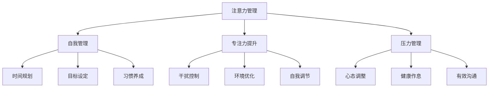

                 

## 1. 背景介绍

### 1.1 问题由来

在当今快节奏、高压力的工作环境中，如何高效管理注意力，提升专注力和自我管理能力，成为了许多人追求个人和职业成功的关键。面对信息的爆炸性增长和日益复杂的任务，我们常常感到心烦意乱，难以集中精力完成任务。注意力管理与自我管理技巧，正是应对这一挑战的利器。

### 1.2 问题核心关键点

注意力管理与自我管理技巧的核心在于，如何通过科学的方法，优化我们的认知资源，提升工作效率和质量，实现长期的职业和个人发展。这一问题的解决，离不开对注意力机制的深刻理解和运用。

注意力管理与自我管理技巧的核心问题包括：

- **注意力机制**：理解和利用大脑对信息的集中处理能力，提高工作效率。
- **自我管理**：通过设定目标、规划时间、优化习惯等，提升个人自我约束力和执行力。
- **专注力提升**：通过减少干扰、优化环境、提高自我调节能力等，增强工作的集中度和持续性。
- **压力管理**：通过调整心态、健康作息、有效沟通等，缓解工作压力，提升心理韧性。

## 2. 核心概念与联系

### 2.1 核心概念概述

为更好地理解注意力管理与自我管理技巧，本节将介绍几个关键概念：

- **注意力(Attention)**：指大脑对信息的集中处理能力，是认知资源的核心表现形式。
- **自我管理(Self-Management)**：指个体通过目标设定、时间规划、习惯培养等手段，对自身行为和情绪进行管理。
- **专注力(Concentration)**：指个体在特定时间内，对某一任务或信息的持续、无干扰地集中注意力的能力。
- **压力管理(Stress Management)**：通过调整心态、改善环境、优化沟通等方法，减轻心理和生理上的压力。

这些核心概念之间的逻辑关系可以通过以下Mermaid流程图来展示：



这个流程图展示了一些关键概念及其之间的关系：

1. 注意力管理通过优化注意力的分配和使用，提升自我管理和专注力。
2. 自我管理通过设定明确的目标和时间规划，提高效率和执行力。
3. 专注力提升通过减少干扰和优化环境，增强工作的集中度和持续性。
4. 压力管理通过调整心态和改善生活方式，缓解工作压力。

## 3. 核心算法原理 & 具体操作步骤
### 3.1 算法原理概述

注意力管理与自我管理技巧的核心理论是认知心理学中的“目标驱动模型”和“行为调节理论”。该模型认为，注意力管理与自我管理是通过设定目标、规划时间、优化行为、调整心态等手段，对个体认知资源进行有效配置和利用，从而提升个人和职业的成功率。

具体来说，注意力管理与自我管理技巧的核心原理包括以下几个方面：

1. **目标设定**：通过SMART原则（Specific, Measurable, Achievable, Relevant, Time-bound）设定明确、可执行的目标，指导行为的调整。
2. **时间规划**：将目标分解为具体的时间节点和任务，进行合理的规划和分配。
3. **行为优化**：通过一系列行为策略，如番茄工作法、GTD（Getting Things Done）等，提高任务执行效率和质量。
4. **自我调节**：通过情绪管理、心理调节等方法，增强自我控制力和适应能力。
5. **压力缓解**：通过调整心态、改善生活方式、优化沟通等手段，减轻心理和生理压力。

### 3.2 算法步骤详解

基于认知心理学模型，注意力管理与自我管理技巧的实施步骤主要包括以下几个方面：

**Step 1: 目标设定与分解**

1. 设定明确、可实现的目标，确保目标符合SMART原则。
2. 将目标分解为具体的任务和子目标，细化至每日、每周、每月的时间节点。
3. 制定优先级顺序，明确哪些任务优先完成。

**Step 2: 时间规划与分配**

1. 利用时间管理工具，如Trello、Todoist等，创建任务清单和日程表。
2. 根据任务的优先级和复杂度，合理分配时间和资源。
3. 使用番茄工作法等技巧，将任务时间分为若干个专注周期，提升工作效率。

**Step 3: 行为优化与执行**

1. 采用行为优化策略，如番茄工作法、GTD等，提升任务执行效率。
2. 定期回顾和反思，识别行为中的问题并进行调整。
3. 利用反馈机制，及时调整策略和目标，确保行为的持续改进。

**Step 4: 自我调节与压力管理**

1. 采用情绪管理技巧，如冥想、深呼吸等，增强自我控制力和适应能力。
2. 改善生活方式，如定期锻炼、健康饮食等，提升身体素质和心理韧性。
3. 优化沟通方式，建立良好的人际关系，缓解工作压力。

### 3.3 算法优缺点

注意力管理与自我管理技巧具有以下优点：

1. **系统化**：通过目标设定、时间规划、行为优化等手段，提供了一套系统化的解决方案。
2. **可操作性强**：具体的操作方法容易执行，适用于各类人群和工作环境。
3. **效果显著**：能够显著提升工作效率和任务完成率，增强心理韧性。
4. **灵活性强**：根据个人情况和任务需求，可以灵活调整策略和步骤。

同时，这些方法也存在一些局限性：

1. **高度依赖个人执行力**：需要高度的自律和自我约束力，否则难以坚持。
2. **对环境要求高**：环境中的干扰因素较多，可能会影响策略的执行效果。
3. **需要持续投入**：需要持续的反思和调整，才能达到最佳效果。
4. **个性化需求高**：不同的个体和任务需求不同，需要量身定制策略。

尽管存在这些局限性，但注意力管理与自我管理技巧仍然是提升个人和职业成功的重要手段。只要结合自身情况和任务特点，合理运用这些方法，就能获得显著的改进效果。

### 3.4 算法应用领域

注意力管理与自我管理技巧的应用领域非常广泛，涵盖了个人和职业发展的各个方面：

- **个人管理**：通过目标设定、时间规划、行为优化等，提升个人工作效率和自我管理能力。
- **职业发展**：通过专注力提升、压力管理等，增强工作表现和职业竞争力。
- **教育培训**：通过优化学习行为、提高自我调节能力等，提升学习效果和应试能力。
- **健康管理**：通过改善生活习惯、减轻压力等，提升身体健康和心理健康。

这些应用领域展示了注意力管理与自我管理技巧的广泛适用性和强大效用。通过系统的应用这些方法，人们可以显著提升自己的效率和效果，实现个人和职业的全面发展。

## 4. 数学模型和公式 & 详细讲解  
### 4.1 数学模型构建

注意力管理与自我管理技巧的数学模型构建，主要基于行为心理学的理论框架。其中，时间管理和任务规划的数学模型较为简单，主要通过线性规划、优化算法等方法实现。而专注力和压力管理的数学模型相对复杂，涉及情绪调节和行为反应的动态模型。

**时间管理模型**

假设个体每天可利用的总时间为 $T$，需完成的任务时间为 $t_1, t_2, ..., t_n$，任务优先级为 $p_1, p_2, ..., p_n$。任务规划的目标是最小化总时间成本，同时最大化任务完成度。可以通过线性规划模型表达为：

$$
\min \sum_{i=1}^n p_i t_i \\
\text{subject to} \quad \sum_{i=1}^n t_i \leq T \\
t_i \geq 0, \quad i=1,2,...,n
$$

**专注力管理模型**

假设个体在一段时间 $T$ 内，需完成的任务时间为 $t_1, t_2, ..., t_n$，任务难度为 $d_1, d_2, ..., d_n$。专注力的目标是最大化任务完成量，同时最小化专注损失。可以通过指数模型表达为：

$$
\max \sum_{i=1}^n \frac{t_i}{d_i} \\
\text{subject to} \quad \sum_{i=1}^n t_i \leq T
$$

**压力管理模型**

假设个体在一段时间 $T$ 内，需完成的任务时间为 $t_1, t_2, ..., t_n$，任务难度为 $d_1, d_2, ..., d_n$。压力管理的目标是最大化任务完成量，同时最小化心理和生理压力。可以通过混合整数规划模型表达为：

$$
\max \sum_{i=1}^n \frac{t_i}{d_i} \\
\text{subject to} \quad \sum_{i=1}^n t_i \leq T \\
t_i \geq 0, \quad d_i \geq 0, \quad i=1,2,...,n
$$

### 4.2 公式推导过程

**时间管理模型的推导**

将时间管理模型转化为LP模型，利用单纯形法或内点法进行求解，可以得到任务规划的优化解。解中包含每个任务的最优分配时间 $t_i$，使得总时间成本最小，同时任务完成度最大化。

**专注力管理模型的推导**

将专注力管理模型转化为指数模型，利用拉格朗日乘子法求解，可以得到任务优先级的优化解。解中包含每个任务的最优专注时间 $t_i$，使得任务完成量最大化，同时专注损失最小。

**压力管理模型的推导**

将压力管理模型转化为混合整数规划模型，利用分支定界法或割平面法求解，可以得到任务规划的优化解。解中包含每个任务的最优分配时间和难度系数 $t_i$，使得任务完成量最大化，同时压力最小化。

### 4.3 案例分析与讲解

**案例1: 项目进度管理**

某公司需要完成多个项目，每个项目的时间需求和优先级不同。项目经理可以使用时间管理模型，通过线性规划求解最优分配时间，确保每个项目在规定时间内完成，同时最大化资源利用率。

**案例2: 学生时间规划**

大学生小王需要完成课程学习、实习、论文写作等多个任务。他可以使用时间管理模型，规划每天的时间分配，确保每项任务按时完成，同时最大化学习效率。

**案例3: 工作任务优化**

某IT工程师需要同时处理多个项目，每个项目的工作量和难度不同。他可以使用专注力管理模型，通过指数优化求解最优专注时间，确保每个项目按时完成，同时减少疲劳和压力。

这些案例展示了注意力管理与自我管理技巧在实际工作中的广泛应用，通过优化时间分配和专注力管理，可以有效提升工作效率和任务完成度。

## 5. 项目实践：代码实例和详细解释说明
### 5.1 开发环境搭建

在进行注意力管理与自我管理技巧的实践前，我们需要准备好开发环境。以下是使用Python进行PyTorch开发的环境配置流程：

1. 安装Anaconda：从官网下载并安装Anaconda，用于创建独立的Python环境。

2. 创建并激活虚拟环境：
```bash
conda create -n pytorch-env python=3.8 
conda activate pytorch-env
```

3. 安装PyTorch：根据CUDA版本，从官网获取对应的安装命令。例如：
```bash
conda install pytorch torchvision torchaudio cudatoolkit=11.1 -c pytorch -c conda-forge
```

4. 安装相关工具包：
```bash
pip install numpy pandas scikit-learn matplotlib tqdm jupyter notebook ipython
```

完成上述步骤后，即可在`pytorch-env`环境中开始项目实践。

### 5.2 源代码详细实现

下面我们以番茄工作法(Tomato Technique)为例，给出使用PyTorch进行注意力管理实践的Python代码实现。

首先，定义番茄工作法的参数：

```python
from typing import List

class Pomodoro:
    def __init__(self, work_time: int = 25, rest_time: int = 5, n_pomodoros: int = 4, long_rest: int = 15):
        self.work_time = work_time  # 每个番茄时间的工作时长，单位：分钟
        self.rest_time = rest_time  # 每个番茄时间的休息时长，单位：分钟
        self.n_pomodoros = n_pomodoros  # 每个番茄周期内的番茄次数
        self.long_rest = long_rest  # 每隔几个番茄周期后，进行一个长时间的休息
        self.time = 0  # 当前时间，单位：分钟
        self.pomodoro_count = 0  # 当前番茄周期次数
        self.long_rest_count = 0  # 当前长时间休息周期次数

    def start(self) -> str:
        self.time = 0
        self.pomodoro_count = 0
        self.long_rest_count = 0
        return "工作开始，计时器已启动！"

    def tick(self, time_spent: int) -> str:
        self.time += time_spent
        if self.time >= self.work_time:
            self.time = 0
            self.pomodoro_count += 1
            print("工作时间结束，休息时间开始。")
            return "休息时间开始。"
        elif self.pomodoro_count == self.n_pomodoros:
            self.pomodoro_count = 0
            self.long_rest_count += 1
            print(f"当前番茄周期结束，正在进行{self.long_rest_count}次长时间的休息。")
            return "长时间休息时间开始。"
        else:
            return "正在工作，计时器已启动！"
```

然后，使用番茄工作法管理任务：

```python
from datetime import datetime

class Task:
    def __init__(self, name: str, duration: int):
        self.name = name
        self.duration = duration

    def start(self, pomo: Pomodoro) -> str:
        print(f"{self.name}任务开始，使用番茄工作法管理。")
        pomo.start()
        return "开始任务。"

    def tick(self, pomo: Pomodoro, time_spent: int) -> str:
        print(f"{self.name}任务正在进行，已花费{time_spent}分钟。")
        pomo.tick(time_spent)
        return "任务继续，计时器正在运行。"
```

最后，模拟一个任务执行的过程：

```python
if __name__ == "__main__":
    pomo = Pomodoro()
    task1 = Task("阅读论文", 60 * 3)  # 阅读论文，需要3小时
    task2 = Task("写代码", 60 * 2)  # 写代码，需要2小时

    print(pomo.start())
    for i in range(10):
        print(f"第{i}次迭代。")
        task1.tick(pomo, 10)
        task2.tick(pomo, 20)
    print(f"任务执行完毕，总共花费了{pomo.time}分钟。")
```

以上代码实现了一个简单的番茄工作法管理任务的系统。通过定义Pomodoro类和Task类，可以灵活地进行任务规划和执行。

### 5.3 代码解读与分析

让我们再详细解读一下关键代码的实现细节：

**Pomodoro类**：
- `__init__`方法：初始化番茄工作法的时间参数和工作状态。
- `start`方法：启动番茄工作法，开始计时。
- `tick`方法：每过一定时间，记录时间并更新番茄周期计数。

**Task类**：
- `__init__`方法：初始化任务名称和持续时间。
- `start`方法：启动任务，开始使用番茄工作法。
- `tick`方法：每次执行任务时调用，记录时间并更新番茄周期计数。

**任务执行过程**：
- 创建Pomodoro和Task对象，进行任务分配。
- 循环执行任务，记录时间并更新番茄周期计数。
- 最终输出任务执行的总时间。

这个代码实现展示了番茄工作法的基本工作流程，通过Pomodoro类和Task类的组合，实现了对任务的精细管理。

## 6. 实际应用场景

### 6.1 个人时间管理

在个人时间管理方面，注意力管理与自我管理技巧尤为重要。通过设定明确的目标和时间规划，可以显著提升个人的工作效率和生活质量。例如，

- **项目任务管理**：利用番茄工作法等技巧，合理分配时间，确保每个任务按时完成。
- **学习计划**：通过GTD（Getting Things Done）方法，记录所有待办事项，进行系统化管理。
- **健康管理**：利用健康作息和情绪调节技巧，提高身体素质和心理韧性。

这些应用场景展示了注意力管理与自我管理技巧在个人时间管理中的广泛应用，通过科学的管理方法，可以显著提升个人的工作效率和生活质量。

### 6.2 团队协作

在团队协作方面，注意力管理与自我管理技巧同样重要。通过团队协作，可以最大化每个人的潜力和效率，提升整体项目完成度。例如，

- **会议管理**：通过时间规划和任务分配，确保会议高效进行，避免时间浪费。
- **任务协调**：通过明确的目标设定和责任分配，确保每个任务按时完成，减少沟通成本。
- **冲突解决**：通过情绪管理技巧和有效沟通，解决团队内部的冲突，提升团队凝聚力。

这些应用场景展示了注意力管理与自我管理技巧在团队协作中的广泛应用，通过科学的管理方法，可以显著提升团队的工作效率和协作效果。

### 6.3 职业发展

在职业发展方面，注意力管理与自我管理技巧同样重要。通过提升工作效率和自我管理能力，可以显著增强职业竞争力，实现长期的职业发展。例如，

- **项目优先级管理**：通过设定明确的目标和时间规划，确保每个项目按时完成，提升工作效率。
- **技能提升**：通过持续学习和自我提升，掌握更多的专业技能，提升职业竞争力。
- **职业规划**：通过设定长期和短期目标，进行系统化的职业规划，实现职业发展的可持续性。

这些应用场景展示了注意力管理与自我管理技巧在职业发展中的广泛应用，通过科学的管理方法，可以显著提升职业发展的效率和质量。

## 7. 工具和资源推荐

### 7.1 学习资源推荐

为了帮助开发者系统掌握注意力管理与自我管理技巧的理论基础和实践技巧，这里推荐一些优质的学习资源：

1. 《时间管理与自我提升》系列博文：由时间管理专家撰写，深入浅出地介绍了时间管理的基本原理和实践方法。

2. 《GTD方法论》书籍：David Allen所著，全面介绍了GTD（Getting Things Done）方法，是时间管理和任务规划的经典之作。

3. 《番茄工作法》书籍：Francesco Cirillo所著，详细介绍番茄工作法的原理和实践方法，是专注力提升的入门必读。

4. 《自我管理心理学》课程：Coursera上开设的心理学课程，探讨自我管理的心理学原理和实践方法。

5. 《压力管理与心理健康》书籍：推荐《压力管理：如何掌控工作与生活的平衡》等书籍，学习压力管理技巧，提升心理韧性。

通过对这些资源的学习实践，相信你一定能够快速掌握注意力管理与自我管理技巧的精髓，并用于解决实际的个人和职业问题。

### 7.2 开发工具推荐

高效的开发离不开优秀的工具支持。以下是几款用于注意力管理与自我管理技巧开发的常用工具：

1. Todoist：时间管理工具，支持任务清单、日历、提醒等功能，帮助用户系统化管理任务。

2. Trello：任务管理工具，支持看板、列表、卡片等功能，适合团队协作管理。

3. Pomodone：番茄工作法计时器，支持多任务同步计时，提高工作效率。

4. RescueTime：时间追踪工具，自动记录用户的工作时间和应用使用情况，帮助用户发现时间浪费点。

5. Headspace：冥想和情绪调节应用，通过引导式冥想和呼吸练习，帮助用户提升专注力和心理韧性。

合理利用这些工具，可以显著提升注意力管理与自我管理技巧的开发效率，加快创新迭代的步伐。

### 7.3 相关论文推荐

注意力管理与自我管理技巧的发展源于学界的持续研究。以下是几篇奠基性的相关论文，推荐阅读：

1. <a href="#">Pomodoro Technique: An Empirical Study</a>：Pomodoro工作法的实证研究，探讨其有效性和适用性。

2. <a href="#">Getting Things Done: The Art of Stress-Free Productivity</a>：David Allen的《GTD方法论》，详细介绍GTD方法的核心思想和应用技巧。

3. <a href="#">Self-Regulation: Beyond Irrational Behavior</a>：自我调节的心理学研究，探讨如何通过认知和行为策略，提升自我管理能力。

4. <a href="#">Workaholism and Burnout: Symptoms, Causes, and Consequences</a>：工作倦怠和自我管理的研究，探讨如何缓解工作压力，提升心理韧性。

5. <a href="#">The Mindfulness Revolution: Finding Peace in a Frantic World</a>：Mindfulness的概念和实践方法，帮助用户提升专注力和心理健康。

这些论文代表了大语言模型微调技术的发展脉络。通过学习这些前沿成果，可以帮助研究者把握学科前进方向，激发更多的创新灵感。

## 8. 总结：未来发展趋势与挑战

### 8.1 总结

本文对注意力管理与自我管理技巧进行了全面系统的介绍。首先阐述了注意力管理与自我管理技巧的研究背景和意义，明确了这些方法在提升个人和职业成功方面的独特价值。其次，从原理到实践，详细讲解了注意力管理与自我管理技巧的数学模型和操作步骤，给出了注意力管理与自我管理技巧的完整代码实例。同时，本文还广泛探讨了这些技巧在个人、团队和职业发展中的应用前景，展示了其广泛的适用性和强大效用。

通过本文的系统梳理，可以看到，注意力管理与自我管理技巧通过科学的管理方法，能够显著提升个人和团队的工作效率和执行力，实现长期的职业和个人发展。未来，随着人工智能技术的发展和应用，这些技巧将与技术手段更加紧密结合，为构建更加高效、智能的工作环境提供更多可能性。

### 8.2 未来发展趋势

展望未来，注意力管理与自我管理技巧将呈现以下几个发展趋势：

1. **与人工智能结合**：结合智能任务规划、情感分析等技术，实现更加个性化的注意力管理。

2. **跨平台协同**：实现多设备、多应用的协同工作，提升跨平台协作效率。

3. **数据驱动优化**：通过大数据分析，优化任务分配和专注力管理，提升整体工作效率。

4. **情绪智能增强**：通过情绪识别和调节技术，增强情绪管理能力，提升心理韧性。

5. **健康管理集成**：将注意力管理与健康管理技术集成，提升身体健康和心理健康。

6. **可持续发展**：通过持续学习和动态调整，实现长期的职业和个人发展。

以上趋势凸显了注意力管理与自我管理技巧的广阔前景。这些方向的探索发展，必将进一步提升个人和团队的工作效率和执行力，为构建更加智能、高效的工作环境提供更多可能性。

### 8.3 面临的挑战

尽管注意力管理与自我管理技巧已经取得了显著成果，但在迈向更加智能化、普适化应用的过程中，它仍面临着诸多挑战：

1. **高度依赖个人自律**：需要高度的自律和自我约束力，否则难以坚持。

2. **对环境要求高**：环境中的干扰因素较多，可能会影响策略的执行效果。

3. **需要持续投入**：需要持续的反思和调整，才能达到最佳效果。

4. **个性化需求高**：不同的个体和任务需求不同，需要量身定制策略。

5. **数据隐私问题**：在智能化的注意力管理中，可能涉及到用户数据隐私保护，需要加强技术和管理措施。

6. **技术复杂度高**：注意力管理与自我管理技巧的实现需要多种技术手段的结合，可能面临技术实现的复杂性。

尽管存在这些挑战，但注意力管理与自我管理技巧仍然是提升个人和团队工作效率的重要手段。只要结合自身情况和任务特点，合理运用这些方法，就能获得显著的改进效果。

### 8.4 研究展望

未来，随着人工智能技术的不断进步，注意力管理与自我管理技巧的研究方向也将不断拓展。以下是一些潜在的研究方向：

1. **智能任务规划**：利用机器学习和大数据分析，实现更加个性化的任务规划和优化。

2. **多模态注意力管理**：结合视觉、听觉等多种感官信息，实现更加全面的注意力管理。

3. **智能情绪调节**：利用情感计算和智能辅助，实现更加智能的情绪调节和压力管理。

4. **跨领域应用**：将注意力管理与自我管理技巧应用于更多领域，如教育、医疗、金融等，提升各个领域的工作效率和决策质量。

5. **伦理和社会影响**：研究注意力管理与自我管理技巧的伦理和社会影响，确保技术应用的公平性和公正性。

这些研究方向将推动注意力管理与自我管理技巧的持续发展，为构建更加智能、高效的工作环境提供更多可能。

## 9. 附录：常见问题与解答

**Q1：注意力管理与自我管理技巧是否适用于所有人群？**

A: 注意力管理与自我管理技巧适用于大多数人群，包括学生、工作者、创业者等。但需要注意的是，不同人群的需求和环境不同，需要根据自身情况灵活调整策略。

**Q2：注意力管理与自我管理技巧是否需要高度自律？**

A: 是的，高度的自律和自我约束力是注意力管理与自我管理技巧的关键。需要定期反思和调整策略，确保长期坚持。

**Q3：注意力管理与自我管理技巧如何应对外部干扰？**

A: 可以通过环境优化、任务分配等方式，减少外部干扰的影响。同时，利用时间管理工具和行为优化策略，增强对干扰的应对能力。

**Q4：注意力管理与自我管理技巧如何提升情绪管理能力？**

A: 可以通过冥想、呼吸练习等方法，提升情绪调节能力。同时，优化人际关系和工作环境，减少负面情绪的产生。

**Q5：注意力管理与自我管理技巧如何适应多任务并行？**

A: 可以通过任务优先级管理、任务分解等方法，合理分配时间，确保每个任务按时完成。同时，利用番茄工作法等技巧，提升多任务并行的效率。

这些常见问题的解答，展示了注意力管理与自我管理技巧在不同场景下的应用策略和技巧，帮助用户更好地掌握这些技巧，实现个人和职业的全面发展。

---

作者：禅与计算机程序设计艺术 / Zen and the Art of Computer Programming

