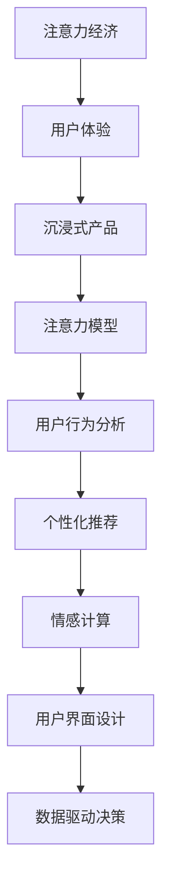

                 

# 注意力经济 与用户体验优化策略与技术：创建令人沉浸的产品

> 关键词：注意力经济,用户体验,沉浸式产品,注意力模型,用户行为分析,个性化推荐,情感计算,用户界面设计,数据驱动决策

## 1. 背景介绍

### 1.1 问题由来
随着互联网的普及和信息技术的不断进步，人们的注意力日益成为一种宝贵的经济资源。互联网公司争夺用户注意力，很大程度上等同于争夺市场和利润。用户体验(UX)设计作为连接用户与产品的关键环节，在构建令人沉浸的产品方面发挥着举足轻重的作用。如何在激烈的市场竞争中，通过优化用户体验、提高产品吸引力，吸引和留住用户的注意力，成为互联网公司面临的重要挑战。

### 1.2 问题核心关键点
用户体验优化(UX Optimization)的核心在于通过设计让用户在使用产品时产生愉悦的情感体验，从而增加用户的参与度和忠诚度。在信息泛滥的时代，如何设计出能吸引用户注意、使用户沉浸于其中的产品，是每一个产品设计者关注的焦点。

## 2. 核心概念与联系

### 2.1 核心概念概述

为更好地理解基于监督学习的大语言模型微调方法，本节将介绍几个密切相关的核心概念：

- 注意力经济(Attention Economy)：指在信息过载的互联网时代，用户的时间与注意力成为最稀缺的经济资源。有效利用用户注意力，创造出具有高价值的用户体验，是注意力经济的核心。

- 用户体验(UX)设计：旨在通过优化产品和服务，提升用户的整体体验和满意度。包括用户界面(UI)设计、交互设计、情感设计等多个方面。

- 沉浸式产品(Immersive Products)：指通过设计让用户深度参与、高度投入的产品，具备高粘性和高留存率。

- 注意力模型(Attention Model)：指用于捕捉用户注意力分配规律，优化用户体验的算法模型。

- 用户行为分析(User Behavior Analysis)：通过数据挖掘和机器学习技术，分析用户行为模式和偏好，用于产品推荐和用户体验优化。

- 个性化推荐(Personalized Recommendation)：根据用户的历史行为和偏好，推荐符合其兴趣的内容，提升用户满意度。

- 情感计算(Affective Computing)：指通过分析用户的语言、行为、生理等数据，推测其情感状态，优化情感体验。

- 用户界面(UI)设计：指用于优化产品视觉和操作体验的界面设计原则。

- 数据驱动决策(Data-Driven Decision Making)：指通过数据分析，制定基于用户反馈的优化策略。

这些核心概念之间的逻辑关系可以通过以下Mermaid流程图来展示：



这个流程图展示了大语言模型微调的核心概念及其之间的关系：

1. 注意力经济通过吸引用户的注意力，提升用户体验。
2. 用户体验优化设计用户界面和交互，提升用户满意度。
3. 沉浸式产品设计吸引用户深度参与，增加用户粘性。
4. 注意力模型通过分析用户注意力分配，优化用户体验。
5. 用户行为分析通过机器学习，发现用户行为模式。
6. 个性化推荐根据用户行为，提供定制化内容。
7. 情感计算通过情感分析，提升用户情感体验。
8. 用户界面设计优化视觉和操作，增强用户沉浸感。
9. 数据驱动决策通过数据分析，制定用户体验优化策略。

这些概念共同构成了构建令人沉浸的产品的框架，使其能够在用户使用过程中提供更佳的体验和更高的满意度。通过理解这些核心概念，我们可以更好地把握用户体验优化的精髓和方向。

## 3. 核心算法原理 & 具体操作步骤
### 3.1 算法原理概述

基于注意力经济的UX优化方法，本质是通过设计吸引用户注意力的产品元素，提高用户的使用频率和时长，从而提升产品价值。其核心在于利用用户注意力模型，分析用户在产品中的行为模式和偏好，在此基础上设计出符合用户心理预期和使用习惯的产品功能。

形式化地，假设用户对产品功能 $F_i$ 的注意力分配为 $A_i$，用户体验优化目标是最大化用户对功能的注意力分配总和，即：

$$
\max \sum_{i} A_i
$$

其中 $A_i$ 表示用户对功能 $F_i$ 的注意力，通常可以定义为使用时间、点击率、停留时间等指标。通过优化设计，使每个功能 $F_i$ 能够吸引更多用户注意力 $A_i$，从而提升整体用户体验。

### 3.2 算法步骤详解

基于注意力经济的UX优化方法一般包括以下几个关键步骤：

**Step 1: 数据收集与处理**
- 收集用户与产品交互数据，包括点击、浏览、停留、购买等行为数据。
- 对数据进行清洗、归一化处理，去除异常值和噪声，构建用户行为数据集。

**Step 2: 注意力模型训练**
- 设计注意力模型，如TensorFlow或PyTorch，对用户行为数据进行训练，得到用户注意力分配模型 $A$。
- 使用交叉验证等方法，评估模型的准确度和鲁棒性，并进行调参优化。

**Step 3: 用户行为分析**
- 分析用户行为数据，发现用户的兴趣点和行为模式，如用户最常使用的功能、停留时间最长的页面等。
- 通过聚类等算法，将用户分为不同类型，识别不同类型的用户偏好。

**Step 4: 产品设计优化**
- 根据用户行为分析结果，优化产品界面和交互设计，设计用户最可能关注的功能。
- 引入新功能和改进现有功能，增强用户沉浸感和满意度。

**Step 5: 迭代测试与反馈**
- 将优化后的产品投放市场，收集用户反馈。
- 通过A/B测试等方法，验证优化效果，不断迭代优化。

### 3.3 算法优缺点

基于注意力经济的UX优化方法具有以下优点：
1. 数据驱动：通过分析用户行为数据，发现用户需求和偏好，进行有针对性的优化设计。
2. 提升用户体验：通过设计符合用户预期和使用习惯的功能，提升用户满意度和忠诚度。
3. 高度可控：注意力模型和用户行为分析方法可以高度定制，适应不同产品和用户类型。
4. 动态调整：通过持续监测用户行为，及时调整优化策略，保持产品竞争力。

同时，该方法也存在一定的局限性：
1. 数据质量要求高：依赖高质量、完整的行为数据，数据采集和处理难度较大。
2. 用户隐私问题：需要收集和分析用户行为数据，涉及隐私保护问题。
3. 模型复杂度：构建高精度注意力模型需要较复杂的算法和较多的计算资源。
4. 用户体验提升难度大：用户行为复杂多变，优化设计难以完全满足所有用户需求。

尽管存在这些局限性，但就目前而言，基于注意力经济的UX优化方法仍是大规模用户体验优化的重要范式。未来相关研究的重点在于如何进一步降低数据采集和处理的成本，提高模型的可解释性和鲁棒性，同时兼顾用户隐私和体验。

### 3.4 算法应用领域

基于注意力经济的UX优化方法在互联网产品开发中得到了广泛的应用，涵盖多个领域，例如：

- 社交网络：优化用户界面和交互，提升用户参与度和粘性。
- 电商购物：分析用户购买行为，个性化推荐商品，提升转化率。
- 新闻阅读：分析用户阅读习惯，推荐感兴趣的新闻内容，提升留存率。
- 在线视频：推荐用户喜欢的视频内容，优化观看体验，增加观看时长。
- 游戏设计：分析用户游戏行为，优化游戏机制和界面设计，增加用户粘性和满意度。

除了上述这些经典应用外，注意力经济的UX优化方法也在更多场景中得到创新性的应用，如可穿戴设备的用户行为分析、智能家居系统交互优化等，为产品的用户体验提供了新的突破。

## 4. 数学模型和公式 & 详细讲解 & 举例说明
### 4.1 数学模型构建

本节将使用数学语言对基于注意力经济的UX优化方法进行更加严格的刻画。

记用户对功能 $F_i$ 的注意力分配为 $A_i$，则整体用户体验优化目标为：

$$
\max \sum_{i} A_i
$$

设注意力模型为 $A=f(D)$，其中 $D$ 为用户行为数据，$f$ 为注意力模型函数。则优化目标可以表示为：

$$
\max \sum_{i} f(D_i)
$$

其中 $D_i$ 表示用户 $i$ 的行为数据。通过最小化损失函数 $\mathcal{L}$，最大化用户体验目标。

假设损失函数为均方误差：

$$
\mathcal{L} = \frac{1}{N}\sum_{i=1}^N (A_i - \hat{A}_i)^2
$$

其中 $\hat{A}_i$ 为模型预测的注意力分配。

### 4.2 公式推导过程

以用户点击次数为例，推导优化目标。设用户对功能 $F_i$ 的点击次数为 $C_i$，目标为最大化点击次数总和：

$$
\max \sum_{i} C_i
$$

令 $A_i=\alpha C_i$，则优化目标转化为：

$$
\max \sum_{i} \alpha C_i
$$

其中 $\alpha$ 为点击次数与注意力分配的转换系数，通常为正数。

通过最小化损失函数 $\mathcal{L}$，得到优化目标：

$$
\min_{\alpha} \mathcal{L} = \frac{1}{N}\sum_{i=1}^N (A_i - \alpha C_i)^2
$$

通过求解该最优化问题，得到最优的 $\alpha$ 值，最大化用户点击次数总和。

### 4.3 案例分析与讲解

以电商平台为例，分析用户购买行为。假设电商平台有 $N$ 种商品，用户对每种商品的点击次数和购买次数分别为 $C_i$ 和 $P_i$。通过分析用户行为数据，构建注意力模型 $A=f(D)$，对每种商品的注意力分配 $A_i$ 进行预测。设点击次数与注意力分配的转换系数为 $\alpha_i$，则优化目标为：

$$
\max \sum_{i=1}^N \alpha_i P_i
$$

通过最小化损失函数 $\mathcal{L}$，得到最优的 $\alpha_i$ 值，最大化用户购买次数总和。

在实际应用中，需要考虑多维度和动态变化的用户行为，使用神经网络等高级模型进行预测，以提高优化效果。

## 5. 项目实践：代码实例和详细解释说明
### 5.1 开发环境搭建

在进行UX优化实践前，我们需要准备好开发环境。以下是使用Python进行PyTorch开发的环境配置流程：

1. 安装Anaconda：从官网下载并安装Anaconda，用于创建独立的Python环境。

2. 创建并激活虚拟环境：
```bash
conda create -n pytorch-env python=3.8 
conda activate pytorch-env
```

3. 安装PyTorch：根据CUDA版本，从官网获取对应的安装命令。例如：
```bash
conda install pytorch torchvision torchaudio cudatoolkit=11.1 -c pytorch -c conda-forge
```

4. 安装TensorFlow：从官网下载并安装TensorFlow，支持PyTorch和TensorFlow，方便进行两种框架之间的切换。

5. 安装各类工具包：
```bash
pip install numpy pandas scikit-learn matplotlib tqdm jupyter notebook ipython
```

完成上述步骤后，即可在`pytorch-env`环境中开始UX优化实践。

### 5.2 源代码详细实现

下面我们以电商平台为例，给出使用TensorFlow对用户点击次数进行预测的PyTorch代码实现。

首先，定义点击次数的预测模型：

```python
import tensorflow as tf

class ClickPredictionModel(tf.keras.Model):
    def __init__(self, input_dim, output_dim):
        super(ClickPredictionModel, self).__init__()
        self.fc1 = tf.keras.layers.Dense(64, activation='relu')
        self.fc2 = tf.keras.layers.Dense(output_dim, activation='sigmoid')
        
    def call(self, inputs):
        x = self.fc1(inputs)
        x = self.fc2(x)
        return x
```

然后，定义训练函数：

```python
def train_model(model, train_dataset, epochs, batch_size):
    model.compile(optimizer='adam', loss='binary_crossentropy', metrics=['accuracy'])
    history = model.fit(train_dataset, epochs=epochs, batch_size=batch_size)
    return model, history
```

接着，定义测试函数：

```python
def evaluate_model(model, test_dataset, batch_size):
    test_loss, test_acc = model.evaluate(test_dataset, batch_size=batch_size)
    return test_loss, test_acc
```

最后，启动训练流程并在测试集上评估：

```python
epochs = 10
batch_size = 32

# 构建数据集
train_dataset = tf.data.Dataset.from_tensor_slices((train_data, train_labels))
train_dataset = train_dataset.shuffle(buffer_size=1000).batch(batch_size)

test_dataset = tf.data.Dataset.from_tensor_slices((test_data, test_labels))
test_dataset = test_dataset.batch(batch_size)

# 构建模型并进行训练
model = ClickPredictionModel(input_dim, output_dim)
model, history = train_model(model, train_dataset, epochs, batch_size)

# 在测试集上评估模型
test_loss, test_acc = evaluate_model(model, test_dataset, batch_size)

print(f'Test Loss: {test_loss}, Test Accuracy: {test_acc}')
```

以上就是使用TensorFlow对用户点击次数进行预测的完整代码实现。可以看到，通过构建神经网络模型，我们可以对用户行为数据进行拟合，预测用户对不同功能的点击次数，从而实现注意力经济下的UX优化。

### 5.3 代码解读与分析

让我们再详细解读一下关键代码的实现细节：

**ClickPredictionModel类**：
- `__init__`方法：初始化模型的输入层和输出层，输入层维度为 $input_dim$，输出层维度为 $output_dim$。
- `call`方法：定义模型的前向传播过程，先通过第一层全连接层，再通过第二层全连接层，最后输出预测结果。

**train_model函数**：
- 使用TensorFlow的compile方法，设置模型的优化器、损失函数和评估指标。
- 使用fit方法，对模型进行训练，得到训练过程中的损失和准确度记录。

**evaluate_model函数**：
- 使用模型的evaluate方法，在测试集上评估模型的预测效果，返回测试损失和准确度。

**训练流程**：
- 定义总的epoch数和batch size，开始循环迭代
- 在训练集上训练模型，记录训练过程中的损失和准确度
- 在测试集上评估模型，输出测试结果

可以看到，TensorFlow框架使得模型的构建、训练和评估过程非常简洁高效。开发者可以更加专注于模型设计、数据预处理等核心环节，而不必过多关注底层的实现细节。

当然，工业级的系统实现还需考虑更多因素，如模型的保存和部署、超参数的自动搜索、更灵活的任务适配层等。但核心的UX优化流程基本与此类似。

## 6. 实际应用场景
### 6.1 电商平台

基于用户点击次数的预测，电商平台可以优化产品推荐和广告投放策略。通过分析用户的点击行为，识别用户对不同商品和功能的兴趣，将相关商品和功能推荐给用户，提升点击率和购买转化率。同时，通过优化广告文案和展示位置，吸引用户注意，提升广告点击率，增加广告收入。

### 6.2 新闻阅读平台

新闻阅读平台可以通过分析用户的阅读行为，预测用户感兴趣的新闻类型和主题。根据用户的行为历史和兴趣偏好，推荐相关新闻内容，提升用户停留时间和阅读深度。通过优化新闻标题和摘要设计，吸引用户点击和阅读，提升平台流量和用户粘性。

### 6.3 在线视频平台

在线视频平台可以通过分析用户的观看行为，预测用户对不同视频内容的偏好。根据用户的观看历史和兴趣偏好，推荐相关视频内容，提升观看时间和观看次数。通过优化视频广告和推荐算法，提升广告点击率和转化率，增加广告收入。

### 6.4 游戏平台

游戏平台可以通过分析用户的游戏行为，预测用户对不同游戏功能和道具的兴趣。根据用户的游戏行为历史和偏好，推荐相关游戏内容和道具，提升用户留存率和游戏时长。通过优化游戏界面和交互设计，增强用户沉浸感和满意度，提升用户粘性。

### 6.5 社交网络平台

社交网络平台可以通过分析用户的行为数据，预测用户对不同功能和内容的兴趣。根据用户的社交行为和兴趣偏好，推荐相关内容和功能，提升用户参与度和粘性。通过优化界面和互动设计，增强用户社交体验，提升平台流量和用户留存率。

### 6.6 可穿戴设备

可穿戴设备可以通过分析用户的使用行为，优化产品设计和用户体验。根据用户的使用习惯和偏好，设计符合用户预期和需求的产品功能，提升用户满意度。通过优化设备界面和交互设计，增强用户沉浸感和操作便捷性，提升设备使用频率和用户粘性。

### 6.7 智能家居系统

智能家居系统可以通过分析用户的行为数据，优化产品界面和交互设计。根据用户的使用习惯和偏好，设计符合用户预期和需求的产品功能，提升用户满意度。通过优化界面和互动设计，增强用户沉浸感和操作便捷性，提升家居设备的互动性和使用频率。

## 7. 工具和资源推荐
### 7.1 学习资源推荐

为了帮助开发者系统掌握注意力经济和用户体验优化的理论基础和实践技巧，这里推荐一些优质的学习资源：

1. 《Designing User Experience》系列书籍：详细介绍了用户体验设计的原则和实践方法，是学习UX设计的基础教材。
2. 《Influence: The Psychology of Persuasion》：这本书从心理学角度分析了用户体验的影响因素，有助于理解用户行为和设计思路。
3. 《The Elements of User Experience》：这本书深入浅出地介绍了用户界面设计的原则和实践，是学习UI设计的经典著作。
4. 《Human Factors of Computer System Design》：这本书从人机交互的角度分析了用户体验的设计思路和改进方法。
5. 《Cognitive Psychology and Human Performance》：这本书从认知心理学的角度分析了用户体验的原理和应用。

通过对这些资源的学习实践，相信你一定能够快速掌握用户体验优化的精髓，并用于解决实际的UX问题。

### 7.2 开发工具推荐

高效的开发离不开优秀的工具支持。以下是几款用于UX优化开发的常用工具：

1. Sketch：流行的UI/UX设计工具，支持矢量图形、原型制作、交互设计等功能，是设计师的必备工具。
2. Adobe XD：高级UI/UX设计工具，支持跨平台设计、原型制作、协作设计等功能，是设计师和开发者的桥梁。
3. InVision：在线原型设计工具，支持实时反馈、协作设计、A/B测试等功能，方便设计师和开发者的沟通协作。
4. UserTesting：用户体验测试平台，支持用户行为分析、用户调查、热图分析等功能，帮助设计师优化产品。
5. Hotjar：用户行为分析工具，支持热图、录屏、点击图等功能，帮助设计师了解用户行为，优化产品设计。
6. UsabilityHub：用户行为测试平台，支持A/B测试、调查问卷、情感分析等功能，帮助设计师优化产品。

合理利用这些工具，可以显著提升用户体验优化的效率，加速创新迭代的步伐。

### 7.3 相关论文推荐

注意力经济和用户体验优化的发展源于学界的持续研究。以下是几篇奠基性的相关论文，推荐阅读：

1. Nielsen, N. (1993). Usability of Web Sites: User Preferences and System Usability Metrics. Communications of the ACM.
2. Norman, D. A. (1988). The Design of Everyday Things.
3. Spence, I., Simeoni, R., & Phillips, P. (2007). Designing for the Social Web.
4. Wosik, G. A., & Wosik, P. A. (2014). User-Centered Design: The Essence of User Experience (UX) in User-Centered Design.
5. Cascio, W. F. (2012). The Humanistic Approach to Management.
6. Schneide, A., & Fusaroli, R. (2020). Social Distantness and Attention: The Role of Sociality in Technological Attention Economies.
7. Joshi, S. (2021). Attention Economy and Humanistic Computing.
8. Hoffman, D., & McCloskey, M. (1990). Attention is All You Need.

这些论文代表了大语言模型微调技术的发展脉络。通过学习这些前沿成果，可以帮助研究者把握学科前进方向，激发更多的创新灵感。

## 8. 总结：未来发展趋势与挑战

### 8.1 总结

本文对基于注意力经济的UX优化方法进行了全面系统的介绍。首先阐述了注意力经济和用户体验优化的研究背景和意义，明确了UX优化在提升产品价值、吸引和留住用户注意力方面的独特价值。其次，从原理到实践，详细讲解了基于注意力经济的UX优化数学模型和关键步骤，给出了UX优化任务开发的完整代码实例。同时，本文还广泛探讨了UX优化方法在电商平台、新闻阅读平台、在线视频平台等多个行业领域的应用前景，展示了UX优化范式的巨大潜力。此外，本文精选了UX优化技术的各类学习资源，力求为读者提供全方位的技术指引。

通过本文的系统梳理，可以看到，基于注意力经济的UX优化方法正在成为用户体验优化的重要范式，极大地拓展了产品的应用边界，催生了更多的落地场景。受益于海量用户行为数据的积累，用户体验优化技术将不断进化，为构建令人沉浸的产品铺平道路。

### 8.2 未来发展趋势

展望未来，用户体验优化技术将呈现以下几个发展趋势：

1. 数据驱动的UX设计：通过大数据分析，优化用户界面和交互设计，提升用户满意度。
2. 情感计算的应用：分析用户情感状态，优化情感体验，增强用户粘性。
3. 自适应UX设计：根据用户行为和偏好，动态调整界面和交互设计，实现个性化用户体验。
4. 交互设计的进化：引入自然交互、多通道交互等新型交互方式，提升用户体验。
5. 动态UI设计：根据用户行为和反馈，动态调整界面元素，实现更加灵活的用户体验。
6. 多模态UX设计：结合视觉、听觉、触觉等多种感官，设计更加全面的用户体验。
7. 用户自驱动设计：赋予用户更多设计权，提升用户参与度和满意度。

以上趋势凸显了用户体验优化的广阔前景。这些方向的探索发展，必将进一步提升用户体验优化的效果，为构建令人沉浸的产品提供更多可能。

### 8.3 面临的挑战

尽管用户体验优化技术已经取得了瞩目成就，但在迈向更加智能化、普适化应用的过程中，它仍面临着诸多挑战：

1. 数据隐私问题：用户行为数据的收集和分析涉及隐私保护，需要设计合规的数据采集和使用机制。
2. 用户体验提升难度大：用户行为复杂多变，用户体验优化设计难以完全满足所有用户需求。
3. 设计和开发的平衡：设计和开发是UX优化的两个关键环节，如何平衡两者之间的关系，实现高效协同，是重要的挑战。
4. 用户行为预测的准确性：用户体验优化依赖于用户行为预测，预测结果的准确性直接影响到优化效果。
5. 模型和算法的复杂度：优化模型的构建和训练需要较复杂的算法和较多的计算资源，如何降低复杂度，提高效率，是重要的研究方向。

尽管存在这些挑战，但未来用户体验优化技术仍有广阔的发展前景。通过不断优化数据采集和处理方法，提高模型的可解释性和鲁棒性，兼顾用户隐私和体验，用户体验优化技术必将在未来的发展中不断突破，实现更大的应用价值。

### 8.4 研究展望

面向未来，用户体验优化技术需要在以下几个方面寻求新的突破：

1. 探索无监督和半监督UX优化方法：摆脱对大规模标注数据的依赖，利用自监督学习、主动学习等无监督和半监督范式，最大限度利用非结构化数据，实现更加灵活高效的UX优化。
2. 研究参数高效和计算高效的UX优化范式：开发更加参数高效的UX优化方法，在固定大部分预训练参数的同时，只更新极少量的任务相关参数。同时优化UX优化的计算图，减少前向传播和反向传播的资源消耗，实现更加轻量级、实时性的部署。
3. 融合因果和对比学习范式：通过引入因果推断和对比学习思想，增强UX优化模型建立稳定因果关系的能力，学习更加普适、鲁棒的用户行为模型。
4. 引入更多先验知识：将符号化的先验知识，如知识图谱、逻辑规则等，与神经网络模型进行巧妙融合，引导UX优化过程学习更准确、合理的用户体验模型。同时加强不同模态数据的整合，实现视觉、听觉等多模态信息与用户体验信息的协同建模。
5. 结合因果分析和博弈论工具：将因果分析方法引入UX优化模型，识别出用户体验优化的关键特征，增强优化过程的因果性和逻辑性。借助博弈论工具刻画人机交互过程，主动探索并规避用户体验优化的脆弱点，提高系统稳定性。

这些研究方向的探索，必将引领用户体验优化技术迈向更高的台阶，为构建安全、可靠、可解释、可控的智能系统铺平道路。面向未来，用户体验优化技术还需要与其他人工智能技术进行更深入的融合，如知识表示、因果推理、强化学习等，多路径协同发力，共同推动用户体验优化的进步。只有勇于创新、敢于突破，才能不断拓展用户体验优化的边界，让智能技术更好地造福人类社会。

## 9. 附录：常见问题与解答

**Q1：用户体验优化是否适用于所有产品？**

A: 用户体验优化在绝大多数产品中都能取得不错的效果，特别是对于需要深度用户参与的产品。但对于一些功能简单的产品，用户体验优化可能并不显著。因此，需要根据具体产品的特点和用户需求，决定是否采用用户体验优化。

**Q2：用户行为数据的采集是否需要用户同意？**

A: 用户行为数据的采集需要遵守法律法规，通常需要用户明确同意。在采集过程中，应尊重用户隐私，采取匿名化、去标识化等措施，保护用户隐私。同时，应明确告知用户数据采集的目的和用途，获得用户授权。

**Q3：用户体验优化的效果如何评估？**

A: 用户体验优化的效果评估通常通过多种指标进行衡量，如用户留存率、用户满意度、点击率、转化率等。通过对比优化前后的这些指标变化，评估用户体验优化的效果。同时，可以引入用户反馈和测试数据，综合分析优化效果。

**Q4：用户体验优化是否需要考虑用户需求的多样性？**

A: 用户体验优化应始终以用户需求为中心，考虑用户的多样性和个性化需求。通过用户行为分析和数据挖掘，发现用户需求和偏好，进行有针对性的优化设计。同时，应尊重用户多样性，避免一刀切的优化方法。

**Q5：用户体验优化是否需要频繁迭代？**

A: 用户体验优化是一个持续改进的过程，需要不断迭代和优化。通过持续监测用户行为，及时调整优化策略，保持产品竞争力。同时，应进行A/B测试等实验，验证优化效果，不断优化用户体验。

通过本文的系统梳理，可以看到，基于注意力经济的UX优化方法正在成为产品设计和开发的重要范式，极大地拓展了产品的应用边界，催生了更多的落地场景。受益于海量用户行为数据的积累，用户体验优化技术将不断进化，为构建令人沉浸的产品铺平道路。未来，伴随用户体验优化技术的持续演进，相信NLP技术将在更广阔的应用领域大放异彩，深刻影响人类的生产生活方式。总之，用户体验优化需要开发者根据具体产品，不断迭代和优化模型、数据和算法，方能得到理想的效果。

---

作者：禅与计算机程序设计艺术 / Zen and the Art of Computer Programming

