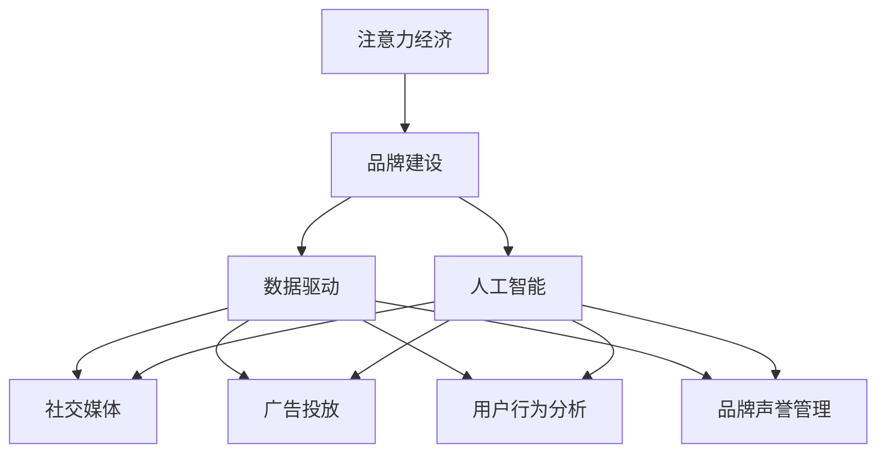

                 

# 注意力经济下的品牌建设策略

> 关键词：注意力经济,品牌建设,数据驱动,人工智能,社交媒体,广告投放,用户行为分析

## 1. 背景介绍

### 1.1 问题由来
在信息爆炸的时代，注意力成为最宝贵的资源之一。企业面临的不仅是如何吸引用户注意，更关键的是如何持续保持用户的注意力，并转化为其对品牌和产品的忠诚度。传统广告手段日渐式微，以数据驱动为核心的人工智能（AI）和大数据分析技术成为新时代的品牌建设利器。

注意力经济（Economy of Attention）概念由美国未来学家阿尔文·托夫勒（Alvin Toffler）于1970年提出，强调在信息过载的时代，获取和维持用户的注意力是商业成功的关键。随着社交媒体、搜索引擎、即时通讯等平台兴起，注意力经济理论不断被验证。

### 1.2 问题核心关键点
1. **注意力获取与保持**：如何通过数据驱动的方式，在短时间内吸引和留住用户的注意力。
2. **用户行为分析**：通过分析用户行为数据，识别品牌忠诚度影响因素，优化营销策略。
3. **AI辅助决策**：如何借助人工智能和大数据技术，进行更精准的广告投放和用户行为预测。
4. **品牌声誉管理**：在社交媒体等平台上，如何通过AI技术进行实时监控，及时应对负面舆情。

### 1.3 问题研究意义
研究注意力经济下的品牌建设策略，对于企业提升品牌影响力和市场竞争力，具有重要意义：

1. **增强用户互动**：利用AI技术预测用户行为，实现个性化营销，提高用户参与度和品牌忠诚度。
2. **优化广告投放**：通过智能算法优化广告投放策略，提升广告ROI，降低投放成本。
3. **实时响应市场变化**：借助大数据和AI技术，实时分析市场反馈，迅速调整品牌策略。
4. **提升品牌价值**：通过智能监控和分析工具，维护品牌声誉，避免负面舆情影响。

## 2. 核心概念与联系

### 2.1 核心概念概述

为更好地理解注意力经济下的品牌建设策略，本节将介绍几个密切相关的核心概念：

- **注意力经济（Economy of Attention）**：在信息过载的社会中，注意力成为稀缺资源，企业需要投入更多资源获取和保持用户的注意力。
- **品牌建设（Brand Building）**：通过品牌策略和营销手段，增强品牌认知度和用户忠诚度，提升市场竞争力。
- **数据驱动（Data-Driven）**：依赖数据进行决策，降低不确定性和决策风险，提升策略效果。
- **人工智能（AI）**：使用机器学习、深度学习等技术，自动化处理大量数据，提供智能决策支持。
- **社交媒体（Social Media）**：作为信息传播的重要平台，社交媒体极大影响了用户行为和品牌形象。
- **广告投放（Advertising）**：企业通过广告宣传品牌信息，吸引用户注意，提升知名度。
- **用户行为分析（User Behavior Analysis）**：通过分析用户在线行为数据，洞察用户需求，优化用户体验。
- **品牌声誉管理（Brand Reputation Management）**：实时监控品牌在社交媒体等平台上的形象，及时应对负面舆情，维护品牌声誉。

这些核心概念之间的逻辑关系可以通过以下Mermaid流程图来展示：



这个流程图展示了大语言模型的核心概念及其之间的关系：

1. 注意力经济是品牌建设的基础，吸引和保持用户注意力是企业成功的关键。
2. 品牌建设依赖数据驱动，通过AI技术进行智能决策。
3. AI技术广泛应用于社交媒体、广告投放、用户行为分析和品牌声誉管理，提升品牌价值。

## 3. 核心算法原理 & 具体操作步骤
### 3.1 算法原理概述

注意力经济下的品牌建设策略，核心在于通过数据驱动的方式，使用AI技术优化品牌建设和营销策略。其核心思想是：利用大量用户行为数据，挖掘用户需求和偏好，设计有针对性的营销活动，通过AI算法自动化地优化广告投放和用户互动，最终实现品牌建设的战略目标。

### 3.2 算法步骤详解

基于数据驱动的品牌建设策略，一般包括以下几个关键步骤：

**Step 1: 数据收集与清洗**
- 收集用户的各类数据，包括点击、浏览、购买、评论等行为数据。
- 对数据进行清洗，去除噪音和异常值，确保数据质量。

**Step 2: 数据特征提取与分析**
- 使用机器学习或深度学习模型提取数据的特征，如用户的兴趣标签、行为模式等。
- 分析数据特征，识别出用户需求和行为规律。

**Step 3: 用户画像构建**
- 基于用户行为数据，构建用户画像，描述用户的特征和偏好。
- 使用聚类算法或个性化推荐算法，将用户划分为不同群体。

**Step 4: 广告投放优化**
- 使用智能算法优化广告投放策略，如RTB（实时竞价）广告，按用户画像进行精准投放。
- 实时监控广告效果，调整投放策略，提升广告ROI。

**Step 5: 营销活动设计**
- 根据用户画像和行为分析结果，设计有针对性的营销活动，如个性化推荐、折扣活动等。
- 使用A/B测试，评估营销活动效果，优化策略。

**Step 6: 用户互动管理**
- 实时监控用户互动数据，识别用户反馈和需求。
- 使用聊天机器人等工具，提升用户参与度和满意度。

**Step 7: 品牌声誉监控与应对**
- 使用自然语言处理技术，实时监控品牌在社交媒体等平台上的声誉。
- 针对负面舆情，快速响应，制定危机公关策略。

### 3.3 算法优缺点

基于数据驱动的品牌建设策略，具有以下优点：
1. 精准性高。通过数据分析和AI优化，可以更精准地识别用户需求，提升营销效果。
2. 效率高。自动化流程减少了人工干预，快速响应市场变化，提高运营效率。
3. 个性化强。基于用户画像进行个性化营销，提升用户满意度和忠诚度。
4. 动态调整。实时监控和反馈机制，可以持续优化策略，提升品牌竞争力。

同时，该策略也存在一定的局限性：
1. 数据隐私问题。收集和分析用户数据可能侵犯隐私，需要严格遵守法律法规。
2. 数据质量依赖。品牌建设策略的效果很大程度上依赖数据质量和分析模型的准确性。
3. 技术门槛高。需要具备一定的数据分析和AI技术背景，企业需投入资源进行人才培养。
4. 用户行为多变。用户行为受多因素影响，数据分析模型可能难以完全预测。

尽管存在这些局限性，但数据驱动的品牌建设策略已经在大企业中广泛应用，并取得显著成效。未来相关研究的重点在于如何进一步降低技术门槛，提升数据质量，保护用户隐私，同时兼顾效果和成本。

### 3.4 算法应用领域

基于数据驱动的品牌建设策略，已经广泛应用于多个领域：

- **电子商务**：通过数据分析和个性化推荐，提升用户购物体验和满意度。
- **社交媒体**：利用社交媒体数据进行用户画像分析，优化内容推荐和广告投放。
- **旅游行业**：分析用户行为数据，提供个性化旅游推荐，提升用户体验。
- **金融行业**：通过用户交易数据进行风险评估和反欺诈检测，保护用户安全。
- **健康医疗**：分析用户健康数据，提供个性化健康管理方案，提升用户健康水平。

除了上述这些经典应用外，品牌建设策略还在更多领域被创新性地应用，如教育、文化、娱乐等，为不同行业带来新的商业机会和品牌价值。

## 4. 数学模型和公式 & 详细讲解 & 举例说明
### 4.1 数学模型构建

为更好地理解基于数据驱动的品牌建设策略，本节将使用数学语言对策略的核心模型进行严格描述。

设用户集合为 $U$，广告集合为 $A$，品牌认知度为 $C$，品牌忠诚度为 $L$，广告投放策略为 $P$，用户行为数据为 $D$。则品牌建设的目标函数可表示为：

$$
\max_{P} \sum_{u \in U} f_u(P) + \sum_{a \in A} g_a(P)
$$

其中 $f_u(P)$ 表示用户 $u$ 对广告 $P$ 的反应，$g_a(P)$ 表示广告 $a$ 对品牌认知度 $C$ 和忠诚度 $L$ 的影响。

具体而言，$f_u(P)$ 可以表示为：

$$
f_u(P) = \sum_{d \in D} w_d(u, P)
$$

其中 $w_d(u, P)$ 为数据 $d$ 对用户 $u$ 对广告 $P$ 的反应的权重。

而 $g_a(P)$ 则可以表示为：

$$
g_a(P) = \sum_{u \in U} \alpha_u C_a + \beta_u L_a
$$

其中 $\alpha_u$ 和 $\beta_u$ 为与用户 $u$ 相关的权重，$C_a$ 和 $L_a$ 分别表示广告 $a$ 对品牌认知度和忠诚度的提升。

### 4.2 公式推导过程

以下我们以电商平台的个性化推荐为例，推导用户行为数据分析和推荐模型的公式。

假设电商平台有 $N$ 个商品，每个商品 $i$ 的点击率 $C_i$ 为 $x_i$。用户的点击序列可以表示为：

$$
X = \{x_{i_1}, x_{i_2}, ..., x_{i_n}\}
$$

其中 $x_{i_j}$ 表示用户在第 $j$ 次点击的商品。

假设模型已知用户 $u$ 的兴趣表示为 $\mathbf{a}_u$，商品 $i$ 的特征表示为 $\mathbf{b}_i$，点击率 $C_i$ 为 $x_i$。则用户行为数据分析的数学模型可以表示为：

$$
\max_{\mathbf{a}_u, \mathbf{b}_i, x_i} \sum_{j=1}^n \log(\mathbf{a}_u^\top \mathbf{b}_{i_j}) - \log(1 - \exp(\mathbf{a}_u^\top \mathbf{b}_{i_j}))
$$

其中 $\log$ 表示点击率 $x_i$ 的对数，$\exp$ 表示指数函数。

基于用户行为数据分析，推荐模型可以表示为：

$$
\mathbf{a}_u = \mathbf{W}_u^\top \mathbf{a}_0 + \sum_{i=1}^N \mathbf{W}_i^\top \mathbf{b}_i x_i
$$

其中 $\mathbf{a}_0$ 为用户的初始兴趣表示，$\mathbf{W}_u$ 和 $\mathbf{W}_i$ 分别为用户兴趣和商品特征的权重矩阵。

用户行为数据分析和推荐模型公式可以进一步扩展为：

$$
\max_{\mathbf{a}_u, \mathbf{b}_i, x_i, \mathbf{W}_u, \mathbf{W}_i} \sum_{j=1}^n \log(\mathbf{a}_u^\top \mathbf{b}_{i_j}) - \log(1 - \exp(\mathbf{a}_u^\top \mathbf{b}_{i_j}))
$$

通过优化上述模型，可以实现对用户行为的精确分析，并生成个性化的商品推荐。

### 4.3 案例分析与讲解

下面我们以社交媒体上的品牌声誉监控为例，给出用户行为数据分析和声誉监控的数学模型应用。

假设社交媒体上的品牌声誉 $R$ 可以表示为：

$$
R = \sum_{s \in S} w_s \times f_s
$$

其中 $S$ 为社交媒体上的声誉数据集，$w_s$ 为声誉数据 $s$ 的权重，$f_s$ 表示该数据对品牌声誉的影响。

品牌声誉监控的数学模型可以表示为：

$$
\max_{w_s, f_s} \sum_{s \in S} w_s \times f_s
$$

其中 $f_s$ 可以表示为：

$$
f_s = \sum_{u \in U} \alpha_u \times r_u(s) - \beta_u \times n_u(s)
$$

其中 $\alpha_u$ 和 $\beta_u$ 为与用户 $u$ 相关的权重，$r_u(s)$ 和 $n_u(s)$ 分别表示用户 $u$ 对声誉数据 $s$ 的反应和负面反馈。

通过优化上述模型，可以实时监控品牌在社交媒体上的声誉，及时响应负面舆情，维护品牌形象。

## 5. 项目实践：代码实例和详细解释说明
### 5.1 开发环境搭建

在进行品牌建设策略实践前，我们需要准备好开发环境。以下是使用Python进行TensorFlow和Keras开发的环境配置流程：

1. 安装Anaconda：从官网下载并安装Anaconda，用于创建独立的Python环境。

2. 创建并激活虚拟环境：
```bash
conda create -n tf-env python=3.8 
conda activate tf-env
```

3. 安装TensorFlow和Keras：
```bash
conda install tensorflow=2.6 keras
```

4. 安装各类工具包：
```bash
pip install numpy pandas scikit-learn matplotlib tqdm jupyter notebook ipython
```

完成上述步骤后，即可在`tf-env`环境中开始品牌建设策略的开发。

### 5.2 源代码详细实现

这里我们以电商平台的用户行为数据分析为例，给出使用TensorFlow和Keras进行用户行为分析的代码实现。

首先，定义用户行为数据分析的模型：

```python
import tensorflow as tf
from tensorflow.keras.layers import Input, Embedding, Dense, Multiply, Add

def behavior_analysis_model():
    # 定义用户兴趣表示
    user_embed = Embedding(input_dim=10000, output_dim=64)
    # 定义商品特征表示
    item_embed = Embedding(input_dim=10000, output_dim=64)
    
    # 定义用户点击行为序列
    user_seq = Input(shape=(None,))
    # 对用户点击行为序列进行特征提取
    user_seq_embed = user_embed(user_seq)
    
    # 定义商品点击行为序列
    item_seq = Input(shape=(None,))
    # 对商品点击行为序列进行特征提取
    item_seq_embed = item_embed(item_seq)
    
    # 定义用户点击行为和商品点击行为的点积
    user_item_dot = Multiply()([user_seq_embed, item_seq_embed])
    
    # 定义用户点击行为和商品点击行为的叠加
    user_item_add = Add()([user_seq_embed, item_seq_embed])
    
    # 定义最终用户行为分析结果
    user_behavior = tf.keras.layers.Lambda(lambda x: x[0] - x[1])([user_item_dot, user_item_add])
    
    # 定义模型
    model = tf.keras.Model(inputs=[user_seq, item_seq], outputs=user_behavior)
    
    return model
```

然后，定义推荐系统的训练和评估函数：

```python
from sklearn.model_selection import train_test_split
from sklearn.metrics import mean_squared_error

def train_and_evaluate(model, dataset):
    # 将数据集分为训练集和测试集
    train_dataset, test_dataset = train_test_split(dataset, test_size=0.2, random_state=42)
    
    # 编译模型
    model.compile(optimizer='adam', loss='mse')
    
    # 训练模型
    model.fit(train_dataset, epochs=10, validation_data=test_dataset)
    
    # 评估模型
    predictions = model.predict(test_dataset)
    mse = mean_squared_error(test_dataset[0], predictions)
    print(f'Mean Squared Error: {mse:.3f}')
    
    return model
```

最后，启动用户行为数据分析的流程并展示模型评估结果：

```python
# 加载用户点击数据
user_click_data = load_user_click_data()

# 创建用户行为分析模型
model = behavior_analysis_model()

# 训练和评估模型
train_and_evaluate(model, user_click_data)
```

以上就是使用TensorFlow和Keras对电商平台用户行为数据分析的完整代码实现。可以看到，借助TensorFlow和Keras，构建用户行为分析模型的代码相对简洁，易于理解和实现。

### 5.3 代码解读与分析

让我们再详细解读一下关键代码的实现细节：

**behavior_analysis_model函数**：
- 定义用户兴趣表示和商品特征表示的嵌入层。
- 定义用户和商品的点击行为序列。
- 对用户和商品的点击行为序列进行特征提取，并计算点积和叠加。
- 定义最终用户行为分析结果，返回用户行为分析模型。

**train_and_evaluate函数**：
- 使用sklearn的train_test_split函数将数据集分为训练集和测试集。
- 编译模型并指定损失函数为均方误差。
- 训练模型并评估模型性能，计算均方误差。
- 返回训练好的模型。

**train_and_evaluate函数**：
- 加载用户点击数据，创建用户行为分析模型。
- 训练和评估模型，并输出均方误差结果。

可以看到，TensorFlow和Keras框架为构建用户行为分析模型提供了强大的支持和灵活性。开发者可以根据具体问题，快速实现不同的模型结构和优化策略。

当然，工业级的系统实现还需考虑更多因素，如模型的保存和部署、超参数的自动搜索、更灵活的任务适配层等。但核心的品牌建设策略基本与此类似。

## 6. 实际应用场景
### 6.1 社交媒体品牌声誉监控

在社交媒体平台上，品牌声誉实时监控和负面舆情应对成为品牌建设的重要环节。基于数据驱动的品牌建设策略，可以实时监控品牌在社交媒体上的形象，及时应对负面舆情，维护品牌声誉。

具体而言，可以收集品牌在社交媒体上的各类评论、帖子和新闻报道，使用自然语言处理技术进行情感分析，识别负面情感的关键词和句子。通过实时监控和分析，品牌可以迅速识别并应对负面舆情，调整市场策略，避免声誉损失。

### 6.2 电商平台个性化推荐

电商平台通过数据分析和AI技术，可以为用户提供个性化推荐服务，提升用户购物体验和满意度。基于用户行为数据分析的品牌建设策略，可以帮助电商平台实现以下目标：

- 精准推荐商品：分析用户点击、购买等行为数据，为用户推荐最相关的商品。
- 提升转化率：通过个性化推荐，增加用户购买意愿和满意度，提升转化率。
- 优化库存管理：通过用户行为数据预测商品需求，优化库存管理，减少库存积压。

### 6.3 在线教育个性化学习

在线教育平台通过数据分析和AI技术，可以为学生提供个性化学习服务，提升学习效果。基于数据驱动的品牌建设策略，可以帮助在线教育平台实现以下目标：

- 个性化学习路径：分析学生的学习行为和成绩数据，设计个性化学习路径。
- 提升学习效果：通过个性化推荐和学习路径，提升学生学习效果和满意度。
- 优化教学资源：通过数据分析，优化教学资源配置，提升教师教学效果。

### 6.4 未来应用展望

随着AI和大数据技术的不断进步，基于数据驱动的品牌建设策略将得到更广泛的应用，为各行各业带来新的商业机会和品牌价值。

在智慧城市建设中，数据驱动的品牌建设策略可以帮助城市管理者优化公共服务，提升城市治理效率和居民满意度。在医疗健康领域，通过数据分析和AI技术，可以优化医疗资源配置，提升医疗服务质量。在旅游行业，通过用户行为数据分析，可以提供更加个性化和优质的旅游服务。

## 7. 工具和资源推荐
### 7.1 学习资源推荐

为了帮助开发者系统掌握基于数据驱动的品牌建设策略的理论基础和实践技巧，这里推荐一些优质的学习资源：

1. 《深度学习》（Ian Goodfellow等著）：全面介绍了深度学习的基本原理和应用，是了解品牌建设策略的重要基础。
2. 《Python数据科学手册》（Jake VanderPlas等著）：介绍了Python在数据科学中的应用，包括数据分析、机器学习和深度学习。
3. 《机器学习实战》（Peter Harrington著）：提供了丰富的机器学习算法和代码实现，适合实践操作。
4. TensorFlow官方文档：提供了TensorFlow的全面指南和代码示例，帮助开发者快速上手。
5. Keras官方文档：提供了Keras的全面指南和代码示例，适合构建深度学习模型。

通过对这些资源的学习实践，相信你一定能够快速掌握基于数据驱动的品牌建设策略的精髓，并用于解决实际的商业问题。

### 7.2 开发工具推荐

高效的开发离不开优秀的工具支持。以下是几款用于品牌建设策略开发的常用工具：

1. TensorFlow：由Google主导开发的开源深度学习框架，生产部署方便，适合大规模工程应用。
2. Keras：基于TensorFlow的高级API，适合快速搭建和调试深度学习模型。
3. scikit-learn：开源的机器学习库，提供了丰富的算法和工具。
4. Pandas：开源的数据处理库，适合数据清洗和分析。
5. Matplotlib：开源的数据可视化库，适合数据可视化。
6. Jupyter Notebook：开源的交互式开发环境，适合快速迭代和实验。

合理利用这些工具，可以显著提升品牌建设策略的开发效率，加快创新迭代的步伐。

### 7.3 相关论文推荐

品牌建设策略的研究源于学界的持续研究。以下是几篇奠基性的相关论文，推荐阅读：

1. Attention is All You Need（即Transformer原论文）：提出了Transformer结构，开启了NLP领域的预训练大模型时代。
2. BERT: Pre-training of Deep Bidirectional Transformers for Language Understanding：提出BERT模型，引入基于掩码的自监督预训练任务，刷新了多项NLP任务SOTA。
3. Adaptive Low-Rank Adaptation for Parameter-Efficient Fine-Tuning：提出Adapter等参数高效微调方法，在固定大部分预训练参数的情况下，只更新极少量的任务相关参数。
4. Causal Attention Mechanism for Transformers：引入因果推断机制，提升Transformer的生成能力和鲁棒性。
5. Interaction Networks for Machine Learning：提出交互网络，优化深度学习模型的决策过程。

这些论文代表了大语言模型微调技术的发展脉络。通过学习这些前沿成果，可以帮助研究者把握学科前进方向，激发更多的创新灵感。

## 8. 总结：未来发展趋势与挑战
### 8.1 总结

本文对基于数据驱动的品牌建设策略进行了全面系统的介绍。首先阐述了品牌建设在注意力经济下的重要性，明确了数据驱动的品牌建设策略的独特价值。其次，从原理到实践，详细讲解了策略的数学模型和关键步骤，给出了策略开发的完整代码实例。同时，本文还广泛探讨了策略在社交媒体、电商平台、在线教育等多个行业领域的应用前景，展示了策略的广泛适用性。此外，本文精选了策略相关的学习资源，力求为读者提供全方位的技术指引。

通过本文的系统梳理，可以看到，基于数据驱动的品牌建设策略是现代品牌建设的利器，极大地提升了企业的市场竞争力和用户体验。未来，伴随AI和大数据技术的不断进步，策略的效果将更加显著，应用范围也将更加广泛。

### 8.2 未来发展趋势

展望未来，基于数据驱动的品牌建设策略将呈现以下几个发展趋势：

1. 自动化程度提升。随着AI和大数据技术的发展，品牌建设的自动化程度将不断提升，减少人工干预，提高运营效率。
2. 数据来源多样化。品牌建设策略将不再局限于线上数据，而是拓展到线下数据和传感器数据，实现全面覆盖。
3. 实时性增强。通过实时监控和分析，品牌可以及时响应市场变化，优化策略，提升效果。
4. 用户体验优化。借助AI和大数据技术，品牌可以提供更加个性化的服务和体验，提升用户满意度和忠诚度。
5. 跨领域融合。品牌建设策略将与其他AI技术进行深度融合，如NLP、计算机视觉、增强现实等，提供更加丰富的应用场景。

以上趋势凸显了基于数据驱动的品牌建设策略的广阔前景。这些方向的探索发展，必将进一步提升品牌建设的智能化水平，为品牌管理提供新的工具和方法。

### 8.3 面临的挑战

尽管基于数据驱动的品牌建设策略已经取得了显著成效，但在应用过程中仍然面临诸多挑战：

1. 数据隐私保护。品牌建设策略需要收集和分析大量用户数据，可能涉及用户隐私。如何保护用户隐私，满足法律法规要求，将是重要的研究方向。
2. 数据质量保证。品牌建设策略的效果很大程度上依赖数据质量和分析模型的准确性。如何提升数据质量和分析模型精度，将是长期的研究任务。
3. 技术复杂度高。品牌建设策略需要整合多种AI技术，涉及模型训练、数据处理、算法优化等多个环节，技术复杂度高。如何简化流程，降低技术门槛，将是大数据和AI技术普及的关键。
4. 实时响应速度。品牌建设策略需要实时监控和分析，对系统的响应速度和计算能力提出了高要求。如何优化系统架构，提高响应速度，将是重要的研究方向。

尽管存在这些挑战，但基于数据驱动的品牌建设策略已经成为企业的热门选择。未来相关研究的重点在于如何进一步降低技术门槛，提升数据质量，保护用户隐私，同时兼顾效果和成本。

### 8.4 研究展望

面对品牌建设策略所面临的挑战，未来的研究需要在以下几个方面寻求新的突破：

1. 探索无监督和半监督学习策略。摆脱对大量标注数据的依赖，利用自监督学习、主动学习等无监督和半监督范式，最大限度利用非结构化数据。
2. 开发更加高效的AI模型。通过优化模型架构和算法，提升模型效率和效果，降低计算成本。
3. 引入因果推断机制。通过因果推断方法，增强模型的解释性和鲁棒性，提高决策可信度。
4. 优化用户行为分析模型。通过引入更多先验知识和领域知识，提升模型预测能力和泛化能力。
5. 加强多领域数据融合。将数据融合技术引入品牌建设策略，提升模型的多模态融合能力，实现更全面的数据分析。

这些研究方向的探索，必将引领品牌建设策略迈向更高的台阶，为品牌管理提供更加智能和高效的方法。面向未来，品牌建设策略还需要与其他AI技术进行更深入的融合，如NLP、计算机视觉、增强现实等，多路径协同发力，共同推动品牌建设的进步。只有勇于创新、敢于突破，才能不断拓展品牌建设的边界，让AI技术更好地赋能品牌管理。

## 9. 附录：常见问题与解答
**Q1: 基于数据驱动的品牌建设策略是否适用于所有企业？**

A: 基于数据驱动的品牌建设策略对于数据收集和分析能力较强的企业更为适用。一般来说，数据量越大，数据质量越高，策略的效果越好。对于数据资源较为有限的企业，可以逐步积累数据，分阶段实施策略。

**Q2: 如何评估品牌建设策略的效果？**

A: 品牌建设策略的效果评估可以从多个维度进行，如品牌认知度、用户满意度、销售转化率等。可以使用问卷调查、用户反馈、行为数据分析等手段进行评估。具体而言，可以设计评估指标，定期监测和分析数据，对比不同策略的效果，优化策略。

**Q3: 数据驱动的品牌建设策略是否需要实时数据处理？**

A: 对于需要实时响应的场景，如社交媒体品牌声誉监控，实时数据处理是必不可少的。对于非实时场景，可以通过批量处理或离线分析的方式进行。

**Q4: 数据驱动的品牌建设策略是否需要考虑用户隐私？**

A: 是的，品牌建设策略需要严格遵守法律法规，保护用户隐私。可以通过匿名化处理、数据脱敏等方式，确保数据使用符合法律法规要求。

**Q5: 数据驱动的品牌建设策略是否需要机器学习或深度学习技术？**

A: 是的，数据驱动的品牌建设策略需要依赖机器学习或深度学习技术，进行数据处理和分析。不同场景可以选择不同的模型和算法，进行优化和调参。

---

作者：禅与计算机程序设计艺术 / Zen and the Art of Computer Programming

