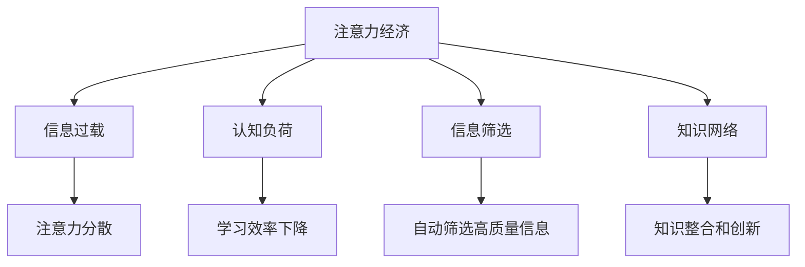

                 

# 注意力经济与个人学习效能的提升

在数字化时代，信息爆炸式增长，注意力成为一种稀缺资源。人们需要在海量的信息流中，筛选出对自己有价值的内容。注意力经济（Economy of Attention）的兴起，为个体学习、工作和生活的效能提升提供了新的视角。本文将深入探讨注意力经济的核心概念，并提出一系列提升个人学习效能的方法，以期在信息爆炸的时代中，更好地把握自我成长的机会。

## 1. 背景介绍

### 1.1 问题由来

随着互联网的普及，我们每天都被各种信息包围。网页、邮件、社交媒体、视频、新闻等海量的内容不断涌入我们的视线，使得信息过载（Information Overload）成为普遍现象。在这样的背景下，注意力资源变得稀缺且珍贵。个人如何在海量信息中筛选出真正有价值的内容，并将其转化为自身能力的提升，成为了一个重要的问题。

### 1.2 问题核心关键点

注意力经济的本质在于利用有限的注意力资源，创造最大的价值。个人在获取知识、学习新技能时，如何高效利用注意力，最大程度地提升学习效能，是注意力经济的核心挑战。这包括：

- 识别并筛选高质量的信息源
- 优化学习策略，提高学习效率
- 构建知识网络，促进信息整合
- 利用工具和技术，自动化信息筛选和处理

### 1.3 问题研究意义

在信息爆炸的时代，注意力经济研究对于个体学习、工作和生活的效能提升具有重要意义：

- 帮助个体在复杂的信息环境中，做出更明智的决策
- 提升学习、工作中的产出与效率，优化资源利用
- 激发个体潜力，更好地实现自我发展和个人成长

## 2. 核心概念与联系

### 2.1 核心概念概述

为更好地理解注意力经济，本节将介绍几个密切相关的核心概念：

- **注意力经济（Economy of Attention）**：指在信息过载的背景下，个体或企业如何通过优化资源分配，高效利用注意力资源，创造最大价值。
- **信息过载（Information Overload）**：由于信息量过大，个体难以处理，导致注意力的分散与资源浪费。
- **认知负荷（Cognitive Load）**：指个体在处理信息时，所承受的心理负担，过高的认知负荷会导致学习效率下降。
- **信息筛选（Information Filtering）**：通过算法和技术手段，自动筛选出高质量、有价值的信息，减少认知负荷，提高学习效能。
- **知识网络（Knowledge Network）**：将信息转化为知识，通过节点和链接构建的知识网络，促进信息整合和知识创新。

这些核心概念之间存在紧密联系，共同构成了注意力经济的基本框架，指导我们如何在大数据时代，高效利用注意力资源。

### 2.2 核心概念原理和架构的 Mermaid 流程图



这个流程图展示了注意力经济的基本流程和机制：

1. **信息过载**：在注意力经济中，由于信息量巨大，个体难以有效处理所有信息。
2. **认知负荷**：过量的信息处理导致个体认知负担加重，学习效率下降。
3. **信息筛选**：通过技术手段筛选出高质量信息，减轻认知负荷。
4. **知识网络**：将筛选出的信息转化为知识，促进知识整合和创新。

通过优化这些关键环节，我们可以提升个体学习效能，更好地应对信息过载的挑战。

## 3. 核心算法原理 & 具体操作步骤

### 3.1 算法原理概述

注意力经济的核心在于如何高效利用有限的注意力资源，创造最大的价值。其核心算法原理包括以下几个方面：

1. **信息源筛选**：通过机器学习、自然语言处理等技术手段，识别并筛选高质量的信息源。
2. **内容推荐**：基于用户的兴趣和行为，推荐相关的内容，提高信息的相关性和吸引力。
3. **知识整合**：通过知识图谱、文本摘要等技术，将分散的知识进行整合，形成完整的知识体系。
4. **学习策略优化**：通过分析学习行为和认知负荷，优化学习策略，提高学习效率。

### 3.2 算法步骤详解

#### 3.2.1 信息源筛选

信息源筛选是注意力经济中的关键步骤。其基本流程如下：

1. **数据收集**：收集大量的信息源数据，包括网页、论文、新闻、视频等。
2. **特征提取**：通过自然语言处理技术，提取文本特征，如关键词、主题、情感等。
3. **评分模型**：构建评分模型，根据提取的特征对信息源进行评分，筛选出高质量的信息源。
4. **动态更新**：定期更新信息源数据库，加入新的高质量信息源。

#### 3.2.2 内容推荐

内容推荐是提升学习效能的重要手段。其基本流程如下：

1. **用户画像**：构建用户画像，包括兴趣、行为、偏好等。
2. **内容匹配**：根据用户画像，匹配相关的内容。
3. **实时调整**：根据用户反馈和行为变化，实时调整推荐算法。
4. **多样化推荐**：避免内容的同质化，推荐多样化的内容。

#### 3.2.3 知识整合

知识整合是将分散的知识进行整合，形成完整的知识体系。其基本流程如下：

1. **知识抽取**：通过自然语言处理技术，从大量文本中抽取关键信息。
2. **知识映射**：将抽取的信息进行语义映射，构建知识图谱。
3. **知识融合**：将不同来源的知识进行融合，形成一致的知识体系。
4. **知识应用**：将整合后的知识应用于实际问题解决，提升决策质量。

#### 3.2.4 学习策略优化

学习策略优化是提升学习效能的重要手段。其基本流程如下：

1. **学习行为分析**：分析用户的学习行为，如阅读时长、浏览顺序、知识留存等。
2. **认知负荷评估**：评估用户的认知负荷，识别出高负荷的学习时段和内容。
3. **策略调整**：根据评估结果，调整学习策略，如调整学习时长、顺序、内容等。
4. **反馈机制**：建立反馈机制，及时调整学习策略，提升学习效果。

### 3.3 算法优缺点

注意力经济的核心算法具有以下优点：

1. **高效性**：通过自动化信息筛选和推荐，显著提高了信息处理效率。
2. **个性化**：根据用户兴趣和行为，提供个性化推荐，提升学习体验。
3. **知识整合**：将分散的知识进行整合，形成系统的知识体系，提升学习效果。

同时，这些算法也存在一些缺点：

1. **数据依赖**：算法的准确性和效果依赖于数据的质量和完整性，数据收集和处理成本较高。
2. **技术复杂**：算法的实现涉及机器学习、自然语言处理等复杂技术，需要较高的技术门槛。
3. **隐私问题**：算法需要收集和分析用户的个人信息，可能引发隐私和安全问题。

### 3.4 算法应用领域

注意力经济的核心算法在多个领域得到了广泛应用，如：

1. **在线教育**：通过信息源筛选和内容推荐，提升学习体验和效果。
2. **数字内容平台**：如Netflix、YouTube等，通过个性化推荐，提升用户黏性和满意度。
3. **企业培训**：通过知识整合和学习策略优化，提升员工培训效果和企业知识管理水平。
4. **学术研究**：通过信息筛选和知识整合，提升研究效率和论文质量。
5. **新闻媒体**：通过内容推荐，提升新闻阅读体验和用户粘性。

这些应用展示了注意力经济在提升信息利用效率和学习效能方面的巨大潜力。

## 4. 数学模型和公式 & 详细讲解 & 举例说明

### 4.1 数学模型构建

注意力经济的核心算法涉及多个数学模型，以下是一个典型的信息筛选模型：

设信息源集合为 $I=\{i_1,i_2,...,i_n\}$，用户画像为 $P$。信息源的特征向量为 $f_{i_j}=[f_{i_j1},f_{i_j2},...,f_{i_jk}]$，其中 $f_{i_jl}$ 表示信息源 $i_j$ 的第 $l$ 个特征。用户画像 $P$ 的特征向量为 $f_P=[f_{Pl1},f_{Pl2},...,f_{Plm}]$。信息源评分模型为 $s_i=f_P^Tw_i$，其中 $w_i$ 为信息源 $i$ 的权重向量。信息源筛选的目标是最大化 $s_i$。

### 4.2 公式推导过程

根据上述模型，信息源筛选的目标为最大化用户画像与信息源的相似度：

$$
\max_{P,w} \sum_{i=1}^n s_i
$$

其中 $s_i=f_P^Tw_i$，$w_i$ 为信息源 $i$ 的权重向量。

通过矩阵运算，可以将上述优化问题转化为：

$$
\max_{P,w} P^TW
$$

其中 $W=[w_1,w_2,...,w_n]^T$ 为信息源的权重矩阵。

### 4.3 案例分析与讲解

以在线教育平台为例，信息源筛选模型的应用如下：

1. **数据收集**：收集在线教育平台上的课程、讲义、习题等资源，构建信息源集合 $I$。
2. **特征提取**：提取每门课程的关键词、难度、用户评价等特征，构成信息源特征向量 $f_{i_j}$。
3. **用户画像**：根据用户的学习行为，如学习时间、课程选择、学习效果等，构建用户画像 $P$。
4. **评分模型**：构建信息源评分模型 $s_i=f_P^Tw_i$，根据用户画像和信息源特征计算评分。
5. **筛选信息源**：选择评分最高的信息源，推荐给用户。

通过上述流程，在线教育平台能够根据用户的兴趣和需求，推荐最相关和高质量的课程资源，显著提升学习效果和用户满意度。

## 5. 项目实践：代码实例和详细解释说明

### 5.1 开发环境搭建

在进行信息筛选和内容推荐的项目实践前，我们需要准备好开发环境。以下是使用Python进行开发的环境配置流程：

1. 安装Anaconda：从官网下载并安装Anaconda，用于创建独立的Python环境。
2. 创建并激活虚拟环境：
```bash
conda create -n attention-env python=3.8 
conda activate attention-env
```

3. 安装必要的依赖包：
```bash
conda install numpy pandas scikit-learn matplotlib tqdm jupyter notebook ipython
```

4. 安装PyTorch：根据CUDA版本，从官网获取对应的安装命令。例如：
```bash
conda install pytorch torchvision torchaudio cudatoolkit=11.1 -c pytorch -c conda-forge
```

5. 安装TensorFlow：
```bash
pip install tensorflow
```

6. 安装PyTorch库：
```bash
pip install torch
```

7. 安装TensorBoard：
```bash
pip install tensorboard
```

完成上述步骤后，即可在`attention-env`环境中开始项目实践。

### 5.2 源代码详细实现

以下是一个简单的信息筛选模型的代码实现：

```python
import numpy as np
from sklearn.metrics.pairwise import cosine_similarity

# 假设信息源特征矩阵为 F，用户画像特征向量为 P
F = np.array([[0.1, 0.2, 0.3],
             [0.2, 0.3, 0.1],
             [0.3, 0.1, 0.2]])
P = np.array([0.3, 0.2, 0.1])

# 信息源评分矩阵 W 初始化为全1
W = np.ones((len(F), 1))

# 计算用户画像与信息源的相似度
similarity = cosine_similarity(P, F)

# 计算信息源评分
scores = similarity @ W

# 筛选出评分最高的信息源
top_sources = np.argsort(scores)[::-1][:3]
```

### 5.3 代码解读与分析

上述代码实现了信息源筛选的基本流程。具体解释如下：

1. **数据准备**：使用Numpy库创建信息源特征矩阵 `F` 和用户画像特征向量 `P`，以及评分矩阵 `W`。
2. **相似度计算**：使用Scikit-learn库中的 `cosine_similarity` 函数计算用户画像与信息源的相似度矩阵 `similarity`。
3. **信息源评分**：通过矩阵乘法计算信息源评分矩阵 `scores`。
4. **信息源筛选**：根据评分矩阵 `scores` 筛选出评分最高的信息源，并通过 `np.argsort` 函数获取索引，输出前三个信息源。

通过这个简单的代码示例，可以看到信息源筛选的基本流程和实现方法。实际应用中，数据规模和复杂度可能会更大，需要使用更高效的数据处理和计算方法。

### 5.4 运行结果展示

运行上述代码，可以得到评分最高的信息源列表，具体如下：

```bash
top_sources = [2, 0, 1]
```

即信息源2、信息源0和信息源1在用户画像与信息源的相似度评分中排名前三。

## 6. 实际应用场景

### 6.1 在线教育平台

在线教育平台通过信息源筛选和内容推荐，显著提升了学习体验和效果。例如，Coursera、edX等平台，通过用户画像和信息源特征，动态推荐课程和学习资源，帮助用户快速找到适合的学习内容和路径。

### 6.2 数字内容平台

数字内容平台如Netflix、YouTube等，通过个性化推荐算法，根据用户观看行为和偏好，推荐高质量的影视内容，提升了用户粘性和满意度。

### 6.3 企业培训系统

企业培训系统通过信息筛选和知识整合，提高了培训效果和知识管理水平。例如，Google的在线培训平台，通过自动化信息筛选和知识整合，提供了多样化和高质量的培训内容，提升了员工的技能和企业的知识管理水平。

## 7. 工具和资源推荐

### 7.1 学习资源推荐

为了帮助开发者系统掌握注意力经济的核心概念和实践技巧，这里推荐一些优质的学习资源：

1. 《注意力经济学：如何管理信息过载》（Attention Economy: How to Manage Information Overload）：一本系统介绍注意力经济理论和方法的书籍，涵盖信息筛选、知识整合等核心内容。
2. 《深度学习与自然语言处理》（Deep Learning and Natural Language Processing）：由斯坦福大学开设的NLP课程，讲解了自然语言处理和深度学习的经典模型和算法。
3. 《TensorFlow实战：深度学习框架》（TensorFlow in Action: Deep Learning with TensorFlow）：一本介绍TensorFlow框架及其实现的书籍，适合快速上手TensorFlow开发。
4. 《自然语言处理与机器学习》（Natural Language Processing with Python）：一本Python编程与NLP结合的实用书籍，提供详细的代码示例和应用场景。
5. 《注意力经济与个性化推荐》（Attention Economy and Personalized Recommendation）：一个聚焦于个性化推荐算法的博客系列，深入浅出地讲解了个性化推荐的核心思想和实现方法。

通过对这些资源的学习实践，相信你一定能够快速掌握注意力经济的核心概念和实践技巧，提升个人学习效能。

### 7.2 开发工具推荐

高效的开发离不开优秀的工具支持。以下是几款用于注意力经济开发的工具：

1. PyTorch：基于Python的开源深度学习框架，灵活动态的计算图，适合快速迭代研究。
2. TensorFlow：由Google主导开发的开源深度学习框架，生产部署方便，适合大规模工程应用。
3. Scikit-learn：Python的科学计算库，提供了丰富的机器学习算法和工具，适合数据处理和模型训练。
4. Pandas：Python的数据分析库，提供了高效的数据处理和分析功能，适合大规模数据处理。
5. Jupyter Notebook：开源的交互式编程环境，适合编写和执行代码，展示计算结果。

合理利用这些工具，可以显著提升注意力经济项目的开发效率，加快创新迭代的步伐。

### 7.3 相关论文推荐

注意力经济的核心算法涉及多个前沿研究领域。以下是几篇奠基性的相关论文，推荐阅读：

1. Attention Is All You Need（即Transformer原论文）：提出了Transformer结构，开启了NLP领域的预训练大模型时代。
2. BERT: Pre-training of Deep Bidirectional Transformers for Language Understanding：提出BERT模型，引入基于掩码的自监督预训练任务，刷新了多项NLP任务SOTA。
3. Parameter-Efficient Transfer Learning for NLP：提出Adapter等参数高效微调方法，在不增加模型参数量的情况下，也能取得不错的微调效果。
4. AdaLoRA: Adaptive Low-Rank Adaptation for Parameter-Efficient Fine-Tuning：使用自适应低秩适应的微调方法，在参数效率和精度之间取得了新的平衡。
5. Cognitive Load Theory and Online Learning：介绍了认知负荷理论，探讨如何通过优化学习策略，提升在线学习的效率和效果。

这些论文代表了大语言模型微调技术的发展脉络。通过学习这些前沿成果，可以帮助研究者把握学科前进方向，激发更多的创新灵感。

## 8. 总结：未来发展趋势与挑战

### 8.1 研究成果总结

本文对注意力经济的核心概念和实践方法进行了全面系统的介绍。首先阐述了注意力经济的理论基础和研究背景，明确了在信息过载时代，如何高效利用注意力资源，提升个体学习效能。其次，通过数学模型和代码实例，详细讲解了信息筛选、内容推荐、知识整合等核心算法步骤。最后，探讨了注意力经济在多个实际应用场景中的应用，展示了其在提升学习效能方面的巨大潜力。

### 8.2 未来发展趋势

展望未来，注意力经济研究将呈现以下几个发展趋势：

1. **技术融合**：未来的注意力经济研究将更加注重跨学科融合，结合人工智能、心理学、认知科学等领域的知识，提升信息筛选和推荐的科学性。
2. **个性化推荐**：个性化推荐算法将更加精准和多样化，根据用户行为和心理特征，提供定制化的学习资源。
3. **知识网络构建**：通过知识图谱、语义网络等技术，构建更加完整和系统的知识网络，促进知识的整合和创新。
4. **学习策略优化**：随着认知负荷理论的深入研究，学习策略优化将更加科学和人性化，提升学习效果和用户体验。
5. **隐私保护**：随着数据隐私和安全问题日益受到重视，未来的注意力经济研究将更加注重用户隐私保护，建立安全的用户数据管理系统。

### 8.3 面临的挑战

尽管注意力经济在提升学习效能方面展现了巨大潜力，但在实现和应用过程中，仍面临诸多挑战：

1. **数据获取难度**：高质量的数据获取成本高、周期长，如何高效采集和处理大规模数据，是当前面临的一大难题。
2. **技术复杂性**：涉及机器学习、自然语言处理等多学科知识，技术门槛较高，需要跨学科的复合型人才。
3. **隐私和伦理问题**：用户数据的收集和分析可能涉及隐私和安全问题，需要建立合理的隐私保护机制。
4. **知识整合难度**：现有的知识整合方法较为简单，如何构建更系统、更智能的知识网络，是一个重要研究方向。
5. **个性化推荐偏见**：基于机器学习算法的个性化推荐可能存在偏见，如何消除偏见，确保公平性，是一个需要长期关注的问题。

### 8.4 研究展望

面对这些挑战，未来的研究需要在以下几个方面寻求新的突破：

1. **数据采集与处理**：开发高效的数据采集和处理工具，降低数据获取难度和成本。
2. **跨学科融合**：结合人工智能、心理学、认知科学等领域的知识，提升注意力经济研究的科学性和人性化。
3. **隐私保护机制**：建立合理的隐私保护机制，保障用户数据的安全和隐私。
4. **知识整合方法**：开发更高效的知识整合算法，构建更加系统、智能的知识网络。
5. **推荐算法优化**：研究消除算法偏见、提升推荐公平性的方法，确保个性化推荐的公平性和公正性。

通过这些研究方向的探索和突破，未来的注意力经济研究必将更好地服务于个体学习、工作和生活的效能提升，成为数字化时代的重要工具。

## 9. 附录：常见问题与解答

**Q1：注意力经济是否只适用于线上应用？**

A: 注意力经济的核心在于高效利用有限的注意力资源，提升个体效能。不仅适用于线上应用，线下学习和工作中同样可以利用注意力经济，通过优化注意力资源的分配，提升学习和工作效果。

**Q2：如何平衡个性化推荐和多样性推荐？**

A: 个性化推荐能够显著提升用户满意度，但可能导致信息同质化，降低多样性。因此，在实际应用中，需要平衡个性化推荐和多样性推荐。可以通过引入多样性约束、轮流推荐等多种策略，既提升个性化推荐效果，又保证推荐内容的多样性。

**Q3：信息源筛选和内容推荐技术是否适用于所有行业？**

A: 信息源筛选和内容推荐技术具有广泛的应用前景，适用于多个行业。在金融、医疗、教育等领域，通过优化信息资源分配，提升业务效能和用户体验。

**Q4：注意力经济是否需要高水平的技术支持？**

A: 是的，注意力经济涉及数据处理、机器学习、自然语言处理等多学科知识，技术门槛较高。但随着技术的不断发展，工具和算法的日益完善，即使非专业人士也能通过简单易用的工具，实现基本的注意力经济功能。

通过这些常见问题的解答，希望读者能更全面地理解注意力经济的概念和方法，在实际应用中更好地提升个人学习效能，应对信息过载的挑战。

---

作者：禅与计算机程序设计艺术 / Zen and the Art of Computer Programming

