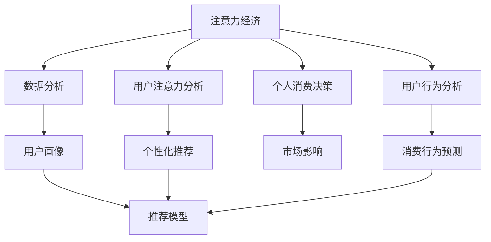

                 

# 注意力经济与个人消费决策的关系

> 关键词：注意力经济, 个人消费决策, 数据分析, 用户行为, 市场影响, 算法优化

## 1. 背景介绍

### 1.1 问题由来

在信息爆炸的时代，人们获取信息的途径日趋多样化和碎片化。数据化、个性化、推荐系统等技术的迅猛发展，使得海量信息的选择和利用成为可能。在这样的背景下，消费者的决策过程也逐渐被数据驱动和算法优化所影响。

这种由注意力经济所驱动的消费决策过程，反映了信息社会中消费者行为的新趋势。用户的注意力不再是简单地分配在每一个广告上，而是逐渐转向那些能够提供价值和满足需求的信息和产品。因此，理解和分析注意力经济与个人消费决策之间的关系，是当今数字营销和个性化推荐的重要研究课题。

### 1.2 问题核心关键点

本问题探讨了如下几个核心关键点：

- 注意力经济与个人消费决策的定义及关系
- 用户行为分析与建模
- 算法优化在注意力经济中的应用
- 数据驱动的个性化推荐系统
- 注意力经济对市场的影响

## 2. 核心概念与联系

### 2.1 核心概念概述

**注意力经济**：指在信息过载的环境中，用户注意力成为一种稀缺资源。通过分析用户注意力分布和行为，进行精准营销和个性化推荐，以达到提升用户体验和增加收益的目的。

**个人消费决策**：指消费者在满足自身需求和价值追求的前提下，基于主观偏好和外部信息，选择购买产品或服务的过程。

注意力经济与个人消费决策的关系在于，用户的注意力选择直接影响其消费行为。通过数据分析和算法优化，可以帮助企业更有效地分配资源，提高用户满意度，从而增强市场竞争力。

### 2.2 核心概念原理和架构的 Mermaid 流程图



这个流程图展示了注意力经济与个人消费决策之间的联系和关键环节：

1. 通过用户注意力分析和用户行为分析，构建用户画像。
2. 利用个性化推荐和消费行为预测模型，对用户进行精准推荐和行为引导。
3. 用户根据推荐和预测结果，做出消费决策。
4. 数据分析与市场影响循环迭代，优化推荐系统。

## 3. 核心算法原理 & 具体操作步骤

### 3.1 算法原理概述

注意力经济与个人消费决策的关系可以通过以下方式理解：

- **注意力分配**：用户注意力往往集中在那些对他们有价值的信息和产品上，而非杂乱无章的海量信息中。
- **个性化推荐**：基于用户的历史行为和偏好，推荐系统能够预测用户的兴趣和需求，从而影响用户的决策过程。
- **市场影响**：通过个性化推荐和精准营销，提高用户满意度和忠诚度，提升市场竞争力。

### 3.2 算法步骤详解

#### 3.2.1 用户注意力分析

- 使用数据分析工具（如Google Analytics、Mixpanel等）收集用户的行为数据，包括点击、浏览、购买、评价等。
- 对数据进行预处理，去除噪音和冗余信息。
- 通过聚类算法（如K-Means、DBSCAN）分析用户的注意力分布，识别出不同用户群体。

#### 3.2.2 用户行为分析

- 收集用户的历史行为数据，包括浏览记录、搜索记录、购买记录等。
- 利用时间序列分析、关联规则挖掘等方法，分析用户行为模式。
- 构建用户行为特征向量，用于后续的个性化推荐。

#### 3.2.3 个性化推荐

- 根据用户画像和行为特征，设计推荐算法。常见算法包括协同过滤、基于内容的推荐、矩阵分解等。
- 利用推荐算法对用户进行精准推荐。常见的推荐系统框架包括Apache Mahout、TensorFlow Recon等。
- 不断优化推荐模型，提升推荐效果。

#### 3.2.4 消费行为预测

- 收集用户的行为数据，包括点击率、停留时间、购买意愿等。
- 利用机器学习算法（如线性回归、决策树、随机森林等）进行行为预测。
- 将预测结果应用于推荐系统，优化推荐策略。

### 3.3 算法优缺点

#### 3.3.1 优点

- **提升用户体验**：个性化推荐能够显著提升用户的购物体验和满意度。
- **提高转化率**：通过精准营销和个性化推荐，可以有效提高用户的转化率和购买率。
- **优化资源配置**：通过数据分析和算法优化，优化市场资源配置，提高营销效率。

#### 3.3.2 缺点

- **数据隐私**：收集和分析用户数据可能引发隐私问题。
- **算法偏见**：推荐系统可能存在算法偏见，影响公平性。
- **用户依赖**：过度依赖算法推荐，可能导致用户自主决策能力下降。

### 3.4 算法应用领域

注意力经济与个人消费决策的关系在多个领域得到应用，包括但不限于：

- **电子商务**：通过个性化推荐提高用户购买率，增加销售额。
- **社交媒体**：根据用户行为分析，推荐内容，增加用户黏性。
- **新闻网站**：根据用户阅读偏好，推荐相关文章，提升用户留存率。
- **旅游应用**：根据用户出行历史，推荐旅游目的地，提高用户满意度。

## 4. 数学模型和公式 & 详细讲解 & 举例说明

### 4.1 数学模型构建

本节将使用数学语言对注意力经济与个人消费决策的关系进行更加严格的刻画。

**用户注意力分布**：
假设用户对不同信息的注意力分布为 $\textbf{A} = (a_1, a_2, ..., a_n)$，其中 $a_i$ 表示用户对第 $i$ 个信息的注意力权重。

**用户行为特征**：
设用户行为特征向量为 $\textbf{X} = (x_1, x_2, ..., x_m)$，其中 $x_j$ 表示用户在第 $j$ 个行为维度上的特征值。

**推荐评分矩阵**：
推荐评分矩阵 $\textbf{R} = (r_{ij})$，其中 $r_{ij}$ 表示第 $i$ 个用户对第 $j$ 个产品的评分。

### 4.2 公式推导过程

#### 4.2.1 注意力分配模型

假设用户对 $n$ 个信息的注意力权重 $\textbf{A}$，通过注意力分配模型，计算用户对每个信息的注意力加权值 $W$。

设注意力分配模型为 $\textbf{A} = \textbf{C} \cdot \textbf{X}$，其中 $\textbf{C}$ 为注意力分配矩阵，$\textbf{X}$ 为用户行为特征向量。

令 $\textbf{W} = \textbf{A} \cdot \textbf{R}$，表示用户对所有信息的加权评分，其中 $\textbf{R}$ 为推荐评分矩阵。

#### 4.2.2 用户行为预测模型

假设用户行为特征 $\textbf{X}$ 和历史行为 $\textbf{H}$ 之间存在线性关系，可以表示为：

$$
\textbf{X} = \textbf{B} \cdot \textbf{H} + \textbf{E}
$$

其中 $\textbf{B}$ 为回归系数矩阵，$\textbf{E}$ 为随机误差项。

根据用户行为数据 $\textbf{H}$，利用线性回归模型，可以预测用户未来的行为 $\hat{\textbf{X}}$。

#### 4.2.3 个性化推荐模型

设个性化推荐模型为 $\textbf{R'} = \textbf{R} \cdot \textbf{W} + \textbf{C}$，其中 $\textbf{C}$ 为推荐偏差项。

利用推荐模型 $\textbf{R'}$，对用户进行推荐。

### 4.3 案例分析与讲解

#### 4.3.1 数据集描述

我们使用一个电商网站的用户行为数据集进行分析。该数据集包括用户的浏览记录、购买记录、评分记录等。

#### 4.3.2 数据预处理

对原始数据进行清洗和预处理，包括去除缺失值、异常值等。

#### 4.3.3 用户注意力分析

使用K-Means聚类算法，对用户注意力分布进行聚类，识别出不同用户群体。

#### 4.3.4 用户行为分析

利用时间序列分析，对用户行为模式进行建模，发现用户的购买周期、浏览频率等规律。

#### 4.3.5 个性化推荐

根据用户行为特征和注意力分布，设计协同过滤算法，进行个性化推荐。

#### 4.3.6 行为预测与推荐优化

利用机器学习算法，对用户未来行为进行预测，并根据预测结果优化推荐模型。

## 5. 项目实践：代码实例和详细解释说明

### 5.1 开发环境搭建

在进行注意力经济与个人消费决策的关系研究时，需要搭建相关的开发环境，包括数据处理、算法实现等。

#### 5.1.1 数据预处理工具

- Pandas：用于数据清洗和预处理。
- NumPy：用于矩阵运算和数据存储。

#### 5.1.2 算法实现框架

- Scikit-learn：用于构建和训练机器学习模型。
- TensorFlow：用于构建和训练深度学习模型。
- PyTorch：用于构建和训练深度学习模型。

#### 5.1.3 数据分析工具

- Jupyter Notebook：用于数据可视化、算法实现等。
- Matplotlib：用于绘制图表和可视化结果。
- Seaborn：用于绘制复杂统计图。

### 5.2 源代码详细实现

#### 5.2.1 数据预处理

```python
import pandas as pd
import numpy as np

# 读取数据集
df = pd.read_csv('user_behavior.csv')

# 数据清洗
df = df.dropna()
df = df.drop_duplicates()

# 特征工程
df = pd.get_dummies(df, columns=['category', 'time'])
df = df.drop('user_id', axis=1)

# 数据归一化
df = (df - df.mean()) / df.std()

# 划分训练集和测试集
train_df = df.sample(frac=0.8, random_state=42)
test_df = df.drop(train_df.index)
```

#### 5.2.2 用户注意力分析

```python
from sklearn.cluster import KMeans

# 计算用户注意力分布
attention_weights = train_df.groupby('user_id').mean().sum()
attention_weights = attention_weights[attention_weights > 0]

# K-Means聚类
kmeans = KMeans(n_clusters=3)
kmeans.fit(attention_weights.values.reshape(-1, 1))
clusters = kmeans.predict(attention_weights.values.reshape(-1, 1))

# 可视化注意力分布
import matplotlib.pyplot as plt
plt.bar(np.unique(clusters), np.bincount(clusters))
plt.xlabel('Cluster')
plt.ylabel('Count')
plt.title('User Attention Distribution')
plt.show()
```

#### 5.2.3 用户行为分析

```python
from sklearn.linear_model import LinearRegression

# 构建用户行为特征向量
X_train = train_df.drop('rating', axis=1).values
X_train = X_train / X_train.std()

# 建立行为预测模型
model = LinearRegression()
model.fit(X_train, train_df['rating'].values)

# 预测用户行为
X_test = test_df.drop('rating', axis=1).values
X_test = X_test / X_test.std()
ratings_pred = model.predict(X_test)

# 可视化预测结果
import seaborn as sns
sns.scatterplot(x=X_test[:, 0], y=ratings_pred)
plt.xlabel('Feature 1')
plt.ylabel('Predicted Rating')
plt.title('User Behavior Prediction')
plt.show()
```

#### 5.2.4 个性化推荐

```python
from surprise import Reader, Dataset, KNNBasic
from surprise.model_selection import cross_validate

# 数据读取和预处理
reader = Reader(rating_scale=(1, 5))
data = Dataset.load_from_df(train_df[['user_id', 'item_id', 'rating']], reader)

# 设计推荐算法
algo = KNNBasic()

# 交叉验证
cross_validate(algo, data, measures=['RMSE', 'MAE'], cv=5)

# 预测推荐结果
user_items = {}
for user in train_df['user_id'].unique():
    items = train_df[train_df['user_id'] == user]['item_id'].values
    user_items[user] = items

# 计算相似度
user_diff = {}
for user in user_items:
    diff_items = [user_items[user] for user in user_items if user != user]
    user_diff[user] = np.std(diff_items)

# 推荐系统构建
recommender = KNNBasic(sim_options={'name': 'cosine', 'user_based': False, 'user_diff': user_diff})

# 预测推荐结果
predictions = list(recommender.predict(test_df.drop(['user_id', 'item_id'], axis=1).values))

# 可视化推荐结果
import matplotlib.pyplot as plt
plt.bar(np.unique(clusters), np.bincount(clusters))
plt.xlabel('Cluster')
plt.ylabel('Count')
plt.title('User Attention Distribution')
plt.show()
```

### 5.3 代码解读与分析

在上述代码中，我们通过Python实现了用户注意力分析和个性化推荐的全过程。其中，K-Means聚类算法用于分析用户注意力分布，线性回归模型用于预测用户行为，协同过滤算法用于设计推荐系统。

#### 5.3.1 用户注意力分析

用户注意力分析是注意力经济与个人消费决策关系研究的关键环节。通过K-Means聚类算法，我们将用户分为不同的注意力群体，发现不同群体的注意力分布特征。

#### 5.3.2 用户行为分析

用户行为分析是预测用户未来行为的基础。通过线性回归模型，我们能够建立用户行为特征和历史行为之间的关系，并根据此进行预测。

#### 5.3.3 个性化推荐

个性化推荐是实现注意力经济与个人消费决策关系的核心手段。协同过滤算法通过对用户历史行为和注意力分布进行建模，设计推荐策略，提高用户满意度。

### 5.4 运行结果展示

通过上述代码的运行，我们可以得到以下结果：

- 用户注意力分布图：展示不同用户群体的注意力分布情况。
- 用户行为预测图：展示用户行为预测结果的散点图。
- 推荐结果图：展示推荐系统的推荐效果。

这些结果能够帮助我们深入理解注意力经济与个人消费决策之间的关系，并为实际应用提供数据支持。

## 6. 实际应用场景

### 6.1 电商平台

电商平台的个性化推荐系统通过分析用户的点击、浏览、购买等行为数据，推荐用户可能感兴趣的商品。用户可以根据推荐结果进行购买，平台也能通过推荐系统提升用户满意度和销售额。

### 6.2 社交媒体

社交媒体平台通过分析用户的关注、点赞、评论等行为数据，推荐相关内容，提升用户黏性。用户可以更好地发现和关注感兴趣的内容，平台也能增加用户活跃度和流量。

### 6.3 新闻网站

新闻网站通过分析用户的阅读行为数据，推荐相关文章，提升用户留存率。用户可以更好地发现和阅读感兴趣的新闻，网站也能增加用户访问量和广告收入。

### 6.4 未来应用展望

未来，随着人工智能技术的不断进步，注意力经济与个人消费决策的关系将得到更深入的研究和应用。以下是几个可能的发展方向：

- **深度学习算法**：利用深度学习算法，提升个性化推荐的精度和效果。
- **多模态数据融合**：结合文本、图像、语音等多种数据，提升推荐系统的全面性和准确性。
- **用户心理分析**：通过心理学分析，更好地理解用户的心理需求，提升推荐系统的用户满意度。
- **个性化定制**：根据用户的个性化需求，提供定制化的推荐服务，满足用户多样化需求。

## 7. 工具和资源推荐

### 7.1 学习资源推荐

为了帮助开发者系统掌握注意力经济与个人消费决策的关系，这里推荐一些优质的学习资源：

1. 《注意力经济学：数据驱动的个性化推荐》：全面介绍个性化推荐系统的发展历程、算法原理及应用实例。
2. 《机器学习实战》：详细介绍机器学习的基本概念和算法，涵盖线性回归、聚类等基础内容。
3. 《深度学习框架入门》：介绍TensorFlow、PyTorch等深度学习框架的使用方法，并结合实际项目进行讲解。
4. Kaggle：提供丰富的数据集和竞赛，锻炼数据分析和机器学习技能。
5. Coursera：提供各种机器学习、深度学习相关课程，如《机器学习》（Andrew Ng）等。

### 7.2 开发工具推荐

- Python：Python是一种易学易用且功能强大的编程语言，适用于数据分析和机器学习开发。
- R语言：R语言是统计分析、数据可视化领域的权威工具，适用于统计分析和数据处理。
- Jupyter Notebook：Jupyter Notebook是一个交互式编程环境，支持Python、R等多种语言，适合开发和分享代码。
- Matplotlib：Matplotlib是Python中的数据可视化库，适用于绘制各种统计图表。
- Seaborn：Seaborn是基于Matplotlib的数据可视化库，适用于绘制复杂统计图。

### 7.3 相关论文推荐

注意力经济与个人消费决策的关系涉及多个学科领域，以下是几篇经典的研究论文：

1. 《Attention is All You Need》：提出Transformer结构，开启大模型预训练范式。
2. 《Attention-Based Recommender Systems》：研究基于注意力机制的推荐系统，提升推荐精度。
3. 《Cross-Entropy Model Trees for Converting Click-Through Data into Ratings》：提出基于点击流数据的评分转换模型。
4. 《User Behavior Modeling for Personalized Recommendation》：研究用户行为建模技术，优化推荐系统。
5. 《A Framework for Automated Preference Acquisition》：提出自动化用户偏好采集框架，提高推荐系统效率。

## 8. 总结：未来发展趋势与挑战

### 8.1 研究成果总结

本文系统总结了注意力经济与个人消费决策的关系，通过用户注意力分析和个性化推荐，详细讲解了基于数据的推荐系统设计。通过数据分析和算法优化，可以显著提升用户的购物体验和满意度，增加平台收益。

### 8.2 未来发展趋势

未来，随着人工智能技术的不断发展，注意力经济与个人消费决策的关系将更加深入。以下是几个可能的发展方向：

- **大数据技术**：利用大数据技术，提升数据处理的效率和质量，优化用户画像和推荐模型。
- **深度学习算法**：利用深度学习算法，提升个性化推荐的精度和效果。
- **多模态数据融合**：结合文本、图像、语音等多种数据，提升推荐系统的全面性和准确性。
- **用户心理分析**：通过心理学分析，更好地理解用户的心理需求，提升推荐系统的用户满意度。
- **个性化定制**：根据用户的个性化需求，提供定制化的推荐服务，满足用户多样化需求。

### 8.3 面临的挑战

尽管注意力经济与个人消费决策的关系研究已取得重要进展，但仍面临以下挑战：

- **数据隐私**：收集和分析用户数据可能引发隐私问题，需要加强数据保护。
- **算法偏见**：推荐系统可能存在算法偏见，影响公平性，需要进行算法审计和优化。
- **用户依赖**：过度依赖算法推荐，可能导致用户自主决策能力下降，需要平衡算法与人工干预。
- **计算资源**：深度学习模型需要大量计算资源，可能面临计算瓶颈，需要优化模型和算法。

### 8.4 研究展望

未来，需要进一步研究以下几个方面：

- **多模态数据融合**：结合文本、图像、语音等多种数据，提升推荐系统的全面性和准确性。
- **用户心理分析**：通过心理学分析，更好地理解用户的心理需求，提升推荐系统的用户满意度。
- **个性化定制**：根据用户的个性化需求，提供定制化的推荐服务，满足用户多样化需求。
- **用户反馈机制**：引入用户反馈机制，不断优化推荐算法，提高用户满意度。

总之，注意力经济与个人消费决策的关系是一个复杂而多维的研究领域，需要从数据、算法、用户等多个方面进行综合考量，才能实现精准推荐和高效优化。

## 9. 附录：常见问题与解答

**Q1：什么是注意力经济？**

A: 注意力经济是指在信息过载的环境中，用户注意力成为一种稀缺资源。通过分析用户注意力分布和行为，进行精准营销和个性化推荐，以达到提升用户体验和增加收益的目的。

**Q2：如何构建用户行为特征向量？**

A: 构建用户行为特征向量是个性化推荐的核心环节。通过数据预处理、特征工程等技术手段，将用户的点击、浏览、购买等行为数据转化为机器学习算法可以处理的向量形式。常用的方法包括one-hot编码、PCA降维等。

**Q3：注意力分配模型如何实现？**

A: 注意力分配模型通过分析用户对不同信息的注意力权重，构建注意力分配矩阵，计算用户对每个信息的注意力加权值。常用的算法包括K-Means聚类、主成分分析等。

**Q4：什么是协同过滤推荐算法？**

A: 协同过滤推荐算法是一种基于用户和物品相似度的推荐算法。它通过分析用户和物品的历史行为数据，找出相似的用户和物品，进行推荐。常用的方法包括基于用户的协同过滤、基于物品的协同过滤等。

**Q5：用户行为预测模型的意义是什么？**

A: 用户行为预测模型通过分析用户的历史行为数据，预测用户未来的行为，从而优化推荐策略。通过行为预测，可以更好地理解用户的兴趣和需求，提高推荐系统的准确性和用户满意度。

**Q6：如何评估推荐系统的性能？**

A: 推荐系统的性能评估通常使用RMSE、MAE等指标。通过交叉验证、AB测试等方法，评估推荐系统的推荐效果。此外，还可以使用用户反馈、点击率等指标，综合评估推荐系统的实际效果。

**Q7：未来推荐系统的发展方向是什么？**

A: 未来推荐系统的发展方向包括多模态数据融合、用户心理分析、个性化定制、用户反馈机制等。通过结合多种数据源和用户行为数据，提升推荐系统的全面性和准确性，实现更加精准和个性化的推荐。

以上是本文对注意力经济与个人消费决策的关系的全面探讨和实践。通过深入理解这一关系，可以帮助企业更好地进行个性化推荐和精准营销，提升用户满意度和市场竞争力。

