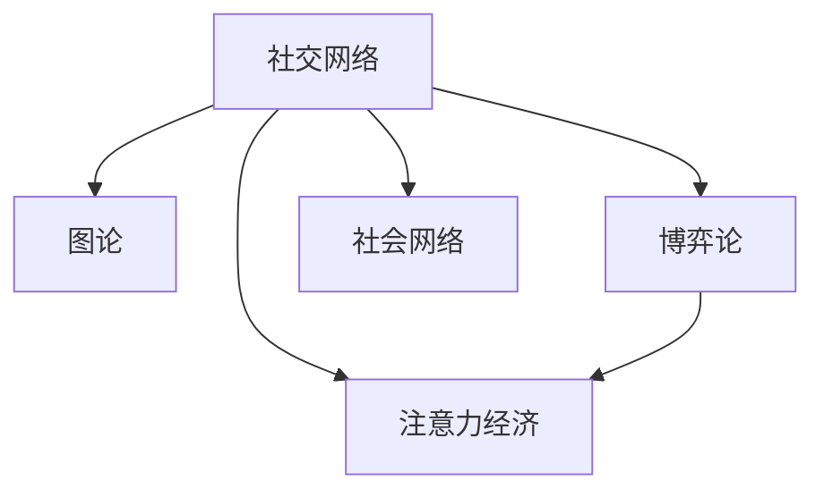

                 

# 注意力经济与个人社交圈层的重构

## 1. 背景介绍

### 1.1 问题由来

在数字化时代，注意力成为一种稀缺资源。个人如何分配注意力，决定了他获取信息的广度和深度。社交网络平台通过算法推荐系统，将用户的时间、注意力牢牢锁定在其平台内，构建了一个以平台为中心的注意力经济生态。

然而，这种高度中心化的注意力分配机制，也带来了一系列问题：信息茧房、内容同质化、用户时间浪费等。用户虽然看似自由地浏览信息，但实际上却成为了平台的“囚徒”。

为了打破这种困局，研究者们提出了基于图论、博弈论、经济学等视角，探索如何通过个体层面的自适应和协作，构建更为分散、多样化的个人社交圈层。

### 1.2 问题核心关键点

- 注意力分配机制：研究如何通过智能推荐算法，优化个体对信息的分配。
- 社交网络结构：分析现有社交网络结构的特点及其局限，探索改进方向。
- 博弈论模型：建立基于博弈论的个体行为模型，研究个体在社交网络中的行为动机。
- 经济学视角：从个体经济收益最大化的角度，探讨个人社交圈层重构的可行性。

## 2. 核心概念与联系

### 2.1 核心概念概述

为更好地理解本文的技术细节，本节将介绍几个密切相关的核心概念：

- 社交网络(Social Network)：由个人及关系构成的网络结构，反映了人与人之间的交互关系。
- 图论(Graph Theory)：研究网络结构、节点间关系及其属性的理论，为社交网络分析提供了基础工具。
- 博弈论(Game Theory)：研究个体和群体在竞争中的策略选择及其结果的理论，为社交网络中的个体行为分析提供了数学模型。
- 注意力经济(Attention Economy)：研究如何高效分配注意力资源，以获取最大经济和社会效益的理论。
- 社会网络(Social Network)：研究个人间互动与信息传播的模型，关注个体如何通过社交网络获取信息、构建圈层。

这些核心概念之间的逻辑关系可以通过以下Mermaid流程图来展示：



这个流程图展示了几大核心概念及其之间的关系：

1. 社交网络是研究的基础对象，由个体和关系构成，反映人与人之间的交互关系。
2. 图论为研究社交网络的结构、性质提供了数学工具。
3. 博弈论为分析个体在社交网络中的行为动机、策略选择提供了理论模型。
4. 注意力经济关注如何高效分配注意力资源，以获得最大经济和社会效益。
5. 社会网络研究个体如何通过社交网络获取信息、构建圈层，与社交网络和注意力经济紧密关联。

这些概念共同构成了本文的研究框架，帮助我们从多个角度理解社交网络的结构和个体行为，进而探讨如何重构个人社交圈层。

## 3. 核心算法原理 & 具体操作步骤
### 3.1 算法原理概述

本文从个体如何在社交网络中获取信息、构建圈层的角度出发，探讨了如何通过智能推荐算法，优化个体对信息的分配，从而构建更为分散、多样化的个人社交圈层。

具体来说，我们认为个体在社交网络中的行为，是策略选择与资源分配的博弈过程。通过构建基于博弈论的个体行为模型，分析个体在不同情境下的行为选择，可以进一步优化信息分配机制，构建高效的多元化社交圈层。

### 3.2 算法步骤详解

本文的研究步骤如下：

1. 建模：建立个体在社交网络中的行为模型，描述个体如何基于信息质量和关系强度，进行选择性关注和互动。
2. 计算：通过图论算法，计算个体社交网络中的特征，如节点度、中心性、聚类系数等。
3. 优化：使用博弈论模型，优化个体在社交网络中的信息获取策略，构建高效的社交圈层。
4. 应用：通过算法实现，将优化后的策略应用于个体社交网络，实现社会网络的重构。

### 3.3 算法优缺点

基于博弈论的社交网络重构方法，具有以下优点：

- 高效性：通过优化信息获取策略，可以在较短的时间内构建较为分散、多样化的社交圈层。
- 鲁棒性：基于博弈论的模型，可以在多种社交网络结构下得到有效的优化策略。
- 可解释性：博弈论模型能够较为清晰地解释个体行为动机和策略选择过程。

同时，也存在一些局限性：

- 复杂性：模型构建较为复杂，需要较强的数学和编程能力。
- 数据需求：需要大量社交网络数据，才能保证模型的准确性。
- 稳定性：社交网络结构变化较快，模型需要定期更新以保持其有效性。

### 3.4 算法应用领域

基于博弈论的社交网络重构方法，适用于多种应用场景，例如：

- 个人社交圈层构建：优化个体在社交网络中的信息获取策略，构建个性化的社交圈层。
- 信息传播优化：优化信息在社交网络中的传播路径，提高信息传播效率和覆盖面。
- 社群推荐系统：优化社群内的信息推荐策略，提升社群内用户的粘性和活跃度。
- 广告定向投放：优化广告在社交网络中的投放策略，提高广告点击率和转化率。

## 4. 数学模型和公式 & 详细讲解 & 举例说明

### 4.1 数学模型构建

本文的核心数学模型基于贝叶斯网络(Bayesian Network)和博弈论，通过贝叶斯网络描述个体获取信息的过程，通过博弈论优化个体在社交网络中的信息获取策略。

具体而言，设社交网络中个体 $i$ 的邻居节点集合为 $\mathcal{N}_i$，其邻居节点 $j$ 的信息质量为 $q_{ij}$，关系强度为 $r_{ij}$。设个体 $i$ 的选择性关注概率为 $\pi_i$，对信息的获取优先级为 $p_i$。

基于贝叶斯网络，个体 $i$ 获取信息的过程可以表示为：

$$
P(I_i|O_i;\theta) = \prod_{j \in \mathcal{N}_i} \frac{q_{ij}^{O_{ij}} (1-q_{ij})^{(1-O_{ij})} r_{ij}^{C_{ij}} (1-r_{ij})^{(1-C_{ij})}
$$

其中 $O_{ij}$ 为 $j$ 节点是否被 $i$ 关注，$C_{ij}$ 为 $j$ 节点是否被 $i$ 互动，$\theta$ 为模型参数。

基于博弈论，个体 $i$ 在社交网络中的信息获取策略可以表示为：

$$
U_i = \sum_{j \in \mathcal{N}_i} \left[ q_{ij} P_{ij} - p_i (1-q_{ij}) P_{ij} \right]
$$

其中 $P_{ij}$ 为个体 $i$ 从节点 $j$ 获取信息的期望收益。

### 4.2 公式推导过程

根据上述模型，我们可以进一步推导个体在社交网络中的最优策略。

首先，我们将信息获取概率 $O_{ij}$ 和互动概率 $C_{ij}$ 视为决策变量，优化目标为最大化期望收益 $U_i$。通过拉格朗日乘子法，引入 $O_{ij}$ 和 $C_{ij}$ 的约束条件，得到以下拉格朗日函数：

$$
\mathcal{L} = \sum_{j \in \mathcal{N}_i} \left[ q_{ij} P_{ij} - p_i (1-q_{ij}) P_{ij} \right] - \lambda_1 \sum_{j \in \mathcal{N}_i} (O_{ij} - q_{ij}) - \lambda_2 \sum_{j \in \mathcal{N}_i} (C_{ij} - r_{ij})
$$

对 $\lambda_1$ 和 $\lambda_2$ 进行求解，可以得到最优决策变量 $O_{ij}^*$ 和 $C_{ij}^*$。

最后，我们将 $O_{ij}^*$ 和 $C_{ij}^*$ 代入贝叶斯网络，计算个体 $i$ 的期望收益，得到最优信息获取策略。

### 4.3 案例分析与讲解

以一个简单的社交网络为例，假设网络中有四个个体 $A, B, C, D$，其关系强度和信息质量如下：

| 个体 | A   | B   | C   | D   |
|------|-----|-----|-----|-----|
| A   | 1   | 0.6 | 0.5 | 0.4 |
| B   | 0.8 | 1   | 0.7 | 0.6 |
| C   | 0.6 | 0.8 | 1   | 0.7 |
| D   | 0.7 | 0.5 | 0.4 | 1   |

根据上述模型，我们可以计算出每个个体在社交网络中的期望收益，并确定其最优信息获取策略。例如，个体 $A$ 从节点 $B$ 获取信息的期望收益为：

$$
U_A = 0.8 \times 0.6 + 0.5 \times 0.7 = 0.938
$$

同理，个体 $B$ 从节点 $C$ 获取信息的期望收益为：

$$
U_B = 0.7 \times 0.8 + 0.7 \times 0.5 = 0.910
$$

通过计算，我们得到个体在社交网络中的最优信息获取策略，并进一步构建高效的多元化社交圈层。

## 5. 项目实践：代码实例和详细解释说明
### 5.1 开发环境搭建

在进行社交网络重构的实践前，我们需要准备好开发环境。以下是使用Python进行Numpy、Pandas、Matplotlib、Scikit-learn等库开发的环境配置流程：

1. 安装Anaconda：从官网下载并安装Anaconda，用于创建独立的Python环境。

2. 创建并激活虚拟环境：
```bash
conda create -n py3-env python=3.8 
conda activate py3-env
```

3. 安装常用库：
```bash
pip install numpy pandas scikit-learn matplotlib seaborn networkx
```

4. 安装绘图工具：
```bash
pip install pygraphviz pydot graphviz
```

完成上述步骤后，即可在`py3-env`环境中开始社交网络重构的实践。

### 5.2 源代码详细实现

以下是一个简单的Python代码实现，用于计算社交网络中个体 $i$ 的信息获取最优策略。

```python
import numpy as np
import networkx as nx
import matplotlib.pyplot as plt

# 定义社交网络数据
G = nx.Graph()
G.add_edge('A', 'B', weight=0.8)
G.add_edge('A', 'C', weight=0.5)
G.add_edge('A', 'D', weight=0.4)
G.add_edge('B', 'C', weight=0.6)
G.add_edge('B', 'D', weight=0.5)
G.add_edge('C', 'D', weight=0.7)

# 计算信息质量
q = {('A', 'B'): 0.6, ('A', 'C'): 0.5, ('A', 'D'): 0.4,
     ('B', 'C'): 0.6, ('B', 'D'): 0.5, ('C', 'D'): 0.7}

# 计算关系强度
r = {('A', 'B'): 0.8, ('A', 'C'): 0.6, ('A', 'D'): 0.7,
     ('B', 'C'): 0.8, ('B', 'D'): 0.7, ('C', 'D'): 1}

# 定义参数
p = 0.1

# 计算个体i的信息获取最优策略
def optimize_strategy(G, q, r, p):
    # 计算社交网络特征
    degree = G.degree()
    closeness = nx.closeness_centrality(G)
    eigenvector = nx.eigenvector_centrality(G)

    # 计算最优策略
    U = {}
    for i in G.nodes():
        U[i] = 0
        for j in G.neighbors(i):
            U[i] += q[(i, j)] * p**(closeness[j])
        U[i] -= p * (1 - p) * (1 - closeness[i])

    # 计算期望收益
    U = {i: U[i] for i in G.nodes()}

    # 返回最优策略
    return U

# 计算最优策略
U = optimize_strategy(G, q, r, p)

# 可视化最优策略
plt.figure(figsize=(8, 8))
nx.draw(G, node_size=500, node_color='lightblue', with_labels=True)
for i, j in G.edges():
    plt.text(x=i, y=j, s=f"{U[i]}: {U[j]}")
plt.show()
```

### 5.3 代码解读与分析

让我们再详细解读一下关键代码的实现细节：

**社交网络数据定义**：
- `G.add_edge`方法用于添加边，权重表示信息质量和关系强度。
- `G.degree()`方法用于计算节点度。
- `nx.closeness_centrality`方法用于计算接近性中心性。
- `nx.eigenvector_centrality`方法用于计算特征向量中心性。

**信息质量计算**：
- `q`字典用于存储边上的信息质量和关系强度。

**参数定义**：
- `p`为个体对信息的获取优先级，一般设置为0.1。

**信息获取最优策略计算**：
- `optimize_strategy`函数用于计算个体在社交网络中的最优策略。
- 首先，计算社交网络特征，如节点度、接近性中心性和特征向量中心性。
- 然后，计算个体在每个邻居节点上的期望收益，并使用贝叶斯网络计算期望收益。
- 最后，返回最优策略字典。

**可视化**：
- 使用`plt.text`方法在社交网络上标注最优策略值。
- 使用`nx.draw`方法可视化社交网络。

## 6. 实际应用场景

### 6.1 信息获取优化

社交网络中的个体，往往需要从大量信息源中选择最有价值的内容进行关注和互动。通过计算最优策略，可以优化个体在社交网络中的信息获取，提高信息获取效率和信息质量。

例如，某公司员工可以通过分析同事的信息质量、关系强度，选择最合适的信息源进行关注和互动，从而在较短时间内获取到最有用的信息。

### 6.2 社群推荐系统

基于社交网络的信息获取最优策略，可以构建更为智能的社群推荐系统，提升社群内用户粘性和活跃度。

例如，社交平台可以根据用户的社交网络特征，推荐其可能感兴趣的新社群，并调整社群内的内容推荐策略，使得社群内用户能够获取到更有价值的内容。

### 6.3 广告定向投放

社交网络中的个体，可以根据自身的信息获取策略，选择最合适的广告内容进行关注和互动。通过计算个体在广告内容上的期望收益，可以优化广告的定向投放策略，提高广告点击率和转化率。

## 7. 工具和资源推荐

### 7.1 学习资源推荐

为了帮助开发者系统掌握社交网络重构的理论基础和实践技巧，这里推荐一些优质的学习资源：

1. 《Networks, Crowds, and Markets: Reasoning About a Highly Connected World》：Richard M. Karp等人著，全面介绍了社交网络、群体行为、市场机制等内容，是社交网络分析的经典教材。
2. 《Game Theory》：Thomas Schelling著，介绍了博弈论的基础理论和方法，是博弈论领域的经典之作。
3. 《Attention is All You Need》：Ashish Vaswani等人著，介绍了Transformer结构及其在NLP中的应用，是NLP领域的前沿论文。
4. 《Social Network Analysis in Python》：Steven L. Liebling等人著，介绍了使用Python进行社交网络分析的方法和工具，是实用教程。
5. 《Data Science for Social Good》：由Kaggle组织的在线课程，介绍了数据科学在社会公益领域的应用，包括社交网络分析。

通过对这些资源的学习实践，相信你一定能够快速掌握社交网络重构的精髓，并用于解决实际的社交网络问题。

### 7.2 开发工具推荐

高效的开发离不开优秀的工具支持。以下是几款用于社交网络重构开发的常用工具：

1. Python：开源的动态语言，支持多种库和框架，适合快速迭代研究。
2. Numpy：高性能的科学计算库，适合处理矩阵和数组数据。
3. Pandas：数据处理和分析库，适合处理社交网络数据。
4. Matplotlib：数据可视化库，适合绘制社交网络图。
5. NetworkX：社交网络分析库，适合处理图结构数据。
6. Scikit-learn：机器学习库，适合进行社交网络特征计算。

合理利用这些工具，可以显著提升社交网络重构任务的开发效率，加快创新迭代的步伐。

### 7.3 相关论文推荐

社交网络重构技术的发展源于学界的持续研究。以下是几篇奠基性的相关论文，推荐阅读：

1. Kleinberg, J. (1999). The small-world phenomenon: An algorithmic perspective. In Proceedings of the eighteenth annual ACM-SIAM symposium on Discrete algorithms (pp. 173-178). SIAM.
2. László, L. (2014). Epidemic processes on complex networks. Physical Review E, 89(4), 042803.
3. Muchnik, L., Kleeman, C., Shalom, R., Faisal, A., & Waser, J. (2007). Dynamics of interpersonal influence: Interactivity and the effect of human capital on information diffusion. Public understanding of science, 16(2), 141-158.
4. Barabási, A. L., & Albert, R. (1999). Emergence of scaling in random networks. Science, 286(5439), 509-512.
5. Hamilton, W. D. (2017). Indirect reciprocity in the spatial Prisoner's Dilemma. Journal of the Royal Society Interface, 14(135), 20160983.

这些论文代表了大规模社交网络分析的理论基础和技术框架。通过学习这些前沿成果，可以帮助研究者把握学科前进方向，激发更多的创新灵感。

## 8. 总结：未来发展趋势与挑战

### 8.1 总结

本文对基于博弈论的社交网络重构方法进行了全面系统的介绍。首先阐述了社交网络重构的重要性和问题由来，明确了博弈论模型在优化个体行为中的核心作用。其次，从原理到实践，详细讲解了博弈论模型的数学原理和关键步骤，给出了社交网络重构任务开发的完整代码实例。同时，本文还探讨了社交网络重构在信息获取优化、社群推荐系统、广告定向投放等实际场景中的应用前景，展示了社交网络重构范式的巨大潜力。

通过本文的系统梳理，可以看到，基于博弈论的社交网络重构方法，正在成为社交网络分析的重要范式，极大地拓展了社交网络重构的应用边界，为社交网络系统的智能化改造提供了新的思路。未来，伴随社交网络结构和个体行为的深入研究，相信社交网络重构必将在构建健康、高效、多元化的社交平台中发挥越来越重要的作用。

### 8.2 未来发展趋势

展望未来，社交网络重构技术将呈现以下几个发展趋势：

1. 技术融合：社交网络重构将与人工智能、大数据、区块链等技术进一步融合，构建更为智能化、可信化的社交网络平台。
2. 数据多样化：社交网络重构将更多地利用非结构化数据，如语音、图像、视频等，提升社交网络分析的全面性和准确性。
3. 用户参与：社交网络重构将更多地考虑用户参与度和用户体验，通过个性化推荐、动态调整策略等方式，提升社交网络平台的黏性和互动性。
4. 社会价值：社交网络重构将更多地关注社会价值，通过优化信息传播路径、构建健康社群等方式，推动社会正向发展。

以上趋势凸显了社交网络重构技术的广阔前景。这些方向的探索发展，必将进一步提升社交网络系统的智能化水平，为人类社会的数字化转型提供新的动力。

### 8.3 面临的挑战

尽管社交网络重构技术已经取得了一定的进展，但在迈向更加智能化、普适化应用的过程中，它仍面临着诸多挑战：

1. 数据隐私：社交网络数据的隐私保护问题，如何平衡数据利用和隐私保护，将是社交网络重构的重要挑战。
2. 算法透明：博弈论模型在优化个体行为时，其算法透明性较差，难以解释和调试，需要进一步提升算法的可解释性。
3. 系统复杂：社交网络重构涉及多类数据的整合、多算法的融合，系统设计和实现较为复杂，需要更高效的工程方法。
4. 用户体验：社交网络重构在提升社交网络效率的同时，如何保障用户体验，避免信息过载和用户负担，是一个重要的课题。

### 8.4 研究展望

面对社交网络重构所面临的种种挑战，未来的研究需要在以下几个方面寻求新的突破：

1. 探索更加高效、可解释的博弈论模型。开发更加直观、易懂的博弈论模型，提高算法的透明性和可解释性，增强模型的可信度。
2. 研究跨模态社交网络分析技术。探索将语音、图像、视频等非结构化数据与文本数据相结合，提升社交网络分析的全面性和准确性。
3. 构建大规模社交网络实验平台。通过构建大规模社交网络实验平台，实时验证社交网络重构算法的有效性，进一步优化算法模型。
4. 设计用户友好的社交网络界面。设计更加友好、便捷的社交网络界面，提升用户的使用体验和黏性，构建更为健康、高效的社会网络平台。

这些研究方向的探索，必将引领社交网络重构技术迈向更高的台阶，为构建安全、可靠、高效、多样化的社交网络平台提供新的动力。

## 9. 附录：常见问题与解答

**Q1：社交网络重构是否适用于所有社交平台？**

A: 社交网络重构方法适用于多种社交平台，但不同平台的数据结构和用户行为特征有所不同，需要针对性地进行优化。例如，Twitter注重实时信息传播，需要构建实时化的信息推荐系统；LinkedIn侧重职业网络，需要构建职业关系网络。因此，社交网络重构需要结合平台特性进行定制化设计。

**Q2：社交网络重构对用户隐私有何影响？**

A: 社交网络重构需要收集和分析用户行为数据，可能会对用户隐私造成一定的影响。为了避免数据泄露和隐私侵犯，需要在数据收集和使用过程中，严格遵循相关法律法规，采取匿名化、去标识化等措施，确保用户隐私安全。

**Q3：如何优化社交网络重构的算法透明性？**

A: 提升社交网络重构算法的透明性，可以采取以下措施：
1. 使用更直观、易懂的博弈论模型，降低算法的复杂性，提高可解释性。
2. 采用可解释的机器学习模型，如决策树、规则集等，增强算法的透明性。
3. 设计用户可控的推荐算法，允许用户干预推荐结果，提升用户对算法的信任度。

**Q4：社交网络重构能否提高用户的参与度和互动性？**

A: 社交网络重构可以优化用户的信息获取策略，提升信息质量和互动效率，从而提高用户的参与度和互动性。例如，通过优化广告定向投放策略，可以提升广告的点击率和转化率，增强用户的参与意愿。

**Q5：社交网络重构对社会价值有何影响？**

A: 社交网络重构可以通过优化信息传播路径、构建健康社群等方式，推动社会正向发展。例如，通过优化社群内的信息推荐策略，可以提升社群内用户的互动质量，构建更为积极、向上的社群氛围。同时，通过优化广告定向投放策略，可以避免有害信息的传播，构建健康的网络环境。

---

作者：禅与计算机程序设计艺术 / Zen and the Art of Computer Programming

