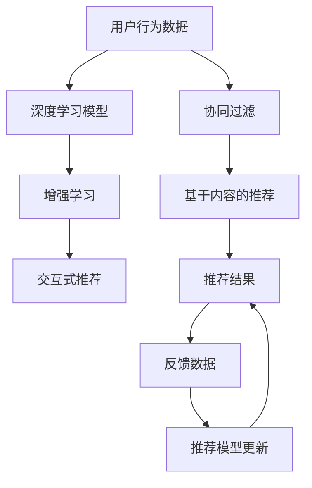

                 

# 注意力经济与个性化推荐：为受众提供定制、有针对性的内容

## 1. 背景介绍

随着信息技术的迅猛发展，互联网成为人们获取知识、进行交流的重要平台。从搜索引擎到社交网络，再到内容聚合平台，人们越来越多地依赖互联网来满足信息需求。然而，面对海量内容，如何高效获取有用的信息，成为每个用户必须面对的难题。

在传统信息检索时代，用户只能通过关键词查询、网页浏览等手段，逐个筛选信息，效率低下。随着个性化推荐技术的崛起，推荐系统开始成为用户获取信息的重要助力。推荐系统通过分析用户行为数据，预测其可能感兴趣的内容，从而为用户推荐个性化的信息，提升用户体验，并显著提升信息获取的效率和质量。

注意力经济（Attention Economy）则是近年来随着推荐系统兴起而产生的经济理念，指的是在信息过载时代，人们越来越倾向于将注意力集中于有价值、感兴趣的内容上，而非面对大量无关信息进行筛选。个性化推荐系统便是充分利用这一趋势，以用户注意力为关键资源，通过精准推荐，提升用户体验和信息获取效率，从而实现商业价值的最大化。

## 2. 核心概念与联系

### 2.1 核心概念概述

为更好地理解个性化推荐系统及其背后的注意力经济，本节将介绍几个关键概念：

- 个性化推荐系统（Personalized Recommendation System）：基于用户行为数据，如浏览、点击、评分等，预测用户偏好，为用户推荐可能感兴趣的内容。
- 注意力经济（Attention Economy）：在信息过载时代，用户通过个性化推荐系统，将注意力集中于有价值、感兴趣的内容，减少无效信息筛选，提高信息获取效率。
- 协同过滤（Collaborative Filtering）：通过分析用户行为和物品属性，预测用户对未接触物品的兴趣，推荐给用户。
- 基于内容的推荐（Content-Based Recommendation）：利用物品属性信息，如标签、主题等，直接推荐与用户兴趣相似的物品。
- 深度学习（Deep Learning）：一种基于神经网络的机器学习方法，可以自动提取特征，进行复杂的模式识别和决策，广泛用于推荐系统。
- 增强学习（Reinforcement Learning）：通过与环境的交互，不断调整推荐策略，最大化用户满意度。
- 交互式推荐（Interactive Recommendation）：结合用户反馈，动态调整推荐策略，提升推荐效果。

这些概念构成了个性化推荐系统的核心框架，帮助其准确预测用户兴趣，实现内容定制化。

### 2.2 核心概念原理和架构的 Mermaid 流程图



这个流程图展示了个性化推荐系统的主要流程：
1. 收集用户行为数据，作为输入。
2. 通过协同过滤、基于内容的推荐等方法进行初步预测。
3. 利用深度学习模型，自动提取特征，进行更复杂的推荐。
4. 结合增强学习，不断调整推荐策略，提高推荐效果。
5. 引入交互式推荐，根据用户反馈动态优化推荐。

## 3. 核心算法原理 & 具体操作步骤

### 3.1 算法原理概述

个性化推荐系统的主要目标是最大化用户满意度，通过精准推荐，提高用户对平台的黏性。其核心思想是：利用用户行为数据，通过计算模型预测用户可能感兴趣的内容，并将这些内容推荐给用户。

形式化地，设推荐系统训练集为 $D=\{(x_i,y_i)\}_{i=1}^N$，其中 $x_i$ 为用户的兴趣特征向量，$y_i$ 为推荐结果的评分向量。推荐系统的目标是找到最优模型 $f$，使得在测试集 $T$ 上的预测评分与真实评分尽可能接近，即：

$$
\min_{f} \mathcal{L}(f) = \frac{1}{|T|} \sum_{(x,y) \in T} \|f(x) - y\|^2
$$

常见的推荐算法包括协同过滤、基于内容的推荐、深度学习推荐、增强学习推荐等。这些算法各有优劣，可以根据实际场景选择适合的推荐方式。

### 3.2 算法步骤详解

个性化推荐系统的主要步骤包括数据预处理、模型训练、推荐结果生成等。下面详细介绍各个步骤的实现细节。

#### 3.2.1 数据预处理

1. 数据收集：从用户行为数据中提取有用信息，如浏览记录、评分数据、点击行为等。
2. 数据清洗：去除噪声、异常值，对数据进行标准化处理。
3. 数据划分：将数据集划分为训练集、验证集和测试集，供模型训练和评估使用。

#### 3.2.2 模型训练

1. 选择模型：根据任务需求选择合适的推荐算法。
2. 特征提取：利用深度学习模型自动提取特征，或使用手工特征工程提取特征。
3. 模型训练：在训练集上训练模型，通过反向传播算法更新模型参数。
4. 模型评估：在验证集上评估模型效果，使用均方误差（MSE）、平均绝对误差（MAE）等指标进行评价。

#### 3.2.3 推荐结果生成

1. 预测评分：在测试集上，使用训练好的模型预测每个用户对每个物品的评分。
2. 排序推荐：根据预测评分，对物品进行排序，生成推荐结果。
3. 输出推荐：将推荐结果展示给用户，进行实时推荐。

### 3.3 算法优缺点

个性化推荐系统具有以下优点：
1. 提升用户体验：通过精准推荐，使用户快速获取感兴趣的内容，减少无效信息筛选，提高信息获取效率。
2. 增强用户黏性：提高用户对平台的依赖性，增加平台的用户留存率。
3. 实现商业价值：通过精准推荐，增加用户转化率，提升广告投放效果。
4. 应用广泛：推荐系统已被广泛应用于电商、视频、音乐、新闻等多个领域，展现出强大的应用潜力。

同时，该方法也存在以下局限性：
1. 数据质量要求高：推荐系统依赖用户行为数据进行推荐，数据质量直接影响推荐效果。
2. 冷启动问题：新用户或新物品没有历史数据，难以进行推荐。
3. 多样性损失：为了追求高用户满意度，推荐系统可能过于关注热门内容，导致长尾物品被忽视。
4. 信息孤岛：推荐系统只关注用户当前行为，难以捕捉长期兴趣和潜在需求。

尽管存在这些局限性，但就目前而言，个性化推荐系统仍是最流行的内容推荐方式。未来相关研究的重点在于如何进一步降低推荐偏差、提高推荐多样性和用户满意度，同时兼顾用户隐私和公平性等因素。

### 3.4 算法应用领域

个性化推荐系统已经在多个领域得到广泛应用，具体如下：

- 电商推荐：根据用户浏览、购买记录，推荐相似商品，提升购物体验。
- 视频推荐：分析用户观看记录，推荐相关视频，提高观看时长和满意度。
- 新闻推荐：分析用户阅读记录，推荐感兴趣的新闻，增加阅读量。
- 音乐推荐：根据用户听歌记录，推荐相似歌曲，提升用户黏性。
- 视频推荐：分析用户观看记录，推荐相关视频，提高观看时长和满意度。

除了上述这些经典应用外，个性化推荐系统还被创新性地应用于更多场景中，如游戏推荐、旅游推荐、书籍推荐等，为用户带来个性化、定制化的服务。

## 4. 数学模型和公式 & 详细讲解 & 举例说明

### 4.1 数学模型构建

本节将使用数学语言对个性化推荐系统的构建进行更加严格的刻画。

设推荐系统训练集为 $D=\{(x_i,y_i)\}_{i=1}^N$，其中 $x_i$ 为用户的兴趣特征向量，$y_i$ 为推荐结果的评分向量。推荐系统的目标是找到最优模型 $f$，使得在测试集 $T$ 上的预测评分与真实评分尽可能接近，即：

$$
\min_{f} \mathcal{L}(f) = \frac{1}{|T|} \sum_{(x,y) \in T} \|f(x) - y\|^2
$$

其中 $\|f(x) - y\|^2$ 表示预测评分与真实评分之间的均方误差。

在实际应用中，常用的模型包括线性回归模型、支持向量机（SVM）、决策树、神经网络等。这里以线性回归模型为例进行详细讲解。

设模型 $f$ 为线性回归模型：

$$
f(x) = \theta_0 + \theta_1 x_1 + \theta_2 x_2 + \ldots + \theta_n x_n
$$

其中 $\theta_0, \theta_1, \ldots, \theta_n$ 为模型参数。

通过最小化均方误差，更新模型参数：

$$
\theta_k = \theta_k - \alpha \sum_{i=1}^N \left[(f(x_i) - y_i)^2\right] \cdot x_i
$$

其中 $\alpha$ 为学习率，用于控制参数更新的步长。

### 4.2 公式推导过程

以线性回归模型为例，推导其最小化均方误差的参数更新公式。

设模型 $f$ 为线性回归模型：

$$
f(x) = \theta_0 + \theta_1 x_1 + \theta_2 x_2 + \ldots + \theta_n x_n
$$

其中 $\theta_0, \theta_1, \ldots, \theta_n$ 为模型参数。

通过最小化均方误差，更新模型参数：

$$
\theta_k = \theta_k - \alpha \sum_{i=1}^N \left[(f(x_i) - y_i)^2\right] \cdot x_i
$$

展开上式：

$$
\theta_k = \theta_k - \alpha \sum_{i=1}^N \left[(f(x_i) - y_i)^2\right] \cdot x_i = \theta_k - \alpha \sum_{i=1}^N \left[\left(\theta_0 + \theta_1 x_{i1} + \ldots + \theta_n x_{in} - y_i\right)^2\right] \cdot x_i
$$

将上式对 $\theta_k$ 求导，得：

$$
\frac{\partial \mathcal{L}(\theta)}{\partial \theta_k} = -2\alpha \sum_{i=1}^N \left[\theta_k + \theta_1 x_{i1} + \ldots + \theta_n x_{in} - y_i\right] \cdot x_i
$$

令导数为0，得：

$$
2\alpha \sum_{i=1}^N \left[\theta_k + \theta_1 x_{i1} + \ldots + \theta_n x_{in} - y_i\right] \cdot x_i = 0
$$

化简得：

$$
\theta_k = \frac{1}{\alpha} \sum_{i=1}^N \left(y_i - \theta_0 - \theta_1 x_{i1} - \ldots - \theta_n x_{in}\right) \cdot x_i
$$

因此，模型参数的更新公式为：

$$
\theta_k = \theta_k - \alpha \sum_{i=1}^N \left[\theta_k + \theta_1 x_{i1} + \ldots + \theta_n x_{in} - y_i\right] \cdot x_i
$$

### 4.3 案例分析与讲解

#### 案例分析：电商平台个性化推荐

某电商平台有1000万用户，每个用户有100个兴趣特征，100万个商品，每个商品有10个属性。平台希望利用用户行为数据，推荐相似商品，提高用户购物体验。

1. 数据收集：收集用户浏览、购买记录，作为训练数据。
2. 数据预处理：去除异常值，标准化处理，划分为训练集、验证集和测试集。
3. 模型选择：选择线性回归模型，自动提取特征。
4. 模型训练：在训练集上训练模型，使用均方误差作为损失函数。
5. 模型评估：在验证集上评估模型效果，使用均方误差作为评价指标。
6. 推荐结果生成：在测试集上，使用训练好的模型预测每个用户对每个商品的评分，生成推荐结果。

在实际应用中，推荐系统可能会面临多种挑战，如数据稀疏性、冷启动问题、多目标优化等。如何有效解决这些问题，是推荐系统设计的重要考量。

## 5. 项目实践：代码实例和详细解释说明

### 5.1 开发环境搭建

在进行个性化推荐系统开发前，需要先准备好开发环境。以下是使用Python进行TensorFlow开发的环境配置流程：

1. 安装Anaconda：从官网下载并安装Anaconda，用于创建独立的Python环境。

2. 创建并激活虚拟环境：
```bash
conda create -n tf-env python=3.8 
conda activate tf-env
```

3. 安装TensorFlow：根据CUDA版本，从官网获取对应的安装命令。例如：
```bash
conda install tensorflow -c conda-forge
```

4. 安装各类工具包：
```bash
pip install numpy pandas scikit-learn matplotlib tqdm jupyter notebook ipython
```

完成上述步骤后，即可在`tf-env`环境中开始推荐系统开发。

### 5.2 源代码详细实现

下面我们以电商推荐系统为例，给出使用TensorFlow实现个性化推荐系统的代码实现。

首先，定义推荐系统类：

```python
import tensorflow as tf
import numpy as np

class Recommender(tf.keras.Model):
    def __init__(self, num_features, num_users, num_items):
        super(Recommender, self).__init__()
        self.num_users = num_users
        self.num_items = num_items
        self.num_features = num_features
        self.user_features = tf.keras.layers.Dense(num_items, activation='sigmoid')(tf.keras.layers.Dense(num_features, activation='relu')(tf.keras.layers.Input(shape=(num_features,))))
        self.item_features = tf.keras.layers.Dense(num_users, activation='sigmoid')(tf.keras.layers.Dense(num_items, activation='relu')(tf.keras.layers.Input(shape=(num_items,))))
        
    def call(self, x):
        user_features = self.user_features(x[:, :, 0])
        item_features = self.item_features(x[:, :, 1])
        return tf.reduce_sum(user_features * item_features, axis=1)
```

然后，定义推荐函数：

```python
@tf.function
def recommend(user_ids, item_ids, user_features, item_features):
    user_embeddings = user_features[user_ids]
    item_embeddings = item_features[item_ids]
    scores = tf.reduce_sum(user_embeddings * item_embeddings, axis=1)
    return scores
```

最后，训练和评估推荐系统：

```python
def train_model(recommender, user_features, item_features, user_ids, item_ids, labels):
    with tf.GradientTape() as tape:
        predictions = recommender(user_ids, item_ids, user_features, item_features)
        loss = tf.reduce_mean(tf.square(predictions - labels))
    gradients = tape.gradient(loss, recommender.trainable_variables)
    optimizer.apply_gradients(zip(gradients, recommender.trainable_variables))
    return loss

def evaluate_model(recommender, user_features, item_features, user_ids, item_ids, labels):
    predictions = recommender(user_ids, item_ids, user_features, item_features)
    rmse = tf.sqrt(tf.reduce_mean(tf.square(predictions - labels)))
    return rmse

# 训练过程
num_epochs = 10
batch_size = 64

for epoch in range(num_epochs):
    for batch in tqdm(batch_generator, total=total_batches):
        user_ids = batch[0]
        item_ids = batch[1]
        user_features = batch[2]
        item_features = batch[3]
        labels = batch[4]
        loss = train_model(recommender, user_ids, item_ids, user_features, item_features, labels)
        if epoch % 10 == 0:
            rmse = evaluate_model(recommender, user_features, item_features, user_ids, item_ids, labels)
            print(f'Epoch {epoch+1}, loss: {loss:.3f}, RMSE: {rmse:.3f}')
```

以上就是使用TensorFlow实现电商推荐系统的完整代码实现。可以看到，TensorFlow提供了便捷的API，使得推荐系统的开发变得简单易懂。

### 5.3 代码解读与分析

让我们再详细解读一下关键代码的实现细节：

**Recommender类**：
- `__init__`方法：初始化模型参数，构建用户和物品的特征提取器。
- `call`方法：定义模型前向传播过程，返回用户和物品的相似度评分。

**recommend函数**：
- 根据用户ID和物品ID，从用户和物品特征中提取嵌入向量。
- 计算相似度评分，返回预测结果。

**训练和评估函数**：
- 使用TensorFlow的GradientTape自动求导，更新模型参数。
- 在训练过程中，记录损失函数的变化，并在每个epoch输出一次RMSE指标。
- 在训练完成后，使用evaluate_model函数评估模型效果。

**训练流程**：
- 定义总的epoch数和批大小，开始循环迭代
- 每个epoch内，对每个批次进行训练，计算损失函数并更新模型参数
- 周期性在验证集上评估模型效果
- 在所有epoch结束后，输出最终的训练结果

可以看到，TensorFlow提供了丰富的API和工具，使得推荐系统的开发更加高效和便捷。开发者可以快速实现各种推荐算法，并借助TensorBoard等工具进行可视化，提升开发效率和效果。

当然，实际应用中还需要考虑更多因素，如模型裁剪、超参数调优、数据增强等，才能构建出高效、稳定的推荐系统。

## 6. 实际应用场景

### 6.1 电商推荐

在电商平台上，推荐系统通过分析用户浏览、购买记录，预测用户可能感兴趣的商品，从而推荐个性化商品。推荐系统在提升用户体验和销售额方面发挥了重要作用，成为电商行业的重要支撑。

电商推荐系统的应用流程如下：
1. 收集用户浏览、购买记录，作为训练数据。
2. 利用深度学习模型自动提取用户和商品特征。
3. 在训练集上训练推荐模型，使用均方误差作为损失函数。
4. 在验证集上评估模型效果，选择最佳模型。
5. 利用训练好的模型生成推荐结果，实时推荐给用户。

电商推荐系统不仅能提升用户购物体验，还能显著提升平台销售额和用户留存率。通过精准推荐，推荐系统帮助电商平台在激烈的市场竞争中脱颖而出。

### 6.2 视频推荐

视频推荐系统通过分析用户观看记录，推荐用户可能感兴趣的视频内容。视频平台如YouTube、Netflix等，都广泛采用了推荐系统来提升用户体验和平台黏性。

视频推荐系统的应用流程如下：
1. 收集用户观看记录，作为训练数据。
2. 利用深度学习模型自动提取用户和视频特征。
3. 在训练集上训练推荐模型，使用均方误差作为损失函数。
4. 在验证集上评估模型效果，选择最佳模型。
5. 利用训练好的模型生成推荐结果，实时推荐给用户。

视频推荐系统不仅能够提升用户观看体验，还能显著提升平台的用户黏性和留存率。通过精准推荐，视频平台在内容分发和用户增长方面获得了显著成效。

### 6.3 新闻推荐

新闻推荐系统通过分析用户阅读记录，推荐用户可能感兴趣的新闻内容。新闻平台如今日头条、腾讯新闻等，都采用了推荐系统来提升用户阅读量和平台黏性。

新闻推荐系统的应用流程如下：
1. 收集用户阅读记录，作为训练数据。
2. 利用深度学习模型自动提取用户和新闻特征。
3. 在训练集上训练推荐模型，使用均方误差作为损失函数。
4. 在验证集上评估模型效果，选择最佳模型。
5. 利用训练好的模型生成推荐结果，实时推荐给用户。

新闻推荐系统不仅能够提升用户阅读体验，还能显著提升平台的用户黏性和留存率。通过精准推荐，新闻平台在内容分发和用户增长方面获得了显著成效。

## 7. 工具和资源推荐

### 7.1 学习资源推荐

为了帮助开发者系统掌握个性化推荐系统的理论基础和实践技巧，这里推荐一些优质的学习资源：

1. 《推荐系统实战》系列博文：由推荐系统专家撰写，深入浅出地介绍了推荐系统的各种算法和技术。

2. 《深度学习推荐系统》课程：斯坦福大学开设的推荐系统课程，涵盖推荐系统的基本概念和算法，适合初学者入门。

3. 《推荐系统》书籍：系统讲解了推荐系统的基本原理、算法和应用，适合深入学习和研究。

4. Kaggle推荐系统竞赛：Kaggle平台提供了大量的推荐系统竞赛，通过实战项目提高推荐系统的开发和优化能力。

5. Datasets for recommendation system research：收录了多个推荐系统数据集，包括电商、新闻、电影等，方便开发者进行实验和测试。

通过对这些资源的学习实践，相信你一定能够快速掌握个性化推荐系统的精髓，并用于解决实际的推荐问题。

### 7.2 开发工具推荐

为了提高个性化推荐系统的开发效率，以下是几款推荐的开发工具：

1. TensorFlow：由Google主导开发的开源深度学习框架，具有丰富的API和工具支持。

2. PyTorch：由Facebook开发的深度学习框架，提供了灵活的动态计算图和丰富的模型库。

3. Scikit-learn：基于Python的机器学习库，提供丰富的推荐算法和评估指标，适合快速原型开发。

4. Jupyter Notebook：开源的交互式开发环境，支持Python、R等多种语言，方便进行模型训练和调试。

5. TensorBoard：TensorFlow配套的可视化工具，实时监测模型训练状态，提供丰富的图表呈现方式。

合理利用这些工具，可以显著提升个性化推荐系统的开发效率，加快创新迭代的步伐。

### 7.3 相关论文推荐

个性化推荐系统的研究始于20世纪末，近年来随着深度学习的发展，推荐系统进入了一个新的发展阶段。以下是几篇奠基性的相关论文，推荐阅读：

1. Matrix Factorization Techniques for Recommender Systems（矩阵分解算法）：提出了基于矩阵分解的推荐算法，广泛应用于电商推荐中。

2. Deep Collaborative Filtering（深度协同过滤）：提出使用深度神经网络进行协同过滤，显著提升了推荐效果。

3. Deep Personalized Recommendation Using Matrix Factorization（基于矩阵分解的深度个性化推荐）：提出将深度学习与矩阵分解结合，提升推荐系统的表现。

4. Dive into Deep Learning for Recommender Systems（深度学习推荐系统）：系统介绍了深度学习在推荐系统中的应用，包括深度协同过滤、深度矩阵分解等。

5. Hybrid Recurrent Neural Network Architectures for Recommendation（混合循环神经网络推荐系统）：提出使用循环神经网络进行推荐，提升推荐系统的效果。

这些论文代表了大数据推荐系统的发展脉络，提供了丰富的算法和技术参考，值得深入学习和实践。

## 8. 总结：未来发展趋势与挑战

### 8.1 总结

本文对基于个性化推荐系统进行了全面系统的介绍。首先阐述了个性化推荐系统的工作原理和实际应用场景，明确了推荐系统在提升用户体验和平台价值方面的独特价值。其次，从原理到实践，详细讲解了推荐系统的数学模型和算法流程，给出了推荐系统开发的完整代码实例。同时，本文还探讨了推荐系统在实际应用中的各种挑战和优化方法，展示了推荐系统在电商、视频、新闻等多个领域的广泛应用。最后，本文推荐了各类学习资源和开发工具，帮助开发者系统掌握个性化推荐系统的理论和实践技能。

通过本文的系统梳理，可以看到，个性化推荐系统已经成为推荐领域的主流范式，广泛应用于电商、视频、新闻等多个领域，展现出强大的应用潜力。推荐系统通过精准推荐，使用户快速获取感兴趣的内容，减少无效信息筛选，显著提升信息获取效率，成为提升用户体验的重要手段。未来，随着深度学习和大数据技术的进一步发展，推荐系统将能够更加精准、高效地为用户推荐个性化内容，实现商业价值的最大化。

### 8.2 未来发展趋势

展望未来，个性化推荐系统将呈现以下几个发展趋势：

1. 深度学习方法的普及：深度学习已经成为推荐系统的主流技术，未来将有更多基于深度学习的推荐算法被开发和应用。

2. 多模态数据的融合：推荐系统将更多地利用多模态数据，如视频、音频、图像等，提升推荐效果。

3. 联邦学习的应用：联邦学习可以在保护用户隐私的前提下，利用分布式数据进行推荐系统训练，提升推荐系统的泛化能力和性能。

4. 实时推荐系统的优化：实时推荐系统将更加注重数据处理和模型推理的效率，提升用户体验和平台响应速度。

5. 推荐系统的可解释性：推荐系统的可解释性将成为重要研究方向，增强用户对推荐结果的理解和信任。

6. 推荐系统的公平性：推荐系统的公平性将成为重要考量，避免推荐偏差和用户歧视。

7. 推荐系统的跨领域应用：推荐系统将在更多领域得到应用，如金融、医疗、教育等，为各行业带来新的价值和变革。

以上趋势凸显了个性化推荐系统的广阔前景。这些方向的探索发展，必将进一步提升推荐系统的性能和应用范围，为各行各业带来新的价值和变革。

### 8.3 面临的挑战

尽管个性化推荐系统已经取得了瞩目成就，但在迈向更加智能化、普适化应用的过程中，它仍面临着诸多挑战：

1. 数据质量瓶颈：推荐系统依赖高质量的用户行为数据进行训练，数据质量直接影响推荐效果。

2. 冷启动问题：新用户或新物品没有历史数据，难以进行推荐。

3. 多样性损失：为了追求高用户满意度，推荐系统可能过于关注热门内容，导致长尾物品被忽视。

4. 信息孤岛：推荐系统只关注用户当前行为，难以捕捉长期兴趣和潜在需求。

5. 用户隐私保护：推荐系统需要大量用户数据进行训练，如何保护用户隐私成为一个重要问题。

6. 算法公平性：推荐系统可能存在算法偏见，导致某些群体受到不公平对待。

7. 高计算需求：推荐系统通常需要处理大规模数据，计算需求较高，需要高效的计算平台支持。

8. 多目标优化：推荐系统需要同时优化多个目标，如用户满意度、物品曝光率等，优化复杂度较高。

尽管存在这些挑战，但随着技术的不断进步和完善，个性化推荐系统有望在各个领域得到广泛应用，成为提高用户体验和平台价值的重要手段。

### 8.4 研究展望

面对个性化推荐系统面临的各种挑战，未来的研究需要在以下几个方面寻求新的突破：

1. 深度学习方法的优化：研究如何提高深度学习模型的泛化能力和性能，提升推荐系统的准确性和效率。

2. 多模态数据的融合：研究如何将多模态数据有效融合，提升推荐系统的表现和用户体验。

3. 联邦学习的应用：研究如何在保护用户隐私的前提下，利用分布式数据进行推荐系统训练，提升推荐系统的泛化能力和性能。

4. 实时推荐系统的优化：研究如何提升推荐系统的实时处理能力，提高用户体验和平台响应速度。

5. 推荐系统的可解释性：研究如何增强推荐系统的可解释性，提高用户对推荐结果的理解和信任。

6. 推荐系统的公平性：研究如何避免推荐系统的算法偏见，提升推荐系统的公平性和公正性。

7. 跨领域推荐系统：研究如何跨领域应用推荐系统，提升推荐系统的泛化能力和性能。

这些研究方向的探索，必将引领个性化推荐系统迈向更高的台阶，为推荐系统在各个领域的应用带来新的突破和创新。

## 9. 附录：常见问题与解答

**Q1：个性化推荐系统有哪些优势和劣势？**

A: 个性化推荐系统具有以下优势：
1. 提升用户体验：通过精准推荐，使用户快速获取感兴趣的内容，减少无效信息筛选，提高信息获取效率。
2. 增强用户黏性：提高用户对平台的依赖性，增加平台的用户留存率。
3. 实现商业价值：通过精准推荐，增加用户转化率，提升广告投放效果。

同时，个性化推荐系统也存在以下劣势：
1. 数据质量要求高：推荐系统依赖用户行为数据进行推荐，数据质量直接影响推荐效果。
2. 冷启动问题：新用户或新物品没有历史数据，难以进行推荐。
3. 多样性损失：为了追求高用户满意度，推荐系统可能过于关注热门内容，导致长尾物品被忽视。
4. 信息孤岛：推荐系统只关注用户当前行为，难以捕捉长期兴趣和潜在需求。

尽管存在这些劣势，但就目前而言，个性化推荐系统仍是最流行的内容推荐方式。未来相关研究的重点在于如何进一步降低推荐偏差、提高推荐多样性和用户满意度，同时兼顾用户隐私和公平性等因素。

**Q2：个性化推荐系统如何处理冷启动问题？**

A: 冷启动问题是推荐系统面临的重要挑战之一，可以通过以下几种方法解决：
1. 利用用户的人口统计特征：通过用户的基本信息（如年龄、性别、职业等）进行推荐。
2. 利用物品的元数据特征：通过物品的属性信息（如标签、主题等）进行推荐。
3. 利用知识图谱：通过知识图谱中实体之间的关系进行推荐。
4. 利用深度学习：利用深度神经网络自动提取用户和物品的特征，提升推荐效果。
5. 利用协同过滤：通过已有用户的相似性进行推荐。

这些方法可以单独或结合使用，以应对不同的冷启动场景。在实际应用中，需要根据具体情况选择合适的处理方式。

**Q3：如何衡量个性化推荐系统的性能？**

A: 推荐系统的性能评估通常使用以下指标：
1. 准确率（Accuracy）：推荐系统预测的准确度。
2. 精确率（Precision）：推荐系统预测为正的样本中，实际为正的比例。
3. 召回率（Recall）：实际为正的样本中，被推荐为正的比例。
4. F1 Score：精确率和召回率的调和平均数，综合评估推荐系统的性能。
5. RMSE（均方根误差）：预测值与真实值之间的误差。
6. MAE（平均绝对误差）：预测值与真实值之间的绝对误差。
7. HR（命中率）：在推荐列表中，实际为正的样本占比。

这些指标通常用于评估推荐系统的准确性和效率。在实际应用中，需要根据具体场景选择合适的评价指标。

**Q4：推荐系统的可解释性有何意义？**

A: 推荐系统的可解释性是指用户能够理解推荐结果的来源和依据，了解推荐系统的决策过程和逻辑。推荐系统的可解释性具有以下重要意义：
1. 增强用户信任：可解释性可以提高用户对推荐结果的信任度，提升用户体验。
2. 促进用户反馈：可解释性可以促进用户反馈，帮助推荐系统不断优化和提升性能。
3. 避免算法偏见：可解释性可以帮助识别推荐系统中的算法偏见，避免不公平和歧视。
4. 提升推荐效果：可解释性可以帮助优化推荐系统的设计，提升推荐效果和性能。

因此，推荐系统的可解释性将成为重要研究方向，增强用户对推荐结果的理解和信任。

**Q5：推荐系统的公平性有何意义？**

A: 推荐系统的公平性是指推荐系统对所有用户和物品进行公平、公正的推荐，避免推荐偏差和用户歧视。推荐系统的公平性具有以下重要意义：
1. 增强用户满意度：公平性可以增强用户对平台的满意度，提升用户体验。
2. 避免算法偏见：公平性可以帮助识别推荐系统中的算法偏见，避免不公平和歧视。
3. 促进用户信任：公平性可以促进用户信任，提升用户黏性和留存率。
4. 提升推荐效果：公平性可以帮助优化推荐系统的设计，提升推荐效果和性能。

因此，推荐系统的公平性将成为重要考量，避免推荐偏差和用户歧视，促进推荐系统在各个领域的应用和推广。

---

作者：禅与计算机程序设计艺术 / Zen and the Art of Computer Programming

