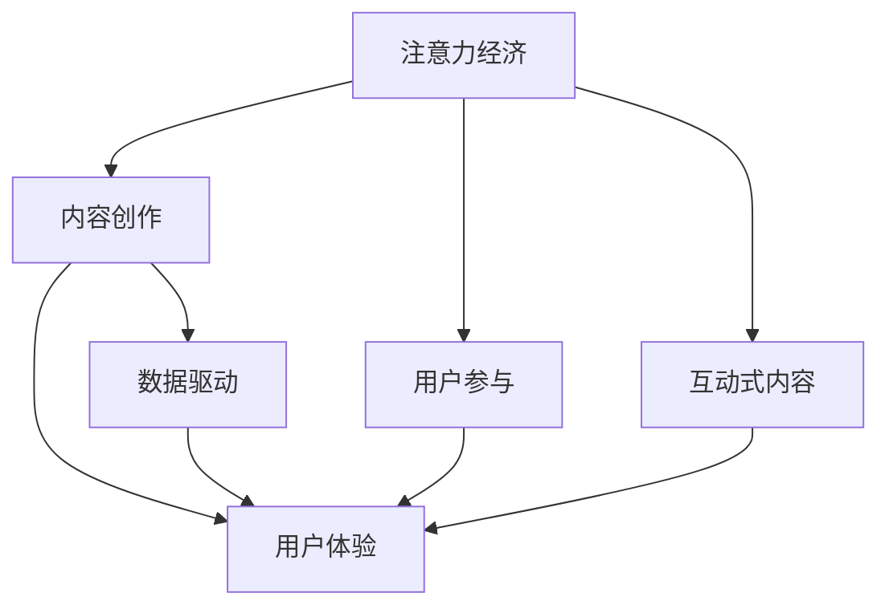

                 

# 注意力经济与内容创作最佳实践：吸引并留住受众的参与度

## 1. 背景介绍

### 1.1 问题由来
在信息爆炸的时代，内容创作和内容消费呈现爆炸式增长。海量的信息源提供了丰富多样的内容选择，但如何吸引并留住受众的注意力，却成为了创作者和平台运营商的一大难题。传统的线性内容消费模式正在逐渐被以用户为中心的参与式、互动式模式所取代。

### 1.2 问题核心关键点
注意力经济的崛起，使得内容创作和运营策略需要从以内容生产为中心转向以用户参与和互动为中心。如何通过内容创作，吸引并保持受众的持续参与，成为当下内容创作者和平台运营商的核心关注点。

### 1.3 问题研究意义
本研究旨在探索注意力经济背景下，如何优化内容创作和运营策略，以提升用户参与度和满意度。通过深入分析用户行为和心理，提炼出高效的内容创作和互动方法，为内容创作者和平台提供实战性的指导。

## 2. 核心概念与联系

### 2.1 核心概念概述

为更好地理解注意力经济下内容创作的优化策略，本节将介绍几个关键概念：

- 注意力经济(Attention Economy)：指在信息过载时代，用户注意力成为稀缺资源，内容创作者和平台运营商需要围绕用户注意力设计运营策略。
- 内容创作(Content Creation)：指通过文字、图像、视频等形式，创作有价值、有吸引力的内容作品。
- 用户参与(User Engagement)：指用户通过点赞、评论、分享等行为，对内容的互动和反馈，反映其对内容的满意度与认可度。
- 互动式内容(Interactive Content)：指通过互动元素，如问答、投票、直播等，增强用户参与感，提升内容消费体验。
- 用户体验(User Experience, UX)：指内容呈现方式和交互设计，对用户感知和使用体验的影响，是衡量内容创作效果的重要指标。
- 数据驱动(Data-Driven)：指利用用户行为数据，科学分析用户需求和偏好，指导内容创作与运营策略优化。

这些核心概念之间的逻辑关系可以通过以下Mermaid流程图来展示：



这个流程图展示了注意力经济与内容创作的关联性及其对用户参与和互动的影响。内容创作者和平台运营商需要在数据驱动的指导下，设计用户体验良好的互动式内容，以吸引并留住用户。

## 3. 核心算法原理 & 具体操作步骤
### 3.1 算法原理概述

本节将基于注意力经济的理论，提出内容创作和用户参与优化的算法原理。

在注意力经济中，用户注意力被视为稀缺资源，争夺用户注意力的竞争激烈。内容创作者需要设计具有高度吸引力和互动性的内容，以提升用户参与度和满意度。具体而言，需要从以下几个方面进行优化：

- **内容质量**：创作高质量、有价值的内容，以吸引用户注意力。
- **互动性设计**：通过互动元素增强用户参与感，提升内容消费体验。
- **个性化推荐**：利用用户行为数据，提供个性化内容推荐，提升用户粘性。
- **用户反馈分析**：通过用户反馈数据，不断优化内容创作和互动策略。

### 3.2 算法步骤详解

基于注意力经济的内容创作优化步骤如下：

**Step 1: 数据采集**
- 收集用户行为数据，包括浏览时长、互动次数、评分等指标。
- 采集用户社交媒体行为数据，如点赞、评论、分享等。

**Step 2: 数据处理**
- 数据清洗和预处理，去除噪声和异常值。
- 特征提取和归一化，提取关键行为特征。

**Step 3: 模型训练**
- 建立用户行为模型，如协同过滤、推荐系统等，进行个性化推荐。
- 使用深度学习模型，如神经网络、卷积神经网络等，分析用户互动行为数据。

**Step 4: 内容创作与设计**
- 根据用户行为数据，识别热门主题和内容趋势。
- 设计互动式内容，如问答、投票、直播等，增加用户参与感。

**Step 5: 用户反馈与优化**
- 通过用户评论、评分等反馈，优化内容创作和互动设计。
- 调整推荐算法和内容策略，提升用户满意度。

**Step 6: 效果评估**
- 通过用户行为数据，评估内容创作和运营策略的效果。
- 利用A/B测试等方法，比较不同策略的效果。

### 3.3 算法优缺点

基于注意力经济的内容创作优化算法具有以下优点：

- 数据驱动：通过分析用户行为数据，科学指导内容创作和运营策略，提升用户参与度。
- 个性化推荐：利用个性化推荐技术，提升用户粘性和满意度。
- 互动性设计：通过互动元素增强用户参与感，提升内容消费体验。

同时，该算法也存在一定的局限性：

- 数据隐私：用户行为数据的采集和使用，需要遵守隐私保护法规，如GDPR等。
- 数据质量：数据质量和完整性对算法效果有重要影响，数据不充分可能导致分析偏差。
- 计算资源：模型训练和推理需要大量计算资源，对硬件要求较高。
- 动态变化：用户需求和行为模式快速变化，算法需不断迭代优化。

尽管存在这些局限性，但就目前而言，基于数据驱动的内容创作优化方法仍是大语言模型应用的主流范式。未来相关研究的重点在于如何进一步降低数据采集和使用成本，提高模型效果，同时兼顾隐私保护和用户粘性等因素。

### 3.4 算法应用领域

基于注意力经济的内容创作优化算法，在NLP、社交媒体、电商、视频网站等多个领域中得到了广泛应用，具体包括：

- **社交媒体**：通过分析用户互动行为，设计互动式内容，提升用户参与度和满意度。
- **电商平台**：利用用户行为数据，进行个性化商品推荐，提升用户购物体验。
- **视频网站**：基于用户观看记录，推荐相关视频内容，提升用户粘性和满意度。
- **新闻媒体**：分析用户阅读行为，优化新闻选题和内容推送策略，提升用户点击率和分享率。
- **教育平台**：通过互动式学习内容，提升用户学习体验，增强学习粘性。

除了这些典型应用外，内容创作优化技术还被创新性地应用于更多场景中，如游戏设计、广告投放、健康医疗等，为各行各业带来了新的突破。

## 4. 数学模型和公式 & 详细讲解  
### 4.1 数学模型构建

本节将使用数学语言对注意力经济下内容创作的优化过程进行更加严格的刻画。

记用户行为数据为 $D=\{(x_i,y_i)\}_{i=1}^N$，其中 $x_i$ 为用户行为特征， $y_i$ 为行为标签（如点击、购买、点赞等）。

定义用户行为模型 $f(x_i; \theta)$，其中 $\theta$ 为模型参数。模型目标是最大化用户参与度指标 $U$，如点击率、互动次数、消费时长等。

构建损失函数 $\mathcal{L}(\theta) = -\frac{1}{N} \sum_{i=1}^N \log f(x_i; \theta) y_i$，最小化该损失函数，即可优化用户参与度。

### 4.2 公式推导过程

以下我们以点击率预测为例，推导点击率预测模型的损失函数及其梯度的计算公式。

假设点击率为 $y_i \in \{0,1\}$，用户行为特征 $x_i$ 为稀疏向量，表示为 $\{x_{i,k}\}_{k=1}^K$。点击率预测模型可以表示为：

$$
f(x_i; \theta) = \sigma(\sum_{k=1}^K \theta_k x_{i,k})
$$

其中 $\sigma$ 为sigmoid函数。预测点击率为 $y_i$ 的概率为：

$$
p(y_i=1|x_i;\theta) = f(x_i; \theta) = \sigma(\sum_{k=1}^K \theta_k x_{i,k})
$$

定义交叉熵损失函数：

$$
\ell(y_i, f(x_i; \theta)) = -[y_i \log f(x_i; \theta) + (1-y_i) \log (1-f(x_i; \theta))]
$$

将交叉熵损失函数代入经验风险公式：

$$
\mathcal{L}(\theta) = -\frac{1}{N} \sum_{i=1}^N \ell(y_i, f(x_i; \theta))
$$

对 $\theta$ 求偏导，得到梯度：

$$
\frac{\partial \mathcal{L}(\theta)}{\partial \theta_k} = -\frac{1}{N} \sum_{i=1}^N [y_i \frac{\partial f(x_i; \theta)}{\partial x_{i,k}} - (1-y_i) \frac{\partial f(x_i; \theta)}{\partial x_{i,k}}]
$$

其中 $\frac{\partial f(x_i; \theta)}{\partial x_{i,k}} = \theta_k f(x_i; \theta) (1-f(x_i; \theta))$，带入梯度公式：

$$
\frac{\partial \mathcal{L}(\theta)}{\partial \theta_k} = -\frac{1}{N} \sum_{i=1}^N [y_i f(x_i; \theta) (1-f(x_i; \theta)) - (1-y_i) f(x_i; \theta) (1-f(x_i; \theta))]
$$

梯度计算公式可以进一步简化为：

$$
\frac{\partial \mathcal{L}(\theta)}{\partial \theta_k} = -\frac{1}{N} \sum_{i=1}^N [(y_i - f(x_i; \theta)) x_{i,k}]
$$

在得到梯度后，即可使用梯度下降等优化算法，更新模型参数 $\theta$，最小化损失函数 $\mathcal{L}(\theta)$。

### 4.3 案例分析与讲解

以下我们以一个简单的用户行为预测模型为例，详细讲解其构建和优化过程。

假设我们有一个电商平台的点击率预测模型，收集了历史用户的浏览记录 $D=\{(x_i,y_i)\}_{i=1}^N$。其中 $x_i$ 表示用户在浏览网页时浏览过的商品，$y_i$ 表示用户是否点击了该商品。

首先，我们需要对用户行为数据进行特征工程，提取关键特征 $x_i = \{x_{i,k}\}_{k=1}^K$，如商品类别、品牌、价格等。

然后，建立点击率预测模型 $f(x_i; \theta)$，使用线性回归或逻辑回归模型：

$$
f(x_i; \theta) = \sigma(\sum_{k=1}^K \theta_k x_{i,k})
$$

模型参数 $\theta$ 需要通过优化算法进行更新。我们可以使用梯度下降算法，最小化损失函数：

$$
\mathcal{L}(\theta) = -\frac{1}{N} \sum_{i=1}^N \log f(x_i; \theta) y_i
$$

通过优化算法不断迭代，更新模型参数 $\theta$，最终得到一个高性能的点击率预测模型。

在实际应用中，我们还需要对模型进行评估和优化。例如，使用A/B测试比较不同模型的预测效果，利用交叉验证技术评估模型泛化能力。

## 5. 项目实践：代码实例和详细解释说明
### 5.1 开发环境搭建

在进行内容创作优化实践前，我们需要准备好开发环境。以下是使用Python进行TensorFlow开发的环境配置流程：

1. 安装Anaconda：从官网下载并安装Anaconda，用于创建独立的Python环境。

2. 创建并激活虚拟环境：
```bash
conda create -n tf-env python=3.8 
conda activate tf-env
```

3. 安装TensorFlow：根据CUDA版本，从官网获取对应的安装命令。例如：
```bash
conda install tensorflow=2.6 
```

4. 安装TensorBoard：
```bash
pip install tensorboard
```

5. 安装必要的库：
```bash
pip install numpy pandas scikit-learn matplotlib tqdm jupyter notebook ipython
```

完成上述步骤后，即可在`tf-env`环境中开始内容创作优化的实践。

### 5.2 源代码详细实现

下面我们以用户行为预测为例，给出使用TensorFlow对简单模型进行用户行为预测的PyTorch代码实现。

首先，定义用户行为预测数据集：

```python
import tensorflow as tf
from tensorflow import keras

class UserBehaviorDataset(tf.data.Dataset):
    def __init__(self, features, labels):
        self.features = features
        self.labels = labels

    def __len__(self):
        return len(self.features)

    def __getitem__(self, idx):
        return {'features': self.features[idx], 'labels': self.labels[idx]}

# 创建数据集
features = {'x1': [1, 2, 3, 4, 5], 'x2': [0.1, 0.2, 0.3, 0.4, 0.5], 'x3': [0.6, 0.7, 0.8, 0.9, 1.0]}
labels = [1, 0, 1, 0, 1]
dataset = UserBehaviorDataset(features, labels)
```

然后，定义模型和优化器：

```python
model = keras.Sequential([
    keras.layers.Dense(10, input_shape=[3], activation='relu'),
    keras.layers.Dense(1, activation='sigmoid')
])

optimizer = tf.keras.optimizers.Adam(learning_rate=0.01)
```

接着，定义训练和评估函数：

```python
def train_step(data):
    with tf.GradientTape() as tape:
        logits = model(data['features'])
        loss = keras.losses.binary_crossentropy(labels, logits)
    grads = tape.gradient(loss, model.trainable_variables)
    optimizer.apply_gradients(zip(grads, model.trainable_variables))
    return loss

def evaluate_step(data):
    logits = model(data['features'])
    return {'predictions': tf.round(logits)}
```

最后，启动训练流程并在测试集上评估：

```python
# 定义训练步骤和评估步骤
train_dataset = tf.data.Dataset.from_tensor_slices(dataset)
eval_dataset = tf.data.Dataset.from_tensor_slices(dataset)

# 开始训练
model.compile(optimizer=optimizer, loss=keras.losses.binary_crossentropy, metrics=['accuracy'])
model.fit(train_dataset, epochs=10, steps_per_epoch=5)

# 在测试集上评估
test_data = {'features': [1.5, 0.8, 0.2]}
eval_loss = model.evaluate(test_data)
print(eval_loss)
```

以上就是使用TensorFlow对用户行为预测模型进行微调的完整代码实现。可以看到，TensorFlow提供了强大的模型构建和训练框架，使得微调过程的实现变得相对简单和高效。

### 5.3 代码解读与分析

让我们再详细解读一下关键代码的实现细节：

**UserBehaviorDataset类**：
- `__init__`方法：初始化特征和标签，用于定义数据集。
- `__len__`方法：返回数据集的样本数量。
- `__getitem__`方法：对单个样本进行处理，返回模型所需的特征和标签。

**train_step和evaluate_step函数**：
- `train_step`方法：在每个训练批次上，计算损失并反向传播更新模型参数。
- `evaluate_step`方法：在每个测试批次上，计算模型的预测结果。

**模型构建**：
- 使用`Sequential`模型，添加一个全连接层和一个sigmoid输出层，构建用户行为预测模型。

**优化器和损失函数**：
- 使用`Adam`优化器，设置学习率为0.01。
- 使用`binary_crossentropy`损失函数，用于计算二分类问题的损失。

**模型训练和评估**：
- 使用`fit`方法进行模型训练，设置训练次数和每个epoch的样本数。
- 使用`evaluate`方法在测试集上评估模型性能。

可以看到，TensorFlow提供了丰富的模型构建和训练接口，使得内容创作优化的微调过程变得简单易行。开发者可以基于以上框架，快速实现不同的优化模型。

当然，工业级的系统实现还需考虑更多因素，如模型的保存和部署、超参数的自动搜索、更灵活的任务适配层等。但核心的微调范式基本与此类似。

## 6. 实际应用场景
### 6.1 电商推荐系统

基于注意力经济的内容创作优化方法，可以广泛应用于电商推荐系统的构建。传统推荐系统往往只依赖用户历史行为数据进行物品推荐，无法深入理解用户的真实兴趣偏好。通过内容创作优化方法，电商推荐系统可以更好地挖掘用户行为背后的语义信息，从而提供更精准、多样的推荐内容。

在实践中，可以收集用户浏览、点击、购买等行为数据，提取和商品相关的文本特征，如商品名称、描述、评论等。将文本特征作为模型输入，用户的后续行为（如是否点击、购买等）作为监督信号，在此基础上优化模型预测准确性。微调后的模型能够从文本内容中准确把握用户的兴趣点，提供个性化推荐，从而提升用户体验和转化率。

### 6.2 社交媒体内容推荐

社交媒体平台通过分析用户互动行为，设计互动式内容，提升用户参与度和满意度。用户点赞、评论、分享等行为，是内容创作者优化内容的重要依据。平台运营商可以收集用户互动数据，结合用户关注对象和兴趣标签，设计有针对性的互动内容，如投票、问答、直播等，增加用户参与感，提升内容消费体验。

例如，Instagram利用用户互动数据，设计有趣的互动活动，增加用户粘性。平台通过分析用户点赞、评论等互动行为，设计个性化的互动内容，如投票、话题标签等，提升用户参与度和满意度。

### 6.3 新闻媒体内容推荐

新闻媒体通过分析用户阅读行为，优化新闻选题和内容推送策略，提升用户点击率和分享率。新闻平台通过收集用户点击、阅读、评论等行为数据，利用机器学习模型，分析用户兴趣和偏好，推荐相关新闻内容。

例如，今日头条利用用户阅读行为数据，设计个性化的内容推荐算法，提升用户点击率和停留时间。平台通过分析用户阅读行为，推荐相关新闻内容，同时利用A/B测试等方法，不断优化推荐算法，提升用户满意度。

### 6.4 未来应用展望

随着注意力经济的发展，基于内容创作的优化方法将在更多领域得到应用，为各行各业带来变革性影响。

在智慧医疗领域，基于注意力经济的内容创作优化方法，可以优化医疗科普和健康教育内容，提升公众健康意识和就医体验。平台运营商可以设计互动式健康教育内容，如虚拟问答、健康测验等，增加用户参与感，提升用户满意度。

在智能教育领域，内容创作优化方法可以优化在线教育课程设计，提升学习效果和学生参与度。平台运营商可以设计互动式在线课程，如互动讨论、在线实验等，增加学生参与感，提升学习效果。

在智慧城市治理中，基于注意力经济的内容创作优化方法，可以优化城市事件监测、舆情分析、应急指挥等环节。平台运营商可以设计互动式城市服务内容，如在线问答、城市互动等，增加用户参与感，提升用户满意度。

此外，在企业生产、社会治理、文娱传媒等众多领域，基于注意力经济的内容创作优化方法，将不断涌现新的应用场景，为各行各业带来新的突破。

## 7. 工具和资源推荐
### 7.1 学习资源推荐

为了帮助开发者系统掌握注意力经济下内容创作的优化策略，这里推荐一些优质的学习资源：

1. 《深度学习基础》系列博文：由大模型技术专家撰写，深入浅出地介绍了深度学习基本概念和实践技巧，适合初学者和进阶开发者。

2. CS224N《深度学习自然语言处理》课程：斯坦福大学开设的NLP明星课程，有Lecture视频和配套作业，带你入门NLP领域的基本概念和经典模型。

3. 《自然语言处理综述》书籍：介绍自然语言处理的基本概念和前沿技术，适合深入了解NLP领域的理论和方法。

4. TensorFlow官方文档：TensorFlow的官方文档，提供了丰富的模型构建和训练接口，适合新手快速上手和深入学习。

5. Coursera《深度学习》课程：由斯坦福大学教授Andrew Ng讲授，涵盖深度学习的基本概念和实践，适合初学者系统学习。

通过对这些资源的学习实践，相信你一定能够快速掌握注意力经济下内容创作的优化策略，并用于解决实际的NLP问题。

### 7.2 开发工具推荐

高效的开发离不开优秀的工具支持。以下是几款用于注意力经济内容创作的常用工具：

1. TensorFlow：基于Python的开源深度学习框架，灵活动态的计算图，适合快速迭代研究。TensorFlow提供了丰富的模型构建和训练接口，适合实现注意力经济下的内容创作优化模型。

2. PyTorch：基于Python的开源深度学习框架，适合科研和生产应用。PyTorch提供了丰富的模型构建和训练接口，适合实现注意力经济下的内容创作优化模型。

3. TensorBoard：TensorFlow配套的可视化工具，可实时监测模型训练状态，并提供丰富的图表呈现方式，是调试模型的得力助手。

4. Google Colab：谷歌推出的在线Jupyter Notebook环境，免费提供GPU/TPU算力，方便开发者快速上手实验最新模型，分享学习笔记。

合理利用这些工具，可以显著提升注意力经济内容创作的开发效率，加快创新迭代的步伐。

### 7.3 相关论文推荐

注意力经济下内容创作的优化策略，源自学界的持续研究。以下是几篇奠基性的相关论文，推荐阅读：

1. Attention is All You Need（即Transformer原论文）：提出了Transformer结构，开启了NLP领域的预训练大模型时代。

2. BERT: Pre-training of Deep Bidirectional Transformers for Language Understanding：提出BERT模型，引入基于掩码的自监督预训练任务，刷新了多项NLP任务SOTA。

3. Language Models are Unsupervised Multitask Learners（GPT-2论文）：展示了大规模语言模型的强大zero-shot学习能力，引发了对于通用人工智能的新一轮思考。

4. Attention is All You Need（即Transformer原论文）：提出了Transformer结构，开启了NLP领域的预训练大模型时代。

5. Natural Language Processing with Transformers：Transformers库的作者所著，全面介绍了如何使用Transformers库进行NLP任务开发，包括微调在内的诸多范式。

6. Data-Driven Personalized Content Recommendation：利用用户行为数据，设计个性化推荐算法，提升用户粘性和满意度。

这些论文代表了大语言模型微调技术的发展脉络。通过学习这些前沿成果，可以帮助研究者把握学科前进方向，激发更多的创新灵感。

## 8. 总结：未来发展趋势与挑战

### 8.1 总结

本文对注意力经济下内容创作的优化策略进行了全面系统的介绍。首先阐述了注意力经济背景下内容创作和运营策略需要从以内容生产为中心转向以用户参与和互动为中心，明确了注意力经济与内容创作的关联性。其次，从原理到实践，详细讲解了注意力经济下内容创作的数学模型和优化算法。

通过本文的系统梳理，可以看到，注意力经济下内容创作的优化方法，已经在NLP、社交媒体、电商、新闻媒体等多个领域得到广泛应用，为内容创作者和平台运营商提供了实用的优化策略。未来，伴随注意力经济和内容创作技术的不断发展，内容创作和运营策略将进一步优化，为行业带来更多创新突破。

### 8.2 未来发展趋势

展望未来，注意力经济下内容创作的优化方法将呈现以下几个发展趋势：

1. 内容质量提升：随着内容创作技术的进步，内容的创作速度和质量将进一步提升，提供更多优质、有吸引力的内容。

2. 个性化推荐普及：个性化推荐技术将广泛应用于各个领域，提升用户粘性和满意度。

3. 互动性设计创新：互动性设计将进一步创新，设计更多元化的互动内容，提升用户参与感。

4. 用户行为分析深入：用户行为分析将更深入，分析用户心理和偏好，设计更精准的内容推荐和互动策略。

5. 跨领域融合：内容创作优化技术将与其他领域技术，如自然语言生成、知识图谱等，进行更深入的融合，提升内容的创作和传播效果。

以上趋势凸显了注意力经济下内容创作的广阔前景。这些方向的探索发展，必将进一步提升用户参与度和满意度，推动内容创作和运营策略的不断优化。

### 8.3 面临的挑战

尽管注意力经济下内容创作的优化方法已经取得了一定的成果，但在迈向更加智能化、普适化应用的过程中，它仍面临诸多挑战：

1. 用户隐私保护：用户行为数据的采集和使用，需要遵守隐私保护法规，如GDPR等。如何兼顾用户隐私保护和数据使用，成为一大难题。

2. 数据质量和多样性：数据质量和多样性对模型效果有重要影响，数据不充分可能导致分析偏差。如何获取更多高质量、多样性的数据，也是一大挑战。

3. 动态变化：用户需求和行为模式快速变化，模型需不断迭代优化。如何在动态变化中保持模型的稳定性和有效性，还需要更多理论和实践的积累。

4. 资源限制：模型训练和推理需要大量计算资源，对硬件要求较高。如何降低资源消耗，提升模型效率，也是一大挑战。

5. 安全性和鲁棒性：模型面临恶意攻击和噪声干扰的风险，如何提升模型的安全性和鲁棒性，确保内容创作的安全可靠，也将是重要的研究课题。

尽管存在这些挑战，但伴随着技术的发展和研究的深入，我们相信这些问题都将逐步得到解决，注意力经济下内容创作的优化方法也将迎来新的突破。

### 8.4 研究展望

面向未来，注意力经济下内容创作的优化研究需要在以下几个方面寻求新的突破：

1. 探索无监督和半监督内容创作方法：摆脱对大规模标注数据的依赖，利用自监督学习、主动学习等无监督和半监督范式，最大限度利用非结构化数据，实现更加灵活高效的内容创作。

2. 研究跨领域融合技术：将内容创作优化技术与其他领域技术，如自然语言生成、知识图谱等，进行更深入的融合，提升内容的创作和传播效果。

3. 引入更多先验知识：将符号化的先验知识，如知识图谱、逻辑规则等，与神经网络模型进行巧妙融合，引导内容创作过程学习更准确、合理的语言模型。

4. 结合因果分析和博弈论工具：将因果分析方法引入内容创作优化模型，识别出模型决策的关键特征，增强输出解释的因果性和逻辑性。借助博弈论工具刻画人机交互过程，主动探索并规避模型的脆弱点，提高系统稳定性。

5. 纳入伦理道德约束：在模型训练目标中引入伦理导向的评估指标，过滤和惩罚有偏见、有害的输出倾向。同时加强人工干预和审核，建立模型行为的监管机制，确保输出符合人类价值观和伦理道德。

这些研究方向的探索，必将引领内容创作优化技术迈向更高的台阶，为构建安全、可靠、可解释、可控的智能系统铺平道路。面向未来，内容创作优化技术还需要与其他人工智能技术进行更深入的融合，如知识表示、因果推理、强化学习等，多路径协同发力，共同推动自然语言理解和智能交互系统的进步。只有勇于创新、敢于突破，才能不断拓展内容创作的边界，让智能技术更好地造福人类社会。

## 9. 附录：常见问题与解答

**Q1：注意力经济下内容创作的优化方法是否适用于所有领域？**

A: 注意力经济下内容创作的优化方法，适用于大多数需要大量用户参与和互动的领域，如电商、社交媒体、新闻媒体、教育等。但对于一些特定领域，如医疗、法律等，仅依赖用户行为数据可能无法全面了解用户需求，需要结合领域专家的知识进行内容创作。

**Q2：如何进行有效的用户行为数据分析？**

A: 用户行为数据分析是内容创作优化策略的核心，需要从以下几个方面进行：
1. 数据采集：收集用户行为数据，如点击、阅读、购买等。
2. 数据清洗：去除噪声和异常值，保证数据质量。
3. 特征提取：提取关键行为特征，如点击次数、停留时间、评分等。
4. 数据分析：利用机器学习模型，分析用户兴趣和偏好，提取行为模式。
5. 用户画像：结合用户行为数据和社交媒体数据，建立用户画像，指导内容创作和推荐策略。

**Q3：如何设计互动式内容？**

A: 互动式内容设计是提升用户参与度的关键，需要从以下几个方面进行：
1. 用户反馈：通过用户评论、评分等反馈，设计有针对性的互动内容。
2. 互动元素：设计问答、投票、直播等互动元素，增加用户参与感。
3. 个性化推荐：利用个性化推荐技术，推荐相关互动内容，提升用户粘性。
4. 用户画像：结合用户行为数据和社交媒体数据，设计个性化的互动内容，提升用户满意度。

**Q4：如何保证用户行为数据的隐私保护？**

A: 用户行为数据的隐私保护是内容创作优化策略的重要保障，需要从以下几个方面进行：
1. 数据匿名化：去除敏感信息，保证用户隐私。
2. 数据加密：对数据进行加密存储和传输，防止数据泄露。
3. 合规法规：遵守隐私保护法规，如GDPR等。
4. 透明度：确保数据使用的透明度，让用户知情并同意。

**Q5：如何衡量内容创作优化策略的效果？**

A: 内容创作优化策略的效果衡量，可以从以下几个方面进行：
1. 用户行为指标：如点击率、互动次数、停留时间等。
2. 用户满意度：如用户评分、用户反馈等。
3. 转化率：如购买率、注册率等。
4. 内容质量：如内容点击率、内容分享率等。
5. 模型效果：如模型准确率、召回率等。

**Q6：如何优化注意力经济下的内容创作策略？**

A: 优化注意力经济下的内容创作策略，需要从以下几个方面进行：
1. 数据采集和处理：保证数据质量和多样性，提升数据分析效果。
2. 模型训练和优化：利用深度学习模型，优化内容创作和推荐策略。
3. 互动设计：设计有针对性的互动内容，提升用户参与度。
4. 用户画像：结合用户行为数据和社交媒体数据，设计个性化的内容推荐。
5. 持续优化：不断优化内容创作策略，提升用户满意度和粘性。

总之，内容创作优化策略需要在数据、模型、用户行为分析等多个维度进行全面优化，方能实现高效的内容创作和用户参与。

---

作者：禅与计算机程序设计艺术 / Zen and the Art of Computer Programming

