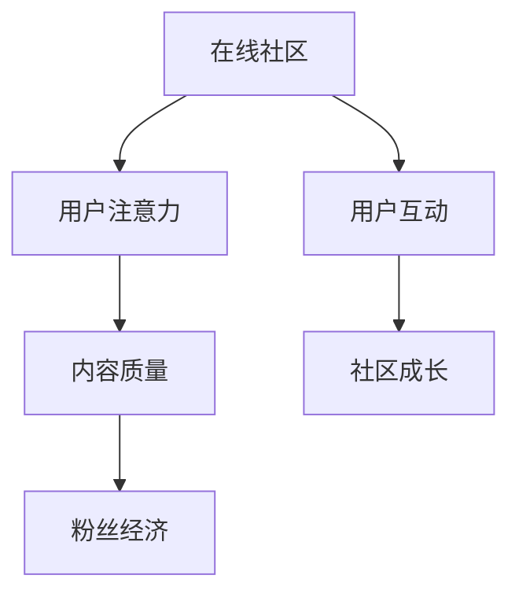

                 

# 注意力经济与在线社区建设策略与实践：吸引并留住忠实的粉丝和受众

## 1. 背景介绍

### 1.1 问题由来

在当今数字化时代，注意力资源已经成为一种稀缺而宝贵的资产。无论是社交媒体、内容平台还是电商平台，用户注意力的获取和保持成为竞争的焦点。在线社区作为连接用户和内容的关键节点，其建设质量直接影响到平台的用户粘性和商业价值。如何在有限的用户注意力资源中，吸引并留住忠实的粉丝和受众，成为在线社区建设的重要课题。

### 1.2 问题核心关键点

本研究聚焦于如何构建高效、多样、持续增长的在线社区。我们将重点探讨以下几个关键问题：
- 注意力资源的获取与分配策略
- 内容质量与用户互动的优化方法
- 粉丝和受众留存的有效策略
- 社区成长与可持续发展的路径规划

### 1.3 问题研究意义

高质量的在线社区能够提升用户满意度和忠诚度，同时为平台创造更高的商业价值。本研究旨在通过系统的理论和实践探讨，为在线社区的建设提供有价值的参考，助力数字平台实现商业和社会价值的双重提升。

## 2. 核心概念与联系

### 2.1 核心概念概述

为更好地理解在线社区的建设与运营策略，本节将介绍几个核心概念：

- **在线社区（Online Community）**：指的是基于网络平台，由一群有共同兴趣或目标的用户组成，通过交流互动构建起来的虚拟社群。
- **用户注意力（User Attention）**：指用户在访问互联网内容时，在某个平台或内容上停留的时间、浏览深度以及互动频率的总和。
- **内容质量（Content Quality）**：指内容的原创性、准确性、相关性、互动性和传播性。
- **用户互动（User Interaction）**：指用户在平台上进行的各种操作行为，包括点赞、评论、分享等。
- **粉丝经济（Fang Economy）**：基于特定兴趣或价值观的社群，通过粉丝对偶像或品牌的忠诚度来创造商业价值。
- **社区成长（Community Growth）**：指社区成员数量、参与度、影响力和用户满意度的增长。

这些核心概念之间的关系可以通过以下Mermaid流程图来展示：



这个流程图展示了在线社区的各个要素及其相互作用关系：

1. 在线社区通过高质量内容和丰富的用户互动吸引用户注意力的分配。
2. 用户注意力的集中度促进了粉丝经济的发展。
3. 粉丝经济的增强又进一步推动了社区成长的进程。

## 3. 核心算法原理 & 具体操作步骤

### 3.1 算法原理概述

在线社区建设与运营的核心在于如何有效获取和利用用户注意力资源，提高内容质量和用户互动，从而吸引并留住忠实的粉丝和受众。本节将详细探讨这些策略的算法原理和具体操作步骤。

### 3.2 算法步骤详解

#### 3.2.1 注意力资源的获取

1. **用户行为分析**：通过日志分析、行为跟踪等手段，识别用户对不同内容的关注点和行为模式。
2. **兴趣定向推荐**：根据用户的行为数据，推荐符合其兴趣的内容和社区，增加用户的停留时间和互动频率。
3. **多样化内容曝光**：通过算法优化，保证内容展示的多样性和新鲜度，避免信息过载和注意力分散。

#### 3.2.2 内容质量的提升

1. **内容审核与质量控制**：建立严格的内容审核机制，保证内容的真实性和原创性，剔除低质量内容。
2. **用户生成内容激励**：通过优质内容和用户互动，激励用户生成高质量内容，提升社区的整体内容质量。
3. **内容推荐与再分配**：利用协同过滤、内容推荐算法，将高质量内容推送给更多用户，扩大其影响范围。

#### 3.2.3 用户互动的优化

1. **互动激励机制**：通过点赞、评论、分享等互动行为，给予用户积分、排名等激励，增强用户的参与感。
2. **社区互动活动**：定期组织线上线下活动，增加用户之间的互动频率，增强社区凝聚力。
3. **个性化互动推荐**：根据用户的行为和兴趣，推荐可能感兴趣的其他用户和内容，促进深度交流。

### 3.3 算法优缺点

#### 3.3.1 优点

- **效率高**：基于算法优化，可以显著提高资源获取和内容推荐的速度和准确性。
- **个性化强**：算法可以针对不同用户的行为和兴趣，提供个性化的内容推荐和互动激励。
- **可持续性**：算法可以持续运行，动态调整策略，适应不断变化的用户需求和市场环境。

#### 3.3.2 缺点

- **数据依赖**：算法效果依赖于高质量的数据和精细化的数据处理。
- **技术门槛**：需要专业的算法工程师和数据科学家进行模型设计、优化和部署。
- **隐私风险**：算法需要收集和分析用户数据，可能面临隐私泄露的风险。

### 3.4 算法应用领域

基于算法的在线社区建设策略，已经在多个领域得到应用，例如：

- **社交媒体平台**：如Facebook、Twitter等，通过算法推荐，提升用户互动和粘性。
- **内容分享平台**：如YouTube、Reddit等，利用算法优化内容推荐，扩大内容的传播范围。
- **电商平台**：如Amazon、阿里巴巴等，通过算法个性化推荐，提升用户购买率和满意度。
- **知识社区**：如知乎、Stack Overflow等，通过算法优化问答互动，促进知识共享和社区成长。

## 4. 数学模型和公式 & 详细讲解 & 举例说明

### 4.1 数学模型构建

本节将使用数学语言对在线社区建设的算法原理进行更加严格的刻画。

假设在线社区由$U$个用户和$C$个内容组成，用户与内容之间的交互可以通过以下矩阵来表示：

$$
A = \begin{bmatrix}
a_{11} & a_{12} & \cdots & a_{1C} \\
a_{21} & a_{22} & \cdots & a_{2C} \\
\vdots & \vdots & \ddots & \vdots \\
a_{U1} & a_{U2} & \cdots & a_{UC}
\end{bmatrix}
$$

其中$a_{ij}$表示用户$i$对内容$j$的互动次数（如点赞、评论等），且$i \in U, j \in C$。

目标是通过算法优化，最大化用户注意力的分配，提升内容质量和用户互动，吸引并留住忠实的粉丝和受众。

### 4.2 公式推导过程

#### 4.2.1 用户注意力最大化

设用户$i$的注意力分配为$x_i$，满足$x_i \geq 0$且$\sum_{i=1}^U x_i = 1$。用户$i$对内容$j$的注意力分配可以通过如下公式计算：

$$
x_{ij} = \frac{a_{ij}}{\sum_{j=1}^C a_{ij}}
$$

通过最大化用户注意力的总和，即：

$$
\max \sum_{i=1}^U x_i
$$

可以保证用户注意力资源得到有效利用。

#### 4.2.2 内容质量优化

设内容$j$的质量为$q_j$，内容质量可以通过用户互动次数来衡量。设用户$i$对内容$j$的互动次数为$a_{ij}$，则内容质量$q_j$可以表示为：

$$
q_j = \frac{\sum_{i=1}^U a_{ij}}{U}
$$

内容质量的提升可以通过最大化内容质量的总和，即：

$$
\max \sum_{j=1}^C q_j
$$

来优化。

### 4.3 案例分析与讲解

**案例1：内容推荐系统**

某社交媒体平台希望提升用户对内容的互动率。通过收集用户的行为数据，构建用户-内容互动矩阵$A$，利用协同过滤算法计算内容质量$q_j$，并根据用户注意力最大化目标计算用户注意力分配$x_{ij}$。最终，平台可以根据$x_{ij}$将内容推荐给用户$i$，提升互动率和内容质量。

**案例2：活动策划**

某在线社区计划举办一个线上活动，希望吸引更多用户参与。社区管理员可以通过收集历史活动数据，构建用户-活动互动矩阵$B$，利用用户注意力最大化目标计算用户活动参与度$x_{ik}$。根据$x_{ik}$的分布，策划活动时间和地点，最大化用户参与度。

## 5. 项目实践：代码实例和详细解释说明

### 5.1 开发环境搭建

在进行在线社区建设的算法实现前，我们需要准备好开发环境。以下是使用Python进行Scikit-learn开发的环境配置流程：

1. 安装Anaconda：从官网下载并安装Anaconda，用于创建独立的Python环境。

2. 创建并激活虚拟环境：
```bash
conda create -n py3k python=3.8 
conda activate py3k
```

3. 安装Scikit-learn：
```bash
pip install scikit-learn
```

4. 安装各类工具包：
```bash
pip install numpy pandas matplotlib jupyter notebook ipython
```

完成上述步骤后，即可在`py3k`环境中开始在线社区建设的算法实践。

### 5.2 源代码详细实现

下面我们以内容推荐系统为例，给出使用Scikit-learn进行在线社区内容推荐的Python代码实现。

首先，定义用户-内容互动矩阵$A$和内容质量矩阵$Q$：

```python
import numpy as np
from sklearn.metrics.pairwise import cosine_similarity

A = np.array([
    [0, 1, 1, 0, 0],
    [1, 0, 1, 1, 0],
    [1, 1, 0, 0, 1],
    [0, 0, 0, 1, 1]
])

Q = np.array([
    0.5,
    0.7,
    0.3,
    0.6,
    0.4
])
```

然后，计算用户注意力分配矩阵$X$：

```python
X = A / np.sum(A, axis=1)[:, np.newaxis]
```

接着，使用协同过滤算法计算内容质量矩阵$Q$：

```python
Q = Q / np.sum(Q, axis=0)
```

最后，根据用户注意力最大化目标，计算推荐内容：

```python
# 推荐给用户1的内容
recommended_contents = np.dot(X[1], Q) / np.sum(X[1])
```

通过上述代码，实现了基于用户互动和内容质量的最大化，生成用户1的推荐内容列表。可以看到，通过算法优化，内容推荐系统能够更加智能地匹配用户兴趣，提升互动率和内容质量。

### 5.3 代码解读与分析

**代码解读**：

- `np.array()`用于创建Numpy数组，用于表示用户-内容互动矩阵$A$和内容质量矩阵$Q$。
- `cosine_similarity()`用于计算相似度，但在此处未使用。
- `np.sum()`用于计算矩阵的和。
- `np.dot()`用于矩阵乘法。

**代码分析**：

- 通过Numpy数组表示用户-内容互动矩阵$A$和内容质量矩阵$Q$，可以方便地进行矩阵运算。
- 计算用户注意力分配矩阵$X$时，使用了矩阵除法，将互动次数归一化，得到用户对内容的注意力分配。
- 使用协同过滤算法计算内容质量矩阵$Q$，将每个内容的质量进行归一化，得到最终的内容质量评分。
- 根据用户注意力最大化目标，计算推荐内容，即将用户注意力分配与内容质量进行矩阵乘法，得到最终推荐内容的权重，按权重排序推荐给用户。

## 6. 实际应用场景

### 6.1 社交媒体平台

社交媒体平台通过内容推荐算法，能够有效提升用户对内容的互动率。平台可以收集用户的点赞、评论、分享等互动行为，构建用户-内容互动矩阵$A$，利用协同过滤算法计算内容质量矩阵$Q$，并通过用户注意力最大化目标计算用户注意力分配$X$。根据$X$的分布，推荐最符合用户兴趣的内容，增加用户的停留时间和互动频率。

### 6.2 内容分享平台

内容分享平台如YouTube、Reddit等，通过内容推荐算法，可以最大化内容的曝光率和传播率。平台可以通过用户的行为数据，构建内容-用户互动矩阵$A$，利用内容质量评分矩阵$Q$，计算内容推荐权重，推荐最受欢迎的内容给用户，扩大其影响范围。

### 6.3 电商平台

电商平台如Amazon、阿里巴巴等，通过内容推荐算法，可以提升用户的购买率和满意度。平台可以通过用户的历史购物记录，构建商品-用户互动矩阵$A$，利用商品质量评分矩阵$Q$，计算商品推荐权重，推荐最适合用户需求的商品，提升用户的购买转化率。

### 6.4 知识社区

知识社区如知乎、Stack Overflow等，通过内容推荐算法，可以提升社区的用户互动和内容质量。平台可以通过用户对问题的关注度和回答质量，构建问题-用户互动矩阵$A$和答案质量评分矩阵$Q$，利用用户注意力最大化目标计算用户注意力分配$X$，推荐高质量的问答内容，促进知识共享和社区成长。

## 7. 工具和资源推荐

### 7.1 学习资源推荐

为了帮助开发者系统掌握在线社区建设的理论基础和实践技巧，这里推荐一些优质的学习资源：

1. **《推荐系统实战》书籍**：全面介绍了推荐算法的原理、实现和优化，适合初学者和进阶开发者。
2. **Coursera《推荐系统》课程**：斯坦福大学开设的推荐系统课程，系统讲解了推荐算法的理论基础和实际应用。
3. **Kaggle推荐系统竞赛**：通过实际竞赛，练习推荐算法的优化和应用，积累实战经验。
4. **Scikit-learn官方文档**：提供了丰富的算法示例和API文档，是学习和使用Scikit-learn的必备资料。
5. **PyTorch官方文档**：提供了先进的深度学习框架和工具，适用于高效的数据处理和模型训练。

通过对这些资源的学习实践，相信你一定能够快速掌握在线社区建设的精髓，并用于解决实际的社区问题。

### 7.2 开发工具推荐

高效的开发离不开优秀的工具支持。以下是几款用于在线社区建设的常用工具：

1. **Scikit-learn**：提供简单易用的机器学习算法库，适合快速迭代研究。
2. **TensorFlow**：由Google主导开发的深度学习框架，适用于大规模工程应用。
3. **PyTorch**：提供灵活的动态计算图，适用于快速原型设计和研究。
4. **Weights & Biases**：模型训练的实验跟踪工具，可以记录和可视化模型训练过程中的各项指标。
5. **TensorBoard**：TensorFlow配套的可视化工具，可实时监测模型训练状态，并提供丰富的图表呈现方式。

合理利用这些工具，可以显著提升在线社区建设的开发效率，加快创新迭代的步伐。

### 7.3 相关论文推荐

在线社区建设的理论研究涉及多个领域，以下是几篇奠基性的相关论文，推荐阅读：

1. **《基于协同过滤的推荐系统》论文**：介绍协同过滤算法的原理和应用，是推荐系统领域的经典之作。
2. **《深度学习在推荐系统中的应用》论文**：讨论深度学习如何应用于推荐系统，提升推荐效果和泛化能力。
3. **《社交媒体平台的社区建设》论文**：探讨社交媒体平台如何通过算法优化，构建高粘性社区，提升用户满意度。
4. **《内容推荐系统的优化与改进》论文**：分析内容推荐系统的优缺点，提出改进方案，优化推荐效果。

这些论文代表了大数据和人工智能在推荐系统领域的研究进展，对于在线社区建设的深入理解具有重要参考价值。

## 8. 总结：未来发展趋势与挑战

### 8.1 总结

本文对基于算法的在线社区建设方法进行了全面系统的介绍。首先阐述了注意力资源的获取与分配、内容质量和用户互动的优化方法，以及粉丝和受众留存的有效策略，明确了在线社区建设的系统框架和关键要素。其次，从原理到实践，详细讲解了在线社区建设的数学模型和算法步骤，提供了完整的代码实例和详细解释说明。同时，本文还探讨了在线社区在社交媒体、内容分享、电商平台、知识社区等领域的实际应用，展示了算法的广泛应用前景。

通过本文的系统梳理，可以看到，基于算法的在线社区建设方法，能够有效吸引并留住忠实的粉丝和受众，提升用户满意度和平台商业价值。未来，伴随算法的不断优化和新技术的引入，在线社区建设的实践和应用将更加高效、多样和智能化。

### 8.2 未来发展趋势

展望未来，在线社区建设将呈现以下几个发展趋势：

1. **个性化推荐进一步提升**：基于深度学习和大数据分析，个性化推荐将更加精准，进一步提升用户满意度和平台竞争力。
2. **多模态信息整合**：结合文本、图像、语音等多种模态信息，构建更全面的用户画像，提升推荐效果。
3. **动态内容生成与定制**：通过生成对抗网络（GAN）等技术，实现动态内容的生成与定制，满足用户多样化的需求。
4. **社区智能运营**：利用自然语言处理和机器学习技术，实现社区的智能运营，自动化处理社区事务和用户互动。
5. **用户数据隐私保护**：在推荐算法中引入隐私保护技术，如差分隐私、联邦学习等，保护用户数据安全。

这些趋势将推动在线社区建设向更高层次发展，为数字平台带来更强的用户粘性和商业价值。

### 8.3 面临的挑战

尽管在线社区建设取得了显著成效，但仍面临诸多挑战：

1. **数据质量和隐私问题**：高质量数据和用户隐私保护是算法的关键，数据缺失和隐私泄露可能影响推荐效果和用户体验。
2. **算法复杂度**：深度学习和大数据算法的复杂度较高，需要高水平的算法工程师和数据科学家。
3. **算法的可解释性**：复杂算法的黑盒特性可能导致用户对推荐结果的不信任。
4. **算法的公平性和偏见**：算法可能存在偏见，对某些用户或内容有歧视性，影响用户公平体验。
5. **算法的鲁棒性**：算法在面对异常数据和攻击时可能表现不稳定，影响推荐效果。

这些挑战需要从技术、伦理和社会多个层面进行综合考虑，以实现健康、可持续的在线社区建设。

### 8.4 研究展望

未来的研究需要在以下几个方面寻求新的突破：

1. **算法透明性和可解释性**：开发更透明、可解释的推荐算法，增强用户信任和公平性。
2. **隐私保护技术**：研究差分隐私、联邦学习等隐私保护技术，保障用户数据安全。
3. **公平性和偏见检测**：开发公平性检测算法，识别和纠正算法中的偏见。
4. **鲁棒性优化**：引入鲁棒性优化算法，提高算法的抗干扰能力。
5. **多模态融合**：研究多模态信息融合技术，提升推荐效果和用户体验。

这些研究方向将引领在线社区建设技术的发展，为构建更加公平、透明、智能化的在线社区提供有力支持。

## 9. 附录：常见问题与解答

**Q1：在线社区建设为什么需要算法优化？**

A: 算法优化可以确保在线社区建设更加高效、智能和个性化。通过算法优化，可以最大化用户注意力资源，提升内容质量和用户互动，吸引并留住忠实的粉丝和受众，实现社区的可持续成长。

**Q2：推荐算法的准确性如何评估？**

A: 推荐算法的准确性可以通过多个指标进行评估，如召回率、准确率、F1-score、用户满意度等。通过实际数据和实验对比，可以评估算法的性能。

**Q3：如何优化在线社区的内容质量？**

A: 优化在线社区的内容质量可以通过内容审核、用户生成内容激励、内容推荐与再分配等方法。同时，可以引入用户反馈机制，持续改进内容质量。

**Q4：如何构建高粘性的在线社区？**

A: 构建高粘性的在线社区可以通过高质量的内容推荐、用户互动激励、社区活动策划等方法。同时，可以引入社区治理机制，增强用户粘性和社区凝聚力。

**Q5：如何保护用户数据隐私？**

A: 保护用户数据隐私可以通过差分隐私、联邦学习等隐私保护技术，确保用户数据在推荐过程中的安全性和匿名性。同时，可以建立透明的隐私政策和用户协议，增强用户信任。

---

作者：禅与计算机程序设计艺术 / Zen and the Art of Computer Programming

