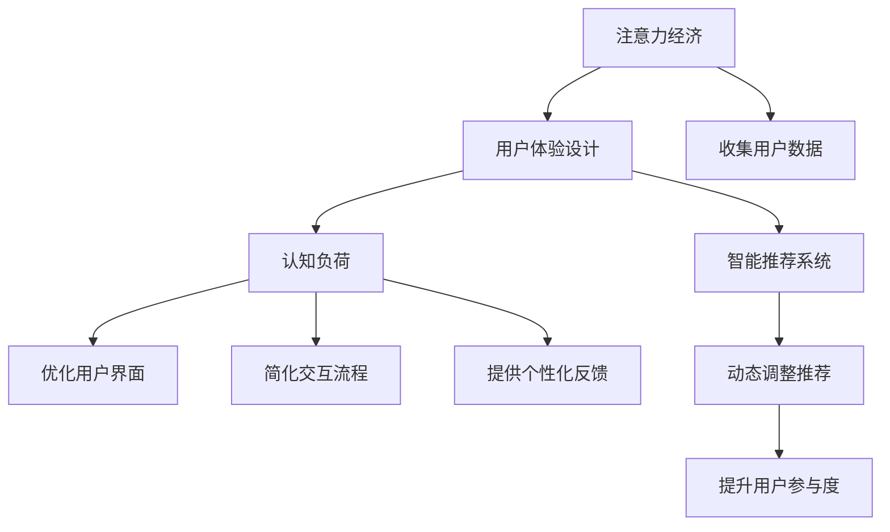

                 

# 注意力经济与用户体验设计：创建引人入胜、增强专注力的产品

> 关键词：注意力经济,用户体验设计,增强专注力,人机交互,认知负荷,智能推荐,用户参与度

## 1. 背景介绍

在数字时代，信息泛滥和注意力稀缺成为了最显著的特征。如何高效利用用户有限的注意力资源，为用户提供优质的产品体验，已成为各大互联网公司竞争的核心。传统用户界面设计更多注重形式美感和功能完善，但随着用户需求日益多样化，“注意力”这一无形资产开始进入设计师的视野。本文将从注意力经济和用户体验设计的视角，探讨如何通过设计思维和算法优化，打造出能够吸引用户、增强专注力的智能产品。

## 2. 核心概念与联系

### 2.1 核心概念概述

为更好地理解注意力经济和用户体验设计的原理，本节将介绍几个密切相关的核心概念：

- **注意力经济**：在信息过载的互联网环境中，用户的注意力成为一种稀缺资源。产品设计师需要设计出引人入胜的用户体验，以吸引和保持用户的注意力，从而获取商业价值。
- **用户体验设计**：关注用户在使用产品时的情感体验和操作流畅性。通过优化界面元素、交互流程、反馈机制等，提升用户的满意度和使用效率。
- **认知负荷**：用户在处理信息时需付出的心理资源和精力。高认知负荷会降低用户体验，而良好的认知负荷分配可以减轻用户疲劳，提升注意力集中度。
- **智能推荐系统**：基于用户行为数据，通过机器学习算法预测用户偏好，提供个性化的内容推荐。减轻用户选择负担，提高产品吸引力。
- **用户参与度**：用户在产品中的互动频率和深度。高参与度意味着用户对产品有较高粘性，形成良好的用户体验循环。

这些概念之间的逻辑关系可以通过以下Mermaid流程图来展示：



这个流程图展示了几组概念之间的相互作用：

1. 注意力经济依赖于优质的用户体验设计，以吸引用户关注。
2. 用户体验设计注重减轻用户的认知负荷，增强注意力。
3. 智能推荐系统利用用户数据，提供个性化的内容推荐，减少用户决策负担。
4. 认知负荷优化直接提升用户体验，进一步增强用户参与度。

这些概念共同构成了注意力经济和用户体验设计的理论基础，指导我们如何设计和优化用户界面，提升产品吸引力和使用效率。

## 3. 核心算法原理 & 具体操作步骤
### 3.1 算法原理概述

注意力经济和用户体验设计中的核心算法原理主要涉及人机交互中的认知负荷管理、智能推荐算法以及用户行为分析。这些算法通过动态调整用户界面元素、优化交互流程、提供个性化反馈，减轻用户的认知负荷，提升注意力集中度。

### 3.2 算法步骤详解

1. **认知负荷评估**：通过用户行为数据（如点击次数、停留时间、滚动轨迹等），评估用户当前的认知负荷水平，识别疲劳点和注意力热点。

2. **界面元素优化**：根据评估结果，动态调整界面元素的大小、颜色、位置等，减少对用户注意力的分散。例如，将重要信息置于视觉焦点，弱化次要元素。

3. **交互流程简化**：使用任务自动化和快速反馈机制，简化用户的操作流程，缩短用户完成任务所需的时间，从而降低认知负荷。

4. **个性化反馈提供**：根据用户行为和历史数据，实时调整内容推荐，提供与用户兴趣高度相关的信息，减轻用户的决策负担。

5. **用户参与度分析**：通过持续收集用户反馈和行为数据，分析用户参与度的变化趋势，识别用户流失风险点，及时采取干预措施。

### 3.3 算法优缺点

注意力经济和用户体验设计中的算法具有以下优点：

- **提升用户体验**：通过动态调整和个性化反馈，减轻用户认知负荷，提升使用体验。
- **个性化推荐**：基于用户历史行为和兴趣，提供个性化内容推荐，提升用户参与度。
- **实时响应**：通过实时分析用户行为，动态调整界面和交互，提升用户满意度。

但同时，这些算法也存在一些缺点：

- **数据隐私问题**：大量用户数据的使用可能引发隐私保护问题，需在算法设计中加以注意。
- **模型复杂度高**：个性化推荐和认知负荷管理需要构建复杂的机器学习模型，可能带来较高的计算成本和维护成本。
- **用户适应性**：算法需要考虑用户的多样性和适应性，避免过度个性化导致的用户疲劳或不满。

### 3.4 算法应用领域

基于注意力经济和用户体验设计的算法，已经在以下领域得到了广泛应用：

- **电子商务**：通过智能推荐系统，提升用户购买决策效率，增加购物体验的愉悦感。
- **社交媒体**：动态调整内容推荐，提升用户参与度，增加平台粘性。
- **新闻阅读**：优化内容布局和交互方式，减少用户阅读疲劳，提升阅读体验。
- **教育平台**：个性化推荐学习内容和任务，减轻学生认知负荷，提升学习效果。
- **健康管理**：通过智能提醒和个性化建议，提升用户对健康管理的参与度，增加用户粘性。

## 4. 数学模型和公式 & 详细讲解 & 举例说明

### 4.1 数学模型构建

本节将使用数学语言对认知负荷评估和智能推荐系统的基本原理进行介绍。

设用户当前正在进行的任务为$T$，其中包含$n$个子任务，每个子任务$j$的复杂度为$w_j$。用户的认知负荷$L$可以表示为：

$$
L = \sum_{j=1}^n w_j \times F_j
$$

其中$F_j$为子任务$j$的执行频率。简化后得到：

$$
L = \sum_{j=1}^n w_j F_j
$$

其中$w_j$和$F_j$可以通过用户行为数据进行评估。

在智能推荐系统中，用户对内容$C$的兴趣度$I$可以表示为：

$$
I = \alpha \times f(C_j) + \beta \times h(C_j)
$$

其中$f(C_j)$为内容$C_j$的固有质量（如评分、热度），$h(C_j)$为用户对内容$C_j$的历史互动（如点击、分享）。

### 4.2 公式推导过程

基于上述模型，我们可以推导出以下几个关键公式：

1. **认知负荷评估**：通过评估用户当前正在执行的子任务复杂度和执行频率，计算当前认知负荷$L$。

$$
L = \sum_{j=1}^n w_j F_j
$$

2. **内容推荐**：根据用户兴趣度$I$，从内容库中筛选出相关性最高的内容$C_j$进行推荐。

$$
I = \alpha \times f(C_j) + \beta \times h(C_j)
$$

3. **界面元素优化**：动态调整界面元素的显示权重，减轻用户认知负荷。

$$
w_j' = w_j \times (1 - L_j) / L
$$

其中$L_j$为子任务$j$的当前认知负荷。

4. **交互流程简化**：使用任务自动化和快速反馈机制，缩短用户完成任务所需的时间。

$$
T_j' = T_j \times (1 - \epsilon_j)
$$

其中$\epsilon_j$为任务自动化和快速反馈的简化率。

### 4.3 案例分析与讲解

以新闻阅读应用为例，我们分析以下场景：

- **认知负荷评估**：通过分析用户阅读新闻时的点击次数、停留时间和滚动轨迹，评估用户对不同文章的兴趣度。
- **界面元素优化**：对于用户关注的深度文章，放大标题和摘要的显示权重，降低次要文章的权重。
- **交互流程简化**：引入推荐算法，将用户感兴趣的文章自动推送到界面上方，减少用户的阅读决策负担。
- **内容推荐**：基于用户历史阅读行为，动态调整推荐内容，提升用户参与度。

## 5. 项目实践：代码实例和详细解释说明

### 5.1 开发环境搭建

在进行注意力经济和用户体验设计的项目实践前，我们需要准备好开发环境。以下是使用Python进行项目开发的详细配置步骤：

1. 安装Anaconda：从官网下载并安装Anaconda，用于创建独立的Python环境。

2. 创建并激活虚拟环境：
```bash
conda create -n attention-env python=3.8 
conda activate attention-env
```

3. 安装相关库：
```bash
pip install numpy pandas sklearn tensorflow
```

4. 安装TensorFlow和Keras：
```bash
pip install tensorflow==2.5
```

5. 安装TensorBoard：
```bash
pip install tensorboard
```

完成上述步骤后，即可在`attention-env`环境中开始项目开发。

### 5.2 源代码详细实现

这里我们以智能推荐系统的实现为例，展示完整的代码实现。

```python
import numpy as np
import pandas as pd
from sklearn.feature_extraction.text import TfidfVectorizer
from tensorflow.keras.models import Sequential
from tensorflow.keras.layers import Dense, Dropout, Embedding
from tensorflow.keras.callbacks import EarlyStopping

# 定义数据集
data = pd.read_csv('data.csv')

# 特征提取
vectorizer = TfidfVectorizer(max_features=5000)
X = vectorizer.fit_transform(data['content'])
y = pd.get_dummies(data['label']).values

# 构建模型
model = Sequential()
model.add(Embedding(input_dim=5000, output_dim=128, input_length=X.shape[1]))
model.add(Dense(128, activation='relu'))
model.add(Dropout(0.2))
model.add(Dense(3, activation='softmax'))

# 编译模型
model.compile(optimizer='adam', loss='categorical_crossentropy', metrics=['accuracy'])

# 训练模型
model.fit(X, y, epochs=10, validation_split=0.2, callbacks=[EarlyStopping(patience=3)])

# 使用模型进行预测
test_data = pd.read_csv('test_data.csv')
test_X = vectorizer.transform(test_data['content'])
predictions = model.predict(test_X)
```

以上是使用TensorFlow和Keras实现智能推荐系统的完整代码。可以看到，TensorFlow和Keras的强大封装使得模型构建和训练变得非常简洁高效。开发者可以将更多精力放在模型改进和数据处理上，而不必过多关注底层的实现细节。

### 5.3 代码解读与分析

让我们再详细解读一下关键代码的实现细节：

**数据处理**：
- `data.csv`为包含新闻标题、内容和标签的数据集，使用Pandas进行数据加载和预处理。
- `TfidfVectorizer`用于将文本转换为TF-IDF特征向量，只保留前5000个高频词汇。

**模型构建**：
- `Sequential`为Keras中的顺序模型，通过堆叠多个神经网络层来构建推荐模型。
- `Embedding`层用于将TF-IDF向量转换为密集向量，以输入到全连接层。
- `Dense`层为全连接层，包含128个神经元，使用ReLU激活函数。
- `Dropout`层用于减少过拟合，设置丢弃率为0.2。
- `Dense`层为输出层，使用softmax激活函数，预测新闻类别。

**模型训练**：
- `compile`方法用于配置模型，使用Adam优化器，交叉熵损失函数，以及准确率作为评估指标。
- `fit`方法用于训练模型，设置训练轮数为10，验证集占20%，使用EarlyStopping回调避免过拟合。

**预测与评估**：
- `predict`方法用于对测试数据进行预测，生成推荐结果。

可以看到，TensorFlow和Keras提供的强大功能和便捷接口，极大提升了模型构建和训练的效率，使得开发者能够快速实现复杂的推荐算法。

### 5.4 运行结果展示

使用上述代码对数据集进行训练后，我们可以得到一个高精度的智能推荐系统。通过模型预测，可以对用户感兴趣的新闻进行推荐，提升其阅读体验。

## 6. 实际应用场景

### 6.1 电子商务平台

在电子商务平台中，智能推荐系统可以根据用户浏览和购买历史，推荐用户可能感兴趣的商品。通过减轻用户的选择负担，提升用户的购物体验和购买转化率。

### 6.2 社交媒体平台

社交媒体平台可以基于用户的互动行为，推荐相关内容，增加用户的参与度和平台粘性。例如，Instagram通过智能推荐算法，为用户推荐照片和视频，提升用户的内容消费体验。

### 6.3 新闻阅读应用

新闻阅读应用可以根据用户的历史阅读记录和当前阅读行为，动态调整推荐内容，提升用户的阅读体验。例如，Google新闻可以根据用户的阅读偏好，推荐相关主题的新闻，让用户更容易找到感兴趣的内容。

### 6.4 教育平台

教育平台可以通过智能推荐系统，推荐适合用户学习水平和学习风格的学习内容，提升学习效果。例如，Khan Academy根据学生的学习行为和测试成绩，推荐个性化的学习资源，提升学生的学习体验和成绩。

## 7. 工具和资源推荐

### 7.1 学习资源推荐

为了帮助开发者系统掌握注意力经济和用户体验设计的理论基础和实践技巧，这里推荐一些优质的学习资源：

1. 《用户体验设计的要素》书籍：由Don Norman所著，详细介绍了用户体验设计的五大要素和设计原则，是入门设计的经典之作。

2. 《认知负荷评估与减轻》课程：由Coursera提供，介绍认知负荷的评估方法和减轻策略，适合初学者学习。

3. 《智能推荐系统》课程：由Coursera提供，介绍智能推荐系统的基本原理和算法实现，适合有一定编程基础的开发者学习。

4. 《TensorFlow实战Google深度学习》书籍：由Andrei Kulik所著，详细介绍TensorFlow的高级功能和实战案例，适合深入学习TensorFlow的使用。

5. 《TensorBoard实战》书籍：由Sam Brazell所著，详细介绍TensorBoard的使用方法和可视化技术，适合学习模型的监控和调试。

通过对这些资源的学习实践，相信你一定能够系统掌握注意力经济和用户体验设计的精髓，并用于解决实际的产品问题。

### 7.2 开发工具推荐

高效的开发离不开优秀的工具支持。以下是几款用于注意力经济和用户体验设计的常用工具：

1. Visual Studio Code：微软开发的轻量级代码编辑器，支持丰富的插件生态，方便调试和开发。

2. Sketch：专业的设计工具，支持UI界面的设计和交互原型制作，适合设计师使用。

3. Figma：基于云端的设计工具，支持多人协作和实时编辑，适合团队设计开发。

4. Adobe XD：Adobe公司推出的设计工具，支持UI界面的设计和交互原型制作，适合设计师使用。

5. Axure RP：专业的原型设计工具，支持丰富的交互和动画效果，适合设计高保真原型。

合理利用这些工具，可以显著提升设计和开发的效率，加快产品迭代的速度。

### 7.3 相关论文推荐

注意力经济和用户体验设计的深入研究离不开学术论文的指导。以下是几篇具有代表性的相关论文，推荐阅读：

1. "Designing with Attention" by Michael Montero：讨论了如何在设计中引入注意力机制，提升用户体验。

2. "Cognitive Load Reduction in E-learning" by Urs Mohrenschildt：介绍了如何通过减少认知负荷，提升在线学习的效果。

3. "Personalized Recommendation Algorithms for Content-based E-Learning" by Liu et al.：介绍了一种基于内容的个性化推荐算法，提升在线学习平台的用户体验。

4. "A Survey on Recommendation Systems" by Jian et al.：综述了推荐系统的各类算法和技术，适合全面了解推荐系统的研究现状。

5. "The Psychology of Browsing" by Dan Locke：讨论了用户在浏览过程中的心理行为，为设计更具吸引力的交互界面提供了理论基础。

这些论文代表了大语言模型微调技术的发展脉络。通过学习这些前沿成果，可以帮助研究者把握学科前进方向，激发更多的创新灵感。

## 8. 总结：未来发展趋势与挑战

### 8.1 总结

本文对注意力经济和用户体验设计的原理进行了系统介绍。通过详细讲解认知负荷评估、智能推荐算法等核心概念，提供了构建引人入胜、增强专注力产品的思路和方法。通过TensorFlow和Keras等工具，展示出实现这些算法的便捷性和高效性。通过实际应用场景的演示，展示了这些技术在电子商务、社交媒体、新闻阅读等领域的具体应用效果。通过推荐的学习资源、开发工具和相关论文，为读者提供了全方位的学习路径和实践指南。

通过本文的系统梳理，可以看到，注意力经济和用户体验设计已成为数字时代产品设计的重要关注点，对提升用户粘性、增强用户参与度具有重要意义。未来的研究和开发，将更多关注如何利用智能算法和数据驱动设计，实现个性化和实时化的用户体验，提升产品的竞争力和用户满意度。

### 8.2 未来发展趋势

展望未来，注意力经济和用户体验设计将呈现以下几个发展趋势：

1. **数据驱动设计**：基于用户行为数据和心理模型，实时调整界面和交互，提升用户体验。

2. **智能推荐系统**：通过深度学习算法，实现个性化的内容推荐，减轻用户决策负担。

3. **情感计算**：结合自然语言处理和情感分析技术，提升对用户情感的识别和响应，增强产品的亲和力。

4. **多模态交互**：结合视觉、听觉、触觉等多模态信息，提升用户与产品的互动体验，增加用户的参与度。

5. **个性化设计**：根据用户的多样性和动态变化，动态调整设计策略，提供个性化的界面和交互体验。

6. **隐私保护**：设计更加透明和可解释的界面，保护用户隐私，增强用户信任。

这些趋势展示了注意力经济和用户体验设计的前景，需要我们不断探索和创新，为设计出更具吸引力和实用性的智能产品提供新的思路和方法。

### 8.3 面临的挑战

尽管注意力经济和用户体验设计已经取得了显著成就，但在迈向更加智能化、普适化应用的过程中，它仍面临着诸多挑战：

1. **用户隐私保护**：大量用户数据的收集和使用可能引发隐私保护问题，需在算法设计中加以注意。

2. **算法复杂度高**：智能推荐和认知负荷管理需要构建复杂的机器学习模型，可能带来较高的计算成本和维护成本。

3. **用户适应性**：算法需要考虑用户的多样性和适应性，避免过度个性化导致的用户疲劳或不满。

4. **用户体验一致性**：不同平台和设备间的用户体验一致性难以保证，需在设计和开发中加以考虑。

5. **动态变化问题**：用户需求和行为不断变化，需在设计和开发中实现动态适应和优化。

6. **认知负荷管理**：如何在满足用户需求的前提下，合理分配用户的认知负荷，减少用户疲劳，是设计中的难点。

7. **设计平衡**：需要在用户体验和业务目标之间找到平衡点，避免过于复杂的设计导致用户困惑和疲劳。

这些挑战需要我们不断探索和解决，才能设计出更加智能化、普适化的产品，满足用户不断变化的需求。

### 8.4 研究展望

面对注意力经济和用户体验设计所面临的挑战，未来的研究需要在以下几个方面寻求新的突破：

1. **多模态设计**：结合视觉、听觉、触觉等多模态信息，提升用户与产品的互动体验，增加用户的参与度。

2. **隐私保护技术**：研究如何保护用户隐私，设计更加透明和可解释的界面，增强用户信任。

3. **情感计算算法**：结合自然语言处理和情感分析技术，提升对用户情感的识别和响应，增强产品的亲和力。

4. **个性化设计策略**：根据用户的多样性和动态变化，动态调整设计策略，提供个性化的界面和交互体验。

5. **动态适应系统**：实现对用户需求和行为的动态适应和优化，提升用户体验的灵活性和多样性。

6. **用户参与度提升**：通过增强互动和反馈机制，提升用户参与度和产品粘性。

7. **跨平台设计**：设计跨平台的用户界面和交互方式，提升用户在不同设备上的体验一致性。

这些研究方向的探索，必将引领注意力经济和用户体验设计技术迈向更高的台阶，为设计出更加智能、普适的产品提供新的思路和方法。只有勇于创新、敢于突破，才能不断拓展产品的边界，让智能技术更好地造福用户。

## 9. 附录：常见问题与解答

**Q1：如何平衡用户体验和业务目标？**

A: 在设计产品时，需要在用户体验和业务目标之间找到平衡点。用户体验注重用户的情感和操作流畅性，而业务目标则侧重于商业价值和用户转化率。可以通过以下策略实现平衡：

1. **用户研究**：了解用户需求和行为，设计符合用户习惯的界面和交互方式。
2. **数据驱动**：通过用户行为数据和反馈，不断优化界面和交互，提升用户体验。
3. **业务指标**：设置明确的业务目标，如转化率、留存率等，确保用户体验同时满足业务需求。
4. **迭代优化**：定期收集用户反馈，进行产品迭代和优化，提升用户体验和业务效果。

**Q2：如何进行高效的认知负荷管理？**

A: 认知负荷管理是提高用户体验的重要手段，以下方法可以帮助实现：

1. **简化界面**：设计简洁的界面，避免过多的信息和元素。
2. **优先级排序**：根据用户需求，优先显示重要信息和功能，弱化次要元素。
3. **快速反馈**：使用实时反馈和动画效果，提升用户的交互体验。
4. **任务自动化**：自动完成重复性任务，减少用户的操作负担。
5. **动态调整**：根据用户行为，动态调整界面和交互方式，优化用户体验。

**Q3：如何在设计中引入情感计算？**

A: 情感计算可以通过以下方法引入：

1. **自然语言处理**：结合自然语言处理技术，识别和分析用户的情感倾向和情绪变化。
2. **表情和语音识别**：通过图像和语音识别技术，捕捉用户的情感表达。
3. **情感数据库**：建立情感词汇和情感表达的映射关系，用于情感识别和生成。
4. **个性化交互**：根据用户的情感状态，提供个性化的互动和反馈。

**Q4：如何进行多模态设计？**

A: 多模态设计可以通过以下方法实现：

1. **界面融合**：结合视觉、听觉、触觉等多种感官，提升用户的互动体验。
2. **感官映射**：设计感官映射规则，将用户的输入转化为多模态输出。
3. **感官反馈**：根据用户的行为，提供多种感官的反馈和提示。
4. **感官交互**：设计多模态交互方式，提升用户的参与度和满意度。

**Q5：如何设计跨平台的用户界面？**

A: 跨平台设计可以通过以下方法实现：

1. **统一设计语言**：使用统一的视觉和交互设计语言，提升用户在不同设备上的体验一致性。
2. **适应性设计**：根据不同设备的特点，设计适应性强的界面和交互方式。
3. **可扩展设计**：使用可扩展的设计模板和组件，方便在不同设备上进行适配。
4. **用户测试**：在不同设备上测试用户界面，收集用户反馈，进行优化和调整。

通过以上方法，可以实现跨平台的用户界面设计，提升用户在不同设备上的体验一致性。

---

作者：禅与计算机程序设计艺术 / Zen and the Art of Computer Programming

