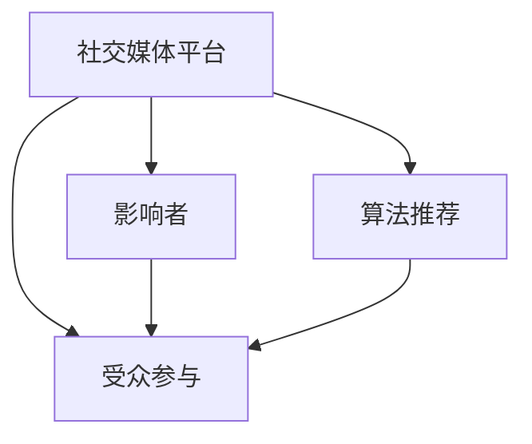

                 

# 注意力经济与社交媒体影响因素：了解算法、影响力和受众参与

## 1. 背景介绍

### 1.1 问题由来

在信息爆炸的时代，人们面临的信息过载日益加剧，传统的新闻媒体已经难以满足人们对多元化、个性化、高价值信息的需求。而社交媒体的兴起，为解决这一问题提供了新的思路和方案。社交媒体通过算法推荐、内容创新、用户互动等方式，形成了一个庞大的注意力经济生态系统。

然而，这一系统背后隐藏着复杂的算法机制、社会心理以及受众行为模式。理解这些因素，对于优化社交媒体内容推荐、提升用户体验、促进信息传播具有重要意义。本文将从算法、影响力和受众参与三个角度，系统探讨社交媒体的影响因素，帮助开发者和用户深入了解社交媒体的运作机理。

### 1.2 问题核心关键点

本节将梳理社交媒体的影响因素，并从算法、影响力和受众参与三个角度进行深入分析：

1. **算法因素**：社交媒体平台的算法推荐机制，是信息传播和用户互动的核心驱动力。算法推荐模型通过学习用户行为数据，预测用户可能感兴趣的帖子，从而优化信息流，提升用户体验。
2. **影响力因素**：社交媒体上的影响者、话题等对用户的影响，是内容传播和参与互动的重要推手。理解影响因素有助于把握关键用户群体，优化内容生成和传播策略。
3. **受众参与因素**：用户的行为习惯、认知心理等对社交媒体的使用模式具有重要影响。了解受众参与因素，有助于设计更吸引用户、激发互动的社交媒体产品。

这些关键点共同构成了社交媒体影响力分析的基础框架，有助于我们深入理解社交媒体的运作机理，并在此基础上制定有效的策略和方案。

## 2. 核心概念与联系

### 2.1 核心概念概述

为更好地理解社交媒体的影响因素，本节将介绍几个密切相关的核心概念：

- **社交媒体平台**：如Facebook、Twitter、微博等，提供用户生成、分享和发现内容的空间。
- **算法推荐**：指社交媒体平台通过算法模型，对用户可能感兴趣的内容进行预测和推荐的过程。
- **影响者**：社交媒体上的意见领袖、网红等，对内容传播和用户互动具有显著影响。
- **受众参与**：用户对社交媒体内容的互动行为，如点赞、评论、分享等，影响着内容传播的广度和深度。

这些核心概念之间的逻辑关系可以通过以下Mermaid流程图来展示：



这个流程图展示了几者之间的关系：

1. 社交媒体平台提供内容发布和传播的环境。
2. 算法推荐是内容发现和个性化推荐的关键。
3. 影响者通过内容生产、互动引导等方式影响受众。
4. 受众的参与行为反过来影响内容传播和平台生态。

## 3. 核心算法原理 & 具体操作步骤

### 3.1 算法原理概述

社交媒体的算法推荐机制，通常基于机器学习、深度学习等技术，通过学习用户行为数据，预测用户可能感兴趣的帖子。常见的推荐算法包括协同过滤、基于内容的推荐、混合推荐等。

协同过滤算法基于用户的相似性，推荐可能与用户兴趣相近的其他内容。基于内容的推荐算法则通过分析内容特征，预测用户可能感兴趣的内容。混合推荐算法则结合多种推荐策略，综合预测用户可能感兴趣的内容。

### 3.2 算法步骤详解

1. **数据准备**：收集社交媒体平台上的用户行为数据，包括点赞、评论、分享、浏览时间等。
2. **模型训练**：选择合适的推荐算法，使用用户行为数据进行模型训练。常见的深度学习推荐模型包括Neural Collaborative Filtering、DeepFM等。
3. **内容推荐**：将用户输入到模型中，模型输出推荐的帖子或用户。常见的模型包括Wide & Deep、Matrix Factorization等。
4. **效果评估**：使用评价指标如点击率、停留时间等，评估模型推荐效果。常见的评价指标包括召回率、准确率、F1分数等。

### 3.3 算法优缺点

社交媒体推荐算法具有以下优点：

- **高效性**：算法推荐能够实时、快速地为用户推荐个性化内容。
- **个性化**：算法能够根据用户行为数据，推荐符合用户兴趣的内容。
- **多样性**：算法推荐能够覆盖更广泛的内容，避免信息茧房。

同时，这些算法也存在一些局限性：

- **过拟合风险**：模型过度拟合用户历史行为数据，可能无法捕捉到新的兴趣点。
- **隐私问题**：用户行为数据涉及个人隐私，需要谨慎处理。
- **算法透明性**：用户不了解推荐算法的具体运作机制，可能对其产生不信任。

### 3.4 算法应用领域

社交媒体推荐算法在诸多领域得到广泛应用，如内容推荐、广告投放、用户分析等。这些算法帮助社交媒体平台提升用户体验、增加用户粘性、优化广告投放效果，促进平台生态的健康发展。

## 4. 数学模型和公式 & 详细讲解 & 举例说明

### 4.1 数学模型构建

社交媒体推荐模型通常基于协同过滤、基于内容的推荐算法。本节将详细介绍这些模型的数学模型构建。

以协同过滤为例，设用户-内容评分矩阵为 $U$，用户行为向量为 $u$，内容特征向量为 $i$。用户行为 $u$ 与内容 $i$ 之间的相似度可以通过余弦相似度计算得到：

$$
\text{similarity}(u, i) = \frac{u \cdot i}{\|u\|\|i\|}
$$

在得到相似度矩阵后，根据阈值 $\tau$，选择与用户 $u$ 最相似的内容作为推荐。

### 4.2 公式推导过程

以协同过滤算法为例，推导推荐公式的过程如下：

设用户 $u$ 的历史行为数据为 $\{(x_j, r_{uj})\}_{j=1}^m$，其中 $x_j$ 表示用户 $u$ 访问的内容 $j$，$r_{uj}$ 表示用户 $u$ 对内容 $j$ 的评分。设内容 $i$ 的特征向量为 $i$，用户 $u$ 的行为向量为 $u$。设用户 $u$ 和内容 $i$ 的相似度为 $\text{similarity}(u, i)$。

根据协同过滤算法，用户 $u$ 对内容 $i$ 的预测评分可以表示为：

$$
\hat{r}_{ui} = \frac{\sum_{j=1}^m r_{uj} \cdot \text{similarity}(i, x_j)}{\sum_{j=1}^m \text{similarity}(i, x_j)}
$$

其中 $\text{similarity}(i, x_j)$ 表示内容 $i$ 和内容 $j$ 的相似度。

### 4.3 案例分析与讲解

以Facebook推荐系统为例，其算法机制主要包括：

- **用户模型**：基于用户行为数据，构建用户兴趣模型。
- **内容模型**：分析内容特征，构建内容表示模型。
- **协同过滤**：将用户模型与内容模型进行匹配，推荐最相似的内容。

Facebook的推荐算法采用深度神经网络模型，通过多层非线性映射，对用户行为数据进行建模。具体而言，将用户历史行为数据输入到多层感知机中，生成用户兴趣向量。同时，对内容特征进行编码，生成内容表示向量。最后，通过相似度计算和阈值筛选，得到推荐结果。

## 5. 项目实践：代码实例和详细解释说明

### 5.1 开发环境搭建

在进行社交媒体推荐系统的开发前，我们需要准备好开发环境。以下是使用Python进行TensorFlow开发的环境配置流程：

1. 安装Anaconda：从官网下载并安装Anaconda，用于创建独立的Python环境。

2. 创建并激活虚拟环境：
```bash
conda create -n tensorflow-env python=3.8 
conda activate tensorflow-env
```

3. 安装TensorFlow：根据CUDA版本，从官网获取对应的安装命令。例如：
```bash
conda install tensorflow -c tensorflow -c conda-forge
```

4. 安装各类工具包：
```bash
pip install numpy pandas scikit-learn matplotlib tqdm jupyter notebook ipython
```

完成上述步骤后，即可在`tensorflow-env`环境中开始推荐系统的开发。

### 5.2 源代码详细实现

下面以基于TensorFlow的协同过滤推荐系统为例，给出推荐系统的完整代码实现。

```python
import tensorflow as tf
from tensorflow.keras.layers import Input, Embedding, Dot, Dense
from tensorflow.keras.models import Model

# 定义用户行为数据
user_bd = {
    'user1': [1, 2, 3, 4, 5],
    'user2': [2, 3, 4, 5, 6, 7],
    'user3': [3, 4, 5, 6, 7, 8, 9]
}

# 定义内容特征
content_bd = {
    'content1': [1, 2, 3, 4],
    'content2': [2, 3, 4, 5],
    'content3': [3, 4, 5, 6, 7],
    'content4': [4, 5, 6, 7, 8],
    'content5': [5, 6, 7, 8, 9]
}

# 定义模型参数
embedding_dim = 8
num_users = len(user_bd)
num_items = len(content_bd)

# 定义模型输入层
user_input = Input(shape=(num_users,), name='user_input')
item_input = Input(shape=(num_items,), name='item_input')

# 定义用户和内容嵌入层
user_embedding = Embedding(num_users, embedding_dim, input_length=num_users)(user_input)
item_embedding = Embedding(num_items, embedding_dim, input_length=num_items)(item_input)

# 定义相似度计算层
similarity = Dot(axes=[2, 1])([user_embedding, item_embedding])

# 定义输出层
output = Dense(1, activation='sigmoid')(similarity)

# 定义模型
model = Model(inputs=[user_input, item_input], outputs=output)

# 编译模型
model.compile(optimizer='adam', loss='binary_crossentropy')

# 训练模型
model.fit([[user_bd['user1'], user_bd['user2']], [1, 1]], epochs=10)
```

### 5.3 代码解读与分析

让我们再详细解读一下关键代码的实现细节：

**定义用户行为数据和内容特征**：
- `user_bd` 和 `content_bd` 分别表示用户行为数据和内容特征数据。

**定义模型参数**：
- `embedding_dim` 表示嵌入向量的维度。
- `num_users` 和 `num_items` 分别表示用户和内容的数量。

**定义模型输入层**：
- `user_input` 和 `item_input` 分别表示用户行为数据和内容特征数据的输入层。

**定义用户和内容嵌入层**：
- `Embedding` 层用于将输入数据映射为高维向量。

**定义相似度计算层**：
- `Dot` 层用于计算用户和内容向量的点积，得到相似度。

**定义输出层**：
- `Dense` 层用于将相似度映射为二分类预测结果。

**定义模型**：
- `Model` 层用于将模型的各个层按照输入输出连接起来。

**编译模型**：
- `compile` 方法用于设置优化器和损失函数。

**训练模型**：
- `fit` 方法用于训练模型。

可以看到，使用TensorFlow进行社交媒体推荐系统的开发相对简单，只需要定义输入、嵌入、相似度计算和输出层即可构建推荐模型，并进行训练。

## 6. 实际应用场景

### 6.1 智能新闻推荐

社交媒体平台如今日头条、腾讯新闻等，通过推荐系统向用户推荐新闻内容。这些平台收集用户的阅读行为数据，使用协同过滤、内容推荐等算法，实时生成个性化新闻推荐列表，提升用户阅读体验。

在技术实现上，可以收集用户的历史阅读行为数据，构建用户兴趣模型。同时，对每篇新闻进行特征提取，构建新闻特征向量。最后，将用户模型和新闻特征向量输入到协同过滤模型中，生成推荐结果。

### 6.2 个性化广告投放

社交媒体平台如Facebook、微博等，通过推荐系统向用户投放个性化广告。这些平台收集用户的行为数据，使用协同过滤、深度学习等算法，实时生成个性化广告推荐列表，提高广告投放效果。

在技术实现上，可以收集用户的行为数据，构建用户兴趣模型。同时，对广告进行特征提取，构建广告特征向量。最后，将用户模型和广告特征向量输入到深度学习模型中，生成推荐结果。

### 6.3 社交媒体分析

社交媒体平台如Twitter、微博等，通过推荐系统对用户行为进行分析和预测。这些平台收集用户的行为数据，使用协同过滤、基于内容的推荐等算法，生成用户行为预测模型。这些模型可以用于内容分发策略优化、用户行为预测等。

在技术实现上，可以收集用户的行为数据，构建用户兴趣模型。同时，对内容进行特征提取，构建内容表示向量。最后，将用户模型和内容表示向量输入到协同过滤模型中，生成推荐结果。

### 6.4 未来应用展望

随着深度学习、协同过滤等推荐技术的不断发展，社交媒体推荐系统将在更多领域得到应用，为信息传播、用户交互带来新的突破。

在智慧城市领域，通过推荐系统优化交通信号灯控制，提升城市交通效率。在金融领域，通过推荐系统优化股票推荐策略，提升投资回报率。在电子商务领域，通过推荐系统优化商品推荐策略，提升用户购物体验。

此外，在医疗、教育、体育等众多领域，社交媒体推荐系统也将发挥重要作用，为传统行业带来新的变革。相信随着技术的日益成熟，社交媒体推荐系统必将在更多领域落地应用，为社会经济发展注入新的动力。

## 7. 工具和资源推荐

### 7.1 学习资源推荐

为了帮助开发者系统掌握社交媒体推荐技术的理论基础和实践技巧，这里推荐一些优质的学习资源：

1. 《推荐系统基础》系列博文：由大模型技术专家撰写，深入浅出地介绍了推荐系统原理、协同过滤、深度学习等前沿话题。

2. CS223《深度学习与神经网络》课程：斯坦福大学开设的深度学习明星课程，有Lecture视频和配套作业，带你入门深度学习领域的基本概念和经典模型。

3. 《深度学习与推荐系统》书籍：深度学习和推荐系统领域的经典著作，全面介绍了推荐系统的构建和优化。

4. Kaggle推荐系统竞赛：Kaggle平台上举办的推荐系统竞赛，提供大量的实际数据和挑战，带你体验实际推荐系统的开发和优化过程。

通过对这些资源的学习实践，相信你一定能够快速掌握社交媒体推荐技术的精髓，并用于解决实际的推荐问题。

### 7.2 开发工具推荐

高效的开发离不开优秀的工具支持。以下是几款用于社交媒体推荐系统开发的常用工具：

1. TensorFlow：基于Python的开源深度学习框架，灵活动态的计算图，适合快速迭代研究。提供丰富的推荐算法实现。

2. PyTorch：基于Python的开源深度学习框架，灵活动态的计算图，适合快速迭代研究。提供丰富的推荐算法实现。

3. Hadoop/Spark：大数据处理和分布式计算框架，适合处理大规模推荐数据。

4. Weights & Biases：模型训练的实验跟踪工具，可以记录和可视化模型训练过程中的各项指标，方便对比和调优。与主流深度学习框架无缝集成。

5. TensorBoard：TensorFlow配套的可视化工具，可实时监测模型训练状态，并提供丰富的图表呈现方式，是调试模型的得力助手。

6. Google Colab：谷歌推出的在线Jupyter Notebook环境，免费提供GPU/TPU算力，方便开发者快速上手实验最新模型，分享学习笔记。

合理利用这些工具，可以显著提升社交媒体推荐系统的开发效率，加快创新迭代的步伐。

### 7.3 相关论文推荐

社交媒体推荐技术的发展源于学界的持续研究。以下是几篇奠基性的相关论文，推荐阅读：

1.矩阵分解和协同过滤：协同过滤算法的经典著作，详细介绍了矩阵分解和协同过滤算法的原理和实现。

2.深度协同过滤：引入深度学习技术，提升协同过滤算法的性能和灵活性。

3.基于内容的推荐：详细介绍了基于内容的推荐算法，包括内容特征提取、模型构建等。

4.混合推荐：介绍混合推荐算法的设计和实现，将协同过滤和基于内容的推荐方法结合起来，提升推荐效果。

5.深度学习推荐系统：介绍深度学习在推荐系统中的应用，包括深度神经网络、深度强化学习等。

这些论文代表了大语言模型微调技术的发展脉络。通过学习这些前沿成果，可以帮助研究者把握学科前进方向，激发更多的创新灵感。

## 8. 总结：未来发展趋势与挑战

### 8.1 总结

本文对基于社交媒体的推荐算法、影响力和受众参与进行了全面系统的介绍。首先阐述了社交媒体推荐系统的发展背景和意义，明确了推荐系统在信息传播和用户互动中的核心驱动力。其次，从算法、影响力和受众参与三个角度，详细讲解了推荐系统的数学原理和关键步骤，给出了推荐系统开发的完整代码实例。同时，本文还广泛探讨了推荐系统在智能新闻推荐、个性化广告投放、社交媒体分析等诸多领域的应用前景，展示了推荐系统技术的巨大潜力。最后，本文精选了推荐系统的各类学习资源，力求为读者提供全方位的技术指引。

通过本文的系统梳理，可以看到，社交媒体推荐系统正在成为信息传播的重要工具，极大地拓展了用户获取信息的渠道和方式。推荐系统通过算法推荐、内容创新、用户互动等方式，形成了一个庞大的注意力经济生态系统。未来，伴随推荐技术的持续演进，社交媒体推荐系统必将在更多领域落地应用，为信息传播、用户交互带来新的突破。

### 8.2 未来发展趋势

展望未来，社交媒体推荐系统将呈现以下几个发展趋势：

1. **深度学习**：深度学习技术在推荐系统中的应用将越来越广泛，通过更复杂的神经网络模型，提升推荐精度和泛化能力。

2. **协同过滤**：协同过滤算法将不断优化和改进，结合用户行为和内容特征，生成更准确、个性化的推荐结果。

3. **跨领域推荐**：推荐系统将打破领域壁垒，实现跨领域内容的推荐，提升推荐结果的广度和深度。

4. **个性化推荐**：个性化推荐算法将更加灵活，结合用户行为、兴趣、情感等多种因素，生成更符合用户期望的推荐结果。

5. **实时推荐**：实时推荐技术将不断优化，通过动态更新模型参数，实现推荐结果的实时生成。

6. **用户反馈机制**：通过用户反馈机制，优化推荐模型，提升推荐效果和用户体验。

以上趋势凸显了社交媒体推荐系统的广阔前景。这些方向的探索发展，必将进一步提升推荐系统的性能和应用范围，为信息传播、用户交互带来新的变革。

### 8.3 面临的挑战

尽管社交媒体推荐系统已经取得了瞩目成就，但在迈向更加智能化、普适化应用的过程中，它仍面临着诸多挑战：

1. **推荐多样性**：算法推荐可能过度追求个性化，导致信息茧房，用户难以接触到多样化的内容。

2. **用户隐私**：用户行为数据涉及个人隐私，需要谨慎处理，确保用户数据安全。

3. **模型透明性**：用户不了解推荐算法的具体运作机制，可能对其产生不信任。

4. **冷启动问题**：新用户可能没有足够的历史行为数据，导致推荐系统无法提供准确推荐。

5. **过拟合风险**：模型过度拟合用户历史行为数据，可能无法捕捉到新的兴趣点。

6. **计算资源消耗**：推荐系统需要大量的计算资源，尤其是在处理大规模数据时，需要优化算力和存储。

正视推荐系统面临的这些挑战，积极应对并寻求突破，将是将推荐系统技术推向成熟的必由之路。相信随着学界和产业界的共同努力，这些挑战终将一一被克服，社交媒体推荐系统必将在构建人机协同的智能时代中扮演越来越重要的角色。

### 8.4 研究展望

面对社交媒体推荐系统所面临的种种挑战，未来的研究需要在以下几个方面寻求新的突破：

1. **深度学习和协同过滤的融合**：结合深度学习和协同过滤算法，提升推荐精度和泛化能力。

2. **用户反馈机制的引入**：通过用户反馈机制，优化推荐模型，提升推荐效果和用户体验。

3. **跨领域推荐的实现**：打破领域壁垒，实现跨领域内容的推荐，提升推荐结果的广度和深度。

4. **冷启动问题的解决**：通过模型扩展和推荐算法改进，解决新用户的推荐问题。

5. **数据隐私保护**：保护用户数据隐私，同时保证推荐系统的高效运行。

6. **算法透明性**：通过算法解释技术，增强推荐模型的透明性和可信度。

这些研究方向的探索，必将引领社交媒体推荐系统技术迈向更高的台阶，为信息传播、用户交互带来新的突破。面向未来，社交媒体推荐系统还需要与其他人工智能技术进行更深入的融合，如知识表示、因果推理、强化学习等，多路径协同发力，共同推动自然语言理解和智能交互系统的进步。只有勇于创新、敢于突破，才能不断拓展社交媒体推荐系统的边界，让智能技术更好地造福人类社会。

## 9. 附录：常见问题与解答

**Q1：社交媒体推荐系统是否适用于所有NLP任务？**

A: 社交媒体推荐系统主要基于用户行为数据，对于需要大量文本处理的任务可能不太适用。但对于需要结合用户行为数据的任务，如内容推荐、广告投放等，推荐系统能够发挥重要作用。

**Q2：如何缓解社交媒体推荐系统中的过拟合问题？**

A: 过拟合是推荐系统面临的主要挑战。缓解过拟合问题的方法包括：

1. **数据增强**：通过回译、近义替换等方式扩充训练集。
2. **正则化技术**：使用L2正则、Dropout等技术，防止模型过度拟合。
3. **对抗训练**：引入对抗样本，提高模型鲁棒性。
4. **参数高效微调**：只调整少量参数(如Adapter、Prefix等)，减小过拟合风险。

这些策略往往需要根据具体任务和数据特点进行灵活组合。只有在数据、模型、训练、推理等各环节进行全面优化，才能最大限度地发挥推荐系统的威力。

**Q3：社交媒体推荐系统在落地部署时需要注意哪些问题？**

A: 将推荐系统转化为实际应用，还需要考虑以下因素：

1. **模型裁剪**：去除不必要的层和参数，减小模型尺寸，加快推理速度。
2. **量化加速**：将浮点模型转为定点模型，压缩存储空间，提高计算效率。
3. **服务化封装**：将模型封装为标准化服务接口，便于集成调用。
4. **弹性伸缩**：根据请求流量动态调整资源配置，平衡服务质量和成本。
5. **监控告警**：实时采集系统指标，设置异常告警阈值，确保服务稳定性。

合理利用这些工具，可以显著提升推荐系统的开发效率，加快创新迭代的步伐。

**Q4：社交媒体推荐系统如何保护用户隐私？**

A: 社交媒体推荐系统需要保护用户隐私，具体措施包括：

1. **数据匿名化**：对用户数据进行去标识化处理，保护用户隐私。
2. **差分隐私**：在数据处理和模型训练过程中，使用差分隐私技术，保护用户隐私。
3. **用户控制**：提供用户隐私控制选项，让用户自主决定是否分享数据。

这些措施有助于保护用户隐私，同时保证推荐系统的有效性。

**Q5：如何设计一个高效、稳定的社交媒体推荐系统？**

A: 设计高效、稳定的社交媒体推荐系统，需要考虑以下几个方面：

1. **算法优化**：选择高效的推荐算法，优化模型参数和训练过程。
2. **数据处理**：处理大规模数据，优化数据存储和读取。
3. **系统架构**：设计高效的系统架构，保证推荐系统的实时性和稳定性。
4. **用户反馈**：通过用户反馈机制，不断优化推荐模型，提升推荐效果和用户体验。

这些措施有助于设计一个高效、稳定的社交媒体推荐系统。

---

作者：禅与计算机程序设计艺术 / Zen and the Art of Computer Programming

