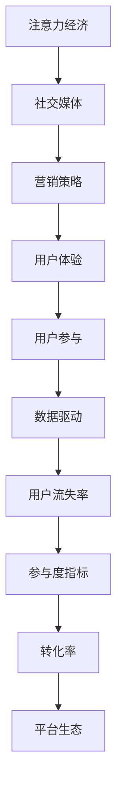

                 

# 注意力经济与社交媒体营销策略与实践：在不牺牲用户体验的情况下吸引受众

> 关键词：注意力经济, 社交媒体, 营销策略, 用户体验, 用户参与, 数据驱动

## 1. 背景介绍

### 1.1 问题由来
在信息爆炸的互联网时代，注意力成为了一种稀缺资源。人们每天都会接触到海量的信息，如何在纷繁复杂的信息流中脱颖而出，成为品牌和内容创作者的核心目标。特别是在社交媒体平台上，如何精准触达并保持用户的注意力，提高营销效率，已成为企业的重要挑战。

### 1.2 问题核心关键点
当前，社交媒体营销的核心在于有效吸引和保持用户的注意力。品牌和内容创作者需要通过精确的策略和创新的实践，在降低用户流失率的同时提升参与度和转化率。本文将详细探讨注意力经济在社交媒体营销中的应用，并给出具体的策略和实践建议。

### 1.3 问题研究意义
深入研究注意力经济与社交媒体营销策略，对于提升品牌在社交媒体平台上的用户参与度、增强用户忠诚度、提高营销转化率具有重要意义。特别是在数据驱动的互联网时代，精准分析和优化用户行为，可以帮助企业实现更高效、更有针对性的社交媒体营销，从而达到良好的商业效果。

## 2. 核心概念与联系

### 2.1 核心概念概述

为更好地理解注意力经济与社交媒体营销的策略与实践，本节将介绍几个密切相关的核心概念：

- **注意力经济**：一种经济模式，旨在通过获取和利用用户的注意力来创造价值。在社交媒体平台上，注意力资源的争夺尤为激烈，如何有效吸引和保持用户注意力是成功的关键。

- **社交媒体**：指基于Web2.0技术，用户可以发布、分享、互动和讨论内容的平台。如微博、微信、抖音等。

- **营销策略**：指在营销活动中采用的一系列计划和行动，旨在实现特定的营销目标。

- **用户体验**：指用户在使用产品或服务过程中的情感和行为反应。优质的用户体验能够显著提升用户满意度和忠诚度。

- **用户参与**：指用户主动与品牌、内容创作者互动的意愿和行为。高用户参与度往往意味着更好的品牌认知和更高的转化率。

- **数据驱动**：指利用数据分析和挖掘结果，指导决策和行动。数据驱动的营销策略可以更加精准地预测用户行为，提升营销效果。

- **用户流失率**：指在一定时间内，用户从平台流失的比例。低用户流失率意味着更高的用户黏性和长期的商业价值。

- **参与度指标**：如点赞、评论、分享、停留时间等，用于衡量用户与内容的互动程度。

- **转化率**：指用户从点击到购买或完成其他目标的转化比例。高转化率表示营销活动的效果显著。

- **平台生态**：指社交媒体平台内不同用户、内容和互动之间的复杂关系。构建良好的平台生态可以提高用户粘性。

这些核心概念之间的逻辑关系可以通过以下Mermaid流程图来展示：



这个流程图展示了几大核心概念及其相互关系：

1. 注意力经济依赖于社交媒体平台来获取用户注意力。
2. 社交媒体上的营销策略直接影响用户体验和用户参与度。
3. 数据驱动可以优化营销策略，提升用户参与度。
4. 良好的用户体验和用户参与度有助于降低用户流失率，提升转化率。
5. 高转化率有助于形成健康的平台生态，进一步增强用户黏性。

## 3. 核心算法原理 & 具体操作步骤
### 3.1 算法原理概述

注意力经济与社交媒体营销的策略与实践，本质上是一个数据驱动的优化过程。其核心思想是：通过分析用户行为数据，精确识别用户兴趣点和需求，制定相应的营销策略，以实现精准触达和保持用户注意力。

形式化地，假设社交媒体平台上有 $N$ 个用户，每个用户 $u_i$ 对于平台上的内容 $c_j$ 有一个注意权重 $w_{ij}$，表示其对内容的关注程度。营销策略的目标是最大化所有用户的注意权重总和，即：

$$
\max \sum_{i=1}^N \sum_{j=1}^M w_{ij}
$$

其中 $M$ 为平台上的内容数量。

营销策略的成功与否，取决于内容的多样性、创新性、互动性和个性化等因素。通过引入用户行为数据，如点击率、停留时间、互动率等，可以更精确地评估和优化这些因素，从而达到最大化用户注意力的目标。

### 3.2 算法步骤详解

基于数据驱动的注意力经济与社交媒体营销策略，一般包括以下几个关键步骤：

**Step 1: 数据收集与分析**
- 收集社交媒体平台上的用户行为数据，如点击记录、互动数据、停留时长等。
- 使用统计分析和机器学习技术，分析用户兴趣、行为模式和潜在需求。

**Step 2: 用户细分与标签**
- 将用户分为不同细分市场，如年龄、性别、地域、兴趣等。
- 为每个细分市场打上特定的标签，以便进行精确投放。

**Step 3: 内容优化与推送**
- 根据用户兴趣和行为数据，优化内容的多样性和创新性。
- 使用推荐算法，针对不同用户群体推送个性化的内容。

**Step 4: 互动增强与用户参与**
- 设计互动性强的内容，如投票、问答、直播等，增强用户参与度。
- 实施激励机制，如优惠券、积分、抽奖等，吸引用户参与。

**Step 5: 效果监测与迭代优化**
- 实时监测用户参与度、转化率等指标，评估营销效果。
- 根据反馈数据不断调整策略，优化内容与互动方式。

**Step 6: 用户反馈与满意度调查**
- 定期进行用户满意度调查，收集用户反馈。
- 根据用户反馈改进内容与互动策略，提升用户体验。

### 3.3 算法优缺点

基于数据驱动的社交媒体营销策略具有以下优点：
1. 精准高效：通过数据分析，可以更精确地识别用户兴趣，实现精准触达和保持用户注意力。
2. 动态优化：根据实时数据反馈，持续优化营销策略，提升效果。
3. 多渠道融合：结合社交媒体、邮件、短信等多渠道资源，实现全面的用户触达。
4. 用户参与度高：通过互动性强的内容和激励机制，增强用户粘性和参与度。

同时，该方法也存在一定的局限性：
1. 数据隐私问题：用户数据的收集和使用需要遵循隐私保护法规，确保数据安全。
2. 数据质量问题：用户行为数据的准确性和完整性直接影响策略的效果。
3. 算法复杂度：数据分析和优化需要较高计算资源和专业知识。
4. 用户多样性：用户行为模式多样，单一策略可能难以覆盖所有用户群体。

尽管存在这些局限性，但就目前而言，基于数据驱动的社交媒体营销策略仍是最主流范式。未来相关研究的重点在于如何进一步降低策略的复杂度和成本，提高策略的普适性和可操作性，同时兼顾用户隐私和数据安全。

### 3.4 算法应用领域

基于数据驱动的社交媒体营销策略，在多个领域得到了广泛应用，例如：

- 电子商务：通过精准的个性化推荐，提高用户购买转化率。
- 旅游行业：根据用户兴趣推荐旅游目的地和活动，提升用户参与度。
- 在线教育：个性化推送学习内容和互动活动，提高用户学习效果。
- 金融服务：针对不同用户群体推送定制化理财和投资信息，提升用户忠诚度。
- 娱乐行业：通过互动性内容吸引用户参与，提高品牌曝光度和用户黏性。
- 健康医疗：推送个性化健康建议和互动活动，提升用户健康意识和参与度。

除了上述这些经典应用外，社交媒体营销策略还被创新性地应用到更多场景中，如可控内容生成、智能客服、用户推荐系统等，为社交媒体平台带来了新的活力。随着数据驱动技术的不断进步，相信社交媒体营销策略必将在更广泛的领域发挥重要作用。

## 4. 数学模型和公式 & 详细讲解  
### 4.1 数学模型构建

本节将使用数学语言对基于数据驱动的社交媒体营销策略进行更加严格的刻画。

假设社交媒体平台上有 $N$ 个用户，每个用户 $u_i$ 对于平台上的内容 $c_j$ 有一个注意权重 $w_{ij}$，表示其对内容的关注程度。设 $D=\{(x_i, y_i)\}_{i=1}^N$ 为收集到的用户行为数据，其中 $x_i$ 为内容特征向量，$y_i$ 为用户对内容的反馈，如点击、互动、停留时间等。

定义用户 $u_i$ 的总注意权重为：

$$
W_i = \sum_{j=1}^M w_{ij}
$$

营销策略的目标是最大化所有用户的总注意权重：

$$
\max \sum_{i=1}^N W_i
$$

在实践中，我们通常使用基于梯度的优化算法（如SGD、Adam等）来近似求解上述最优化问题。设 $\eta$ 为学习率，$\lambda$ 为正则化系数，则参数的更新公式为：

$$
w_{ij} \leftarrow w_{ij} - \eta \nabla_{w_{ij}} \mathcal{L}(w)
$$

其中 $\nabla_{w_{ij}} \mathcal{L}(w)$ 为损失函数对注意权重 $w_{ij}$ 的梯度，可通过反向传播算法高效计算。

### 4.2 公式推导过程

以下我们以电商平台的个性化推荐为例，推导推荐系统的损失函数及其梯度的计算公式。

假设推荐系统给用户 $u_i$ 推荐了 $M$ 个产品 $p_j$，用户对于产品 $p_j$ 的评分 $r_{ij}$ 为 $0$ 到 $1$ 之间的实数。推荐系统希望最大化用户对推荐的满意度，即：

$$
\max \sum_{i=1}^N \sum_{j=1}^M r_{ij} w_{ij}
$$

为了简化问题，我们只考虑用户与产品的直接评分，忽略其他特征。推荐系统使用神经网络模型 $f_{\theta}$ 将用户行为 $x_i$ 映射为对产品的评分 $r_{ij}$，即：

$$
r_{ij} = f_{\theta}(x_i; p_j)
$$

其中 $\theta$ 为模型的可训练参数。推荐系统的总损失函数 $\mathcal{L}$ 定义为：

$$
\mathcal{L}(\theta) = \sum_{i=1}^N \sum_{j=1}^M [r_{ij} w_{ij} - \log f_{\theta}(x_i; p_j)]
$$

根据链式法则，损失函数对参数 $\theta_k$ 的梯度为：

$$
\frac{\partial \mathcal{L}(\theta)}{\partial \theta_k} = -\sum_{i=1}^N \sum_{j=1}^M \frac{\partial r_{ij}}{\partial x_i} \frac{\partial x_i}{\partial \theta_k}
$$

其中 $\frac{\partial r_{ij}}{\partial x_i}$ 为评分函数对用户行为的梯度，可由反向传播算法高效计算。

在得到损失函数的梯度后，即可带入参数更新公式，完成模型的迭代优化。重复上述过程直至收敛，最终得到最优的推荐模型参数 $\theta^*$。

## 5. 项目实践：代码实例和详细解释说明
### 5.1 开发环境搭建

在进行社交媒体营销策略的开发实践中，我们需要准备好开发环境。以下是使用Python进行PyTorch开发的环境配置流程：

1. 安装Anaconda：从官网下载并安装Anaconda，用于创建独立的Python环境。

2. 创建并激活虚拟环境：
```bash
conda create -n pytorch-env python=3.8 
conda activate pytorch-env
```

3. 安装PyTorch：根据CUDA版本，从官网获取对应的安装命令。例如：
```bash
conda install pytorch torchvision torchaudio cudatoolkit=11.1 -c pytorch -c conda-forge
```

4. 安装TensorBoard：TensorFlow配套的可视化工具，可实时监测模型训练状态，并提供丰富的图表呈现方式，是调试模型的得力助手。

5. 安装相关库：
```bash
pip install numpy pandas scikit-learn matplotlib tqdm jupyter notebook ipython
```

完成上述步骤后，即可在`pytorch-env`环境中开始营销策略的开发实践。

### 5.2 源代码详细实现

下面以电商平台的个性化推荐系统为例，给出使用PyTorch进行用户行为分析和个性化推荐优化的代码实现。

首先，定义推荐系统的数据处理函数：

```python
import torch
import torch.nn as nn
import torch.nn.functional as F

class RecommendationModel(nn.Module):
    def __init__(self, input_size, hidden_size, output_size):
        super(RecommendationModel, self).__init__()
        self.fc1 = nn.Linear(input_size, hidden_size)
        self.fc2 = nn.Linear(hidden_size, output_size)

    def forward(self, x):
        x = F.relu(self.fc1(x))
        x = self.fc2(x)
        return x

def calculate_mse_loss(y_true, y_pred):
    return torch.mean((y_true - y_pred) ** 2)

def train_model(model, optimizer, train_loader, num_epochs):
    model.train()
    for epoch in range(num_epochs):
        total_loss = 0.0
        for batch in train_loader:
            optimizer.zero_grad()
            x, y_true = batch
            y_pred = model(x)
            loss = calculate_mse_loss(y_true, y_pred)
            loss.backward()
            optimizer.step()
            total_loss += loss.item()
        print(f"Epoch {epoch+1}, train loss: {total_loss/len(train_loader)}")
```

然后，定义模型和优化器：

```python
input_size = 20 # 假设用户行为特征为20维
hidden_size = 64
output_size = 10 # 假设推荐产品数量为10

model = RecommendationModel(input_size, hidden_size, output_size)
optimizer = torch.optim.Adam(model.parameters(), lr=0.001)
```

接着，定义训练和评估函数：

```python
def evaluate_model(model, test_loader):
    model.eval()
    total_loss = 0.0
    with torch.no_grad():
        for batch in test_loader:
            x, y_true = batch
            y_pred = model(x)
            loss = calculate_mse_loss(y_true, y_pred)
            total_loss += loss.item()
    print(f"Test loss: {total_loss/len(test_loader)}")
```

最后，启动训练流程并在测试集上评估：

```python
num_epochs = 10
batch_size = 32
train_loader = # 假设有数据的DataLoader
test_loader = # 假设有数据的DataLoader

train_model(model, optimizer, train_loader, num_epochs)
evaluate_model(model, test_loader)
```

以上就是使用PyTorch对电商平台的个性化推荐系统进行优化的完整代码实现。可以看到，PyTorch提供了强大的模块化编程接口，使得推荐系统模型的构建和优化过程变得简洁高效。

### 5.3 代码解读与分析

让我们再详细解读一下关键代码的实现细节：

**RecommendationModel类**：
- `__init__`方法：初始化推荐模型的全连接层。
- `forward`方法：定义模型的前向传播计算过程。

**calculate_mse_loss函数**：
- 定义均方误差损失函数，用于评估推荐模型对用户行为的预测精度。

**train_model函数**：
- 定义训练过程，包括初始化模型、定义损失函数、反向传播和优化。
- 在每个epoch内，对训练集数据进行迭代优化，并输出每个epoch的平均损失。

**evaluate_model函数**：
- 定义评估过程，包括模型前向传播和损失计算。
- 在测试集上评估模型的预测精度，并输出测试集的平均损失。

**训练流程**：
- 定义总的epoch数和批大小，开始循环迭代
- 每个epoch内，先在训练集上训练，输出每个epoch的平均损失
- 在测试集上评估，输出测试集的平均损失

可以看到，PyTorch框架的简单易用性，使得推荐系统的开发和优化过程变得非常直观。开发者可以将更多精力放在数据预处理、模型优化等高层逻辑上，而不必过多关注底层的实现细节。

当然，工业级的系统实现还需考虑更多因素，如模型的保存和部署、超参数的自动搜索、更灵活的任务适配层等。但核心的优化算法和损失函数计算过程基本与此类似。

## 6. 实际应用场景
### 6.1 社交媒体平台

基于数据驱动的个性化推荐策略，可以广泛应用于社交媒体平台的用户互动与内容推送。例如：

- 微博、抖音等平台上的内容推荐：根据用户浏览和互动数据，推送可能感兴趣的文章、视频和商品。
- 微信公众号的文章推荐：根据用户阅读行为和反馈数据，推送相关领域的文章和热点。
- Instagram上的图片推荐：根据用户点赞、评论和分享数据，推送可能感兴趣的图片和用户。

### 6.2 电子商务

在电子商务领域，个性化推荐策略可以显著提升用户的购买转化率和满意度。例如：

- 亚马逊、京东等电商平台上的商品推荐：根据用户浏览历史和购买记录，推送相关商品和优惠活动。
- 美团、大众点评等平台上的餐饮推荐：根据用户评价和评论，推送可能感兴趣的餐厅和美食。
- 携程、去哪儿等平台上的旅行推荐：根据用户搜索历史和预订记录，推送相关目的地和活动。

### 6.3 在线教育

在线教育平台可以借助个性化推荐策略，提高学习效果和用户黏性。例如：

- Coursera、edX等平台上的课程推荐：根据用户的学习行为和反馈数据，推送相关课程和资料。
- Khan Academy、TED-Ed等平台上的视频推荐：根据用户的观看行为和评分，推送可能感兴趣的视频和话题。
- Udemy、网易云课堂等平台上的课程推荐：根据用户的互动和评分数据，推送相关课程和专家。

### 6.4 金融服务

金融服务领域可以通过个性化推荐策略，提升用户忠诚度和理财效果。例如：

- 支付宝、微信支付等平台上的理财产品推荐：根据用户的消费行为和投资偏好，推送相关理财产品和理财建议。
- 招商银行、平安银行等银行的信用卡推荐：根据用户的消费习惯和信用记录，推送相关信用卡和优惠活动。
- 雪球、同花顺等平台上的股市推荐：根据用户的交易记录和关注事件，推送相关股票和市场信息。

### 6.5 娱乐行业

娱乐行业可以通过个性化推荐策略，提升用户参与度和品牌曝光度。例如：

- Netflix、腾讯视频等平台上的影视推荐：根据用户的观看历史和评分数据，推送相关影视作品和影视剧集。
- Bilibili、优酷等平台上的UP主推荐：根据用户的互动和订阅数据，推送相关UP主和视频内容。
- Spotify、网易云音乐等平台上的音乐推荐：根据用户的听歌行为和评分数据，推送相关音乐和歌手。

### 6.6 健康医疗

健康医疗领域可以通过个性化推荐策略，提升用户的健康意识和参与度。例如：

- 丁香医生、好大夫在线等平台的健康建议推荐：根据用户的健康数据和咨询记录，推送相关健康建议和科普文章。
- 健康中国、人民日报等平台上的健康资讯推荐：根据用户的阅读行为和反馈数据，推送相关健康资讯和科普文章。
- 优医佳、春雨医生等平台上的医生推荐：根据用户的健康咨询和评价数据，推送相关医生和专家。

除了上述这些经典应用外，个性化推荐策略还被创新性地应用到更多场景中，如可控内容生成、智能客服、用户推荐系统等，为社交媒体平台带来了新的活力。随着数据驱动技术的不断进步，相信个性化推荐策略必将在更广泛的领域发挥重要作用。

## 7. 工具和资源推荐
### 7.1 学习资源推荐

为了帮助开发者系统掌握个性化推荐策略的理论基础和实践技巧，这里推荐一些优质的学习资源：

1. 《推荐系统实践》系列博文：由KDD Cup冠军团队撰写，深入浅出地介绍了推荐系统的发展历程、模型算法和工程实践。

2. 《深度学习与推荐系统》课程：斯坦福大学开设的深度学习课程，详细讲解了推荐系统的基础理论和前沿算法。

3. 《个性化推荐算法》书籍：介绍了多种推荐算法，包括协同过滤、内容过滤、混合过滤等，并提供了实际案例分析。

4. The Best of Recommendation Systems：一个推荐系统领域的经典博客集合，涵盖了多种推荐算法和前沿研究。

5. 《推荐系统算法与实战》书籍：结合理论和实战，介绍了推荐系统的多种算法和工程实现。

通过对这些资源的学习实践，相信你一定能够快速掌握个性化推荐策略的精髓，并用于解决实际的社交媒体营销问题。

### 7.2 开发工具推荐

高效的开发离不开优秀的工具支持。以下是几款用于个性化推荐策略开发的常用工具：

1. PyTorch：基于Python的开源深度学习框架，灵活动态的计算图，适合快速迭代研究。推荐系统的多种模型都有PyTorch版本的实现。

2. TensorFlow：由Google主导开发的开源深度学习框架，生产部署方便，适合大规模工程应用。推荐系统的多种模型也有TensorFlow版本的实现。

3. LightFM：Facebook开发的推荐系统框架，支持多种模型和特征工程，易于部署和优化。

4. Surprise：一个基于Python的推荐系统库，提供了多种推荐算法和评估指标。

5. Orange：一个用户友好的数据挖掘和可视化工具，可以快速构建推荐系统的训练和评估流程。

6. Jupyter Notebook：一个强大的交互式编程环境，支持Python、R等多种编程语言，适合数据探索和模型开发。

合理利用这些工具，可以显著提升个性化推荐策略的开发效率，加快创新迭代的步伐。

### 7.3 相关论文推荐

个性化推荐策略的发展源于学界的持续研究。以下是几篇奠基性的相关论文，推荐阅读：

1. Collaborative Filtering for Implicit Feedback Datasets：提出协同过滤推荐算法，利用用户行为数据进行推荐。

2. Factorization Machines for Recommender Systems：引入矩阵分解技术，提升推荐系统的准确性和泛化能力。

3. Deep Neural Networks for Recommender Systems：结合深度学习技术，提升推荐系统的复杂度和表现。

4. Mixing Personalization Levels in Recommender Systems：提出混合推荐算法，结合协同过滤和内容过滤，提升推荐效果。

5. A Web-scale Matrix Factorization Technique：提出Web-scale矩阵分解技术，优化推荐系统在大规模数据上的性能。

6. Boosting Personalized Recommendations with Denoising Auto-Encoders：结合自编码器技术，提升推荐系统的去噪能力和表现。

这些论文代表了个性化推荐策略的发展脉络。通过学习这些前沿成果，可以帮助研究者把握学科前进方向，激发更多的创新灵感。

## 8. 总结：未来发展趋势与挑战

### 8.1 总结

本文对基于数据驱动的个性化推荐策略进行了全面系统的介绍。首先阐述了注意力经济在社交媒体平台上的应用背景和意义，明确了个性化推荐策略在提升用户参与度、降低用户流失率、提高转化率等方面的重要作用。其次，从原理到实践，详细讲解了推荐系统的数学模型和算法步骤，给出了推荐系统优化的代码实例。同时，本文还广泛探讨了个性化推荐策略在电商、旅游、教育、金融、娱乐、健康等多个领域的应用场景，展示了其在各行各业中的广泛适用性。此外，本文精选了个性化推荐策略的学习资源、开发工具和相关论文，力求为读者提供全方位的技术指引。

通过本文的系统梳理，可以看到，个性化推荐策略已经在社交媒体营销中取得了显著成效，显著提升了用户参与度和品牌曝光度。未来，伴随深度学习、自然语言处理等技术的不断进步，个性化推荐策略必将在更多领域得到应用，为社交媒体平台带来新的活力。

### 8.2 未来发展趋势

展望未来，个性化推荐策略将呈现以下几个发展趋势：

1. 多模态推荐：结合文本、图像、视频等多模态数据，提升推荐系统的表现和多样性。

2. 实时推荐：利用流式数据处理技术，实现实时推荐，提升用户参与度和满意度。

3. 跨平台推荐：结合不同平台的用户行为数据，实现跨平台推荐，提升用户粘性和品牌认知。

4. 冷启动问题：通过用户画像和社交网络等手段，解决冷启动推荐中的用户行为缺失问题。

5. 隐私保护：采用差分隐私等技术，保护用户隐私，提升推荐系统可信度。

6. 公平推荐：引入公平性指标，避免推荐系统中存在偏见和歧视，提升推荐系统的公平性。

7. 推荐系统融合：与其他智能技术（如自然语言处理、知识图谱）结合，实现更加智能化的推荐系统。

以上趋势凸显了个性化推荐策略的广阔前景。这些方向的探索发展，必将进一步提升推荐系统的性能和应用范围，为社交媒体平台带来新的变革。

### 8.3 面临的挑战

尽管个性化推荐策略已经取得了瞩目成就，但在迈向更加智能化、普适化应用的过程中，它仍面临着诸多挑战：

1. 数据质量问题：推荐系统的效果很大程度上依赖于用户行为数据的质量，数据缺失和不准确会严重影响推荐效果。如何获取高质量、真实可信的用户行为数据，是亟待解决的问题。

2. 算法复杂度问题：推荐系统通常包含复杂的算法模型，计算资源和计算时间开销较大。如何在保证效果的同时，降低算法复杂度，实现轻量级部署，是未来研究的重要方向。

3. 用户多样性问题：不同用户的兴趣和需求差异较大，单一的推荐策略可能难以覆盖所有用户群体。如何设计更加灵活的推荐算法，实现个性化推荐，是未来的挑战之一。

4. 隐私保护问题：用户行为数据的收集和使用需要遵循隐私保护法规，确保数据安全。如何在推荐系统中实现隐私保护，同时保证推荐效果，是未来的重要研究方向。

5. 公平推荐问题：推荐系统中的偏见和歧视问题可能会对某些用户群体产生不公平影响。如何设计公平性指标，避免推荐系统中的偏见和歧视，是未来的重要研究方向。

6. 冷启动问题：新用户的初始行为数据较少，难以进行准确推荐。如何利用用户画像和社交网络等手段，解决冷启动推荐中的用户行为缺失问题，是未来的重要研究方向。

这些挑战表明，个性化推荐策略的未来发展仍需要不断突破和创新。相信通过技术进步和经验积累，这些问题将逐步得到解决，个性化推荐策略必将在社交媒体营销中发挥更大的作用。

### 8.4 研究展望

面对个性化推荐策略所面临的挑战，未来的研究需要在以下几个方面寻求新的突破：

1. 探索多模态推荐方法：结合文本、图像、视频等多模态数据，提升推荐系统的表现和多样性。

2. 研究实时推荐技术：利用流式数据处理技术，实现实时推荐，提升用户参与度和满意度。

3. 开发跨平台推荐算法：结合不同平台的用户行为数据，实现跨平台推荐，提升用户粘性和品牌认知。

4. 引入公平推荐指标：引入公平性指标，避免推荐系统中存在偏见和歧视，提升推荐系统的公平性。

5. 实现轻量级推荐系统：在保证效果的同时，降低算法复杂度，实现轻量级部署。

6. 解决冷启动问题：通过用户画像和社交网络等手段，解决冷启动推荐中的用户行为缺失问题。

7. 增强隐私保护机制：采用差分隐私等技术，保护用户隐私，提升推荐系统可信度。

这些研究方向的探索，必将引领个性化推荐策略迈向更高的台阶，为社交媒体平台带来新的活力。面向未来，个性化推荐策略还需要与其他智能技术进行更深入的融合，如自然语言处理、知识图谱等，多路径协同发力，共同推动社交媒体平台的技术进步和用户体验优化。

## 9. 附录：常见问题与解答

**Q1：如何衡量个性化推荐策略的效果？**

A: 推荐策略的效果可以从多个维度进行衡量，主要包括：

1. 用户参与度：如点击率、互动率、停留时间等，表示用户对推荐的响应和互动程度。
2. 转化率：表示用户从点击到完成购买或转化的比例，反映推荐策略的实际转化效果。
3. 满意度：通过用户反馈和满意度调查，评估用户对推荐内容的满意度和体验。
4. 覆盖率：表示推荐内容覆盖用户兴趣和需求的程度，反映推荐策略的多样性和全面性。

常用的评估指标包括精确率、召回率、F1值、平均排名等，具体应用场景需要根据业务需求选择合适的指标。

**Q2：个性化推荐系统在多模态数据融合中的应用？**

A: 多模态数据融合是指结合文本、图像、视频等多模态数据，提升推荐系统的表现和多样性。具体应用方法包括：

1. 特征融合：将不同模态的数据特征进行拼接或融合，形成统一的输入向量。例如，将用户评论和图片内容特征拼接，作为推荐模型的输入。

2. 注意力机制：引入注意力机制，根据不同模态数据的重要性，动态调整推荐策略。例如，在图片推荐中，赋予图片特征更高的权重，提升推荐效果。

3. 联合训练：将不同模态的推荐模型联合训练，优化多模态数据的表现。例如，将文本推荐模型和图像推荐模型联合训练，提升推荐系统的多样性。

4. 多任务学习：将不同模态的推荐任务联合训练，提升推荐系统的泛化能力和表现。例如，将文本推荐和图像推荐任务联合训练，提升推荐系统的综合效果。

多模态推荐系统可以更好地利用用户的多维数据，提升推荐效果和用户体验。

**Q3：个性化推荐系统在实时推荐中的应用？**

A: 实时推荐是指利用流式数据处理技术，实现实时推荐，提升用户参与度和满意度。具体应用方法包括：

1. 实时数据收集：通过实时日志、事件流等手段，收集用户行为数据。例如，实时记录用户点击、停留、互动等数据。

2. 实时数据处理：利用流式数据处理框架（如Spark Streaming、Kafka等），实时处理用户行为数据。例如，实时分析用户点击记录，生成推荐内容。

3. 实时推荐算法：设计实时推荐算法，动态调整推荐内容。例如，实时分析用户点击记录，生成相关推荐商品或内容。

4. 实时反馈优化：实时收集用户反馈数据，动态调整推荐策略。例如，实时分析用户点击记录和反馈数据，优化推荐内容。

实时推荐可以及时响应用户行为，提升用户体验和满意度。

**Q4：个性化推荐系统在跨平台推荐中的应用？**

A: 跨平台推荐是指结合不同平台的用户行为数据，实现跨平台推荐，提升用户粘性和品牌认知。具体应用方法包括：

1. 数据整合：将不同平台的用户行为数据进行整合，形成统一的推荐数据集。例如，将电商平台的浏览记录和社交平台的用户互动数据整合，生成推荐内容。

2. 用户画像：根据不同平台的用户行为数据，构建用户画像。例如，结合电商平台的浏览记录和社交平台的用户互动数据，构建综合用户画像。

3. 推荐算法：设计跨平台推荐算法，优化多平台推荐效果。例如，结合电商平台和社交平台的推荐算法，生成跨平台推荐内容。

4. 数据共享：利用用户画像和跨平台推荐算法，实现不同平台之间的数据共享。例如，电商平台的推荐内容可以在社交平台上进行推荐，提升用户粘性和品牌认知。

跨平台推荐可以提升用户粘性和品牌认知，提升用户满意度和品牌曝光度。

**Q5：个性化推荐系统在冷启动推荐中的应用？**

A: 冷启动推荐是指对新用户进行推荐，由于用户行为数据较少，难以进行准确推荐。具体应用方法包括：

1. 用户画像：通过用户信息、社交网络、兴趣标签等手段，构建用户画像。例如，根据新用户的社交网络信息和兴趣标签，生成推荐内容。

2. 推荐算法：设计冷启动推荐算法，优化新用户推荐效果。例如，结合用户画像和推荐算法，生成冷启动推荐内容。

3. 推荐策略：采用多样化和互动性强的推荐策略，提升新用户推荐效果。例如，在推荐系统中加入搜索和过滤功能，提升新用户推荐效果。

4. 用户反馈：实时收集新用户反馈数据，动态调整推荐策略。例如，实时分析新用户的点击记录和反馈数据，优化推荐内容。

冷启动推荐可以解决新用户推荐中的数据缺失问题，提升用户满意度和转化率。

**Q6：个性化推荐系统在隐私保护中的应用？**

A: 隐私保护是指在推荐系统中，保护用户隐私，确保数据安全。具体应用方法包括：

1. 数据匿名化：将用户行为数据进行匿名化处理，保护用户隐私。例如，对用户ID进行去标识化处理，保护用户隐私。

2. 差分隐私：利用差分隐私技术，保护用户隐私。例如，通过添加噪声的方式，保护用户数据隐私。

3. 数据加密：对用户行为数据进行加密处理，保护数据安全。例如，对用户行为数据进行加密存储和传输。

4. 用户控制：赋予用户数据控制权，让用户自主选择是否分享数据。例如，让用户自主选择是否分享推荐数据。

隐私保护可以保护用户数据隐私，提升用户信任和推荐系统可信度。

通过本文的系统梳理，可以看到，个性化推荐策略已经在社交媒体营销中取得了显著成效，显著提升了用户参与度和品牌曝光度。未来，伴随深度学习、自然语言处理等技术的不断进步，个性化推荐策略必将在更多领域得到应用，为社交媒体平台带来新的活力。相信通过技术进步和经验积累，推荐系统所面临的挑战将逐步得到解决，个性化推荐策略必将在社交媒体营销中发挥更大的作用。

---

作者：禅与计算机程序设计艺术 / Zen and the Art of Computer Programming

