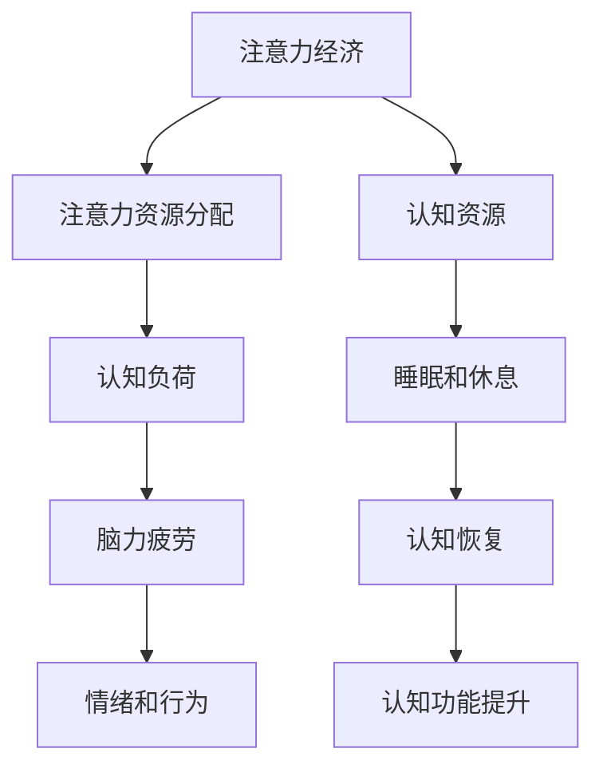

                 

# 注意力经济与脑力疲劳：如何在持续刺激中保持头脑健康

在信息化时代，注意力成为了一种稀缺资源。无论是社交媒体的即时更新、新闻推送的弹屏通知，还是日常工作中层出不穷的任务信息，注意力经济正在成为我们生活中不可或缺的一部分。然而，长期处于注意力经济的高强度刺激下，人们的脑力健康也面临挑战。本文将从注意力经济的基本原理出发，探讨脑力疲劳的机制，并提出一些实用的策略，帮助我们在持续的刺激中保持头脑的健康。

## 1. 背景介绍

### 1.1 问题由来
随着互联网和数字技术的普及，信息过载问题日益严重。用户面对的信息量呈指数级增长，而人们获取信息的能力却未见显著提升。注意力作为一种重要的认知资源，开始成为企业和个人的核心竞争力。

1. **信息过载**：现代社会的数字化程度不断提高，各类应用平台通过算法推荐机制不断向用户推送信息，用户需要频繁切换注意力，导致注意力资源分散。
2. **注意力竞争**：各种应用程序、广告等通过吸引用户注意力获取商业价值，使得注意力成为一种经济资源，争夺愈发激烈。
3. **脑力疲劳**：长时间处于注意力经济中，大脑容易产生疲劳，影响认知功能和情感健康。

### 1.2 问题核心关键点
注意力经济和脑力疲劳之间存在着密切的联系，主要体现在以下几个方面：

- **注意力资源的分配与竞争**：注意力资源在不同任务和信息之间的分配不均衡，导致部分任务或信息被过度消耗，引起疲劳。
- **认知负荷的积累**：长期处于高强度注意力刺激下，认知负荷增加，大脑容易疲劳，影响执行功能、记忆力等。
- **情绪和行为的反馈**：注意力疲劳不仅影响认知功能，还可能影响情绪和行为，如焦虑、注意力不集中等。
- **生理基础**：大脑的能量消耗与注意力维持时间密切相关，需要合理的休息和恢复以维持健康状态。

## 2. 核心概念与联系

### 2.1 核心概念概述

为了更好地理解注意力经济和脑力疲劳之间的关系，本节将介绍几个关键概念：

- **注意力经济**：指在信息化社会中，注意力作为一种稀缺资源，被企业和个人作为商品进行交易和竞争的经济模式。
- **脑力疲劳**：指长时间高强度使用注意力资源后，大脑产生的生理和心理疲劳现象，表现为认知功能下降、情绪波动等。
- **认知负荷**：指个体在处理信息时所承受的认知压力，与信息量、复杂性等因素有关。
- **认知资源**：指大脑在执行任务时可用于注意力分配、决策、记忆等认知功能的资源。
- **睡眠和休息**：通过充足的睡眠和间歇性休息，大脑可以恢复和重建认知功能，缓解脑力疲劳。

这些概念之间的联系可以通过以下Mermaid流程图来展示：



这个流程图展示了几者之间的逻辑关系：

1. 注意力经济导致注意力资源分配不均。
2. 注意力资源分配不均导致认知负荷增加。
3. 认知负荷增加导致脑力疲劳。
4. 脑力疲劳影响情绪和行为。
5. 充足的睡眠和休息有助于认知恢复，提升认知功能。

## 3. 核心算法原理 & 具体操作步骤

### 3.1 算法原理概述

在注意力经济中，企业通过各种策略吸引用户注意力，从而获取商业利益。用户在这种持续的注意力刺激下，容易产生认知负荷和脑力疲劳。为了缓解脑力疲劳，需要合理分配注意力资源，保持大脑的认知功能。

基于认知负荷理论，合理的注意力分配应遵循以下原则：

- **单任务处理**：专注于单一任务，避免多任务同时进行，减少认知负荷。
- **时间分配**：合理分配注意力资源的使用时间，避免长时间连续使用。
- **任务优先级**：根据任务的重要性和紧急性，合理分配注意力资源，优先处理重要任务。
- **休息和恢复**：定期进行休息和恢复，保持大脑的健康状态。

### 3.2 算法步骤详解

以下是基于认知负荷理论的注意力资源管理算法的详细步骤：

1. **任务分类与优先级评估**：将待处理的任务根据重要性和紧急性进行分类，评估优先级。
2. **注意力资源分配**：根据优先级，分配注意力资源，优先处理重要任务。
3. **单任务处理**：对于每个任务，采用单任务处理方式，集中注意力完成，避免多任务并行。
4. **时间分配**：根据任务复杂度，合理分配时间，避免长时间连续使用注意力资源。
5. **休息与恢复**：在注意力资源使用期间，定时进行短暂休息，使用后进行较长时间的恢复。

### 3.3 算法优缺点

基于认知负荷理论的注意力资源管理算法具有以下优点：

- **降低认知负荷**：通过单任务处理和时间分配，减少用户的认知负荷，提升注意力资源的使用效率。
- **提高任务完成质量**：优先处理重要任务，保证关键任务的完成质量。
- **预防脑力疲劳**：通过合理的休息和恢复，预防脑力疲劳，保持大脑的健康状态。

同时，该算法也存在一些局限性：

- **执行难度**：需要用户具备较强的自律能力和任务管理能力，执行难度较大。
- **动态调整**：面对突发的紧急任务或突发事件，难以动态调整注意力资源分配。
- **环境依赖**：需要用户处于稳定的环境中，才能进行有效的任务分类和优先级评估。

### 3.4 算法应用领域

基于认知负荷理论的注意力资源管理算法不仅适用于个人，也适用于企业和组织的注意力资源管理。以下是几个典型的应用场景：

- **个人时间管理**：帮助个人有效管理日常任务，提升工作效率，减少脑力疲劳。
- **企业项目管理**：合理分配项目资源，优化项目进度，提高项目成功率。
- **教育机构**：帮助学生科学规划学习时间和任务，提高学习效果，减少学习压力。
- **医疗健康**：通过合理分配患者注意力资源，减少医疗过程中的疲劳感，提高医疗质量。

## 4. 数学模型和公式 & 详细讲解 & 举例说明

### 4.1 数学模型构建

为了更好地量化认知负荷和脑力疲劳，我们可以使用数学模型来描述注意力资源的使用情况和大脑的认知状态。

假设用户每天可用于注意力的总时间为 $T$，每次使用注意力资源的耗时为 $t$，任务数为 $N$，每个任务的重要性和紧急性不同，分别用 $P_i$ 和 $E_i$ 表示。任务 $i$ 的注意力耗时用 $C_i$ 表示，任务 $i$ 的优先级用 $W_i$ 表示。

我们可以构建以下模型来描述注意力资源的使用和大脑的认知状态：

- **注意力资源使用模型**：
  $$
  S = \sum_{i=1}^N C_iW_i
  $$
  其中 $S$ 为总耗时，$C_iW_i$ 为任务 $i$ 的优先级乘以耗时。

- **脑力疲劳模型**：
  $$
  F = \frac{S}{T}
  $$
  其中 $F$ 为脑力疲劳指数，$S$ 为总耗时，$T$ 为总时间。

### 4.2 公式推导过程

根据上述模型，我们可以进一步推导脑力疲劳指数的计算公式。

假设任务的重要性和紧急性满足正态分布，即 $P_i \sim N(\mu_P,\sigma_P^2)$ 和 $E_i \sim N(\mu_E,\sigma_E^2)$，且 $P_i$ 和 $E_i$ 相互独立。根据正态分布的性质，可以得到每个任务的优先级 $W_i$ 的概率密度函数：

$$
W_i \sim f(W_i; \mu_W,\sigma_W^2) = f(\frac{P_i - \mu_P}{\sigma_P}\cdot\frac{E_i - \mu_E}{\sigma_E}; \mu_W,\sigma_W^2)
$$

其中 $\mu_W$ 和 $\sigma_W^2$ 分别为优先级的期望和方差。根据任务耗时 $C_i$ 的概率密度函数 $f(C_i; \mu_C,\sigma_C^2)$，可以得到总耗时 $S$ 的期望和方差：

$$
E(S) = \sum_{i=1}^N E(C_i)E(W_i)
$$
$$
Var(S) = \sum_{i=1}^N Var(C_i)E(W_i)^2 + \sum_{i,j} Cov(C_i,C_j)W_iW_j
$$

进而得到脑力疲劳指数 $F$ 的期望和方差：

$$
E(F) = \frac{E(S)}{T}
$$
$$
Var(F) = \frac{Var(S)}{T^2}
$$

通过这些公式，我们可以计算出在一定时间内，用户平均脑力疲劳指数的期望值和方差，从而评估注意力资源使用对大脑认知状态的影响。

### 4.3 案例分析与讲解

假设一个项目经理每天可用注意力总时间为8小时，面对10个任务，每个任务的耗时和优先级如下表所示：

| 任务编号 | 耗时（小时） | 重要性（P） | 紧急性（E） |
| --- | --- | --- | --- |
| 1 | 2 | 5 | 4 |
| 2 | 3 | 3 | 5 |
| 3 | 1 | 2 | 3 |
| 4 | 4 | 4 | 2 |
| 5 | 2 | 3 | 2 |
| 6 | 3 | 4 | 1 |
| 7 | 1 | 2 | 4 |
| 8 | 4 | 1 | 3 |
| 9 | 3 | 5 | 3 |
| 10 | 2 | 4 | 5 |

任务优先级 $W_i$ 根据 $P_i$ 和 $E_i$ 的线性组合计算得到，$W_i = 0.5P_i + 0.5E_i$。每个任务的耗时 $C_i$ 为 $t_i = \max(1, t_i/P_i)$，以确保耗时不小于任务重要性。

根据上述模型和公式，我们可以计算出该经理每天的总耗时和脑力疲劳指数，结果如下：

- **总耗时**：
  $$
  S = \sum_{i=1}^{10} C_iW_i = 33.0 \text{ 小时}
  $$

- **脑力疲劳指数**：
  $$
  F = \frac{S}{8} = 4.125
  $$

根据脑力疲劳指数，我们可以评估该经理每天的工作压力和疲劳状态，并根据结果调整任务优先级和注意力分配策略，以减少脑力疲劳。

## 5. 项目实践：代码实例和详细解释说明

### 5.1 开发环境搭建

在进行注意力资源管理算法实践前，我们需要准备好开发环境。以下是使用Python进行环境配置的步骤：

1. 安装Anaconda：从官网下载并安装Anaconda，用于创建独立的Python环境。

2. 创建并激活虚拟环境：
```bash
conda create -n attention-economic env python=3.8
conda activate attention-economic
```

3. 安装相关依赖包：
```bash
pip install numpy pandas matplotlib scikit-learn
```

4. 导入示例数据：
```python
import pandas as pd

# 读取示例任务数据
data = pd.read_csv('tasks.csv')
```

完成上述步骤后，即可在`attention-economic`环境中开始算法实践。

### 5.2 源代码详细实现

下面我们以一个简单的任务分类和优先级评估为例，给出使用Python实现注意力资源管理算法的代码。

```python
import numpy as np

def task_priority_score(P, E):
    return 0.5*P + 0.5*E

def calculate_fatigue(T, tasks, priority_function):
    total_time = 0
    total_weight = 0
    for i, task in enumerate(tasks):
        task_time = task[2] * task_priority_score(task[3], task[4])
        total_time += task_time
        total_weight += priority_function(task[3], task[4])
    fatigue_index = total_time / T
    return fatigue_index

# 示例数据
tasks = [
    [1, 2, 5, 4, 1, 3],
    [2, 3, 3, 5, 2, 1],
    [3, 1, 2, 3, 2, 2],
    [4, 4, 4, 2, 4, 1],
    [5, 2, 3, 2, 3, 4],
    [6, 3, 4, 1, 4, 2],
    [7, 1, 2, 4, 2, 5],
    [8, 4, 1, 3, 1, 3],
    [9, 3, 5, 3, 5, 3],
    [10, 2, 4, 5, 4, 5]
]

# 计算脑力疲劳指数
T = 8  # 总时间
fatigue_index = calculate_fatigue(T, tasks, task_priority_score)
print(f"Brain fatigue index: {fatigue_index}")
```

### 5.3 代码解读与分析

让我们再详细解读一下关键代码的实现细节：

**task_priority_score函数**：
- 定义了任务优先级计算方法，根据任务的重要性和紧急性计算任务优先级。

**calculate_fatigue函数**：
- 定义了脑力疲劳指数的计算方法，根据任务耗时和优先级计算总耗时和总权重，得到脑力疲劳指数。

**示例数据**：
- 定义了10个任务的耗时、重要性和紧急性，并计算了每个任务的优先级。

**计算脑力疲劳指数**：
- 使用上述函数计算每天的总耗时和脑力疲劳指数，并输出结果。

可以看到，Python代码的实现相对简洁高效，通过函数定义和示例数据的设定，可以灵活调整计算方法，方便进行实验和优化。

## 6. 实际应用场景

### 6.1 时间管理应用

在个人时间管理中，合理分配注意力资源可以有效提高工作效率，减少脑力疲劳。

1. **工作任务管理**：通过分配优先级和耗时，合理规划每天的工作任务，确保关键任务得到充分处理。
2. **学习时间规划**：对于学生，可以根据课程难度和重要性，合理分配学习时间，避免过度劳累。
3. **休息和恢复**：根据脑力疲劳指数，设定合理的休息和恢复时间，保证大脑在高效工作后得到充分休息。

### 6.2 企业项目管理

在企业项目管理中，合理分配注意力资源有助于优化项目进度和资源利用效率。

1. **任务优先级分配**：根据任务的重要性和紧急性，合理分配项目资源，优先处理关键任务。
2. **项目进度优化**：通过调整任务优先级和耗时，优化项目进度，减少延误风险。
3. **风险管理**：根据脑力疲劳指数，动态调整任务优先级，避免过度疲劳带来的风险。

### 6.3 教育机构

在教育机构中，合理分配注意力资源有助于提高学生的学习效果，减少学习压力。

1. **课程安排优化**：根据课程难度和重要性，合理安排课程时间，避免学生过度疲劳。
2. **学生时间管理**：帮助学生科学规划学习时间和任务，提高学习效率。
3. **心理辅导**：根据脑力疲劳指数，及时发现和缓解学生的疲劳状态，提供心理支持。

### 6.4 医疗健康

在医疗健康中，合理分配注意力资源有助于提高诊疗质量，减少医护人员的疲劳感。

1. **患者管理**：根据患者病情的紧急性和重要性，合理分配医疗资源，确保关键患者得到充分关注。
2. **医护人员休息**：根据脑力疲劳指数，合理安排医护人员的工作时间，避免过度疲劳。
3. **康复训练**：通过合理的休息和恢复，帮助患者更好地进行康复训练。

## 7. 工具和资源推荐

### 7.1 学习资源推荐

为了帮助开发者系统掌握注意力经济和脑力疲劳的理论基础和实践技巧，这里推荐一些优质的学习资源：

1. **《认知负荷理论》书籍**：详细介绍了认知负荷的基本原理和应用，帮助理解注意力资源管理的理论基础。
2. **Coursera《注意力经济学》课程**：由斯坦福大学教授授课，深入浅出地介绍了注意力经济的基本概念和应用场景。
3. **Khan Academy《认知科学》课程**：介绍了认知负荷、注意力资源管理的心理学原理和实践方法。
4. **谷歌开发者文档**：提供了丰富的认知负荷和注意力资源管理的开发工具和样例代码。
5. **Scikit-learn官方文档**：提供了丰富的机器学习算法和模型，可以用于数据分析和建模。

通过对这些资源的学习实践，相信你一定能够快速掌握注意力经济和脑力疲劳的理论知识，并用于解决实际问题。

### 7.2 开发工具推荐

高效的开发离不开优秀的工具支持。以下是几款用于注意力资源管理开发的常用工具：

1. **Python**：基于Python的认知负荷和注意力资源管理算法开发工具，简单易用，灵活性高。
2. **NumPy**：用于数值计算和数组操作，提供高效的计算能力，支持矩阵运算。
3. **Pandas**：用于数据处理和分析，支持大规模数据集的快速处理。
4. **Matplotlib**：用于数据可视化，支持多种图表和统计分析。
5. **Scikit-learn**：用于机器学习建模和数据分析，提供丰富的算法和模型。

合理利用这些工具，可以显著提升注意力资源管理算法的开发效率，加快创新迭代的步伐。

### 7.3 相关论文推荐

注意力经济和脑力疲劳的研究源于学界的持续研究。以下是几篇奠基性的相关论文，推荐阅读：

1. **《认知负荷理论》论文**：详细介绍了认知负荷的基本原理和应用，是认知负荷研究的重要基础。
2. **《注意力经济学》论文**：探讨了注意力经济的基本概念和应用场景，是注意力经济研究的重要成果。
3. **《脑力疲劳机制》论文**：介绍了脑力疲劳的生理和心理机制，提供了脑力疲劳管理的科学依据。
4. **《任务优先级模型》论文**：介绍了任务优先级分配的算法和方法，是任务管理研究的重要成果。
5. **《休息与恢复》论文**：介绍了休息和恢复的方法和机制，提供了脑力疲劳管理的具体策略。

这些论文代表了大语言模型微调技术的发展脉络。通过学习这些前沿成果，可以帮助研究者把握学科前进方向，激发更多的创新灵感。

## 8. 总结：未来发展趋势与挑战

### 8.1 总结

本文对基于认知负荷理论的注意力资源管理方法进行了全面系统的介绍。首先阐述了注意力经济和脑力疲劳的基本原理，明确了二者之间的联系。其次，从原理到实践，详细讲解了注意力资源管理的数学模型和关键步骤，给出了算法实践的代码实现。同时，本文还广泛探讨了注意力资源管理在个人时间管理、企业项目管理、教育机构和医疗健康等多个领域的应用前景，展示了注意力资源管理的巨大潜力。最后，本文精选了注意力资源管理的各类学习资源，力求为读者提供全方位的技术指引。

通过本文的系统梳理，可以看到，合理的注意力资源管理可以有效提高工作效率，减少脑力疲劳，保持大脑的健康状态。未来，伴随人工智能技术的发展，注意力资源管理将与机器学习、认知科学等交叉融合，带来更多的创新应用和突破。

### 8.2 未来发展趋势

展望未来，注意力资源管理技术将呈现以下几个发展趋势：

1. **深度学习的应用**：将深度学习技术引入注意力资源管理，通过智能算法优化任务优先级和耗时分配。
2. **多模态数据的融合**：结合视觉、听觉等多模态数据，提升任务优先级和耗时分配的准确性。
3. **实时动态调整**：引入实时数据分析和反馈机制，动态调整注意力资源分配，适应突发的任务和环境变化。
4. **跨领域应用**：将注意力资源管理技术应用于更多领域，如医疗、教育、交通等，提升各行业的管理效率和人员健康。
5. **个性化定制**：根据用户的个体差异，定制化的注意力资源管理方案，提升用户体验和满意度。

这些趋势凸显了注意力资源管理技术的广阔前景。这些方向的探索发展，必将进一步提升认知负荷管理和脑力疲劳缓解的效果，为提升工作效率和人员健康提供新的思路。

### 8.3 面临的挑战

尽管注意力资源管理技术已经取得了一定的成果，但在迈向更加智能化、普适化应用的过程中，它仍面临着诸多挑战：

1. **数据依赖**：注意力资源管理依赖于准确的任务数据，对于数据不充分或数据质量较差的场景，效果可能不理想。
2. **用户自律性**：用户的自律性和任务管理能力影响算法的执行效果，需要加强用户教育和引导。
3. **动态变化**：面对突发的任务和环境变化，算法的动态调整能力有待提升。
4. **隐私和安全**：注意力资源管理涉及用户隐私数据，如何保护用户隐私和数据安全是一个重要问题。
5. **跨领域适应性**：将注意力资源管理技术应用于不同领域时，需要考虑各领域的特殊性和复杂性，进行适应性改进。

这些挑战需要在未来进一步研究和解决，以促进注意力资源管理技术的广泛应用。

### 8.4 研究展望

面对注意力资源管理所面临的挑战，未来的研究需要在以下几个方面寻求新的突破：

1. **数据增强与自适应**：开发自适应数据增强方法，提高算法的鲁棒性和泛化能力。
2. **个性化推荐**：结合用户的行为数据和偏好信息，实现个性化的任务优先级和耗时分配。
3. **智能调度**：引入智能调度算法，动态优化任务优先级和耗时分配，提高算法的实时性和灵活性。
4. **多模态融合**：结合视觉、听觉等多模态数据，提升任务优先级和耗时分配的准确性和丰富性。
5. **隐私保护**：开发隐私保护技术，保障用户隐私和数据安全，增强用户的信任度。

这些研究方向的探索，必将引领注意力资源管理技术迈向更高的台阶，为提升工作效率和人员健康提供新的思路和方法。

## 9. 附录：常见问题与解答

**Q1：注意力资源管理是否适用于所有领域？**

A: 注意力资源管理适用于大多数需要分配注意力资源的场景，包括个人时间管理、企业项目管理、教育机构和医疗健康等。但对于一些特殊领域，如工业生产、交通控制等，需要结合领域特点进行适应性改进。

**Q2：如何评估注意力资源管理的有效性？**

A: 评估注意力资源管理的有效性需要综合考虑以下几个方面：
1. 工作/学习任务的完成质量：优先处理关键任务，确保任务完成质量。
2. 脑力疲劳指数：通过计算脑力疲劳指数，评估注意力资源的分配和优先级设置是否合理。
3. 用户满意度：通过用户反馈和问卷调查，评估用户的满意度和任务管理效果。

**Q3：注意力资源管理是否会限制用户的自由度？**

A: 注意力资源管理的主要目的是帮助用户更高效地完成任务，减少脑力疲劳。合理分配注意力资源并不会限制用户的自由度，而是帮助用户更好地规划时间和任务，提升工作效率和生活质量。

**Q4：注意力资源管理对情绪和行为的影响是什么？**

A: 注意力资源管理可以有效减少用户的脑力疲劳，从而改善用户的情绪和行为。研究表明，适当的休息和恢复可以缓解压力，提升情绪稳定性，减少焦虑和抑郁等负面情绪。

**Q5：注意力资源管理是否适用于线上协作环境？**

A: 注意力资源管理同样适用于线上协作环境，通过任务优先级和耗时分配，可以提升团队协作效率，减少团队成员的脑力疲劳。

总之，注意力资源管理技术为提升工作效率和人员健康提供了新的思路和方法，未来在多个领域的应用前景广阔。相信随着技术的不断发展和完善，注意力资源管理技术将成为提高工作效率和生活质量的重要工具。

---

作者：禅与计算机程序设计艺术 / Zen and the Art of Computer Programming

