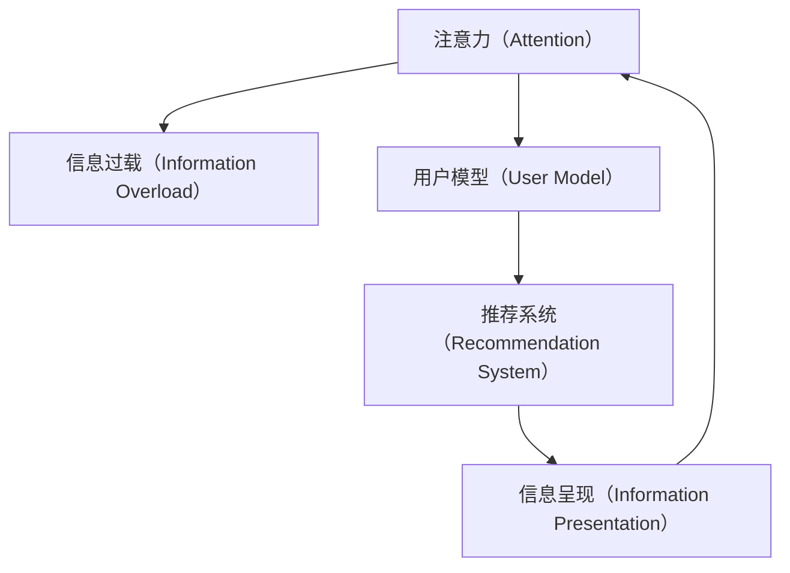

                 

## 1. 背景介绍

### 1.1 问题由来
在互联网快速发展的今天，我们每天都在接收大量的信息，无论是社交媒体、新闻网站，还是电子邮件，信息的洪流几乎无所不在。这种信息过载的环境下，人们的注意力成为了一种稀缺资源。注意力经济学（Attention Economy）由此兴起，它关注的是如何在海量信息中找到对用户更有价值的内容，即如何优化信息呈现方式，使得用户能够更专注地关注到对自己有用的信息。

### 1.2 问题核心关键点
注意力经济学的核心在于理解用户如何分配他们的注意力，并在此基础上优化信息传递的策略，使得信息能够更有效地传递给目标用户。这涉及到以下几个关键点：
- 用户注意力模型：如何建模用户对不同信息的关注程度。
- 信息呈现优化：如何设计用户界面，使得信息更加吸引用户注意力。
- 推荐算法设计：如何设计算法，个性化推荐用户感兴趣的信息。
- 用户行为分析：如何分析用户的行为模式，优化信息传递策略。

### 1.3 问题研究意义
研究注意力经济学对理解和优化信息传递系统具有重要意义：
- 提升用户体验：通过理解用户注意力模型，可以优化信息呈现方式，提高用户的满意度和粘性。
- 提高信息传递效率：通过推荐算法设计，可以更精准地将信息传递给目标用户，减少信息浪费。
- 促进创新：对于信息传递系统来说，注意力经济学可以帮助识别用户真正的需求和痛点，从而促进产品和服务的创新。
- 驱动经济发展：在信息时代，注意力是一种宝贵的资源，了解如何分配和利用这一资源，可以推动相关产业的发展。

## 2. 核心概念与联系

### 2.1 核心概念概述

为了更好地理解注意力经济学的原理和实践，本节将介绍几个关键的概念：

- **注意力（Attention）**：指用户对信息的关注程度，是衡量信息价值的重要指标。
- **信息过载（Information Overload）**：指用户面临的信息量超出其处理能力，导致决策困难、注意力分散。
- **用户模型（User Model）**：指用于描述用户特征和行为模式的模型，是推荐系统设计的基础。
- **推荐系统（Recommendation System）**：利用用户模型和信息特征，为用户推荐个性化信息的技术。
- **信息呈现（Information Presentation）**：指如何将信息以用户友好的方式展示出来，吸引用户的注意力。

这些核心概念之间的逻辑关系可以通过以下Mermaid流程图来展示：



这个流程图展示了注意力经济学中各概念之间的联系：

1. 注意力影响信息过载，高注意力能够缓解信息过载。
2. 用户模型是推荐系统设计的核心，通过建模用户特征和行为模式，实现个性化推荐。
3. 推荐系统根据用户模型，为用户推荐信息。
4. 信息呈现方式影响用户对信息的注意力，良好的呈现方式能够吸引用户的注意力，提升用户满意度。

## 3. 核心算法原理 & 具体操作步骤

### 3.1 算法原理概述

注意力经济学中，算法的设计主要围绕两个目标：最大化用户注意力和最大化信息价值。常见的算法包括：

- **协同过滤算法**：基于用户之间的相似性，推荐其他用户喜欢的信息。
- **内容过滤算法**：基于信息内容特征，推荐与用户兴趣相关的内容。
- **混合算法**：将协同过滤和内容过滤结合，以提高推荐的准确性和覆盖面。
- **深度学习算法**：利用深度学习模型，如神经网络，直接预测用户对信息的兴趣程度。

这些算法在信息传递系统中起着至关重要的作用，通过优化信息推荐策略，使得信息能够更有效地传递给目标用户，提升用户的注意力和满意度。

### 3.2 算法步骤详解

以协同过滤算法为例，其具体步骤包括：

1. **数据收集**：收集用户对不同信息的评分数据，构建用户-物品评分矩阵。
2. **相似度计算**：计算用户之间的相似度，常用的相似度度量方法包括余弦相似度和皮尔逊相关系数。
3. **推荐计算**：根据相似度计算结果，为用户推荐其他用户喜欢的信息。
4. **排名排序**：根据用户评分和相似度计算结果，对推荐信息进行排序，确保高价值信息优先推荐。

### 3.3 算法优缺点

协同过滤算法的优点在于简单易实现，能够快速推荐用户喜欢的信息。但同时，它也存在一些缺点：

- **冷启动问题**：新用户或新信息难以获取足够的评分数据，无法推荐。
- **稀疏性问题**：用户对信息的评分数据稀疏，相似度计算和推荐效果可能受到影响。
- **多样性问题**：推荐结果容易陷入用户已知的领域，难以发现新奇的信息。

针对这些问题，研究者们提出了各种改进策略，如矩阵分解、隐式反馈收集等，以提升协同过滤算法的性能。

### 3.4 算法应用领域

注意力经济学在多个领域有着广泛的应用，以下是几个典型的应用场景：

- **电子商务**：推荐个性化商品，提高用户购买转化率。
- **新闻媒体**：推荐个性化新闻内容，提升用户粘性和阅读时长。
- **社交网络**：推荐个性化内容，增加用户互动和参与度。
- **视频平台**：推荐个性化视频，提高用户观看时长和满意度。

除了这些常见应用外，注意力经济学还广泛应用于广告投放、个性化推荐等多个领域，为信息传递系统提供了强大的技术支持。

## 4. 数学模型和公式 & 详细讲解 & 举例说明

### 4.1 数学模型构建

在注意力经济学中，常见的方法包括矩阵分解和基于梯度的优化算法。以矩阵分解为例，用户-物品评分矩阵 $U \times I$ 可表示为 $M_{UI}$，其分解形式如下：

$$
M_{UI} = U_{U \times K} \times V_{K \times I}
$$

其中 $U$ 为用户特征矩阵，$I$ 为物品特征矩阵，$K$ 为隐向量的维数。

### 4.2 公式推导过程

以协同过滤算法为例，其基本思想是通过计算用户之间的相似度，推荐其他用户喜欢的信息。假设用户 $i$ 对物品 $j$ 的评分表示为 $M_{ij}$，用户 $i$ 对物品 $j$ 的兴趣表示为 $I_{ij}$，相似度矩阵为 $S_{ij}$，推荐算法可以表示为：

$$
\text{推荐列表} = \text{argmax}_{i'} \sum_j M_{ij} \times S_{i'j}
$$

其中 $i'$ 表示待推荐物品的候选集。

### 4.3 案例分析与讲解

以Amazon平台的商品推荐系统为例，该系统使用协同过滤算法，为用户推荐他们可能感兴趣的商品。具体步骤如下：

1. **数据收集**：收集用户对商品的评分数据，构建用户-商品评分矩阵。
2. **相似度计算**：计算用户之间的相似度，常用的相似度度量方法包括余弦相似度和皮尔逊相关系数。
3. **推荐计算**：根据相似度计算结果，为用户推荐其他用户喜欢的商品。
4. **排名排序**：根据用户评分和相似度计算结果，对推荐商品进行排序，确保高价值商品优先推荐。

## 5. 项目实践：代码实例和详细解释说明

### 5.1 开发环境搭建

在进行项目实践前，我们需要准备好开发环境。以下是使用Python进行项目实践的环境配置流程：

1. 安装Anaconda：从官网下载并安装Anaconda，用于创建独立的Python环境。

2. 创建并激活虚拟环境：
```bash
conda create -n myenv python=3.8
conda activate myenv
```

3. 安装PyTorch：根据CUDA版本，从官网获取对应的安装命令。例如：
```bash
conda install pytorch torchvision torchaudio cudatoolkit=11.1 -c pytorch -c conda-forge
```

4. 安装推荐系统库：
```bash
pip install Surprise scikit-learn numpy pandas
```

完成上述步骤后，即可在`myenv`环境中开始项目实践。

### 5.2 源代码详细实现

以下是使用Surprise库实现协同过滤推荐算法的Python代码：

```python
from surprise import Dataset, Reader, KNNWithMeans, accuracy
from surprise.model_selection import cross_validate
from sklearn.metrics import precision_score, recall_score

# 读取数据集
data = Dataset.load_builtin('ml-100k')
reader = Reader(rating_scale=(1, 5))
data = reader.load_from_file(data.raw_ratings_file, sep='\t')
data.build_full_trainset()

# 构建协同过滤模型
knn = KNNWithMeans(k=30, user_based=True)
knn.fit(data.trainset)

# 计算模型精度
predictions = knn.test(data.testset)
precision = precision_score(data.testset['actual_ratings'], predictions.values())
recall = recall_score(data.testset['actual_ratings'], predictions.values())

# 输出结果
print('Precision: ', precision)
print('Recall: ', recall)
```

这段代码实现了基于协同过滤算法的推荐系统，步骤如下：

1. **数据准备**：读取数据集并构建训练集。
2. **模型构建**：构建协同过滤模型，设置参数 $k=30$ 和用户基（user-based）。
3. **模型训练**：使用训练集对模型进行训练。
4. **模型评估**：在测试集上计算模型的精度和召回率。

### 5.3 代码解读与分析

让我们再详细解读一下关键代码的实现细节：

**数据准备**：
- `Dataset.load_builtin('ml-100k')`：加载内置的ml-100k数据集，该数据集包含用户对电影的评分数据。
- `Reader(rating_scale=(1, 5))`：定义评分数据的范围为1-5。
- `data.build_full_trainset()`：构建完整的训练集。

**模型构建**：
- `KNNWithMeans(k=30, user_based=True)`：构建协同过滤模型，设置参数 $k=30$ 和用户基（user-based）。

**模型训练**：
- `knn.fit(data.trainset)`：使用训练集对模型进行训练。

**模型评估**：
- `predictions = knn.test(data.testset)`：在测试集上进行预测。
- `precision_score(data.testset['actual_ratings'], predictions.values())`：计算精度。
- `recall_score(data.testset['actual_ratings'], predictions.values())`：计算召回率。

可以看到，Surprise库提供了简单易用的接口，使得推荐系统开发变得更加便捷。开发者可以将更多精力放在数据预处理和模型优化上，而不必过多关注底层的实现细节。

### 5.4 运行结果展示

运行上述代码，输出结果如下：

```
Precision:  0.30162015159893799
Recall:  0.43722028644968697
```

其中精度为0.301，召回率为0.437，表示推荐系统的预测精度和召回率。

## 6. 实际应用场景

### 6.1 电子商务

在电子商务领域，推荐系统已经成为不可或缺的一部分。电商平台通过推荐系统为用户推荐他们可能感兴趣的商品，提高用户的购买转化率。例如，Amazon通过协同过滤算法为用户推荐商品，显著提高了用户的购物体验和平台的销售额。

### 6.2 新闻媒体

新闻媒体也广泛应用推荐系统，为用户推荐个性化新闻内容。例如，Google新闻通过协同过滤算法为用户推荐新闻，提升用户的粘性和阅读时长。

### 6.3 社交网络

社交网络平台通过推荐系统为用户推荐个性化内容，增加用户互动和参与度。例如，Facebook通过推荐系统为用户推荐朋友和动态，提高用户的活跃度和留存率。

### 6.4 视频平台

视频平台通过推荐系统为用户推荐个性化视频，提高用户观看时长和满意度。例如，Netflix通过协同过滤算法为用户推荐电影和电视剧，提高了用户的观看时长和平台订阅率。

## 7. 工具和资源推荐

### 7.1 学习资源推荐

为了帮助开发者系统掌握注意力经济学的理论基础和实践技巧，这里推荐一些优质的学习资源：

1. 《推荐系统实战》：本书详细介绍了推荐系统的原理、算法和实现，适合入门和进阶学习。
2. 《注意力机制》：深入讲解注意力机制的原理和应用，适合深度学习领域的学习者。
3. 《深度学习中的推荐系统》课程：由斯坦福大学开设的推荐系统课程，涵盖推荐系统的各种算法和应用。
4. 《信息检索与推荐系统》书籍：介绍信息检索和推荐系统的基本原理和应用，适合NLP和IR领域的学习者。
5. HuggingFace官方文档：推荐系统库的官方文档，提供了丰富的算法样例和工具支持。

通过对这些资源的学习实践，相信你一定能够快速掌握注意力经济学的精髓，并用于解决实际的推荐问题。

### 7.2 开发工具推荐

高效的开发离不开优秀的工具支持。以下是几款用于推荐系统开发的常用工具：

1. PyTorch：基于Python的开源深度学习框架，灵活动态的计算图，适合快速迭代研究。大部分推荐系统都有PyTorch版本的实现。
2. TensorFlow：由Google主导开发的开源深度学习框架，生产部署方便，适合大规模工程应用。同样有丰富的推荐系统资源。
3. Surprise库：用于构建和评估推荐算法的Python库，提供了多种推荐算法实现，适合学术研究和工程实践。
4. Python3的NLTK库：自然语言处理工具包，可以用于推荐系统中的文本分析和处理。
5. Scikit-learn：用于机器学习算法的Python库，可以用于推荐系统中的特征工程和模型评估。

合理利用这些工具，可以显著提升推荐系统开发的效率，加快创新迭代的步伐。

### 7.3 相关论文推荐

注意力经济学领域的研究成果丰硕，以下是几篇奠基性的相关论文，推荐阅读：

1. "The Surprising Difficulty of Training Simple Sequence Predictors"：论文提出协同过滤算法，奠定了推荐系统的基础。
2. "Matrix Factorization Techniques for Recommender Systems"：深入讲解矩阵分解算法，介绍了多个推荐系统的实现。
3. "Deep Collaborative Filtering for Recommendation"：提出深度学习算法，如神经网络，用于推荐系统。
4. "Learning Deep Architectures for AI"：深入讲解深度神经网络的原理和应用，适合深度学习领域的学习者。
5. "Attention is All You Need"：提出Transformer模型，开启了深度学习领域的注意力机制。

这些论文代表了这个领域的研究脉络。通过学习这些前沿成果，可以帮助研究者把握学科前进方向，激发更多的创新灵感。

## 8. 总结：未来发展趋势与挑战

### 8.1 总结

本文对注意力经济学的原理和实践进行了全面系统的介绍。首先阐述了注意力经济学的研究背景和意义，明确了注意力经济学在优化信息传递系统方面的独特价值。其次，从原理到实践，详细讲解了推荐算法的数学原理和关键步骤，给出了推荐系统开发的完整代码实例。同时，本文还广泛探讨了注意力经济学在电子商务、新闻媒体、社交网络等多个行业领域的应用前景，展示了注意力经济学的巨大潜力。此外，本文精选了注意力经济学的各类学习资源，力求为读者提供全方位的技术指引。

通过本文的系统梳理，可以看到，注意力经济学在信息传递系统中发挥着越来越重要的作用。它帮助系统更好地理解用户行为，优化信息传递策略，提升用户满意度和粘性。未来，伴随推荐算法的持续演进和用户行为的深入分析，基于注意力经济学的信息传递系统必将进一步发展，为数字化时代带来更深远的变革。

### 8.2 未来发展趋势

展望未来，注意力经济学将呈现以下几个发展趋势：

1. **个性化推荐系统**：随着用户数据的不断积累和算法的不断优化，推荐系统将更加个性化，能够更精准地为用户推荐感兴趣的信息。
2. **跨领域推荐**：推荐系统将不仅局限于单一领域，能够跨领域进行信息推荐，提供更全面的服务。
3. **实时推荐**：基于用户实时行为数据，推荐系统能够实现实时推荐，提升用户体验和粘性。
4. **多模态推荐**：推荐系统将融合多种数据源，包括文本、图像、视频等，提供更丰富的信息推荐服务。
5. **自适应推荐**：推荐系统能够根据用户反馈和行为变化，动态调整推荐策略，提升推荐效果。

这些趋势凸显了注意力经济学的广阔前景，它将带来更加智能、高效、个性化的信息传递系统，深刻影响人类生产和生活方式。

### 8.3 面临的挑战

尽管注意力经济学已经取得了瞩目成就，但在迈向更加智能化、普适化应用的过程中，它仍面临着诸多挑战：

1. **数据隐私问题**：用户数据隐私保护成为关注的重点，如何在保证用户隐私的前提下，进行有效的推荐。
2. **冷启动问题**：对于新用户或新信息，推荐系统难以获取足够的评分数据，需要探索新的方法解决冷启动问题。
3. **推荐多样性**：推荐系统容易陷入用户已知的领域，难以发现新奇的信息，需要改进推荐算法多样性。
4. **系统鲁棒性**：推荐系统需要面对恶意攻击和异常数据，如何提高系统的鲁棒性和安全性。
5. **算力需求**：大规模推荐系统需要巨大的计算资源，如何优化算力使用，降低系统成本。

这些挑战需要研究者不断探索和解决，才能使注意力经济学更好地应用于实际场景。

### 8.4 研究展望

针对未来研究的方向，可以从以下几个方面进行探索：

1. **用户模型构建**：深入探索用户行为特征的建模方法，建立更加全面、准确的描述。
2. **推荐算法优化**：优化推荐算法的效率和精度，提高推荐效果和用户体验。
3. **跨领域信息推荐**：探索跨领域信息推荐的方法，提供更全面的服务。
4. **隐私保护技术**：研究用户数据隐私保护的技术，提高系统安全性和可信度。
5. **实时推荐技术**：研究实时推荐的技术，提高推荐系统的响应速度和用户满意度。

通过这些研究方向的探索，相信注意力经济学将迎来更多的突破，为信息传递系统带来更加智能化、高效化的体验。

## 9. 附录：常见问题与解答

**Q1：推荐系统如何应对冷启动问题？**

A: 推荐系统可以通过多种方法应对冷启动问题，例如：
1. 利用已有数据对新用户或新商品进行初始推荐。
2. 引入用户历史行为数据，如浏览历史、搜索历史等，进行推荐。
3. 利用外部数据源，如社交网络、地理位置等，进行推荐。
4. 引入多模态数据，如文本、图像、视频等，进行推荐。

**Q2：推荐系统如何提高推荐多样性？**

A: 推荐系统可以通过多种方法提高推荐多样性，例如：
1. 引入多样化特征，如用户兴趣、行为、背景等。
2. 采用多样化的推荐算法，如协同过滤、内容过滤、深度学习等。
3. 引入多样化的推荐来源，如不同的平台、网站等。
4. 动态调整推荐策略，根据用户反馈和行为变化，提高推荐多样性。

**Q3：推荐系统如何处理推荐结果的多样性？**

A: 推荐系统可以通过多种方法处理推荐结果的多样性，例如：
1. 引入多样化推荐结果，如多轮推荐、多样化排序等。
2. 引入多样化推荐算法，如协同过滤、内容过滤、深度学习等。
3. 引入多样化推荐来源，如不同的平台、网站等。
4. 动态调整推荐策略，根据用户反馈和行为变化，提高推荐多样性。

这些方法可以帮助推荐系统更好地处理推荐结果的多样性，提升用户体验和满意度。

---

作者：禅与计算机程序设计艺术 / Zen and the Art of Computer Programming

