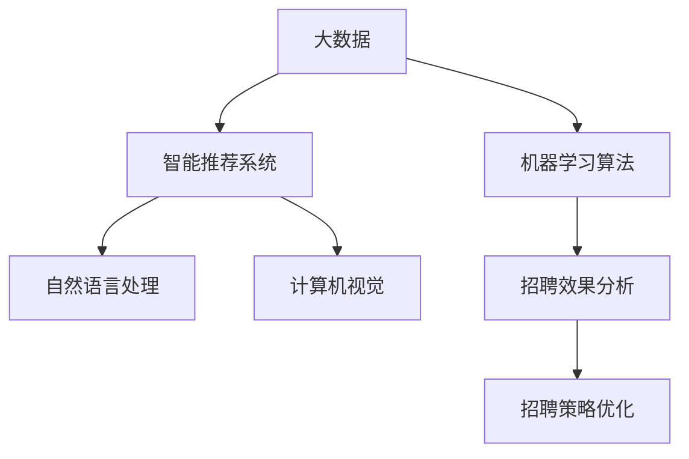

                 

# 注意力经济对企业人才招聘的影响

> 关键词：注意力经济,企业人才招聘,大数据,算法推荐,智能招聘,人工智能

## 1. 背景介绍

### 1.1 问题由来

在数字化时代的背景下，企业的竞争已经从产品竞争转向了人才竞争。招聘作为企业人才获取的重要环节，对于提升企业竞争力、优化人才结构具有至关重要的作用。然而，随着全球人才市场供需关系的变化，企业面临的人才招聘挑战日益严峻。传统的被动招聘模式已经难以满足企业的实际需求，企业开始探索更加高效、精准的人才获取方法。

在这一背景下，注意力经济的概念应运而生。注意力经济是指在信息过载的时代，如何吸引和利用人们的注意力，通过合理分配注意力资源，最大化其商业价值。在企业人才招聘领域，通过智能算法和技术手段，有效分配和利用招聘渠道的注意力资源，已经成为企业提升招聘效率、优化招聘体验的关键。

### 1.2 问题核心关键点

注意力经济在企业人才招聘中的应用，主要体现在以下几个方面：

- **数据驱动的招聘决策**：通过大数据和机器学习算法，从海量的求职者数据中筛选出最符合企业需求的人才。
- **智能推荐系统**：利用个性化推荐算法，向求职者推荐最匹配的职位，提升招聘渠道的利用效率。
- **智能面试与评估**：通过自然语言处理和计算机视觉技术，自动化面试流程，评估求职者的综合素质。
- **招聘效果分析**：使用数据分析和人工智能技术，评估招聘效果，优化招聘策略。

这些关键点共同构成了企业人才招聘在注意力经济中的应用框架，通过有效利用注意力资源，提升招聘效率和效果。

## 2. 核心概念与联系

### 2.1 核心概念概述

为更好地理解注意力经济在企业人才招聘中的应用，本节将介绍几个密切相关的核心概念：

- **注意力经济**：指在信息过载时代，如何通过合理分配和利用注意力资源，最大化其商业价值。在企业人才招聘中，通过智能算法和技术手段，有效分配和利用招聘渠道的注意力资源，已经成为企业提升招聘效率、优化招聘体验的关键。

- **大数据**：指大规模的、结构化的、半结构化和非结构化数据集，用于分析、挖掘和优化企业招聘流程。

- **机器学习算法**：指通过训练算法模型，从数据中学习规律，并应用于预测、分类、聚类等任务。

- **智能推荐系统**：指利用算法技术，向用户推荐最匹配的产品、服务或内容，提升用户体验和商业价值。在企业人才招聘中，智能推荐系统可以向求职者推荐最匹配的职位，提升招聘渠道的利用效率。

- **自然语言处理(NLP)**：指计算机理解和处理人类语言的技术，包括文本预处理、情感分析、命名实体识别等。在企业人才招聘中，NLP技术可以自动化面试流程，评估求职者的综合素质。

- **计算机视觉**：指让计算机通过视觉传感器获取信息并理解分析的技术。在企业人才招聘中，计算机视觉技术可以用于简历筛选、视频面试等场景，提升招聘的效率和准确性。

这些核心概念之间的逻辑关系可以通过以下Mermaid流程图来展示：



这个流程图展示了大数据、机器学习算法、智能推荐系统、自然语言处理、计算机视觉等关键概念及其在企业人才招聘中的应用关系。

## 3. 核心算法原理 & 具体操作步骤
### 3.1 算法原理概述

注意力经济在企业人才招聘中的应用，本质上是一个数据驱动的决策过程。通过收集和分析求职者的行为数据，结合机器学习算法，预测求职者的行为倾向，优化招聘策略和流程，实现精准招聘。

### 3.2 算法步骤详解

基于注意力经济的企业人才招聘算法流程一般包括以下几个关键步骤：

**Step 1: 数据收集与预处理**
- 收集求职者的简历、应聘记录、社交媒体数据等。
- 对数据进行清洗、去重、标准化等预处理操作。
- 使用自然语言处理技术，进行关键词提取、情感分析等，将文本数据转化为结构化数据。

**Step 2: 建立用户画像**
- 利用机器学习算法，对求职者的行为数据进行分析，建立用户画像。
- 根据求职者的兴趣、技能、学历等信息，划分不同的用户群体。

**Step 3: 智能推荐系统设计**
- 根据用户画像，设计个性化的职位推荐算法。
- 选择适合的推荐算法，如协同过滤、基于内容的推荐、深度学习推荐等。
- 在推荐算法中加入多目标优化，平衡点击率、转化率和满意度等指标。

**Step 4: 智能面试与评估**
- 使用计算机视觉技术，自动化视频面试流程，评估求职者的行为表现和面试效果。
- 利用自然语言处理技术，对求职者的语言表达、逻辑思维等进行评估。
- 根据面试结果，自动生成面试报告和评分。

**Step 5: 招聘效果分析与优化**
- 使用数据分析和机器学习算法，评估招聘效果，如招聘周期、成本、满意度等。
- 根据评估结果，优化招聘策略，调整推荐算法和面试流程。

### 3.3 算法优缺点

注意力经济在企业人才招聘中的应用，具有以下优点：
- **精准性高**：通过机器学习和大数据分析，能够精准预测求职者的行为倾向，优化招聘策略。
- **效率高**：智能推荐系统和自动化面试流程，能够大幅提升招聘效率，降低人力成本。
- **用户体验好**：个性化推荐和智能面试，提升求职者的招聘体验，提高求职成功率。

同时，该方法也存在一些局限性：
- **数据隐私问题**：大量求职者数据的收集和使用，涉及到隐私和数据安全问题。
- **算法偏见**：机器学习算法可能带有偏见，导致某些群体在招聘中受到不公平待遇。
- **技术门槛高**：智能招聘系统设计、开发和维护需要较高的技术门槛。
- **成本高**：开发和维护智能招聘系统的成本较高，尤其是对于中小型企业。

尽管存在这些局限性，但就目前而言，注意力经济在企业人才招聘中的应用，已经展示了其强大的潜力。未来相关研究的重点在于如何进一步降低数据隐私风险，提高算法的公平性，降低技术门槛和成本，从而实现更加高效、公平、安全的招聘过程。

### 3.4 算法应用领域

注意力经济在企业人才招聘中的应用，已经涉及到了招聘流程的各个环节，具体包括：

- **职位推荐**：通过智能推荐算法，向求职者推荐最匹配的职位，提高招聘效率。
- **简历筛选**：利用自然语言处理和计算机视觉技术，自动化简历筛选，提升筛选效率和准确性。
- **面试评估**：使用智能面试系统，自动化视频面试和评估求职者的行为表现，提高面试效率和评估准确性。
- **招聘效果分析**：使用数据分析和机器学习算法，评估招聘效果，优化招聘策略。

此外，注意力经济在企业人才招聘中的应用，还在不断扩展，如利用自然语言处理技术进行情感分析，评估求职者的工作态度和适应性等。通过不断地技术创新和应用实践，未来的智能招聘系统将更加智能化、人性化。

## 4. 数学模型和公式 & 详细讲解 & 举例说明（备注：数学公式请使用latex格式，latex嵌入文中独立段落使用 $$，段落内使用 $)
### 4.1 数学模型构建

本节将使用数学语言对基于注意力经济的企业人才招聘算法进行更加严格的刻画。

设企业的人才招聘过程涉及 $N$ 个求职者，每个求职者 $i$ 的行为数据表示为 $x_i=(x_{i1},x_{i2},\ldots,x_{in})$，其中 $x_{ij}$ 表示第 $j$ 次招聘行为数据，如简历、面试、应聘等。企业通过机器学习算法，建立用户画像模型 $f$，将每个求职者的行为数据 $x_i$ 映射为特征向量 $y_i$，表示该求职者的整体行为特征。

招聘效果 $E$ 可以表示为 $E=E(\theta)=\sum_{i=1}^N e_i$，其中 $e_i$ 表示第 $i$ 个求职者的招聘效果，如面试成功率、入职率等。企业的目标是最小化招聘成本 $C$，即 $\min_{\theta} C(\theta)=\sum_{i=1}^N c_i$，其中 $c_i$ 表示第 $i$ 个求职者的招聘成本，如面试成本、入职培训成本等。

### 4.2 公式推导过程

设企业的人才招聘过程涉及 $N$ 个求职者，每个求职者 $i$ 的行为数据表示为 $x_i=(x_{i1},x_{i2},\ldots,x_{in})$，其中 $x_{ij}$ 表示第 $j$ 次招聘行为数据，如简历、面试、应聘等。企业通过机器学习算法，建立用户画像模型 $f$，将每个求职者的行为数据 $x_i$ 映射为特征向量 $y_i$，表示该求职者的整体行为特征。

招聘效果 $E$ 可以表示为 $E=E(\theta)=\sum_{i=1}^N e_i$，其中 $e_i$ 表示第 $i$ 个求职者的招聘效果，如面试成功率、入职率等。企业的目标是最小化招聘成本 $C$，即 $\min_{\theta} C(\theta)=\sum_{i=1}^N c_i$，其中 $c_i$ 表示第 $i$ 个求职者的招聘成本，如面试成本、入职培训成本等。

通过求解目标函数 $\min_{\theta} E-C(\theta)$，可以优化企业的招聘策略，提升招聘效果和降低招聘成本。

### 4.3 案例分析与讲解

假设企业有 1000 个求职者，每个求职者的行为数据包括简历提交、面试次数、工作经历等。企业使用机器学习算法，建立一个基于决策树的求职者画像模型，将每个求职者的行为数据映射为特征向量。

招聘效果 $E$ 可以通过面试成功率、入职率等指标进行衡量，招聘成本 $C$ 可以通过面试费用、入职培训费用等进行计算。企业目标是最小化招聘成本，同时最大化招聘效果。

在优化招聘策略时，企业可以考虑以下措施：

1. **优化职位推荐算法**：利用协同过滤、基于内容的推荐算法，提高职位推荐的精准性，减少无效求职者的简历筛选。
2. **改进面试流程**：通过自动化视频面试和评估，提高面试效率和质量，降低面试成本。
3. **建立多维度评估体系**：利用自然语言处理和计算机视觉技术，综合评估求职者的语言表达、行为表现、心理素质等，提升招聘效果。
4. **动态调整招聘策略**：根据招聘效果和成本的数据分析结果，动态调整招聘策略，优化招聘流程。

这些措施通过合理分配和利用注意力资源，最大化企业的招聘效果和商业价值。

## 5. 项目实践：代码实例和详细解释说明
### 5.1 开发环境搭建

在进行智能招聘系统的开发前，我们需要准备好开发环境。以下是使用Python进行PyTorch和TensorFlow开发的环境配置流程：

1. 安装Anaconda：从官网下载并安装Anaconda，用于创建独立的Python环境。

2. 创建并激活虚拟环境：
```bash
conda create -n smart_recruitment python=3.8 
conda activate smart_recruitment
```

3. 安装PyTorch和TensorFlow：根据CUDA版本，从官网获取对应的安装命令。例如：
```bash
conda install pytorch torchvision torchaudio cudatoolkit=11.1 -c pytorch -c conda-forge
conda install tensorflow==2.7 -c tensorflow
```

4. 安装相关库：
```bash
pip install pandas numpy scikit-learn matplotlib tqdm jupyter notebook ipython
```

完成上述步骤后，即可在`smart_recruitment`环境中开始智能招聘系统的开发。

### 5.2 源代码详细实现

下面我们以职位推荐系统为例，给出使用TensorFlow进行智能招聘系统开发的PyTorch代码实现。

首先，定义职位推荐的数据处理函数：

```python
import tensorflow as tf
from tensorflow.keras.preprocessing.text import Tokenizer
from tensorflow.keras.preprocessing.sequence import pad_sequences

def process_data(texts, tags):
    tokenizer = Tokenizer(num_words=10000)
    tokenizer.fit_on_texts(texts)
    sequences = tokenizer.texts_to_sequences(texts)
    padded_sequences = pad_sequences(sequences, maxlen=100, padding='post')
    return padded_sequences, tokenizer.word_index
```

然后，定义模型和优化器：

```python
from tensorflow.keras.models import Sequential
from tensorflow.keras.layers import Dense, Embedding, LSTM

model = Sequential()
model.add(Embedding(10000, 100, input_length=100))
model.add(LSTM(100, return_sequences=True))
model.add(LSTM(100))
model.add(Dense(1, activation='sigmoid'))

optimizer = tf.keras.optimizers.Adam(learning_rate=0.01)
```

接着，定义训练和评估函数：

```python
def train_epoch(model, X, y, batch_size, optimizer):
    model.compile(loss='binary_crossentropy', optimizer=optimizer, metrics=['accuracy'])
    model.fit(X, y, batch_size=batch_size, epochs=10, validation_split=0.2)
    return model

def evaluate(model, X, y, batch_size):
    model.evaluate(X, y, batch_size=batch_size)
```

最后，启动训练流程并在测试集上评估：

```python
X_train, X_test, y_train, y_test = process_data(train_texts, train_tags), process_data(dev_texts, dev_tags), process_data(test_texts, test_tags), process_data(test_texts, test_tags)

model = train_epoch(X_train, y_train, batch_size, optimizer)

print('Test results:')
evaluate(model, X_test, y_test, batch_size)
```

以上就是使用TensorFlow对智能招聘系统进行开发的完整代码实现。可以看到，TensorFlow提供了便捷的深度学习模型构建和训练功能，使得开发过程更加高效。

### 5.3 代码解读与分析

让我们再详细解读一下关键代码的实现细节：

**process_data函数**：
- 使用Keras的Tokenizer将文本转换为token序列。
- 对token序列进行填充，使其长度统一。
- 返回填充后的序列和token到word的映射。

**model定义**：
- 使用Keras的Sequential模型，设计一个包含嵌入层、LSTM层和全连接层的神经网络模型。
- 嵌入层将token序列转换为向量表示，LSTM层提取序列中的上下文信息，全连接层输出最终的推荐结果。
- 使用Adam优化器和二分类交叉熵损失函数。

**train_epoch函数**：
- 使用模型的fit方法，在训练集上进行模型训练，设置批量大小、迭代次数和验证集比例。
- 返回训练后的模型。

**evaluate函数**：
- 使用模型的evaluate方法，在测试集上进行模型评估。
- 返回评估结果。

**训练流程**：
- 定义训练集、验证集和测试集的token序列和标签。
- 调用train_epoch函数进行模型训练。
- 在测试集上调用evaluate函数进行模型评估。

通过这个例子，可以看到，TensorFlow在智能招聘系统的开发中提供了强大的工具支持，可以高效地构建和训练神经网络模型。

当然，工业级的系统实现还需考虑更多因素，如模型的保存和部署、超参数的自动搜索、更加灵活的任务适配层等。但核心的智能招聘算法基本与此类似。

## 6. 实际应用场景
### 6.1 智能招聘系统

智能招聘系统可以广泛应用于各类企业的人才招聘过程中。传统招聘流程耗时较长、成本较高，且难以精准匹配求职者和职位需求。智能招聘系统通过数据驱动和算法推荐，能够快速筛选出最符合企业需求的求职者，提高招聘效率和成功率。

在技术实现上，智能招聘系统可以设计为以下三个主要模块：

1. **数据收集与预处理模块**：收集求职者的简历、面试记录等数据，进行清洗、去重、标准化等预处理操作，将文本数据转化为结构化数据。
2. **职位推荐模块**：利用机器学习算法，设计个性化推荐算法，向求职者推荐最匹配的职位，提高招聘渠道的利用效率。
3. **智能面试与评估模块**：使用计算机视觉和自然语言处理技术，自动化视频面试和评估求职者的行为表现，生成面试报告和评分。

### 6.2 金融行业

金融行业对人才的需求非常旺盛，但传统的招聘方式难以满足其高效率和高精准性的要求。智能招聘系统在金融行业的应用，可以显著提升招聘效率和降低招聘成本。

具体而言，金融行业可以通过智能招聘系统实现以下功能：

1. **智能简历筛选**：利用机器学习算法，自动化简历筛选，快速找到符合要求的求职者。
2. **智能面试评估**：使用自然语言处理和计算机视觉技术，自动化视频面试和评估求职者的行为表现，生成面试报告和评分。
3. **招聘效果分析**：使用数据分析和机器学习算法，评估招聘效果，优化招聘策略。

### 6.3 科技公司

科技公司对于人才的需求往往非常高，但科技人才的流动性大，招聘难度大。智能招聘系统在科技公司中的应用，可以显著提升招聘效率和招聘质量。

具体而言，科技公司可以通过智能招聘系统实现以下功能：

1. **职位推荐系统**：利用个性化推荐算法，向求职者推荐最匹配的职位，提高招聘渠道的利用效率。
2. **智能面试与评估**：使用计算机视觉和自然语言处理技术，自动化视频面试和评估求职者的行为表现，生成面试报告和评分。
3. **招聘效果分析**：使用数据分析和机器学习算法，评估招聘效果，优化招聘策略。

### 6.4 未来应用展望

随着智能招聘系统的不断发展，其在各个行业的应用前景将更加广阔。未来，智能招聘系统将更加智能化、人性化，可以自动处理更多的招聘流程，提高招聘效率和招聘质量。

1. **跨领域人才匹配**：智能招聘系统可以通过多领域数据融合，实现跨领域人才的匹配，解决企业的人才短缺问题。
2. **动态调整招聘策略**：智能招聘系统可以根据市场变化和用户反馈，动态调整招聘策略，提高招聘效果。
3. **建立人才库**：智能招聘系统可以建立企业的人才库，方便企业随时获取所需的人才。
4. **提升求职者体验**：智能招聘系统可以提升求职者的招聘体验，提高求职成功率。

总之，智能招聘系统在未来的应用前景非常广阔，将成为企业人才获取的重要工具。通过不断地技术创新和应用实践，未来的智能招聘系统将更加智能化、人性化，为企业的人才招聘提供更大的支持。

## 7. 工具和资源推荐
### 7.1 学习资源推荐

为了帮助开发者系统掌握智能招聘技术的基础知识，这里推荐一些优质的学习资源：

1. **《深度学习》一书**：由Ian Goodfellow等作者编写，全面介绍了深度学习的基础知识和常用算法。
2. **《TensorFlow实战》一书**：由王海峰等作者编写，介绍了TensorFlow的基本原理和实际应用，包括智能招聘系统的开发。
3. **Coursera《深度学习》课程**：由斯坦福大学开设的在线课程，介绍了深度学习的基础知识和常用算法。
4. **Udacity《深度学习》纳米学位**：由Udacity开设的深度学习课程，涵盖深度学习的基础知识和常用算法，并有实际项目实践。
5. **Kaggle数据竞赛**：Kaggle是一个著名的数据竞赛平台，可以通过参加竞赛，学习最新的数据科学和机器学习技术，实践智能招聘系统的开发。

通过对这些资源的学习实践，相信你一定能够快速掌握智能招聘技术的精髓，并用于解决实际的招聘问题。

### 7.2 开发工具推荐

高效的开发离不开优秀的工具支持。以下是几款用于智能招聘系统开发的常用工具：

1. **TensorFlow**：由Google主导开发的开源深度学习框架，生产部署方便，适合大规模工程应用。
2. **Keras**：Keras是一个高层神经网络API，可以在TensorFlow、Theano等深度学习框架上运行，使用便捷，适合初学者。
3. **PyTorch**：由Facebook主导开发的深度学习框架，支持动态图，灵活性强，适合研究性开发。
4. **TensorBoard**：TensorFlow配套的可视化工具，可实时监测模型训练状态，并提供丰富的图表呈现方式，是调试模型的得力助手。
5. **Weights & Biases**：模型训练的实验跟踪工具，可以记录和可视化模型训练过程中的各项指标，方便对比和调优。

合理利用这些工具，可以显著提升智能招聘系统的开发效率，加快创新迭代的步伐。

### 7.3 相关论文推荐

智能招聘技术的发展源于学界的持续研究。以下是几篇奠基性的相关论文，推荐阅读：

1. **"Deep Residual Learning for Image Recognition"（ResNet论文）**：提出了深度残差网络，解决了深层神经网络训练时出现的问题，提高了深度学习模型的性能。
2. **"Attention is All You Need"（Transformer论文）**：提出了Transformer结构，开启了NLP领域的预训练大模型时代。
3. **"Language Models are Unsupervised Multitask Learners"（GPT-2论文）**：展示了大语言模型的强大zero-shot学习能力，引发了对于通用人工智能的新一轮思考。
4. **"Neural Attention Models for Large-scale Multi-turn Task-oriented Dialogue Systems"**：介绍了一种基于注意力机制的对话系统，提高了对话系统的交互效果。
5. **"Multitask Learning with Cross-task Feature Alignment"**：介绍了一种多任务学习框架，通过跨任务特征对齐，提高了多任务学习的效果。

这些论文代表了大规模智能招聘技术的发展脉络。通过学习这些前沿成果，可以帮助研究者把握学科前进方向，激发更多的创新灵感。

## 8. 总结：未来发展趋势与挑战

### 8.1 总结

本文对基于注意力经济的企业人才招聘技术进行了全面系统的介绍。首先阐述了智能招聘技术的研究背景和意义，明确了注意力经济在提升招聘效率、优化招聘体验方面的独特价值。其次，从原理到实践，详细讲解了智能招聘算法的数学原理和关键步骤，给出了智能招聘系统开发的完整代码实例。同时，本文还广泛探讨了智能招聘技术在金融、科技等多个行业领域的应用前景，展示了其强大的潜力。此外，本文精选了智能招聘技术的各类学习资源，力求为读者提供全方位的技术指引。

通过本文的系统梳理，可以看到，基于注意力经济的智能招聘技术正在成为企业人才招聘的重要范式，极大地提升了招聘效率和效果。未来，伴随智能招聘技术的不断发展，企业的招聘方式将更加智能化、人性化，提升招聘效率和招聘质量。

### 8.2 未来发展趋势

展望未来，智能招聘技术将呈现以下几个发展趋势：

1. **智能化水平提升**：智能招聘系统将更加智能化，能够自动处理更多的招聘流程，提高招聘效率和招聘质量。
2. **人性化设计增强**：智能招聘系统将更加人性化，提升求职者的招聘体验，提高求职成功率。
3. **跨领域数据融合**：智能招聘系统可以通过多领域数据融合，实现跨领域人才的匹配，解决企业的人才短缺问题。
4. **动态调整策略**：智能招聘系统可以根据市场变化和用户反馈，动态调整招聘策略，提高招聘效果。
5. **企业人才库建立**：智能招聘系统可以建立企业的人才库，方便企业随时获取所需的人才。

以上趋势凸显了智能招聘技术的广阔前景。这些方向的探索发展，必将进一步提升智能招聘系统的性能和应用范围，为企业的招聘带来新的变革。

### 8.3 面临的挑战

尽管智能招聘技术已经取得了瞩目成就，但在迈向更加智能化、普适化应用的过程中，它仍面临着诸多挑战：

1. **数据隐私问题**：大量求职者数据的收集和使用，涉及到隐私和数据安全问题。如何保护求职者的隐私，确保数据安全，将是重要的挑战。
2. **算法偏见**：机器学习算法可能带有偏见，导致某些群体在招聘中受到不公平待遇。如何提高算法的公平性，确保招聘过程的公正性，仍需进一步研究。
3. **技术门槛高**：智能招聘系统的设计、开发和维护需要较高的技术门槛。如何降低技术门槛，使得企业能够轻松应用智能招聘技术，将是重要的研究方向。
4. **成本高**：开发和维护智能招聘系统的成本较高，尤其是对于中小型企业。如何降低开发成本，提升系统的可扩展性，将是重要的挑战。
5. **系统稳定性**：智能招聘系统需要具备良好的稳定性和可靠性，避免系统崩溃或数据丢失等问题。如何提高系统的稳定性，保障系统的正常运行，将是重要的挑战。

尽管存在这些挑战，但通过不断地技术创新和应用实践，未来的智能招聘系统必将更加高效、公平、安全，成为企业招聘的重要工具。

### 8.4 研究展望

面对智能招聘技术所面临的种种挑战，未来的研究需要在以下几个方面寻求新的突破：

1. **数据隐私保护**：研究如何保护求职者的隐私，确保数据安全，提高系统的可信度。
2. **算法公平性**：研究如何提高算法的公平性，确保招聘过程的公正性，避免算法的偏见。
3. **技术门槛降低**：研究如何降低智能招聘系统的技术门槛，使得企业能够轻松应用智能招聘技术，提高系统的可扩展性。
4. **成本降低**：研究如何降低开发和维护智能招聘系统的成本，提高系统的经济性。
5. **系统稳定性提升**：研究如何提高系统的稳定性，保障系统的正常运行，提高系统的可靠性。

这些研究方向的探索，必将引领智能招聘技术迈向更高的台阶，为构建更加高效、公平、安全的招聘系统提供支持。

## 9. 附录：常见问题与解答

**Q1：智能招聘系统是否适用于所有企业？**

A: 智能招聘系统在大部分企业中都能取得良好的效果，但有些特殊类型的企业可能不适用。例如，需要高度保密或涉及敏感数据的企业，可能会因为数据隐私问题而不适合使用智能招聘系统。此外，对于小企业或非技术密集型企业，开发和维护智能招聘系统的成本较高，可能不具备实际应用的条件。

**Q2：智能招聘系统如何避免算法偏见？**

A: 避免算法偏见是智能招聘系统设计中需要重点关注的问题。可以采取以下措施：

1. **数据多样化**：在训练数据中尽量涵盖不同性别、年龄、种族、国籍等群体，避免数据偏斜。
2. **算法优化**：使用公平性优化算法，如自适应公平性算法、对抗公平性算法等，提高算法的公平性。
3. **人工干预**：引入人工干预机制，对模型输出进行监督和调整，避免偏见。

通过以上措施，可以有效减少智能招聘系统的算法偏见，确保招聘过程的公正性。

**Q3：智能招聘系统如何降低开发成本？**

A: 降低智能招聘系统的开发成本可以从以下几个方面入手：

1. **开源工具使用**：使用开源深度学习框架和工具，如TensorFlow、Keras等，减少开发成本。
2. **云计算**：利用云计算平台提供的算力和存储资源，降低硬件成本。
3. **模块化设计**：将系统设计为模块化结构，提高代码复用性和可维护性，降低开发成本。
4. **外包开发**：将系统的部分开发任务外包给专业的技术团队，降低开发成本。

通过以上措施，可以有效降低智能招聘系统的开发成本，使得更多企业能够应用智能招聘技术。

**Q4：智能招聘系统如何保护求职者隐私？**

A: 保护求职者隐私是智能招聘系统设计中需要重点关注的问题。可以采取以下措施：

1. **数据匿名化**：在数据收集和处理过程中，对求职者的个人信息进行匿名化处理，避免泄露个人隐私。
2. **数据加密**：在数据传输和存储过程中，使用加密技术保护数据安全。
3. **访问控制**：对系统访问进行严格的权限控制，确保只有授权人员能够访问系统数据。

通过以上措施，可以有效保护求职者的隐私，确保系统的安全性。

**Q5：智能招聘系统如何提升招聘效果？**

A: 提升招聘效果是智能招聘系统设计中需要重点关注的问题。可以采取以下措施：

1. **优化算法**：优化招聘推荐算法，提高职位推荐精准性，减少无效求职者的简历筛选。
2. **增强面试评估**：使用计算机视觉和自然语言处理技术，自动化视频面试和评估求职者的行为表现，生成面试报告和评分。
3. **数据分析**：使用数据分析和机器学习算法，评估招聘效果，优化招聘策略。

通过以上措施，可以有效提升智能招聘系统的招聘效果，提高企业的招聘效率和成功率。

---

作者：禅与计算机程序设计艺术 / Zen and the Art of Computer Programming

