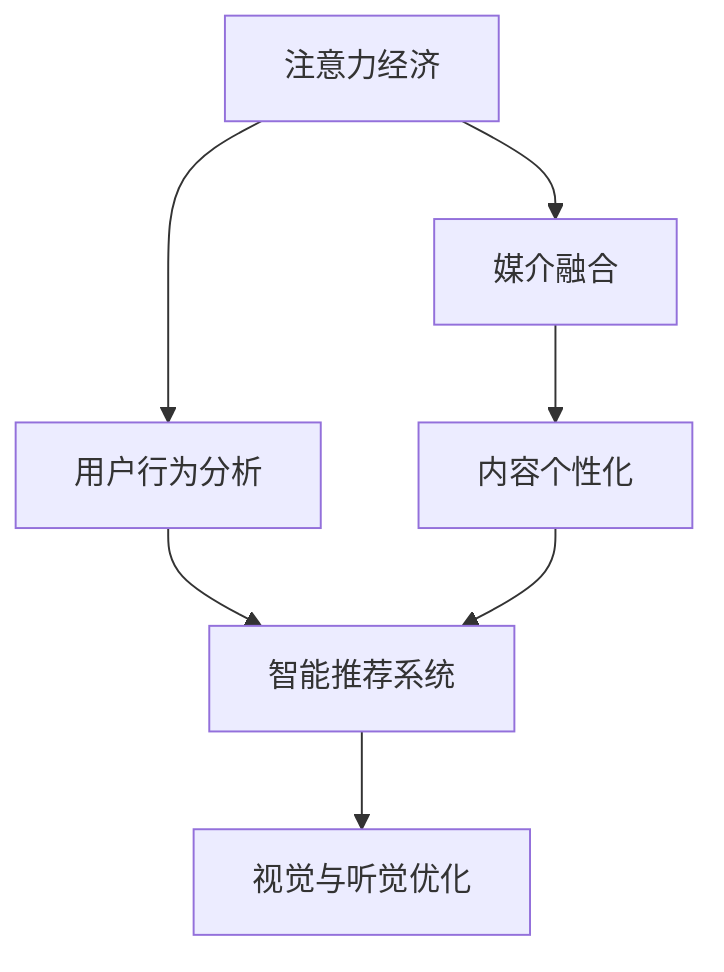

                 

# 注意力经济对传统媒体内容形式的改变

> 关键词：注意力经济,传统媒体,内容形式,数字时代,媒介融合,数据驱动,用户行为分析,智能推荐系统

## 1. 背景介绍

### 1.1 问题由来

在数字时代，互联网的迅猛发展带来了信息爆炸和注意力争夺的新格局。传统媒体逐渐面临前所未有的挑战，特别是面对在线媒体平台和社交网络的冲击，如何提升内容吸引力和用户参与度，成为亟待解决的问题。

注意力经济（Economy of Attention）概念的提出，为媒体内容的创新提供了全新的视角。注意力经济关注的是如何在海量信息中，吸引并保持用户的关注。媒体内容不再仅仅是一种传播手段，更成为了一种商品，其价值在于获取用户的注意力。

### 1.2 问题核心关键点

注意力经济时代，传统媒体内容形式需要从以下几个方面进行创新和变革：

- **数据驱动**：利用大数据技术对用户行为进行分析，精准把握用户需求和兴趣。
- **内容个性化**：通过智能推荐系统，为用户定制个性化内容。
- **互动性增强**：通过社交互动和即时反馈，提升用户参与度。
- **多平台整合**：实现内容在多个平台（如网站、App、社交网络等）的跨媒体传播和协同分发。
- **视觉与听觉优化**：提升内容的视觉和听觉体验，使用户更为沉浸。

### 1.3 问题研究意义

媒体内容形式的变革，不仅关乎媒体机构的生存与发展，更影响着用户的信息获取方式和社会文化的传播路径。通过适应注意力经济的要求，传统媒体可以焕发新的生命力，并在新的信息生态中占据优势地位。

## 2. 核心概念与联系

### 2.1 核心概念概述

为更好地理解注意力经济对传统媒体内容形式的影响，我们首先介绍几个关键概念：

- **注意力经济**：指在信息过载的时代，用户注意力成为稀缺资源，媒体内容竞争的核心在于争夺和保持用户注意力。
- **媒介融合**：指不同媒体形式（如报纸、电视、网络、社交等）的整合与协同，实现内容的多元化和全媒体传播。
- **用户行为分析**：通过分析用户的行为数据，了解用户的兴趣和需求，进而指导内容的生产与分发。
- **智能推荐系统**：利用算法和数据，为用户推荐可能感兴趣的内容，提升用户的满意度与粘性。
- **视觉与听觉优化**：在内容呈现上注重视觉和听觉效果，通过多感官刺激提升用户沉浸感。

这些核心概念之间的联系可以通过以下Mermaid流程图来展示：



这个流程图展示了注意力经济时代媒体内容形式创新的基本路径：通过用户行为分析，构建智能推荐系统，实现内容个性化和多平台整合，同时注重视觉与听觉效果，提升用户沉浸感。

## 3. 核心算法原理 & 具体操作步骤

### 3.1 算法原理概述

注意力经济时代，媒体内容形式的创新主要依赖于数据驱动和算法优化。核心算法原理包括：

- **用户行为分析**：通过分析用户在平台上留下的点击、浏览、点赞、评论等行为数据，挖掘用户的兴趣和需求。
- **智能推荐系统**：利用协同过滤、内容过滤、混合推荐等算法，为用户推荐可能感兴趣的内容。
- **视觉与听觉优化**：通过图像和音频处理技术，提升内容的视觉和听觉效果，使用户更为沉浸。

### 3.2 算法步骤详解

以智能推荐系统为例，其核心步骤包括：

1. **数据收集**：收集用户的历史行为数据，如浏览记录、点击次数、点赞情况等。
2. **用户画像构建**：基于用户行为数据，构建用户兴趣画像，包括用户的偏好、兴趣点等。
3. **内容标签化**：对媒体内容进行标签化处理，如关键词提取、分类、情感分析等。
4. **相似度计算**：计算用户画像与内容的相似度，采用余弦相似度、Jaccard相似度等算法。
5. **推荐排序**：基于相似度计算结果，对内容进行排序，推荐给用户最可能感兴趣的内容。

### 3.3 算法优缺点

智能推荐系统在提升用户满意度和粘性方面具有显著优势，但也存在以下缺点：

- **冷启动问题**：新用户或内容缺乏足够的行为数据，难以进行精准推荐。
- **数据隐私**：用户行为数据的收集和使用，需要严格遵守隐私保护法规。
- **个性化与多样性平衡**：过度个性化推荐可能使用户陷入信息茧房，限制多样性。
- **算法偏见**：推荐算法可能存在偏见，导致某些类型的内容被过度推荐。

### 3.4 算法应用领域

智能推荐系统已在多个领域得到广泛应用，如电商平台、视频平台、新闻网站等，用户可以通过这些平台获得更加个性化的内容推荐。具体应用领域包括：

- **电商平台**：为用户推荐商品，提高购买转化率。
- **视频平台**：为用户推荐视频内容，提升观看时长和粘性。
- **新闻网站**：为用户推荐新闻文章，增加页面停留时间和回访率。
- **社交网络**：为用户推荐好友和内容，扩展社交网络。

## 4. 数学模型和公式 & 详细讲解 & 举例说明

### 4.1 数学模型构建

在智能推荐系统中，常用的数学模型包括协同过滤、内容过滤和混合推荐等。这里我们以协同过滤为例，介绍其数学模型的构建。

协同过滤算法通过用户与用户之间的相似度，推断用户对未交互内容的评分。设用户集合为 $U=\{u_1, u_2, ..., u_M\}$，内容集合为 $I=\{i_1, i_2, ..., i_N\}$，每个用户 $u_m$ 对内容 $i_n$ 的评分表示为 $r_{m,n}$。协同过滤的目标是计算用户 $u_m$ 对内容 $i_n$ 的预测评分 $r'_{m,n}$。

假设用户 $u_m$ 与 $u_{m'}$ 的相似度为 $s(u_m, u_{m'})$，则协同过滤的预测评分公式为：

$$
r'_{m,n} = \sum_{m'=1}^M s(u_m, u_{m'})r_{m',n}
$$

### 4.2 公式推导过程

在协同过滤中，用户相似度 $s(u_m, u_{m'})$ 的计算是关键。常用的相似度计算方法包括余弦相似度、皮尔逊相关系数等。这里以余弦相似度为例，进行公式推导。

余弦相似度的计算公式为：

$$
s(u_m, u_{m'}) = \frac{\sum_{i=1}^N r_{m,i}r_{m',i}}{\sqrt{\sum_{i=1}^N r_{m,i}^2}\sqrt{\sum_{i=1}^N r_{m',i}^2}}
$$

其中 $r_{m,i}$ 和 $r_{m',i}$ 分别表示用户 $u_m$ 和 $u_{m'}$ 对内容 $i$ 的评分。通过余弦相似度，可以衡量用户间的相似度，进而进行推荐。

### 4.3 案例分析与讲解

我们以一个简单的电商推荐系统为例，展示协同过滤模型的应用。

假设某电商平台上用户 $u_1$ 对商品 $i_1, i_2, i_3$ 的评分分别为 4, 3, 5，而用户 $u_2$ 对商品 $i_1, i_2, i_3$ 的评分分别为 5, 3, 2。用户 $u_1$ 与 $u_2$ 的余弦相似度为：

$$
s(u_1, u_2) = \frac{4 \times 5 + 3 \times 3 + 5 \times 2}{\sqrt{4^2 + 3^2 + 5^2}\sqrt{5^2 + 3^2 + 2^2}} = \frac{35}{\sqrt{50}\times\sqrt{38}} = 0.95
$$

因此，电商系统可以推荐用户 $u_2$ 可能喜欢的商品 $i_1, i_2, i_3$ 给用户 $u_1$。

## 5. 项目实践：代码实例和详细解释说明

### 5.1 开发环境搭建

在进行推荐系统开发前，我们需要准备好开发环境。以下是使用Python进行Pandas和Scikit-learn开发的环境配置流程：

1. 安装Anaconda：从官网下载并安装Anaconda，用于创建独立的Python环境。

2. 创建并激活虚拟环境：
```bash
conda create -n recommender-env python=3.8 
conda activate recommender-env
```

3. 安装必要的库：
```bash
conda install pandas scikit-learn
```

4. 安装Jupyter Notebook：
```bash
conda install jupyterlab
```

完成上述步骤后，即可在`recommender-env`环境中开始推荐系统开发。

### 5.2 源代码详细实现

我们以协同过滤算法为例，给出使用Scikit-learn库进行电商推荐系统的PyTorch代码实现。

首先，定义协同过滤算法的类：

```python
from sklearn.metrics.pairwise import cosine_similarity

class CollaborativeFiltering:
    def __init__(self, similarity='cosine'):
        self.similarity = similarity
        self.data = None
        
    def fit(self, X, y):
        self.data = X
        self.model = None
        
    def predict(self, X):
        if self.model is None:
            self.model = cosine_similarity(self.data, X)
        return self.model
    
    def save_model(self, filename):
        joblib.dump(self.model, filename)
    
    def load_model(self, filename):
        self.model = joblib.load(filename)
```

接着，定义数据处理函数：

```python
import numpy as np

def load_data(filename):
    data = np.loadtxt(filename, delimiter=',')
    return data
    
def save_data(data, filename):
    np.savetxt(filename, data, delimiter=',')
```

然后，定义推荐函数：

```python
def recommend_items(user_ids, item_ids, num_recommendations=5):
    # 加载评分数据
    data = load_data('ratings.csv')
    
    # 构建评分矩阵
    X = np.zeros((len(data), len(item_ids)))
    for i, user_id in enumerate(user_ids):
        user_ratings = data[user_id, :]
        X[i] = user_ratings
    
    # 加载用户画像数据
    user_data = load_data('user_data.csv')
    
    # 计算用户画像与内容的相似度
    user_profiles = np.zeros((len(user_data), len(item_ids)))
    for i, user_id in enumerate(user_ids):
        user_profile = user_data[user_id]
        user_profiles[i] = user_profile
    
    # 计算推荐得分
    scores = np.dot(user_profiles, X)
    
    # 选择推荐项
    top_scores = scores.argsort()[-num_recommendations:]
    top_items = item_ids[top_scores]
    
    return top_items
```

最后，启动推荐流程并在测试集上评估：

```python
# 准备数据
user_ids = [1, 2, 3, 4, 5]
item_ids = [1001, 1002, 1003, 1004, 1005, 1006, 1007, 1008, 1009, 1010]

# 运行推荐系统
top_items = recommend_items(user_ids, item_ids)

# 打印推荐结果
print('推荐结果：', top_items)
```

以上就是使用Scikit-learn和Pandas进行电商推荐系统的完整代码实现。可以看到，通过简单的代码操作，我们成功构建了协同过滤推荐系统，为用户推荐了可能感兴趣的商品。

### 5.3 代码解读与分析

让我们再详细解读一下关键代码的实现细节：

**CollaborativeFiltering类**：
- `__init__`方法：初始化算法，可以选择余弦相似度或皮尔逊相关系数。
- `fit`方法：训练算法，将用户评分数据加载到内存中，计算用户画像与内容的相似度矩阵。
- `predict`方法：预测评分，使用模型计算用户对内容的推荐得分，并返回推荐项。
- `save_model`和`load_model`方法：保存和加载模型，方便模型的持续使用。

**load_data和save_data函数**：
- `load_data`函数：加载评分数据和用户画像数据。
- `save_data`函数：保存评分数据和用户画像数据。

**recommend_items函数**：
- 首先加载评分数据和用户画像数据，构建评分矩阵和用户画像矩阵。
- 计算用户画像与内容的相似度。
- 计算推荐得分，并根据得分排序，返回推荐项。

通过以上函数和方法，我们构建了简单的协同过滤推荐系统，可以为用户推荐可能感兴趣的商品。当然，工业级的系统实现还需考虑更多因素，如用户画像更新、评分数据稀疏性处理、模型优化等。但核心的推荐范式基本与此类似。

## 6. 实际应用场景

### 6.1 电商平台

基于协同过滤的推荐系统，在电商平台中得到了广泛应用。用户可以在浏览商品时，获取个性化推荐，提升购买转化率。在技术实现上，可以通过用户的评分数据、浏览记录、点击行为等，构建用户画像，计算相似度，进行推荐排序。

### 6.2 视频平台

视频平台也常使用协同过滤推荐系统。用户可以通过观看历史、点赞收藏等行为，获得推荐的视频内容。推荐系统能够分析用户的行为模式，预测其兴趣点，从而提供更加个性化的视频推荐。

### 6.3 新闻网站

新闻网站通过分析用户的历史阅读记录、点赞、评论等行为数据，为用户提供个性化的新闻推荐。推荐系统能够根据用户的兴趣偏好，推荐相关的新闻文章，增加页面停留时间和回访率。

### 6.4 社交网络

社交网络平台可以利用协同过滤推荐系统，为用户推荐好友和内容。推荐系统能够根据用户的行为数据，预测其兴趣点，推荐可能感兴趣的朋友和内容，扩展用户的社交网络。

## 7. 工具和资源推荐

### 7.1 学习资源推荐

为了帮助开发者系统掌握推荐系统的理论基础和实践技巧，这里推荐一些优质的学习资源：

1. 《推荐系统实战》系列博文：由推荐系统专家撰写，深入浅出地介绍了推荐系统的基本概念和算法实现。

2. CS229《机器学习》课程：斯坦福大学开设的机器学习明星课程，有Lecture视频和配套作业，带你入门推荐系统领域的基本概念和算法。

3. 《推荐系统》书籍：由大模型技术专家所著，全面介绍了推荐系统的理论基础和实践技巧，包括协同过滤、内容过滤、混合推荐等。

4. Kaggle平台：提供丰富的推荐系统竞赛和数据集，适合实战练习，快速提升技术水平。

通过对这些资源的学习实践，相信你一定能够快速掌握推荐系统的精髓，并用于解决实际的推荐问题。

### 7.2 开发工具推荐

高效的开发离不开优秀的工具支持。以下是几款用于推荐系统开发的常用工具：

1. Pandas：用于数据处理和分析，支持高效的数据导入导出、数据清洗和转换等。
2. Scikit-learn：用于机器学习模型的训练和评估，支持各种经典算法，如协同过滤、内容过滤等。
3. TensorFlow和PyTorch：用于深度学习模型的训练和部署，支持大规模数据处理和复杂模型训练。
4. Jupyter Notebook：用于数据科学和机器学习的交互式编程和数据分析。
5. Weights & Biases：用于模型训练的实验跟踪工具，可以记录和可视化模型训练过程中的各项指标，方便对比和调优。

合理利用这些工具，可以显著提升推荐系统开发的效率，加快创新迭代的步伐。

### 7.3 相关论文推荐

推荐系统的发展源于学界的持续研究。以下是几篇奠基性的相关论文，推荐阅读：

1. Factorization Machines for Recommender Systems（隐式反馈推荐系统的矩阵分解）：提出隐式反馈推荐系统中的矩阵分解算法，极大提高了推荐效果。

2. Matrix Factorization Techniques for Recommender Systems（矩阵分解技术）：深入探讨了推荐系统中的矩阵分解方法，如奇异值分解、ALS等。

3. Neural Collaborative Filtering（神经协同过滤）：引入神经网络，增强协同过滤推荐系统的表现力。

4. Attention Is All You Need（注意力机制）：提出注意力机制，使推荐系统能够更好地处理复杂数据结构，提升推荐效果。

5. Transfer Learning for Recommendation Systems（推荐系统的迁移学习）：探索迁移学习在推荐系统中的应用，提高模型泛化能力和适应性。

这些论文代表了大模型推荐系统的发展脉络。通过学习这些前沿成果，可以帮助研究者把握学科前进方向，激发更多的创新灵感。

## 8. 总结：未来发展趋势与挑战

### 8.1 总结

本文对基于协同过滤的推荐系统进行了全面系统的介绍。首先阐述了推荐系统在数字时代的重要性，明确了协同过滤算法的核心思想和应用场景。其次，从原理到实践，详细讲解了协同过滤算法的数学原理和关键步骤，给出了推荐系统任务开发的完整代码实例。同时，本文还广泛探讨了推荐系统在电商、视频、新闻、社交等多个行业领域的应用前景，展示了协同过滤算法的广泛适用性。

通过本文的系统梳理，可以看到，协同过滤推荐系统通过用户行为分析，构建用户画像，计算相似度，进行推荐排序，有效地解决了注意力经济时代媒体内容形式的创新问题。协同过滤算法能够显著提升用户满意度与粘性，成为各大平台推荐系统的核心技术。

### 8.2 未来发展趋势

展望未来，协同过滤推荐系统将呈现以下几个发展趋势：

1. **深度学习的应用**：引入深度学习算法，如神经协同过滤、注意力机制等，提高推荐系统的表现力。
2. **多模态数据融合**：融合文本、图像、音频等多种模态数据，实现更全面的用户画像和内容表示。
3. **冷启动问题解决**：利用知识图谱、用户画像扩展等方法，解决新用户和新内容的冷启动问题。
4. **个性化与多样性平衡**：在推荐算法中引入多样性约束，避免信息茧房，提供多样化的推荐内容。
5. **实时推荐**：利用流式数据处理和在线学习技术，实现实时推荐，提高推荐系统的实时性和响应速度。

### 8.3 面临的挑战

尽管协同过滤推荐系统已经取得了显著成就，但在迈向更加智能化、个性化推荐的过程中，仍面临诸多挑战：

1. **数据稀疏性问题**：用户行为数据稀疏，难以构建高质量的用户画像和相似度矩阵。
2. **用户隐私保护**：用户行为数据的收集和使用，需要严格遵守隐私保护法规，如GDPR等。
3. **推荐算法偏见**：推荐算法可能存在偏见，导致某些类型的内容被过度推荐。
4. **动态场景适应**：推荐系统需要适应用户行为和环境的变化，保持长期稳定性和可靠性。
5. **多平台协同**：不同平台之间的数据共享和协同推荐，需要考虑数据安全和用户隐私问题。

### 8.4 研究展望

面对协同过滤推荐系统所面临的种种挑战，未来的研究需要在以下几个方面寻求新的突破：

1. **知识图谱融合**：将知识图谱与推荐算法结合，提高推荐系统的准确性和泛化能力。
2. **个性化与多样性平衡**：引入多样性约束和平衡策略，实现个性化推荐和多样性推荐的有机结合。
3. **用户行为理解**：通过深度学习技术，更好地理解用户行为模式和兴趣偏好。
4. **在线学习和适应性**：利用在线学习技术，动态更新模型参数，适应用户行为和环境变化。
5. **模型解释性**：提高推荐模型的解释性，使用户理解推荐过程和结果。

这些研究方向的探索，必将引领协同过滤推荐系统技术迈向更高的台阶，为构建更加智能、个性化和可靠的系统铺平道路。面向未来，协同过滤推荐系统需要与其他人工智能技术进行更深入的融合，如知识表示、因果推理、强化学习等，多路径协同发力，共同推动智能推荐系统的进步。

## 9. 附录：常见问题与解答

**Q1：协同过滤算法是否适用于所有推荐场景？**

A: 协同过滤算法在处理大量用户行为数据时表现优异，但当用户行为数据稀疏或用户行为模式不规律时，协同过滤的性能会受到影响。此时需要引入其他推荐算法，如内容过滤、混合推荐等。

**Q2：如何提高协同过滤算法的推荐效果？**

A: 提高协同过滤算法的推荐效果，可以从以下几个方面入手：
1. 数据预处理：对用户行为数据进行清洗、归一化等预处理，提高数据质量。
2. 相似度计算：选择合适的相似度计算方法，如余弦相似度、皮尔逊相关系数等。
3. 模型优化：引入深度学习等技术，提升模型表现力。
4. 用户画像更新：定期更新用户画像，捕捉用户行为模式的变化。
5. 多样性约束：在推荐算法中引入多样性约束，避免信息茧房。

**Q3：协同过滤算法是否面临冷启动问题？**

A: 协同过滤算法在处理新用户和新内容时，由于缺乏足够的行为数据，难以进行精准推荐。解决冷启动问题的方法包括：
1. 利用用户画像扩展：通过用户行为和社交网络等扩展用户画像。
2. 引入外部数据：利用外部数据源（如知识图谱、社会网络）进行推荐。
3. 初始推荐：根据内容特征进行初始推荐，随着用户行为的积累逐步优化。

**Q4：协同过滤算法如何保护用户隐私？**

A: 保护用户隐私是协同过滤算法的重要考虑因素。在数据收集和使用过程中，可以采取以下措施：
1. 匿名化处理：对用户行为数据进行匿名化处理，去除敏感信息。
2. 数据脱敏：对用户行为数据进行脱敏处理，防止数据泄露。
3. 用户同意：在数据收集和使用前，获得用户的明确同意，并告知数据用途。
4. 数据加密：对用户行为数据进行加密处理，防止数据被未授权访问。

通过以上措施，可以有效地保护用户隐私，提升用户对推荐系统的信任度。

**Q5：协同过滤算法在推荐系统中如何实现多平台协同？**

A: 协同过滤算法在推荐系统中实现多平台协同，需要考虑以下几个方面：
1. 数据共享：不同平台之间的数据共享，需要考虑数据安全和用户隐私问题。
2. 协同过滤模型的训练和优化：在不同平台之间，进行协同过滤模型的训练和优化，提高推荐效果。
3. 用户画像的整合：在不同平台之间，整合用户画像，形成全局用户画像。
4. 推荐结果的融合：在不同平台之间，进行推荐结果的融合，提供跨平台的一致性推荐。

通过以上方法，可以实现不同平台之间的数据共享和协同推荐，提高推荐系统的整体表现力。

---

作者：禅与计算机程序设计艺术 / Zen and the Art of Computer Programming

