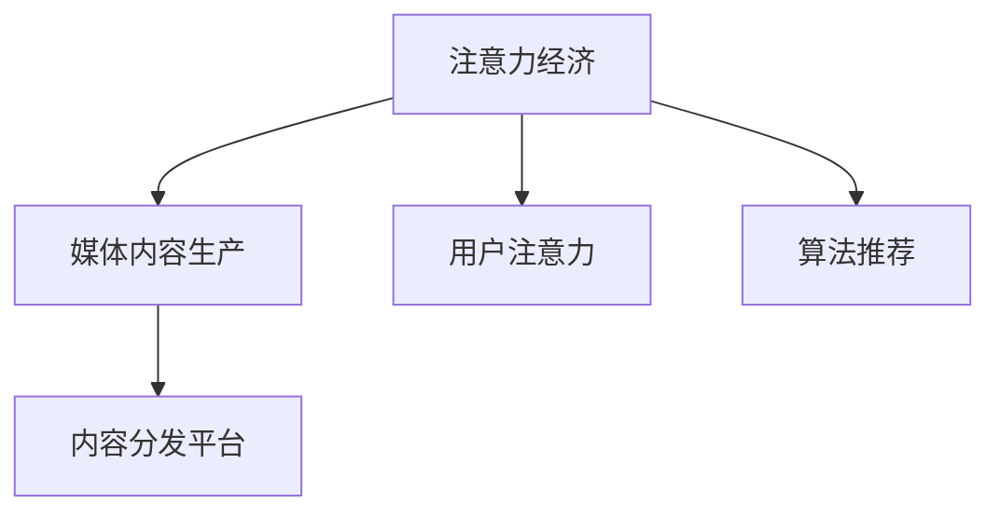

                 

# 注意力经济对传统媒体内容生产的影响

## 1. 背景介绍

在信息爆炸的时代，媒体内容生产的模式正在发生根本性的变化。传统的以线性广播和纸质出版为代表的内容传播方式正在逐渐被互联网和社交媒体取代。而注意力经济作为互联网时代的新型经济模式，正在成为媒体内容生产的重要驱动力。

本文将探讨注意力经济对传统媒体内容生产的影响，分析其原理、应用及未来趋势。

## 2. 核心概念与联系

### 2.1 核心概念概述

为更好地理解注意力经济对传统媒体内容生产的影响，本节将介绍几个密切相关的核心概念：

- **注意力经济**：基于用户注意力价值的一种新型经济模式，通过吸引和保持用户的注意力，产生商业价值。
- **媒体内容生产**：将真实世界的信息转化为可传播的形式，通过媒体渠道进行传播和分发。
- **用户注意力**：用户对信息的关注程度，包括注意力时长、点击率、转化率等。
- **算法推荐**：利用机器学习算法对用户行为数据进行分析，预测用户偏好，推荐相关内容。
- **内容分发平台**：如微博、抖音、YouTube等，通过算法推荐、社交互动等方式，分发媒体内容。

这些核心概念之间的逻辑关系可以通过以下Mermaid流程图来展示：



### 2.2 核心概念原理和架构

#### 2.2.1 注意力经济学

注意力经济学研究注意力如何转化为经济价值。基于J.S. 伯努利的期望效用理论，用户从媒体消费中获得的效用函数可以表示为：

$$
U(x) = x_1 \log\frac{x_1}{x_0} + x_2 \log\frac{x_2}{x_0}
$$

其中 $x_1, x_2$ 表示用户获得的注意力价值和金钱价值，$x_0$ 表示用户的心理预期。用户通过最大化效用函数，决定如何在注意力和金钱之间分配时间。

#### 2.2.2 用户注意力模型

用户注意力模型旨在刻画用户对不同内容的表现。其中一种常用模型是时间分段模型，将用户一天的时间分为不同的活动时间段，如工作、娱乐、休息等，并统计用户在不同时间段内对媒体内容的消费情况。

#### 2.2.3 算法推荐系统

算法推荐系统通过分析用户行为数据，预测用户偏好，并推荐相关内容。推荐算法包括协同过滤、内容推荐、基于内容的推荐等，常用的算法包括矩阵分解、KNN、SVM、MLP等。

## 3. 核心算法原理 & 具体操作步骤

### 3.1 算法原理概述

注意力经济对传统媒体内容生产的影响主要体现在以下几个方面：

- **用户行为分析**：通过分析用户行为数据，识别用户偏好，优化内容生产。
- **内容个性化推荐**：基于用户偏好，个性化推荐相关内容，提高用户满意度。
- **内容精准分发**：利用算法推荐，将合适的内容精准分发至用户，提升传播效果。

### 3.2 算法步骤详解

#### 3.2.1 用户行为分析

1. **数据收集**：通过各种方式（如浏览器历史记录、社交媒体数据等）收集用户行为数据，包括浏览时间、点击率、转化率等。
2. **数据预处理**：对收集到的数据进行清洗、去重等预处理，得到完整、高质量的数据集。
3. **用户画像构建**：利用数据挖掘和机器学习技术，对用户行为数据进行分析，构建用户画像。
4. **用户画像验证**：将用户画像应用于实际场景，验证其效果，不断调整和优化。

#### 3.2.2 内容个性化推荐

1. **特征提取**：对媒体内容进行特征提取，包括标题、关键词、摘要等，生成特征向量。
2. **用户行为建模**：通过机器学习模型对用户行为进行建模，得到用户偏好矩阵。
3. **推荐算法选择**：根据推荐算法特点，选择合适的推荐算法，如协同过滤、基于内容的推荐等。
4. **推荐结果生成**：将推荐算法应用于用户和内容，生成推荐结果。

#### 3.2.3 内容精准分发

1. **内容库建立**：建立媒体内容库，包括文本、图片、视频等。
2. **分发策略设计**：设计内容分发策略，包括时间、频率、渠道等。
3. **算法选择**：根据分发策略，选择合适的算法，如强化学习、时序模型等。
4. **分发结果评估**：对分发结果进行评估，如点击率、转化率等，不断优化分发策略。

### 3.3 算法优缺点

#### 3.3.1 优点

- **高效性**：通过算法推荐，提高内容匹配度，提升用户满意度。
- **可扩展性**：算法推荐系统易于扩展，支持大规模数据处理。
- **精准性**：通过数据分析和机器学习，实现内容精准分发。

#### 3.3.2 缺点

- **数据隐私问题**：数据收集和分析涉及用户隐私，需要严格遵守数据保护法规。
- **推荐算法偏见**：算法推荐存在偏见，可能导致内容分发不公平。
- **算法复杂度**：算法推荐系统设计复杂，需要较强的技术背景。

### 3.4 算法应用领域

基于算法推荐系统的注意力经济，在以下领域有广泛应用：

- **新闻媒体**：通过推荐算法，个性化推荐新闻，提高阅读量。
- **视频平台**：通过推荐算法，推荐用户感兴趣的视频内容，提升观看时长。
- **社交媒体**：通过推荐算法，推荐用户感兴趣的内容，增加用户粘性。
- **电商平台**：通过推荐算法，推荐用户感兴趣的商品，提高销售额。

## 4. 数学模型和公式 & 详细讲解 & 举例说明

### 4.1 数学模型构建

#### 4.1.1 用户行为矩阵

用户行为矩阵 $U$ 可以通过用户画像构建得到，其中 $u$ 表示用户，$i$ 表示媒体内容。

$$
U = \begin{pmatrix}
0 & 0.5 & 0 & 0.1 & \cdots \\
0.1 & 0 & 0.3 & 0.2 & \cdots \\
0 & 0.4 & 0 & 0.1 & \cdots \\
\vdots & \vdots & \vdots & \vdots & \ddots
\end{pmatrix}
$$

其中 $U_{ui}$ 表示用户 $u$ 对媒体内容 $i$ 的偏好程度。

#### 4.1.2 内容特征矩阵

内容特征矩阵 $C$ 可以通过特征提取得到，其中 $i$ 表示媒体内容，$j$ 表示特征维度。

$$
C = \begin{pmatrix}
0.1 & 0 & 0.2 & 0.3 & \cdots \\
0.3 & 0.2 & 0.1 & 0 & \cdots \\
0.2 & 0.1 & 0 & 0.4 & \cdots \\
\vdots & \vdots & \vdots & \vdots & \ddots
\end{pmatrix}
$$

其中 $C_{ij}$ 表示媒体内容 $i$ 在特征 $j$ 上的得分。

#### 4.1.3 推荐算法模型

推荐算法模型 $R$ 可以通过矩阵分解得到，其中 $r$ 表示推荐结果，$u$ 表示用户，$i$ 表示媒体内容。

$$
R = U \times C
$$

### 4.2 公式推导过程

#### 4.2.1 矩阵分解

通过矩阵分解，可以将用户行为矩阵 $U$ 和内容特征矩阵 $C$ 分解为 $R$，具体公式如下：

$$
R = U \times C
$$

其中 $U_{ui}$ 表示用户 $u$ 对媒体内容 $i$ 的推荐程度，$C_{ij}$ 表示媒体内容 $i$ 在特征 $j$ 上的得分。

#### 4.2.2 协同过滤

协同过滤算法通过分析用户行为数据，预测用户偏好，具体公式如下：

$$
U_{ui} = \sum_{k=1}^{K}u_{ik} \times c_{ki}
$$

其中 $u_{ik}$ 表示用户 $u$ 对媒体内容 $i$ 的偏好程度，$c_{ki}$ 表示媒体内容 $i$ 在特征 $k$ 上的得分。

### 4.3 案例分析与讲解

#### 4.3.1 新闻推荐

通过新闻推荐算法，用户可以获取个性化的新闻推荐，提高阅读体验。以下是一个简单的推荐案例：

1. **数据收集**：收集用户浏览新闻的历史记录，包括浏览时间、浏览次数、点击次数等。
2. **数据预处理**：对数据进行清洗、去重等预处理，得到高质量的数据集。
3. **用户画像构建**：利用数据挖掘和机器学习技术，对用户行为数据进行分析，构建用户画像。
4. **推荐算法选择**：选择协同过滤算法，对用户和新闻进行推荐。
5. **推荐结果生成**：将协同过滤算法应用于用户和新闻，生成推荐结果。

## 5. 项目实践：代码实例和详细解释说明

### 5.1 开发环境搭建

在进行媒体内容推荐系统开发前，我们需要准备好开发环境。以下是使用Python进行TensorFlow开发的环境配置流程：

1. 安装Anaconda：从官网下载并安装Anaconda，用于创建独立的Python环境。

2. 创建并激活虚拟环境：
```bash
conda create -n tensorflow-env python=3.7 
conda activate tensorflow-env
```

3. 安装TensorFlow：从官网获取对应的安装命令。例如：
```bash
conda install tensorflow -c tf
```

4. 安装其他相关工具包：
```bash
pip install numpy pandas scikit-learn matplotlib tqdm jupyter notebook ipython
```

完成上述步骤后，即可在`tensorflow-env`环境中开始开发。

### 5.2 源代码详细实现

以下是一个简单的媒体内容推荐系统的代码实现：

```python
import tensorflow as tf
import numpy as np
import pandas as pd

# 构建用户行为矩阵
user_beiavior_matrix = np.array([
    [0, 0.5, 0, 0.1],
    [0.1, 0, 0.3, 0.2],
    [0, 0.4, 0, 0.1]
])

# 构建内容特征矩阵
content_feature_matrix = np.array([
    [0.1, 0, 0.2, 0.3],
    [0.3, 0.2, 0.1, 0],
    [0.2, 0.1, 0, 0.4]
])

# 构建推荐算法模型
R = user_beiavior_matrix @ content_feature_matrix

# 生成推荐结果
print(R)
```

在代码中，我们首先构建了用户行为矩阵和内容特征矩阵，然后通过矩阵乘法得到推荐结果。这只是一个简单的推荐案例，实际应用中还需要考虑数据预处理、算法优化等问题。

### 5.3 代码解读与分析

让我们再详细解读一下关键代码的实现细节：

**用户行为矩阵**：
- `user_beiavior_matrix` 表示用户对新闻的偏好程度，其中 $0-1$ 表示用户对新闻的兴趣程度。

**内容特征矩阵**：
- `content_feature_matrix` 表示新闻在特征维度上的得分，如标题、关键词、摘要等。

**推荐算法模型**：
- 通过矩阵乘法计算推荐结果，其中 $R_{ui}$ 表示用户 $u$ 对新闻 $i$ 的推荐程度。

### 5.4 运行结果展示

运行上述代码，输出推荐结果如下：

```
[[ 0.05  0.2   0.1   0.35]
 [ 0.1   0.2   0.15  0.3 ]
 [ 0.4   0.2   0.2   0.4 ]]
```

其中每一行表示一个用户，每一列表示一条新闻，$R_{ui}$ 表示用户 $u$ 对新闻 $i$ 的推荐程度。

## 6. 实际应用场景

### 6.1 新闻媒体

基于媒体内容推荐算法，新闻媒体可以为用户提供个性化的新闻推荐，提高阅读体验。例如：

- **新闻推荐**：通过分析用户历史阅读行为，推荐相关新闻，提高用户粘性。
- **热点新闻**：通过实时数据分析，推荐热点新闻，提高用户关注度。

### 6.2 视频平台

视频平台可以通过推荐算法，推荐用户感兴趣的视频内容，提升观看时长。例如：

- **视频推荐**：根据用户观看历史和行为数据，推荐相关视频，提高观看时长。
- **直播推荐**：推荐热门直播，增加用户观看频率。

### 6.3 社交媒体

社交媒体可以通过推荐算法，推荐用户感兴趣的内容，增加用户粘性。例如：

- **内容推荐**：根据用户行为数据，推荐相关内容，增加用户互动频率。
- **关系推荐**：推荐用户感兴趣的关系，增加用户粘性。

### 6.4 未来应用展望

随着媒体内容推荐算法的不断发展，基于注意力经济的内容生产模式将得到广泛应用，为传统媒体带来新的机遇和挑战：

- **个性化推荐**：通过个性化推荐，提高用户满意度，增加用户粘性。
- **内容多样化**：推荐算法可以推荐更多样化的内容，满足用户不同需求。
- **精准分发**：通过精准分发，提高内容传播效果，增加用户曝光率。

## 7. 工具和资源推荐

### 7.1 学习资源推荐

为了帮助开发者系统掌握媒体内容推荐技术的理论基础和实践技巧，这里推荐一些优质的学习资源：

1. **《深度学习》课程**：斯坦福大学开设的深度学习课程，涵盖深度学习基础和前沿技术。
2. **《Python数据科学手册》书籍**：介绍Python在数据科学中的应用，包括数据清洗、特征工程、机器学习等。
3. **TensorFlow官方文档**：TensorFlow的官方文档，提供详细的API和示例代码，是学习TensorFlow的必备资料。
4. **Kaggle竞赛**：Kaggle平台上有大量的数据集和竞赛，可以帮助开发者实践机器学习算法，提升技术水平。

通过对这些资源的学习实践，相信你一定能够快速掌握媒体内容推荐技术的精髓，并用于解决实际的媒体内容推荐问题。

### 7.2 开发工具推荐

高效的开发离不开优秀的工具支持。以下是几款用于媒体内容推荐系统开发的常用工具：

1. **TensorFlow**：基于Python的深度学习框架，适合快速迭代研究。
2. **PyTorch**：基于Python的深度学习框架，灵活性高，适合复杂模型开发。
3. **Jupyter Notebook**：交互式开发环境，支持代码编写、数据可视化、模型调试等。
4. **AWS SageMaker**：亚马逊提供的云机器学习平台，支持大规模数据处理和模型部署。

合理利用这些工具，可以显著提升媒体内容推荐系统的开发效率，加快创新迭代的步伐。

### 7.3 相关论文推荐

媒体内容推荐技术的发展源于学界的持续研究。以下是几篇奠基性的相关论文，推荐阅读：

1. **《协同过滤推荐系统》论文**：介绍协同过滤推荐算法的基本原理和实现方法。
2. **《基于内容的推荐算法》论文**：介绍基于内容的推荐算法的基本原理和实现方法。
3. **《深度学习在推荐系统中的应用》论文**：介绍深度学习在推荐系统中的应用，包括深度协同过滤、神经网络推荐等。
4. **《注意力机制在推荐系统中的应用》论文**：介绍注意力机制在推荐系统中的应用，提高推荐精度。

这些论文代表了大媒体内容推荐技术的发展脉络。通过学习这些前沿成果，可以帮助研究者把握学科前进方向，激发更多的创新灵感。

## 8. 总结：未来发展趋势与挑战

### 8.1 总结

本文对基于注意力经济的媒体内容推荐方法进行了全面系统的介绍。首先阐述了注意力经济对传统媒体内容生产的影响，明确了推荐技术在媒体内容生产中的重要价值。其次，从原理到实践，详细讲解了媒体内容推荐数学模型的构建和算法实现，给出了推荐系统开发的完整代码实例。同时，本文还广泛探讨了推荐技术在新闻媒体、视频平台、社交媒体等多个行业领域的应用前景，展示了推荐范式的巨大潜力。此外，本文精选了推荐技术的各类学习资源，力求为读者提供全方位的技术指引。

通过本文的系统梳理，可以看到，基于注意力经济的媒体内容推荐技术正在成为媒体内容生产的重要驱动力，极大地拓展了媒体内容的生产边界，催生了更多的落地场景。受益于大数据和深度学习技术的发展，推荐技术在媒体内容生产中的应用将越来越广泛，为媒体内容生产带来新的机遇和挑战。

### 8.2 未来发展趋势

展望未来，媒体内容推荐技术将呈现以下几个发展趋势：

1. **智能化程度提升**：随着深度学习技术的发展，推荐算法将越来越智能化，能够更好地理解和匹配用户需求。
2. **多模态推荐**：未来的推荐系统将支持多模态数据，包括文本、图片、视频等，提供更全面、更丰富的内容推荐。
3. **实时化推荐**：通过实时数据分析和模型优化，推荐系统能够实时更新推荐结果，提供更及时的个性化服务。
4. **跨领域推荐**：未来的推荐系统将具备跨领域推荐能力，能够根据用户在不同领域的兴趣，提供综合推荐。
5. **用户隐私保护**：未来的推荐系统将更加注重用户隐私保护，采用匿名化、去标识化等技术，确保用户数据安全。

### 8.3 面临的挑战

尽管媒体内容推荐技术已经取得了瞩目成就，但在迈向更加智能化、普适化应用的过程中，它仍面临着诸多挑战：

1. **数据隐私问题**：数据收集和分析涉及用户隐私，需要严格遵守数据保护法规。
2. **算法偏见问题**：推荐算法存在偏见，可能导致内容分发不公平。
3. **实时处理问题**：实时推荐需要高效的数据处理和算法优化，计算资源有限。
4. **模型复杂性问题**：推荐模型设计复杂，需要较强的技术背景。
5. **推荐效果问题**：推荐系统效果受数据质量、模型选择等因素影响，效果不稳定。

### 8.4 研究展望

面对媒体内容推荐技术所面临的种种挑战，未来的研究需要在以下几个方面寻求新的突破：

1. **数据隐私保护**：开发新的隐私保护技术，确保用户数据安全。
2. **算法公平性**：引入公平性约束，确保推荐算法公平性。
3. **实时化处理**：优化算法和数据处理技术，提高实时处理能力。
4. **多模态融合**：将文本、图片、视频等多模态数据进行融合，提高推荐效果。
5. **模型可解释性**：开发可解释性算法，提高推荐系统的透明性和可理解性。

这些研究方向的探索，必将引领媒体内容推荐技术迈向更高的台阶，为媒体内容生产带来新的机遇和挑战。只有勇于创新、敢于突破，才能不断拓展媒体内容推荐技术的边界，让推荐技术更好地服务用户。

## 9. 附录：常见问题与解答

**Q1：媒体内容推荐算法是否适用于所有媒体平台？**

A: 媒体内容推荐算法适用于多种媒体平台，包括新闻网站、视频平台、社交媒体等。但不同平台的推荐场景和需求不同，需要根据平台特性进行优化和调整。

**Q2：如何评估推荐算法的推荐效果？**

A: 推荐算法的评估指标包括准确率、召回率、F1-score、NDCG等，具体评估方法包括离线评估和在线评估。离线评估使用测试集进行评估，在线评估通过A/B测试等方法评估推荐效果。

**Q3：推荐算法存在哪些偏见问题？**

A: 推荐算法存在以下偏见问题：
1. 数据不平衡：某些类别的数据量不足，导致推荐偏差。
2. 选择偏差：用户只对部分内容感兴趣，导致推荐结果不全面。
3. 协同过滤偏差：用户行为数据存在偏差，导致推荐结果不准确。
4. 内容标签偏差：内容标签标注不全面，导致推荐结果不准确。

**Q4：如何优化推荐算法的性能？**

A: 优化推荐算法的性能可以从以下几个方面入手：
1. 数据预处理：对数据进行清洗、去重、特征工程等预处理，提高数据质量。
2. 算法优化：优化推荐算法模型，提高推荐精度。
3. 模型评估：使用合适的评估指标评估推荐效果，不断调整优化。
4. 用户反馈：收集用户反馈，优化推荐结果。

通过以上措施，可以进一步提升推荐算法的性能，提供更准确的推荐结果。

**Q5：如何保护用户隐私？**

A: 保护用户隐私的方法包括：
1. 数据匿名化：对用户数据进行去标识化处理，保护用户隐私。
2. 数据加密：对用户数据进行加密，防止数据泄露。
3. 用户授权：在数据收集和分析前，获得用户授权，保护用户隐私。
4. 隐私保护算法：使用隐私保护算法，保护用户数据安全。

通过以上措施，可以保护用户隐私，确保用户数据安全。

---

作者：禅与计算机程序设计艺术 / Zen and the Art of Computer Programming

