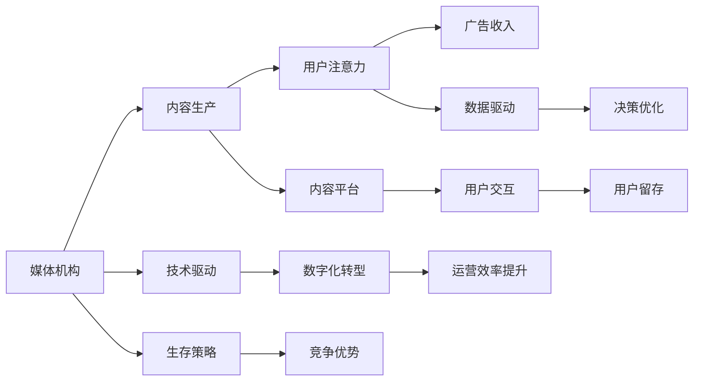

                 

# 注意力经济对传统媒体生存策略的挑战

> 关键词：注意力经济, 媒体生存策略, 新闻业, 互联网, 用户体验, 数据驱动

## 1. 背景介绍

### 1.1 问题由来

互联网和社交媒体的兴起，极大地改变了人们获取信息的方式。传统媒体面临的挑战从过去的主要集中在内容制作上，转变为如何吸引用户注意力，以及如何在海量信息中脱颖而出。注意力经济（Economy of Attention）的概念由此应运而生，成为新时代媒体产业的核心议题。

注意力经济指的是在信息爆炸的时代，媒体机构需要争取用户的关注度，利用各种资源吸引用户的注意力，从而创造价值的过程。在当前互联网环境下，传统媒体（如报纸、电视、广播等）面临的挑战包括：

- 用户注意力分散：互联网时代，用户可以随时随地获取信息，注意力分散，传统媒体难以维持高用户留存率。
- 广告收入下降：传统媒体的广告收入主要来源于电视、报纸等媒介，互联网广告竞争激烈，导致广告收入下滑。
- 技术依赖增加：现代媒体的数字化转型需要依赖各种新技术，如人工智能、大数据等，传统媒体需要克服技术上的限制。

## 2. 核心概念与联系

### 2.1 核心概念概述

为更好地理解注意力经济对传统媒体的影响，我们需要梳理以下几个核心概念：

- 注意力经济：指媒体机构通过吸引用户注意力，创造经济价值的经济模式。在互联网时代，用户的注意力成为最重要的资源。
- 用户注意力：指用户在信息消费过程中，对某特定信息的专注程度。用户注意力的高低直接影响到信息的传播效果和经济价值。
- 媒体机构：指包括传统媒体和互联网媒体在内的所有从事信息生产和传播的机构。
- 内容平台：指提供信息展示和交互的互联网平台，如新闻网站、社交媒体等。
- 广告收入：指通过广告展示、付费会员等形式，从用户那里获取的经济收益。
- 技术驱动：指媒体机构在数字化转型过程中，广泛采用人工智能、大数据、云计算等新技术，提升生产效率和运营效率。

这些概念之间存在紧密联系。媒体机构通过提供高质量的内容，吸引用户的注意力，进而通过广告收入等方式实现经济价值。技术的进步则进一步提升了媒体机构的内容生产能力和运营效率，使得注意力经济的运作更加高效和精细。

### 2.2 核心概念原理和架构的 Mermaid 流程图



## 3. 核心算法原理 & 具体操作步骤

### 3.1 算法原理概述

注意力经济的运作原理主要基于以下几个关键点：

- **用户注意力模型**：通过分析用户在信息消费过程中的行为数据，构建用户注意力模型，了解用户对不同信息的偏好和需求。
- **内容推荐算法**：基于用户注意力模型，设计推荐算法，对用户进行个性化推荐，提高信息传播效果和经济价值。
- **广告定位与投放**：通过用户注意力模型和内容推荐算法，精准定位用户群体，进行定向广告投放，提升广告转化率。
- **数据驱动决策**：利用用户注意力数据和广告效果数据，进行数据分析，优化内容生产、广告投放和运营策略。

### 3.2 算法步骤详解

1. **数据采集与处理**：采集用户在信息平台上的行为数据，包括浏览记录、点击率、停留时间等，对数据进行清洗和标准化处理。
2. **用户注意力建模**：使用机器学习算法，如协同过滤、矩阵分解等，构建用户注意力模型，评估用户对不同内容的偏好和关注程度。
3. **内容推荐算法设计**：根据用户注意力模型，设计个性化推荐算法，如基于内容的推荐、协同过滤推荐等，提高内容传播效率。
4. **广告定位与投放**：基于用户注意力模型和内容推荐结果，进行精准的广告定位和定向投放，提升广告效果和转化率。
5. **数据驱动决策优化**：利用用户注意力数据和广告效果数据，进行数据分析和建模，优化内容生产、广告投放和运营策略。

### 3.3 算法优缺点

注意力经济的优势包括：

- **提升传播效果**：通过个性化推荐和精准广告投放，提高内容传播效果和经济价值。
- **数据驱动决策**：通过数据分析，优化内容生产、广告投放和运营策略，提升运营效率。

但同时也存在一些问题：

- **数据隐私和安全**：在数据采集和处理过程中，存在用户隐私和数据安全风险。
- **技术门槛高**：需要依赖复杂的数据分析和机器学习算法，对技术要求较高。
- **过度依赖用户行为**：过度依赖用户行为数据，可能导致内容同质化，缺乏创新性。

### 3.4 算法应用领域

注意力经济的应用领域非常广泛，以下是一些典型场景：

- **新闻媒体**：通过个性化推荐和精准广告投放，提升新闻报道的传播效果和广告收入。
- **社交媒体**：利用用户注意力模型，提高用户互动率和广告转化率。
- **电子商务**：根据用户行为数据，进行个性化推荐和精准广告投放，提升用户体验和销售额。
- **视频平台**：通过用户注意力模型和内容推荐算法，提高视频内容的点击率和观看时长。

## 4. 数学模型和公式 & 详细讲解 & 举例说明

### 4.1 数学模型构建

注意力经济的核心在于用户注意力模型和推荐算法的设计。我们以协同过滤推荐算法为例，介绍其数学模型的构建过程。

假设用户集为 $U$，物品集为 $I$，用户 $u$ 对物品 $i$ 的评分 $r_{ui}$ 表示为 $[1,5]$ 区间内的整数，评分矩阵为 $R \in \mathbb{R}^{U \times I}$。协同过滤推荐算法的基本思想是通过分析用户之间的评分行为，预测用户对未评分物品的评分。

推荐算法的设计目标是最小化预测评分与实际评分的均方误差。设预测评分向量为 $\hat{R} \in \mathbb{R}^{U \times I}$，其计算公式为：

$$
\hat{R}_{ui} = \sum_{v \in U}\alpha_{uv}r_{vi} + \sum_{j \in I}\beta_{ij}r_{uj}
$$

其中 $\alpha_{uv} \in \mathbb{R}$ 和 $\beta_{ij} \in \mathbb{R}$ 为可训练的系数。

### 4.2 公式推导过程

推荐算法的目标函数为：

$$
\min_{\alpha,\beta} \frac{1}{2}\sum_{u \in U}\sum_{i \in I}(r_{ui} - \hat{R}_{ui})^2
$$

对该目标函数求导，得到：

$$
\frac{\partial}{\partial \alpha_{uv}} \mathcal{L}(\alpha,\beta) = \sum_{i \in I}(r_{ui} - \hat{R}_{ui})x_{uv} + \sum_{v' \in U}(r_{v'i} - \hat{R}_{v'i})\alpha_{u'v'}
$$

其中 $x_{uv} = \frac{r_{vi}}{\sqrt{\sum_{i \in I}r_{vi}^2}}$ 为归一化的评分向量。

将目标函数代入，得到：

$$
\min_{\alpha,\beta} \frac{1}{2}\sum_{u \in U}\sum_{i \in I}(r_{ui} - \hat{R}_{ui})^2
$$

### 4.3 案例分析与讲解

以一个新闻平台为例，分析其如何利用注意力经济模型提升用户体验和广告收入。

假设该平台有 $U$ 个用户，$I$ 个新闻文章，用户对新闻文章的评分数据已经收集完成。平台可以使用协同过滤推荐算法，对用户进行个性化推荐，提升用户点击率和停留时间。同时，通过分析用户注意力模型，平台可以定位目标用户群体，进行定向广告投放，提升广告收入。

## 5. 项目实践：代码实例和详细解释说明

### 5.1 开发环境搭建

为了实现注意力经济模型，我们需要一个完整的开发环境，包括以下几个部分：

- **数据采集工具**：如浏览器插件、API接口等，用于收集用户在信息平台上的行为数据。
- **数据存储和管理**：使用关系型数据库（如MySQL）或分布式存储（如Hadoop），存储和管理用户行为数据。
- **数据分析工具**：如Pandas、NumPy等，用于数据清洗、处理和分析。
- **机器学习框架**：如Scikit-learn、TensorFlow等，用于构建和训练用户注意力模型。
- **推荐系统平台**：如MARS、Ozzie等，用于实现个性化推荐和广告投放。

### 5.2 源代码详细实现

以下是一个基于协同过滤推荐算法的Python代码实现示例：

```python
import numpy as np
from scipy.sparse.linalg import svds

def collaborative_filtering(data, k=10):
    # 将评分矩阵转换为稀疏矩阵
    R = np.array(data)
    R = R + np.eye(R.shape[0]) # 添加单位矩阵
    R = np.where(R > 0, R, 0) # 将非零元素转换为1
    R = R / R.sum(axis=1) # 归一化评分矩阵
    
    # 使用奇异值分解求解用户向量
    U, S, V = svds(R, k)
    U = U / np.linalg.norm(U, axis=1, keepdims=True)
    V = V / np.linalg.norm(V, axis=1, keepdims=True)
    
    # 计算预测评分
    pred_r = np.dot(U, np.dot(np.diag(S), V.T))
    
    # 生成推荐结果
    predictions = []
    for i in range(pred_r.shape[0]):
        pred_items = np.argsort(pred_r[i])[::-1] # 按评分降序排序
        predictions.append(pred_items[1:5]) # 返回评分最高的前5篇文章
    return predictions
```

### 5.3 代码解读与分析

以上代码实现了基于协同过滤推荐算法的推荐系统，步骤如下：

1. **数据预处理**：将评分矩阵转换为稀疏矩阵，并添加单位矩阵，保证矩阵的非奇异性和正定性。
2. **用户向量计算**：使用奇异值分解求解用户向量，将用户评分转换为用户向量。
3. **预测评分计算**：计算预测评分，生成推荐结果。
4. **推荐结果输出**：返回评分最高的前5篇文章，作为推荐结果。

## 6. 实际应用场景

### 6.1 新闻媒体

新闻媒体是注意力经济的重要应用场景之一。通过分析用户点击率、停留时间等行为数据，构建用户注意力模型，进行个性化推荐和精准广告投放，提升新闻报道的传播效果和经济价值。

### 6.2 社交媒体

社交媒体平台通过用户注意力模型和推荐算法，提高用户互动率和广告转化率。例如，微博、微信等平台利用用户行为数据，推荐用户感兴趣的内容，提升用户粘性。

### 6.3 电子商务

电子商务网站通过用户行为数据，进行个性化推荐和精准广告投放，提升用户体验和销售额。例如，京东、淘宝等平台利用用户购物行为数据，推荐商品，提高用户购买转化率。

### 6.4 视频平台

视频平台通过用户注意力模型和内容推荐算法，提高视频内容的点击率和观看时长。例如，腾讯视频、爱奇艺等平台利用用户观看行为数据，推荐视频内容，提升平台用户黏性。

## 7. 工具和资源推荐

### 7.1 学习资源推荐

为了掌握注意力经济的理论和实践，推荐以下学习资源：

- **《注意力经济：媒体机构的战略转型》**：由知名媒体经济学专家撰写，深入分析了注意力经济对媒体机构的影响和转型策略。
- **《数据驱动的媒体生态：技术、商业模式与未来》**：介绍数据驱动在媒体生态中的应用，分析技术进步对媒体机构的深远影响。
- **《互联网广告：技术与策略》**：系统讲解互联网广告的原理、技术和策略，为媒体机构提供广告投放的指导。
- **《推荐系统》**：介绍推荐系统的基本原理和算法，为媒体机构实现个性化推荐提供技术支持。

### 7.2 开发工具推荐

为了构建注意力经济的推荐系统，推荐以下开发工具：

- **Python**：开发语言，广泛应用于数据科学和机器学习领域。
- **Scikit-learn**：简单易用的机器学习库，提供多种推荐算法和模型。
- **TensorFlow**：深度学习框架，支持大规模分布式训练，适合构建复杂的推荐系统。
- **MARS**：推荐系统平台，提供多种推荐算法和数据处理工具，适合媒体机构的实际应用。

### 7.3 相关论文推荐

为了深入了解注意力经济和推荐系统，推荐以下经典论文：

- **《协同过滤：基于用户的协同过滤算法》**：介绍协同过滤推荐算法的原理和实现方法。
- **《深度学习在推荐系统中的应用》**：介绍深度学习在推荐系统中的应用，分析其优势和挑战。
- **《注意力机制在推荐系统中的应用》**：介绍注意力机制在推荐系统中的应用，分析其提升效果。
- **《注意力经济：媒体机构的注意力转型策略》**：分析注意力经济对媒体机构的战略影响，提出转型建议。

## 8. 总结：未来发展趋势与挑战

### 8.1 研究成果总结

本文系统介绍了注意力经济对传统媒体生存策略的挑战，分析了注意力经济的原理和应用。具体包括：

- **注意力经济模型**：通过用户注意力模型和推荐算法，提高内容传播效果和经济价值。
- **推荐系统平台**：利用数据驱动，优化内容生产和广告投放策略，提升运营效率。
- **实际应用场景**：新闻媒体、社交媒体、电子商务、视频平台等媒体机构的注意力经济应用。

### 8.2 未来发展趋势

未来，注意力经济将呈现以下发展趋势：

- **数据驱动决策**：利用大数据和机器学习算法，提升媒体机构运营效率和决策准确性。
- **个性化推荐算法**：通过深度学习和注意力机制，提升个性化推荐的效果和用户体验。
- **多模态信息融合**：利用文本、图像、视频等多种模态信息，构建更全面的用户注意力模型。
- **隐私保护与数据安全**：加强用户隐私保护，提升数据安全措施，确保用户数据安全。

### 8.3 面临的挑战

注意力经济面临的挑战包括：

- **数据隐私和安全**：用户数据隐私和安全问题，需要建立严格的数据保护机制。
- **技术门槛高**：需要掌握复杂的数据分析和机器学习技术，对技术要求较高。
- **用户行为多样性**：用户行为多样性，需要构建灵活、动态的注意力模型。

### 8.4 研究展望

未来，在注意力经济的研究方向上，可以进一步探索：

- **多模态信息融合**：将文本、图像、视频等多种模态信息，构建更全面的用户注意力模型，提升推荐效果。
- **隐私保护与数据安全**：加强用户隐私保护，提升数据安全措施，确保用户数据安全。
- **个性化推荐算法**：利用深度学习和注意力机制，提升个性化推荐的效果和用户体验。

这些方向的研究，将有助于媒体机构更好地应对注意力经济的挑战，实现高效、精准的运营策略。

## 9. 附录：常见问题与解答

### Q1：如何构建有效的用户注意力模型？

**A1:** 构建有效的用户注意力模型需要以下几个步骤：
1. **数据采集**：收集用户在信息平台上的行为数据，包括浏览记录、点击率、停留时间等。
2. **数据处理**：对数据进行清洗和标准化处理，去除噪声和异常值。
3. **特征工程**：选择和提取有用的特征，如点击率、停留时间、页面访问深度等。
4. **模型训练**：使用机器学习算法，如协同过滤、矩阵分解等，构建用户注意力模型。
5. **模型评估**：使用交叉验证等方法，评估模型的准确性和泛化能力。

### Q2：如何优化推荐算法的效果？

**A2:** 优化推荐算法的效果需要以下几个步骤：
1. **算法选择**：选择适合的推荐算法，如协同过滤、基于内容的推荐、深度学习推荐等。
2. **模型调优**：对模型参数进行调优，提升模型的预测精度和效果。
3. **用户反馈**：收集用户反馈，不断优化推荐算法和策略。
4. **多模态融合**：将文本、图像、视频等多种模态信息融合，构建更全面的用户注意力模型。

### Q3：如何确保数据隐私和安全？

**A3:** 确保数据隐私和安全需要以下几个步骤：
1. **数据匿名化**：对用户数据进行匿名化处理，去除敏感信息。
2. **数据加密**：对用户数据进行加密处理，确保数据传输和存储的安全性。
3. **访问控制**：建立严格的数据访问控制机制，确保只有授权人员可以访问敏感数据。
4. **审计与监控**：对数据访问和使用进行审计和监控，及时发现和处理异常情况。

### Q4：如何处理用户行为多样性？

**A4:** 处理用户行为多样性需要以下几个步骤：
1. **行为分析**：分析用户行为的特征和模式，识别不同的用户群体。
2. **模型多样性**：构建多个用户注意力模型，适应不同的用户群体。
3. **动态调整**：根据用户行为变化，动态调整模型参数和推荐策略。
4. **个性化推荐**：根据用户行为和兴趣，提供个性化的推荐内容。

---

作者：禅与计算机程序设计艺术 / Zen and the Art of Computer Programming

