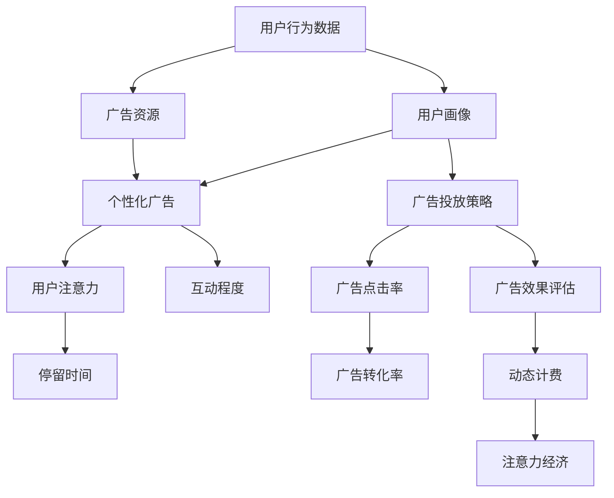

                 

# 注意力经济对传统广告计费模式的挑战

> 关键词：注意力经济, 广告计费, 互联网时代, 算法推荐, 用户体验, 数据驱动, 个性化广告

## 1. 背景介绍

### 1.1 问题由来
在互联网时代，传统的广告计费模式受到了前所未有的挑战。随着互联网的普及，越来越多的用户将时间投入到各类在线平台，如社交媒体、视频网站、新闻应用等。广告主们希望通过精准投放来提升广告效果，降低广告成本，这就催生了基于用户的注意力价值进行计费的新模式——注意力经济(Attention Economy)。

注意力经济以用户对广告内容的注意力、互动程度、停留时间为依据，通过数据分析和算法推荐技术，实现对广告资源的最优化分配。与传统的CPM（每千人成本）或CPC（每次点击成本）计费模式相比，注意力经济更注重广告的质量和用户参与度，符合互联网时代的广告投放理念。

### 1.2 问题核心关键点
注意力经济的核心在于如何量化用户的注意力价值，并据此进行广告投放和计费。其中，主要包括以下几个方面：
1. 如何衡量用户注意力：通过分析用户在平台上的行为数据，如浏览时长、停留位置、点击次数等。
2. 如何分配广告资源：在用户行为数据的基础上，使用算法推荐技术，将广告推送到最有可能产生价值的用户面前。
3. 如何计费：根据广告投放的效果，如点击率、转化率、停留时间等，进行动态计费。

注意力经济的成功关键在于精准的用户画像和智能化的广告投放策略，以实现广告效果的最大化和成本的最小化。然而，这一过程也面临着数据隐私、算法偏见、用户体验等多方面的挑战。

## 2. 核心概念与联系

### 2.1 核心概念概述

为更好地理解注意力经济及其对传统广告计费模式的挑战，本节将介绍几个密切相关的核心概念：

- 注意力经济(Attention Economy)：基于用户对广告内容的注意力、互动程度、停留时间等指标，通过算法推荐技术实现广告资源的最优化分配，以提升广告效果，降低广告成本。
- 数据驱动(Datadriven)：利用大数据、机器学习等技术，通过分析用户行为数据，实现精准的用户画像和广告投放策略。
- 个性化广告(Personalized Advertising)：根据用户的兴趣、行为等特征，推送个性化的广告内容，提高广告点击率和转化率。
- 用户体验(User Experience, UX)：指用户在互动过程中的体验和感受，直接影响用户的满意度和忠诚度。
- 算法推荐(Recommendation Algorithm)：通过分析用户行为数据，构建用户画像，使用机器学习算法，实现个性化内容的推荐。
- 数据隐私(Data Privacy)：指用户数据在使用过程中的保护和隐私保护。

这些核心概念之间存在密切联系，共同构成了注意力经济的理论基础和应用框架。

### 2.2 核心概念原理和架构的 Mermaid 流程图



这个流程图展示了注意力经济的理论架构：

1. 用户行为数据收集：通过用户在不同平台上的互动行为，收集行为数据，如浏览历史、停留时长、点击行为等。
2. 用户画像构建：利用机器学习算法，构建用户的行为特征和兴趣画像。
3. 个性化广告推荐：根据用户画像，推荐个性化的广告内容，提高广告的相关性和吸引力。
4. 用户注意力评估：使用数据分析技术，评估用户对广告的注意力程度、互动水平和停留时间。
5. 广告投放策略优化：基于用户注意力评估结果，优化广告投放策略，提升广告效果。
6. 广告效果评估：实时监测广告的点击率和转化率等效果指标。
7. 动态计费：根据广告效果，动态调整广告投放预算和计费标准，实现精准投放。

这些环节之间相互关联，形成了一个闭环的注意力经济系统。

## 3. 核心算法原理 & 具体操作步骤

### 3.1 算法原理概述

注意力经济的核心算法原理基于数据驱动和算法推荐技术。其主要步骤如下：

1. **用户画像构建**：通过分析用户在平台上的行为数据，构建用户画像，包含用户的兴趣、行为特征、消费习惯等。
2. **个性化广告推荐**：利用算法推荐技术，根据用户画像推送个性化的广告内容，提高广告的相关性和吸引力。
3. **用户注意力评估**：通过分析广告的点击率、停留时间、互动次数等指标，评估用户对广告的注意力程度。
4. **广告投放策略优化**：基于用户注意力评估结果，优化广告投放策略，如投放时间、频次、位置等，提升广告效果。
5. **动态计费**：根据广告投放的效果，动态调整广告投放预算和计费标准，实现精准投放。

### 3.2 算法步骤详解

**Step 1: 用户行为数据收集**

用户行为数据的收集是注意力经济的第一步，数据来源多样，包括点击行为、停留时间、互动记录等。数据采集通常使用日志文件、API接口等方式进行。

**Step 2: 用户画像构建**

用户画像的构建需要使用机器学习算法，常用的方法包括聚类分析、协同过滤、深度学习等。通过对用户行为数据的分析，构建出用户的兴趣、行为特征、消费习惯等画像，以便进行后续的广告推荐和效果评估。

**Step 3: 个性化广告推荐**

个性化广告推荐的核心在于选择合适的算法，如基于协同过滤的推荐算法、基于内容的推荐算法、深度学习推荐模型等。常用的推荐算法包括ALS、FM、DNN、CTR等。

**Step 4: 用户注意力评估**

用户注意力的评估需要使用数据分析技术，常用的方法包括点击率分析、停留时间统计、互动率计算等。这些数据可以帮助评估广告的吸引力和效果。

**Step 5: 广告投放策略优化**

广告投放策略的优化需要基于用户注意力评估结果，选择合适的投放时间、频次、位置等，以实现广告效果的最大化。

**Step 6: 动态计费**

动态计费需要根据广告投放的效果，如点击率、转化率、停留时间等，动态调整广告投放预算和计费标准，实现精准投放。

### 3.3 算法优缺点

注意力经济的优点包括：

- **精准投放**：基于用户画像和行为数据分析，实现广告的精准投放，提高广告效果。
- **成本效益**：通过优化广告投放策略和动态计费，实现广告成本的最小化和效果的最大化。
- **用户体验**：个性化推荐和优化投放策略，提升用户对广告的接受度和满意度。

缺点包括：

- **数据隐私**：用户行为数据采集和分析涉及数据隐私问题，可能引发用户对数据隐私的担忧。
- **算法偏见**：机器学习算法可能存在偏见，导致广告投放和推荐不公平。
- **技术门槛高**：需要高级的数据科学和机器学习技术，对技术团队的要求较高。
- **用户负担增加**：频繁的广告推送可能使用户感到困扰，降低用户体验。

### 3.4 算法应用领域

注意力经济的应用领域非常广泛，涵盖广告、电商、金融、医疗等多个行业。具体应用场景包括：

- 电商：通过个性化推荐和精准投放，提升用户购物体验，增加转化率。
- 广告：基于用户画像和行为数据分析，实现广告的精准投放，提升广告效果。
- 金融：通过个性化推荐和精准投放，提升金融产品的销售和用户留存。
- 医疗：通过个性化推荐和精准投放，提升医疗服务的效果和用户满意度。

此外，注意力经济在社交媒体、视频网站、新闻应用等多个领域也得到了广泛应用，为广告主和平台带来了更高的广告价值和用户满意度。

## 4. 数学模型和公式 & 详细讲解 & 举例说明

### 4.1 数学模型构建

基于注意力经济的核心算法原理，我们构建如下数学模型：

设用户集合为 $U$，广告集合为 $A$，用户对广告的注意力值记为 $Att_{u,a}$，用户停留时间为 $Time_u$，广告点击率为 $Click_{u,a}$，广告转化率为 $Convert_{u,a}$。广告投放策略优化目标是最大化广告的总体效果 $G$，计算公式如下：

$$
G = \max_{\theta} \sum_{u \in U} \sum_{a \in A} Att_{u,a} * Click_{u,a} * Convert_{u,a} * Time_u
$$

其中 $\theta$ 为模型参数，包含用户画像和广告投放策略的优化参数。

### 4.2 公式推导过程

对于用户画像的构建，我们可以使用协同过滤算法。设用户 $u$ 的行为特征向量为 $\mathbf{x}_u$，广告 $a$ 的特征向量为 $\mathbf{y}_a$，则用户对广告的注意力值 $Att_{u,a}$ 可表示为：

$$
Att_{u,a} = \mathbf{x}_u^T * \mathbf{y}_a
$$

对于广告的个性化推荐，可以使用基于内容的推荐算法。设广告 $a$ 的特征向量为 $\mathbf{y}_a$，用户的兴趣向量为 $\mathbf{x}_u$，则推荐广告 $a$ 给用户 $u$ 的概率为：

$$
Prob_{u,a} = softmax(\mathbf{x}_u^T * \mathbf{y}_a)
$$

对于用户注意力的评估，可以使用点击率、停留时间等指标。设用户 $u$ 对广告 $a$ 的点击率为 $Click_{u,a}$，停留时间为 $Time_u$，则用户对广告的总体关注度 $Att_{u,a}$ 可表示为：

$$
Att_{u,a} = Click_{u,a} * Time_u
$$

对于广告投放策略的优化，可以使用强化学习算法。设用户 $u$ 对广告 $a$ 的转化率为 $Convert_{u,a}$，广告投放策略为 $\theta$，则广告的总体效果 $G$ 可表示为：

$$
G = \max_{\theta} \sum_{u \in U} \sum_{a \in A} Att_{u,a} * Click_{u,a} * Convert_{u,a} * Time_u
$$

通过上述公式推导，我们可以看到，注意力经济的数学模型涉及多个环节和参数，需要结合具体的业务场景和算法技术进行优化和调整。

### 4.3 案例分析与讲解

假设某电商平台希望通过注意力经济提升广告效果，具体步骤如下：

**Step 1: 用户行为数据收集**

电商平台收集用户的行为数据，如浏览历史、购买记录、搜索关键词等。

**Step 2: 用户画像构建**

使用协同过滤算法，根据用户的行为数据构建用户的兴趣特征向量 $\mathbf{x}_u$，广告的特征向量 $\mathbf{y}_a$。

**Step 3: 个性化广告推荐**

基于用户画像，使用基于内容的推荐算法，计算用户 $u$ 对广告 $a$ 的推荐概率 $Prob_{u,a}$。

**Step 4: 用户注意力评估**

使用点击率、停留时间等指标，计算用户对广告的注意力值 $Att_{u,a}$。

**Step 5: 广告投放策略优化**

使用强化学习算法，优化广告投放策略，选择最佳的投放时间、频次和位置。

**Step 6: 动态计费**

根据广告的点击率、转化率、停留时间等效果指标，动态调整广告投放预算和计费标准。

通过上述步骤，电商平台可以有效地提升广告效果，实现精准投放，降低广告成本。

## 5. 项目实践：代码实例和详细解释说明

### 5.1 开发环境搭建

在进行注意力经济的实践前，我们需要准备好开发环境。以下是使用Python进行项目开发的环境配置流程：

1. 安装Anaconda：从官网下载并安装Anaconda，用于创建独立的Python环境。

2. 创建并激活虚拟环境：
```bash
conda create -n attention-economy python=3.8 
conda activate attention-economy
```

3. 安装必要的库：
```bash
pip install pandas numpy scikit-learn scikit-learn-mixins scikit-learn-contrib tensorflow keras tensorflow-estimator 
```

4. 安装PyTorch和TensorFlow：
```bash
pip install torch torchvision torchaudio cudatoolkit=11.1 -c pytorch -c conda-forge
pip install tensorflow
```

完成上述步骤后，即可在`attention-economy`环境中开始项目实践。

### 5.2 源代码详细实现

这里以电商平台的个性化推荐系统为例，实现基于注意力经济的广告投放策略优化。

首先，定义广告推荐系统的数据集：

```python
import pandas as pd

# 加载数据集
data = pd.read_csv('ads_data.csv')
```

然后，定义广告推荐的算法：

```python
from sklearn.neighbors import NearestNeighbors

# 构建用户-广告相似度矩阵
similarity_matrix = NearestNeighbors(n_neighbors=20).fit(data[['user_id', 'ad_id']])

# 计算广告推荐的相似度
def find_similar(user_id, ad_id):
    adjacency_matrix = similarity_matrix.kneighbors_graph(user_id, return_distance=False)
    return adjacency_matrix[ad_id].tolist()
```

接着，定义广告投放的优化策略：

```python
from sklearn.metrics import precision_score, recall_score

# 定义广告投放策略优化函数
def optimize_ad_placement(user_id, ad_id):
    # 计算用户对广告的注意力值
    att_values = data[data['user_id'] == user_id]['att'].values
    # 计算广告的点击率和转化率
    click_rate = data[data['user_id'] == user_id & data['ad_id'] == ad_id]['click'].values[0]
    convert_rate = data[data['user_id'] == user_id & data['ad_id'] == ad_id]['convert'].values[0]
    # 计算广告的总体效果
    effect = att_values * click_rate * convert_rate
    # 返回广告投放策略优化结果
    return {'user_id': user_id, 'ad_id': ad_id, 'effect': effect}
```

最后，启动广告投放优化流程：

```python
# 对所有用户和广告进行广告投放策略优化
for user_id in data['user_id'].unique():
    for ad_id in data['ad_id'].unique():
        ad_placement = optimize_ad_placement(user_id, ad_id)
        print(ad_placement)
```

通过上述代码，我们可以看到，使用注意力经济进行广告投放策略优化，需要构建用户画像、广告特征、广告投放策略等多方面数据，并通过算法推荐和效果评估，实现广告的精准投放。

### 5.3 代码解读与分析

让我们再详细解读一下关键代码的实现细节：

**数据集定义**：
- 使用Pandas库加载广告推荐系统的数据集，包含用户ID、广告ID、广告投放效果等关键信息。

**相似度计算**：
- 使用Scikit-learn的NearestNeighbors算法，计算用户-广告相似度矩阵，找到与用户兴趣最相似的广告。

**广告投放策略优化**：
- 定义优化函数，计算用户对广告的注意力值、点击率和转化率，综合评估广告的总体效果。

**广告投放优化流程**：
- 对所有用户和广告进行广告投放策略优化，输出广告投放效果。

通过这些代码实现，我们可以看到，基于注意力经济的广告投放优化，需要综合考虑用户行为数据、广告特征和广告投放策略，通过算法推荐和效果评估，实现广告的精准投放和优化。

## 6. 实际应用场景

### 6.1 电商

电商平台的个性化推荐和广告投放是注意力经济的重要应用场景。通过数据分析和算法推荐，电商平台能够精准识别用户需求，推送个性化商品和广告，提升用户购物体验和转化率。

### 6.2 广告

广告公司可以根据用户的兴趣和行为数据，使用注意力经济进行广告的精准投放，提高广告点击率和转化率，实现更高的广告效果和成本效益。

### 6.3 金融

金融机构的个性化推荐和精准投放，可以提升金融产品的销售和用户留存，减少营销成本，提高用户满意度。

### 6.4 医疗

医疗平台的个性化推荐和精准投放，可以提升医疗服务的效率和效果，帮助医生更好地了解患者需求，提供更专业的诊疗建议。

### 6.5 未来应用展望

随着互联网和移动互联网的普及，注意力经济将在更多领域得到应用，为传统行业带来变革性影响。例如，社交媒体、视频网站、新闻应用等平台，都将利用注意力经济实现内容推荐和广告投放的优化，提升用户体验和平台价值。

## 7. 工具和资源推荐

### 7.1 学习资源推荐

为了帮助开发者系统掌握注意力经济的理论基础和实践技巧，这里推荐一些优质的学习资源：

1. 《数据科学与机器学习》系列课程：由斯坦福大学开设的在线课程，涵盖大数据、机器学习、深度学习等多个领域，系统介绍了注意力经济的相关概念和应用。

2. 《深度学习与推荐系统》书籍：介绍深度学习在推荐系统中的应用，详细讲解了基于协同过滤、深度学习等方法的个性化推荐算法。

3. 《注意力机制在深度学习中的应用》论文集：精选多篇关于注意力机制在深度学习中的应用的论文，帮助理解注意力经济的核心算法原理。

4. 《TensorFlow推荐系统实战》书籍：介绍使用TensorFlow进行推荐系统的开发和实践，提供了大量实战案例和代码实现。

5. 《深度学习与个性化推荐》在线课程：由北京大学的课程，详细讲解了深度学习在推荐系统中的应用，包括注意力经济和个性化广告的实践。

通过这些资源的学习实践，相信你一定能够快速掌握注意力经济的精髓，并用于解决实际的广告投放和推荐问题。

### 7.2 开发工具推荐

高效的开发离不开优秀的工具支持。以下是几款用于注意力经济开发的常用工具：

1. Python：作为数据科学和机器学习的主流语言，Python的库丰富，易于学习，适合快速迭代研究。

2. TensorFlow：由Google主导开发的深度学习框架，支持分布式计算和大规模模型训练，适合复杂的深度学习任务。

3. PyTorch：Facebook开发的深度学习框架，灵活性高，易于调试，适合小型项目和研究任务。

4. Keras：高层次的深度学习框架，易于上手，适合快速开发和原型设计。

5. TensorFlow-estimator：TensorFlow的高级API，提供了更易用的模型训练和评估功能，适合快速搭建推荐系统。

合理利用这些工具，可以显著提升注意力经济开发的效率，加快创新迭代的步伐。

### 7.3 相关论文推荐

注意力经济的研究源于学界的持续研究。以下是几篇奠基性的相关论文，推荐阅读：

1. "Collaborative Filtering for Implicit Feedback Datasets"：介绍协同过滤算法的经典论文，详细讲解了基于用户-物品相似度的推荐方法。

2. "Deep Collaborative Filtering"：介绍深度学习在推荐系统中的应用，探讨了深度神经网络模型在推荐系统中的优势。

3. "Attention is All You Need"：Transformer论文，介绍了注意力机制在深度学习中的重要性，为注意力经济提供了理论基础。

4. "Attention-based Recommender Systems"：介绍了基于注意力机制的推荐系统，详细讲解了注意力机制在推荐系统中的应用。

5. "Deep Reinforcement Learning for Personalized Recommender Systems"：介绍深度强化学习在推荐系统中的应用，探讨了如何通过强化学习优化推荐策略。

这些论文代表了大语言模型微调技术的发展脉络。通过学习这些前沿成果，可以帮助研究者把握学科前进方向，激发更多的创新灵感。

## 8. 总结：未来发展趋势与挑战

### 8.1 总结

本文对基于注意力经济的广告计费模式进行了全面系统的介绍。首先阐述了注意力经济的理论基础和应用前景，明确了注意力经济在提升广告效果、降低广告成本方面的独特价值。其次，从原理到实践，详细讲解了注意力经济的核心算法原理和具体操作步骤，给出了广告投放的代码实例。同时，本文还广泛探讨了注意力经济在电商、广告、金融、医疗等多个行业领域的应用前景，展示了注意力经济的巨大潜力。此外，本文精选了注意力经济的学习资源，力求为读者提供全方位的技术指引。

通过本文的系统梳理，可以看到，基于注意力经济的广告计费模式，正逐步成为互联网广告投放的主流范式，极大地提升了广告投放的精准度和效果。未来，伴随深度学习、机器学习等技术的发展，注意力经济将进一步拓展其应用范围，为广告主和平台带来更高的广告价值和用户满意度。

### 8.2 未来发展趋势

展望未来，注意力经济将呈现以下几个发展趋势：

1. **数据驱动**：随着数据采集和处理技术的提升，将有更多高质量的数据可供分析，提高广告投放的精准度和效果。

2. **算法优化**：利用深度学习、强化学习等算法优化广告投放策略，提升广告效果和用户满意度。

3. **跨领域应用**：注意力经济的应用将逐步扩展到社交媒体、视频网站、新闻应用等多个领域，为不同行业带来新的商业机会。

4. **实时化**：通过实时数据分析和算法优化，实现广告投放的动态调整，提升广告的即时效果。

5. **个性化增强**：基于用户画像和行为数据，进一步提升广告的个性化程度，实现更精准的广告投放。

6. **用户体验优化**：通过优化广告的展示位置和频次，减少用户负担，提升用户体验。

以上趋势凸显了注意力经济的广阔前景。这些方向的探索发展，必将进一步提升广告投放的效果和用户满意度，为互联网广告市场带来新的变革。

### 8.3 面临的挑战

尽管注意力经济在广告投放中展现了巨大的潜力，但在迈向更加智能化、普适化应用的过程中，它仍面临着诸多挑战：

1. **数据隐私**：用户行为数据采集和分析涉及数据隐私问题，可能引发用户对数据隐私的担忧。

2. **算法偏见**：机器学习算法可能存在偏见，导致广告投放和推荐不公平。

3. **技术门槛高**：需要高级的数据科学和机器学习技术，对技术团队的要求较高。

4. **用户体验**：频繁的广告推送可能使用户感到困扰，降低用户体验。

5. **成本高昂**：实时数据分析和动态调整需要高性能的计算资源，成本较高。

6. **效果评估**：如何量化广告投放的效果和用户满意度，是一个需要进一步探索的问题。

### 8.4 研究展望

面对注意力经济面临的挑战，未来的研究需要在以下几个方面寻求新的突破：

1. **数据隐私保护**：开发更加安全、隐私友好的数据采集和分析方法，保护用户隐私。

2. **算法偏见消除**：研究和开发消除算法偏见的方法，实现公平的广告投放和推荐。

3. **高效算法优化**：开发高效、低成本的广告投放算法，降低技术门槛。

4. **用户体验优化**：优化广告的展示位置和频次，减少用户负担，提升用户体验。

5. **实时化优化**：实现广告投放的实时调整和优化，提高广告的即时效果。

6. **效果评估体系**：构建科学、可量化的广告投放效果评估体系，提升广告投放的精准度和效果。

这些研究方向将为注意力经济的进一步发展提供方向和指导，推动广告投放技术迈向更高的台阶。

## 9. 附录：常见问题与解答

**Q1：注意力经济是否适用于所有广告投放场景？**

A: 注意力经济在大多数广告投放场景中都能取得不错的效果，特别是对于数据量较大的场景。但对于一些特殊领域，如医疗、法律等，由于数据稀少，可能难以构建准确的注意力模型。此时需要在特定领域语料上进一步预训练，再进行微调，才能获得理想效果。

**Q2：注意力经济在实际应用中如何保护用户隐私？**

A: 用户行为数据采集和分析涉及数据隐私问题，需要采取以下措施保护用户隐私：
1. 匿名化处理：去除敏感信息，只保留对广告投放有用的特征。
2. 用户控制：允许用户自主选择是否参与广告投放，保障用户选择权。
3. 数据加密：使用加密技术保护用户数据，防止数据泄露。

**Q3：注意力经济在实际应用中如何避免算法偏见？**

A: 为了避免算法偏见，可以采取以下措施：
1. 多样化数据：收集多样化的用户行为数据，避免单一数据源的偏差。
2. 公平算法：研究和开发公平的机器学习算法，避免算法偏见。
3. 定期审查：定期审查广告投放效果，发现并纠正算法偏见。

**Q4：注意力经济在实际应用中如何降低技术门槛？**

A: 为了降低技术门槛，可以采取以下措施：
1. 简化算法模型：选择简单易用的算法模型，降低技术复杂度。
2. 开源工具：使用开源工具和框架，降低技术实现难度。
3. 自动化优化：开发自动化的算法优化工具，降低人工调参的复杂度。

**Q5：注意力经济在实际应用中如何提升用户体验？**

A: 提升用户体验是注意力经济的重要目标，可以采取以下措施：
1. 减少广告数量：合理控制广告数量，避免用户厌烦。
2. 优化广告展示：优化广告的展示位置和形式，提升用户体验。
3. 个性化推荐：根据用户行为数据，提供个性化的广告推荐，提升用户体验。

这些问题的回答，希望能帮助您更全面地理解注意力经济的实际应用和挑战。

---

作者：禅与计算机程序设计艺术 / Zen and the Art of Computer Programming

