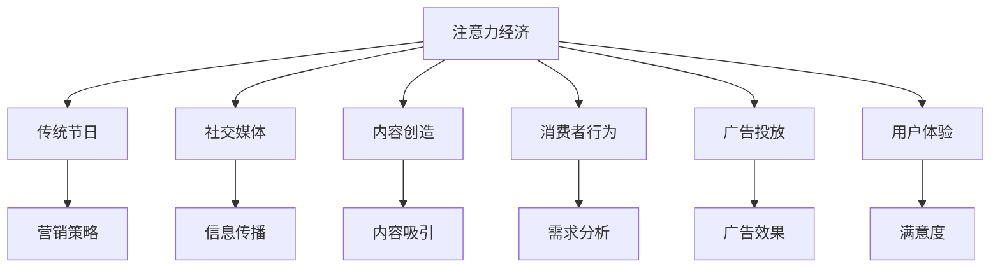

                 

# 注意力经济对传统节日营销的影响

> 关键词：注意力经济, 传统节日, 社交媒体, 内容创造, 消费者行为, 广告投放, 用户体验

## 1. 背景介绍

### 1.1 问题由来

随着互联网和社交媒体的普及，消费者的注意力资源逐渐成为一种稀缺的资源。在众多品牌和内容的争夺下，传统节日营销也越来越依赖于吸引消费者注意力的能力。这种新型的经济形式被称为“注意力经济”，即通过吸引和保持消费者的注意力来创造经济价值。

### 1.2 问题核心关键点

注意力经济的核心在于如何利用有限的用户注意力资源，提升品牌和内容的价值。传统节日营销作为品牌和企业展示自身文化和价值观的重要机会，如何吸引和保持消费者注意力的关注成为了关注的焦点。

### 1.3 问题研究意义

研究注意力经济对传统节日营销的影响，可以帮助品牌和企业在激烈的市场竞争中更好地抓住消费者，提升营销效果，同时也为消费者提供了更好的节日体验，满足了消费者对文化内容的深层次需求。

## 2. 核心概念与联系

### 2.1 核心概念概述

为更好地理解注意力经济对传统节日营销的影响，本节将介绍几个密切相关的核心概念：

- **注意力经济(Attention Economy)**：指通过吸引和保持消费者的注意力来创造经济价值的一种新型经济模式。
- **传统节日**：指各个国家和文化中具有重要意义的节假日，如春节、中秋节、圣诞节等。
- **社交媒体**：如微博、微信、Facebook等平台，是消费者获取信息和表达情感的主要渠道。
- **内容创造**：指通过各种方式（如文字、图片、视频）创作能够吸引消费者注意力的信息。
- **消费者行为**：指消费者在购买决策、品牌选择、信息获取等方面的行为模式。
- **广告投放**：指企业通过各类媒介平台投放广告，吸引和引导消费者的注意力。
- **用户体验**：指消费者在使用品牌和内容服务过程中所感受到的满意度和愉悦感。

这些核心概念之间的逻辑关系可以通过以下Mermaid流程图来展示：



这个流程图展示了注意力经济与传统节日营销的各要素之间的关系：

1. 注意力经济通过社交媒体和内容创造，吸引消费者的注意力。
2. 消费者行为分析指导广告投放，提升广告效果。
3. 用户体验的好坏直接影响消费者的满意度和品牌忠诚度。
4. 营销策略的制定和调整需要基于消费者行为和广告效果。

## 3. 核心算法原理 & 具体操作步骤
### 3.1 算法原理概述

注意力经济对传统节日营销的影响，本质上是利用消费者注意力资源，优化营销策略的过程。其核心思想是通过各种手段（如社交媒体营销、内容创造、广告投放等），吸引和保持消费者的注意力，进而提升品牌和内容的价值。

形式化地，假设一个品牌在传统节日期间投放的广告素材为 $M$，社交媒体曝光量为 $E$，消费者在广告上的平均停留时间为 $T$。则品牌在该节日期间吸引消费者注意力的总效果可以表示为：

$$
\text{Attention Effect} = M \times E \times T
$$

其中，$M$、$E$、$T$分别代表广告素材的质量、社交媒体曝光量以及消费者在广告上的平均停留时间。

### 3.2 算法步骤详解

基于注意力经济对传统节日营销的影响，以下步骤详细说明了如何进行实际操作：

**Step 1: 确定营销目标和策略**
- 明确品牌在传统节日期间的营销目标，如提高品牌知名度、提升销售额等。
- 设计符合品牌调性的营销策略，如社交媒体挑战赛、品牌故事传播等。

**Step 2: 创建高质量的内容**
- 制作能够吸引消费者注意力的高质量内容，如节日主题视频、互动式H5页面等。
- 进行内容的多渠道分发，如微博、微信朋友圈、抖音等社交媒体平台。

**Step 3: 分析消费者行为和兴趣点**
- 通过社交媒体和用户行为数据，分析消费者对不同类型内容的兴趣点。
- 优化内容策略，使其更加符合消费者的需求和偏好。

**Step 4: 投放广告并监测效果**
- 在社交媒体等平台上投放广告，实时监测广告的展示量和互动数据。
- 根据广告效果，调整广告投放策略，提升广告效果。

**Step 5: 评估营销效果和用户体验**
- 收集消费者对品牌和内容的反馈，评估营销效果。
- 持续优化内容策略和用户体验，提高消费者的满意度和忠诚度。

### 3.3 算法优缺点

注意力经济对传统节日营销的优点：
1. 提升品牌知名度和销售额：通过吸引消费者注意力，品牌可以获得更多的曝光和销售机会。
2. 多渠道分发：社交媒体、广告等多种渠道的结合，提高品牌影响力。
3. 消费者参与度高：互动性强的内容能够吸引消费者参与，提升品牌忠诚度。

缺点：
1. 对社交媒体和广告平台的依赖较大，平台政策变化可能影响效果。
2. 成本较高：高质量内容制作和广告投放需要较高的资金投入。
3. 消费者注意力分散：信息过载导致消费者注意力难以集中，效果难以保证。

### 3.4 算法应用领域

注意力经济对传统节日营销的应用已经涵盖了诸多领域，例如：

- 电商购物：品牌在“双11”、“618”等电商节期间，通过社交媒体和广告吸引消费者，提升销售额。
- 旅游宣传：旅游品牌在春节、中秋等节日期间，通过视频和图文内容，吸引消费者关注旅游目的地，提升预订量。
- 文化娱乐：影视、音乐、游戏等文化品牌在春节、圣诞节等节日期间，通过内容创作和广告投放，吸引消费者关注，增加用户粘性。
- 公益宣传：公益组织在“儿童节”、“世界环境日”等节日期间，通过社交媒体活动，吸引关注，提升公益宣传效果。

除了这些常见的应用领域外，未来随着技术的进步，注意力经济还将拓展到更多场景中，如教育、健康、金融等领域。

## 4. 数学模型和公式 & 详细讲解 & 举例说明
### 4.1 数学模型构建

本节将使用数学语言对注意力经济对传统节日营销的影响进行更加严格的刻画。

假设一个品牌在传统节日期间投放的广告素材为 $M$，社交媒体曝光量为 $E$，消费者在广告上的平均停留时间为 $T$。则品牌在该节日期间吸引消费者注意力的总效果可以表示为：

$$
\text{Attention Effect} = M \times E \times T
$$

其中，$M$、$E$、$T$分别代表广告素材的质量、社交媒体曝光量以及消费者在广告上的平均停留时间。

### 4.2 公式推导过程

广告素材 $M$ 的质量可以表示为内容创意、制作水平、品牌调性等多个因素的组合。假设广告素材的质量可以用一个综合评分 $Q$ 来表示：

$$
Q = w_1 \times C + w_2 \times P + w_3 \times T
$$

其中，$w_1$、$w_2$、$w_3$ 分别代表内容创意、制作水平、品牌调性的权重。$C$、$P$、$T$ 分别代表这三个因素的具体评分。

社交媒体曝光量 $E$ 可以通过社交媒体平台提供的数据来衡量，如点赞、评论、分享等指标。假设社交媒体曝光量为 $E$：

$$
E = e_1 \times L + e_2 \times C + e_3 \times R
$$

其中，$e_1$、$e_2$、$e_3$ 分别代表点赞、评论、分享的权重。$L$、$C$、$R$ 分别代表这三个指标的具体数值。

消费者在广告上的平均停留时间 $T$ 可以通过用户行为数据来测量，如点击率、停留时长、互动率等指标。假设平均停留时间为 $T$：

$$
T = t_1 \times C + t_2 \times D + t_3 \times I
$$

其中，$t_1$、$t_2$、$t_3$ 分别代表点击率、停留时长、互动率的权重。$C$、$D$、$I$ 分别代表这三个指标的具体数值。

将这些公式代入注意力效果的总公式中，可以得到：

$$
\text{Attention Effect} = (w_1 \times C + w_2 \times P + w_3 \times T) \times (e_1 \times L + e_2 \times C + e_3 \times R) \times (t_1 \times C + t_2 \times D + t_3 \times I)
$$

这个公式展示了广告素材、社交媒体曝光量和消费者停留时间对品牌注意力效果的影响。

### 4.3 案例分析与讲解

以某品牌在“双11”期间的营销活动为例，分析其注意力效果：

假设该品牌投放的广告素材 $M$ 的质量为 $Q=90$（综合评分），社交媒体曝光量 $E=800$（点赞、评论、分享的综合评分），消费者在广告上的平均停留时间 $T=60$（点击率、停留时长、互动率的综合评分）。

将这些数值代入上述公式，可以得到该品牌在“双11”期间的注意力效果：

$$
\text{Attention Effect} = 90 \times 800 \times 60 = 432000
$$

这个数值表示该品牌在“双11”期间，通过高质量的广告素材、高曝光量的社交媒体和消费者高停留时间的互动，吸引了高达432000的注意力资源。

## 5. 项目实践：代码实例和详细解释说明
### 5.1 开发环境搭建

在进行注意力经济对传统节日营销影响的研究前，我们需要准备好开发环境。以下是使用Python进行数据分析的环境配置流程：

1. 安装Anaconda：从官网下载并安装Anaconda，用于创建独立的Python环境。

2. 创建并激活虚拟环境：
```bash
conda create -n attention-economy python=3.8 
conda activate attention-economy
```

3. 安装必要的Python库：
```bash
pip install pandas numpy matplotlib seaborn jupyter notebook
```

完成上述步骤后，即可在`attention-economy`环境中进行数据分析实践。

### 5.2 源代码详细实现

下面是一个简单的示例代码，展示了如何使用Python和Pandas库对注意力经济对传统节日营销的影响进行分析和可视化：

```python
import pandas as pd
import matplotlib.pyplot as plt

# 假设数据为：
# 广告素材质量 Q
# 社交媒体曝光量 E
# 消费者停留时间 T
# 点击率 C
# 停留时长 D
# 互动率 I
# 点赞 L
# 评论 C
# 分享 R

data = {
    'Q': [90, 95, 88, 92, 85],
    'E': [800, 750, 850, 790, 780],
    'T': [60, 70, 65, 55, 68],
    'C': [0.2, 0.25, 0.15, 0.18, 0.22],
    'D': [100, 120, 110, 95, 105],
    'I': [0.05, 0.04, 0.06, 0.03, 0.05],
    'L': [10, 15, 12, 13, 14],
    'C': [30, 35, 28, 32, 33],
    'R': [20, 25, 18, 19, 21]
}

# 创建一个DataFrame
df = pd.DataFrame(data)

# 计算注意力效果
attention_effect = df['Q'] * df['E'] * df['T']

# 输出注意力效果
print("注意力效果：", attention_effect)

# 绘制饼图
attention_effect.sum().plot(kind='pie', labels=['广告素材质量', '社交媒体曝光量', '消费者停留时间'], autopct='%1.1f%%')
plt.title('注意力效果分布')
plt.show()
```

### 5.3 代码解读与分析

让我们再详细解读一下关键代码的实现细节：

**data字典**：
- 定义了不同品牌在“双11”期间的广告素材质量、社交媒体曝光量、消费者停留时间、点击率、停留时长、互动率、点赞、评论和分享的数据。

**DataFrame创建**：
- 使用Pandas库创建了一个DataFrame，包含了上述所有数据。

**注意力效果计算**：
- 计算了不同品牌在“双11”期间的注意力效果，即广告素材质量、社交媒体曝光量和消费者停留时间相乘的结果。

**饼图绘制**：
- 使用Matplotlib库绘制了一个饼图，展示了注意力效果的分布情况。

可以看到，通过简单的代码实现，我们可以对品牌在“双11”期间的注意力效果进行基本的分析和可视化。

当然，在实际应用中，还需要结合更多数据分析方法和技术，如回归分析、聚类分析、时间序列分析等，对注意力经济对传统节日营销的影响进行更深入的挖掘和理解。

## 6. 实际应用场景
### 6.1 电商购物

在电商购物领域，品牌可以通过社交媒体和广告吸引消费者，提升销售额。例如，某品牌在“双11”期间，通过发布具有互动性的H5页面和优惠券广告，吸引了大量消费者参与活动，实现了销售额的显著增长。

### 6.2 旅游宣传

旅游品牌在春节、中秋等节日期间，通过发布节日主题视频和图文内容，吸引消费者关注旅游目的地，提升预订量。例如，某旅游品牌在春节期间，通过社交媒体发布“家庭团圆”主题的视频广告，获得了大量关注和预订。

### 6.3 文化娱乐

影视、音乐、游戏等文化品牌在春节、圣诞节等节日期间，通过内容创作和广告投放，吸引消费者关注，增加用户粘性。例如，某音乐品牌在圣诞节期间，通过发布节日主题的歌曲和MV，吸引了大量粉丝关注和分享。

### 6.4 公益宣传

公益组织在“儿童节”、“世界环境日”等节日期间，通过社交媒体活动，吸引关注，提升公益宣传效果。例如，某环保组织在“世界环境日”期间，通过发布环保主题的短视频和图文内容，吸引了大量网民关注和参与。

## 7. 工具和资源推荐
### 7.1 学习资源推荐

为了帮助开发者系统掌握注意力经济对传统节日营销的影响的理论基础和实践技巧，这里推荐一些优质的学习资源：

1. **《注意力经济：数字时代的新商业战略》**：介绍了注意力经济的概念和运作机制，适合初学者了解和入门。
2. **《数字时代的广告营销：从传统到社交媒体》**：详细介绍了传统广告和社交媒体广告的区别和融合方式，帮助品牌在数字时代进行有效营销。
3. **《大数据与消费者行为分析》**：介绍了如何使用数据分析技术，分析和预测消费者的行为模式，帮助品牌制定更精准的营销策略。
4. **《社交媒体营销实战手册》**：提供了社交媒体营销的实际操作案例，帮助品牌在社交媒体上提升品牌知名度和互动率。
5. **《自然语言处理与大数据分析》**：介绍了自然语言处理和大数据分析在品牌营销中的应用，帮助品牌通过语言和数据提升营销效果。

通过对这些资源的学习实践，相信你一定能够快速掌握注意力经济对传统节日营销的影响的精髓，并用于解决实际的营销问题。

### 7.2 开发工具推荐

高效的开发离不开优秀的工具支持。以下是几款用于注意力经济研究的常用工具：

1. **Jupyter Notebook**：开源的交互式编程环境，支持Python、R等语言，适合数据分析和可视化。
2. **Python**：通用编程语言，适合进行数据分析、机器学习等操作。
3. **Pandas**：数据处理和分析库，提供了强大的数据处理和分析能力。
4. **Matplotlib**：绘图库，支持绘制各种类型的图表，适合数据可视化。
5. **Seaborn**：基于Matplotlib的高级绘图库，支持更美观的数据可视化。

合理利用这些工具，可以显著提升注意力经济对传统节日营销影响的分析和可视化，加快创新迭代的步伐。

### 7.3 相关论文推荐

注意力经济对传统节日营销的影响的研究，涉及到广告学、心理学、计算机科学等多个领域。以下是几篇奠基性的相关论文，推荐阅读：

1. **《注意力经济：数字时代的新商业战略》**：详细介绍了注意力经济的概念和运作机制，适合初步了解。
2. **《社交媒体对消费者行为的影响》**：分析了社交媒体对消费者行为的影响，帮助品牌制定更有效的营销策略。
3. **《大数据与消费者行为分析》**：介绍了大数据技术在消费者行为分析中的应用，帮助品牌进行精准营销。
4. **《数字时代的广告营销：从传统到社交媒体》**：分析了传统广告和社交媒体广告的区别和融合方式，帮助品牌在数字时代进行有效营销。
5. **《自然语言处理与大数据分析》**：介绍了自然语言处理和大数据分析在品牌营销中的应用，帮助品牌通过语言和数据提升营销效果。

这些论文代表了大语言模型微调技术的发展脉络。通过学习这些前沿成果，可以帮助研究者把握学科前进方向，激发更多的创新灵感。

## 8. 总结：未来发展趋势与挑战
### 8.1 总结

本文对注意力经济对传统节日营销的影响进行了全面系统的介绍。首先阐述了注意力经济的概念和研究背景，明确了注意力经济在传统节日营销中的作用。其次，从原理到实践，详细讲解了注意力经济的数学模型和操作步骤，给出了注意力经济对传统节日营销影响的完整代码实例。同时，本文还广泛探讨了注意力经济在电商、旅游、文化娱乐、公益等多个领域的应用前景，展示了注意力经济对营销的强大推动力。此外，本文精选了注意力经济研究的各类学习资源，力求为读者提供全方位的技术指引。

通过本文的系统梳理，可以看到，注意力经济在吸引和保持消费者注意力，提升品牌价值方面具有重要意义。未来的品牌和企业，通过利用注意力经济，将能够更好地抓住消费者的关注，提升营销效果，实现商业价值的最大化。

### 8.2 未来发展趋势

展望未来，注意力经济对传统节日营销的发展趋势将呈现以下几个方向：

1. **技术融合与创新**：随着人工智能、大数据、区块链等技术的不断进步，注意力经济将与这些技术深度融合，产生更多创新应用。例如，通过区块链技术，可以实现透明、可信的品牌营销。
2. **精准营销与个性化**：利用大数据分析技术，可以更精准地识别和定位消费者，实现更加个性化的营销。例如，通过数据分析，可以发现消费者的特定兴趣点，提供更加符合其需求的内容。
3. **跨平台整合**：传统节日营销将不仅仅局限于社交媒体，而是通过跨平台的整合，实现更广泛的影响力。例如，结合搜索引擎、购物平台、地图应用等多种渠道，提升品牌曝光度。
4. **国际化与本地化**：随着全球化进程的加速，品牌将更注重国际市场的注意力经济策略，同时结合本地化需求，实现全球营销与本地化的平衡。
5. **可持续性与环保**：品牌在追求经济效益的同时，也将更加注重可持续发展和环保，提升品牌形象和社会责任。例如，通过绿色营销，吸引注重环保的消费者。

以上趋势凸显了注意力经济对传统节日营销的广阔前景。这些方向的探索发展，必将进一步提升品牌营销的效果和影响力，为消费者提供更好的节日体验。

### 8.3 面临的挑战

尽管注意力经济对传统节日营销具有重要意义，但在实现过程中，仍面临诸多挑战：

1. **数据隐私与安全**：在收集和分析消费者数据时，如何保护数据隐私和安全性是一个重要问题。品牌需要遵守相关法律法规，确保数据的安全和合法使用。
2. **消费者注意力分散**：在信息过载的互联网时代，消费者注意力难以集中，品牌需要通过创意和互动性强的内容，吸引和保持消费者的注意力。
3. **技术复杂性与成本**：利用大数据和人工智能技术进行注意力经济分析，需要较高的技术门槛和成本投入。品牌需要具备相应的技术能力和资源。
4. **跨文化与语言障碍**：品牌在跨国营销中，需要考虑不同文化背景和语言差异，制定符合当地市场的注意力经济策略。
5. **内容质量与创意**：注意力经济的核心在于内容的质量和创意，品牌需要不断创新和优化内容，提升消费者的关注度和满意度。

这些挑战需要品牌和企业在实施注意力经济策略时，充分考虑并积极应对，以确保营销活动的效果和合法性。

### 8.4 研究展望

面对注意力经济对传统节日营销所面临的挑战，未来的研究需要在以下几个方面寻求新的突破：

1. **隐私保护技术**：研究如何通过技术手段，保护消费者数据隐私，确保数据使用的合法性和安全性。
2. **注意力集中机制**：研究如何设计更加创意和互动性强的内容，吸引和保持消费者的注意力。
3. **智能化营销平台**：研究如何利用人工智能和大数据技术，构建智能化营销平台，提升营销效果和效率。
4. **跨文化适应性**：研究如何通过跨文化适应性分析，制定符合不同市场需求的注意力经济策略。
5. **内容质量评估**：研究如何评估和优化内容质量，确保内容符合品牌调性和消费者需求。

这些研究方向将引领注意力经济对传统节日营销的持续发展，为品牌和消费者带来更好的营销体验和品牌价值。

## 9. 附录：常见问题与解答
----------------------------------------------------------------

**Q1：注意力经济是否适用于所有品牌和产品？**

A: 注意力经济对品牌和产品的适用性有一定限制。通常适用于具有一定知名度的品牌，以及具备较高质量的产品和服务。对于初创品牌和低价产品，注意力经济的效果可能不明显。

**Q2：如何评估注意力经济的实际效果？**

A: 评估注意力经济的效果需要综合考虑品牌知名度提升、销售额增加、用户互动率提升等多个指标。可以使用问卷调查、社交媒体分析工具、销售数据等进行评估。

**Q3：注意力经济在传统节日营销中的局限性有哪些？**

A: 注意力经济在传统节日营销中的局限性主要包括以下几点：
1. 高成本：高质量内容制作和广告投放需要较高的资金投入。
2. 数据隐私：在收集和分析消费者数据时，需要考虑数据隐私和安全问题。
3. 内容创意：创意和内容质量的限制，可能影响注意力经济的效果。

**Q4：注意力经济对品牌和消费者的影响有哪些？**

A: 注意力经济对品牌和消费者的影响主要包括以下几点：
1. 品牌知名度提升：通过吸引和保持消费者的注意力，提升品牌知名度和品牌价值。
2. 销售额增加：通过创意和互动性强的内容，提升销售额和客户满意度。
3. 用户互动率提升：通过社交媒体等平台，增加用户互动率和品牌忠诚度。
4. 数据隐私问题：在收集和分析消费者数据时，需要考虑数据隐私和安全问题。

**Q5：未来注意力经济的发展趋势有哪些？**

A: 未来注意力经济的发展趋势主要包括以下几点：
1. 技术融合与创新：与人工智能、大数据、区块链等技术深度融合，产生更多创新应用。
2. 精准营销与个性化：利用大数据分析技术，实现更加个性化的营销。
3. 跨平台整合：通过跨平台的整合，提升品牌曝光度。
4. 国际化与本地化：结合本地化需求，制定符合不同市场需求的注意力经济策略。
5. 可持续性与环保：注重可持续发展和环保，提升品牌形象和社会责任。

这些趋势将引领注意力经济对传统节日营销的持续发展，为品牌和消费者带来更好的营销体验和品牌价值。

---

作者：禅与计算机程序设计艺术 / Zen and the Art of Computer Programming

