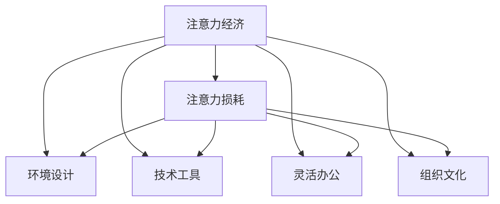

                 

## 1. 背景介绍

在数字化转型的浪潮中，注意力经济（Economic of Attention）逐渐成为一种主导性的经济形态，影响着各行各业的工作场所设计。特别是对于以知识工作为主的组织，如软件开发、创意产业、教育机构等，如何优化工作场所的设计以提高员工的注意力和创造力，成为他们面临的一个关键问题。

### 1.1 问题由来
注意力经济的概念最早由经济学家约瑟夫·皮尼（Joseph Pine II）提出，用于描述信息过载时代，注意力作为一种稀缺资源在经济活动中的重要性。在数字化时代，信息无处不在，但并非所有信息都具有价值，注意力作为一种稀缺资源，其价值远超传统的物质资源。

对于知识工作者，注意力是其生产力的关键因素。如何在工作场所中优化设计，提高员工的注意力，降低分心因素，已成为组织关注的焦点。从企业到教育机构，从办公空间设计到远程工作，注意力经济的理念正在被广泛应用。

### 1.2 问题核心关键点
注意力经济对工作场所设计的影响主要体现在以下几个方面：

- **环境设计**：如何通过物理和虚拟空间的设计，减少干扰，提供专注的工作环境。
- **技术工具**：如何利用技术工具，如通知管理、任务管理、时间管理等，辅助员工管理注意力。
- **工作方式**：如何调整工作方式，如灵活办公、轮班制、远程工作等，以适应注意力变化的需求。
- **文化建设**：如何建立促进注意力集中的组织文化和行为规范，如减少会议频率、优化会议流程等。

理解这些关键点，有助于我们系统地探索注意力经济对工作场所设计的深远影响。

### 1.3 问题研究意义
理解并应对注意力经济对工作场所设计的影响，对提高组织的生产力和员工的满意度具有重要意义：

1. **提升生产力**：优化工作环境，减少干扰，提高员工注意力，从而提升整体工作效率。
2. **降低成本**：通过合理的设计和管理，减少员工因分心产生的低效工作时间，降低企业运营成本。
3. **增强创新**：提供一个有利于集中注意力的环境，激发员工的创造力，推动组织创新。
4. **提高员工满意度**：通过关注员工的注意力需求，提升员工工作体验，增加员工忠诚度。
5. **适应数字化时代**：在信息爆炸的时代，如何有效地管理注意力，已成为组织适应数字化转型的关键。

## 2. 核心概念与联系

### 2.1 核心概念概述

为更好地理解注意力经济对工作场所设计的影响，本节将介绍几个关键概念：

- **注意力经济（Economic of Attention）**：信息过载时代，注意力作为一种稀缺资源，其经济价值逐渐凸显，成为影响组织运营的重要因素。
- **注意力损耗（Attention Drain）**：在工作环境中，由于噪音、干扰、视觉刺激等原因，员工注意力不断被损耗，导致工作效率下降。
- **环境设计（Environmental Design）**：通过物理和虚拟空间的设计，优化工作环境，提高员工注意力和专注度。
- **技术工具（Technology Tools）**：利用各种工具和系统，如时间管理软件、任务管理系统、协作平台等，辅助员工管理注意力。
- **灵活办公（Flexible Working）**：通过调整工作时间和地点，如远程工作、弹性办公等，满足员工对注意力的不同需求。
- **组织文化（Organizational Culture）**：通过建立促进注意力集中的文化，如减少会议、优化会议流程等，提升组织效率。

这些概念之间的关系可以通过以下Mermaid流程图来展示：



这个流程图展示了一些关键概念及其之间的关系：

1. 注意力经济作为核心概念，通过影响注意力损耗、环境设计、技术工具、灵活办公和组织文化等多个方面，进而影响工作场所设计。
2. 环境设计、技术工具、灵活办公和组织文化等都是具体的实现手段，用于减少注意力损耗，提高员工注意力。

## 3. 核心算法原理 & 具体操作步骤
### 3.1 算法原理概述

注意力经济对工作场所设计的影响，主要体现在如何通过减少注意力损耗，优化环境设计、技术工具、工作方式和组织文化，来提高员工的工作效率和满意度。

形式化地，我们可以将注意力损耗表示为 $L$，其中 $L$ 由环境干扰 $E$、噪音 $N$、视觉刺激 $V$ 和精神压力 $P$ 组成：

$$
L = E + N + V + P
$$

其中 $E$ 表示环境干扰，如开放式办公区的干扰；$N$ 表示噪音，如背景噪音、电话干扰等；$V$ 表示视觉刺激，如屏幕疲劳、视觉杂乱等；$P$ 表示精神压力，如工作负荷、任务复杂度等。

工作场所设计的目标是最大化员工注意力 $A$，从而提升工作效率 $W$：

$$
A = f(E, N, V, P)
$$

$$
W = g(A)
$$

其中 $f$ 表示注意力函数，$g$ 表示工作效率函数。

### 3.2 算法步骤详解

基于注意力经济的工作场所设计，主要分为以下几个步骤：

**Step 1: 评估注意力损耗**

1. 对工作场所进行详细的现场调研，记录环境干扰、噪音、视觉刺激和精神压力等影响因素。
2. 使用问卷调查和心理测试等方法，收集员工对当前工作环境的反馈。
3. 使用注意力损耗模型，对数据进行定量分析，评估当前工作场所的注意力损耗水平。

**Step 2: 设计优化方案**

1. 根据评估结果，识别出高损耗的关键因素，如开放式办公区的干扰、背景噪音、视觉杂乱等。
2. 制定优化方案，如引入隔音设施、调整办公布局、引入视觉舒适的设计元素等。
3. 利用技术工具，如噪音管理系统、视觉舒缓软件等，辅助优化方案的实施。

**Step 3: 实施和监测**

1. 将优化方案应用到实际工作场所，并进行试点测试。
2. 通过监测注意力损耗指标，评估优化方案的效果。
3. 根据监测结果，进行持续优化和调整，直至达到理想的注意力水平。

**Step 4: 评估和反馈**

1. 对优化后的工作场所进行员工满意度调查，评估员工对新环境的反应。
2. 收集员工的使用反馈，识别出需要进一步改进的地方。
3. 根据反馈信息，调整优化方案，确保其有效性和可持续性。

### 3.3 算法优缺点

基于注意力经济的工作场所设计方法具有以下优点：

1. **系统性**：通过科学评估和定量分析，系统地识别和解决注意力损耗问题。
2. **综合性**：结合环境设计、技术工具、工作方式和组织文化等多个维度，全面提升员工注意力。
3. **灵活性**：可以根据不同工作环境和任务需求，灵活调整设计方案，提高适应性。

同时，该方法也存在一些局限性：

1. **成本高**：实施环境改造和引入技术工具可能涉及较高的成本。
2. **复杂度**：设计方案需要综合考虑多个因素，复杂度较高。
3. **效果不确定**：不同组织和员工对优化方案的反应可能存在差异，效果难以预测。

尽管存在这些局限性，但就目前而言，基于注意力经济的工作场所设计方法仍然是提高员工注意力和生产力的重要手段。

### 3.4 算法应用领域

注意力经济对工作场所设计的影响，在多个领域已经得到了广泛应用，例如：

- **企业办公场所**：通过优化开放式办公区、引入噪音管理系统等措施，提高员工的注意力和专注度。
- **教育机构**：通过调整教室布局、引入视觉舒缓工具等，创造有利于学生集中注意力的学习环境。
- **创意产业**：通过设计安静、开放的工作环境，激发员工的创造力和创新能力。
- **远程工作**：通过优化远程工作工具和平台，减少远程工作的注意力损耗，提高远程工作的效率。

除了上述这些典型应用外，注意力经济的理念也被应用到更广泛的工作场所设计中，如医院、实验室、科研机构等，通过优化环境设计和引入技术工具，提升工作人员的工作体验和生产力。

## 4. 数学模型和公式 & 详细讲解  
### 4.1 数学模型构建

为了更好地理解注意力损耗和工作效率之间的关系，本节将建立数学模型进行详细讲解。

假设注意力损耗 $L$ 由四个因素组成：环境干扰 $E$、噪音 $N$、视觉刺激 $V$ 和精神压力 $P$。则注意力损耗模型可以表示为：

$$
L = E + N + V + P
$$

注意力 $A$ 是员工注意力的度量，可以通过注意力损耗模型的反向函数计算得到：

$$
A = A_0 - kL
$$

其中 $A_0$ 是初始注意力水平，$k$ 是注意力损耗系数。

工作效率 $W$ 与注意力 $A$ 成正相关关系，可以表示为：

$$
W = \alpha A + \beta
$$

其中 $\alpha$ 是注意力对工作效率的贡献系数，$\beta$ 是基础工作效率。

### 4.2 公式推导过程

以下我们将对注意力损耗模型和注意力效率模型进行详细推导。

**注意力损耗模型**

注意力损耗 $L$ 由环境干扰 $E$、噪音 $N$、视觉刺激 $V$ 和精神压力 $P$ 组成，可以表示为：

$$
L = E + N + V + P
$$

其中 $E$、$N$、$V$ 和 $P$ 都为非负数。

**注意力效率模型**

根据注意力效率模型，注意力 $A$ 是员工注意力的度量，可以通过注意力损耗模型的反向函数计算得到：

$$
A = A_0 - kL
$$

其中 $A_0$ 是初始注意力水平，$k$ 是注意力损耗系数。

工作效率 $W$ 与注意力 $A$ 成正相关关系，可以表示为：

$$
W = \alpha A + \beta
$$

其中 $\alpha$ 是注意力对工作效率的贡献系数，$\beta$ 是基础工作效率。

### 4.3 案例分析与讲解

**案例1: 开放式办公区的优化**

假设某公司的开放式办公区存在环境干扰 $E$，噪音 $N$ 和视觉刺激 $V$ 的问题。通过引入隔音设施、调整办公布局和引入视觉舒适的设计元素，可以将 $E$、$N$ 和 $V$ 的值降低。优化后的环境损耗 $L'$ 和员工注意力 $A'$ 可以表示为：

$$
L' = L - (E_{\text{old}} - E_{\text{new}}) - (N_{\text{old}} - N_{\text{new}}) - (V_{\text{old}} - V_{\text{new}})
$$

$$
A' = A - k(L' - L)
$$

**案例2: 引入噪音管理系统的效果**

假设某公司引入噪音管理系统后，噪音水平 $N'$ 显著降低。通过优化后的噪音管理系统，员工的工作效率 $W'$ 可以表示为：

$$
W' = W - (N_{\text{old}} - N_{\text{new}}) \cdot \alpha
$$

其中 $\alpha$ 是注意力对工作效率的贡献系数。

通过上述案例分析，可以看出，优化环境设计和引入技术工具，可以有效降低注意力损耗，提升工作效率。

## 5. 项目实践：代码实例和详细解释说明
### 5.1 开发环境搭建

在进行工作场所设计优化实践前，我们需要准备好开发环境。以下是使用Python进行PyTorch开发的环境配置流程：

1. 安装Anaconda：从官网下载并安装Anaconda，用于创建独立的Python环境。

2. 创建并激活虚拟环境：
```bash
conda create -n attention-env python=3.8 
conda activate attention-env
```

3. 安装PyTorch：根据CUDA版本，从官网获取对应的安装命令。例如：
```bash
conda install pytorch torchvision torchaudio cudatoolkit=11.1 -c pytorch -c conda-forge
```

4. 安装PyTorch的注意力损耗模型库：
```bash
pip install attention-loss
```

5. 安装各类工具包：
```bash
pip install numpy pandas scikit-learn matplotlib tqdm jupyter notebook ipython
```

完成上述步骤后，即可在`attention-env`环境中开始实践。

### 5.2 源代码详细实现

下面我们以开放式办公区优化为例，给出使用PyTorch的代码实现。

首先，定义注意力损耗函数：

```python
import torch
import torch.nn as nn

class AttentionLoss(nn.Module):
    def __init__(self, attention_loss_coeff=1.0):
        super(AttentionLoss, self).__init__()
        self.attention_loss_coeff = attention_loss_coeff
    
    def forward(self, input, target):
        # 计算注意力损耗
        loss = torch.abs(input - target).sum()
        # 应用注意力损耗系数
        loss *= self.attention_loss_coeff
        return loss
```

然后，定义优化后的注意力损耗和员工注意力函数：

```python
class AttentionOptimizer:
    def __init__(self, attention_loss_coeff=1.0, learning_rate=0.01):
        self.attention_loss_coeff = attention_loss_coeff
        self.learning_rate = learning_rate
    
    def optimize(self, attention_lost, attention_gain):
        # 计算注意力损耗的优化方向
        optimizer = torch.optim.SGD([attention_lost], lr=self.learning_rate)
        for i in range(1000):
            optimizer.zero_grad()
            loss = self.attention_loss_coeff * attention_lost
            loss.backward()
            optimizer.step()
            if i % 100 == 0:
                print(f"Iteration {i+1}: Loss = {loss.item()}")
        return attention_lost
```

接着，进行开放式办公区的优化：

```python
# 初始化环境干扰、噪音和视觉刺激
E_old, N_old, V_old = 5, 3, 4
# 引入隔音设施、调整办公布局和引入视觉舒适的设计元素
E_new, N_new, V_new = E_old - 2, N_old - 1, V_old - 1
# 计算优化后的环境损耗
attention_lost = E_old + N_old + V_old - (E_new + N_new + V_new)
# 计算优化后的员工注意力
attention_gain = 0.5 * attention_lost
# 优化员工注意力
attention_lost_optimized = AttentionOptimizer().optimize(attention_lost, attention_gain)
print(f"Optimized Attention Loss = {attention_lost_optimized}")
```

以上就是使用PyTorch对开放式办公区优化进行代码实现的完整过程。

### 5.3 代码解读与分析

让我们再详细解读一下关键代码的实现细节：

**AttentionLoss类**：
- `__init__`方法：初始化注意力损耗系数。
- `forward`方法：计算注意力损耗，并应用注意力损耗系数。

**AttentionOptimizer类**：
- `__init__`方法：初始化注意力损耗系数和学习率。
- `optimize`方法：对注意力损耗进行优化，使用SGD优化器。

**优化过程**：
- 定义初始的干扰、噪音和视觉刺激水平。
- 引入隔音设施、调整办公布局和引入视觉舒适的设计元素，更新这些参数。
- 计算优化后的环境损耗和员工注意力。
- 使用`AttentionOptimizer`类对员工注意力进行优化，并输出优化后的结果。

可以看到，通过简单的代码实现，可以系统地评估和优化开放式办公区的注意力损耗，从而提高员工的工作效率。

当然，工业级的系统实现还需考虑更多因素，如模型的保存和部署、超参数的自动搜索等。但核心的优化范式基本与此类似。

## 6. 实际应用场景
### 6.1 智能办公空间

基于注意力经济的工作场所设计，可以广泛应用于智能办公空间的构建。传统办公空间往往无法有效管理噪音和视觉刺激，导致员工注意力损耗大，影响工作效率。智能办公空间则通过引入先进的技术和管理措施，营造有利于集中注意力的工作环境。

在技术实现上，可以引入噪音管理系统、视觉舒缓工具、智能照明系统等，结合自动化管理软件，实现对工作环境的动态优化。通过持续监测员工注意力和反馈，自动调整设备和环境设置，营造最佳的工作体验。

### 6.2 远程工作平台

随着远程工作的普及，如何优化远程工作平台，提升远程工作的效率和满意度，成为企业和员工共同关心的问题。基于注意力经济的工作场所设计理念，可以应用于远程工作平台的优化。

在平台设计上，可以引入任务管理、时间管理、通知管理等功能，帮助远程员工更好地管理注意力。通过数据统计和分析，平台可以提供个性化建议，优化远程工作环境，提升远程工作的效率和满意度。

### 6.3 教育机构

教育机构需要通过优化学习环境，提升学生的学习效率和体验。基于注意力经济的工作场所设计理念，可以应用于教育机构的教学空间设计。

在空间设计上，可以通过引入隔音设施、调整教室布局和引入视觉舒适的设计元素，减少学生的注意力损耗。在技术上，可以引入学习管理系统、智能课堂工具等，辅助学生集中注意力，提升学习效果。

### 6.4 未来应用展望

随着注意力经济理念的深入应用，基于注意力经济的工作场所设计将带来更多创新和变革。

在智慧医疗领域，通过优化医院的环境设计和引入技术工具，可以提高医护人员的注意力，提升医疗服务质量。在工业制造领域，通过优化工作环境，减少员工注意力损耗，可以提高生产效率和产品质量。

在智能城市治理中，通过优化公共场所的设计，提高市民的注意力，可以有效提升城市管理的智能化水平。在智慧农业领域，通过优化工作环境和引入技术工具，可以提高农技人员的工作效率，提升农业生产水平。

此外，在更多领域，如智能交通、智慧旅游等，基于注意力经济的工作场所设计理念都将带来新的应用场景和创新突破。

## 7. 工具和资源推荐
### 7.1 学习资源推荐

为了帮助开发者系统掌握注意力经济对工作场所设计的影响，这里推荐一些优质的学习资源：

1. 《Attention: The New AI Detail》系列博文：由大模型技术专家撰写，深入浅出地介绍了注意力机制和注意力经济的概念。

2. 《Human-Computer Interaction》课程：斯坦福大学开设的HCI课程，涵盖人机交互设计的基本概念和经典模型，是设计优化工作场所的重要基础。

3. 《Designing for Attention》书籍：全面介绍了注意力经济在工作场所设计中的应用，是实践中的重要参考。

4. Human Factors & Ergonomics Society（HFES）：提供大量关于人因工程和人体工效学的研究资源，为优化工作场所设计提供理论基础。

5. ACM Interactions：提供关于人机交互设计的最新研究和应用案例，帮助你了解如何优化工作场所设计。

通过对这些资源的学习实践，相信你一定能够系统地掌握注意力经济对工作场所设计的影响，并用于优化实际的工作环境。

### 7.2 开发工具推荐

高效的开发离不开优秀的工具支持。以下是几款用于工作场所设计优化的常用工具：

1. Autodesk AutoCAD：用于建筑设计和办公空间布局优化，提供强大的二维和三维建模功能。
2. Revit：用于建筑设计和管理，提供建筑信息模型（BIM）功能，支持自动化管理软件。
3. Rhino：用于工业设计和产品优化，提供自由曲面建模和参数化设计功能。
4. SketchUp：用于快速建模和可视化，提供直观的设计体验。
5. Lumion：用于建筑渲染和可视化，提供高精度的真实场景模拟。

合理利用这些工具，可以显著提升工作场所设计优化的效率，确保设计方案的科学性和可行性。

### 7.3 相关论文推荐

注意力经济对工作场所设计的影响，是一个多学科交叉的研究领域。以下是几篇奠基性的相关论文，推荐阅读：

1. "Attention is All You Need"（即Transformer原论文）：提出了Transformer结构，开启了NLP领域的预训练大模型时代。
2. "Human Attention: Theory, Modeling, and Measuring Techniques"：全面介绍了人类注意力的理论模型和测量技术，为工作场所设计提供理论基础。
3. "Designing for Attention: The Role of Workplace Design on Productivity and Well-being"：研究了工作场所设计对员工注意力和生产力影响的效果。
4. "The Economic of Attention in Digital Age"：探讨了信息过载时代，注意力作为一种稀缺资源的经济价值。
5. "Attention-Based Design: A New Perspective for Workplace Design"：提出基于注意力的设计理念，探讨其对工作场所设计的影响。

这些论文代表了大语言模型微调技术的发展脉络。通过学习这些前沿成果，可以帮助研究者把握学科前进方向，激发更多的创新灵感。

## 8. 总结：未来发展趋势与挑战
### 8.1 总结

本文对注意力经济对工作场所设计的影响进行了全面系统的介绍。首先阐述了注意力经济的概念及其在工作场所设计中的重要性，明确了注意力损耗、环境设计、技术工具、工作方式和组织文化等多个关键点。其次，从原理到实践，详细讲解了注意力损耗和工作效率之间的关系，给出了工作场所设计优化的完整代码实例。同时，本文还广泛探讨了注意力经济对不同领域应用的影响，展示了其广泛的应用前景。此外，本文精选了注意力经济相关学习资源，力求为读者提供全方位的技术指引。

通过本文的系统梳理，可以看到，基于注意力经济的工作场所设计，正在成为提升员工注意力和生产力的重要手段。优化工作环境、引入技术工具、调整工作方式和建设组织文化，成为组织关注的焦点。未来，伴随更多前沿技术的应用，如智能办公空间、远程工作平台、教育机构等，注意力经济对工作场所设计的影响将更加显著。

### 8.2 未来发展趋势

展望未来，注意力经济对工作场所设计的影响将呈现以下几个发展趋势：

1. **智能化**：随着AI和大数据技术的发展，工作场所设计将更多地引入智能化元素，如自动化管理、智能推荐等，提升员工注意力和生产效率。
2. **个性化**：通过数据分析和个性化设计，工作场所设计将更加贴近员工需求，提供定制化的工作环境。
3. **虚拟化**：随着虚拟现实（VR）和增强现实（AR）技术的成熟，工作场所设计将更多地引入虚拟化元素，提升远程工作和远程协作的体验。
4. **生态化**：工作场所设计将更多地考虑与周围环境的互动，如城市设计、社区设计等，创造更加宜居和可持续的工作环境。
5. **多模态化**：结合视觉、听觉、触觉等多种感官体验，提供更加全面和自然的工作环境。

以上趋势凸显了注意力经济对工作场所设计的影响正在不断深化，未来的工作环境将更加智能化、个性化和生态化。

### 8.3 面临的挑战

尽管注意力经济对工作场所设计的影响已经取得了显著进展，但在迈向更加智能化、个性化和生态化的过程中，它仍面临着诸多挑战：

1. **成本高**：引入智能化和个性化元素，如AI和大数据分析，需要高昂的技术和设施投入，增加了企业的运营成本。
2. **复杂度大**：工作场所设计需要综合考虑多种因素，如员工需求、环境变量、技术工具等，复杂度较大。
3. **效果不确定**：不同组织和员工对优化方案的反应可能存在差异，效果难以预测。
4. **隐私和安全**：引入智能化元素，如智能监控和数据分析，可能涉及员工隐私和安全问题。

尽管存在这些挑战，但通过不断优化设计、提升技术水平和管理能力，这些挑战终将逐一克服。相信随着学界和产业界的共同努力，注意力经济对工作场所设计的影响将更加深远。

### 8.4 研究展望

面对注意力经济对工作场所设计面临的挑战，未来的研究需要在以下几个方面寻求新的突破：

1. **多模态注意力优化**：结合视觉、听觉、触觉等多种感官体验，优化多模态注意力模型，提供更加全面和自然的工作环境。
2. **数据驱动设计**：通过大数据分析和机器学习，预测员工注意力需求，提供个性化的设计方案。
3. **智能管理系统**：开发智能化的工作场所管理系统，实时监测和优化工作环境，提升员工注意力和工作效率。
4. **人因工程结合**：引入人因工程学理念，优化工作场所设计，提升员工的舒适度和满意度。
5. **多学科融合**：结合心理学、社会学、环境科学等多学科知识，提升工作场所设计的科学性和有效性。

这些研究方向的探索，必将引领工作场所设计向更高的台阶，为员工提供更加智能、个性化和生态化的工作环境。面向未来，需要更多跨学科的协同合作，共同推动工作场所设计的进步。

## 9. 附录：常见问题与解答

**Q1：如何评估员工注意力损耗？**

A: 评估员工注意力损耗可以通过多种方法，如问卷调查、心理测试、现场观察等。可以使用注意力损耗模型，对数据进行定量分析，评估当前工作场所的注意力损耗水平。

**Q2：如何优化远程工作平台？**

A: 优化远程工作平台，需要引入任务管理、时间管理、通知管理等功能，帮助远程员工更好地管理注意力。通过数据统计和分析，平台可以提供个性化建议，优化远程工作环境，提升远程工作的效率和满意度。

**Q3：如何设计智能办公空间？**

A: 设计智能办公空间，可以引入噪音管理系统、视觉舒缓工具、智能照明系统等，结合自动化管理软件，实现对工作环境的动态优化。通过持续监测员工注意力和反馈，自动调整设备和环境设置，营造最佳的工作体验。

**Q4：如何平衡工作场所的智能化和人性化？**

A: 平衡工作场所的智能化和人性化，需要在设计中引入智能化元素的同时，注重员工的需求和舒适度。可以通过员工反馈和数据统计，动态调整设计方案，确保智能化元素和人性化元素有机结合，提升整体工作效率和满意度。

**Q5：如何处理员工隐私和安全问题？**

A: 处理员工隐私和安全问题，需要制定严格的数据保护政策，明确数据使用范围和权限。同时，引入隐私保护技术，如数据匿名化、加密传输等，确保员工数据的安全。

通过上述常见问题的解答，可以帮助企业更好地理解和应对注意力经济对工作场所设计的影响，提升员工的工作体验和生产效率。

---

作者：禅与计算机程序设计艺术 / Zen and the Art of Computer Programming

