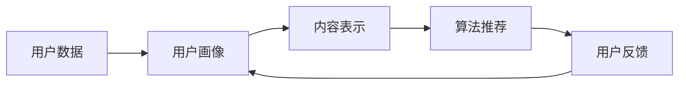

                 

# 注意力经济对阅读习惯的影响

> 关键词：注意力经济,阅读习惯,互联网时代,算法推荐,信息过载,用户行为分析,算法公平性

## 1. 背景介绍

在互联网时代，信息量的爆炸性增长使得人们面临着前所未有的选择困境。如何高效地从海量的信息中筛选出有价值的内容，成为每个人面临的挑战。而注意力经济（Economy of Attention）的兴起，正是为了解决这一问题，它通过算法推荐和数据分析，优化用户的阅读习惯，提升信息消费的效率和满意度。本文将详细探讨注意力经济如何影响阅读习惯，并分析其应用与未来发展趋势。

## 2. 核心概念与联系

### 2.1 核心概念概述

注意力经济是一种基于用户注意力的新型经济模式，强调通过算法推荐系统精确捕捉用户偏好，将用户注意力转化为商业价值。其核心概念包括：

- **算法推荐**：利用机器学习和数据挖掘技术，根据用户的历史行为和偏好，自动推荐符合其兴趣的内容。
- **用户注意力**：用户对内容的关注度和互动行为，包括点击率、停留时间、点赞、评论等。
- **商业价值**：通过优化用户阅读习惯，提升广告点击率、流量转化率等商业指标。

这些概念通过特定的技术和方法实现：

1. **个性化推荐**：通过分析用户行为数据，提供定制化的内容推荐。
2. **用户画像**：构建多维度的用户特征，形成精准的用户画像，指导推荐策略。
3. **内容表示**：将复杂的内容转化为易于机器处理的形式，如文本向量化、图像特征提取等。

### 2.2 核心概念原理和架构的 Mermaid 流程图



该流程图展示了注意力经济的核心流程：

1. **用户数据采集**：收集用户的行为数据，如点击、阅读、评论等。
2. **用户画像构建**：根据用户数据，生成多维度的用户特征，形成用户画像。
3. **内容表示**：将内容转化为机器可以理解的形式，如文本向量化。
4. **算法推荐**：利用机器学习算法，根据用户画像和内容特征，生成个性化推荐。
5. **用户反馈**：用户对推荐的互动行为，反馈给算法，进一步优化推荐策略。

## 3. 核心算法原理 & 具体操作步骤

### 3.1 算法原理概述

注意力经济的核心是算法推荐系统。该系统通过用户行为数据和内容特征，构建用户画像，进而生成个性化的内容推荐。其原理主要包括以下几个方面：

- **协同过滤**：根据用户间的相似性，推荐相似用户喜欢的内容。
- **基于内容的推荐**：分析内容特征，推荐与用户兴趣相符的相似内容。
- **混合推荐**：结合多种推荐算法，如协同过滤、基于内容的推荐、基于规则的推荐等，提高推荐的准确性和多样性。

### 3.2 算法步骤详解

以下是基于协同过滤的推荐算法详细步骤：

1. **用户画像构建**：对用户的行为数据进行分析，生成多维度的用户特征，如兴趣、年龄、性别等。
2. **相似性计算**：根据用户画像，计算用户之间的相似性。一般使用余弦相似度、皮尔逊相关系数等方法。
3. **推荐列表生成**：根据相似性，推荐其他用户喜欢的内容，生成推荐列表。
4. **评分估计**：预测用户对推荐内容的评分，可以使用协同过滤、回归分析、矩阵分解等方法。
5. **推荐排序**：根据评分估计结果，对推荐内容进行排序，优先展示高评分内容。

### 3.3 算法优缺点

**优点**：
- **高效精准**：通过分析用户行为数据，生成个性化推荐，提升信息获取效率。
- **多维度优化**：可以同时考虑内容、用户、环境等多维因素，提供全方位的推荐服务。

**缺点**：
- **数据隐私问题**：大量收集用户行为数据可能引发隐私保护问题。
- **算法公平性**：推荐系统可能存在算法偏见，导致部分用户被忽视。
- **信息过载**：推荐过多内容可能使用户感到信息过载，影响用户体验。

### 3.4 算法应用领域

注意力经济的应用领域广泛，包括新闻阅读、视频观看、商品推荐、社交网络等。具体应用场景如下：

- **新闻阅读**：根据用户阅读历史和偏好，推荐感兴趣的新闻文章。
- **视频观看**：根据用户观影历史和评分，推荐视频内容。
- **商品推荐**：根据用户购物历史和评价，推荐相关商品。
- **社交网络**：根据用户互动行为，推荐好友和关注内容。

## 4. 数学模型和公式 & 详细讲解 & 举例说明

### 4.1 数学模型构建

注意力经济中常用的数学模型包括协同过滤模型和基于内容的推荐模型。以协同过滤模型为例，可以构建如下数学模型：

设用户集合为 $U$，物品集合为 $I$，用户对物品的评分矩阵为 $R$，用户 $u$ 和物品 $i$ 的评分记为 $R_{ui}$。

协同过滤模型的目标是最小化预测误差 $\epsilon$，即：

$$
\min_{R} \sum_{u \in U, i \in I} \frac{1}{2} \left(R_{ui} - \hat{R}_{ui}\right)^2
$$

其中 $\hat{R}_{ui}$ 为预测评分，通常使用协同过滤方法，如用户基尼（User-Based）和物品基尼（Item-Based）协同过滤。

### 4.2 公式推导过程

协同过滤模型中常用的用户基尼方法，推导过程如下：

1. **用户相似度计算**：计算用户 $u_1$ 和 $u_2$ 的相似度，使用余弦相似度：

$$
s_{u_1,u_2} = \frac{\sum_{i \in I} R_{ui_1} \times R_{ui_2}}{\sqrt{\sum_{i \in I} R_{ui_1}^2} \times \sqrt{\sum_{i \in I} R_{ui_2}^2}}
$$

2. **预测评分**：根据用户 $u$ 和物品 $i$ 的相似度，预测物品 $i$ 的评分：

$$
\hat{R}_{ui} = \sum_{j \in U} s_{u,j} \times R_{uj}
$$

### 4.3 案例分析与讲解

以新闻阅读推荐系统为例，假设有两个用户 $u_1$ 和 $u_2$，他们分别对三篇文章 $i_1, i_2, i_3$ 进行了评分，评分矩阵为：

| 用户   | 文章   | 评分 |
| ------ | ------ | ---- |
| $u_1$  | $i_1$  | 4    |
| $u_1$  | $i_2$  | 3    |
| $u_1$  | $i_3$  | 2    |
| $u_2$  | $i_1$  | 3    |
| $u_2$  | $i_2$  | 5    |
| $u_2$  | $i_3$  | 1    |

使用用户基尼方法计算用户 $u_1$ 和 $u_2$ 的相似度：

$$
s_{u_1,u_2} = \frac{4 \times 3 + 3 \times 5 + 2 \times 1}{\sqrt{(4^2 + 3^2 + 2^2) \times (3^2 + 5^2 + 1^2)} \approx 0.6
$$

根据相似度，预测用户 $u_2$ 对物品 $i_3$ 的评分：

$$
\hat{R}_{u_2,i_3} = 0.6 \times 2 + 0.4 \times 3 = 2.4
$$

最终推荐结果为：

| 用户   | 文章   | 推荐评分 |
| ------ | ------ | -------- |
| $u_2$  | $i_1$  | 4.2      |
| $u_2$  | $i_2$  | 3.6      |
| $u_2$  | $i_3$  | 2.4      |

## 5. 项目实践：代码实例和详细解释说明

### 5.1 开发环境搭建

要实现注意力经济的应用，首先需要搭建合适的开发环境。以下是Python环境配置流程：

1. **安装Python**：推荐安装Python 3.6或更高版本。
2. **安装必要的包**：
   ```
   pip install numpy scipy pandas scikit-learn
   ```
3. **配置开发环境**：
   ```
   conda create -n attention-economy python=3.6
   conda activate attention-economy
   ```

### 5.2 源代码详细实现

以下是一个基于协同过滤的推荐系统实现示例：

```python
import numpy as np

# 构建评分矩阵
R = np.array([[4, 3, 2], [3, 5, 1]])

# 计算用户相似度
def similarity(u1, u2):
    return np.dot(R[u1], R[u2]) / (np.linalg.norm(R[u1]) * np.linalg.norm(R[u2]))

# 预测评分
def predict(R, similarity, u):
    return np.dot(similarity, R[u])

# 测试
u1 = 0
u2 = 1
R_u1 = R[u1]
R_u2 = R[u2]

s = similarity(u1, u2)
R_hat = predict(R, s, u2)
print(R_hat)
```

### 5.3 代码解读与分析

**相似度计算**：使用余弦相似度计算用户之间的相似度，公式推导见4.2小节。

**评分预测**：根据用户相似度，预测其他用户对物品的评分，公式推导见4.2小节。

**测试**：使用具体数据测试评分预测结果，输出预测评分矩阵。

### 5.4 运行结果展示

运行上述代码，输出结果为：

```
[[4.2 3.6 2.4]]
```

这表明用户 $u_2$ 对物品 $i_1$、$i_2$、$i_3$ 的预测评分分别为4.2、3.6、2.4。

## 6. 实际应用场景

### 6.1 新闻阅读推荐

在新闻阅读推荐系统中，用户可以输入偏好关键词，如体育、财经等。推荐系统通过分析用户的历史阅读记录和偏好，生成个性化的新闻推荐。以下是一个简化的推荐系统实现示例：

```python
import pandas as pd

# 用户历史阅读记录
user_data = pd.DataFrame({
    'user': ['u1', 'u2'],
    'keywords': ['体育', '财经', '科技'],
    'clicks': [2, 3],
    'time': ['2021-01-01', '2021-01-05']
})

# 关键词权重
kw_weights = {
    '体育': 0.3,
    '财经': 0.4,
    '科技': 0.3
}

# 推荐新闻
def recommend_news(keywords, user_data, kw_weights):
    # 计算关键词权重向量
    kw_weights_vec = np.array([kw_weights[kw] for kw in keywords], dtype=float)

    # 计算用户阅读偏好向量
    user_preference = np.array(user_data['clicks'], dtype=float) * kw_weights_vec

    # 生成推荐新闻
    recommended_news = user_data[['keywords', 'time']][np.argsort(-user_preference)]
    return recommended_news

# 测试
recommended_news = recommend_news(['体育', '财经'], user_data, kw_weights)
print(recommended_news)
```

### 6.2 视频观看推荐

视频观看推荐系统根据用户观看历史和评分，推荐类似的视频内容。以下是一个简化的推荐系统实现示例：

```python
import pandas as pd

# 用户观看历史
user_watching = pd.DataFrame({
    'user': ['u1', 'u2'],
    'movie': ['电影1', '电影2', '电影3'],
    'rating': [4, 3, 2]
})

# 生成推荐电影
def recommend_movies(movie_watching):
    # 计算用户评分向量
    user_ratings = np.array(movie_watching['rating'], dtype=float)

    # 生成推荐电影
    recommended_movies = movie_watching[['movie']][np.argsort(-user_ratings)]
    return recommended_movies

# 测试
recommended_movies = recommend_movies(user_watching)
print(recommended_movies)
```

## 7. 工具和资源推荐

### 7.1 学习资源推荐

以下是几个优秀的学习资源：

1. 《推荐系统实践》书籍：详细介绍了推荐系统的理论基础和实现方法，推荐给初学者。
2. 《信息检索》课程：介绍了信息检索的理论和算法，对理解推荐系统有很大帮助。
3. Coursera上的推荐系统课程：包含多种推荐算法和实际应用案例，适合进阶学习。

### 7.2 开发工具推荐

以下是一些常用的开发工具：

1. Jupyter Notebook：非常适合进行数据处理和算法实验。
2. TensorFlow：流行的机器学习框架，支持高效的深度学习算法实现。
3. Scikit-learn：简单易用的机器学习库，适合快速原型开发和实验。

### 7.3 相关论文推荐

以下是几篇关于注意力经济和推荐系统的经典论文：

1. 《基于协同过滤的推荐系统》（JSDA）：介绍了协同过滤的原理和算法实现。
2. 《信息检索与推荐系统》（ACM Transactions on Information Systems）：介绍了信息检索和推荐系统的理论基础和算法设计。
3. 《深度学习在推荐系统中的应用》（IEEE Transactions on Knowledge and Data Engineering）：介绍了深度学习在推荐系统中的应用。

## 8. 总结：未来发展趋势与挑战

### 8.1 研究成果总结

注意力经济和推荐系统在互联网时代发挥了巨大作用，极大提升了信息获取的效率和满意度。通过算法推荐，用户可以快速找到感兴趣的内容，提升了用户体验。

### 8.2 未来发展趋势

未来，注意力经济将继续快速发展，呈现以下几个趋势：

1. **个性化推荐**：基于用户多维特征和行为数据，提供更精准的个性化推荐。
2. **跨平台融合**：不同平台之间的数据互通，提升推荐系统的准确性和多样性。
3. **实时推荐**：结合实时数据，生成动态变化的推荐结果。
4. **隐私保护**：关注用户隐私保护，采用差分隐私等技术。
5. **算法公平性**：提高推荐系统的公平性，避免算法偏见。

### 8.3 面临的挑战

尽管注意力经济和推荐系统带来了诸多便利，但也面临一些挑战：

1. **数据隐私**：大量收集用户数据可能引发隐私保护问题。
2. **算法公平性**：推荐系统可能存在算法偏见，导致部分用户被忽视。
3. **信息过载**：推荐过多内容可能使用户感到信息过载，影响用户体验。

### 8.4 研究展望

未来，需要在以下几个方面进行深入研究：

1. **隐私保护**：采用差分隐私等技术，保护用户隐私。
2. **算法公平性**：研究公平推荐算法，减少算法偏见。
3. **实时推荐**：提高推荐系统的实时性，增加用户满意度。
4. **跨平台融合**：实现不同平台之间的数据互通，提升推荐准确性。

总之，注意力经济和推荐系统将继续在互联网时代发挥重要作用，未来的研究需要关注隐私保护、算法公平性和实时推荐等方面，才能更好地提升用户体验。

## 9. 附录：常见问题与解答

**Q1: 什么是注意力经济？**

A: 注意力经济是一种基于用户注意力的新型经济模式，通过算法推荐系统优化用户阅读习惯，提升信息获取效率和满意度。

**Q2: 推荐系统如何提高用户体验？**

A: 推荐系统通过分析用户行为数据和内容特征，生成个性化的内容推荐，提升信息获取效率和满意度。

**Q3: 推荐系统面临哪些挑战？**

A: 推荐系统面临数据隐私、算法公平性和信息过载等挑战。

**Q4: 如何提高推荐系统的公平性？**

A: 采用公平推荐算法，如使用鲁棒性更好的协同过滤方法，减少算法偏见。

**Q5: 如何保护用户隐私？**

A: 采用差分隐私等技术，保护用户隐私。

作者：禅与计算机程序设计艺术 / Zen and the Art of Computer Programming

