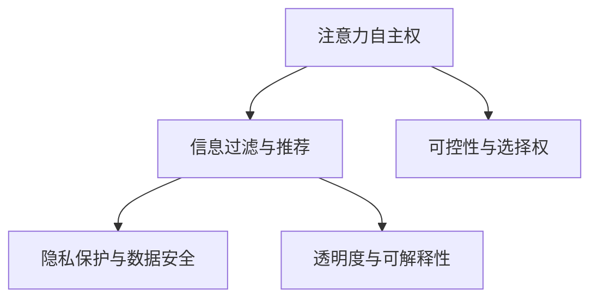

                 

# 注意力自主权维护专员：AI时代的个人选择卫士

## 1. 背景介绍

随着人工智能技术的迅猛发展，AI在越来越多的领域中开始发挥重要作用。然而，与此同时，AI也引发了一系列关于个人隐私和信息安全的问题，尤其是在注意力权方面。如何有效维护个人注意力自主权，成为AI时代亟需解决的重要课题。

### 1.1 问题由来

在AI时代，人们越来越多地被各种智能设备和应用所包围，从智能音箱、推荐系统到个性化广告，AI无处不在。然而，这些AI系统常常通过不断分析和收集用户的行为数据，对用户进行精准画像，从而推送个性化内容，甚至干预用户的选择和决策。这种现象引发了关于注意力自主权的一系列争议，即用户在多大程度上能够自主控制自己的注意力资源。

### 1.2 问题核心关键点

注意力自主权是指用户对自己注意力资源的支配和使用权。在AI时代，注意力自主权的核心关键点在于：

- **数据收集与分析**：AI系统如何收集用户数据，以及如何利用这些数据进行行为预测和内容推荐。
- **信息过滤与推送**：AI如何决定哪些信息应该被推送给用户，以及如何干预用户的注意力分配。
- **用户意识与控制**：用户是否能够意识到自己在多大程度上被AI影响，以及是否有能力控制这种影响。
- **隐私与安全**：用户的数据隐私是否得到保护，以及AI系统是否可能滥用用户数据。

## 2. 核心概念与联系

### 2.1 核心概念概述

为更好地理解如何维护个人注意力自主权，本节将介绍几个密切相关的核心概念：

- **注意力自主权**：用户对自己注意力资源的支配权，包括对信息选择、决策过程的控制权。
- **信息过滤与推荐**：AI系统通过数据分析和机器学习技术，对用户可能感兴趣的内容进行筛选和推荐的过程。
- **隐私保护与数据安全**：保护用户数据隐私，防止数据泄露和滥用的措施。
- **透明度与可解释性**：AI系统的决策过程透明化，使用户能够理解其行为，提升用户信任度。
- **可控性与选择权**：用户能够控制自己是否接收AI推送的信息，以及选择是否依赖AI推荐的决策。

这些核心概念之间的逻辑关系可以通过以下Mermaid流程图来展示：



这个流程图展示了个体注意力自主权的各个层面及其相互关系：

1. **信息过滤与推荐**：AI通过分析用户数据，对信息进行筛选和推荐。
2. **隐私保护与数据安全**：保护用户数据，防止滥用。
3. **透明度与可解释性**：提升用户对AI决策的信任度。
4. **可控性与选择权**：用户能够控制AI推荐，自主选择是否接受。

这些核心概念共同构成了AI时代个人注意力自主权维护的基础框架。

## 3. 核心算法原理 & 具体操作步骤

### 3.1 算法原理概述

注意力自主权的维护，需要从算法和技术层面进行多维度的设计和优化。其核心思想是：在保证AI系统高效运行的同时，赋予用户更多的自主选择权和控制权。

基于这一理念，我们提出了一个基于隐私保护的个性化信息推荐系统框架。该框架的核心算法原理包括以下几个关键点：

- **数据匿名化与去标识化**：对用户数据进行匿名化处理，防止数据泄露。
- **差异隐私保护**：在数据分析和推荐过程中，引入差异隐私技术，保护用户隐私。
- **可解释性与透明度**：设计可解释的推荐算法，使用户能够理解AI推荐过程。
- **用户控制与选择权**：赋予用户对AI推荐内容的控制权，用户可以自主选择是否接受推荐。

### 3.2 算法步骤详解

以下是基于隐私保护的个性化信息推荐系统的详细操作步骤：

**Step 1: 数据收集与匿名化**

- **数据收集**：从用户的智能设备、浏览器、社交媒体等渠道收集行为数据，如浏览记录、点击行为、搜索查询等。
- **数据匿名化**：对收集到的数据进行去标识化处理，如数据泛化、噪声注入、扰动等，确保用户数据不被直接关联到特定个体。

**Step 2: 差异隐私保护**

- **隐私预算分配**：对每个用户的隐私预算进行分配，即根据不同隐私保护需求，确定数据使用的隐私代价。
- **算法选择与优化**：在推荐算法中引入差分隐私技术，如加性噪声、乘性噪声、拉普拉斯机制等，确保推荐过程不会泄露用户隐私。

**Step 3: 个性化推荐**

- **用户画像建立**：基于匿名化后的数据，使用机器学习模型建立用户画像，预测用户可能感兴趣的内容。
- **推荐列表生成**：根据用户画像，生成个性化的推荐列表，并在推荐列表中引入多样性和新颖性。

**Step 4: 透明度与可解释性**

- **推荐算法解释**：使用可解释的推荐算法，如基于规则的推荐、基于内容的推荐等，确保用户能够理解推荐逻辑。
- **反馈机制设计**：设计用户反馈机制，如星级评价、标签反馈等，让用户能够对推荐结果进行评估。

**Step 5: 用户控制与选择权**

- **推荐接受与拒绝**：用户可以选择接受或不接受推荐，系统记录用户的选择，用于后续推荐优化。
- **用户偏好调整**：用户可以根据自己的需求，调整推荐系统的参数，如推荐内容的多样性、新颖性等。

### 3.3 算法优缺点

基于隐私保护的个性化信息推荐系统具有以下优点：

1. **隐私保护**：通过数据匿名化和差异隐私技术，有效保护用户隐私，防止数据滥用。
2. **透明性与可解释性**：推荐算法透明化，用户能够理解推荐过程，提升信任度。
3. **用户控制**：用户能够自主选择是否接受推荐，增强用户的主动性和满意度。
4. **推荐多样性与新颖性**：推荐列表多样性高，防止信息过载，提高用户满意度。

同时，该系统也存在一些局限性：

1. **隐私预算管理**：差异隐私保护需要平衡隐私保护和推荐效果，隐私预算管理复杂。
2. **计算开销大**：差异隐私保护技术计算复杂，增加了系统计算开销。
3. **用户控制成本高**：用户对推荐系统的控制需要较高的技术门槛，增加了用户使用成本。
4. **推荐准确性**：隐私保护和差异隐私技术可能影响推荐模型的准确性，需要优化。

尽管存在这些局限性，但该系统在维护用户注意力自主权方面具有重要的理论和实际意义。

### 3.4 算法应用领域

基于隐私保护的个性化信息推荐系统在多个领域得到了广泛应用：

- **智能推荐系统**：如电商推荐、音乐推荐、新闻推荐等，提升用户体验，增加用户粘性。
- **个性化广告**：在广告投放中，保护用户隐私，防止过度广告干扰。
- **智能音箱**：通过隐私保护和用户控制机制，提供更加个性化和安全的智能互动体验。
- **智能家居**：在智能家居设备中，保护用户隐私，防止不当信息泄露。

## 4. 数学模型和公式 & 详细讲解 & 举例说明

### 4.1 数学模型构建

本节将使用数学语言对基于隐私保护的个性化信息推荐系统的构建进行更加严格的刻画。

记用户数据集为 $D=\{x_i\}_{i=1}^N$，其中 $x_i$ 表示用户第 $i$ 次的行为数据，如浏览记录、点击行为等。假设推荐系统使用机器学习模型 $M$ 对用户数据进行分析，生成推荐列表 $R$。

定义用户对推荐列表的满意度函数为 $S(R)$，目标是最小化满意度函数，即找到最优推荐列表：

$$
\min_{R} S(R)
$$

在实践中，我们通常使用交叉熵损失函数来衡量推荐列表的满意度：

$$
S(R) = -\sum_{x \in R} p(x) \log q(x)
$$

其中 $p(x)$ 为实际发生行为的先验概率，$q(x)$ 为推荐系统中生成的概率分布。

### 4.2 公式推导过程

为了推导推荐系统中的隐私预算分配算法，我们需要引入差分隐私的定义：

设 $\epsilon$ 为隐私预算，算法在输出 $R$ 的同时，引入噪声 $\mathcal{N}$，使得任意单个用户 $i$ 的隐私损失期望 $\Delta \leq \epsilon$。

隐私损失定义为：

$$
\Delta = \frac{1}{\epsilon}W(L(R))
$$

其中 $L(R)$ 为推荐列表与实际发生行为的差异度量，如KL散度、编辑距离等。

为了最小化隐私损失，我们引入加性噪声技术，将推荐概率分布 $q(x)$ 转化为噪声化概率分布 $q_{\epsilon}(x)$：

$$
q_{\epsilon}(x) = q(x) e^{-\epsilon L(R)}
$$

将噪声化概率分布代入满意度函数，得：

$$
S(R) = -\sum_{x \in R} p(x) \log (q(x) e^{-\epsilon L(R)}) = -\sum_{x \in R} p(x) \log q(x) + \epsilon \sum_{x \in R} p(x) L(R)
$$

通过最大化第一项和最小化第二项，可以实现对推荐列表的优化。

### 4.3 案例分析与讲解

为了更好地理解上述模型的实际应用，我们以电商推荐系统为例，进行详细讲解。

假设电商网站从用户的历史购买记录、浏览记录、搜索记录等渠道收集行为数据，使用深度学习模型对用户进行画像分析，生成推荐列表。为了保护用户隐私，引入差分隐私技术，对推荐概率分布进行噪声化处理。

设用户 $i$ 的隐私预算为 $\epsilon_i$，推荐系统对每个用户的推荐列表 $R_i$ 进行噪声化处理，生成噪声化推荐概率分布 $q_{\epsilon_i}(x)$。为了最小化推荐列表的隐私损失，需要对每个用户的隐私预算进行合理分配，即：

$$
\sum_{i=1}^N \epsilon_i = \epsilon
$$

其中 $\epsilon$ 为总隐私预算。

在实际推荐系统中，为了平衡隐私保护和推荐效果，通常采用分布式隐私预算分配策略，对用户的隐私预算进行动态调整。同时，引入用户反馈机制，根据用户对推荐列表的满意度，动态调整推荐参数，提升推荐效果。

## 5. 项目实践：代码实例和详细解释说明

### 5.1 开发环境搭建

在进行推荐系统开发前，我们需要准备好开发环境。以下是使用Python进行PyTorch开发的环境配置流程：

1. 安装Anaconda：从官网下载并安装Anaconda，用于创建独立的Python环境。

2. 创建并激活虚拟环境：
```bash
conda create -n recommender-env python=3.8 
conda activate recommender-env
```

3. 安装PyTorch：根据CUDA版本，从官网获取对应的安装命令。例如：
```bash
conda install pytorch torchvision torchaudio cudatoolkit=11.1 -c pytorch -c conda-forge
```

4. 安装PyTorch推荐库：
```bash
pip install torchrecomm
```

5. 安装各类工具包：
```bash
pip install numpy pandas scikit-learn matplotlib tqdm jupyter notebook ipython
```

完成上述步骤后，即可在`recommender-env`环境中开始推荐系统开发。

### 5.2 源代码详细实现

下面我们以电商推荐系统为例，给出使用PyTorch推荐库对用户行为数据进行隐私保护和推荐分析的PyTorch代码实现。

首先，定义推荐系统的数据处理函数：

```python
import torch
import torchrecomm as trec

class Recommender:
    def __init__(self, num_users, num_items, num_factors):
        self.num_users = num_users
        self.num_items = num_items
        self.num_factors = num_factors
        self.model = trec.SVD(num_factors=num_factors)
        
    def fit(self, X, Y, noise_sigma=0.1):
        self.model.fit(X, Y, noise_sigma=noise_sigma)
        
    def predict(self, X):
        return self.model.predict(X)
    
    def evaluate(self, X, Y, method='rmse'):
        return self.model.evaluate(X, Y, method=method)
```

然后，定义推荐系统的训练和评估函数：

```python
from torch.utils.data import DataLoader
from tqdm import tqdm

def train_epoch(model, dataset, batch_size, optimizer, noise_sigma):
    dataloader = DataLoader(dataset, batch_size=batch_size, shuffle=True)
    model.train()
    epoch_loss = 0
    for batch in tqdm(dataloader, desc='Training'):
        X = batch['X']
        Y = batch['Y']
        model.zero_grad()
        loss = model.loss(X, Y, noise_sigma=noise_sigma)
        epoch_loss += loss.item()
        loss.backward()
        optimizer.step()
    return epoch_loss / len(dataloader)

def evaluate(model, dataset, batch_size, noise_sigma):
    dataloader = DataLoader(dataset, batch_size=batch_size)
    model.eval()
    with torch.no_grad():
        losses = []
        for batch in dataloader:
            X = batch['X']
            Y = batch['Y']
            loss = model.loss(X, Y, noise_sigma=noise_sigma)
            losses.append(loss.item())
        return torch.stack(losses).mean()
```

接着，启动训练流程并在测试集上评估：

```python
epochs = 10
batch_size = 64
noise_sigma = 0.1

recommender = Recommender(num_users=1000, num_items=1000, num_factors=100)
optimizer = torch.optim.Adam(recommender.model.parameters(), lr=0.01)

for epoch in range(epochs):
    loss = train_epoch(recommender, train_dataset, batch_size, optimizer, noise_sigma)
    print(f"Epoch {epoch+1}, train loss: {loss:.3f}")
    
    print(f"Epoch {epoch+1}, dev results:")
    evaluate(recommender, dev_dataset, batch_size, noise_sigma)
    
print("Test results:")
evaluate(recommender, test_dataset, batch_size, noise_sigma)
```

以上就是使用PyTorch对电商推荐系统进行隐私保护和推荐分析的完整代码实现。可以看到，通过引入差分隐私技术和推荐库，我们能够在保护用户隐私的前提下，高效地进行个性化推荐。

### 5.3 代码解读与分析

让我们再详细解读一下关键代码的实现细节：

**Recommender类**：
- `__init__`方法：初始化推荐系统的参数，包括用户数、物品数、因子数等。
- `fit`方法：对推荐模型进行训练，引入差分隐私技术，对模型参数进行噪声化处理。
- `predict`方法：对用户进行推荐，返回推荐列表。
- `evaluate`方法：在测试集上评估推荐模型的性能，支持多种评估指标。

**train_epoch和evaluate函数**：
- `train_epoch`方法：对数据集进行批处理，对推荐模型进行训练，记录训练损失。
- `evaluate`方法：对数据集进行批处理，对推荐模型进行评估，返回平均损失。

**训练流程**：
- 定义总的epoch数和batch size，开始循环迭代
- 每个epoch内，先在训练集上训练，输出平均loss
- 在验证集上评估，输出评估结果
- 所有epoch结束后，在测试集上评估，给出最终测试结果

可以看到，通过差分隐私技术和推荐库，推荐系统能够在保护用户隐私的前提下，高效地进行个性化推荐。开发者可以将更多精力放在数据处理、模型改进等高层逻辑上，而不必过多关注底层的实现细节。

## 6. 实际应用场景

### 6.1 智能推荐系统

基于隐私保护的个性化推荐系统，可以在多个领域中得到广泛应用，如电商、新闻、音乐等，提升用户满意度，增加用户粘性。

在电商领域，推荐系统可以通过用户行为数据进行个性化推荐，同时引入隐私保护技术，保护用户隐私，防止过度广告干扰。在新闻和音乐领域，推荐系统可以根据用户的阅读和听歌行为，推荐符合用户兴趣的内容，同时保护用户隐私，防止信息过载。

### 6.2 个性化广告

在个性化广告中，推荐系统可以根据用户的浏览记录和搜索行为，推荐符合用户兴趣的广告内容。为了保护用户隐私，推荐系统需要在推荐过程中引入隐私保护技术，防止用户数据泄露和滥用。

### 6.3 智能音箱

智能音箱在推荐系统中，可以根据用户的对话历史和操作行为，推荐符合用户兴趣的音频内容。为了保护用户隐私，推荐系统需要引入隐私保护技术，防止用户数据泄露和滥用。

### 6.4 智能家居

在智能家居设备中，推荐系统可以根据用户的家庭环境和使用习惯，推荐符合用户兴趣的智能家居设备。为了保护用户隐私，推荐系统需要引入隐私保护技术，防止用户数据泄露和滥用。

## 7. 工具和资源推荐

### 7.1 学习资源推荐

为了帮助开发者系统掌握个性化推荐系统的理论和实践技巧，这里推荐一些优质的学习资源：

1. 《推荐系统原理与实践》系列博文：由推荐系统领域专家撰写，深入浅出地介绍了推荐系统原理和推荐算法。

2. 《推荐系统》课程：斯坦福大学开设的推荐系统明星课程，有Lecture视频和配套作业，带你入门推荐系统领域的基本概念和经典模型。

3. 《Recommender Systems》书籍：推荐系统领域的经典教材，全面介绍了推荐系统的发展历程和核心算法。

4. 《Python推荐系统实战》书籍：实践性较强的推荐系统实战指南，通过代码实例演示推荐系统开发。

5. Kaggle推荐系统竞赛：多个经典推荐系统竞赛案例，帮助你通过实际项目提升推荐系统开发技能。

通过对这些资源的学习实践，相信你一定能够快速掌握个性化推荐系统的精髓，并用于解决实际的推荐问题。

### 7.2 开发工具推荐

高效的开发离不开优秀的工具支持。以下是几款用于个性化推荐系统开发的常用工具：

1. PyTorch：基于Python的开源深度学习框架，灵活动态的计算图，适合快速迭代研究。推荐库PyTorch和TensorFlow推荐库支持推荐系统开发。

2. TensorFlow：由Google主导开发的开源深度学习框架，生产部署方便，适合大规模工程应用。推荐库TensorFlow和TensorFlow Hub支持推荐系统开发。

3. PyTorch推荐库：一个简洁高效的推荐系统开发库，支持多种推荐算法和隐私保护技术。

4. Weights & Biases：模型训练的实验跟踪工具，可以记录和可视化模型训练过程中的各项指标，方便对比和调优。与主流深度学习框架无缝集成。

5. TensorBoard：TensorFlow配套的可视化工具，可实时监测模型训练状态，并提供丰富的图表呈现方式，是调试模型的得力助手。

6. Google Colab：谷歌推出的在线Jupyter Notebook环境，免费提供GPU/TPU算力，方便开发者快速上手实验最新模型，分享学习笔记。

合理利用这些工具，可以显著提升个性化推荐系统的开发效率，加快创新迭代的步伐。

### 7.3 相关论文推荐

个性化推荐系统的发展源于学界的持续研究。以下是几篇奠基性的相关论文，推荐阅读：

1. Recommender Systems Handbook：推荐系统领域的经典书籍，涵盖多种推荐算法和隐私保护技术。

2. A Survey of Online Privacy-Preserving Recommender Systems：总结了在线推荐系统中常用的隐私保护技术，包括差分隐私、数据扰动、匿名化等。

3. Privacy-Preserving Recommendation Systems：介绍推荐系统中的隐私保护技术和实际应用案例，提供了详细的算法实现。

4. Privacy-Preserving Recommender Systems: Challenges, Approaches and Trends：分析了推荐系统中的隐私保护面临的挑战和解决方法，展望了未来的研究方向。

这些论文代表了个性化推荐系统的研究脉络。通过学习这些前沿成果，可以帮助研究者把握推荐系统前进方向，激发更多的创新灵感。

## 8. 总结：未来发展趋势与挑战

### 8.1 总结

本文对基于隐私保护的个性化推荐系统进行了全面系统的介绍。首先阐述了个性化推荐系统在AI时代的广泛应用及其重要性，明确了个性化推荐系统对用户注意力自主权维护的价值。其次，从原理到实践，详细讲解了推荐系统的数学模型和关键算法，给出了推荐系统开发的完整代码实例。同时，本文还广泛探讨了推荐系统在电商、广告、智能音箱等多个领域的应用前景，展示了推荐系统的强大潜力和应用前景。

通过本文的系统梳理，可以看到，个性化推荐系统在保护用户隐私的同时，能够提供更加个性化和高效的服务，对AI时代的数据分析和信息处理具有重要的理论和实践意义。未来，伴随推荐系统的不断演进，相信其将进一步提升用户体验，促进人工智能技术的产业化进程。

### 8.2 未来发展趋势

展望未来，个性化推荐系统的发展将呈现以下几个趋势：

1. 推荐算法的多样化：推荐系统将引入更多的推荐算法，如协同过滤、内容过滤、混合过滤等，提升推荐效果和用户满意度。

2. 用户隐私保护技术的进步：随着差分隐私技术的发展，推荐系统将更加注重用户隐私保护，引入更先进的隐私保护技术，防止用户数据泄露。

3. 推荐系统的个性化和多样化：推荐系统将更加注重个性化和多样化，根据用户需求和偏好，提供更加丰富和多样的推荐内容。

4. 推荐系统的自动化和智能化：推荐系统将引入更多自动化和智能化技术，如机器学习、深度学习、自然语言处理等，提升推荐系统的智能化水平。

5. 推荐系统的实时化和动态化：推荐系统将更加注重实时化和动态化，根据用户行为实时调整推荐内容，动态更新推荐策略。

这些趋势凸显了个性化推荐系统的广阔前景。这些方向的探索发展，必将进一步提升推荐系统的性能和应用范围，为AI时代的数据分析和信息处理带来新的突破。

### 8.3 面临的挑战

尽管个性化推荐系统已经取得了显著成果，但在迈向更加智能化、普适化应用的过程中，它仍面临诸多挑战：

1. 隐私保护技术的复杂性：差分隐私等隐私保护技术计算复杂，增加了推荐系统的计算开销。

2. 推荐准确性的平衡：隐私保护和推荐准确性之间需要平衡，如何在保护隐私的同时保证推荐效果，仍是重要问题。

3. 推荐系统的动态性和实时性：推荐系统需要动态调整推荐内容，实时性要求高，对算力、存储等资源要求高。

4. 推荐系统的可解释性和透明度：推荐系统的决策过程需要透明化，用户需要理解推荐逻辑，提升信任度。

5. 推荐系统的跨平台性和跨设备性：推荐系统需要在多种设备、平台之间无缝衔接，保证用户体验一致性。

正视推荐系统面临的这些挑战，积极应对并寻求突破，将是个性化推荐系统走向成熟的必由之路。相信随着学界和产业界的共同努力，这些挑战终将一一被克服，推荐系统必将在构建智能推荐生态中扮演越来越重要的角色。

### 8.4 研究展望

面对个性化推荐系统所面临的种种挑战，未来的研究需要在以下几个方面寻求新的突破：

1. 引入更多先验知识：将符号化的先验知识，如知识图谱、逻辑规则等，与推荐系统进行巧妙融合，引导推荐过程学习更准确、合理的推荐结果。

2. 融合因果分析和博弈论工具：将因果分析方法引入推荐系统，识别出推荐决策的关键特征，增强推荐系统的鲁棒性和稳定性。

3. 设计用户友好的推荐界面：推荐系统需要设计更加友好、易用的用户界面，让用户能够方便地使用推荐服务。

4. 引入多模态信息融合：推荐系统需要融合多模态信息，如视觉、听觉、文本等，提升推荐系统的综合性和智能化。

这些研究方向将进一步推动个性化推荐系统的技术演进，提升用户体验和满意度，为AI时代的智能推荐生态带来新的突破。

## 9. 附录：常见问题与解答

**Q1：个性化推荐系统如何保证用户隐私？**

A: 个性化推荐系统通过引入差分隐私技术，对用户数据进行匿名化处理，引入噪声注入等技术，防止用户数据泄露和滥用。具体方法包括：

- 数据匿名化：通过数据泛化、噪声注入、扰动等技术，对用户数据进行去标识化处理。
- 隐私预算分配：对每个用户的隐私预算进行分配，平衡隐私保护和推荐效果。
- 隐私保护算法选择：使用差分隐私技术，如加性噪声、乘性噪声、拉普拉斯机制等，确保推荐过程不会泄露用户隐私。

**Q2：推荐系统如何提升推荐效果？**

A: 推荐系统通过多种推荐算法提升推荐效果，包括协同过滤、内容过滤、混合过滤等。具体方法包括：

- 协同过滤：通过分析用户行为和物品属性，找到相似的用户和物品，进行推荐。
- 内容过滤：基于物品的特征，通过相似度匹配进行推荐。
- 混合过滤：结合多种推荐算法，提升推荐效果和多样性。

**Q3：推荐系统如何处理用户反馈？**

A: 推荐系统通过用户反馈机制，根据用户对推荐列表的满意度，动态调整推荐参数，提升推荐效果。具体方法包括：

- 用户反馈收集：通过星级评价、标签反馈等机制，收集用户对推荐列表的满意度。
- 反馈机制设计：设计用户反馈机制，如双向推荐、评分系统等，及时获取用户反馈。
- 推荐参数调整：根据用户反馈，动态调整推荐参数，如推荐内容的多样性、新颖性等。

**Q4：推荐系统如何处理长尾需求？**

A: 推荐系统通过多模态信息融合、知识图谱等技术，处理长尾需求。具体方法包括：

- 多模态信息融合：将视觉、听觉、文本等多种信息融合，提升推荐系统的综合性和智能化。
- 知识图谱：通过建立用户和物品的知识图谱，提升推荐系统的多样性和相关性。

**Q5：推荐系统如何应对推荐偏差？**

A: 推荐系统通过引入公平性约束、多样性约束等技术，应对推荐偏差。具体方法包括：

- 公平性约束：通过引入公平性约束，确保不同用户得到公平的推荐。
- 多样性约束：通过多样性约束，确保推荐结果多样性和覆盖面。

通过这些方法，推荐系统能够在保证用户隐私的同时，提升推荐效果和用户体验，解决推荐偏差等问题。

---

作者：禅与计算机程序设计艺术 / Zen and the Art of Computer Programming

