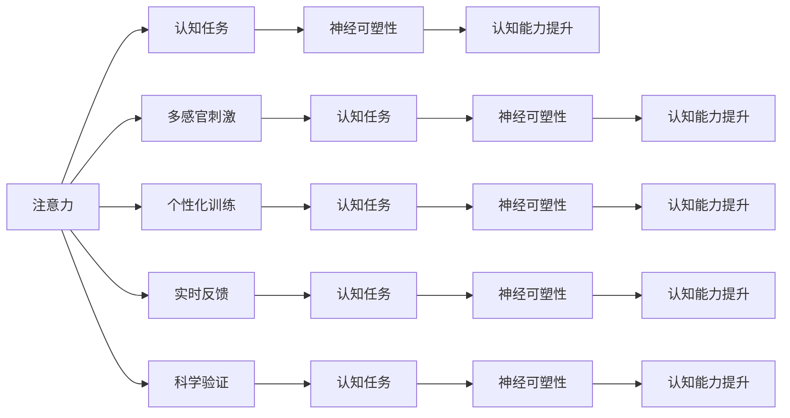

                 

## 1. 背景介绍

### 1.1 问题由来
在现代社会，信息过载现象日益严重，人们的注意力分散在各种媒体和设备之间。这不仅影响工作效率和生活质量，还对心理健康造成了威胁。因此，如何提高人们的专注力和认知能力，已成为现代社会急需解决的问题之一。

近年来，神经科学研究者发现，通过特定训练方式，可以提高大脑的可塑性，增强认知功能。这些研究为开发有效的注意力训练方法提供了理论基础。人工智能和计算机科学领域的专家们也在探索如何结合最新的技术手段，开发出能提升注意力和认知能力的应用。

### 1.2 问题核心关键点
注意力训练的核心理念是通过特定的认知任务和刺激，增强大脑皮层的神经元连接和突触强度，从而提高注意力、集中力、记忆力和学习效率。以下是注意力训练的核心关键点：

1. **神经可塑性**：大脑能够根据环境和经验的变化，调整神经元的连接强度和突触的可塑性，从而提高认知能力。
2. **认知任务设计**：通过设计合适的认知任务，刺激特定的大脑区域，增强神经可塑性。
3. **多感官刺激**：结合视觉、听觉、触觉等多种感官刺激，全面提升注意力和认知功能。
4. **个性化训练**：根据个体差异，设计个性化的训练计划，最大化训练效果。
5. **实时反馈和调整**：通过实时反馈和调整训练方案，保证训练的针对性和有效性。
6. **科学验证**：在科学实验中验证训练效果的有效性，并不断优化训练方案。

### 1.3 问题研究意义
注意力训练在提升个体认知能力、增强学习效率、改善心理健康方面具有重要意义：

1. **提升工作和学习效率**：通过训练提高注意力和集中力，提升个体在任务中的表现。
2. **改善心理健康**：注意力训练有助于缓解注意力分散和焦虑情绪，提升心理健康水平。
3. **支持终身学习**：随着年龄增长，人的认知能力可能下降，注意力训练有助于延缓这一过程，支持终身学习。
4. **适应未来社会**：在信息爆炸的时代，注意力训练对于适应快速变化的环境和提高个体竞争力至关重要。

## 2. 核心概念与联系

### 2.1 核心概念概述
注意力训练的本质是通过特定任务和刺激，提高大脑的神经可塑性，增强认知功能。以下是几个关键概念：

1. **注意力（Attention）**：指个体在特定时间内，将精神资源集中在某一任务或信息上的能力。
2. **认知能力（Cognitive Ability）**：包括记忆力、理解力、判断力、推理力等，是衡量个体智力水平的重要指标。
3. **神经可塑性（Neural Plasticity）**：指大脑在学习和训练过程中，神经元连接和突触的可塑性变化。
4. **认知任务（Cognitive Task）**：特定设计用于训练认知功能的任务，如记忆、注意力、逻辑推理等。
5. **多感官刺激（Multisensory Stimulation）**：通过结合视觉、听觉、触觉等多种感官刺激，全面提升认知能力。
6. **个性化训练（Personalized Training）**：根据个体差异，设计个性化的训练计划，最大化训练效果。
7. **实时反馈（Real-time Feedback）**：通过实时反馈和调整训练方案，保证训练的针对性和有效性。
8. **科学验证（Scientific Validation）**：在科学实验中验证训练效果的有效性，并不断优化训练方案。

这些概念通过大脑神经网络和认知任务的相互作用，形成了一个系统的训练框架。以下是一个Mermaid流程图，展示了这些概念之间的联系：



这个流程图展示了注意力训练的关键流程：通过认知任务设计，结合多感官刺激，个性化训练和实时反馈，最终通过科学验证，提升认知能力。

### 2.2 核心概念原理和架构

注意力训练的核心原理基于神经科学的研究成果，主要包括以下几个方面：

1. **神经元连接**：注意力训练通过特定的认知任务，刺激大脑中相关神经元之间的连接强度。这些连接强度的增强，有助于提高注意力和认知能力。
2. **突触可塑性**：认知任务的完成过程中，神经元之间的突触强度也会发生变化，增强突触可塑性，提高认知功能。
3. **神经反馈**：注意力训练过程中，大脑会根据任务要求进行神经反馈，调整神经元的激活状态，增强注意力集中力。
4. **认知负荷**：通过设计具有一定挑战性的认知任务，提高大脑的认知负荷，促进神经元之间的连接和突触强度增强。

神经网络结构是注意力训练的底层架构，它通过多层神经元的连接和激活，模拟大脑的神经网络。以下是神经网络结构的基本组成：

1. **输入层**：接收外部输入信号，如视觉、听觉、触觉等。
2. **隐藏层**：通过神经元之间的连接和激活，处理输入信号，提取特征。
3. **输出层**：输出认知任务的最终结果，如记忆、注意力、判断等。

注意力训练的目标是通过特定任务，优化神经网络结构，增强神经元之间的连接强度和突触可塑性，最终提升认知能力。

## 3. 核心算法原理 & 具体操作步骤

### 3.1 算法原理概述

注意力训练的算法原理基于认知心理学和神经科学的研究成果，主要包括以下几个方面：

1. **认知负荷理论**：通过设计具有一定挑战性的认知任务，提高大脑的认知负荷，促进神经元之间的连接和突触强度增强。
2. **神经反馈机制**：在认知任务的完成过程中，大脑会根据任务要求进行神经反馈，调整神经元的激活状态，增强注意力集中力。
3. **突触可塑性理论**：认知任务的完成过程中，神经元之间的突触强度也会发生变化，增强突触可塑性，提高认知功能。
4. **神经元连接增强**：注意力训练通过特定的认知任务，刺激大脑中相关神经元之间的连接强度，增强神经元之间的连接。

### 3.2 算法步骤详解

注意力训练的具体操作步骤包括以下几个关键步骤：

**Step 1: 确定认知任务**

根据训练目标，选择适合的心理认知任务。常见的认知任务包括：

1. **记忆任务**：如记忆序列、记忆图像、记忆词汇等。
2. **注意力任务**：如注意力广度测试、注意力持续时间、注意力分配等。
3. **逻辑推理任务**：如数独、推理题、解谜题等。

**Step 2: 设计多感官刺激**

结合视觉、听觉、触觉等多种感官刺激，增强认知任务的效果。例如：

1. **视觉刺激**：使用颜色、形状、大小等多种视觉元素，提高认知任务的挑战性。
2. **听觉刺激**：结合声音和音乐，增加听觉元素，提高认知任务的趣味性。
3. **触觉刺激**：通过实际操作，增加触觉反馈，增强认知任务的真实感。

**Step 3: 实施个性化训练**

根据个体差异，设计个性化的训练计划。例如：

1. **年龄差异**：针对不同年龄段的个体，设计适合不同认知水平的训练任务。
2. **认知能力差异**：根据个体的认知水平，调整训练任务的难度，避免过度训练或训练不足。
3. **兴趣差异**：根据个体的兴趣偏好，选择适合他们的训练任务，提高训练的积极性。

**Step 4: 实施实时反馈**

通过实时反馈和调整训练方案，保证训练的针对性和有效性。例如：

1. **即时反馈**：在每次训练任务结束后，及时提供反馈，指出错误和不足。
2. **调整策略**：根据反馈结果，调整训练策略，优化训练计划。
3. **持续改进**：通过不断的反馈和调整，逐步优化训练效果，提高认知能力。

**Step 5: 科学验证**

在科学实验中验证训练效果的有效性，并不断优化训练方案。例如：

1. **实验设计**：设计科学实验，验证注意力训练的效果。
2. **结果分析**：通过数据分析，评估注意力训练的效果。
3. **持续改进**：根据实验结果，优化训练方案，提高训练效果。

### 3.3 算法优缺点

注意力训练具有以下优点：

1. **科学依据**：基于神经科学和认知心理学的研究成果，具有坚实的科学依据。
2. **效果显著**：通过特定的认知任务和刺激，显著提高认知能力和注意力集中力。
3. **多感官结合**：结合多感官刺激，全面提升认知能力。
4. **个性化训练**：根据个体差异，设计个性化的训练计划，最大化训练效果。
5. **实时反馈**：通过实时反馈和调整，保证训练的针对性和有效性。

同时，注意力训练也存在以下缺点：

1. **时间成本高**：训练过程需要较长时间，对个体的时间和精力要求较高。
2. **效果个体差异大**：不同个体的认知能力差异较大，训练效果可能存在个体差异。
3. **技术要求高**：需要设计合适的认知任务，实施有效的多感官刺激，实施个性化的训练方案和实时反馈。

### 3.4 算法应用领域

注意力训练在多个领域都有广泛的应用，以下是几个典型的应用场景：

1. **教育领域**：通过注意力训练，提升学生的注意力集中力和认知能力，提高学习效率。
2. **医疗领域**：通过注意力训练，帮助神经受损患者恢复注意力和认知功能，改善生活质量。
3. **企业培训**：通过注意力训练，提升员工的工作效率和学习能力，提高企业竞争力。
4. **心理健康**：通过注意力训练，缓解注意力分散和焦虑情绪，改善心理健康水平。
5. **体育训练**：通过注意力训练，提高运动员的注意力集中力和专注力，提升运动表现。

## 4. 数学模型和公式 & 详细讲解 & 举例说明

### 4.1 数学模型构建

注意力训练的数学模型主要基于神经网络和认知心理学的研究成果，包括以下几个关键组成部分：

1. **输入层**：接收外部输入信号，如视觉、听觉、触觉等。
2. **隐藏层**：通过神经元之间的连接和激活，处理输入信号，提取特征。
3. **输出层**：输出认知任务的最终结果，如记忆、注意力、判断等。

注意力训练的目标是通过特定任务，优化神经网络结构，增强神经元之间的连接强度和突触可塑性，最终提升认知能力。

### 4.2 公式推导过程

以下是一个简单的注意力训练模型，用于说明注意力训练的数学原理：

1. **输入层**：$x \in \mathbb{R}^n$，表示输入信号，其中 $n$ 为输入维数。
2. **隐藏层**：$h_1, h_2, ..., h_m \in \mathbb{R}^d$，表示隐藏层的神经元，其中 $m$ 为隐藏层神经元数量，$d$ 为隐藏层神经元维度。
3. **输出层**：$y \in \mathbb{R}^k$，表示认知任务的输出结果，其中 $k$ 为输出维数。

假设 $f_h(x; \theta_h)$ 表示隐藏层的激活函数，$W_h \in \mathbb{R}^{d \times n}$ 表示隐藏层权重矩阵，$b_h \in \mathbb{R}^d$ 表示隐藏层偏置向量。则隐藏层的输出可以表示为：

$$h_i = f_h(x; \theta_h) = g(W_h x + b_h)$$

其中 $g$ 为激活函数，如 ReLU、Sigmoid 等。

假设 $f_y(h; \theta_y)$ 表示输出层的激活函数，$W_y \in \mathbb{R}^{k \times d}$ 表示输出层权重矩阵，$b_y \in \mathbb{R}^k$ 表示输出层偏置向量。则输出层的输出可以表示为：

$$y = f_y(h; \theta_y) = g(W_y h + b_y)$$

假设训练任务为记忆任务，输出层输出为记忆结果 $y_t$。则注意力训练的目标是最小化误差函数 $L(y_t, y^*)$，其中 $y^*$ 为记忆任务的标签。常用的损失函数包括均方误差（MSE）、交叉熵（CE）等。

假设使用反向传播算法优化模型参数，损失函数对权重矩阵和偏置向量的梯度可以表示为：

$$\frac{\partial L}{\partial W_h} = \frac{\partial L}{\partial y} \frac{\partial y}{\partial h} \frac{\partial h}{\partial x} \frac{\partial x}{\partial W_h}$$
$$\frac{\partial L}{\partial b_h} = \frac{\partial L}{\partial y} \frac{\partial y}{\partial h} \frac{\partial h}{\partial x}$$

$$\frac{\partial L}{\partial W_y} = \frac{\partial L}{\partial y} \frac{\partial y}{\partial h} \frac{\partial h}{\partial x}$$
$$\frac{\partial L}{\partial b_y} = \frac{\partial L}{\partial y} \frac{\partial y}{\partial h}$$

### 4.3 案例分析与讲解

假设我们使用注意力训练模型进行记忆任务训练。以下是一个简单的案例分析：

**案例**：记忆序列 $[1, 2, 3, 4, 5]$，期望输出为 $[5, 4, 3, 2, 1]$。

1. **输入层**：输入序列 $[1, 2, 3, 4, 5]$。
2. **隐藏层**：通过神经元之间的连接和激活，处理输入信号，提取特征。
3. **输出层**：输出记忆结果 $[5, 4, 3, 2, 1]$。

假设使用反向传播算法优化模型参数，损失函数为均方误差（MSE）。则损失函数可以表示为：

$$L = \frac{1}{N} \sum_{i=1}^N (y_i - y^*)^2$$

其中 $N$ 为样本数量。

假设隐藏层的激活函数为 ReLU，输出层的激活函数为 Softmax。则隐藏层的输出可以表示为：

$$h_i = ReLU(W_h x + b_h)$$

输出层的输出可以表示为：

$$y = Softmax(W_y h + b_y)$$

假设训练数据为 $(x, y^*)$，其中 $x$ 为输入序列，$y^*$ 为期望输出。则损失函数对权重矩阵和偏置向量的梯度可以表示为：

$$\frac{\partial L}{\partial W_h} = \frac{\partial L}{\partial y} \frac{\partial y}{\partial h} \frac{\partial h}{\partial x} \frac{\partial x}{\partial W_h}$$
$$\frac{\partial L}{\partial b_h} = \frac{\partial L}{\partial y} \frac{\partial y}{\partial h} \frac{\partial h}{\partial x}$$

$$\frac{\partial L}{\partial W_y} = \frac{\partial L}{\partial y} \frac{\partial y}{\partial h} \frac{\partial h}{\partial x}$$
$$\frac{\partial L}{\partial b_y} = \frac{\partial L}{\partial y} \frac{\partial y}{\partial h}$$

通过优化这些梯度，调整权重矩阵和偏置向量，逐步优化模型，直到达到理想效果。

## 5. 项目实践：代码实例和详细解释说明

### 5.1 开发环境搭建

在开始注意力训练项目前，我们需要准备好开发环境。以下是使用 Python 和 TensorFlow 进行注意力训练的开发环境配置流程：

1. 安装 Anaconda：从官网下载并安装 Anaconda，用于创建独立的 Python 环境。
2. 创建并激活虚拟环境：
```bash
conda create -n attention-env python=3.8 
conda activate attention-env
```
3. 安装 TensorFlow：根据 CUDA 版本，从官网获取对应的安装命令。例如：
```bash
conda install tensorflow -c tensorflow -c pytorch -c conda-forge
```
4. 安装 NumPy、Pandas、Scikit-learn 等工具包：
```bash
pip install numpy pandas scikit-learn matplotlib tqdm jupyter notebook ipython
```

完成上述步骤后，即可在 `attention-env` 环境中开始注意力训练实践。

### 5.2 源代码详细实现

以下是使用 TensorFlow 实现一个简单的注意力训练模型的示例代码：

```python
import tensorflow as tf
import numpy as np

# 定义神经网络模型
class AttentionModel(tf.keras.Model):
    def __init__(self, input_size, hidden_size, output_size):
        super(AttentionModel, self).__init__()
        self.hidden_layer = tf.keras.layers.Dense(hidden_size, activation='relu')
        self.output_layer = tf.keras.layers.Dense(output_size, activation='softmax')

    def call(self, x):
        x = self.hidden_layer(x)
        x = self.output_layer(x)
        return x

# 定义输入层
input_size = 5
input_data = np.random.rand(1, input_size)

# 定义隐藏层
hidden_size = 8
model = AttentionModel(input_size, hidden_size, 5)

# 定义输出层
output_size = 5
labels = np.random.randint(0, 5, size=(1, output_size))

# 训练模型
optimizer = tf.keras.optimizers.Adam(learning_rate=0.001)
model.compile(optimizer=optimizer, loss='mse')
model.fit(input_data, labels, epochs=10)

# 评估模型
test_input = np.random.rand(1, input_size)
test_labels = np.random.randint(0, 5, size=(1, output_size))
test_loss = model.evaluate(test_input, test_labels)
print("Test loss:", test_loss)
```

### 5.3 代码解读与分析

让我们再详细解读一下关键代码的实现细节：

**AttentionModel类**：
- `__init__`方法：初始化隐藏层和输出层。
- `call`方法：前向传播计算，实现输入层到隐藏层再到输出层的变换。

**input_data和labels**：
- `input_data`为输入序列，本示例中为随机生成的 5 维向量。
- `labels`为期望输出，本示例中为随机生成的 5 维向量。

**AttentionModel类**：
- `hidden_layer`层：隐藏层的神经元，使用 ReLU 激活函数。
- `output_layer`层：输出层的神经元，使用 Softmax 激活函数。

**模型训练和评估**：
- `optimizer`为优化器，本示例中使用 Adam 优化器。
- `model.fit`方法：进行模型训练，输入 `input_data` 和 `labels`，设定训练轮数为 10。
- `model.evaluate`方法：评估模型，输入 `test_input` 和 `test_labels`，计算测试集上的损失。

通过上述代码，我们可以初步理解注意力训练模型的构建和训练流程。在实际应用中，我们还需要考虑更多因素，如多感官刺激、个性化训练、实时反馈等，进一步优化模型性能。

## 6. 实际应用场景

### 6.1 教育领域

注意力训练在教育领域具有广泛的应用，可以帮助学生提高学习效率和认知能力。以下是一个具体的教育应用场景：

**场景**：小学数学课堂上，学生难以集中注意力，学习效率低下。

**解决方案**：教师可以使用注意力训练软件，设计适合学生的认知任务，通过多感官刺激和个性化训练，逐步提高学生的注意力集中力和认知能力。例如：

1. **认知任务设计**：设计适合学生的数学记忆和计算任务，如记忆数列、计算加减法等。
2. **多感官刺激**：结合视觉和听觉元素，设计有趣的认知任务，如通过动画视频展示数学概念，通过音乐节奏引导学生记忆计算结果。
3. **个性化训练**：根据学生的认知水平和兴趣偏好，设计个性化的训练计划，逐步提升学生的注意力集中力和认知能力。
4. **实时反馈**：通过实时反馈，指出学生的错误和不足，调整训练策略，优化训练效果。
5. **科学验证**：通过科学实验，验证注意力训练的效果，不断优化训练方案。

通过以上解决方案，教师可以帮助学生逐步提升注意力集中力和认知能力，提高学习效率，提升学习成果。

### 6.2 医疗领域

注意力训练在医疗领域具有重要的应用，可以帮助神经受损患者恢复注意力和认知功能，改善生活质量。以下是一个具体的医疗应用场景：

**场景**：一位脑中风患者，注意力和认知能力受损，难以完成日常生活中的简单任务。

**解决方案**：医生可以使用注意力训练软件，通过认知任务和实时反馈，逐步恢复患者的注意力和认知功能。例如：

1. **认知任务设计**：设计适合患者的认知任务，如记忆日常生活中的常见物品，识别图片中的物体等。
2. **多感官刺激**：结合视觉和听觉元素，设计有趣的认知任务，如通过图片和声音引导患者回忆生活中的场景。
3. **个性化训练**：根据患者的认知水平和兴趣偏好，设计个性化的训练计划，逐步恢复患者的注意力集中力和认知能力。
4. **实时反馈**：通过实时反馈，指出患者的错误和不足，调整训练策略，优化训练效果。
5. **科学验证**：通过科学实验，验证注意力训练的效果，不断优化训练方案。

通过以上解决方案，医生可以帮助患者逐步恢复注意力和认知功能，提高生活质量，提升治疗效果。

### 6.3 企业培训

注意力训练在企业培训中也具有广泛的应用，可以帮助员工提升工作效率和学习能力，提高企业竞争力。以下是一个具体的企业培训应用场景：

**场景**：一家大型企业的员工在应对工作任务时，难以集中注意力，工作效率低下。

**解决方案**：企业可以设计注意力训练课程，通过多感官刺激和个性化训练，逐步提升员工的注意力集中力和认知能力。例如：

1. **认知任务设计**：设计适合员工的认知任务，如记忆公司的重要政策、流程、产品信息等。
2. **多感官刺激**：结合视觉和听觉元素，设计有趣的认知任务，如通过视频和音频介绍公司的重要信息。
3. **个性化训练**：根据员工的认知水平和兴趣偏好，设计个性化的训练计划，逐步提升员工的注意力集中力和认知能力。
4. **实时反馈**：通过实时反馈，指出员工的工作错误和不足，调整培训策略，优化培训效果。
5. **科学验证**：通过科学实验，验证注意力训练的效果，不断优化培训方案。

通过以上解决方案，企业可以帮助员工逐步提升注意力集中力和认知能力，提高工作效率，提升工作质量，增强企业竞争力。

## 7. 工具和资源推荐

### 7.1 学习资源推荐

为了帮助开发者系统掌握注意力训练的理论基础和实践技巧，这里推荐一些优质的学习资源：

1. **《深度学习与神经网络》**：斯坦福大学深度学习课程，涵盖深度学习的基础知识、神经网络结构、注意力机制等。
2. **《认知心理学》**：耶鲁大学认知心理学课程，涵盖认知心理学的基本概念、认知过程和认知任务设计。
3. **《注意力机制在深度学习中的应用》**：IEEE期刊论文，详细介绍注意力机制在深度学习中的多种应用，包括自然语言处理、计算机视觉等。
4. **《神经网络与深度学习》**：DeepLearningAI课程，涵盖神经网络和深度学习的基本概念、优化算法、注意力机制等。
5. **《多感官交互设计与用户体验》**：设计师必读书籍，介绍多感官交互设计的基本概念、技术和应用案例。

通过这些资源的学习，相信你一定能够掌握注意力训练的理论基础和实践技巧，为开发注意力训练应用打下坚实的基础。

### 7.2 开发工具推荐

高效的开发离不开优秀的工具支持。以下是几款用于注意力训练开发的常用工具：

1. **TensorFlow**：Google开发的深度学习框架，支持多GPU/TPU并行计算，适合大规模工程应用。
2. **PyTorch**：Facebook开发的深度学习框架，灵活的动态图和静态图机制，适合快速迭代研究。
3. **Jupyter Notebook**：强大的交互式开发环境，支持Python、R等多种编程语言。
4. **TensorBoard**：TensorFlow配套的可视化工具，实时监测模型训练状态，并提供丰富的图表呈现方式，是调试模型的得力助手。
5. **Weights & Biases**：模型训练的实验跟踪工具，可以记录和可视化模型训练过程中的各项指标，方便对比和调优。
6. **TensorFlow Model Analysis**：分析工具，可以评估模型在不同数据集上的性能，提供详细的分析报告。

合理利用这些工具，可以显著提升注意力训练任务的开发效率，加快创新迭代的步伐。

### 7.3 相关论文推荐

注意力训练技术的发展源于学界的持续研究。以下是几篇奠基性的相关论文，推荐阅读：

1. **《Attention Is All You Need》**：谷歌的研究论文，提出Transformer模型，引入自注意力机制，显著提升了神经网络的性能。
2. **《Neuroscience of Attention》**：神经科学领域的经典著作，详细介绍注意力机制的神经基础和认知过程。
3. **《Attention Mechanism in Natural Language Processing》**：自然语言处理领域的经典论文，详细介绍注意力机制在NLP中的应用。
4. **《Cognitive Psychology》**：认知心理学领域的经典教材，详细介绍认知心理学的基本概念和认知过程。
5. **《Multisensory Interaction Design》**：设计师必读书籍，介绍多感官交互设计的基本概念、技术和应用案例。

这些论文代表了大语言模型微调技术的发展脉络。通过学习这些前沿成果，可以帮助研究者把握学科前进方向，激发更多的创新灵感。

## 8. 总结：未来发展趋势与挑战

### 8.1 总结

本文对注意力训练的理论基础和实践技巧进行了全面系统的介绍。首先阐述了注意力训练的研究背景和意义，明确了注意力训练在提升个体认知能力、增强学习效率、改善心理健康方面的独特价值。其次，从原理到实践，详细讲解了注意力训练的数学原理和关键步骤，给出了注意力训练任务开发的完整代码实例。同时，本文还广泛探讨了注意力训练方法在教育、医疗、企业培训等多个领域的应用前景，展示了注意力训练范式的巨大潜力。此外，本文精选了注意力训练技术的各类学习资源，力求为读者提供全方位的技术指引。

通过本文的系统梳理，可以看到，注意力训练在提升个体认知能力、增强学习效率、改善心理健康方面具有重要意义。注意力训练通过特定的认知任务和刺激，提高大脑的可塑性，增强认知功能，具有坚实的科学依据和广泛的实际应用。未来，伴随技术的发展和应用的推广，注意力训练必将在更多领域得到应用，为个体和社会带来深远影响。

### 8.2 未来发展趋势

展望未来，注意力训练技术将呈现以下几个发展趋势：

1. **技术进步**：随着深度学习技术的发展，注意力训练的效果将进一步提升，应用场景将更加丰富。
2. **多模态融合**：结合视觉、听觉、触觉等多种感官刺激，提升注意力训练的效果，拓展应用场景。
3. **个性化定制**：根据个体差异，设计个性化的训练计划，最大化训练效果。
4. **实时反馈**：通过实时反馈和调整，保证注意力训练的针对性和有效性。
5. **科学验证**：在科学实验中验证训练效果的有效性，不断优化训练方案。

这些趋势凸显了注意力训练技术的广阔前景。这些方向的探索发展，必将进一步提升个体认知能力和注意力集中力，为社会带来深远的影响。

### 8.3 面临的挑战

尽管注意力训练技术已经取得了瞩目成就，但在迈向更加智能化、普适化应用的过程中，它仍面临着诸多挑战：

1. **技术复杂性**：注意力训练需要设计合适的认知任务，实施有效的多感官刺激，实施个性化的训练方案和实时反馈，技术要求较高。
2. **效果个体差异大**：不同个体的认知能力差异较大，训练效果可能存在个体差异。
3. **时间成本高**：训练过程需要较长时间，对个体的时间和精力要求较高。
4. **多感官设备需求**：结合多感官刺激，需要相应的设备支持，增加了设备成本。

这些挑战需要我们不断改进技术手段，优化训练方案，才能更好地发挥注意力训练的潜力。

### 8.4 研究展望

面对注意力训练面临的挑战，未来的研究需要在以下几个方面寻求新的突破：

1. **技术简化**：简化注意力训练的实施流程，降低技术门槛，提高用户体验。
2. **个性化优化**：针对不同个体，设计个性化的训练方案，提高训练效果。
3. **多感官融合**：结合多感官刺激，提升注意力训练的效果，拓展应用场景。
4. **实时反馈优化**：优化实时反馈机制，提高训练的针对性和有效性。
5. **科学验证强化**：在科学实验中验证训练效果的有效性，不断优化训练方案。

这些研究方向的探索，必将引领注意力训练技术迈向更高的台阶，为个体和社会带来更大的价值。

## 9. 附录：常见问题与解答

**Q1：注意力训练是否适用于所有人群？**

A: 注意力训练适用于大多数人群，包括儿童、青少年、成人和老年人。但需要注意的是，对于某些特定的群体，如认知障碍患者、精神疾病患者，注意力训练的实施需要更加谨慎，需要专业人员的指导和监督。

**Q2：注意力训练需要多长时间才能见效？**

A: 注意力训练的效果因人而异，一般建议持续训练4-6周，才能看到显著的效果。具体训练周期需要根据个体差异和训练目标来确定。

**Q3：注意力训练是否会造成负面影响？**

A: 合理的注意力训练不会造成负面影响，但需要注意训练强度和时间。过度训练或训练方式不当，可能导致疲劳和焦虑，甚至引起生理和心理健康问题。

**Q4：注意力训练的效果如何评估？**

A: 注意力训练的效果可以通过多种方式进行评估，包括：
1. 注意力广度和持续时间：通过注意力测试评估个体注意力集中力和持续力的提升。
2. 认知任务表现：通过记忆任务、计算任务等认知任务的测试，评估个体认知能力的提升。
3. 生活和工作表现：通过个体生活和工作表现的改善，评估注意力训练的效果。

**Q5：注意力训练是否需要专业人员指导？**

A: 对于初学者，建议在有专业人员的指导下进行注意力训练，以确保训练的安全性和有效性。专业人员可以根据个体差异，设计个性化的训练计划，提供实时反馈和调整，优化训练效果。

通过本文的系统梳理，可以看到，注意力训练在提升个体认知能力、增强学习效率、改善心理健康方面具有重要意义。通过特定的认知任务和刺激，提高大脑的可塑性，增强认知功能，具有坚实的科学依据和广泛的实际应用。未来，伴随技术的发展和应用的推广，注意力训练必将在更多领域得到应用，为个体和社会带来深远的影响。

