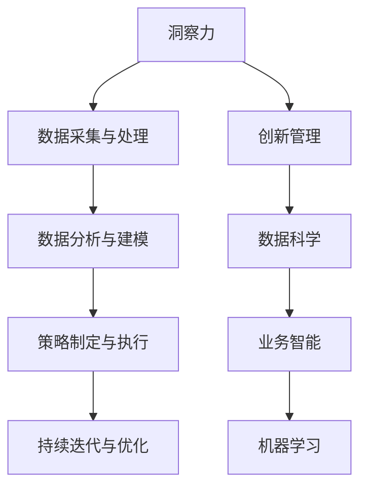

                 

# 洞察力与创新管理：企业竞争力的源泉

## 1. 背景介绍

在数字化转型的浪潮中，企业面对的市场环境越来越复杂多变。如何洞察市场趋势，快速应对变化，成为企业竞争力的关键。洞察力和创新管理作为企业应对动态市场环境的利器，在提升企业竞争力、驱动业务增长方面发挥着不可替代的作用。

### 1.1 问题由来

在过去几十年里，互联网和移动互联网的快速发展，使得消费者行为模式、市场趋势和竞争格局发生了巨大的变化。企业需要快速获取并处理海量数据，以识别新机会，制定有效策略。然而，数据的涌现速度和处理复杂度不断提升，传统的洞察方式已经无法满足现代企业的需求。

### 1.2 问题核心关键点

面对日益复杂的市场环境，洞察力和创新管理主要涉及以下几个关键点：
1. **数据采集与处理**：获取高质量、大容量的数据是洞察力的基础。
2. **数据分析与建模**：利用数据分析和建模技术，从中提炼出有价值的洞见。
3. **策略制定与执行**：将洞见转化为具体的业务策略，并通过高效的执行体系落地。
4. **持续迭代与优化**：市场环境不断变化，洞察力和创新管理需要持续迭代，适应新的挑战。

## 2. 核心概念与联系

### 2.1 核心概念概述

为更好地理解洞察力和创新管理在企业中的应用，本节将介绍几个密切相关的核心概念：

- **洞察力(Insight)**：从复杂的数据集中提炼出有价值的洞见，帮助企业发现潜在的市场机会和问题，驱动业务决策。
- **创新管理(Management of Innovation)**：企业通过建立完善的创新体系，识别并支持有潜力的创新项目，推动技术进步和业务增长。
- **数据科学(Data Science)**：利用数据科学方法和技术，处理和分析数据，提取有价值的洞见，驱动决策。
- **业务智能(Business Intelligence, BI)**：通过分析历史数据和实时数据，为企业提供战略决策支持，提高运营效率。
- **机器学习(Machine Learning, ML)**：利用算法和模型，自动化地分析数据，发现规律，优化决策。

这些核心概念之间的逻辑关系可以通过以下Mermaid流程图来展示：



这个流程图展示了一些核心概念及其之间的关系：

1. 洞察力基于数据采集与处理，通过数据分析与建模提炼出有价值的洞见。
2. 创新管理从洞察力中识别潜在的创新机会，通过数据科学和机器学习技术支持，转化为具体的业务策略。
3. 数据科学和业务智能为洞察力和创新管理提供数据和技术支持。
4. 机器学习作为数据分析和模型训练的重要手段，驱动洞察力和创新管理的深化。

这些概念共同构成了企业洞察力和创新管理的工作框架，使其能够在快速变化的市场环境中保持竞争力。

## 3. 核心算法原理 & 具体操作步骤

### 3.1 算法原理概述

洞察力和创新管理涉及的数据处理、模型训练和策略制定过程，本质上是一个从数据到策略的迭代优化过程。其核心思想是通过数据科学方法和技术，从海量数据中提炼出有价值的洞见，并结合业务知识，制定和执行有效的策略。

形式化地，假设原始数据集为 $D=\{x_1, x_2, \ldots, x_n\}$，其中 $x_i$ 表示第 $i$ 个数据样本。洞察力和创新管理的目标是找到最优策略 $\pi$，使得策略执行后的业务指标 $\mathcal{P}(\pi, D)$ 最大化。具体来说，策略 $\pi$ 可以包括产品开发、市场推广、客户关系管理等方面。

洞察力和创新管理涉及的算法步骤包括：

1. **数据采集与处理**：通过网络爬虫、传感器、社交媒体等渠道获取原始数据，进行数据清洗和预处理，以确保数据质量。
2. **数据分析与建模**：利用统计学、数据挖掘、机器学习等方法，对处理后的数据进行分析建模，从中提取有价值的洞见。
3. **策略制定与执行**：基于洞察结果，制定具体的业务策略，并通过执行体系落地，评估效果，进行反馈调整。
4. **持续迭代与优化**：通过不断迭代，根据最新的市场变化和业务反馈，优化策略和模型，提升整体表现。

### 3.2 算法步骤详解

以下以一个简化版的企业市场洞察力与创新管理流程为例，详细介绍各关键步骤：

**Step 1: 数据采集与处理**
- 通过网络爬虫技术，从电商、社交媒体等平台获取用户的购买行为、评价反馈等数据。
- 利用数据清洗技术去除噪音和异常值，保证数据质量。
- 使用特征工程技术提取有用的特征，如用户性别、年龄、消费习惯等。

**Step 2: 数据分析与建模**
- 对清洗后的数据进行探索性数据分析(EDA)，识别关键变量和关联关系。
- 使用统计学方法计算均值、标准差等基础指标，初步了解数据分布。
- 利用数据挖掘算法，如聚类、关联规则等，发现潜在的模式和规律。
- 应用机器学习模型，如回归、分类、聚类等，深入分析数据，提取有价值的洞见。

**Step 3: 策略制定与执行**
- 基于洞察结果，制定市场推广策略，如针对特定用户群体的广告投放、促销活动等。
- 确定关键性能指标(KPI)，如用户增长率、转化率等，评估策略效果。
- 利用执行体系，如CRM系统、市场推广平台等，落实策略，监控执行过程。
- 收集反馈数据，进行效果评估，根据评估结果进行调整优化。

**Step 4: 持续迭代与优化**
- 定期重新采集数据，更新洞察模型，确保数据的实时性和模型的时效性。
- 持续监控市场变化，及时调整策略，应对新的市场趋势。
- 利用反馈机制，定期回顾和优化洞察过程，提升整体效果。

### 3.3 算法优缺点

洞察力和创新管理在提升企业竞争力的同时，也存在一些局限性：
1. **数据质量依赖**：洞察力和创新管理的效果很大程度上依赖于数据的准确性和完整性。
2. **模型复杂度**：数据分析与建模过程中，模型复杂度可能会影响性能和可解释性。
3. **执行难度**：将洞察结果转化为具体的业务策略，需要高效的执行体系和团队配合。
4. **动态变化**：市场环境和用户需求不断变化，洞察力和创新管理需要持续更新和优化。

尽管存在这些局限性，但就目前而言，洞察力和创新管理仍是提升企业竞争力的重要手段。未来相关研究的重点在于如何进一步降低对数据的依赖，提高模型的可解释性和鲁棒性，同时兼顾执行效率和动态调整能力。

### 3.4 算法应用领域

洞察力和创新管理的应用领域广泛，涵盖了多个行业和企业管理的方方面面，例如：

- **零售行业**：通过分析用户购买行为和评价，制定个性化推荐和促销策略，提升用户满意度和销售额。
- **金融行业**：利用市场数据分析，识别投资机会和风险，制定投资组合策略，优化资产配置。
- **制造业**：通过供应链数据分析，优化生产计划和库存管理，降低成本，提升效率。
- **医疗行业**：利用患者健康数据，发现疾病模式和趋势，制定预防和治疗方案，提升医疗服务质量。
- **房地产行业**：分析市场供需数据，预测房价趋势，制定投资和开发策略，优化资产配置。
- **能源行业**：通过能源消耗数据分析，发现节能减排的机会，优化能源使用效率，降低成本。

除了上述这些经典应用外，洞察力和创新管理也被创新性地应用到更多场景中，如智慧城市管理、环境保护、社会治理等，为各行各业带来了新的业务增长点。随着技术的不断进步，相信洞察力和创新管理将在更广泛的领域发挥更大作用。

## 4. 数学模型和公式 & 详细讲解

### 4.1 数学模型构建

本节将使用数学语言对洞察力和创新管理的过程进行更加严格的刻画。

假设原始数据集为 $D=\{x_1, x_2, \ldots, x_n\}$，其中 $x_i$ 表示第 $i$ 个数据样本。洞察力和创新管理的目标是找到最优策略 $\pi$，使得策略执行后的业务指标 $\mathcal{P}(\pi, D)$ 最大化。

定义业务指标 $\mathcal{P}(\pi, D)$ 为：

$$
\mathcal{P}(\pi, D) = \sum_{i=1}^n f_i(x_i, \pi)
$$

其中 $f_i$ 为第 $i$ 个样本的业务指标函数，可以是转化率、销售额、用户满意度等。最优策略 $\pi^*$ 满足：

$$
\pi^* = \mathop{\arg\max}_{\pi} \mathcal{P}(\pi, D)
$$

在实践中，我们通常使用梯度上升等优化算法来近似求解上述最优化问题。设 $\eta$ 为学习率，则策略 $\pi$ 的更新公式为：

$$
\pi \leftarrow \pi + \eta \nabla_{\pi}\mathcal{P}(\pi, D)
$$

其中 $\nabla_{\pi}\mathcal{P}(\pi, D)$ 为业务指标函数对策略 $\pi$ 的梯度，可通过反向传播算法高效计算。

### 4.2 公式推导过程

以下我们以零售行业用户购买行为分析为例，推导回归模型及其梯度的计算公式。

假设模型 $M_{\pi}$ 在输入 $x$ 上的输出为 $\hat{y}=M_{\pi}(x) \in [0,1]$，表示用户购买概率。真实标签 $y \in \{0,1\}$。则二分类回归损失函数定义为：

$$
\ell(M_{\pi}(x),y) = -[y\log \hat{y} + (1-y)\log (1-\hat{y})]
$$

将其代入业务指标函数，得：

$$
\mathcal{P}(\pi, D) = -\frac{1}{N}\sum_{i=1}^N [y_i\log M_{\pi}(x_i)+(1-y_i)\log(1-M_{\pi}(x_i))]
$$

根据链式法则，业务指标函数对策略 $\pi$ 的梯度为：

$$
\frac{\partial \mathcal{P}(\pi, D)}{\partial \pi} = -\frac{1}{N}\sum_{i=1}^N (\frac{y_i}{M_{\pi}(x_i)}-\frac{1-y_i}{1-M_{\pi}(x_i)}) \frac{\partial M_{\pi}(x_i)}{\partial \pi}
$$

其中 $\frac{\partial M_{\pi}(x_i)}{\partial \pi}$ 可进一步递归展开，利用自动微分技术完成计算。

在得到业务指标函数的梯度后，即可带入策略更新公式，完成策略的迭代优化。重复上述过程直至收敛，最终得到适应市场需求的最优策略 $\pi^*$。

## 5. 项目实践：代码实例和详细解释说明

### 5.1 开发环境搭建

在进行洞察力和创新管理实践前，我们需要准备好开发环境。以下是使用Python进行TensorFlow开发的环境配置流程：

1. 安装Anaconda：从官网下载并安装Anaconda，用于创建独立的Python环境。

2. 创建并激活虚拟环境：
```bash
conda create -n insight-env python=3.8 
conda activate insight-env
```

3. 安装TensorFlow：根据CUDA版本，从官网获取对应的安装命令。例如：
```bash
conda install tensorflow -c pytorch -c conda-forge
```

4. 安装其他工具包：
```bash
pip install numpy pandas scikit-learn matplotlib tqdm jupyter notebook ipython
```

完成上述步骤后，即可在`insight-env`环境中开始实践。

### 5.2 源代码详细实现

这里我们以一个简化的零售行业用户购买行为分析为例，给出使用TensorFlow进行回归分析的PyTorch代码实现。

首先，定义回归任务的数据处理函数：

```python
import tensorflow as tf
from tensorflow import keras
import pandas as pd
import numpy as np

# 数据集准备
train_data = pd.read_csv('train.csv')
test_data = pd.read_csv('test.csv')

# 数据清洗
train_data = train_data.dropna()
test_data = test_data.dropna()

# 特征工程
features = ['age', 'gender', 'income', 'education']
X_train = train_data[features]
y_train = train_data['purchase']
X_test = test_data[features]
y_test = test_data['purchase']

# 数据标准化
scaler = tf.keras.preprocessing.scale.StandardScaler()
X_train = scaler.fit_transform(X_train)
X_test = scaler.transform(X_test)

# 模型构建
model = tf.keras.Sequential([
    tf.keras.layers.Dense(32, activation='relu', input_shape=(len(features),)),
    tf.keras.layers.Dense(1, activation='sigmoid')
])

# 编译模型
model.compile(optimizer='adam', loss='binary_crossentropy', metrics=['accuracy'])

# 训练模型
model.fit(X_train, y_train, epochs=10, batch_size=32, validation_data=(X_test, y_test))

# 评估模型
loss, accuracy = model.evaluate(X_test, y_test)
print(f'Accuracy: {accuracy:.4f}')
```

然后，使用TensorBoard可视化训练过程：

```python
# 配置TensorBoard
tensorboard_callback = tf.keras.callbacks.TensorBoard(log_dir='logs', histogram_freq=1)

# 重新训练模型并保存日志
model.fit(X_train, y_train, epochs=10, batch_size=32, validation_data=(X_test, y_test), callbacks=[tensorboard_callback])

# 加载TensorBoard
from IPython.display import HTML
HTML(open('logs/events.out.tfevents').read())
```

### 5.3 代码解读与分析

让我们再详细解读一下关键代码的实现细节：

**数据处理**：
- 使用Pandas库读取训练集和测试集，并去除空值。
- 定义特征集，包括年龄、性别、收入和教育程度。
- 使用TensorFlow提供的`StandardScaler`对特征进行标准化处理，确保数据在相同尺度上。

**模型构建**：
- 使用Keras API构建一个简单的两层神经网络，第一层为全连接层，激活函数为ReLU；第二层为输出层，激活函数为Sigmoid，用于二分类任务。
- 使用Adam优化器和二元交叉熵损失函数，编译模型。

**训练模型**：
- 使用`fit`方法训练模型，设置训练轮数为10，批次大小为32，并使用TensorBoard记录训练日志。
- 在训练完成后，使用`evaluate`方法评估模型在测试集上的性能。

可以看到，TensorFlow和Keras的结合，使得模型的构建和训练过程变得简洁高效。开发者可以将更多精力放在数据处理、模型改进等高层逻辑上，而不必过多关注底层的实现细节。

## 6. 实际应用场景

### 6.1 智能客服系统

基于洞察力和创新管理的智能客服系统，可以通过数据分析和建模，识别用户需求和行为模式，制定个性化的服务策略。具体而言：

- **数据分析**：利用用户的历史交互数据，通过聚类、关联规则等方法，识别出不同用户群体的需求和行为模式。
- **策略制定**：根据用户群体的特点，设计个性化的服务流程和回复模板。
- **执行与优化**：利用机器学习和自然语言处理技术，自动生成服务回复，并通过实时反馈不断优化模型。

通过以上步骤，智能客服系统能够实时响应用户需求，提供高质量的客户服务，提升用户满意度和忠诚度。

### 6.2 金融舆情监测

在金融领域，洞察力和创新管理可以通过分析市场数据，识别潜在的投资机会和风险。具体而言：

- **数据采集与处理**：利用爬虫技术获取市场新闻、评论、交易数据等。
- **数据分析与建模**：通过情感分析、文本分类等技术，对新闻和评论进行情绪和主题分析。
- **策略制定与执行**：根据情绪和主题分析结果，制定投资策略，如股票买卖、风险控制等。
- **持续迭代与优化**：根据市场变化和策略效果，不断优化模型和策略，提升投资收益和风险管理能力。

通过洞察力和创新管理，金融机构能够及时掌握市场动态，规避潜在风险，提升投资决策的科学性和准确性。

### 6.3 个性化推荐系统

在电子商务领域，洞察力和创新管理可以通过分析用户行为和反馈，构建个性化推荐模型。具体而言：

- **数据采集与处理**：获取用户的历史浏览、购买、评价等行为数据。
- **数据分析与建模**：通过协同过滤、基于内容的推荐等方法，对用户行为进行建模。
- **策略制定与执行**：根据用户的行为模式，动态调整推荐内容，提升推荐效果。
- **持续迭代与优化**：根据用户反馈，不断优化推荐模型，提升用户体验。

通过洞察力和创新管理，电子商务平台能够提供更加精准、个性化的推荐服务，提升用户粘性和购买转化率。

### 6.4 未来应用展望

随着技术的不断进步，基于洞察力和创新管理的系统将在更多领域得到应用，为行业带来新的增长点：

- **智慧医疗**：利用洞察力和创新管理，对患者健康数据进行分析，制定个性化治疗方案，提升医疗服务质量。
- **智能制造**：通过数据分析和建模，优化生产计划和供应链管理，提升制造效率和质量。
- **环境保护**：通过环境数据的洞察，发现节能减排的机会，制定可持续发展策略。
- **智慧城市**：利用城市数据的洞察，优化交通、能源、公共安全等系统，提升城市管理水平。
- **智能家居**：通过对用户行为数据的分析，提供更加智能、个性化的家居服务。

## 7. 工具和资源推荐

### 7.1 学习资源推荐

为了帮助开发者系统掌握洞察力和创新管理的理论基础和实践技巧，这里推荐一些优质的学习资源：

1. **《数据科学与机器学习》课程**：由斯坦福大学开设，系统介绍了数据科学和机器学习的基本概念和常用方法。
2. **《Python数据科学手册》书籍**：介绍Python在数据科学和机器学习中的应用，包括数据处理、模型构建、可视化等。
3. **Kaggle平台**：提供大量公开的数据集和比赛，帮助开发者实践数据科学和机器学习技能。
4. **Coursera平台**：提供由顶尖大学和企业开设的各类数据科学和机器学习课程，涵盖基础知识和高级技术。
5. **KDnuggets网站**：提供数据科学和机器学习的最新资讯、案例分析和实战教程，帮助开发者不断学习和提升。

通过对这些资源的学习实践，相信你一定能够快速掌握洞察力和创新管理的精髓，并用于解决实际的业务问题。

### 7.2 开发工具推荐

高效的开发离不开优秀的工具支持。以下是几款用于洞察力和创新管理开发的常用工具：

1. **TensorFlow**：由Google主导开发的深度学习框架，适合大规模数据处理和模型训练。
2. **Keras**：基于TensorFlow和Theano的高级神经网络API，易于上手，适合快速原型开发。
3. **Jupyter Notebook**：基于Web的交互式编程环境，支持Python、R等多种语言，便于快速迭代和共享。
4. **PySpark**：基于Scala的分布式计算框架，适合处理大规模数据集，支持多种机器学习算法。
5. **Azure ML Studio**：微软提供的云端机器学习平台，支持可视化编程，易于部署和管理。

合理利用这些工具，可以显著提升洞察力和创新管理的开发效率，加快创新迭代的步伐。

### 7.3 相关论文推荐

洞察力和创新管理的发展源于学界的持续研究。以下是几篇奠基性的相关论文，推荐阅读：

1. **《数据挖掘：概念与技术》**：介绍数据挖掘的基本概念和常用算法，是数据科学领域的经典教材。
2. **《机器学习：一种概率视角》**：由Tom Mitchell撰写，系统介绍机器学习的基本原理和常用方法。
3. **《深度学习》**：由Goodfellow等撰写，介绍深度学习的基本原理和最新进展，是机器学习领域的经典教材。
4. **《统计学习方法》**：由李航撰写，系统介绍统计学习的基本概念和常用方法，是机器学习领域的经典教材。
5. **《Python数据科学手册》**：由Jake VanderPlas撰写，介绍Python在数据科学和机器学习中的应用，包括数据处理、模型构建、可视化等。

这些论文代表了大数据和机器学习领域的研究脉络。通过学习这些前沿成果，可以帮助研究者把握学科前进方向，激发更多的创新灵感。

## 8. 总结：未来发展趋势与挑战

### 8.1 总结

本文对基于洞察力和创新管理的业务决策支持系统进行了全面系统的介绍。首先阐述了洞察力和创新管理的研究背景和意义，明确了其在提升企业竞争力和业务增长方面的独特价值。其次，从原理到实践，详细讲解了洞察力和创新管理的数学模型和关键步骤，给出了具体的代码实现。同时，本文还广泛探讨了洞察力和创新管理在智能客服、金融舆情、个性化推荐等多个行业领域的应用前景，展示了其广阔的适用性。此外，本文精选了相关学习资源，力求为读者提供全方位的技术指引。

通过本文的系统梳理，可以看到，基于洞察力和创新管理的系统正在成为业务决策的重要工具，显著提升了企业对复杂市场环境的应对能力。洞察力和创新管理通过数据分析和模型训练，帮助企业快速获取有价值的洞见，制定高效的业务策略，驱动业务增长。未来，伴随技术的不断进步和应用的深入，洞察力和创新管理必将在更多领域得到应用，为企业的可持续发展提供强大的技术支持。

### 8.2 未来发展趋势

展望未来，洞察力和创新管理的发展趋势主要包括：

1. **深度学习和大数据技术**：深度学习和大数据技术的应用将进一步提升洞察力和创新管理的效果。通过更先进的数据处理和建模技术，可以挖掘出更深层次、更复杂的洞见，驱动更高质量的业务决策。
2. **自动化和智能化**：随着自动机器学习(AutoML)和智能系统的发展，洞察力和创新管理的自动化水平将不断提高，减少人工干预，提升整体效率。
3. **跨领域融合**：洞察力和创新管理将与自然语言处理、计算机视觉等技术融合，形成跨领域的知识协同，提升决策系统的综合能力。
4. **实时化和高频交易**：洞察力和创新管理将应用于高频交易、实时决策等领域，提升实时性和准确性，满足快速变化的市场需求。
5. **伦理和隐私保护**：洞察力和创新管理将注重数据隐私和伦理问题，建立透明、可控的决策体系，确保数据和模型的安全性。
6. **全球化和本地化**：洞察力和创新管理将实现全球化布局，同时注重本地市场特点，提供具有地域特色的洞察和策略。

以上趋势凸显了洞察力和创新管理技术的广阔前景。这些方向的探索发展，必将进一步提升决策系统的精度和效率，为企业的竞争力和可持续发展提供坚实的基础。

### 8.3 面临的挑战

尽管洞察力和创新管理已经取得了一定的成果，但在实际应用中仍面临诸多挑战：

1. **数据质量问题**：洞察力和创新管理的效果很大程度上依赖于数据的准确性和完整性。数据采集、清洗和处理过程中，可能会出现噪音、缺失等问题，影响分析结果。
2. **模型复杂度**：数据分析和建模过程中，模型的复杂度可能会影响性能和可解释性。过于复杂的模型难以解释，可能带来误导性的决策。
3. **执行难度**：将洞察结果转化为具体的业务策略，需要高效的执行体系和团队配合。策略制定和执行过程中，可能面临组织协调、资源配置等问题。
4. **动态变化**：市场环境和用户需求不断变化，洞察力和创新管理需要持续更新和优化，保持实时性。
5. **隐私和伦理**：洞察力和创新管理需要考虑数据隐私和伦理问题，确保数据使用的透明性和合法性。

尽管存在这些挑战，但随着技术的不断进步和应用的深入，相信洞察力和创新管理将逐步克服这些难题，成为企业竞争力的重要组成部分。

### 8.4 研究展望

面对洞察力和创新管理所面临的种种挑战，未来的研究需要在以下几个方面寻求新的突破：

1. **自动化和智能化**：开发更先进的自动机器学习技术，减少人工干预，提高决策效率。同时，引入强化学习、因果推断等方法，提升决策系统的智能水平。
2. **模型压缩和优化**：开发更高效的模型压缩和优化技术，减少计算资源消耗，提升决策系统的实时性和可扩展性。
3. **跨领域融合**：探索跨领域融合方法，将不同领域的数据和知识结合起来，提升决策系统的综合能力。
4. **伦理和隐私保护**：研究数据隐私保护和伦理约束的方法，建立透明、可控的决策体系，确保数据和模型的安全性。
5. **实时化和高频交易**：探索实时化和高频交易的决策方法，提升决策系统的实时性和准确性，满足快速变化的市场需求。
6. **全球化和本地化**：研究全球化和本地化的决策策略，提升决策系统的适应性和地域化能力。

这些研究方向将引领洞察力和创新管理技术的不断进步，为企业的可持续发展提供更加坚实的技术支持。

## 9. 附录：常见问题与解答

**Q1：洞察力和创新管理是否适用于所有业务场景？**

A: 洞察力和创新管理在提升企业竞争力的同时，也存在一些局限性。对于某些业务场景，如产品设计、供应链管理等，洞察力和创新管理的效果可能不如直接进行实地调研和专家咨询。

**Q2：如何选择合适的模型和算法？**

A: 选择模型和算法需要根据业务问题的特点和数据的特性来决定。一般来说，可以先进行数据探索性分析，识别关键变量和关系，然后选择合适的模型和算法。常用的模型包括回归、分类、聚类等，常用的算法包括线性回归、决策树、K-Means等。

**Q3：如何提升洞察力和创新管理的自动化水平？**

A: 自动化水平可以通过引入自动化机器学习(AutoML)技术来实现。AutoML可以根据数据和业务需求，自动选择最优的模型和超参数，减少人工干预，提升决策效率。同时，可以使用自然语言处理技术，自动生成分析报告和策略建议，进一步提升自动化水平。

**Q4：如何确保洞察力和创新管理的可解释性？**

A: 确保可解释性需要从数据采集、模型训练、结果解读等多个环节入手。可以使用可视化工具，如TensorBoard、Tableau等，展示模型训练过程和结果。同时，可以设计简单的规则和业务逻辑，辅助模型解释，提高决策的可理解性。

**Q5：如何应对数据隐私和伦理问题？**

A: 数据隐私和伦理问题可以通过数据脱敏、差分隐私、伦理审查等手段来解决。在数据采集和处理过程中，可以使用差分隐私技术，保护用户隐私。同时，可以建立伦理审查机制，确保数据使用的透明性和合法性。

通过以上问答，相信读者能够更好地理解洞察力和创新管理，并应用于实际的业务决策中。洞察力和创新管理作为企业竞争力的重要组成部分，将在未来的数字化转型中发挥越来越重要的作用。

