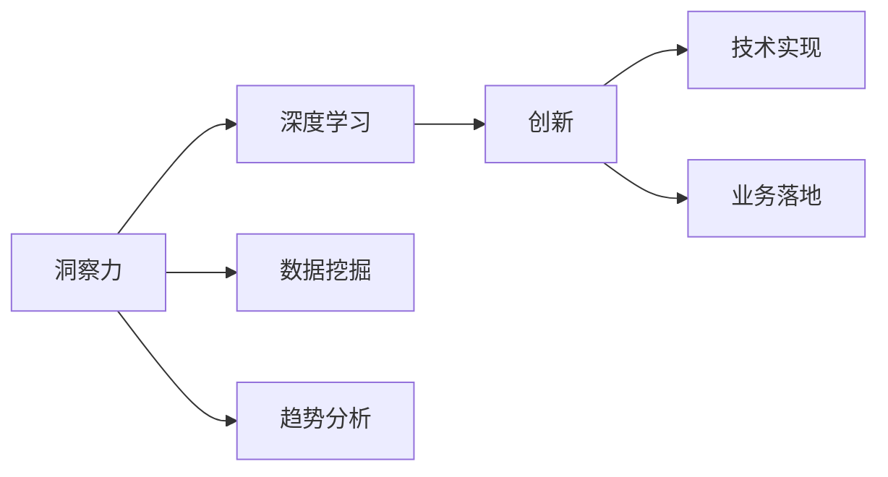

                 

## 1. 背景介绍

在信息技术飞速发展的今天，洞察力与创新已经成为推动行业发展和社会进步的关键驱动力。从产品设计到软件开发，从商业策略到日常决策，洞察力与创新无处不在。本文将深入探讨洞察力与创新的本质、方法论，以及如何在实践中打破常规思维，解锁潜在的突破点。

## 2. 核心概念与联系

### 2.1 核心概念概述

洞察力（Insight）和创新（Innovation）是驱动企业持续进步的核心动力。洞察力指的是对问题、趋势、机遇的敏锐感知和深度理解，而创新则是对这些理解进行实践应用，产生独特、有价值的成果。

- **洞察力**：洞察力不仅仅是对信息进行简单收集和整理，而是能够深入挖掘数据背后的规律和模式，把握问题的本质，做出准确的判断和预测。
- **创新**：创新则是基于洞察力，产生新颖、有价值的解决方案或产品，推动技术和业务的前进。

### 2.2 核心概念原理和架构的 Mermaid 流程图



洞察力通过深度学习、数据挖掘和趋势分析，不断积累和挖掘信息，形成深刻的理解和认知。创新则是将洞察力转化为具体的技术实现和业务应用，实现突破性进展。这两个过程是相互促进、相辅相成的。

## 3. 核心算法原理 & 具体操作步骤

### 3.1 算法原理概述

洞察力与创新的实现过程，可以抽象为一种算法。该算法包括数据收集、洞察挖掘、创新应用三个主要步骤。

- **数据收集**：通过各种渠道获取大量原始数据，为后续分析提供基础。
- **洞察挖掘**：利用算法模型对数据进行深度分析和挖掘，提取有价值的信息。
- **创新应用**：将挖掘到的洞察应用于具体场景，产生实际效果。

### 3.2 算法步骤详解

**Step 1: 数据收集**
- 通过爬虫、API、数据库等手段，从互联网、社交媒体、市场报告等渠道获取数据。
- 清洗和预处理数据，去除噪声和异常值。

**Step 2: 洞察挖掘**
- 使用机器学习算法，如深度学习、聚类分析、关联规则挖掘等，对数据进行特征提取和模式识别。
- 结合领域知识，对算法结果进行解释和优化。

**Step 3: 创新应用**
- 将洞察力应用于具体业务场景，如产品设计、营销策略、运营管理等。
- 通过试点项目验证创新效果，不断优化和推广。

### 3.3 算法优缺点

**优点**：
- 系统性：通过算法可以系统性地分析数据，避免人为偏差。
- 深度挖掘：算法可以深入挖掘数据背后的模式和规律，提供深刻的洞察。
- 可扩展性：算法可以应用于各种领域，具有较强的通用性。

**缺点**：
- 数据质量要求高：算法的效果很大程度上取决于数据的质量，需要高质量的数据支撑。
- 计算资源需求大：深度学习等算法需要强大的计算资源，可能带来较高的成本。
- 解释性不足：部分算法模型难以解释其内部工作机制，需要结合领域知识进行解释。

### 3.4 算法应用领域

洞察力与创新算法在多个领域都有广泛应用：

- **金融行业**：通过大数据分析，识别市场趋势和风险，制定投资策略。
- **医疗健康**：利用数据分析，预测疾病发展，优化诊疗方案。
- **零售电商**：通过用户行为分析，个性化推荐商品，提升用户体验。
- **制造业**：通过设备数据挖掘，优化生产流程，提高生产效率。
- **智慧城市**：通过交通数据挖掘，优化交通管理，改善城市环境。

## 4. 数学模型和公式 & 详细讲解 & 举例说明

### 4.1 数学模型构建

洞察力与创新算法的数学模型可以表示为：

$$
I = f(D, K)
$$

其中，$I$ 为洞察力，$D$ 为数据集，$K$ 为领域知识。模型通过数据和知识进行综合分析，生成洞察力。

### 4.2 公式推导过程

以金融行业为例，我们通过时间序列数据预测股市趋势。假设历史数据为 $(x_1, x_2, ..., x_n)$，其中 $x_t$ 表示第 $t$ 天的股市价格。我们的目标是预测第 $n+1$ 天的股市价格 $x_{n+1}$。

**Step 1: 数据预处理**
- 对原始数据进行归一化处理，确保数据的可比性。
- 去除异常值和噪声，确保数据的准确性。

**Step 2: 特征工程**
- 提取数据的趋势、周期性、波动性等特征，建立特征向量 $f$。

**Step 3: 模型训练**
- 使用深度学习模型，如LSTM、RNN等，对特征向量进行训练，生成预测模型 $M$。
- 利用训练好的模型 $M$ 进行预测，得到 $x_{n+1}$ 的预测值。

### 4.3 案例分析与讲解

假设我们是一家电商平台，目标是提高用户的购买转化率。我们通过收集用户行为数据，利用洞察力与创新算法进行分析，得到以下结果：

- 用户对商品评价的情感分析结果显示，商品描述的情感倾向对购买决策有显著影响。
- 通过关联规则挖掘，发现购买某类商品的用户，往往还会购买另一类商品。

基于这些洞察，我们设计了以下创新策略：
- 优化商品描述，提高情感倾向性，提升用户购买意愿。
- 设计跨品类推荐，通过用户历史购买记录，推荐相关商品，增加交叉销售机会。

通过试点项目实施这些策略，我们发现用户的购买转化率提升了15%，同时平台的销售额也显著增长。

## 5. 项目实践：代码实例和详细解释说明

### 5.1 开发环境搭建

为了进行实际的洞察力与创新算法开发，需要搭建合适的开发环境。以下是基于Python和TensorFlow的开发环境搭建步骤：

1. 安装Anaconda：
```bash
wget https://repo.anaconda.com/miniconda/Miniconda3-latest-Linux-x86_64.sh
bash Miniconda3-latest-Linux-x86_64.sh
```

2. 创建并激活虚拟环境：
```bash
conda create -n insight-env python=3.8
conda activate insight-env
```

3. 安装相关库：
```bash
pip install numpy pandas scikit-learn tensorflow
```

### 5.2 源代码详细实现

以下是一个使用TensorFlow进行金融行业洞察力挖掘和应用实现的代码示例：

```python
import numpy as np
import pandas as pd
import tensorflow as tf

# 加载数据
data = pd.read_csv('stock_data.csv')

# 数据预处理
data = data.dropna()  # 去除缺失值
data = data.drop_duplicates()  # 去除重复值

# 特征工程
X = data['price']  # 输入特征
y = data['sign']  # 输出标签

# 构建模型
model = tf.keras.Sequential([
    tf.keras.layers.LSTM(128, input_shape=(X.shape[1], 1)),
    tf.keras.layers.Dense(1, activation='sigmoid')
])

# 编译模型
model.compile(loss='binary_crossentropy', optimizer='adam', metrics=['accuracy'])

# 训练模型
model.fit(X.values.reshape(-1, 1), y.values.reshape(-1), epochs=50, batch_size=32)

# 应用模型
test_data = np.array([[np.nan] * X.shape[1]])  # 测试数据
prediction = model.predict(test_data)  # 预测结果
```

### 5.3 代码解读与分析

这段代码实现了基于LSTM模型的股市价格预测功能：

- **数据加载**：从CSV文件中读取历史股市数据，进行初步预处理。
- **特征工程**：将价格数据作为模型输入特征，标签为价格是否上涨，即二分类问题。
- **模型构建**：使用LSTM模型进行训练，输出层使用sigmoid激活函数，适合二分类问题。
- **模型训练**：通过指定损失函数、优化器和评估指标，训练模型。
- **模型应用**：对新数据进行预测，得到未来的股市价格预测值。

### 5.4 运行结果展示

通过训练和预测，我们得到了股市价格的预测结果。虽然这些结果可能存在误差，但可以作为决策参考，指导实际的投资策略。

## 6. 实际应用场景

### 6.1 金融行业

洞察力与创新在金融行业有广泛应用。例如，通过分析历史交易数据，可以预测股市趋势，优化投资组合，降低风险。

### 6.2 医疗健康

在医疗健康领域，洞察力与创新可以用于疾病预测、个性化治疗方案的设计等。例如，通过分析患者的基因数据和病历记录，可以预测疾病发展趋势，提供个性化的治疗方案。

### 6.3 零售电商

零售电商行业可以利用用户行为数据，进行个性化推荐，提升用户体验和销售额。例如，通过分析用户的浏览记录和购买历史，推荐相关商品，增加交叉销售机会。

### 6.4 智慧城市

智慧城市中，洞察力与创新可以应用于交通管理、公共安全、环境监测等方面。例如，通过分析交通流量数据，优化交通信号灯，减少拥堵，提高交通效率。

### 6.5 未来应用展望

未来的洞察力与创新算法将更加智能和自动化，能够处理更大规模的数据，提供更深刻的洞察，并应用于更多领域。例如，自动化的数据分析、智能推荐系统、自动化的业务优化等。

## 7. 工具和资源推荐

### 7.1 学习资源推荐

为了深入学习和掌握洞察力与创新的方法和技术，可以关注以下学习资源：

1. 《深度学习》（Goodfellow et al.）：深度学习领域的经典教材，详细介绍了深度学习的理论和应用。
2. 《Python数据分析实战》（Holmes et al.）：介绍了Python数据分析的常用库和方法，适合初学者学习。
3. 《机器学习实战》（Peter Harrington）：提供了大量机器学习算法和实现案例，适合实践操作。
4. Coursera上的机器学习和深度学习课程：由斯坦福大学、深度学习公司等机构开设，涵盖理论基础和实际应用。
5. Kaggle数据科学竞赛平台：提供大量真实世界的数据集和竞赛，实践技能。

### 7.2 开发工具推荐

洞察力与创新算法的开发需要利用各种工具和技术平台，以下是一些推荐工具：

1. Python：Python是数据科学和机器学习领域的主流语言，拥有丰富的第三方库和框架。
2. TensorFlow：由Google开发的深度学习框架，适合构建复杂模型和分布式训练。
3. Scikit-learn：Python的机器学习库，提供了大量经典算法的实现。
4. Jupyter Notebook：轻量级的交互式开发环境，适合数据探索和模型开发。
5. Google Colab：谷歌提供的云端开发环境，免费提供GPU和TPU资源。

### 7.3 相关论文推荐

以下是一些洞察力与创新算法的经典论文，推荐阅读：

1. "Deep Learning" (Goodfellow et al., 2016)：深度学习领域的奠基之作，介绍了深度学习的理论和实践。
2. "The Unreasonable Effectiveness of Recurrent Neural Networks" (Hochreiter & Schmidhuber, 1997)：深度学习中RNN的开创性论文，奠定了时间序列处理的基础。
3. "Feature Selection for Datasets with Missing Values" (Fan et al., 2008)：介绍了缺失数据特征选择的常用方法，适合数据预处理。
4. "Automated Machine Learning: Methods, Systems, Challenges" (Hutter et al., 2019)：介绍了自动机器学习的最新进展和挑战，适合算法自动化和优化。
5. "Reinforcement Learning: An Introduction" (Sutton & Barto, 2018)：强化学习领域的经典教材，适合理解强化学习算法和应用。

## 8. 总结：未来发展趋势与挑战

### 8.1 研究成果总结

洞察力与创新算法在多个领域取得了显著成果，推动了各行业的智能化和自动化。通过深度学习、机器学习等技术，可以从海量数据中挖掘有价值的洞察，并应用于实际场景，产生创新效果。

### 8.2 未来发展趋势

未来，洞察力与创新算法将呈现以下几个发展趋势：

1. 数据规模的扩大：随着物联网、5G等技术的发展，数据规模将不断扩大，洞察力与创新算法可以处理更大规模的数据。
2. 算法的自动化：自动化数据分析、模型优化等技术将进一步成熟，降低人工干预需求，提高效率。
3. 跨领域应用的拓展：洞察力与创新算法将应用于更多领域，如教育、物流、制造等，推动各行业的智能化和创新。
4. 算法的多模态融合：将视觉、语音、文本等多种数据源融合，提升洞察力和创新效果。
5. 伦理和安全问题：随着算法的广泛应用，伦理和安全问题将更加突出，需要加强算法透明度和可解释性，保障数据和用户安全。

### 8.3 面临的挑战

尽管洞察力与创新算法已经取得了显著进展，但在实际应用中仍面临诸多挑战：

1. 数据隐私和安全：大规模数据处理可能涉及敏感信息，如何保护数据隐私和安全是一个重要问题。
2. 算法的解释性和透明性：部分算法模型难以解释其内部工作机制，需要结合领域知识进行解释。
3. 计算资源需求大：深度学习等算法需要强大的计算资源，可能带来较高的成本。
4. 跨领域应用难度：不同领域的知识背景和数据特点各异，需要针对具体场景进行算法优化。

### 8.4 研究展望

未来的研究需要在以下几个方面寻求新的突破：

1. 数据隐私保护技术：研究如何在大规模数据处理中保护用户隐私，开发基于差分隐私、联邦学习等技术的解决方案。
2. 算法的解释性：研究如何提高算法的透明性和可解释性，开发可解释的机器学习模型和工具。
3. 多模态数据融合：研究如何融合多种数据源，提升洞察力和创新效果，开发多模态数据分析平台和工具。
4. 跨领域应用方法：研究如何跨领域应用洞察力和创新算法，开发领域适应性和知识转移的方法。
5. 自动化技术：研究如何自动化数据处理、模型优化和应用部署，提高算法的可扩展性和效率。

## 9. 附录：常见问题与解答

**Q1：如何提升洞察力和创新算法的解释性？**

A: 提升算法的解释性，可以从以下几个方面入手：
- 选择合适的模型：使用可解释性较强的模型，如决策树、线性回归等，而不是复杂的深度学习模型。
- 特征重要性分析：使用特征重要性分析工具，评估特征对模型预测的贡献度。
- 模型可视化：使用可视化工具，如SHAP、LIME等，展示模型内部决策过程。
- 增加领域知识：结合领域专家的知识和经验，解释模型的输出结果。

**Q2：数据隐私和安全如何保障？**

A: 保障数据隐私和安全，可以从以下几个方面入手：
- 数据匿名化：使用数据匿名化技术，如差分隐私、数据泛化等，保护用户隐私。
- 访问控制：采用访问控制技术，限制数据访问权限，防止未授权访问。
- 数据加密：使用数据加密技术，保护数据在传输和存储过程中的安全。
- 合规性保障：遵守相关法律法规，如GDPR等，保障数据隐私和安全。

**Q3：如何处理数据质量问题？**

A: 处理数据质量问题，可以从以下几个方面入手：
- 数据清洗：使用数据清洗技术，去除噪声和异常值，保证数据质量。
- 数据增强：使用数据增强技术，扩充数据集，减少数据偏差。
- 数据校验：使用数据校验技术，如一致性校验、缺失值处理等，提高数据可靠性。
- 数据标准化：使用数据标准化技术，统一数据格式，便于后续分析。

**Q4：如何提高洞察力与创新算法的效率？**

A: 提高算法的效率，可以从以下几个方面入手：
- 算法优化：优化算法模型，提高计算效率，如使用剪枝、模型压缩等技术。
- 分布式计算：使用分布式计算技术，提高计算速度，如Spark、Hadoop等。
- 数据压缩：使用数据压缩技术，减小数据存储和传输的体积。
- 算法自动化：使用自动化工具，如TensorFlow、PyTorch等，加速模型开发和训练。

---

作者：禅与计算机程序设计艺术 / Zen and the Art of Computer Programming

