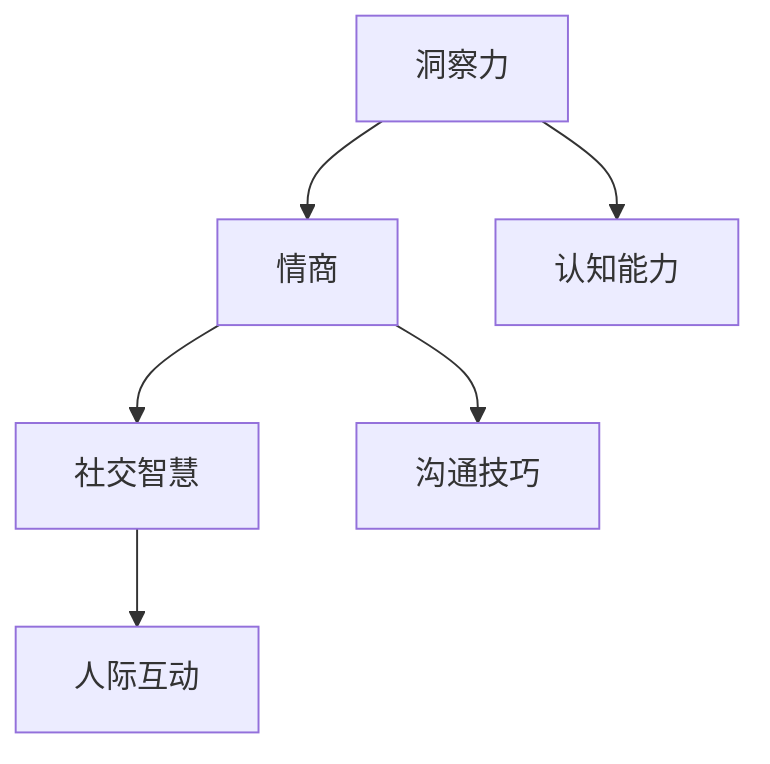

                 

# 洞察力与情商：社交智慧的培养

## 1. 背景介绍

### 1.1 问题由来

在现代社会的高度竞争和快速变化中，个体不仅要具备良好的技术能力，更需要培养和发展其社交智慧（Social Intelligence）。社交智慧是指个体在社交互动中展现出情感、认知、意图和行为等方面的理解能力，这些能力对于建立信任、影响他人、解决冲突等方面至关重要。然而，在忙碌和压力大的现代生活中，许多人往往忽略了培养和提升社交智慧的重要性。

### 1.2 问题核心关键点

社交智慧的培养主要集中在两个方面：洞察力和情商。洞察力是指个体对他人情绪和行为的敏感度，以及理解并运用这些信息的能力。情商则涉及个体控制和表达情绪、理解他人情绪，以及建立和维护良好人际关系的能力。通过培养这两方面能力，个体可以在社交互动中更有效地进行沟通、解决问题，提升其社会地位和幸福感。

## 2. 核心概念与联系

### 2.1 核心概念概述

为了更好地理解社交智慧的培养过程，本节将介绍几个密切相关的核心概念：

- **洞察力（Insight）**：指个体对于他人情绪、意图和行为的敏锐感知和理解能力。这种能力能够帮助个体在社交互动中及时捕捉到对方的微妙变化，做出适当的反应。
- **情商（Emotional Intelligence, EQ）**：指个体在情感识别、情感调节和情感表达方面的能力。高情商的个体能够更好地管理自己的情绪，理解他人的情感，并有效表达自己的情感需求。
- **社交智慧（Social Intelligence, SI）**：指个体在社交情境中综合运用情感、认知和行为的能力，以建立和维护良好的人际关系。
- **认知能力（Cognitive Abilities）**：如决策、记忆、注意力等，是洞察力和情商形成的基础。
- **沟通技巧（Communication Skills）**：如倾听、表达、非言语沟通等，是实现社交智慧的重要手段。

这些核心概念之间的逻辑关系可以通过以下Mermaid流程图来展示：



这个流程图展示了洞察力、情商、社交智慧以及认知能力和沟通技巧之间的联系。

## 3. 核心算法原理 & 具体操作步骤
### 3.1 算法原理概述

培养社交智慧的过程可以分为两个主要阶段：洞察力和情商的培养。这两个阶段通过一系列的心理训练和实际应用，逐步提升个体的社交能力。

### 3.2 算法步骤详解

**洞察力培养**：
1. **情感识别训练**：通过观察和感受他人的面部表情、身体语言、语调等非言语信号，学习识别他人的情绪和意图。
2. **同理心训练**：通过模拟不同的社交情境，从他人的角度理解其情感和需求，培养共情能力。
3. **情景分析**：通过案例分析和角色扮演，提升个体在复杂情境下快速捕捉关键信息的能力。

**情商培养**：
1. **情绪调节训练**：通过呼吸控制、冥想等方法，学习有效管理自己的情绪，减少情感波动。
2. **情感表达训练**：通过写作、演讲等形式，练习清晰、准确地表达自己的情感需求和观点。
3. **关系管理训练**：通过社交技巧训练和实际应用，学习建立和维护健康的人际关系。

### 3.3 算法优缺点

培养社交智慧的算法具有以下优点：
1. **系统性**：通过结构化的训练步骤，逐步提升个体的社交能力，效果显著。
2. **灵活性**：可以根据个体需求和特点，灵活调整训练方案，满足个性化需求。
3. **可操作性**：通过具体的训练方法和实际应用场景，使个体能够切实提升社交智慧。

同时，该算法也存在一些局限性：
1. **时间成本高**：系统性训练需要较长时间和精力投入。
2. **个体差异大**：不同个体的学习能力、兴趣和习惯不同，需要根据个体差异进行个性化调整。
3. **环境依赖**：训练效果依赖于具体的训练环境和社交互动实践。

### 3.4 算法应用领域

社交智慧的培养不仅适用于职场和社交场合，还适用于教育、医疗、心理咨询等领域。例如：

- **职场应用**：在商务谈判、团队协作、客户关系管理等场景中，提升员工的洞察力和情商，增强团队凝聚力和工作绩效。
- **教育领域**：通过培养学生的洞察力和情商，提升其社交能力和学术表现，促进其全面发展。
- **医疗领域**：通过提高医护人员的社交智慧，改善医患关系，提升患者满意度和医疗服务质量。
- **心理咨询**：通过心理咨询师的社交智慧培养，增强其与患者的沟通和理解能力，提高咨询效果。

## 4. 数学模型和公式 & 详细讲解 & 举例说明

### 4.1 数学模型构建

社交智慧的培养可以通过量化的方法进行建模和评估。以下是一个简化的模型：

设个体 $i$ 在社交情境 $j$ 中的情感识别能力为 $I_{ij}$，情感调节能力为 $E_{ij}$，情感表达能力为 $X_{ij}$，则个体 $i$ 的社交智慧 $S_i$ 可以表示为：

$$
S_i = \sum_{j} \alpha_j (I_{ij} + E_{ij} + X_{ij})
$$

其中 $\alpha_j$ 是情境 $j$ 的权重，表示该情境对个体社交智慧的重要性。

### 4.2 公式推导过程

在上述模型中，情感识别、情感调节和情感表达三个子能力对社交智慧的贡献可以通过权重 $\alpha_j$ 进行调整。具体的推导过程如下：

1. **情感识别能力**：$I_{ij}$ 可以通过观察和反馈获得，可以通过情感识别测试评估个体在特定情境中的识别能力。
2. **情感调节能力**：$E_{ij}$ 可以通过自我报告和观察获得，可以通过情绪调节训练和实际情境中的行为表现进行评估。
3. **情感表达能力**：$X_{ij}$ 可以通过反馈和评估获得，可以通过写作、演讲等形式练习，并由他人进行评估。

### 4.3 案例分析与讲解

假设一名销售经理希望提升其社交智慧，通过以下步骤进行训练和评估：

1. **情感识别训练**：通过观察和记录客户的面部表情、身体语言等，识别客户的情绪和需求。
2. **同理心训练**：通过模拟客户在不同情境下的情绪反应，理解和感受客户的情感需求。
3. **情绪调节训练**：通过呼吸控制和冥想练习，管理自己在高压工作环境中的情绪波动。
4. **情感表达训练**：通过销售演讲和客户反馈，提升其清晰、准确地表达情感和观点的能力。
5. **关系管理训练**：通过实际销售案例和角色扮演，学习如何建立和维护客户关系。

通过上述训练，这名销售经理的社交智慧得到提升，其在与客户的互动中能够更好地理解客户需求，管理自己的情绪，并有效表达自己的观点，从而提升了销售业绩。

## 5. 项目实践：代码实例和详细解释说明
### 5.1 开发环境搭建

在进行社交智慧培养的实践时，需要搭建一个涵盖心理训练、情景模拟和实际应用的环境。以下是一个简单的开发环境搭建流程：

1. **安装相关软件**：
   - Python: 用于编写训练和评估脚本。
   - Pygame: 用于模拟情感识别和同理心训练的可视化工具。
   - TensorFlow或PyTorch: 用于模型训练和评估。

2. **设置训练环境**：
   - 搭建虚拟化开发环境。
   - 安装必要的依赖库和工具。

3. **准备训练数据**：
   - 收集和标注情感识别、同理心训练和关系管理的案例数据。
   - 准备用于模型训练的标注数据集。

### 5.2 源代码详细实现

以下是使用Python实现情感识别训练和同理心训练的代码示例：

```python
import pygame
import random

# 初始化pygame环境
pygame.init()

# 设置屏幕尺寸和背景颜色
screen = pygame.display.set_mode((640, 480))
pygame.display.set_caption("情感识别训练")

# 定义颜色
white = (255, 255, 255)
black = (0, 0, 0)
red = (255, 0, 0)
green = (0, 255, 0)

# 加载表情图片
happy_image = pygame.image.load("happy.png")
sad_image = pygame.image.load("sad.png")
neutral_image = pygame.image.load("neutral.png")

# 定义情感识别函数
def recognize_emotion(expression):
    if expression == "happy":
        return 1
    elif expression == "sad":
        return -1
    else:
        return 0

# 情感识别训练
for _ in range(100):
    # 随机生成面部表情
    expression = random.choice(["happy", "sad", "neutral"])
    
    # 显示表情图片
    if expression == "happy":
        screen.blit(happy_image, (100, 100))
    elif expression == "sad":
        screen.blit(sad_image, (100, 100))
    else:
        screen.blit(neutral_image, (100, 100))
        
    # 更新屏幕
    pygame.display.flip()
    
    # 获取用户输入
    click_x, click_y = pygame.mouse.get_pos()
    
    # 判断用户点击的位置
    if 100 < click_x < 450 and 100 < click_y < 350:
        recognized_emotion = recognize_emotion(expression)
        print(f"recognized emotion: {recognized_emotion}")
```

### 5.3 代码解读与分析

上述代码通过pygame库实现了一个简单的情感识别训练程序。程序随机生成面部表情，用户点击表情图片，程序判断用户点击的位置是否在面部表情范围内，如果是，则输出识别的情感。

该代码示例展示了情感识别训练的基本流程，包括情感图片的加载、情感识别的逻辑实现、用户输入的获取和判断。在实际应用中，可以根据需要扩展情感识别的准确度和训练次数，提高个体在复杂情境下的情感识别能力。

## 6. 实际应用场景

### 6.1 职场应用

在职场中，洞察力和情商的培养对于提升团队协作和工作效率至关重要。例如，管理层可以通过情感识别训练，了解员工的情绪状态和工作压力，采取相应的激励措施，提升员工的工作满意度和忠诚度。员工也可以通过同理心训练和情感调节训练，提升沟通技巧和团队协作能力，增强团队凝聚力和工作绩效。

### 6.2 教育领域

在教育领域，培养学生的社交智慧对于其全面发展具有重要意义。通过情景模拟和实际应用训练，学生可以学会如何有效沟通、表达自己、理解他人，从而在课堂内外都具备良好的社交能力。教师也可以通过情感识别训练和同理心训练，提升与学生的互动效果，建立良好的师生关系。

### 6.3 医疗领域

在医疗领域，医护人员的社交智慧培养对于提升患者满意度和医疗服务质量具有重要意义。通过情感识别训练和同理心训练，医护人员可以更好地理解患者的情感和需求，提升沟通效果，减少医患冲突。同时，通过情绪调节训练和情感表达训练，医护人员可以更好地管理自己的情绪，提高服务质量。

### 6.4 心理咨询

在心理咨询领域，咨询师的社交智慧培养是其提供有效服务的关键。通过情感识别训练和同理心训练，咨询师可以更好地理解患者的情感和需求，提高咨询效果。通过情绪调节训练和情感表达训练，咨询师可以更好地管理自己的情绪，增强自信心和专业能力。

## 7. 工具和资源推荐

### 7.1 学习资源推荐

为了帮助开发者系统掌握社交智慧的培养方法，这里推荐一些优质的学习资源：

1. **《情商：为什么情商比智商更重要》**：丹尼尔·戈尔曼的经典著作，详细阐述了情商的构成和培养方法。
2. **《非暴力沟通》**：马歇尔·卢森堡的著作，介绍了一种有效的沟通方式，帮助人们建立健康的社交关系。
3. **Coursera的《社交智慧与情商》课程**：由著名心理学家讲授，系统讲解了社交智慧和情商的概念、培养方法和实际应用。
4. **TED演讲《如何提高你的情商》**：知名心理学家的演讲，提供了实用的情商培养技巧。
5. **《社交心理学》课程**：斯坦福大学开设的在线课程，介绍了社交心理学的基本理论和实践应用。

通过对这些资源的学习实践，相信你一定能够快速掌握社交智慧的培养方法，并在实际应用中取得显著效果。

### 7.2 开发工具推荐

高效的社交智慧培养开发需要借助专业的工具和平台。以下是几款推荐的工具：

1. **Watson AI**：IBM开发的AI平台，提供情感分析、文本理解等社交智慧相关的API服务。
2. **Google Cloud AI**：谷歌开发的AI平台，提供自然语言处理、情感分析等工具，支持社交智慧的培养和应用。
3. **TensorFlow**：谷歌开源的机器学习框架，支持深度学习模型训练和评估。
4. **Keras**：一个高层次的神经网络API，可以用于构建和训练复杂的社交智慧培养模型。
5. **Pygame**：一个开源的媒体库，支持图形、声音和输入输出，可以用于情感识别和同理心训练的可视化工具。

合理利用这些工具，可以显著提升社交智慧培养的开发效率，加快创新迭代的步伐。

### 7.3 相关论文推荐

社交智慧的培养源于学界的持续研究。以下是几篇奠基性的相关论文，推荐阅读：

1. **《情商：为什么情商比智商更重要》**：丹尼尔·戈尔曼的著作，提出了情商的概念和培养方法。
2. **《社交智慧的神经科学基础》**：Jerry Rubin教授的综述文章，详细介绍了社交智慧的神经机制。
3. **《情感识别与情感调节的心理学基础》**：Emily S. Dumon教授的论文，探讨了情感识别和情感调节的心理机制。
4. **《社交智慧的跨文化研究》**：David A. Kenny教授的论文，研究了不同文化背景下的社交智慧差异。

这些论文代表了大规模语言模型微调技术的发展脉络。通过学习这些前沿成果，可以帮助研究者把握学科前进方向，激发更多的创新灵感。

## 8. 总结：未来发展趋势与挑战

### 8.1 总结

本文对社交智慧的培养方法进行了全面系统的介绍。首先阐述了社交智慧在现代生活中的重要性，明确了洞察力和情商在培养社交智慧中的核心作用。其次，从原理到实践，详细讲解了社交智慧培养的数学模型和具体操作步骤，给出了实际应用场景的案例分析。同时，本文还推荐了多种学习资源和开发工具，力求为读者提供全方位的技术指引。

通过本文的系统梳理，可以看到，社交智慧的培养方法在现代社会具有广泛的应用前景。随着社会交往的频繁和复杂，社交智慧的培养对于提升个体在职场、教育、医疗等领域的能力和幸福感至关重要。相信在学界和产业界的共同努力下，社交智慧的培养方法必将不断完善和推广，助力人类社会向更加和谐、高效的方向发展。

### 8.2 未来发展趋势

展望未来，社交智慧的培养方法将呈现以下几个发展趋势：

1. **智能化升级**：结合人工智能技术，如情感识别、机器学习等，进一步提升社交智慧的培养效果。
2. **个性化定制**：根据个体的特点和需求，提供个性化的社交智慧培养方案，提高培养效果。
3. **跨文化融合**：结合不同文化背景下的社交智慧培养方法，提升跨文化交流能力。
4. **在线化普及**：借助互联网平台，提供在线社交智慧培养资源和工具，普及社交智慧的培养方法。
5. **实践化应用**：将社交智慧培养方法嵌入到日常工作和生活场景中，实现实时应用和反馈。

以上趋势凸显了社交智慧培养方法的广阔前景。这些方向的探索发展，必将进一步提升社交智慧的培养效果，帮助个体在现代社会中更好地适应和应对各种挑战。

### 8.3 面临的挑战

尽管社交智慧培养方法已经取得了一定的成果，但在推广和应用过程中，仍面临一些挑战：

1. **个体差异**：不同个体的学习能力、兴趣和习惯不同，如何设计出能够适应不同个体的培养方案，需要进一步研究。
2. **文化差异**：不同文化背景下的社交智慧培养方法可能存在差异，如何整合不同文化的培养方法，提升跨文化交流能力，需要更多研究和实践。
3. **技术门槛**：社交智慧培养方法依赖于一定的技术和工具，如何降低技术门槛，使其更容易被大众接受和应用，需要更多普及和推广。
4. **持续性**：社交智慧的培养是一个长期过程，如何设计出可持续、易坚持的培养方案，需要更多创新和探索。

### 8.4 研究展望

面对社交智慧培养所面临的挑战，未来的研究需要在以下几个方面寻求新的突破：

1. **心理和生理结合**：结合心理和生理的研究方法，深入理解社交智慧的神经机制，制定更有效的培养方案。
2. **多模态融合**：结合语言、图像、声音等多种模态数据，提升社交智慧培养的效果和准确性。
3. **社会互动模拟**：通过虚拟现实、增强现实等技术，模拟各种社交情境，提升个体的社交智慧。
4. **实时反馈机制**：结合大数据分析、人工智能技术，提供实时反馈和建议，帮助个体及时调整和提升社交智慧。
5. **跨文化应用**：结合不同文化背景下的社交智慧培养方法，开发适用于全球的社交智慧培养工具和平台。

这些研究方向的探索，必将引领社交智慧培养技术迈向更高的台阶，为人类社会的发展带来更多可能性和机遇。

## 9. 附录：常见问题与解答

**Q1：社交智慧的培养是否适用于所有个体？**

A: 社交智慧的培养方法适用于大多数个体，但对于一些特殊人群（如自闭症患者、精神疾病患者等），需要结合专业的心理和医学指导，进行个性化的培养方案设计。

**Q2：社交智慧的培养是否需要大量时间投入？**

A: 社交智慧的培养需要一定的时间和精力投入，但通过科学的方法和工具，可以在较短的时间内获得显著的效果。例如，通过情感识别和同理心训练，个体可以在短时间内提升其社交智慧。

**Q3：社交智慧的培养是否可以在线进行？**

A: 是的，社交智慧的培养可以通过在线平台进行。借助互联网技术和工具，可以提供灵活、便捷的社交智慧培养资源和工具，使其更加普及和易于接受。

**Q4：社交智慧的培养是否需要专业指导？**

A: 社交智慧的培养可以结合专业指导进行，但更多时候个体可以通过自主学习和实践获得提升。通过阅读相关书籍、参加培训课程、使用在线工具等方式，个体可以在实践中逐步提升其社交智慧。

**Q5：社交智慧的培养是否可以批量化推广？**

A: 是的，社交智慧的培养可以批量化推广，特别是在学校、企业等机构中，可以通过系统化培训和资源支持，推广社交智慧的培养方法，提升整体的社会交往能力。

总之，社交智慧的培养方法具有广泛的应用前景，其未来发展将进一步推动人类社会的和谐与进步。通过不断的探索和实践，相信社交智慧的培养技术将不断完善和普及，为个体和社会的共同发展带来更多的机遇和可能。

---

作者：禅与计算机程序设计艺术 / Zen and the Art of Computer Programming

