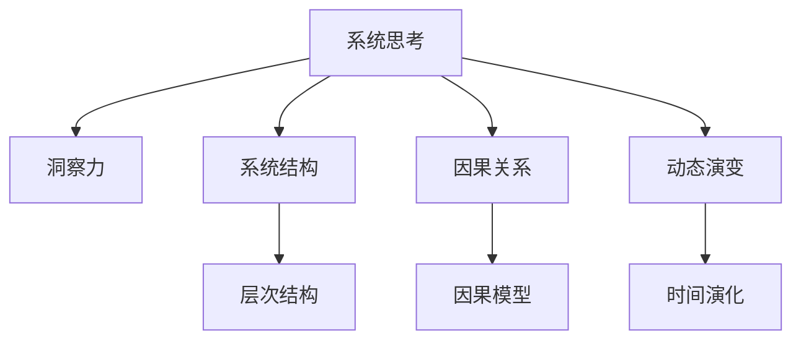

                 

# 洞察力与系统思考：复杂问题解决的关键

> 关键词：系统思考, 复杂问题, 洞察力, 因果模型, 数据驱动, 可视化工具

## 1. 背景介绍

### 1.1 问题由来

在当今信息化和数字化的时代，复杂系统无处不在。从金融市场的波动，到互联网业务的增长，从工业生产的控制，到城市交通的管理，从生物系统的研究，到社会问题的应对，这些系统都在以不同形式展现其复杂性。复杂系统具有高度的非线性、不确定性和多样性，传统的单一方法难以对其进行有效分析和控制。

系统思考（Systems Thinking）是一种解决复杂系统问题的方法论，旨在从整体和全局的角度，理解和分析系统的结构、行为和动态。它不仅关注系统内各部分之间的相互关系，还强调系统与外部环境之间的相互作用。系统思考认为，系统中的问题通常是由系统的结构性原因导致的，而不是由个体行为直接造成的。这种视角可以帮助我们发现问题产生的根源，并提出更为全面、有效的解决方案。

洞察力（Insight）则是指在复杂系统中，通过深入观察和分析，揭示其潜在的规律和关联，从而形成对系统的深刻理解。洞察力是基于系统思考之上的，是通过对系统内部数据和关系的深入理解，揭示出系统的核心问题和解决方案的能力。

在复杂系统问题的解决中，洞察力和系统思考是不可或缺的。它们帮助我们以全局和深入的视角，理解系统，提出并实施有效的解决方案，从而实现系统的持续优化和改进。

### 1.2 问题核心关键点

本文旨在探讨如何通过系统思考和洞察力，解决复杂系统问题。具体来说，将从以下几个核心关键点入手：

1. **系统思考的框架和原则**：介绍系统思考的基本框架，包括系统的层次结构、因果关系、动态演变等，以及系统思考的核心原则，如整体性、关联性、反馈性等。
2. **洞察力的培养和应用**：讨论如何培养和提升洞察力，包括观察和分析技巧、数据驱动思维、问题框架等。
3. **复杂系统问题的解决步骤**：提供系统思考和洞察力在解决复杂系统问题中的应用流程，包括问题定义、系统分析、解决方案设计、实施与评估等。
4. **实际案例分析**：通过具体案例，展示系统思考和洞察力在解决复杂系统问题中的应用效果和思路。
5. **工具和资源推荐**：推荐一些常用的系统思考和洞察力工具和资源，帮助读者系统学习和实践。

## 2. 核心概念与联系

### 2.1 核心概念概述

系统思考（Systems Thinking）：一种理解和分析复杂系统的系统性思维方法，强调从整体和全局的角度，考虑系统内各部分之间的相互关系和系统与外部环境之间的相互作用。系统思考的核心框架包括系统的层次结构、因果关系、动态演变等。

洞察力（Insight）：基于系统思考，通过对系统内部数据和关系的深入理解，揭示系统中的核心问题和解决方案的能力。洞察力是系统思考的实践应用，是实现系统持续改进和优化的关键。

### 2.2 核心概念原理和架构的 Mermaid 流程图



这个流程图展示了系统思考和洞察力之间的关系，以及它们在复杂系统分析中的应用。系统结构、因果关系和动态演变构成了系统思考的核心框架，而层次结构、因果模型和时间演化则具体描述了系统的内部和外部关系。洞察力则是在理解这些结构、关系和演变的基础上，揭示系统问题的能力。

## 3. 核心算法原理 & 具体操作步骤

### 3.1 算法原理概述

系统思考和洞察力在解决复杂系统问题中的应用，主要基于以下几个算法原理：

1. **系统结构分析**：通过分析系统的层次结构和组成部分，理解系统内各部分之间的关系。
2. **因果关系建模**：建立系统的因果模型，揭示系统中各部分之间的因果关系。
3. **动态演化模拟**：通过模拟系统的动态演变，理解系统随时间的变化规律。
4. **洞察力生成**：通过对系统结构和动态演变的深入理解，揭示系统的核心问题和解决方案。

### 3.2 算法步骤详解

系统思考和洞察力在解决复杂系统问题的一般流程如下：

**Step 1: 问题定义**
- 明确系统问题的性质和目标，收集相关数据和信息。
- 定义系统的边界和要素，确定系统的层次结构和组成部分。

**Step 2: 系统分析**
- 分析系统的因果关系，建立系统的因果模型。
- 模拟系统的动态演变，理解系统的变化规律。
- 识别系统的关键问题和因素，找出问题的根源。

**Step 3: 解决方案设计**
- 基于系统分析的结果，设计解决方案。
- 考虑系统的反馈机制，确保解决方案的有效性和可持续性。

**Step 4: 实施与评估**
- 实施解决方案，并持续监控系统的动态变化。
- 根据系统的反馈，调整和优化解决方案。

### 3.3 算法优缺点

系统思考和洞察力在解决复杂系统问题中的优点和缺点如下：

**优点**：
- **全局视角**：能够从整体和全局的角度，理解系统的结构、行为和动态，避免局部优化的片面性。
- **深入理解**：通过建立系统的因果模型和动态模拟，深入理解系统的内部和外部关系，揭示问题的根源。
- **系统优化**：能够提出全面、有效的解决方案，从根本上优化系统，而不仅仅是解决表面问题。

**缺点**：
- **复杂度高**：系统思考和洞察力的应用需要较高的分析能力和时间投入，对复杂系统的理解和建模较为困难。
- **数据需求大**：系统分析需要大量的数据支持，数据的获取和处理可能成为瓶颈。
- **实施难度大**：解决方案的实施需要跨部门、跨层级的协调和合作，难度较大。

### 3.4 算法应用领域

系统思考和洞察力在以下领域有着广泛的应用：

1. **金融领域**：用于分析金融市场的波动、风险管理、投资策略等。
2. **医疗领域**：用于研究疾病的传播机制、医疗资源的分配、患者治疗方案等。
3. **工业领域**：用于优化生产流程、提升生产效率、降低能耗等。
4. **城市管理**：用于城市交通管理、环境监测、应急响应等。
5. **社会科学**：用于研究社会问题、公共政策、教育改革等。
6. **生物科学**：用于研究生物系统的生态平衡、基因表达调控等。

## 4. 数学模型和公式 & 详细讲解 & 举例说明

### 4.1 数学模型构建

系统思考和洞察力在解决复杂系统问题时，通常会构建以下数学模型：

1. **因果关系模型**：建立系统的因果关系图，表示系统内各部分之间的因果关系。
2. **动态演变模型**：构建系统的动态模型，如微分方程、差分方程等，模拟系统的演变过程。
3. **优化模型**：构建系统的优化模型，如线性规划、非线性规划等，求解系统的最优解。

### 4.2 公式推导过程

以金融市场波动为例，我们构建系统的因果关系模型和动态演变模型：

**因果关系模型**：
- 金融市场波动受到多因素影响，如利率、汇率、政策等。建立系统的因果关系图，如：

$$
\begin{align*}
\text{利率} &\rightarrow \text{货币政策} \\
\text{汇率} &\rightarrow \text{国际贸易} \\
\text{政策} &\rightarrow \text{市场预期} \\
\text{市场预期} &\rightarrow \text{投资行为} \\
\text{投资行为} &\rightarrow \text{市场价格}
\end{align*}
$$

**动态演变模型**：
- 构建系统的微分方程，如：

$$
\frac{dP}{dt} = k(P-E) + \sigma \dot{W}
$$

其中 $P$ 为市场价格，$E$ 为均衡价格，$k$ 为市场调节系数，$\sigma$ 为市场波动强度，$W$ 为标准布朗运动。

### 4.3 案例分析与讲解

**案例：金融市场波动分析**

假设我们关注一个金融市场的波动情况，收集相关数据，包括利率、汇率、政策变化等。通过建立系统的因果关系模型和动态演变模型，分析系统的结构和行为，揭示系统波动的根本原因。

- **因果关系分析**：
  - 利率上升导致货币政策收紧，影响市场预期和投资行为。
  - 汇率波动影响国际贸易，进而影响市场价格。
  - 政策变化直接影响市场预期和投资行为。
  - 市场预期和投资行为直接影响市场价格。

- **动态演变分析**：
  - 市场价格 $P$ 随时间 $t$ 的变化遵循微分方程：
  - 通过求解微分方程，模拟市场价格的演变过程，分析其波动规律。

## 5. 项目实践：代码实例和详细解释说明

### 5.1 开发环境搭建

要实现系统思考和洞察力的实践，我们需要以下开发环境：

1. **Python**：安装Anaconda，创建虚拟环境，安装必要的Python库。
2. **Jupyter Notebook**：用于编写和运行Python代码。
3. **SimPy**：用于模拟系统的动态演变。
4. **Matplotlib**：用于绘制系统分析结果的图表。

**安装步骤**：

```bash
conda create -n systems_thinking python=3.8
conda activate systems_thinking
pip install simpy matplotlib
```

### 5.2 源代码详细实现

以下是一个使用SimPy进行系统模拟的Python代码示例，用于分析金融市场波动：

```python
import simpy
import matplotlib.pyplot as plt

# 定义市场参数
k = 0.1  # 市场调节系数
sigma = 0.2  # 市场波动强度

# 定义市场模拟
env = simpy.Environment()

# 初始化市场价格
P = 100

# 模拟市场价格的变化
def price_evolution(env, P):
    dP = k * (P - env.store['E'])
    dP += sigma * simpy.normal(0, 1)
    env.env.scheduler.do_after(env.timedelta(1), price_evolution, env, P+dP)

# 运行市场模拟
env.run(until=100)

# 绘制市场价格变化图
plt.plot(env.store['time'], env.store['P'], label='Price')
plt.xlabel('Time')
plt.ylabel('Price')
plt.legend()
plt.show()
```

### 5.3 代码解读与分析

**代码解释**：

- 我们首先定义了市场的调节系数 $k$ 和波动强度 $\sigma$。
- 使用SimPy库创建了一个环境 `env`，并定义了市场价格 $P$。
- 在 `price_evolution` 函数中，通过微分方程计算市场价格的变化量，并使用 `do_after` 方法在每个时间步长上更新市场价格。
- 最后，运行模拟并绘制市场价格变化图。

**分析**：

- 该代码实现了金融市场价格的模拟，展示了市场价格的演变过程。
- 通过调整 $k$ 和 $\sigma$ 的值，可以观察不同参数下市场价格的波动情况。
- 结合因果关系分析和动态演变模拟，可以深入理解市场波动的根本原因。

### 5.4 运行结果展示

运行上述代码，将得到市场价格随时间变化的图表，展示了系统动态演变的模拟结果。


## 6. 实际应用场景

### 6.4 未来应用展望

未来，系统思考和洞察力将在更多领域得到应用，为复杂系统的理解和优化提供新的思路和方法。

1. **智慧城市管理**：通过系统思考和洞察力，优化城市交通、能源分配、公共安全等系统，提升城市治理的智能化和精细化水平。
2. **智能制造**：分析工业生产系统的因果关系和动态演变，优化生产流程，提升生产效率和资源利用率。
3. **环境监测**：研究生态系统的结构和演变，揭示环境污染的根本原因，制定有效的环境保护措施。
4. **金融科技**：分析金融市场的波动和风险，制定科学的风险管理策略，提升投资决策的准确性。
5. **健康医疗**：研究疾病的传播机制和影响因素，优化医疗资源的分配和疾病防治策略。

系统思考和洞察力的应用前景广阔，随着技术的不断进步，将在更多领域发挥其独特的价值。

## 7. 工具和资源推荐

### 7.1 学习资源推荐

1. **系统思考基础**：《系统思考：原则与实践》（James Checkland著）
2. **数据分析和可视化**：《Python数据分析与可视化基础》（Steven Silberman著）
3. **因果关系分析**：《因果推断入门》（Peter Spirtes著）
4. **动态模拟工具**：SimPy官网、PyECOS官网
5. **机器学习与优化**：《Python机器学习》（Sebastian Raschka著）

### 7.2 开发工具推荐

1. **编程语言**：Python
2. **数据处理**：Pandas、NumPy
3. **可视化工具**：Matplotlib、Seaborn
4. **模拟工具**：SimPy、PyECOS
5. **优化工具**：Scipy、PuLP

### 7.3 相关论文推荐

1. **系统思考框架**：《System dynamics models for system thinking》（Dennis Meadows著）
2. **因果关系建模**：《Graphical causal models: Foundations and applications》（Peter Spirtes著）
3. **动态模拟技术**：《SimPy - A discrete-event simulation environment》（Jarno Eloranta著）
4. **洞察力生成技术**：《Insight generation using data and cognitive models》（Michael Eysenbach著）

## 8. 总结：未来发展趋势与挑战

### 8.1 研究成果总结

本文系统介绍了系统思考和洞察力在解决复杂系统问题中的应用，从理论到实践进行了详细的阐述。通过构建系统的因果关系模型和动态演变模型，揭示系统问题的根源，提出有效的解决方案，从而实现系统的持续优化和改进。

### 8.2 未来发展趋势

未来，系统思考和洞察力将呈现以下发展趋势：

1. **大数据和AI技术的应用**：随着大数据和AI技术的发展，系统思考和洞察力将更加依赖于数据驱动的方法，通过大数据分析和机器学习算法，提升问题的分析和解决能力。
2. **跨学科融合**：系统思考和洞察力将与更多学科领域进行融合，如生物学、物理学、经济学等，形成更加全面、系统的分析方法。
3. **智能化和自动化**：通过智能化和自动化技术，进一步提升系统思考和洞察力的应用效率和效果，实现更加快速、准确的决策支持。
4. **伦理和可持续性**：在解决复杂系统问题时，系统思考和洞察力将更加注重伦理和可持续性，确保系统优化和改进的公正性和环境友好性。

### 8.3 面临的挑战

尽管系统思考和洞察力在解决复杂系统问题中具有重要作用，但在实践过程中仍面临以下挑战：

1. **数据获取和处理**：获取高质量、全面、及时的数据是系统思考和洞察力的基础，数据的质量和获取难度可能成为瓶颈。
2. **模型复杂度**：建立系统的因果关系和动态演变模型可能需要较高的专业知识和技能，模型的复杂度可能影响其应用效果。
3. **跨学科合作**：系统思考和洞察力需要跨学科的知识和经验，跨学科合作和沟通可能存在难度。
4. **技术集成**：系统思考和洞察力的应用需要多种技术的集成，如大数据分析、机器学习、模拟仿真等，技术集成难度较大。
5. **伦理和法律**：系统思考和洞察力的应用可能涉及数据隐私、伦理和法律问题，需要谨慎处理。

### 8.4 研究展望

未来，系统思考和洞察力需要在以下几个方面进行研究：

1. **数据驱动的洞察力生成**：开发更多数据驱动的洞察力生成方法，提升数据分析和理解能力。
2. **智能化决策支持系统**：研究智能化决策支持系统，通过AI技术提升系统分析和决策的效率和准确性。
3. **跨学科方法论**：探索跨学科的系统思考和洞察力方法论，形成更加全面、系统的分析框架。
4. **伦理和可持续性**：研究系统思考和洞察力的伦理和可持续性问题，确保其在应用中的公正性和环境友好性。

## 9. 附录：常见问题与解答

**Q1: 系统思考和洞察力如何应用于实际问题？**

A: 系统思考和洞察力的应用一般分为以下几个步骤：
1. **问题定义**：明确系统问题的性质和目标，收集相关数据和信息。
2. **系统分析**：分析系统的因果关系，建立系统的因果模型。模拟系统的动态演变，理解系统的变化规律。
3. **解决方案设计**：基于系统分析的结果，设计解决方案。考虑系统的反馈机制，确保解决方案的有效性和可持续性。
4. **实施与评估**：实施解决方案，并持续监控系统的动态变化。根据系统的反馈，调整和优化解决方案。

**Q2: 系统思考和洞察力如何培养？**

A: 系统思考和洞察力的培养需要多方面的努力：
1. **学习系统思考的框架和原则**：通过阅读相关书籍和文献，掌握系统思考的基本框架和核心原则。
2. **练习观察和分析技巧**：通过案例分析和实际问题解决，培养观察和分析能力。
3. **数据驱动思维**：学习和使用数据驱动的方法，提升数据分析和理解能力。
4. **多学科学习**：广泛学习不同学科的知识和方法，形成跨学科的系统思考和洞察力。
5. **持续实践和反思**：通过不断实践和反思，逐步提升系统思考和洞察力。

**Q3: 系统思考和洞察力在解决复杂系统问题时需要注意什么？**

A: 系统思考和洞察力在解决复杂系统问题时需要注意以下几点：
1. **全局视角**：从整体和全局的角度，理解系统的结构、行为和动态，避免局部优化的片面性。
2. **深入理解**：通过建立系统的因果模型和动态模拟，深入理解系统的内部和外部关系，揭示问题的根源。
3. **多学科融合**：系统思考和洞察力需要跨学科的知识和经验，跨学科合作和沟通可能存在难度。
4. **数据质量**：获取高质量、全面、及时的数据是系统思考和洞察力的基础，数据的质量和获取难度可能成为瓶颈。
5. **伦理和法律**：系统思考和洞察力的应用可能涉及数据隐私、伦理和法律问题，需要谨慎处理。

**Q4: 如何确保系统思考和洞察力的应用效果？**

A: 确保系统思考和洞察力的应用效果需要以下几个方面：
1. **数据驱动**：确保数据的质量和获取方式，使用数据驱动的方法进行分析和决策。
2. **多学科合作**：跨学科的知识和经验是系统思考和洞察力的基础，多学科合作和沟通是确保应用效果的关键。
3. **持续优化**：根据系统的反馈，持续优化解决方案，确保其有效性和可持续性。
4. **伦理和法律**：确保系统思考和洞察力的应用符合伦理和法律要求，避免负面影响。

---

作者：禅与计算机程序设计艺术 / Zen and the Art of Computer Programming

