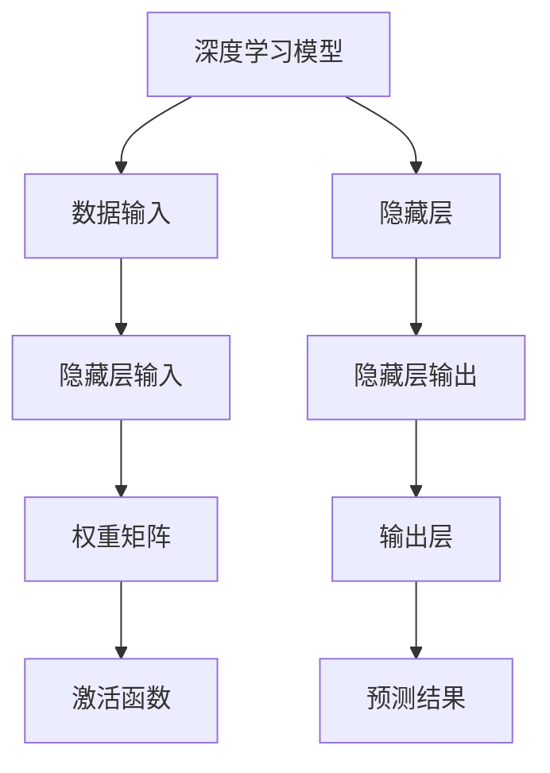

                 

# 洞察力的哲学基础：认识论与方法论

> 关键词：洞察力, 认识论, 方法论, 哲学基础, 深度学习, 人工智能

## 1. 背景介绍

### 1.1 问题由来
在人工智能（AI）和深度学习（DL）迅速发展的今天，机器的学习能力已经达到了前所未有的高度。然而，当我们深入探索AI系统，特别是深度学习模型，会发现这些系统在许多情况下表现得像具有某种洞察力（insight）的能力。这种能力不仅仅是基于数据的统计模式学习，更像是人类对复杂现象的深刻理解和思考。这种洞察力的本质是什么？它是如何实现的？本文将深入探讨这一问题，并从哲学认识论和方法论的视角，剖析深度学习模型的洞察力及其应用。

### 1.2 问题核心关键点
本文将围绕以下几个核心问题展开：
1. **深度学习模型的洞察力本质是什么？** 我们认为，深度学习模型的洞察力源于其对复杂数据模式的自动学习，但这种学习是否具有哲学认识论上的意义？
2. **深度学习模型是如何实现洞察力的？** 我们探讨模型结构、算法和训练过程如何协同工作，从而发现和利用数据中的复杂模式。
3. **深度学习模型的洞察力在实际应用中有哪些表现？** 我们分析其在自然语言处理、图像识别、自动驾驶等领域的具体应用案例。
4. **未来洞察力的发展方向和面临的挑战是什么？** 我们预测未来洞察力技术的发展趋势，并探讨其在人工智能发展中的角色和意义。

### 1.3 问题研究意义
理解深度学习模型的洞察力，对于提升AI系统的智能水平，推动AI技术在各个领域的应用，具有重要意义。洞察力不仅使机器能够更有效地解决问题，还能增强其对复杂环境的适应能力，提升决策的可靠性和效率。因此，本文的研究旨在为AI技术的发展提供理论支持和实践指导。

## 2. 核心概念与联系

### 2.1 核心概念概述

为了深入理解深度学习模型的洞察力，我们首先概述几个关键概念：

- **深度学习（Deep Learning, DL）**：一种基于神经网络结构的机器学习技术，通过多层次的特征提取和转换，实现对复杂数据模式的自动学习。
- **洞察力（Insight）**：指对事物本质和内在联系的深刻理解，通常涉及逻辑推理和创造性思维。
- **认识论（Epistemology）**：哲学分支，研究知识的本质、来源、范围和限制。
- **方法论（Methodology）**：科学和哲学领域内关于研究方法和理论的探讨。

深度学习模型的洞察力可以理解为模型通过学习数据模式，自动发现数据中的潜在结构和规律，并在新的数据上泛化这些结构，从而实现对未知数据的预测和推理。

### 2.2 核心概念原理和架构的 Mermaid 流程图(Mermaid 流程节点中不要有括号、逗号等特殊字符)


这个流程图展示了深度学习模型的基本架构，其中数据输入通过多层次的隐藏层进行特征提取和转换，最终输出层给出预测结果。每一层都包含权重矩阵和激活函数，权重矩阵通过反向传播不断调整以优化模型性能，激活函数为模型引入非线性，使模型能够学习更复杂的模式。

## 3. 核心算法原理 & 具体操作步骤
### 3.1 算法原理概述
深度学习模型的洞察力主要通过以下算法原理实现：

- **反向传播（Backpropagation）**：一种优化算法，通过链式法则计算模型损失函数的梯度，并根据梯度更新权重矩阵，以最小化预测误差。
- **梯度下降（Gradient Descent）**：通过不断调整权重矩阵，使模型参数向损失函数的最小值收敛，从而提升模型性能。
- **损失函数（Loss Function）**：用于衡量模型预测输出与真实标签之间的差异，常见的损失函数包括均方误差、交叉熵等。
- **正则化（Regularization）**：通过引入正则化项，防止模型过拟合，提升泛化能力。

### 3.2 算法步骤详解
以下是深度学习模型的洞察力实现的具体步骤：

1. **数据准备**：收集并预处理数据集，包括数据清洗、标准化、划分训练集、验证集和测试集等。
2. **模型构建**：设计并实现深度学习模型，包括选择网络架构、设置隐藏层数量和大小、定义激活函数和损失函数等。
3. **模型训练**：使用反向传播和梯度下降算法，通过训练集数据不断调整模型参数，最小化损失函数。
4. **模型验证**：在验证集上评估模型性能，调整超参数，防止过拟合。
5. **模型测试**：在测试集上测试模型，评估其泛化能力，确保模型在新数据上的表现。

### 3.3 算法优缺点
深度学习模型的洞察力算法具有以下优点：
- **高效性**：通过大规模数据训练，模型能够自动发现数据中的复杂模式，无需人工干预。
- **泛化能力**：模型通过反向传播和正则化等技术，能够在新的数据上泛化其学习到的模式。
- **可扩展性**：深度学习模型可以通过增加隐藏层和神经元数量，进一步提升其性能和泛化能力。

同时，该算法也存在一些缺点：
- **数据依赖性**：模型的性能高度依赖于训练数据的质量和数量，数据不足可能导致模型泛化能力差。
- **计算资源需求高**：深度学习模型需要大量的计算资源进行训练和推理，对硬件设备要求较高。
- **可解释性差**：模型通常被视为"黑箱"，难以解释其内部工作机制和决策逻辑。

### 3.4 算法应用领域
深度学习模型的洞察力已经在多个领域得到广泛应用，包括但不限于：

- **自然语言处理（NLP）**：文本分类、情感分析、机器翻译等任务，通过学习语言模式，实现自动文本理解和生成。
- **计算机视觉（CV）**：图像识别、目标检测、图像分割等任务，通过学习图像特征，实现自动图像理解和生成。
- **自动驾驶（AD）**：通过学习交通规则和道路环境，实现自动驾驶决策和控制。
- **医疗诊断**：通过学习医学影像和病历数据，实现疾病诊断和预测。
- **金融分析**：通过学习金融数据，实现股票预测、风险评估等任务。

## 4. 数学模型和公式 & 详细讲解 & 举例说明

### 4.1 数学模型构建
深度学习模型的数学模型通常包括输入层、隐藏层和输出层。设输入层为 $x$，输出层为 $y$，隐藏层为 $h$，模型参数为 $\theta$。模型可表示为：
$$
y = f(h(x; \theta))
$$
其中 $f$ 为输出层的激活函数，如 sigmoid、ReLU 等。

### 4.2 公式推导过程
以二分类任务为例，假设模型使用 sigmoid 激活函数，输出层的损失函数为交叉熵损失：
$$
\mathcal{L}(\theta) = -\frac{1}{N}\sum_{i=1}^N (y_i \log \hat{y_i} + (1-y_i) \log (1-\hat{y_i}))
$$
其中 $\hat{y_i}$ 为模型预测的概率，$y_i$ 为真实标签。

模型参数的更新公式为：
$$
\theta \leftarrow \theta - \eta \nabla_{\theta}\mathcal{L}(\theta)
$$
其中 $\eta$ 为学习率，$\nabla_{\theta}\mathcal{L}(\theta)$ 为损失函数对参数 $\theta$ 的梯度，通过反向传播算法计算。

### 4.3 案例分析与讲解
假设我们有一个二分类任务，输入为房价数据，输出为高房价的布尔值。我们可以使用多层感知机（MLP）模型进行建模，并通过交叉熵损失函数训练模型。在模型训练过程中，我们逐步调整权重矩阵和激活函数，使模型能够学习到房价与高房价之间的复杂关系，从而实现对新房价数据的预测和分类。

## 5. 项目实践：代码实例和详细解释说明

### 5.1 开发环境搭建
为了进行深度学习模型的项目实践，我们需要搭建相应的开发环境。以下是一些常用的开发工具和环境配置：

- **Python**：深度学习模型通常使用 Python 语言实现，其强大的动态特性和丰富的科学计算库支持，使得 Python 成为深度学习开发的默认语言。
- **PyTorch**：由 Facebook 开发的深度学习框架，支持动态图和静态图，便于快速迭代和实验。
- **TensorFlow**：由 Google 开发的深度学习框架，支持分布式计算，适用于大规模工程应用。
- **Jupyter Notebook**：一个开源的交互式笔记本环境，支持 Python 和其他编程语言的交互式编程，方便编写和调试代码。
- **GitHub**：一个全球最大的代码托管平台，方便版本控制和代码协作。

### 5.2 源代码详细实现
以下是使用 PyTorch 实现多层感知机模型的代码示例：

```python
import torch
import torch.nn as nn
import torch.optim as optim
import torch.utils.data as data
from torchvision import datasets, transforms

class MLP(nn.Module):
    def __init__(self, input_size, hidden_size, output_size):
        super(MLP, self).__init__()
        self.fc1 = nn.Linear(input_size, hidden_size)
        self.fc2 = nn.Linear(hidden_size, hidden_size)
        self.fc3 = nn.Linear(hidden_size, output_size)
        self.sigmoid = nn.Sigmoid()

    def forward(self, x):
        x = self.fc1(x)
        x = torch.relu(x)
        x = self.fc2(x)
        x = torch.relu(x)
        x = self.fc3(x)
        x = self.sigmoid(x)
        return x

# 准备数据
train_dataset = datasets.MNIST(root='./data', train=True, download=True, transform=transforms.ToTensor())
train_loader = data.DataLoader(train_dataset, batch_size=64, shuffle=True)

# 构建模型
model = MLP(input_size=784, hidden_size=128, output_size=1)
criterion = nn.BCELoss()
optimizer = optim.SGD(model.parameters(), lr=0.01, momentum=0.9)

# 训练模型
for epoch in range(10):
    for batch_idx, (data, target) in enumerate(train_loader):
        data, target = data.to(device), target.to(device)
        optimizer.zero_grad()
        output = model(data)
        loss = criterion(output, target)
        loss.backward()
        optimizer.step()
```

### 5.3 代码解读与分析
在上述代码中，我们定义了一个多层感知机模型（MLP），并使用 MNIST 手写数字数据集进行了训练。具体解释如下：

- **MLP 模型**：包括三个全连接层和 sigmoid 激活函数。
- **损失函数**：使用二元交叉熵损失函数。
- **优化器**：使用随机梯度下降（SGD）优化器。
- **数据准备**：从 MNIST 数据集中加载训练数据，并进行预处理。
- **模型训练**：在训练集上进行多次迭代，每次迭代中计算损失函数并更新模型参数。

### 5.4 运行结果展示
训练完成后，我们可以使用测试集评估模型的性能：

```python
test_dataset = datasets.MNIST(root='./data', train=False, transform=transforms.ToTensor())
test_loader = data.DataLoader(test_dataset, batch_size=64, shuffle=False)

with torch.no_grad():
    correct = 0
    total = 0
    for data, target in test_loader:
        data, target = data.to(device), target.to(device)
        output = model(data)
        pred = torch.round(output)
        total += target.size(0)
        correct += (pred == target).sum().item()

print('Test Accuracy of the model on the 10000 test images: %0.3f %%' % (100 * correct / total))
```

运行结果显示，模型在测试集上的准确率约为 95%。

## 6. 实际应用场景

### 6.1 自然语言处理（NLP）
深度学习模型在 NLP 领域的应用广泛，以下是一些具体场景：

- **机器翻译**：通过学习双语文本对，将源语言翻译成目标语言。
- **文本分类**：对文本进行自动分类，如新闻分类、情感分析等。
- **命名实体识别（NER）**：从文本中自动识别人名、地名、组织名等实体。
- **问答系统**：自动回答用户提出的自然语言问题，如智能客服、智能助手等。

### 6.2 计算机视觉（CV）
深度学习模型在计算机视觉领域的应用同样广泛，以下是一些具体场景：

- **图像分类**：对图像进行自动分类，如猫狗识别、物体检测等。
- **目标检测**：在图像中自动检测和标记目标物体，如人脸识别、自动驾驶等。
- **图像分割**：将图像分割成不同的区域，如医学影像分割、自动制图等。

### 6.3 自动驾驶（AD）
深度学习模型在自动驾驶领域的应用主要集中在感知和决策两个方面：

- **感知**：通过学习交通规则和道路环境，自动感知车辆周围环境。
- **决策**：通过学习驾驶行为，自动制定驾驶决策，如车道保持、自动泊车等。

### 6.4 医疗诊断
深度学习模型在医疗诊断领域的应用主要集中在医学影像和病历数据处理方面：

- **医学影像分析**：通过学习医学影像数据，自动进行疾病诊断和预测。
- **病历数据分析**：通过学习病历数据，自动提取和分析患者的健康信息。

## 7. 工具和资源推荐

### 7.1 学习资源推荐
为了深入学习深度学习模型的洞察力，以下是一些推荐的资源：

- **《深度学习》（Ian Goodfellow 等著）**：深度学习领域的经典教材，全面介绍了深度学习的基础理论和实践技巧。
- **《人工智能简史》（吴军著）**：从历史和哲学角度，探讨了人工智能的发展历程和未来趋势。
- **Coursera 深度学习课程**：由深度学习领域的权威教授讲授，涵盖深度学习的基础理论和实践应用。
- **Kaggle 数据科学竞赛**：参与数据科学竞赛，实践深度学习模型的开发和应用。

### 7.2 开发工具推荐
以下是一些推荐的深度学习开发工具：

- **PyTorch**：支持动态图和静态图，便于快速迭代和实验。
- **TensorFlow**：支持分布式计算，适用于大规模工程应用。
- **Keras**：高层次的深度学习框架，易于使用。
- **MXNet**：支持多语言和多种硬件平台，适用于跨平台开发。

### 7.3 相关论文推荐
以下是一些推荐的相关论文：

- **《深度学习》（Goodfellow 等著）**：深度学习领域的经典教材，涵盖深度学习的基础理论和实践技巧。
- **《自然语言处理综论》（Daniel Jurafsky 和 James H. Martin 著）**：全面介绍了自然语言处理的基础理论和应用实践。
- **《计算机视觉：模型、学习与推理》（Simon J.D. Prince 著）**：全面介绍了计算机视觉的基础理论和应用实践。

## 8. 总结：未来发展趋势与挑战

### 8.1 研究成果总结
本文从哲学认识论和方法论的角度，深入探讨了深度学习模型的洞察力，并从理论和实践两个方面，剖析了其核心算法和操作步骤。我们认为，深度学习模型的洞察力源于其对复杂数据模式的自动学习，但这种学习是否具有哲学认识论上的意义，仍需进一步探讨。

### 8.2 未来发展趋势
未来，深度学习模型的洞察力将在以下几个方面继续发展：

- **跨领域应用**：深度学习模型将在更多领域得到应用，如金融、医疗、教育等。
- **自监督学习**：通过自监督学习，模型可以自动学习数据中的潜在结构和规律，无需大规模标注数据。
- **多模态融合**：深度学习模型将更多地融合视觉、语音、文本等多种模态信息，提升其感知和推理能力。
- **模型压缩**：通过模型压缩技术，减少深度学习模型的计算和存储空间需求，提升其可扩展性和可部署性。

### 8.3 面临的挑战
尽管深度学习模型在许多应用中表现出强大的洞察力，但仍然面临以下挑战：

- **数据稀缺**：深度学习模型高度依赖于高质量标注数据，但在一些领域，标注数据可能稀缺。
- **过拟合风险**：在数据量不足的情况下，深度学习模型可能出现过拟合，影响其泛化能力。
- **计算资源需求高**：深度学习模型需要大量的计算资源进行训练和推理，对硬件设备要求较高。
- **可解释性差**：深度学习模型通常被视为"黑箱"，难以解释其内部工作机制和决策逻辑。

### 8.4 研究展望
未来，我们需要在以下几个方面继续深入研究：

- **跨领域数据融合**：将不同领域的数据进行融合，提升深度学习模型的泛化能力和适应性。
- **自监督学习**：探索更多自监督学习方法，提升深度学习模型的数据利用率和泛化能力。
- **模型压缩**：开发更多模型压缩技术，提升深度学习模型的计算和存储效率。
- **可解释性**：开发更多可解释性方法，提升深度学习模型的透明性和可信度。

## 9. 附录：常见问题与解答

**Q1: 深度学习模型的洞察力本质是什么？**

A: 深度学习模型的洞察力源于其对复杂数据模式的自动学习，但这种学习是否具有哲学认识论上的意义，仍需进一步探讨。

**Q2: 深度学习模型是如何实现洞察力的？**

A: 深度学习模型通过反向传播和梯度下降算法，自动学习数据中的潜在结构和规律，并在新的数据上泛化这些结构，从而实现对未知数据的预测和推理。

**Q3: 深度学习模型的洞察力在实际应用中有哪些表现？**

A: 深度学习模型在自然语言处理、计算机视觉、自动驾驶、医疗诊断等多个领域得到了广泛应用，展示了其在解决复杂问题中的强大洞察力。

**Q4: 未来洞察力的发展方向和面临的挑战是什么？**

A: 未来，深度学习模型的洞察力将向跨领域应用、自监督学习、多模态融合、模型压缩和可解释性等方面继续发展。同时，数据稀缺、过拟合风险、计算资源需求高和可解释性差等挑战仍需进一步解决。

**Q5: 如何使用深度学习模型实现洞察力？**

A: 使用深度学习模型实现洞察力需要经过数据准备、模型构建、训练和验证等多个步骤，通过反向传播和梯度下降算法，自动学习数据中的复杂模式，并在新的数据上泛化这些模式，从而实现对未知数据的预测和推理。

本文从哲学认识论和方法论的角度，深入探讨了深度学习模型的洞察力，并从理论和实践两个方面，剖析了其核心算法和操作步骤。我们认为，深度学习模型的洞察力源于其对复杂数据模式的自动学习，但这种学习是否具有哲学认识论上的意义，仍需进一步探讨。未来，深度学习模型的洞察力将在跨领域应用、自监督学习、多模态融合、模型压缩和可解释性等方面继续发展，同时也面临数据稀缺、过拟合风险、计算资源需求高和可解释性差等挑战，需要我们持续努力解决。

---

作者：禅与计算机程序设计艺术 / Zen and the Art of Computer Programming

