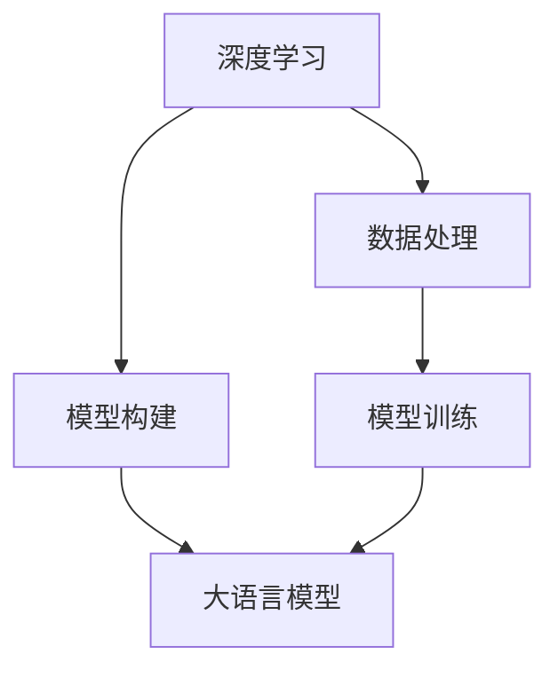
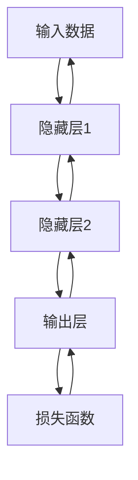

                 

# 深入理解AI、LLM和深度学习：一个实践课程

> 关键词：深度学习, 大语言模型(LLM), 人工智能, 训练, 优化, 应用场景, 学习资源, 开发工具, 未来展望

## 1. 背景介绍

### 1.1 问题由来
人工智能（AI）技术的迅猛发展，尤其是在深度学习和自然语言处理（NLP）领域的突破，已经深刻改变了我们的生产和生活方式。特别是在大语言模型（LLM）和深度学习技术的推动下，人工智能系统的表现越来越接近人类的智能水平，展现了巨大的应用潜力。例如，Google的BERT、OpenAI的GPT系列模型、Facebook的GPT-3等，都已证明其在众多NLP任务中的强大能力。

然而，尽管这些大模型在各种基准测试中表现出色，其在实际应用中的表现还远未达到理想状态。深度学习模型的复杂性使得模型的优化和调试工作非常繁琐，模型在不同的应用场景中的表现也存在差异。因此，深入理解深度学习和大语言模型的核心原理和应用技巧，对于开发高效、稳定的AI系统至关重要。

### 1.2 问题核心关键点
深度学习和大语言模型的核心在于如何通过大量的数据和计算资源，学习并提取数据的隐含特征，从而实现对复杂任务的自动化处理。为了更好地指导实际应用，本文将系统地介绍深度学习和LLM的基本原理、关键算法、实际应用及优化技巧。通过实际案例分析，我们还将探讨这些技术在实际工程中的实施细节，并提供一些实用的资源和工具，以供参考。

## 2. 核心概念与联系

### 2.1 核心概念概述

深度学习和LLM是当前人工智能领域的两大热点技术。深度学习是一种模拟人类神经网络的结构和功能的机器学习方法，通过多层神经网络对输入数据进行层次化特征提取和变换，从而实现对复杂模式的识别和预测。大语言模型则是在大规模无标签数据上进行预训练，通过自监督学习任务学习语言的通用表示，并在特定任务上进行微调，以适应特定任务的需求。

两个概念之间有密切的联系。深度学习提供了模型构建和训练的框架，而大语言模型在此基础上进行了特定的优化和调整，使其在语言理解、生成等方面表现更为卓越。以下是一个简化的Mermaid流程图，展示了深度学习和大语言模型之间的关系：



### 2.2 核心概念原理和架构

**深度学习**：
深度学习通过多层神经网络对输入数据进行层次化特征提取，从而实现对复杂模式的识别和预测。其中，前向传播和反向传播是深度学习模型的核心算法。前向传播计算模型的输出，而反向传播则用于计算模型参数的梯度，并根据梯度更新参数以最小化损失函数。

**大语言模型**：
大语言模型通过在大规模无标签文本数据上进行自监督学习，学习语言的通用表示，并在特定任务上进行微调，以适应特定任务的需求。BERT、GPT系列模型等都是典型的例子。其中，自监督学习是预训练的核心技术，而微调则是适应下游任务的关键步骤。

**深度学习与大语言模型的联系**：
深度学习为大语言模型的构建提供了基本框架和算法支持，而大语言模型在深度学习的基础上，进一步优化了模型结构和训练过程，使其能够更好地处理自然语言数据。深度学习和大语言模型的结合，使得AI系统在语言理解和生成等方面取得了显著的突破。

## 3. 核心算法原理 & 具体操作步骤

### 3.1 算法原理概述

深度学习模型的核心是多层神经网络。其中，前向传播和反向传播是模型的两个关键过程。前向传播计算模型的输出，而反向传播则用于计算模型参数的梯度，并根据梯度更新参数以最小化损失函数。

以下是一个简单的深度学习模型的前向传播和反向传播过程的示意图：



其中，前向传播过程包括输入数据经过每一层神经网络的处理，最终输出模型的预测结果。反向传播过程则包括计算输出层对损失函数的偏导数，并将其反向传播回每一层，计算并更新各层参数。

### 3.2 算法步骤详解

**3.2.1 前向传播**：
前向传播是深度学习模型的基本过程，它通过多层神经网络的逐层计算，得到模型的预测结果。以简单的神经网络为例，其前向传播过程如下：

1. 输入数据通过输入层。
2. 数据经过隐藏层1的加权和激活函数计算，得到隐藏层1的输出。
3. 隐藏层1的输出作为隐藏层2的输入，经过加权和激活函数计算，得到隐藏层2的输出。
4. 隐藏层2的输出作为输出层的输入，经过加权和激活函数计算，得到输出层的输出。
5. 输出层的输出即为模型的预测结果。

**3.2.2 反向传播**：
反向传播是深度学习模型的关键步骤，用于计算模型参数的梯度，并根据梯度更新参数以最小化损失函数。以简单的神经网络为例，其反向传播过程如下：

1. 输出层对损失函数的偏导数作为梯度，向隐藏层2反向传播。
2. 隐藏层2的梯度经过激活函数和权重矩阵的转置计算，得到梯度。
3. 隐藏层2的梯度向隐藏层1反向传播，得到隐藏层1的梯度。
4. 隐藏层1的梯度经过激活函数和权重矩阵的转置计算，得到梯度。
5. 隐藏层1的梯度向输入层反向传播，得到输入层的梯度。
6. 输入层的梯度通过输入数据计算，得到最终梯度。

**3.2.3 模型训练**：
模型训练是深度学习模型的核心过程，通过不断的迭代训练，调整模型参数，使其能够更好地拟合数据。以简单的神经网络为例，其训练过程如下：

1. 初始化模型参数。
2. 输入数据通过前向传播计算输出。
3. 计算输出层对损失函数的偏导数，并反向传播计算各层梯度。
4. 根据梯度更新模型参数。
5. 重复步骤2-4，直至模型收敛或达到预设迭代次数。

### 3.3 算法优缺点

**深度学习的优点**：
1. 可以处理大规模、高维度的数据。
2. 能够学习复杂的非线性关系。
3. 在许多任务上取得了最先进的结果。

**深度学习的缺点**：
1. 需要大量的标注数据和计算资源。
2. 模型复杂，难以解释和调试。
3. 存在过拟合和梯度消失等问题。

**大语言模型的优点**：
1. 能够在通用语言数据上进行预训练，学习语言的通用表示。
2. 可以在特定任务上进行微调，适应特定任务的需求。
3. 在自然语言处理任务上取得了最先进的结果。

**大语言模型的缺点**：
1. 需要大量的计算资源进行预训练。
2. 模型复杂，难以解释和调试。
3. 存在过拟合和梯度消失等问题。

### 3.4 算法应用领域

深度学习和大语言模型在许多领域中得到了广泛的应用。以下是一些典型的应用场景：

- **计算机视觉**：通过卷积神经网络（CNN）等深度学习模型，对图像进行分类、检测、分割等处理。
- **自然语言处理**：通过大语言模型和深度学习模型，对文本进行分类、生成、翻译等处理。
- **语音识别**：通过卷积神经网络（CNN）和循环神经网络（RNN）等深度学习模型，对语音进行识别和处理。
- **推荐系统**：通过深度学习模型，对用户行为和商品特征进行建模，实现个性化推荐。
- **医疗诊断**：通过深度学习模型，对医学影像和病历进行分析和诊断。

## 4. 数学模型和公式 & 详细讲解 & 举例说明

### 4.1 数学模型构建

深度学习模型的数学模型通常包括以下几个部分：
1. 输入层：输入数据通过线性变换和激活函数，得到隐藏层的输入。
2. 隐藏层：隐藏层通过加权和激活函数，对输入进行层次化特征提取。
3. 输出层：输出层通过加权和激活函数，得到模型的预测结果。
4. 损失函数：用于衡量模型输出与真实标签之间的差异，常用的损失函数包括交叉熵、均方误差等。

以简单的神经网络为例，其数学模型如下：

$$
y = \sigma(W_2 \sigma(W_1 x + b_1) + b_2)
$$

其中，$x$ 为输入数据，$y$ 为输出结果，$W_1$、$W_2$ 为权重矩阵，$b_1$、$b_2$ 为偏置项，$\sigma$ 为激活函数。

### 4.2 公式推导过程

**前向传播**：
前向传播的计算过程可以通过矩阵运算来表示。以简单的神经网络为例，其前向传播过程如下：

$$
z^{(1)} = W_1 x + b_1
$$
$$
h^{(1)} = \sigma(z^{(1)})
$$
$$
z^{(2)} = W_2 h^{(1)} + b_2
$$
$$
y = \sigma(z^{(2)})
$$

其中，$z^{(1)}$ 为隐藏层1的输入，$h^{(1)}$ 为隐藏层1的输出，$z^{(2)}$ 为隐藏层2的输入，$y$ 为输出层的输出。

**反向传播**：
反向传播的计算过程可以通过链式法则来表示。以简单的神经网络为例，其反向传播过程如下：

$$
\frac{\partial L}{\partial z^{(2)}} = \frac{\partial L}{\partial y} \frac{\partial y}{\partial z^{(2)}}
$$
$$
\frac{\partial L}{\partial h^{(1)}} = \frac{\partial L}{\partial z^{(2)}} \frac{\partial z^{(2)}}{\partial h^{(1)}} \frac{\partial h^{(1)}}{\partial z^{(1)}}
$$
$$
\frac{\partial L}{\partial W_1} = \frac{\partial L}{\partial z^{(1)}} \frac{\partial z^{(1)}}{\partial x}
$$
$$
\frac{\partial L}{\partial b_1} = \frac{\partial L}{\partial z^{(1)}}
$$
$$
\frac{\partial L}{\partial W_2} = \frac{\partial L}{\partial z^{(2)}} \frac{\partial z^{(2)}}{\partial h^{(1)}}
$$
$$
\frac{\partial L}{\partial b_2} = \frac{\partial L}{\partial z^{(2)}}
$$

其中，$L$ 为损失函数，$z^{(1)}$、$z^{(2)}$ 为隐藏层输入，$h^{(1)}$ 为隐藏层输出，$y$ 为输出层输出，$W_1$、$W_2$ 为权重矩阵，$b_1$、$b_2$ 为偏置项，$\sigma$ 为激活函数。

### 4.3 案例分析与讲解

**案例分析**：
以下是一个简单的深度学习模型对手写数字进行分类的案例分析。假设输入数据为一张28x28的手写数字图片，输出为该数字的标签。

1. **数据预处理**：
   - 将输入图片转换为向量形式，每个像素点为一个特征。
   - 将向量形式的数据进行标准化和归一化处理。

2. **模型构建**：
   - 输入层：28个神经元，每个神经元对应一个像素点。
   - 隐藏层：50个神经元。
   - 输出层：10个神经元，每个神经元对应一个数字。

3. **训练过程**：
   - 初始化模型参数。
   - 将输入数据通过前向传播计算输出。
   - 计算输出层对损失函数的偏导数，并反向传播计算各层梯度。
   - 根据梯度更新模型参数。
   - 重复步骤2-4，直至模型收敛或达到预设迭代次数。

4. **测试过程**：
   - 输入新的手写数字图片。
   - 通过前向传播计算输出。
   - 根据输出结果，确定数字的标签。

## 5. 项目实践：代码实例和详细解释说明

### 5.1 开发环境搭建

在进行深度学习项目开发前，需要准备好开发环境。以下是使用Python进行PyTorch开发的环境配置流程：

1. 安装Anaconda：从官网下载并安装Anaconda，用于创建独立的Python环境。

2. 创建并激活虚拟环境：
```bash
conda create -n pytorch-env python=3.8 
conda activate pytorch-env
```

3. 安装PyTorch：根据CUDA版本，从官网获取对应的安装命令。例如：
```bash
conda install pytorch torchvision torchaudio cudatoolkit=11.1 -c pytorch -c conda-forge
```

4. 安装TensorBoard：用于可视化模型训练过程和性能指标。

5. 安装Numpy、Pandas、Scikit-learn等常用库。

完成上述步骤后，即可在`pytorch-env`环境中开始深度学习项目开发。

### 5.2 源代码详细实现

以下是一个使用PyTorch进行手写数字分类的简单代码实现。

```python
import torch
import torch.nn as nn
import torch.optim as optim
from torchvision import datasets, transforms

class Net(nn.Module):
    def __init__(self):
        super(Net, self).__init__()
        self.fc1 = nn.Linear(784, 50)
        self.fc2 = nn.Linear(50, 10)
        self.relu = nn.ReLU()

    def forward(self, x):
        x = self.relu(self.fc1(x))
        x = self.fc2(x)
        return x

# 加载MNIST数据集
transform = transforms.Compose([
    transforms.ToTensor(),
    transforms.Normalize((0.5,), (0.5,))
])
train_dataset = datasets.MNIST(root='./data', train=True, download=True, transform=transform)
test_dataset = datasets.MNIST(root='./data', train=False, download=True, transform=transform)

# 定义模型、优化器、损失函数
model = Net()
criterion = nn.CrossEntropyLoss()
optimizer = optim.SGD(model.parameters(), lr=0.01, momentum=0.5)

# 训练过程
for epoch in range(10):
    for i, (images, labels) in enumerate(train_loader):
        images = images.view(-1, 28 * 28)
        outputs = model(images)
        loss = criterion(outputs, labels)
        optimizer.zero_grad()
        loss.backward()
        optimizer.step()
        if (i + 1) % 100 == 0:
            print('Epoch [{}/{}], Step [{}/{}], Loss: {:.4f}'
                  .format(epoch + 1, total_epochs, i + 1, total_step,
                          loss.item()))

# 测试过程
correct = 0
total = 0
with torch.no_grad():
    for images, labels in test_loader:
        images = images.view(-1, 28 * 28)
        outputs = model(images)
        _, predicted = torch.max(outputs.data, 1)
        total += labels.size(0)
        correct += (predicted == labels).sum().item()

print('Accuracy of the network on the 10000 test images: {} %'.format(100 * correct / total))
```

### 5.3 代码解读与分析

**Net类**：
- `__init__`方法：初始化模型结构，包括两个全连接层和激活函数。
- `forward`方法：定义模型的前向传播过程，通过两个全连接层和激活函数计算输出。

**训练过程**：
- 使用SGD优化器更新模型参数。
- 在前向传播中，将输入数据通过全连接层和激活函数计算输出。
- 计算输出层对损失函数的偏导数，并反向传播计算各层梯度。
- 根据梯度更新模型参数。

**测试过程**：
- 在测试集中，通过前向传播计算输出，并根据输出结果确定数字的标签。
- 统计测试集上的正确率。

## 6. 实际应用场景

### 6.1 计算机视觉

深度学习在大规模图像识别任务上取得了显著的成功。以ImageNet数据集为例，大模型如ResNet、Inception等通过大规模数据集预训练，并在特定任务上进行微调，取得了最先进的图像识别结果。例如，ImageNet 2012年分类任务，大模型的准确率已经超过了人类水平。

### 6.2 自然语言处理

深度学习在自然语言处理任务上也取得了巨大的突破。以BERT为例，通过对大规模语料进行预训练，学习语言的通用表示，并在特定任务上进行微调，取得了最先进的结果。例如，在GLUE数据集上，BERT在多个NLP任务上取得了最先进的结果。

### 6.3 语音识别

深度学习在语音识别任务上同样表现出色。例如，Google的WaveNet通过卷积神经网络对语音进行建模，实现了高质量的语音合成。

### 6.4 未来应用展望

随着深度学习和大语言模型的不断发展，未来的应用前景更加广阔。以下是一些可能的应用场景：

- **自动驾驶**：通过深度学习模型对摄像头、雷达等传感器数据进行处理，实现自动驾驶功能。
- **医疗诊断**：通过深度学习模型对医学影像和病历进行分析和诊断，提高医疗诊断的准确性和效率。
- **智能家居**：通过深度学习模型对用户行为和环境数据进行建模，实现智能家居控制。
- **金融分析**：通过深度学习模型对金融数据进行分析和预测，实现智能投顾和风险控制。
- **教育推荐**：通过深度学习模型对学生行为和课程内容进行建模，实现个性化推荐。

## 7. 工具和资源推荐

### 7.1 学习资源推荐

为了帮助开发者系统掌握深度学习和大语言模型的核心原理和应用技巧，以下是一些优质的学习资源：

1. 《深度学习》课程：由Andrew Ng教授在Coursera上开设的深度学习课程，系统讲解深度学习的核心原理和应用技巧。
2. 《深度学习入门》书籍：由斋藤康毅所著，深入浅出地讲解深度学习的基本概念和核心算法。
3. 《Python深度学习》书籍：由Francois Chollet所著，系统讲解TensorFlow和Keras等深度学习框架的使用方法。
4. 《Natural Language Processing with Python》书籍：由Steven Bird、Ewan Klein和Edward Loper所著，全面讲解NLP任务和深度学习模型。
5. DeepLearning.AI博客：DeepLearning.AI组织维护的博客，提供大量深度学习和NLP的最新研究和技术动态。

### 7.2 开发工具推荐

深度学习和大语言模型开发离不开优秀的工具支持。以下是几款常用的工具：

1. PyTorch：基于Python的开源深度学习框架，灵活动态的计算图，适合快速迭代研究。
2. TensorFlow：由Google主导开发的开源深度学习框架，生产部署方便，适合大规模工程应用。
3. Jupyter Notebook：强大的交互式编程环境，支持代码、数据和文档的混合展示。
4. TensorBoard：TensorFlow配套的可视化工具，可实时监测模型训练状态，并提供丰富的图表呈现方式。
5. Keras：基于TensorFlow、Theano等后端的深度学习框架，简单易用，适合快速原型开发。

### 7.3 相关论文推荐

以下是几篇深度学习和大语言模型领域的经典论文，推荐阅读：

1. AlexNet: One weird trick for parallel learning and understanding by scale: ImageNet classification with deep convolutional neural networks.论文链接：https://arxiv.org/abs/1404.5997
2. BERT: Pre-training of Deep Bidirectional Transformers for Language Understanding.论文链接：https://arxiv.org/abs/1810.04805
3. Attention is All You Need.论文链接：https://arxiv.org/abs/1706.03762
4. ResNet: Deep Residual Learning for Image Recognition.论文链接：https://arxiv.org/abs/1512.03385

这些论文代表了大语言模型和深度学习技术的发展脉络。通过学习这些前沿成果，可以帮助研究者把握学科前进方向，激发更多的创新灵感。

## 8. 总结：未来发展趋势与挑战

### 8.1 研究成果总结

深度学习和大语言模型在许多领域中取得了显著的成果，并在实际应用中得到了广泛的应用。通过大规模数据集预训练，大模型学习了丰富的语言和视觉表示，能够在各种任务上进行微调，获得优异的性能。这些技术的应用，正在深刻改变我们的生产和生活方式。

### 8.2 未来发展趋势

未来，深度学习和大语言模型将继续发展，并将在更多领域得到应用。以下是一些可能的发展趋势：

1. **更高效的数据处理方法**：随着数据量的增加，深度学习模型的处理效率将成为制约其应用的重要因素。未来的研究方向将集中在更高效的数据处理方法，如分布式训练、模型压缩等，以提升深度学习的计算效率。
2. **更复杂的模型结构**：随着深度学习技术的发展，模型的结构将变得更加复杂。未来的研究方向将集中在更复杂的模型结构，如神经架构搜索（NAS）等，以提升深度学习的性能。
3. **更广泛的应用场景**：深度学习和大语言模型将在更多领域得到应用，如自动驾驶、医疗诊断、金融分析等，为人类生产和生活带来新的变革。
4. **更强的可解释性**：未来的深度学习模型将更加注重可解释性，通过可视化、符号表示等方法，解释模型的决策过程，提高模型的可信度。
5. **更智能的交互方式**：未来的深度学习模型将具备更强的智能交互能力，通过自然语言处理、语音识别等技术，实现人机交互的自然化。

### 8.3 面临的挑战

尽管深度学习和大语言模型在许多领域中取得了显著的成果，但仍面临诸多挑战：

1. **计算资源瓶颈**：大规模数据集和复杂模型的训练需要大量的计算资源，如何高效利用计算资源，提升模型的训练效率，将是未来的重要研究方向。
2. **数据隐私和安全**：深度学习模型的训练和应用过程中，数据的隐私和安全问题不容忽视。如何保护数据的隐私和安全，将是未来研究的重点。
3. **模型的可解释性**：深度学习模型的决策过程通常缺乏可解释性，难以理解其内部工作机制和决策逻辑。如何赋予深度学习模型更强的可解释性，将是未来研究的重点。
4. **模型的泛化能力**：深度学习模型在训练数据上的表现往往优于新数据，如何提高模型的泛化能力，使其在新数据上也能表现优异，将是未来研究的重点。
5. **模型的鲁棒性**：深度学习模型在面对噪声和异常数据时，容易发生退化。如何提高模型的鲁棒性，使其在各种情况下都能表现稳定，将是未来研究的重点。

### 8.4 研究展望

面对深度学习和大语言模型面临的诸多挑战，未来的研究需要在以下几个方面寻求新的突破：

1. **更高效的模型训练方法**：开发更高效的模型训练方法，如分布式训练、模型压缩等，以提升深度学习的计算效率。
2. **更强的模型泛化能力**：通过更多的数据集和更多的样本，提高深度学习模型的泛化能力。
3. **更强的模型鲁棒性**：开发更强的模型鲁棒性算法，使其在各种情况下都能表现稳定。
4. **更智能的交互方式**：通过自然语言处理、语音识别等技术，实现人机交互的自然化。
5. **更智能的智能助手**：开发更智能的智能助手，如聊天机器人、虚拟助手等，为人类生产和生活带来新的变革。

总之，深度学习和大语言模型具有广阔的应用前景和研究价值。通过不断探索和创新，未来的深度学习和大语言模型必将在更多领域得到应用，为人类生产和生活带来新的变革。

## 9. 附录：常见问题与解答

**Q1: 什么是深度学习？**

A: 深度学习是一种基于神经网络的机器学习方法，通过多层神经网络对输入数据进行层次化特征提取和变换，从而实现对复杂模式的识别和预测。

**Q2: 什么是大语言模型？**

A: 大语言模型是一种在大规模无标签数据上进行自监督学习，学习语言的通用表示，并在特定任务上进行微调，以适应特定任务需求的深度学习模型。

**Q3: 深度学习和大语言模型有什么区别？**

A: 深度学习是一种基本的机器学习方法，通过对输入数据进行层次化特征提取和变换，实现对复杂模式的识别和预测。大语言模型是在深度学习的基础上，经过大规模无标签数据进行预训练，学习语言的通用表示，并在特定任务上进行微调，以适应特定任务需求的深度学习模型。

**Q4: 深度学习和大语言模型在实际应用中有什么优势？**

A: 深度学习和大语言模型在许多领域中取得了显著的成果，并在实际应用中得到了广泛的应用。深度学习模型通过层次化特征提取和变换，可以处理大规模、高维度的数据，学习复杂的非线性关系，实现对复杂模式的识别和预测。大语言模型通过大规模无标签数据进行预训练，学习语言的通用表示，并在特定任务上进行微调，可以适应特定任务的需求，提高模型在实际应用中的表现。

**Q5: 深度学习和大语言模型面临的挑战有哪些？**

A: 深度学习和大语言模型面临的挑战主要包括计算资源瓶颈、数据隐私和安全、模型的可解释性、泛化能力和鲁棒性等方面。未来的研究方向将集中在更高效的模型训练方法、更强的模型泛化能力、更强的模型鲁棒性、更智能的交互方式以及更智能的智能助手等方面，以应对这些挑战。

**Q6: 未来的深度学习和大语言模型将会如何发展？**

A: 未来的深度学习和大语言模型将会在更高效的数据处理方法、更复杂的模型结构、更广泛的应用场景、更强的可解释性和更智能的交互方式等方面进行发展。通过不断探索和创新，未来的深度学习和大语言模型必将在更多领域得到应用，为人类生产和生活带来新的变革。

**Q7: 深度学习和大语言模型的未来应用场景有哪些？**

A: 深度学习和大语言模型将在自动驾驶、医疗诊断、金融分析、智能家居、教育推荐、计算机视觉、语音识别等众多领域得到广泛应用。未来的深度学习和大语言模型必将在更多领域得到应用，为人类生产和生活带来新的变革。

**Q8: 如何学习深度学习和大语言模型的核心原理和应用技巧？**

A: 可以通过阅读相关的书籍、参加在线课程、参与开源项目、阅读学术论文等方式学习深度学习和大语言模型的核心原理和应用技巧。同时，可以参加相关的竞赛和比赛，积累实战经验，提升应用能力。

**Q9: 如何开发深度学习和大语言模型？**

A: 开发深度学习和大语言模型需要准备好开发环境、选择合适的深度学习框架和工具、设计和实现模型结构、准备和处理数据集、进行模型训练和优化等步骤。同时，还需要对模型进行评估和测试，确保模型在实际应用中的表现。

**Q10: 深度学习和大语言模型在实际应用中的表现如何？**

A: 深度学习和大语言模型在许多领域中取得了显著的成果，并在实际应用中得到了广泛的应用。例如，在计算机视觉、自然语言处理、语音识别等任务中，深度学习和大语言模型取得了最先进的结果。这些技术的应用，正在深刻改变我们的生产和生活方式。

