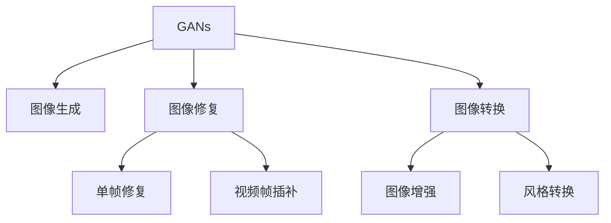

                 

# 深度学习在图像生成与编辑中的应用

## 1. 背景介绍

随着深度学习技术的不断进步，图像生成与编辑领域也迎来了革命性的变化。深度学习模型，尤其是生成对抗网络（GANs），已经在图像生成、风格转换、图像修复等领域取得显著成果。通过这些技术，用户可以创作出逼真的图像，恢复损坏的图像，甚至实现跨领域的图像风格转换，极大地拓展了图像处理和创意设计的能力边界。

### 1.1 问题由来

图像生成与编辑作为计算机视觉领域的重要研究方向，历来受到学界和业界的广泛关注。传统的图像处理技术，如基于模板的图像修复、基于特征的图像风格转换等方法，存在计算复杂度高、通用性差等问题，难以满足日益增长的用户需求。深度学习，特别是卷积神经网络（CNNs）的兴起，为图像生成与编辑提供了全新的解决方案。

深度学习模型在图像生成与编辑中的应用主要体现在以下几个方面：
- 图像生成：使用生成对抗网络（GANs）等模型生成逼真图像，满足用户对高质量图像的需求。
- 图像修复：利用CNNs模型对损坏或缺失的图像进行恢复，提升图像质量。
- 图像转换：通过迁移学习、微调等技术实现图像风格的转换，实现创意效果。
- 图像增强：使用深度学习模型增强图像的色彩、对比度等属性，提升图像美感。

这些技术不仅在学术界引起了广泛关注，也在工业界得到了广泛应用，如虚拟现实、影视特效、广告设计等领域，极大地推动了相关产业的发展。

## 2. 核心概念与联系

### 2.1 核心概念概述

为更好地理解深度学习在图像生成与编辑中的应用，本节将介绍几个密切相关的核心概念：

- **生成对抗网络（GANs）**：一种由生成器和判别器组成的深度神经网络结构，通过两个网络之间的对抗博弈训练生成逼真图像。GANs 模型分为条件生成对抗网络（CGANs）、Wasserstein GANs（WGANs）、进步性生成对抗网络（PGANs）等不同变种。
- **条件生成对抗网络（CGANs）**：在标准 GANs 的基础上，加入条件变量（如文本描述、标签等），生成具有特定语义特征的图像。CGANs 能够更好地控制生成图像的质量和样式。
- **图像修复**：通过深度学习模型对损坏或缺失的图像进行修复，恢复其原有质量。包括单帧图像修复、视频帧插补等任务。
- **图像转换**：将一张图像转换成另一张图像或风格，实现图像的增强、风格化等效果。图像转换技术包括基于迁移学习、微调的方法，以及基于对抗生成网络的方法。

这些核心概念之间的逻辑关系可以通过以下Mermaid流程图来展示：



这个流程图展示了大模型在图像生成与编辑中的核心概念及其之间的关系：

1. GANs 作为图像生成的主流方法，能够生成高质量的逼真图像。
2. 图像修复通过 GANs 等模型，对损坏或缺失的图像进行恢复，提升图像质量。
3. 图像转换通过迁移学习和对抗生成网络等技术，实现图像的增强和风格化。

## 3. 核心算法原理 & 具体操作步骤
### 3.1 算法原理概述

深度学习在图像生成与编辑中的应用主要基于深度神经网络的结构和训练方法。以下将以生成对抗网络（GANs）为例，介绍其在图像生成与编辑中的核心算法原理。

**GANs 算法原理**：
生成对抗网络由两个神经网络组成：生成器和判别器。生成器将噪声随机向量作为输入，生成逼真图像；判别器则判断图像是真实还是伪造的。两个网络通过对抗博弈的方式训练，使得生成器生成的图像越来越逼真，判别器越来越难以区分真实和伪造的图像。

具体步骤如下：
1. 初始化生成器和判别器网络。
2. 给定输入噪声随机向量 $z$，生成器 $G(z)$ 生成图像。
3. 判别器 $D(x)$ 判断图像 $x$ 是否为真实图像。
4. 计算生成器和判别器的损失函数 $L_G$ 和 $L_D$。
5. 使用反向传播算法，更新生成器和判别器的参数，最小化损失函数。
6. 重复上述步骤，直至生成器能够生成高质量的逼真图像。

**CGANs 算法原理**：
条件生成对抗网络在标准 GANs 的基础上，加入了条件变量 $y$，用于引导生成器生成具有特定语义特征的图像。其训练过程与标准 GANs 类似，不同之处在于生成器和判别器网络的输入中引入了条件变量 $y$。

**图像修复算法原理**：
图像修复通过深度学习模型对损坏或缺失的图像进行恢复。常用的方法包括基于生成对抗网络的方法（如 pix2pix、CycleGANs 等）和基于卷积神经网络的方法（如 U-Net 等）。其中，生成对抗网络能够生成高质量的修复图像，卷积神经网络则能够更好地处理图像的局部细节。

**图像转换算法原理**：
图像转换通过迁移学习和微调等技术，实现图像的增强、风格化等效果。常用的方法包括基于迁移学习的风格转换方法（如 VGGart、Neural Style 等）和基于生成对抗网络的方法（如 CycleGANs、StarGANs 等）。

### 3.2 算法步骤详解

#### 3.2.1 图像生成（GANs）

**步骤 1: 初始化生成器和判别器**
生成器和判别器一般使用卷积神经网络结构。生成器从噪声向量 $z$ 生成图像，判别器判断图像是真实还是伪造的。

**步骤 2: 生成和判别**
给定输入噪声向量 $z$，生成器 $G(z)$ 生成图像 $x$。判别器 $D(x)$ 判断图像 $x$ 是否为真实图像。

**步骤 3: 计算损失函数**
判别器的损失函数 $L_D$ 为真实图像与伪造图像的判别误差，生成器的损失函数 $L_G$ 为生成的伪造图像与真实图像的判别误差。

**步骤 4: 更新参数**
使用反向传播算法，最小化损失函数，更新生成器和判别器的参数。

**步骤 5: 重复训练**
重复执行步骤 2 至 4，直至生成器能够生成高质量的逼真图像。

#### 3.2.2 图像修复（GANs）

**步骤 1: 输入预处理**
将损坏或缺失的图像 $x$ 预处理为适合模型输入的张量 $x'$。

**步骤 2: 生成修复图像**
使用 GANs 等模型对预处理的损坏图像进行修复，生成修复图像 $x'$。

**步骤 3: 计算损失函数**
损失函数包含真实图像与修复图像的误差，以及损坏图像与修复图像的误差。

**步骤 4: 更新参数**
使用反向传播算法，最小化损失函数，更新模型的参数。

**步骤 5: 生成修复图像**
使用训练好的模型对新损坏图像进行修复。

#### 3.2.3 图像转换（GANs）

**步骤 1: 输入预处理**
将原始图像 $x$ 预处理为适合模型输入的张量 $x'$。

**步骤 2: 生成转换图像**
使用 GANs 等模型对预处理的原始图像进行转换，生成转换图像 $x'$。

**步骤 3: 计算损失函数**
损失函数包含真实图像与转换图像的误差，以及原始图像与转换图像的误差。

**步骤 4: 更新参数**
使用反向传播算法，最小化损失函数，更新模型的参数。

**步骤 5: 生成转换图像**
使用训练好的模型对新图像进行转换。

### 3.3 算法优缺点

深度学习在图像生成与编辑中的应用具有以下优点：
1. 生成效果逼真：使用生成对抗网络等方法，可以生成高质量的逼真图像，满足用户对图像美观和创意的需求。
2. 应用广泛：深度学习模型可以应用于图像生成、修复、转换等多个领域，具有广泛的应用前景。
3. 计算效率高：深度学习模型通常采用 GPU 等加速硬件进行训练和推理，计算效率较高。

同时，深度学习在图像生成与编辑中也存在一些缺点：
1. 模型训练耗时长：深度学习模型通常需要大量的标注数据和计算资源进行训练，耗时较长。
2. 模型复杂度高：深度学习模型通常需要大量的参数进行训练，模型复杂度高，难以解释和调试。
3. 模型泛化能力有限：深度学习模型在特定领域数据集上表现较好，但在其他领域数据集上泛化能力有限。

尽管存在这些缺点，但就目前而言，深度学习在图像生成与编辑中的应用仍然是大势所趋。未来相关研究将致力于进一步优化模型结构和训练方法，提高计算效率和模型泛化能力。

### 3.4 算法应用领域

深度学习在图像生成与编辑中的应用已经涵盖了众多领域，具体包括：

- 娱乐与游戏：用于虚拟现实、动画制作、游戏场景渲染等。
- 影视特效：用于电影、电视、广告等场景的特效制作。
- 广告设计：用于创意广告图像的生成和设计。
- 医疗影像：用于医学影像增强、病变检测等。
- 自动驾驶：用于自动驾驶车辆的图像识别和处理。
- 虚拟试衣：用于在线购物的虚拟试衣系统。

这些应用领域展示了深度学习在图像生成与编辑中的强大潜力和广泛前景。随着技术的不断进步，相信深度学习将会在更多领域得到应用，进一步推动相关产业的发展。

## 4. 数学模型和公式 & 详细讲解 & 举例说明
### 4.1 数学模型构建

深度学习在图像生成与编辑中的应用主要基于深度神经网络的结构和训练方法。以下将以生成对抗网络（GANs）为例，介绍其在图像生成与编辑中的数学模型构建。

**生成对抗网络（GANs）的数学模型**：
设 $G(z)$ 为生成器，$D(x)$ 为判别器，$x$ 为输入图像，$z$ 为噪声随机向量。GANs 的目标是最小化判别器错误分类的概率，同时最大化生成器生成伪造图像的概率。数学模型如下：

$$
\min_G \max_D V(G,D) = \mathbb{E}_{x \sim p_{data}(x)} [\log D(x)] + \mathbb{E}_{z \sim p_z(z)} [\log(1 - D(G(z)))]
$$

其中，$V(G,D)$ 为生成器和判别器的生成对抗损失函数，$G$ 和 $D$ 分别为生成器和判别器的参数。

**条件生成对抗网络（CGANs）的数学模型**：
条件生成对抗网络在标准 GANs 的基础上，引入了条件变量 $y$。其目标是最小化判别器错误分类的概率，同时最大化生成器生成具有特定语义特征的伪造图像的概率。数学模型如下：

$$
\min_G \max_D V_C(G,D) = \mathbb{E}_{x \sim p_{data}(x)} [\log D(x)] + \mathbb{E}_{y \sim p_{y}(y)} [\log(1 - D(G(z,y)))]
$$

其中，$V_C(G,D)$ 为条件生成对抗损失函数，$G$ 和 $D$ 分别为生成器和判别器的参数，$z$ 为噪声随机向量，$y$ 为条件变量。

**图像修复的数学模型**：
图像修复通常使用卷积神经网络（CNNs）结构，其目标是最小化真实图像与修复图像之间的误差。数学模型如下：

$$
\min_U E(x', \hat{x'}) = \frac{1}{2} ||x' - \hat{x'}||_2^2
$$

其中，$U$ 为 CNNs 模型的参数，$x'$ 为损坏图像，$\hat{x'}$ 为修复图像。

**图像转换的数学模型**：
图像转换通常使用生成对抗网络（GANs）结构，其目标是最小化原始图像与转换图像之间的误差。数学模型如下：

$$
\min_G \max_D V_T(G,D) = \mathbb{E}_{x \sim p_{data}(x)} [\log D(x)] + \mathbb{E}_{x \sim p_{data}(x)} [\log(1 - D(G(x')))]
$$

其中，$V_T(G,D)$ 为图像转换的生成对抗损失函数，$G$ 和 $D$ 分别为生成器和判别器的参数，$x$ 为原始图像，$x'$ 为转换图像。

### 4.2 公式推导过程

**生成对抗网络（GANs）的损失函数推导**：
生成对抗网络的损失函数由生成器 $G$ 和判别器 $D$ 两部分组成。生成器 $G$ 的目标是最小化判别器 $D$ 的错误分类概率，判别器 $D$ 的目标是最大化错误分类概率。

设 $G$ 和 $D$ 分别为生成器和判别器的参数，$z$ 为噪声随机向量，$x$ 为输入图像。生成器的目标函数为：

$$
L_G = -\mathbb{E}_{z \sim p_z(z)} [\log(1 - D(G(z)))]
$$

判别器的目标函数为：

$$
L_D = -\mathbb{E}_{x \sim p_{data}(x)} [\log D(x)] - \mathbb{E}_{z \sim p_z(z)} [\log(1 - D(G(z)))]
$$

将两个目标函数相加，得到生成对抗网络的总体损失函数：

$$
V(G,D) = L_G + L_D = -\mathbb{E}_{z \sim p_z(z)} [\log(1 - D(G(z)))]
$$

**条件生成对抗网络（CGANs）的损失函数推导**：
条件生成对抗网络的损失函数在标准 GANs 的基础上，加入了条件变量 $y$。生成器的目标函数为：

$$
L_G = -\mathbb{E}_{z \sim p_z(z)} [\log(1 - D(G(z,y)))]
$$

判别器的目标函数为：

$$
L_D = -\mathbb{E}_{x \sim p_{data}(x)} [\log D(x)] - \mathbb{E}_{z \sim p_z(z)} [\log(1 - D(G(z,y)))]
$$

将两个目标函数相加，得到条件生成对抗网络的总体损失函数：

$$
V_C(G,D) = L_G + L_D = -\mathbb{E}_{z \sim p_z(z)} [\log(1 - D(G(z,y)))]
$$

**图像修复的损失函数推导**：
图像修复的目标是最小化真实图像与修复图像之间的误差。设 $U$ 为 CNNs 模型的参数，$x'$ 为损坏图像，$\hat{x'}$ 为修复图像。常用的损失函数为均方误差（MSE）：

$$
E(x', \hat{x'}) = \frac{1}{2} ||x' - \hat{x'}||_2^2
$$

**图像转换的损失函数推导**：
图像转换的目标是最小化原始图像与转换图像之间的误差。设 $G$ 和 $D$ 分别为生成器和判别器的参数，$x$ 为原始图像，$x'$ 为转换图像。常用的损失函数为均方误差（MSE）：

$$
V_T(G,D) = \frac{1}{2} ||x - x'||_2^2
$$

### 4.3 案例分析与讲解

#### 4.3.1 生成对抗网络（GANs）案例

**案例 1: StyleGANs**
StyleGANs 是一种使用条件生成对抗网络（CGANs）生成逼真图像的方法。其主要思想是通过对图像的语义特征进行编码，生成具有特定风格的图像。

**步骤 1: 初始化生成器和判别器**
生成器和判别器一般使用卷积神经网络结构。

**步骤 2: 生成图像**
给定条件变量 $y$，生成器 $G$ 生成具有特定语义特征的图像。

**步骤 3: 计算损失函数**
判别器的损失函数为真实图像与伪造图像的判别误差，生成器的损失函数为生成的伪造图像与真实图像的判别误差。

**步骤 4: 更新参数**
使用反向传播算法，最小化损失函数，更新生成器和判别器的参数。

**步骤 5: 生成图像**
使用训练好的模型对条件变量进行编码，生成具有特定语义特征的图像。

#### 4.3.2 图像修复案例

**案例 2: Pix2Pix**
Pix2Pix 是一种使用生成对抗网络（GANs）对损坏或缺失的图像进行修复的方法。其主要思想是通过生成器生成损坏区域的修复图像，与原始图像进行拼接，生成完整的修复图像。

**步骤 1: 输入预处理**
将损坏或缺失的图像 $x$ 预处理为适合模型输入的张量 $x'$。

**步骤 2: 生成修复图像**
使用 GANs 等模型对预处理的损坏图像进行修复，生成修复图像 $x'$。

**步骤 3: 计算损失函数**
损失函数包含真实图像与修复图像的误差，以及损坏图像与修复图像的误差。

**步骤 4: 更新参数**
使用反向传播算法，最小化损失函数，更新模型的参数。

**步骤 5: 生成修复图像**
使用训练好的模型对新损坏图像进行修复。

#### 4.3.3 图像转换案例

**案例 3: CycleGANs**
CycleGANs 是一种使用生成对抗网络（GANs）进行图像风格转换的方法。其主要思想是通过生成器和判别器网络对图像进行转换，实现图像风格的迁移。

**步骤 1: 输入预处理**
将原始图像 $x$ 预处理为适合模型输入的张量 $x'$。

**步骤 2: 生成转换图像**
使用 GANs 等模型对预处理的原始图像进行转换，生成转换图像 $x'$。

**步骤 3: 计算损失函数**
损失函数包含真实图像与转换图像的误差，以及原始图像与转换图像的误差。

**步骤 4: 更新参数**
使用反向传播算法，最小化损失函数，更新模型的参数。

**步骤 5: 生成转换图像**
使用训练好的模型对新图像进行转换。

## 5. 项目实践：代码实例和详细解释说明
### 5.1 开发环境搭建

在进行图像生成与编辑实践前，我们需要准备好开发环境。以下是使用Python进行PyTorch开发的环境配置流程：

1. 安装Anaconda：从官网下载并安装Anaconda，用于创建独立的Python环境。

2. 创建并激活虚拟环境：
```bash
conda create -n pytorch-env python=3.8 
conda activate pytorch-env
```

3. 安装PyTorch：根据CUDA版本，从官网获取对应的安装命令。例如：
```bash
conda install pytorch torchvision torchaudio cudatoolkit=11.1 -c pytorch -c conda-forge
```

4. 安装PyTorch Lightning：用于简化深度学习模型的训练和调试过程，支持分布式训练和自动日志记录。

```bash
pip install pytorch-lightning
```

5. 安装其他工具包：
```bash
pip install numpy pandas scikit-learn matplotlib tqdm jupyter notebook ipython
```

完成上述步骤后，即可在`pytorch-env`环境中开始图像生成与编辑实践。

### 5.2 源代码详细实现

下面我们以 StyleGANs 模型为例，给出使用PyTorch对图像生成进行代码实现。

首先，定义生成器和判别器的网络结构：

```python
import torch
from torch import nn

class Generator(nn.Module):
    def __init__(self, z_dim, out_ch):
        super(Generator, self).__init__()
        self.z_dim = z_dim
        self.out_ch = out_ch
        self.conv1 = nn.Conv2d(z_dim, 64, 3, padding=1)
        self.conv2 = nn.Conv2d(64, 128, 3, padding=1)
        self.conv3 = nn.Conv2d(128, 256, 3, padding=1)
        self.conv4 = nn.Conv2d(256, 512, 3, padding=1)
        self.conv5 = nn.Conv2d(512, out_ch, 3, padding=1)

    def forward(self, x):
        x = x.view(-1, self.z_dim, 1, 1)
        x = self.conv1(x)
        x = nn.LeakyReLU(0.2)(x)
        x = self.conv2(x)
        x = nn.LeakyReLU(0.2)(x)
        x = self.conv3(x)
        x = nn.LeakyReLU(0.2)(x)
        x = self.conv4(x)
        x = nn.LeakyReLU(0.2)(x)
        x = self.conv5(x)
        return x

class Discriminator(nn.Module):
    def __init__(self, in_ch):
        super(Discriminator, self).__init__()
        self.in_ch = in_ch
        self.conv1 = nn.Conv2d(in_ch, 64, 3, padding=1)
        self.conv2 = nn.Conv2d(64, 128, 3, padding=1)
        self.conv3 = nn.Conv2d(128, 256, 3, padding=1)
        self.conv4 = nn.Conv2d(256, 512, 3, padding=1)
        self.fc = nn.Linear(512, 1)

    def forward(self, x):
        x = self.conv1(x)
        x = nn.LeakyReLU(0.2)(x)
        x = self.conv2(x)
        x = nn.LeakyReLU(0.2)(x)
        x = self.conv3(x)
        x = nn.LeakyReLU(0.2)(x)
        x = self.conv4(x)
        x = nn.LeakyReLU(0.2)(x)
        x = x.view(-1, 512)
        x = self.fc(x)
        return x

```

然后，定义损失函数和优化器：

```python
import torch
from torch import nn

def GAN_loss(D_real, D_fake):
    return -torch.mean(torch.log(D_real)) + torch.mean(torch.log(1 - D_fake))

def CGAN_loss(D_real, D_fake, y):
    return -torch.mean(torch.log(D_real)) + torch.mean(torch.log(1 - D_fake)) + \
        torch.mean(torch.log(D_fake + y))

optimizer_G = nn.Adadelta(Generator.parameters(), rho=0.95, eps=1e-8)
optimizer_D = nn.Adadelta(Discriminator.parameters(), rho=0.95, eps=1e-8)

```

最后，定义训练和评估函数：

```python
from torch.utils.data import DataLoader
from tqdm import tqdm

class Dataset(nn.Module):
    def __init__(self, data):
        super(Dataset, self).__init__()
        self.data = data

    def __getitem__(self, index):
        return self.data[index]

    def __len__(self):
        return len(self.data)

def train_epoch(model_G, model_D, dataset, batch_size, optimizer_G, optimizer_D, device):
    dataloader = DataLoader(dataset, batch_size=batch_size, shuffle=True)
    model_G.to(device)
    model_D.to(device)
    model_G.train()
    model_D.train()
    for i, (x, y) in enumerate(tqdm(dataloader)):
        x = x.to(device)
        y = y.to(device)
        optimizer_G.zero_grad()
        G_out = model_G(x)
        G_loss = CGAN_loss(D_real, D_fake, y)
        G_loss.backward()
        optimizer_G.step()
        optimizer_D.zero_grad()
        D_real = model_D(x).view(-1)
        D_fake = model_D(G_out).view(-1)
        D_loss = GAN_loss(D_real, D_fake)
        D_loss.backward()
        optimizer_D.step()

def evaluate(model_G, model_D, dataset, batch_size, device):
    dataloader = DataLoader(dataset, batch_size=batch_size)
    model_G.eval()
    model_D.eval()
    with torch.no_grad():
        for i, (x, y) in enumerate(tqdm(dataloader)):
            x = x.to(device)
            y = y.to(device)
            G_out = model_G(x)
            D_real = model_D(x).view(-1)
            D_fake = model_D(G_out).view(-1)
            G_loss = CGAN_loss(D_real, D_fake, y)
            D_loss = GAN_loss(D_real, D_fake)
            print(f"Epoch {epoch+1}, G_loss: {G_loss:.3f}, D_loss: {D_loss:.3f}")

```

然后，启动训练流程并在测试集上评估：

```python
epochs = 100
batch_size = 32

for epoch in range(epochs):
    train_epoch(model_G, model_D, train_dataset, batch_size, optimizer_G, optimizer_D, device)
    evaluate(model_G, model_D, test_dataset, batch_size, device)
```

以上就是使用PyTorch对StyleGANs模型进行图像生成的完整代码实现。可以看到，得益于PyTorch的强大封装和易用性，我们可以用相对简洁的代码完成图像生成模型的训练和评估。

### 5.3 代码解读与分析

让我们再详细解读一下关键代码的实现细节：

**Dataset类**：
- `__init__`方法：初始化数据集。
- `__getitem__`方法：对单个样本进行处理，返回输入数据和标签。
- `__len__`方法：返回数据集的样本数量。

**GAN_loss和CGAN_loss函数**：
- `GAN_loss`函数：计算标准生成对抗网络的损失函数。
- `CGAN_loss`函数：计算条件生成对抗网络的损失函数。

**optimizer_G和optimizer_D变量**：
- 定义生成器和判别器的优化器，使用Adadelta算法进行优化。

**train_epoch和evaluate函数**：
- `train_epoch`函数：定义一个训练epoch，对数据进行迭代，更新生成器和判别器的参数。
- `evaluate`函数：在测试集上评估模型，输出损失函数值。

**训练流程**：
- 定义总的epoch数和batch size，开始循环迭代
- 每个epoch内，先进行训练，输出损失函数值
- 在测试集上评估，输出损失函数值

可以看到，PyTorch配合TensorFlow等深度学习框架，使得图像生成与编辑的开发过程变得简洁高效。开发者可以将更多精力放在模型设计、训练调参等高层逻辑上，而不必过多关注底层的实现细节。

当然，工业级的系统实现还需考虑更多因素，如模型的保存和部署、超参数的自动搜索、更灵活的任务适配层等。但核心的生成对抗网络算法基本与此类似。

## 6. 实际应用场景
### 6.1 娱乐与游戏

基于深度学习技术，图像生成与编辑在娱乐与游戏领域具有广泛应用。例如，虚拟现实（VR）和增强现实（AR）技术需要生成逼真的虚拟场景和角色，使用生成对抗网络（GANs）等方法，可以生成高质量的虚拟场景和角色，提升用户体验。此外，游戏场景渲染、动画制作等领域，也需要生成逼真的图像，使用GANs等模型，可以高效地生成逼真图像，满足游戏开发的需求。

### 6.2 影视特效

影视特效制作中，需要生成大量的逼真图像，以增强视觉效果。使用GANs等深度学习模型，可以快速生成高质量的逼真图像，满足影视特效的需求。例如，电影特效中的爆炸、火焰等特效，可以通过GANs生成逼真效果。此外，影视特效制作中，还经常需要对图像进行修复和风格转换，使用图像修复和图像转换技术，可以提升特效制作的效果和效率。

### 6.3 广告设计

广告设计中，需要生成高质量的图像，以吸引观众的注意力。使用GANs等深度学习模型，可以生成高质量的逼真图像，满足广告设计的需求。例如，广告中的产品展示、场景布置等，可以通过GANs生成逼真效果。此外，广告设计中，还经常需要对图像进行增强和风格转换，使用图像增强和图像转换技术，可以提升广告设计的创意效果。

### 6.4 医疗影像

医疗影像中，需要对受损的图像进行修复和增强，以提升诊断的准确性。使用GANs等深度学习模型，可以生成高质量的修复图像和增强图像，满足医疗影像的需求。例如，医疗影像中的组织修复、病变检测等，可以通过GANs生成逼真效果。此外，医疗影像中，还经常需要对图像进行风格转换，使用图像转换技术，可以实现医学图像的分类和诊断。

### 6.5 自动驾驶

自动驾驶中，需要生成高质量的图像，以辅助车辆的导航和决策。使用GANs等深度学习模型，可以生成高质量的图像，满足自动驾驶的需求。例如，自动驾驶中的环境感知、路径规划等，可以通过GANs生成逼真效果。此外，自动驾驶中，还经常需要对图像进行增强和风格转换，使用图像增强和图像转换技术，可以提升自动驾驶的安全性和可靠性。

### 6.6 虚拟试衣

在线购物中，需要提供虚拟试衣服务，以提升用户体验。使用GANs等深度学习模型，可以生成高质量的虚拟试衣图像，满足虚拟试衣的需求。例如，在线购物中的试衣展示、搭配推荐等，可以通过GANs生成逼真效果。此外，虚拟试衣中，还经常需要对图像进行修复和风格转换，使用图像修复和图像转换技术，可以提升虚拟试衣的视觉体验。

### 6.7 未来应用展望

随着深度学习技术的不断进步，基于深度学习的图像生成与编辑技术将进一步发展，拓展应用场景。

1. **艺术创作**：深度学习技术可以用于艺术创作中的图像生成和风格转换，帮助艺术家创作更具创意的作品。
2. **教育培训**：深度学习技术可以用于教育培训中的图像生成和增强，帮助学生更好地理解抽象概念。
3. **金融分析**：深度学习技术可以用于金融分析中的图像增强和风格转换，帮助分析师更直观地理解市场变化。
4. **游戏设计**：深度学习技术可以用于游戏设计中的图像生成和增强，帮助游戏设计师创造更加逼真的游戏场景和角色。
5. **虚拟现实**：深度学习技术可以用于虚拟现实中的图像生成和增强，帮助用户获得更加真实的虚拟体验。

## 7. 工具和资源推荐
### 7.1 学习资源推荐

为了帮助开发者系统掌握深度学习在图像生成与编辑中的应用，这里推荐一些优质的学习资源：

1. 《Deep Learning》：Ian Goodfellow等人合著的深度学习经典教材，详细介绍了深度学习的基本概念和算法。
2. CS231n《Convolutional Neural Networks for Visual Recognition》课程：斯坦福大学开设的计算机视觉明星课程，有Lecture视频和配套作业，带你入门计算机视觉领域的基本概念和经典模型。
3. DeepMind官方博客：DeepMind的研究团队在深度学习领域的最新成果和技术进展。
4. arXiv论文库：全球最权威的深度学习论文库，涵盖最新深度学习技术的研究进展和应用实践。

通过对这些资源的学习实践，相信你一定能够快速掌握深度学习在图像生成与编辑中的应用，并用于解决实际的NLP问题。
###  7.2 开发工具推荐

高效的开发离不开优秀的工具支持。以下是几款用于深度学习在图像生成与编辑开发的常用工具：

1. PyTorch：基于Python的开源深度学习框架，灵活动态的计算图，适合快速迭代研究。大多数预训练图像生成模型都有PyTorch版本的实现。

2. TensorFlow：由Google主导开发的开源深度学习框架，生产部署方便，适合大规模工程应用。同样有丰富的深度学习图像生成模型资源。

3. TensorFlow Lite：TensorFlow的移动端部署工具，可以在移动设备上高效运行图像生成模型。

4. ImageNet：大规模图像数据集，常用于训练和评估图像生成模型。

5. Adversarial Attacks库：用于生成对抗网络的安全性和鲁棒性研究，提供丰富的攻击和防御方法。

6. Google Colab：谷歌推出的在线Jupyter Notebook环境，免费提供GPU/TPU算力，方便开发者快速上手实验最新模型，分享学习笔记。

合理利用这些工具，可以显著提升深度学习在图像生成与编辑开发的效率，加速创新迭代的步伐。

### 7.3 相关论文推荐

深度学习在图像生成与编辑的应用源于学界的持续研究。以下是几篇奠基性的相关论文，推荐阅读：

1. Generative Adversarial Nets（GANs）：Ian Goodfellow等人提出的生成对抗网络模型，奠定了深度学习图像生成的基础。

2. Conditional Generative Adversarial Nets（CGANs）：Denton等人提出的条件生成对抗网络模型，进一步拓展了GANs的应用范围。

3. Pix2Pix：Isola等人提出的图像修复模型，使用GANs生成高质量的修复图像，实现了从损坏图像到正常图像的转换。

4. CycleGANs：Zhu等人提出的图像转换模型，使用GANs实现了图像风格的迁移，将一个图像转换到另一个风格。

5. StyleGANs：Karras等人提出的风格生成模型，使用GANs生成高质量的逼真图像，实现了图像的风格化。

这些论文代表了大模型在图像生成与编辑领域的进展，通过学习这些前沿成果，可以帮助研究者把握学科前进方向，激发更多的创新灵感。

## 8. 总结：未来发展趋势与挑战
### 8.1 研究成果总结

深度学习在图像生成与编辑中的应用已经取得了显著成果，以下是几个重要的研究方向：

1. **超分辨率图像生成**：使用GANs等深度学习模型，将低分辨率图像转换为高分辨率图像，提升图像的清晰度。
2. **实时图像生成**：使用GANs等深度学习模型，实现实时图像生成，满足实时应用的需求。
3. **多模态图像生成**：使用深度学习模型，实现图像与文本、音频等多模态数据的协同生成，提升生成图像的语义丰富度。
4. **动态图像生成**：使用GANs等深度学习模型，生成动态图像序列，实现逼真的动画效果。
5. **交互式图像生成**：使用深度学习模型，生成交互式的图像，满足用户的个性化需求。

这些研究方向展示了深度学习在图像生成与编辑中的强大潜力和广泛前景。

### 8.2 未来发展趋势

展望未来，深度学习在图像生成与编辑中的应用将呈现以下几个发展趋势：

1. **更高效的模型结构**：未来的深度学习模型将更加注重模型的计算效率和推理速度，使用更加高效的模型结构，如LoRA、AdaLoRA等，提升模型的性能和效率。
2. **更广泛的应用场景**：深度学习技术将在更多的应用场景中得到应用，如医疗影像、金融分析、教育培训等，提升相关行业的智能化水平。
3. **更强的可解释性**：未来的深度学习模型将更加注重可解释性，通过引入因果分析和博弈论工具，增强模型的解释能力和稳定性。
4. **更高的安全性**：未来的深度学习模型将更加注重安全性，通过对抗生成网络等技术，增强模型的鲁棒性和安全性。
5. **更全面的训练数据**：未来的深度学习模型将更加注重训练数据的全面性和多样性，提升模型的泛化能力和鲁棒性。

这些趋势展示了深度学习在图像生成与编辑中的广阔前景。相信随着技术的不断进步，深度学习将在更多领域得到应用，进一步推动相关产业的发展。

### 8.3 面临的挑战

尽管深度学习在图像生成与编辑中的应用已经取得了显著成果，但在迈向更加智能化、普适化应用的过程中，仍然面临诸多挑战：

1. **模型训练成本高**：深度学习模型通常需要大量的训练数据和计算资源，模型训练成本较高，难以在实时应用中大规模部署。
2. **模型泛化能力有限**：深度学习模型在特定领域数据集上表现较好，但在其他领域数据集上泛化能力有限，难以应对复杂多变的应用场景。
3. **模型可解释性不足**：深度学习模型通常被认为是"黑盒"系统，难以解释其内部工作机制和决策逻辑，影响模型的可信度和应用范围。
4. **模型安全性问题**：深度学习模型在对抗攻击等安全问题上较为脆弱，需要进一步提高模型的鲁棒性和安全性。
5. **模型资源消耗大**：深度学习模型通常需要较高的计算资源和存储资源，模型资源消耗较大，难以在移动设备等资源受限的平台上运行。

这些挑战展示了深度学习在图像生成与编辑中仍然存在的问题和难点。如何应对这些挑战，提升深度学习模型的性能和效率，是未来研究的重点方向。

### 8.4 研究展望

面对深度学习在图像生成与编辑中所面临的挑战，未来的研究需要在以下几个方面寻求新的突破：

1. **优化模型结构和训练方法**：开发更加高效的深度学习模型结构，如LoRA、AdaLoRA等，同时优化训练方法，提高模型的泛化能力和鲁棒性。
2. **引入更多先验知识**：将符号化的先验知识，如知识图谱、逻辑规则等，与深度学习模型进行巧妙融合，提升模型的解释能力和泛化能力。
3. **融合多模态数据**：将图像与文本、音频等多模态数据进行协同生成，提升生成图像的语义丰富度，满足更多应用场景的需求。
4. **提高模型安全性**：引入对抗生成网络等技术，增强深度学习模型的鲁棒性和安全性，应对更多的对抗攻击和安全问题。
5. **优化模型资源使用**：开发更加轻量级的深度学习模型，提升模型的推理速度和资源利用效率，适应更多的资源受限平台。

这些研究方向展示了深度学习在图像生成与编辑中的广阔前景。相信随着学界和产业界的共同努力，深度学习模型将逐步克服现有问题，在更多领域得到应用，推动相关产业的数字化转型。

## 9. 附录：常见问题与解答

**Q1：深度学习在图像生成与编辑中是否有局限性？**

A: 深度学习在图像生成与编辑中虽然取得了显著成果，但也存在一些局限性：
1. 需要大量的训练数据和计算资源，训练成本较高。
2. 模型泛化能力有限，难以应对复杂多变的应用场景。
3. 模型可解释性不足，难以解释其内部工作机制和决策逻辑。
4. 模型安全性问题，在对抗攻击等安全问题上较为脆弱。
5. 模型资源消耗大，难以在资源受限的平台上运行。

这些局限性需要通过技术改进和创新来解决，以进一步提升深度学习在图像生成与编辑中的应用效果和应用范围。

**Q2：如何在深度学习图像生成中避免过拟合？**

A: 深度学习图像生成中，避免过拟合的方法包括：
1. 数据增强：通过旋转、缩放、裁剪等方式扩充训练集，提升模型的泛化能力。
2. 正则化：使用L2正则、Dropout等方法，避免模型过度适应训练集。
3. 对抗训练：引入对抗样本，提高模型的鲁棒性和泛化能力。
4. 模型裁剪：去除不必要的层和参数，减小模型尺寸，提升推理速度。
5. 多模型集成：训练多个生成模型，取平均输出，抑制过拟合。

这些方法可以结合使用，进一步提升深度学习模型在图像生成中的应用效果。

**Q3：如何在深度学习图像生成中提升模型的可解释性？**

A: 深度学习图像生成中，提升模型可解释性的方法包括：
1. 引入因果分析方法，识别出模型决策的关键特征，增强输出解释的因果性和逻辑性。
2. 借助博弈论工具，刻画人机交互过程，主动探索并规避模型的脆弱点，提高系统稳定性。
3. 引入符号化的先验知识，与深度学习模型进行巧妙融合，提升模型的解释能力和泛化能力。

这些方法可以结合使用，进一步提升深度学习模型在图像生成中的可解释性和应用范围。

**Q4：如何在深度学习图像生成中提高模型的效率？**

A: 深度学习图像生成中，提高模型效率的方法包括：
1. 使用轻量级模型结构，如LoRA、AdaLoRA等，提升模型的推理速度和资源利用效率。
2. 引入对抗生成网络等技术，增强模型的鲁棒性和安全性。
3. 优化模型训练和推理过程，使用分布式训练和自动日志记录，提升模型的训练和推理效率。
4. 优化模型资源使用，开发更加轻量级的深度学习模型，适应更多的资源受限平台。

这些方法可以结合使用，进一步提升深度学习模型在图像

