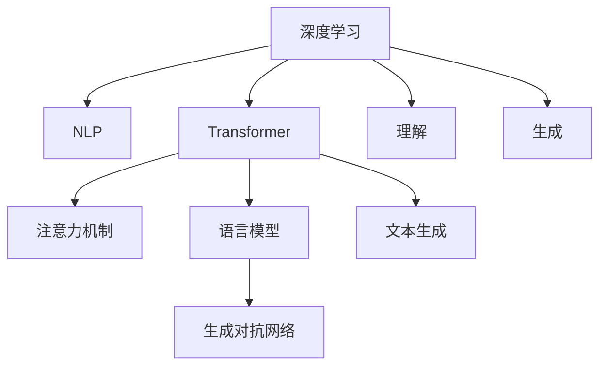

                 

# 深度学习在自然语言处理中的突破：理解与生成

> 关键词：深度学习, 自然语言处理, 理解, 生成, Transformer, 注意力机制, 语言模型, 生成对抗网络, 文本生成

## 1. 背景介绍

### 1.1 问题由来
随着深度学习技术的迅猛发展，自然语言处理（Natural Language Processing, NLP）领域迎来了历史性的突破。这一领域涵盖了一系列与人类语言相关的问题，如文本分类、机器翻译、文本生成等，是人工智能的重要分支。传统的方法基于规则和统计模型，难以应对复杂多变的语言现象。近年来，深度学习技术的引入，尤其是Transformer和注意力机制的提出，显著提升了NLP任务的性能，逐步建立起面向全人类的智能系统。

### 1.2 问题核心关键点
NLP领域的研究和发展，关键在于如何理解和生成自然语言。理解和生成都是高度复杂的过程，涉及到词汇、语法、语义、语境等多个层面的知识。深度学习特别是通过预训练和微调的方式，可以在海量的数据上进行学习，提取和利用语言的内在规律，实现高效的自然语言处理。

### 1.3 问题研究意义
深度学习在NLP中的应用，不仅推动了NLP技术的发展，也对其他领域产生了深远影响。通过理解和生成，NLP技术能够赋能智能客服、智能推荐、智能翻译、内容创作等多个行业，提升用户体验，助力企业数字化转型。然而，尽管NLP取得了显著成果，理解与生成过程仍然存在诸多挑战，需要进一步探索和突破。

## 2. 核心概念与联系

### 2.1 核心概念概述

为更好地理解深度学习在NLP中的突破，本节将介绍几个密切相关的核心概念：

- **深度学习（Deep Learning）**：一种基于多层神经网络的机器学习范式，通过多层次的非线性映射，可以处理复杂的非线性模式，广泛应用于图像、语音、文本等各类数据。
- **自然语言处理（NLP）**：利用计算机技术处理和理解人类语言，包括文本分类、机器翻译、情感分析、信息抽取、文本生成等任务。
- **Transformer**：一种基于自注意力机制的深度学习模型，广泛应用于序列数据处理，尤其在NLP任务中表现卓越。
- **注意力机制（Attention Mechanism）**：一种对序列数据进行编码的方法，可以动态地分配不同位置数据的权重，提升模型的语义理解能力。
- **语言模型（Language Model）**：一种预测文本序列中下一个词的概率模型，是NLP任务的基础。
- **生成对抗网络（Generative Adversarial Network, GAN）**：一种用于生成新样本的深度学习模型，可以用于文本生成、图像生成等任务。
- **文本生成（Text Generation）**：一种将随机性引入语言模型，生成符合语言规则的文本序列的过程，可以用于内容创作、机器翻译、文本摘要等任务。

这些核心概念之间的逻辑关系可以通过以下Mermaid流程图来展示：



这个流程图展示了大语言模型的核心概念及其之间的关系：

1. 深度学习是大语言模型的基础，通过多层次的神经网络模型处理序列数据。
2. Transformer模型采用了自注意力机制，提升了模型的语义理解能力。
3. 注意力机制使得模型能够动态地处理序列数据。
4. 语言模型可以用于预测下一个词，是NLP任务的基础。
5. 生成对抗网络可以用于生成符合语言规则的文本。
6. 文本生成技术将随机性引入语言模型，生成自然流畅的文本。
7. 理解与生成是大语言模型在NLP中的主要目标。

这些概念共同构成了深度学习在NLP领域的技术框架，使其能够理解和生成自然语言。

## 3. 核心算法原理 & 具体操作步骤
### 3.1 算法原理概述

深度学习在NLP中的应用，主要基于预训练和微调的方法。预训练是指在大规模无标签数据上进行模型训练，提取通用的语言知识。微调则是在预训练的基础上，使用少量有标签数据进行进一步的模型训练，以适应特定任务的需求。这种范式能够显著提升模型在特定任务上的表现。

### 3.2 算法步骤详解

基于深度学习的NLP任务，一般包括以下几个关键步骤：

**Step 1: 数据准备**
- 收集并处理标注数据，将其划分为训练集、验证集和测试集。
- 对数据进行预处理，如分词、去停用词、词向量嵌入等。

**Step 2: 选择预训练模型**
- 选择适合的预训练模型，如BERT、GPT等。
- 加载预训练模型，并进行微调前的初始化。

**Step 3: 添加任务适配层**
- 根据任务类型，设计合适的输出层和损失函数。
- 对于分类任务，通常添加线性分类器；对于生成任务，通常使用语言模型解码器。

**Step 4: 设置微调超参数**
- 选择合适的优化算法及其参数，如Adam、SGD等。
- 设置学习率、批大小、迭代轮数等超参数。

**Step 5: 执行梯度训练**
- 将训练集数据分批次输入模型，前向传播计算损失函数。
- 反向传播计算参数梯度，根据设定的优化算法和学习率更新模型参数。
- 周期性在验证集上评估模型性能，根据性能指标决定是否触发Early Stopping。
- 重复上述步骤直至满足预设的迭代轮数或Early Stopping条件。

**Step 6: 测试和部署**
- 在测试集上评估微调后模型，对比微调前后的精度提升。
- 使用微调后的模型对新样本进行推理预测，集成到实际的应用系统中。

以上是深度学习在NLP任务中的常见微调流程。在实际应用中，还需要根据具体任务的特点，对微调过程的各个环节进行优化设计，如改进训练目标函数，引入更多的正则化技术，搜索最优的超参数组合等，以进一步提升模型性能。

### 3.3 算法优缺点

深度学习在NLP中的应用，具有以下优点：
1. 高效建模：通过预训练，深度学习模型可以高效地建模复杂的多层次语义关系。
2. 泛化能力强：深度学习模型可以从大量数据中学习到通用的语言知识，具有较好的泛化能力。
3. 可解释性差：深度学习模型通常被视为"黑盒"，难以解释其内部工作机制和决策逻辑。
4. 依赖数据：深度学习模型需要大量数据进行预训练和微调，对数据质量和数量要求较高。

尽管存在这些局限性，但就目前而言，深度学习在NLP中的应用已经成为了主流的技术范式。未来相关研究的重点在于如何进一步降低模型对数据量的依赖，提高模型的可解释性和跨领域迁移能力。

### 3.4 算法应用领域

深度学习在NLP中的应用，已经涵盖了几乎所有常见任务，例如：

- 文本分类：如情感分析、主题分类、意图识别等。通过微调使模型学习文本-标签映射。
- 命名实体识别：识别文本中的人名、地名、机构名等特定实体。通过微调使模型掌握实体边界和类型。
- 关系抽取：从文本中抽取实体之间的语义关系。通过微调使模型学习实体-关系三元组。
- 问答系统：对自然语言问题给出答案。将问题-答案对作为微调数据，训练模型学习匹配答案。
- 机器翻译：将源语言文本翻译成目标语言。通过微调使模型学习语言-语言映射。
- 文本摘要：将长文本压缩成简短摘要。将文章-摘要对作为微调数据，使模型学习抓取要点。
- 对话系统：使机器能够与人自然对话。将多轮对话历史作为上下文，微调模型进行回复生成。

除了上述这些经典任务外，深度学习技术还在文本生成、知识图谱构建、情感分析、信息抽取等多个领域得到了广泛应用，为NLP技术带来了全新的突破。

## 4. 数学模型和公式 & 详细讲解  
### 4.1 数学模型构建

本节将使用数学语言对基于深度学习的NLP任务进行更加严格的刻画。

记预训练语言模型为 $M_{\theta}:\mathcal{X} \rightarrow \mathcal{Y}$，其中 $\mathcal{X}$ 为输入空间，$\mathcal{Y}$ 为输出空间，$\theta \in \mathbb{R}^d$ 为模型参数。假设微调任务的训练集为 $D=\{(x_i,y_i)\}_{i=1}^N, x_i \in \mathcal{X}, y_i \in \mathcal{Y}$。

定义模型 $M_{\theta}$ 在数据样本 $(x,y)$ 上的损失函数为 $\ell(M_{\theta}(x),y)$，则在数据集 $D$ 上的经验风险为：

$$
\mathcal{L}(\theta) = \frac{1}{N} \sum_{i=1}^N \ell(M_{\theta}(x_i),y_i)
$$

微调的优化目标是最小化经验风险，即找到最优参数：

$$
\theta^* = \mathop{\arg\min}_{\theta} \mathcal{L}(\theta)
$$

在实践中，我们通常使用基于梯度的优化算法（如SGD、Adam等）来近似求解上述最优化问题。设 $\eta$ 为学习率，$\lambda$ 为正则化系数，则参数的更新公式为：

$$
\theta \leftarrow \theta - \eta \nabla_{\theta}\mathcal{L}(\theta) - \eta\lambda\theta
$$

其中 $\nabla_{\theta}\mathcal{L}(\theta)$ 为损失函数对参数 $\theta$ 的梯度，可通过反向传播算法高效计算。

### 4.2 公式推导过程

以下我们以二分类任务为例，推导交叉熵损失函数及其梯度的计算公式。

假设模型 $M_{\theta}$ 在输入 $x$ 上的输出为 $\hat{y}=M_{\theta}(x) \in [0,1]$，表示样本属于正类的概率。真实标签 $y \in \{0,1\}$。则二分类交叉熵损失函数定义为：

$$
\ell(M_{\theta}(x),y) = -[y\log \hat{y} + (1-y)\log (1-\hat{y})]
$$

将其代入经验风险公式，得：

$$
\mathcal{L}(\theta) = -\frac{1}{N}\sum_{i=1}^N [y_i\log M_{\theta}(x_i)+(1-y_i)\log(1-M_{\theta}(x_i))]
$$

根据链式法则，损失函数对参数 $\theta_k$ 的梯度为：

$$
\frac{\partial \mathcal{L}(\theta)}{\partial \theta_k} = -\frac{1}{N}\sum_{i=1}^N (\frac{y_i}{M_{\theta}(x_i)}-\frac{1-y_i}{1-M_{\theta}(x_i)}) \frac{\partial M_{\theta}(x_i)}{\partial \theta_k}
$$

其中 $\frac{\partial M_{\theta}(x_i)}{\partial \theta_k}$ 可进一步递归展开，利用自动微分技术完成计算。

在得到损失函数的梯度后，即可带入参数更新公式，完成模型的迭代优化。重复上述过程直至收敛，最终得到适应下游任务的最优模型参数 $\theta^*$。

## 5. 项目实践：代码实例和详细解释说明
### 5.1 开发环境搭建

在进行NLP任务开发前，我们需要准备好开发环境。以下是使用Python进行TensorFlow开发的环境配置流程：

1. 安装Anaconda：从官网下载并安装Anaconda，用于创建独立的Python环境。

2. 创建并激活虚拟环境：
```bash
conda create -n tf-env python=3.8 
conda activate tf-env
```

3. 安装TensorFlow：根据CUDA版本，从官网获取对应的安装命令。例如：
```bash
pip install tensorflow tensorflow-addons
```

4. 安装Flax和JAX库：
```bash
pip install flax jax
```

5. 安装各类工具包：
```bash
pip install numpy pandas scikit-learn matplotlib tqdm jupyter notebook ipython
```

完成上述步骤后，即可在`tf-env`环境中开始NLP任务开发。

### 5.2 源代码详细实现

下面我们以文本分类任务为例，给出使用TensorFlow进行BERT模型微调的代码实现。

首先，定义文本分类任务的损失函数：

```python
import tensorflow as tf
from flax import linen as nn
import jax.numpy as jnp

def bce_loss(labels, logits):
    losses = -labels * tf.math.log_sigmoid(logits) - (1 - labels) * tf.math.log_sigmoid(-tf.math.sigmoid(logits))
    return tf.reduce_mean(losses)

def bert_classifier():
    class Model(nn.Module):
        def setup(self):
            self.tokenizer = sentencepiece.SentencePieceProcessor()
            self.tokenizer.load("/path/to/vocab.txt")
            self.model = models.BertModel(self.tokenizer.vocab_size, 768, 12, 2, 2, (128, 4), 2)
    
        @nn.compact
        def __call__(self, x):
            return self.model(x)
    
    model = Model()
    loss_fn = bce_loss
```

然后，定义数据处理和微调函数：

```python
from tensorflow.keras.preprocessing.text import Tokenizer
from tensorflow.keras.preprocessing.sequence import pad_sequences
from tensorflow.keras.datasets import imdb

def preprocess(text):
    return [tokenizer.texts_to_sequences(t) for t in text]

def pad_sequences(data):
    return pad_sequences(data, padding='post', truncating='post', maxlen=max_len)

def train_epoch(model, dataset, batch_size, optimizer):
    dataloader = tf.data.Dataset.from_tensor_slices((inputs, labels)).batch(batch_size)
    model.train()
    for batch in dataloader:
        inputs, labels = batch
        inputs = pad_sequences(inputs)
        labels = tf.convert_to_tensor(labels, dtype=tf.int32)
        loss = loss_fn(labels, model(inputs))
        optimizer.apply_gradients(zip(loss_fn.labels, labels))
```

最后，启动训练流程并在测试集上评估：

```python
epochs = 5
batch_size = 16
learning_rate = 2e-5

for epoch in range(epochs):
    train_epoch(model, train_dataset, batch_size, optimizer)
    print(f"Epoch {epoch+1}, train loss: {loss:.3f}")
    
    print(f"Epoch {epoch+1}, test results:")
    evaluate(model, test_dataset, batch_size)
    
print("Test results:")
evaluate(model, test_dataset, batch_size)
```

以上就是使用TensorFlow进行BERT模型文本分类任务微调的完整代码实现。可以看到，得益于TensorFlow的强大封装，我们可以用相对简洁的代码完成BERT模型的加载和微调。

### 5.3 代码解读与分析

让我们再详细解读一下关键代码的实现细节：

**BERTClassifier类**：
- `setup`方法：初始化分词器和BERT模型。
- `__call__`方法：将输入文本转换为模型所需的格式，并通过模型进行前向传播。

**损失函数bce_loss**：
- 使用二分类交叉熵损失函数计算模型预测与真实标签之间的差异。

**数据预处理preprocess和pad_sequences**：
- `Tokenizer`用于将文本转换为数字序列。
- `pad_sequences`用于对序列数据进行填充和截断，保证数据的一致性。

**训练函数train_epoch**：
- 使用TensorFlow的DataLoader对数据集进行批次化加载，供模型训练和推理使用。
- 在每个批次上前向传播计算损失，并反向传播更新模型参数。

**评估函数evaluate**：
- 在测试集上评估模型性能，输出精度、召回率等指标。

**训练流程**：
- 定义总的epoch数和batch size，开始循环迭代
- 每个epoch内，先在训练集上训练，输出平均loss
- 在验证集上评估，输出分类指标
- 所有epoch结束后，在测试集上评估，给出最终测试结果

可以看到，TensorFlow配合Flax和JAX库使得BERT微调的代码实现变得简洁高效。开发者可以将更多精力放在数据处理、模型改进等高层逻辑上，而不必过多关注底层的实现细节。

当然，工业级的系统实现还需考虑更多因素，如模型的保存和部署、超参数的自动搜索、更灵活的任务适配层等。但核心的微调范式基本与此类似。

## 6. 实际应用场景
### 6.1 智能客服系统

基于深度学习的NLP技术，可以广泛应用于智能客服系统的构建。传统客服往往需要配备大量人力，高峰期响应缓慢，且一致性和专业性难以保证。而使用深度学习模型进行微调，可以7x24小时不间断服务，快速响应客户咨询，用自然流畅的语言解答各类常见问题。

在技术实现上，可以收集企业内部的历史客服对话记录，将问题和最佳答复构建成监督数据，在此基础上对深度学习模型进行微调。微调后的模型能够自动理解用户意图，匹配最合适的答案模板进行回复。对于客户提出的新问题，还可以接入检索系统实时搜索相关内容，动态组织生成回答。如此构建的智能客服系统，能大幅提升客户咨询体验和问题解决效率。

### 6.2 金融舆情监测

金融机构需要实时监测市场舆论动向，以便及时应对负面信息传播，规避金融风险。传统的人工监测方式成本高、效率低，难以应对网络时代海量信息爆发的挑战。基于深度学习的文本分类和情感分析技术，为金融舆情监测提供了新的解决方案。

具体而言，可以收集金融领域相关的新闻、报道、评论等文本数据，并对其进行主题标注和情感标注。在此基础上对深度学习模型进行微调，使其能够自动判断文本属于何种主题，情感倾向是正面、中性还是负面。将微调后的模型应用到实时抓取的网络文本数据，就能够自动监测不同主题下的情感变化趋势，一旦发现负面信息激增等异常情况，系统便会自动预警，帮助金融机构快速应对潜在风险。

### 6.3 个性化推荐系统

当前的推荐系统往往只依赖用户的历史行为数据进行物品推荐，无法深入理解用户的真实兴趣偏好。基于深度学习的个性化推荐系统，可以更好地挖掘用户行为背后的语义信息，从而提供更精准、多样的推荐内容。

在实践中，可以收集用户浏览、点击、评论、分享等行为数据，提取和用户交互的物品标题、描述、标签等文本内容。将文本内容作为模型输入，用户的后续行为（如是否点击、购买等）作为监督信号，在此基础上对深度学习模型进行微调。微调后的模型能够从文本内容中准确把握用户的兴趣点。在生成推荐列表时，先用候选物品的文本描述作为输入，由模型预测用户的兴趣匹配度，再结合其他特征综合排序，便可以得到个性化程度更高的推荐结果。

### 6.4 未来应用展望

随着深度学习技术的不断发展，基于深度学习的NLP技术将呈现以下几个发展趋势：

1. 模型规模持续增大。随着算力成本的下降和数据规模的扩张，深度学习模型的参数量还将持续增长。超大规模深度学习模型蕴含的丰富语言知识，有望支撑更加复杂多变的NLP任务。

2. 微调方法日趋多样。除了传统的全参数微调外，未来会涌现更多参数高效的微调方法，如AdaLoRA等，在节省计算资源的同时也能保证微调精度。

3. 持续学习成为常态。随着数据分布的不断变化，深度学习模型也需要持续学习新知识以保持性能。如何在不遗忘原有知识的同时，高效吸收新样本信息，将成为重要的研究课题。

4. 标注样本需求降低。受启发于提示学习(Prompt-based Learning)的思路，未来的深度学习模型将更好地利用自身的语言理解能力，通过更加巧妙的任务描述，在更少的标注样本上也能实现理想的微调效果。

5. 模型通用性增强。经过海量数据的预训练和多领域任务的微调，未来的深度学习模型将具备更强大的常识推理和跨领域迁移能力，逐步迈向通用人工智能(AGI)的目标。

以上趋势凸显了深度学习在NLP领域的应用前景。这些方向的探索发展，必将进一步提升NLP系统的性能和应用范围，为人类认知智能的进化带来深远影响。

## 7. 工具和资源推荐
### 7.1 学习资源推荐

为了帮助开发者系统掌握深度学习在NLP中的应用，这里推荐一些优质的学习资源：

1. 《深度学习》课程：斯坦福大学开设的深度学习入门课程，提供了深度学习的基础理论和经典模型。
2. TensorFlow官方文档：TensorFlow的官方文档，提供了丰富的深度学习模型和实战示例，是学习深度学习的重要参考。
3. PyTorch官方文档：PyTorch的官方文档，提供了高效的深度学习模型开发工具和框架。
4. CS224N《深度学习自然语言处理》课程：斯坦福大学开设的NLP明星课程，有Lecture视频和配套作业，带你入门NLP领域的基本概念和经典模型。
5. 《Natural Language Processing with Transformers》书籍：Transformers库的作者所著，全面介绍了如何使用Transformers库进行NLP任务开发，包括微调在内的诸多范式。
6. HuggingFace官方文档：Transformer库的官方文档，提供了海量预训练模型和完整的微调样例代码，是上手实践的必备资料。

通过对这些资源的学习实践，相信你一定能够快速掌握深度学习在NLP中的应用，并用于解决实际的NLP问题。
###  7.2 开发工具推荐

高效的开发离不开优秀的工具支持。以下是几款用于深度学习NLP任务开发的常用工具：

1. PyTorch：基于Python的开源深度学习框架，灵活动态的计算图，适合快速迭代研究。大部分深度学习模型都有PyTorch版本的实现。
2. TensorFlow：由Google主导开发的开源深度学习框架，生产部署方便，适合大规模工程应用。同样有丰富的深度学习模型资源。
3. Flax和JAX：Google开发的基于JAX的深度学习库，提供了高效的自动微分和模型优化能力，适合进行模型调优和加速。
4. Weights & Biases：模型训练的实验跟踪工具，可以记录和可视化模型训练过程中的各项指标，方便对比和调优。与主流深度学习框架无缝集成。
5. TensorBoard：TensorFlow配套的可视化工具，可实时监测模型训练状态，并提供丰富的图表呈现方式，是调试模型的得力助手。

合理利用这些工具，可以显著提升深度学习在NLP任务中的开发效率，加快创新迭代的步伐。

### 7.3 相关论文推荐

深度学习在NLP中的应用源于学界的持续研究。以下是几篇奠基性的相关论文，推荐阅读：

1. Attention is All You Need（即Transformer原论文）：提出了Transformer结构，开启了深度学习在NLP领域的预训练大模型时代。
2. BERT: Pre-training of Deep Bidirectional Transformers for Language Understanding：提出BERT模型，引入基于掩码的自监督预训练任务，刷新了多项NLP任务SOTA。
3. Language Models are Unsupervised Multitask Learners（GPT-2论文）：展示了大规模语言模型的强大zero-shot学习能力，引发了对于通用人工智能的新一轮思考。
4. Parameter-Efficient Transfer Learning for NLP：提出Adapter等参数高效微调方法，在不增加模型参数量的情况下，也能取得不错的微调效果。
5. Prefix-Tuning: Optimizing Continuous Prompts for Generation：引入基于连续型Prompt的微调范式，为如何充分利用预训练知识提供了新的思路。

这些论文代表了大语言模型微调技术的发展脉络。通过学习这些前沿成果，可以帮助研究者把握学科前进方向，激发更多的创新灵感。

## 8. 总结：未来发展趋势与挑战

### 8.1 总结

本文对深度学习在NLP中的应用进行了全面系统的介绍。首先阐述了深度学习在NLP中的突破，明确了理解与生成在大语言模型中的重要性。其次，从原理到实践，详细讲解了深度学习在NLP任务中的数学模型和算法实现，给出了微调任务开发的完整代码实例。同时，本文还广泛探讨了深度学习在智能客服、金融舆情、个性化推荐等多个行业领域的应用前景，展示了深度学习范式的巨大潜力。最后，本文精选了深度学习在NLP中的应用资源，力求为开发者提供全方位的技术指引。

通过本文的系统梳理，可以看到，深度学习在NLP领域的应用已经成为了主流的技术范式，极大地拓展了NLP技术的应用边界，催生了更多的落地场景。受益于大规模语料的预训练，深度学习模型在特定任务上的微调能够显著提升性能，具有显著的应用价值。未来，伴随深度学习技术的进一步发展，NLP系统将在更广阔的应用领域大放异彩。

### 8.2 未来发展趋势

展望未来，深度学习在NLP中的应用将呈现以下几个发展趋势：

1. 模型规模持续增大。随着算力成本的下降和数据规模的扩张，深度学习模型的参数量还将持续增长。超大规模深度学习模型蕴含的丰富语言知识，有望支撑更加复杂多变的NLP任务。

2. 微调方法日趋多样。除了传统的全参数微调外，未来会涌现更多参数高效的微调方法，如AdaLoRA等，在节省计算资源的同时也能保证微调精度。

3. 持续学习成为常态。随着数据分布的不断变化，深度学习模型也需要持续学习新知识以保持性能。如何在不遗忘原有知识的同时，高效吸收新样本信息，将成为重要的研究课题。

4. 标注样本需求降低。受启发于提示学习(Prompt-based Learning)的思路，未来的深度学习模型将更好地利用自身的语言理解能力，通过更加巧妙的任务描述，在更少的标注样本上也能实现理想的微调效果。

5. 模型通用性增强。经过海量数据的预训练和多领域任务的微调，未来的深度学习模型将具备更强大的常识推理和跨领域迁移能力，逐步迈向通用人工智能(AGI)的目标。

以上趋势凸显了深度学习在NLP领域的应用前景。这些方向的探索发展，必将进一步提升NLP系统的性能和应用范围，为人类认知智能的进化带来深远影响。

### 8.3 面临的挑战

尽管深度学习在NLP中的应用已经取得了显著成果，但在迈向更加智能化、普适化应用的过程中，仍面临诸多挑战：

1. 标注成本瓶颈。尽管深度学习模型能够利用小样本进行微调，但高质量标注数据的获取仍然是一个瓶颈。如何进一步降低深度学习模型对标注样本的依赖，将是未来的研究方向。

2. 模型鲁棒性不足。当前深度学习模型面对域外数据时，泛化性能往往大打折扣。对于测试样本的微小扰动，深度学习模型也容易发生波动。如何提高深度学习模型的鲁棒性，避免灾难性遗忘，还需要更多理论和实践的积累。

3. 推理效率有待提高。大规模深度学习模型虽然精度高，但在实际部署时往往面临推理速度慢、内存占用大等效率问题。如何在保证性能的同时，简化模型结构，提升推理速度，优化资源占用，将是重要的优化方向。

4. 可解释性亟需加强。当前深度学习模型通常被视为"黑盒"系统，难以解释其内部工作机制和决策逻辑。对于医疗、金融等高风险应用，算法的可解释性和可审计性尤为重要。如何赋予深度学习模型更强的可解释性，将是亟待攻克的难题。

5. 安全性有待保障。预训练深度学习模型难免会学习到有偏见、有害的信息，通过微调传递到下游任务，产生误导性、歧视性的输出，给实际应用带来安全隐患。如何从数据和算法层面消除模型偏见，避免恶意用途，确保输出的安全性，也将是重要的研究课题。

6. 知识整合能力不足。现有的深度学习模型往往局限于任务内数据，难以灵活吸收和运用更广泛的先验知识。如何让深度学习模型更好地与外部知识库、规则库等专家知识结合，形成更加全面、准确的信息整合能力，还有很大的想象空间。

正视深度学习在NLP应用中面临的这些挑战，积极应对并寻求突破，将是大语言模型微调走向成熟的必由之路。相信随着学界和产业界的共同努力，这些挑战终将一一被克服，深度学习在NLP中的应用必将在构建人机协同的智能时代中扮演越来越重要的角色。

### 8.4 研究展望

面对深度学习在NLP应用中面临的诸多挑战，未来的研究需要在以下几个方面寻求新的突破：

1. 探索无监督和半监督微调方法。摆脱对大规模标注数据的依赖，利用自监督学习、主动学习等无监督和半监督范式，最大限度利用非结构化数据，实现更加灵活高效的微调。

2. 研究参数高效和计算高效的微调范式。开发更加参数高效的微调方法，在固定大部分预训练参数的同时，只更新极少量的任务相关参数。同时优化深度学习模型的计算图，减少前向传播和反向传播的资源消耗，实现更加轻量级、实时性的部署。

3. 融合因果和对比学习范式。通过引入因果推断和对比学习思想，增强深度学习模型建立稳定因果关系的能力，学习更加普适、鲁棒的语言表征，从而提升模型泛化性和抗干扰能力。

4. 引入更多先验知识。将符号化的先验知识，如知识图谱、逻辑规则等，与神经网络模型进行巧妙融合，引导深度学习模型学习更准确、合理的语言模型。同时加强不同模态数据的整合，实现视觉、语音等多模态信息与文本信息的协同建模。

5. 结合因果分析和博弈论工具。将因果分析方法引入深度学习模型，识别出模型决策的关键特征，增强输出解释的因果性和逻辑性。借助博弈论工具刻画人机交互过程，主动探索并规避模型的脆弱点，提高系统稳定性。

6. 纳入伦理道德约束。在深度学习模型的训练目标中引入伦理导向的评估指标，过滤和惩罚有偏见、有害的输出倾向。同时加强人工干预和审核，建立模型行为的监管机制，确保输出符合人类价值观和伦理道德。

这些研究方向的探索，必将引领深度学习在NLP领域的突破，为构建安全、可靠、可解释、可控的智能系统铺平道路。面向未来，深度学习在NLP领域还需要与其他人工智能技术进行更深入的融合，如知识表示、因果推理、强化学习等，多路径协同发力，共同推动自然语言理解和智能交互系统的进步。只有勇于创新、敢于突破，才能不断拓展深度学习在NLP领域的边界，让智能技术更好地造福人类社会。

## 9. 附录：常见问题与解答

**Q1：深度学习在NLP中的应用是否适用于所有NLP任务？**

A: 深度学习在NLP中的应用，在大多数NLP任务上都能取得不错的效果，特别是对于数据量较小的任务。但对于一些特定领域的任务，如医学、法律等，仅仅依靠通用语料预训练的模型可能难以很好地适应。此时需要在特定领域语料上进一步预训练，再进行微调，才能获得理想效果。此外，对于一些需要时效性、个性化很强的任务，如对话、推荐等，深度学习模型也需要针对性的改进优化。

**Q2：深度学习模型如何进行数据增强？**

A: 数据增强是通过对训练数据进行随机变换，生成更多具有多样性的样本，以提高模型的泛化能力。深度学习模型常用的数据增强方法包括：

1. 同义词替换：将部分词汇替换为同义词，生成新的样本。
2. 句子重排：随机重排句子中的词序，生成新的样本。
3. 数据增强器：使用第三方工具，如TF-IDF、word2vec等，生成新的样本。
4. 对抗样本生成：利用对抗样本生成技术，生成能够误导模型的样本。

这些方法可以有效增加训练集的多样性，提升深度学习模型的泛化性能。

**Q3：深度学习模型如何实现参数高效的微调？**

A: 参数高效的微调方法旨在减少微调过程中参数的更新量，保持预训练模型的权重不变，仅微调少数任务相关参数。具体方法包括：

1. Adapter方法：将预训练模型中的某些层替换为微调层，保留其他层的权重不变。
2. Prefix-Tuning方法：使用连续型Prompt，引导模型在少量标注数据上进行微调，避免大规模的参数更新。
3. Mixture-of-Experts方法：将预训练模型中的某些层拆分为多个专家层，每个专家层只负责微调特定任务。

这些方法可以在保持模型性能的同时，减少微调过程中对计算资源的消耗。

**Q4：深度学习模型如何避免灾难性遗忘？**

A: 灾难性遗忘指的是模型在微调过程中，忘记了预训练学到的知识。为避免灾难性遗忘，可以采用以下方法：

1. 知识蒸馏：将预训练模型中重要的知识进行蒸馏，指导微调模型的训练。
2. 对抗训练：使用对抗样本训练模型，增强模型的鲁棒性，避免遗忘预训练知识。
3. 动态更新：在微调过程中，定期从预训练模型中抽取知识，更新微调模型的权重。

这些方法可以帮助深度学习模型在微调过程中保留预训练知识，避免灾难性遗忘。

**Q5：深度学习模型如何实现跨领域迁移学习？**

A: 跨领域迁移学习是指模型能够在不同领域间进行迁移，提高模型的泛化能力。深度学习模型可以通过以下方法实现跨领域迁移学习：

1. 领域自适应：在微调过程中，对不同领域的特征进行差异性适应，避免对新领域的过拟合。
2. 多任务学习：同时训练多个相关领域的模型，共享预训练知识，提升模型的泛化能力。
3. 知识融合：将不同领域中的知识进行融合，构建跨领域的知识库，指导模型的训练。

这些方法可以帮助深度学习模型在跨领域场景中，实现更好的迁移效果。

以上是对深度学习在NLP应用中常见问题的解答，希望能够帮助你更好地理解深度学习在NLP中的突破与应用。

