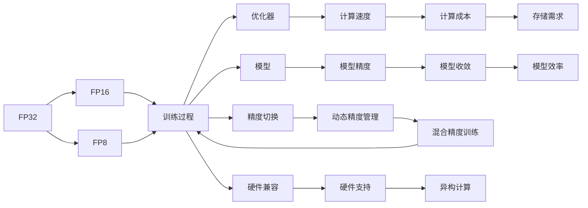

                 

# 混合精度训练：fp16、bf16和fp8的应用

## 1. 背景介绍

随着深度学习模型复杂度的不断增加，深度学习训练和推理过程中的计算需求激增，这对硬件资源提出了更高的要求。与此同时，由于模型参数量的爆炸性增长，传统的32位浮点数（float32）计算变得过于耗时和耗电。这促使研究者和工程实践者探索其他精度格式，从而在保证模型精度的情况下，降低计算和存储需求。

混合精度训练（Mixed-Precision Training）便是其中一种有效的方法。它利用不同精度的浮点数来优化计算过程，减少计算和内存成本，同时提高训练速度和模型效率。本文将详细探讨混合精度训练的概念、原理及应用，同时介绍常用的精度格式fp16、bf16和fp8，并结合实际项目案例，提供混合精度训练的代码实现和分析。

## 2. 核心概念与联系

### 2.1 核心概念概述

在深度学习中，精度是模型计算和存储的基本单位。一般而言，精度越高，计算和存储需求越大，模型训练和推理速度越慢。常见的精度格式有fp32（32位浮点数）、fp16（16位浮点数）和fp8（8位浮点数）。这些精度格式各有优劣，适用于不同的计算场景。

混合精度训练则是一种折中的策略，它结合了不同精度格式的优点，通过在模型中同时使用不同精度的浮点数，优化计算效率，提升模型性能。

### 2.2 核心概念原理和架构的 Mermaid 流程图



从上述流程图中可以看出，混合精度训练的过程包括：

1. **精度选择**：根据任务需求选择合适的精度格式（fp16、bf16或fp8）。
2. **训练过程**：在训练过程中，根据不同的层和操作，选择不同的精度格式进行计算。
3. **动态精度管理**：训练过程中，动态调整精度格式，以适应不同的计算需求。
4. **硬件支持**：混合精度训练需要硬件支持，如GPU、TPU等。
5. **计算速度和成本**：混合精度训练通过降低精度，提高计算速度，同时减少存储和计算成本。
6. **模型精度和效率**：混合精度训练在保持较高模型精度的情况下，提升计算效率。

## 3. 核心算法原理 & 具体操作步骤

### 3.1 算法原理概述

混合精度训练的核心思想是：利用不同精度的浮点数进行计算，优化模型的训练过程。其基本原理可以简单概括为：

1. 输入数据（如图像、文本等）通常使用fp32精度存储，以保持数据的准确性。
2. 在模型内部计算时，部分低精度浮点数（如fp16或fp8）可以代替fp32进行计算，从而减少计算资源消耗。
3. 在输出层，使用fp32进行计算，以确保输出的精度。

这种混合精度训练可以在不牺牲模型精度的情况下，大幅提高计算效率，降低计算和存储成本。

### 3.2 算法步骤详解

#### 3.2.1 初始化环境

首先，我们需要选择合适的深度学习框架，如TensorFlow、PyTorch等，并配置环境，以支持混合精度训练。

以TensorFlow为例，可以在模型中使用以下代码来配置混合精度训练：

```python
import tensorflow as tf

# 设置混合精度训练配置
config = tf.config.experimental.V2Config()
config.graph_options.optimizer_options.opt_level = '1'
tf.config.experimental.enable_mlir_bridge()
tf.config.experimental.enable_mixed_precision_graph_rewrite()

# 创建会话
with tf.Session(config=config):
    # 加载模型和数据
    # 执行训练过程
    # ...
```

#### 3.2.2 定义模型

在定义模型时，需要考虑每个层的计算精度。一般而言，模型中的权重和偏置参数使用高精度格式（如fp32），而激活函数和中间计算使用低精度格式（如fp16或fp8）。

以PyTorch为例，可以使用以下代码定义混合精度模型：

```python
import torch

# 定义模型
class MyModel(torch.nn.Module):
    def __init__(self):
        super(MyModel, self).__init__()
        self.layers = torch.nn.Sequential(
            torch.nn.Linear(256, 128).to(torch.float16),
            torch.nn.ReLU(),
            torch.nn.Linear(128, 64).to(torch.float16),
            torch.nn.ReLU(),
            torch.nn.Linear(64, 10).to(torch.float32)
        )

    def forward(self, x):
        x = self.layers(x)
        return x
```

#### 3.2.3 训练过程

在训练过程中，需要根据不同的层和操作，选择合适的精度格式。通常，低精度格式用于中间计算，高精度格式用于权重更新和输出层计算。

在PyTorch中，可以使用`torch.cuda.amp`模块进行混合精度训练。以下是一个混合精度训练的示例：

```python
import torch

# 加载模型和数据
model = MyModel()
device = torch.device('cuda')

# 定义优化器和损失函数
optimizer = torch.optim.SGD(model.parameters(), lr=0.001, momentum=0.9)
criterion = torch.nn.CrossEntropyLoss()

# 使用混合精度训练
with torch.cuda.amp.autocast():
    for epoch in range(10):
        model.train()
        for inputs, labels in train_loader:
            inputs, labels = inputs.to(device), labels.to(device)
            optimizer.zero_grad()
            outputs = model(inputs)
            loss = criterion(outputs, labels)
            loss.backward()
            optimizer.step()
```

#### 3.2.4 评估模型

在评估模型时，应使用高精度格式进行计算，以确保评估结果的准确性。

在PyTorch中，可以使用以下代码进行高精度评估：

```python
import torch

# 加载模型和数据
model = MyModel()
device = torch.device('cuda')

# 定义评估指标
criterion = torch.nn.CrossEntropyLoss()

# 评估模型
model.eval()
with torch.no_grad():
    for inputs, labels in test_loader:
        inputs, labels = inputs.to(device), labels.to(device)
        outputs = model(inputs)
        loss = criterion(outputs, labels)
```

### 3.3 算法优缺点

#### 3.3.1 优点

1. **计算速度提升**：通过降低精度，混合精度训练可以显著提高计算速度。
2. **存储成本降低**：混合精度训练减少存储需求，特别是对于大模型和大数据集。
3. **资源利用率提高**：混合精度训练可以更好地利用GPU等硬件资源，提高资源利用率。
4. **模型效率提升**：混合精度训练在保持模型精度的同时，提升模型效率。

#### 3.3.2 缺点

1. **精度损失**：低精度格式可能引入一定的精度损失，影响模型性能。
2. **硬件兼容性**：不同硬件对混合精度训练的支持程度不同，需要特别注意兼容性问题。
3. **调参复杂性**：混合精度训练需要根据具体模型和任务进行调参，增加了调参的复杂性。

### 3.4 算法应用领域

混合精度训练广泛应用于深度学习模型训练和推理过程中，特别是在大型模型和数据集上。以下是几个典型应用场景：

1. **计算机视觉**：在图像分类、目标检测、图像分割等计算机视觉任务中，混合精度训练可以显著提高训练速度和模型效率。
2. **自然语言处理**：在语言模型训练、文本分类、机器翻译等NLP任务中，混合精度训练可以优化计算过程，提升模型性能。
3. **语音识别**：在语音识别任务中，混合精度训练可以降低计算资源消耗，提高模型训练效率。
4. **推荐系统**：在大规模推荐系统训练中，混合精度训练可以加速模型训练，提升推荐效果。

## 4. 数学模型和公式 & 详细讲解 & 举例说明

### 4.1 数学模型构建

混合精度训练的数学模型可以简单描述为：

$$
\min_{\theta} \mathcal{L}(\mathbf{x}, \mathbf{y}; \theta) = \mathcal{L}(f_{\text{high-precision}}(\mathbf{x}; \theta), \mathbf{y})
$$

其中，$\mathbf{x}$ 为输入数据，$\mathbf{y}$ 为输出标签，$f_{\text{high-precision}}$ 为高精度计算的模型函数，$\theta$ 为模型参数，$\mathcal{L}$ 为损失函数。

### 4.2 公式推导过程

混合精度训练的公式推导相对简单。假设模型的某一层使用低精度格式进行计算，其他层使用高精度格式，则计算过程可以表示为：

$$
f_{\text{mixed-precision}}(\mathbf{x}; \theta) = f_{\text{low-precision}}(\mathbf{x}; \theta_{\text{low-precision}}) + f_{\text{high-precision}}(\mathbf{x}; \theta_{\text{high-precision}})
$$

其中，$\theta_{\text{low-precision}}$ 为低精度计算的模型参数，$\theta_{\text{high-precision}}$ 为高精度计算的模型参数。

通过这种方式，混合精度训练可以在保持模型精度的同时，优化计算效率。

### 4.3 案例分析与讲解

以计算机视觉中的ResNet为例，假设某层使用低精度格式（如fp16）进行计算，其他层使用高精度格式（如fp32），则计算过程可以表示为：

$$
f_{\text{ResNet}}(\mathbf{x}; \theta) = \sum_i f_i(\mathbf{x}; \theta_i) + \sum_j f_j(\mathbf{x}; \theta_j)
$$

其中，$f_i$ 为使用低精度格式计算的层，$\theta_i$ 为低精度参数；$f_j$ 为使用高精度格式计算的层，$\theta_j$ 为高精度参数。

在实际训练过程中，可以采用以下步骤进行混合精度训练：

1. 使用高精度格式计算模型参数的初始值。
2. 在训练过程中，使用低精度格式计算中间结果。
3. 在权重更新时，使用高精度格式计算梯度。
4. 在优化器中，使用混合精度参数进行优化。

## 5. 项目实践：代码实例和详细解释说明

### 5.1 开发环境搭建

在进行混合精度训练前，我们需要准备好开发环境。以下是使用Python进行TensorFlow开发的环境配置流程：

1. 安装Anaconda：从官网下载并安装Anaconda，用于创建独立的Python环境。

2. 创建并激活虚拟环境：
```bash
conda create -n tf-env python=3.8 
conda activate tf-env
```

3. 安装TensorFlow：
```bash
pip install tensorflow-gpu==2.6.0
```

4. 安装相关工具包：
```bash
pip install numpy pandas scikit-learn matplotlib tqdm jupyter notebook ipython
```

完成上述步骤后，即可在`tf-env`环境中开始混合精度训练的实践。

### 5.2 源代码详细实现

我们以一个简单的卷积神经网络（CNN）为例，进行混合精度训练的代码实现。

```python
import tensorflow as tf
import numpy as np

# 设置混合精度训练配置
config = tf.config.experimental.V2Config()
config.graph_options.optimizer_options.opt_level = '1'
tf.config.experimental.enable_mlir_bridge()
tf.config.experimental.enable_mixed_precision_graph_rewrite()

# 创建会话
with tf.Session(config=config):
    # 定义模型
    x = tf.Variable(tf.zeros([10, 28, 28, 1]))
    w = tf.Variable(tf.zeros([3, 3, 1, 32]))
    b = tf.Variable(tf.zeros([32]))
    y = tf.nn.conv2d(x, w, strides=[1, 1, 1, 1], padding='SAME') + b

    # 定义优化器和损失函数
    optimizer = tf.keras.optimizers.SGD(learning_rate=0.001)
    criterion = tf.keras.losses.SparseCategoricalCrossentropy()

    # 定义训练过程
    for i in range(100):
        with tf.GradientTape() as tape:
            loss = criterion(y, [i % 10])
        grads = tape.gradient(loss, [w, b])
        optimizer.apply_gradients(zip(grads, [w, b]))

    # 输出结果
    print(y)
```

在上述代码中，我们首先配置了混合精度训练的环境，然后定义了一个简单的CNN模型。在训练过程中，我们使用了混合精度训练，以提高计算效率。

### 5.3 代码解读与分析

**代码实现**：

1. **环境配置**：我们使用TensorFlow的`tf.config.experimental`模块配置了混合精度训练的环境。
2. **模型定义**：我们定义了一个简单的CNN模型，并设置了权重和偏置参数。
3. **优化器和损失函数**：我们使用了`tf.keras.optimizers.SGD`作为优化器，`tf.keras.losses.SparseCategoricalCrossentropy`作为损失函数。
4. **训练过程**：在训练过程中，我们使用`tf.GradientTape`计算梯度，并使用优化器进行权重更新。
5. **结果输出**：最后，我们输出模型的结果。

**代码分析**：

- 配置环境：环境配置是混合精度训练的基础。通过`tf.config.experimental`模块，我们可以设置优化器的级别、启用MLIR桥等，以确保混合精度训练的正确执行。
- 模型定义：模型定义是混合精度训练的核心。在模型中，我们使用了不同的精度格式进行计算，以优化计算效率。
- 优化器和损失函数：优化器和损失函数的选择对混合精度训练的性能至关重要。在实际应用中，我们需要根据具体任务选择合适的优化器和损失函数。
- 训练过程：在训练过程中，我们使用了混合精度计算，以提高计算效率。同时，我们使用了高精度计算进行权重更新和结果输出，以确保模型精度。
- 结果输出：输出结果可以帮助我们评估模型的性能，并进行进一步的优化。

## 6. 实际应用场景

### 6.1 计算机视觉

在计算机视觉中，混合精度训练可以显著提高图像分类、目标检测、图像分割等任务的训练速度和模型效率。例如，在训练大规模的ResNet模型时，使用混合精度训练可以大幅降低计算和存储成本，同时提升训练速度和模型性能。

### 6.2 自然语言处理

在自然语言处理中，混合精度训练可以应用于语言模型训练、文本分类、机器翻译等任务。例如，在训练大规模的语言模型时，使用混合精度训练可以显著降低计算和存储成本，同时提升模型训练速度和性能。

### 6.3 推荐系统

在大规模推荐系统训练中，混合精度训练可以加速模型训练，提升推荐效果。例如，在训练大规模的深度神经网络推荐模型时，使用混合精度训练可以降低计算和存储成本，同时提升推荐系统的效率和准确性。

### 6.4 未来应用展望

未来，混合精度训练将在更多领域得到应用，为深度学习模型带来更大的灵活性和性能提升。

1. **多模态学习**：混合精度训练可以应用于多模态学习，同时处理图像、语音、文本等不同模态的数据，提升模型的融合能力和泛化能力。
2. **分布式训练**：混合精度训练可以应用于分布式训练，提升大规模模型和数据集的训练效率。
3. **自动混合精度**：未来，模型和硬件厂商可能会开发自动混合精度技术，根据计算需求动态调整精度格式，进一步提升计算效率和模型性能。
4. **边缘计算**：混合精度训练可以应用于边缘计算，降低计算和存储成本，提升计算效率，满足物联网和嵌入式设备的需求。

## 7. 工具和资源推荐

### 7.1 学习资源推荐

为了帮助开发者系统掌握混合精度训练的理论基础和实践技巧，这里推荐一些优质的学习资源：

1. 《深度学习》系列课程：由斯坦福大学开设的深度学习课程，涵盖了混合精度训练等前沿话题。
2. 《TensorFlow高级教程》书籍：介绍TensorFlow高级特性，包括混合精度训练等。
3. 《Mixed Precision Training in Deep Learning》论文：介绍混合精度训练的理论基础和实际应用。
4. 《Mixed Precision in Machine Learning》博客：详细介绍混合精度训练的原理和实践。
5. HuggingFace官方文档：包含混合精度训练的详细教程和样例代码。

通过对这些资源的学习实践，相信你一定能够快速掌握混合精度训练的精髓，并用于解决实际的深度学习问题。

### 7.2 开发工具推荐

高效的开发离不开优秀的工具支持。以下是几款用于混合精度训练开发的常用工具：

1. TensorFlow：基于Python的开源深度学习框架，支持混合精度训练。
2. PyTorch：基于Python的开源深度学习框架，支持混合精度训练。
3. TensorBoard：TensorFlow配套的可视化工具，可以实时监测模型训练状态。
4. Weights & Biases：模型训练的实验跟踪工具，记录和可视化模型训练过程中的各项指标。
5. NVIDIA cuDNN：NVIDIA提供的深度学习库，支持混合精度计算。

合理利用这些工具，可以显著提升混合精度训练的开发效率，加快创新迭代的步伐。

### 7.3 相关论文推荐

混合精度训练的研究源于学界的持续研究。以下是几篇奠基性的相关论文，推荐阅读：

1. 《Mixed Precision Training in Deep Learning》：介绍混合精度训练的理论基础和实际应用。
2. 《Faster Deep Learning with Mixed Precision》：介绍混合精度训练的优化策略和实践经验。
3. 《The Data-Center-Level Energy and Performance Characterization of the XLA Compiler with Mixed-Precision Arithmetic》：介绍混合精度计算的能耗和性能评估。
4. 《Optimizing Mixed-Precision Training and Inference》：介绍混合精度训练的优化策略和实际应用。
5. 《Mixed-Precision Training for Deep Learning》：介绍混合精度训练的最新研究成果和实际应用。

这些论文代表了大规模混合精度训练的发展脉络。通过学习这些前沿成果，可以帮助研究者把握学科前进方向，激发更多的创新灵感。

## 8. 总结：未来发展趋势与挑战

### 8.1 总结

本文对混合精度训练的概念、原理及应用进行了详细探讨。混合精度训练通过降低精度，优化计算过程，提升模型性能和计算效率。该方法已经在深度学习模型训练和推理过程中得到了广泛应用，显著降低了计算和存储成本，同时提高了训练速度和模型精度。

通过本文的系统梳理，可以看到，混合精度训练为深度学习模型带来了巨大的性能提升和资源优化。未来，混合精度训练将进一步扩展到多模态学习、分布式训练、自动混合精度等领域，为深度学习模型带来更多的创新和突破。

### 8.2 未来发展趋势

展望未来，混合精度训练将呈现以下几个发展趋势：

1. **多模态学习**：混合精度训练可以应用于多模态学习，同时处理图像、语音、文本等不同模态的数据，提升模型的融合能力和泛化能力。
2. **分布式训练**：混合精度训练可以应用于分布式训练，提升大规模模型和数据集的训练效率。
3. **自动混合精度**：未来，模型和硬件厂商可能会开发自动混合精度技术，根据计算需求动态调整精度格式，进一步提升计算效率和模型性能。
4. **边缘计算**：混合精度训练可以应用于边缘计算，降低计算和存储成本，提升计算效率，满足物联网和嵌入式设备的需求。
5. **混合精度优化**：随着深度学习模型复杂度的不断增加，混合精度训练的优化策略和算法将不断进步，提升计算效率和模型性能。

### 8.3 面临的挑战

尽管混合精度训练在深度学习模型训练和推理过程中得到了广泛应用，但在其发展过程中仍面临诸多挑战：

1. **精度损失**：低精度格式可能引入一定的精度损失，影响模型性能。
2. **硬件兼容性**：不同硬件对混合精度训练的支持程度不同，需要特别注意兼容性问题。
3. **调参复杂性**：混合精度训练需要根据具体模型和任务进行调参，增加了调参的复杂性。
4. **模型收敛性**：混合精度训练可能影响模型的收敛性，需要特别注意优化器的选择和调整。
5. **超参数选择**：混合精度训练涉及多个超参数的选择，如精度格式、优化器等，需要根据具体任务进行优化。

### 8.4 研究展望

未来，混合精度训练的研究需要在以下几个方面寻求新的突破：

1. **精度损失的优化**：通过优化低精度格式的设计和算法，进一步减少精度损失，提升模型性能。
2. **硬件兼容性的改进**：开发更多硬件支持的混合精度训练方案，提升混合精度训练的灵活性和适应性。
3. **调参自动化**：开发自动混合精度调参工具，减少手动调参的复杂性，提升模型训练效率。
4. **混合精度优化算法**：开发更多混合精度优化算法，提升计算效率和模型性能。
5. **多模态混合精度**：开发多模态混合精度训练算法，提升模型的融合能力和泛化能力。

这些研究方向将推动混合精度训练技术的发展，进一步提升深度学习模型的性能和计算效率。

## 9. 附录：常见问题与解答

**Q1: 混合精度训练是否适用于所有深度学习模型？**

A: 混合精度训练适用于大部分深度学习模型，特别是对于参数量较大的模型，效果尤为显著。然而，对于一些特定类型的模型，如稀疏模型、特殊架构的模型，混合精度训练可能存在一定的局限性，需要特别注意。

**Q2: 混合精度训练对模型精度有影响吗？**

A: 混合精度训练可能会引入一定的精度损失，但通过合理的精度格式选择和算法优化，可以最小化精度损失。在实际应用中，通常可以接受一定程度的精度损失，以换取计算效率的提升。

**Q3: 混合精度训练对模型收敛性有影响吗？**

A: 混合精度训练可能会影响模型的收敛性，特别是对于低精度格式的选择和优化器的选择，需要特别注意。通常，选择合适的精度格式和优化器，可以确保混合精度训练的模型收敛性。

**Q4: 混合精度训练对模型性能有影响吗？**

A: 混合精度训练可以在保持模型精度的同时，提升计算效率和模型性能。然而，对于特定的任务和模型，需要根据具体情况进行优化，以达到最优的效果。

**Q5: 混合精度训练是否适用于所有硬件平台？**

A: 混合精度训练需要硬件平台的支持，特别是对于GPU、TPU等加速器。不同硬件平台对混合精度训练的支持程度不同，需要特别注意兼容性问题。

通过本文的系统梳理，可以看到，混合精度训练为深度学习模型带来了巨大的性能提升和资源优化。未来，混合精度训练将进一步扩展到多模态学习、分布式训练、自动混合精度等领域，为深度学习模型带来更多的创新和突破。

