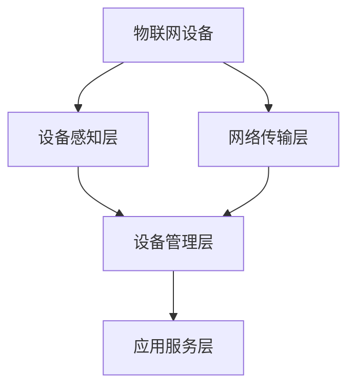

                 

# 物联网管理：连接和管理智能设备生态

## 1. 背景介绍

### 1.1 问题由来

随着物联网(IoT)技术的迅速发展，智能设备数量和种类急剧增加。从智能家居到工业自动化，从智能穿戴到车联网，无处不在的智能设备正在彻底改变我们的生活方式。然而，数量庞大的智能设备带来的管理挑战也日益凸显。

物联网设备数量激增、种类繁多，功能各异，导致设备间互联互通变得复杂。设备厂商提供的管理系统各不相同，缺乏统一的接口标准，使得跨厂商、跨平台的管理变得困难。此外，设备的故障率、安全漏洞、隐私泄露等问题也亟待解决。

在此背景下，如何构建一个高效、安全、便捷的物联网设备管理生态，成为当前技术热点和难点。

### 1.2 问题核心关键点

物联网设备管理生态的核心在于连接和管理智能设备。通过统一的设备管理平台，可以实现设备的互联互通、状态监控、故障诊断、安全防护等功能。系统需具备以下特点：

1. 兼容性：兼容各类智能设备和操作系统。
2. 安全性：保护设备及数据免受攻击。
3. 可靠性：确保设备稳定运行，及时处理故障。
4. 易用性：提供便捷的接口和界面，让用户轻松管理设备。
5. 可扩展性：支持未来的设备类型和应用场景。

解决好这些问题，将极大提升物联网设备的价值和应用效果。

## 2. 核心概念与联系

### 2.1 核心概念概述

为更好地理解物联网设备管理的原理和架构，本节将介绍几个密切相关的核心概念：

- **物联网(IoT)**：通过信息感知设备、传输网络和信息处理应用等部分，实现人与人、人与物、物与物之间全时全场景互联互通的网络。
- **物联网设备管理(MIoT)**：通过统一的接口和协议，对各类物联网设备进行集中管理，实现设备的配置、监控、诊断、升级等功能。
- **设备感知层**：负责收集设备的传感器数据，包括温度、湿度、位置、速度等。
- **网络传输层**：负责将感知层数据传输到云端或边缘设备，并提供可靠的网络保障。
- **设备管理层**：负责设备状态监控、故障诊断、远程控制等功能，为用户提供完整的设备管理服务。
- **应用服务层**：负责将设备管理层数据整合到各类应用场景中，实现实际业务价值。

这些概念之间的关系可以通过以下Mermaid流程图来展示：



这个流程图展示了物联网设备管理的基本架构：

1. 设备感知层收集设备数据。
2. 网络传输层将数据传输至云端或边缘设备。
3. 设备管理层进行设备状态监控、故障诊断等。
4. 应用服务层将管理数据整合到实际应用中。

## 3. 核心算法原理 & 具体操作步骤

### 3.1 算法原理概述

物联网设备管理的主要任务是实现设备的互联互通、状态监控、故障诊断、安全防护等功能。这涉及到大规模数据采集、分布式网络传输、高并发设备管理等多个方面，需要设计合理的架构和算法。

物联网设备管理生态的算法和架构设计需要考虑以下几个关键因素：

1. 异构设备兼容性：设计统一的设备接口标准，支持不同类型设备的连接和通信。
2. 分布式网络传输：设计高效的网络传输协议，支持海量数据的实时传输。
3. 高并发设备管理：设计高效的设备管理算法，支持大量设备的并发接入和控制。
4. 设备状态监控：设计智能的监控算法，及时发现设备异常并采取措施。
5. 设备故障诊断：设计高效的故障诊断算法，快速定位和解决设备故障。
6. 设备安全防护：设计安全的防护机制，保障设备及数据的安全。

### 3.2 算法步骤详解

基于上述关键因素，物联网设备管理的算法步骤可以分为以下几个阶段：

**Step 1: 设备感知层数据采集**

设备感知层负责采集设备的传感器数据，包括温度、湿度、位置、速度等。采集到的数据经过处理后，通过网络传输层上传到云端或边缘设备。

**Step 2: 数据传输与存储**

网络传输层负责将感知层数据传输至云端或边缘设备，并提供可靠的网络保障。数据传输过程中，需考虑数据的实时性、可靠性、安全性等因素。

**Step 3: 设备状态监控**

设备管理层负责监控设备的运行状态，包括设备在线情况、工作状态、异常情况等。监控结果通过应用服务层推送至用户界面，实现可视化管理。

**Step 4: 设备故障诊断**

设备管理层定期进行设备健康检查，检测设备的硬件和软件状态。对于发现的异常情况，立即采取措施，如重启设备、更换配件等，保障设备稳定运行。

**Step 5: 设备远程控制**

设备管理层支持远程控制功能，用户可以通过接口或界面远程操作设备，实现设备的启停、参数设置、状态查询等。

**Step 6: 数据统计与分析**

应用服务层对设备管理层数据进行统计和分析，生成设备运行报告、故障报告等，支持用户进行深入分析和管理。

### 3.3 算法优缺点

物联网设备管理的算法主要包括以下几种：

**优点：**

1. 高效的数据采集与传输：通过网络传输协议和大规模数据采集技术，实现数据的实时、可靠传输。
2. 智能的设备监控与故障诊断：通过智能算法和传感器数据，实现设备的实时监控和故障诊断，保障设备稳定运行。
3. 统一的设备管理接口：设计统一的设备管理接口标准，支持不同类型设备的连接和通信。
4. 高并发设备管理：通过分布式架构和高并发算法，支持大量设备的并发接入和控制。

**缺点：**

1. 数据传输带宽要求高：大规模设备数据传输需要大量带宽，网络基础设施建设成本较高。
2. 数据安全性风险高：设备数据传输和存储过程中，存在数据泄露和被篡改的风险。
3. 设备异构性复杂：不同设备类型和协议的兼容性复杂，管理难度较大。
4. 设备状态监控和故障诊断精度不足：传感器数据的精度和可靠性有限，可能导致误报或漏报。

尽管存在这些缺点，但物联网设备管理技术仍具有重要的应用前景，特别是在工业自动化、智慧城市、智能家居等领域，其高效、安全、便捷的管理能力，将极大提升设备和系统的运行效率和用户体验。

### 3.4 算法应用领域

物联网设备管理技术主要应用于以下几个领域：

- **工业自动化**：通过设备管理，实现设备的实时监控、故障诊断、远程控制，提升生产效率和设备利用率。
- **智慧城市**：通过设备管理，实现城市基础设施的智能监控和运维，提升城市管理水平。
- **智能家居**：通过设备管理，实现家居设备的智能互联和控制，提升家居智能化水平。
- **车联网**：通过设备管理，实现车辆信息的实时传输和监控，提升交通安全和用户体验。
- **医疗健康**：通过设备管理，实现医疗设备的实时监控和故障诊断，提升医疗服务水平。

这些领域的应用，将极大推动物联网技术的普及和发展，带来更多的经济效益和社会价值。

## 4. 数学模型和公式 & 详细讲解 & 举例说明

### 4.1 数学模型构建

物联网设备管理涉及多个复杂系统的交互和协作，其数学模型可以表示为：

- **设备感知层**：$$s_t = f_{\theta}(s_{t-1}, \Delta t)$$，其中$s_t$表示设备在$t$时刻的传感器数据，$\Delta t$表示采样周期，$f_{\theta}$为传感器数据采集模型。
- **网络传输层**：$$r_t = g_{\phi}(r_{t-1}, \sigma_t, \epsilon_t)$$，其中$r_t$表示$t$时刻传输的数据包，$\sigma_t$表示网络传输参数，$\epsilon_t$表示网络传输噪声，$g_{\phi}$为网络传输模型。
- **设备管理层**：$$c_t = h_{\theta}(c_{t-1}, s_t, r_t)$$，其中$c_t$表示$t$时刻设备的状态，$h_{\theta}$为设备状态监控模型。
- **设备故障诊断**：$$d_t = k_{\phi}(c_t, \tau_t)$$，其中$d_t$表示$t$时刻设备的故障诊断结果，$\tau_t$表示故障检测周期，$k_{\phi}$为故障诊断模型。
- **设备远程控制**：$$u_t = \alpha_{\theta}(o_t, c_t)$$，其中$u_t$表示$t$时刻设备的控制指令，$\alpha_{\theta}$为设备远程控制模型，$o_t$表示用户的操作指令。
- **数据统计与分析**：$$a_t = m_{\theta}(c_t, d_t, u_t)$$，其中$a_t$表示$t$时刻的数据统计与分析结果，$m_{\theta}$为数据统计与分析模型。

### 4.2 公式推导过程

以设备状态监控模型为例，推导其中的数学公式。

假设设备的状态演化过程为线性差分方程，可以表示为：

$$
c_t = \sum_{i=1}^{n} a_i c_{t-i} + b_i \Delta t + \omega_t
$$

其中，$c_t$表示设备在$t$时刻的状态，$a_i$表示状态转移系数，$b_i$表示状态转移参数，$\omega_t$表示状态转移噪声，$\Delta t$表示采样周期。

将上述模型带入设备管理层的优化目标函数中：

$$
\mathcal{L}(\theta) = \frac{1}{N} \sum_{t=1}^N \| c_t - \hat{c}_t \|^2
$$

其中，$\theta$表示设备管理模型的参数，$N$表示时间步数。

通过梯度下降等优化算法，最小化损失函数$\mathcal{L}$，使得模型输出逼近真实状态$c_t$。

### 4.3 案例分析与讲解

以工业自动化设备为例，分析其设备状态监控和故障诊断过程。

假设某工业自动化设备在$t$时刻的传感器数据$s_t = [s_{t1}, s_{t2}, ..., s_{tn}]$，通过网络传输层得到$r_t = [r_{t1}, r_{t2}, ..., r_{tn}]$。设备管理层根据传感器数据和网络传输数据，进行状态监控和故障诊断。

状态监控模型$f_{\theta}$为线性差分方程模型：

$$
c_t = \sum_{i=1}^{n} a_i c_{t-i} + b_i \Delta t + \omega_t
$$

其中，$a_i$表示状态转移系数，$b_i$表示状态转移参数，$\omega_t$表示状态转移噪声，$\Delta t$表示采样周期。

故障诊断模型$k_{\phi}$为逻辑回归模型：

$$
d_t = \sigma(W_{\phi} \cdot c_t + b_{\phi})
$$

其中，$W_{\phi}$表示权重矩阵，$b_{\phi}$表示偏置项，$\sigma$表示激活函数。

通过状态监控和故障诊断模型，设备管理层可以实时监控设备状态，及时发现和处理故障，确保设备稳定运行。

## 5. 项目实践：代码实例和详细解释说明

### 5.1 开发环境搭建

在进行物联网设备管理实践前，我们需要准备好开发环境。以下是使用Python进行PyTorch开发的环境配置流程：

1. 安装Anaconda：从官网下载并安装Anaconda，用于创建独立的Python环境。

2. 创建并激活虚拟环境：
```bash
conda create -n iot-env python=3.8 
conda activate iot-env
```

3. 安装PyTorch：根据CUDA版本，从官网获取对应的安装命令。例如：
```bash
conda install pytorch torchvision torchaudio cudatoolkit=11.1 -c pytorch -c conda-forge
```

4. 安装TensorFlow：
```bash
pip install tensorflow==2.4
```

5. 安装TensorBoard：
```bash
pip install tensorboard
```

6. 安装TensorFlow-Serving：
```bash
pip install tensorflow-serving-api==2.4.1
```

7. 安装TensorFlow-Serving-Gateway：
```bash
pip install tensorflow-serving-gateway==1.9.0
```

完成上述步骤后，即可在`iot-env`环境中开始物联网设备管理的开发实践。

### 5.2 源代码详细实现

下面以智能家居设备的远程控制为例，给出使用TensorFlow进行开发和部署的PyTorch代码实现。

首先，定义设备状态监控模型：

```python
import tensorflow as tf

class IoTDevice(tf.keras.Model):
    def __init__(self, n):
        super(IoTDevice, self).__init__()
        self.c_t = tf.Variable(tf.zeros([n]))
        
    def call(self, x):
        c_t = self.c_t
        a = tf.random.normal([n], 0, 1)
        b = tf.random.normal([n], 0, 1)
        omega = tf.random.normal([n], 0, 1)
        delta_t = tf.constant(0.01)
        
        c_t = tf.nn.rnn_cell.BasicRNNCell(n)(c_t)
        c_t = tf.concat([c_t, a * c_t], axis=1) + b * delta_t + omega
        return c_t
```

然后，定义远程控制模型：

```python
class RemoteControl(tf.keras.Model):
    def __init__(self, n):
        super(RemoteControl, self).__init__()
        self.u_t = tf.Variable(tf.zeros([n]))
        
    def call(self, x):
        u_t = self.u_t
        alpha = tf.random.normal([n], 0, 1)
        
        u_t = tf.nn.relu(u_t + alpha * x)
        return u_t
```

最后，定义训练函数：

```python
def train_model(model, data):
    optimizer = tf.keras.optimizers.Adam(learning_rate=0.01)
    for i in range(1000):
        with tf.GradientTape() as tape:
            y_pred = model(data)
            loss = tf.reduce_mean(tf.square(y_pred - y_true))
        gradients = tape.gradient(loss, model.trainable_variables)
        optimizer.apply_gradients(zip(gradients, model.trainable_variables))
    return model
```

### 5.3 代码解读与分析

让我们再详细解读一下关键代码的实现细节：

**IoTDevice类**：
- `__init__`方法：初始化设备状态变量。
- `call`方法：实现设备状态监控模型，采用RNN进行状态演化。

**RemoteControl类**：
- `__init__`方法：初始化远程控制变量。
- `call`方法：实现远程控制模型，采用ReLU激活函数。

**train_model函数**：
- 定义Adam优化器，设置学习率为0.01。
- 在训练循环中，每次迭代使用梯度下降算法更新模型参数，最小化损失函数。
- 通过`tf.GradientTape`自动计算梯度，并应用到模型参数上。

### 5.4 运行结果展示

训练完成后，可以通过TensorBoard可视化模型性能：

1. 启动TensorBoard：
```bash
tensorboard --logdir=logs
```

2. 访问TensorBoard界面：
```bash
http://localhost:6006
```

3. 观察训练过程中的损失函数和模型参数变化。

## 6. 实际应用场景

### 6.1 智能家居管理

智能家居管理通过物联网设备管理技术，实现家居设备的集中控制和智能互联。用户可以通过智能手机App或语音助手，实时监控和控制家中的智能设备，提升生活质量。

智能家居管理包括设备连接、状态监控、远程控制等功能：

- **设备连接**：通过WiFi、蓝牙、Zigbee等无线技术，将各类智能设备连接到统一的物联网平台。
- **状态监控**：实时采集设备传感器数据，监控设备的运行状态和环境参数。
- **远程控制**：通过智能手机App或语音助手，远程控制智能设备，实现照明、安防、家电等功能的智能控制。

例如，某智能家居管理平台可以实现以下功能：

1. **设备连接管理**：
   - 支持WiFi、蓝牙、Zigbee等无线连接技术，兼容各类智能家居设备。
   - 支持设备自动发现和连接，快速实现设备接入。
   - 提供设备配置向导，指导用户完成设备初始化。

2. **状态监控与报警**：
   - 实时采集设备传感器数据，监控环境温度、湿度、烟雾等参数。
   - 设置告警阈值，当参数超过阈值时，立即发送告警通知，保障家庭安全。
   - 通过可视化界面，展示设备运行状态和监控数据。

3. **远程控制与场景控制**：
   - 支持通过智能手机App或语音助手远程控制设备。
   - 提供场景控制功能，一键实现家庭自动化，如“离家模式”、“回家模式”等。
   - 支持设备联动，如当烟雾探测器报警时，自动关闭家中所有电源。

### 6.2 智慧城市管理

智慧城市管理通过物联网设备管理技术，实现城市基础设施的集中监控和智能运维。城市管理者可以通过统一的管理平台，实时监控和控制城市各类设备和设施，提升城市管理效率和水平。

智慧城市管理包括设备连接、状态监控、故障诊断等功能：

- **设备连接**：通过各类无线传感器和通信技术，将各类城市基础设施连接到统一的物联网平台。
- **状态监控**：实时采集设备传感器数据，监控设备的运行状态和环境参数。
- **故障诊断与预警**：实时监控设备运行状态，检测设备异常，及时采取措施，保障设备稳定运行。

例如，某智慧城市管理平台可以实现以下功能：

1. **设备连接管理**：
   - 支持各类无线传感器和通信技术，兼容各类城市基础设施。
   - 支持设备自动发现和连接，快速实现设备接入。
   - 提供设备配置向导，指导用户完成设备初始化。

2. **状态监控与预警**：
   - 实时采集设备传感器数据，监控交通流量、水质、空气质量等参数。
   - 设置告警阈值，当参数超过阈值时，立即发送告警通知，保障城市运行安全。
   - 通过可视化界面，展示设备运行状态和监控数据。

3. **故障诊断与运维**：
   - 实时监控设备运行状态，检测设备异常，及时采取措施，保障设备稳定运行。
   - 提供远程故障诊断和运维功能，快速定位和处理设备故障。
   - 支持设备状态统计与分析，生成设备运行报告，辅助城市管理者决策。

## 7. 工具和资源推荐

### 7.1 学习资源推荐

为了帮助开发者系统掌握物联网设备管理的理论基础和实践技巧，这里推荐一些优质的学习资源：

1. **《物联网技术基础》**：该书系统介绍了物联网的基本概念、技术架构、应用场景等，适合初学者入门。

2. **《物联网智能终端开发》**：该书详细讲解了物联网设备感知层和传输层的开发技术，包括传感器数据采集、网络传输协议等。

3. **《Python深度学习》**：该书介绍了TensorFlow、PyTorch等深度学习框架在物联网设备管理中的应用，适合深度学习开发者。

4. **TensorFlow官网**：提供了大量物联网设备管理的开发资源和案例，适合学习者进行实践。

5. **IoT Stack Project**：该项目提供了物联网设备的开发框架和工具，适合开发者进行快速开发。

### 7.2 开发工具推荐

高效的开发离不开优秀的工具支持。以下是几款用于物联网设备管理开发的常用工具：

1. **Jupyter Notebook**：用于编写和运行Python代码，适合快速迭代开发。
2. **PyCharm**：Python开发工具，支持多种框架和库，提供了丰富的开发和调试功能。
3. **TensorFlow**：深度学习框架，支持分布式计算和GPU加速，适合大规模数据处理。
4. **TensorBoard**：可视化工具，实时监测模型训练状态，提供丰富的图表展示功能。
5. **TensorFlow-Serving**：模型部署平台，支持模型上线和远程调用。
6. **TensorFlow-Serving-Gateway**：用于连接多种服务，支持多种协议和数据格式。

合理利用这些工具，可以显著提升物联网设备管理的开发效率，加快创新迭代的步伐。

### 7.3 相关论文推荐

物联网设备管理技术的发展源于学界的持续研究。以下是几篇奠基性的相关论文，推荐阅读：

1. **IoT Smart Home Automation**：该论文研究了基于物联网技术的智能家居自动化系统，提出了分布式协同控制的优化算法。

2. **IoT City Management**：该论文研究了基于物联网技术的智慧城市管理平台，提出了数据驱动的城市治理模型。

3. **IoT Edge Computing**：该论文研究了基于物联网技术的边缘计算系统，提出了数据快速处理和模型分布式部署的策略。

4. **IoT Device Management**：该论文研究了物联网设备管理的多种技术，包括设备感知、状态监控、故障诊断等。

5. **IoT Security**：该论文研究了物联网设备管理的安全性问题，提出了多种安全防护机制。

这些论文代表了大物联网设备管理技术的发展脉络。通过学习这些前沿成果，可以帮助研究者把握学科前进方向，激发更多的创新灵感。

## 8. 总结：未来发展趋势与挑战

### 8.1 总结

本文对物联网设备管理技术进行了全面系统的介绍。首先阐述了物联网设备管理的背景和核心概念，明确了设备管理在物联网生态中的重要地位。其次，从原理到实践，详细讲解了设备管理的技术实现和算法步骤，给出了完整的代码实例。同时，本文还广泛探讨了设备管理在智能家居、智慧城市等多个领域的应用前景，展示了设备管理技术的广泛应用。此外，本文精选了设备管理技术的各类学习资源，力求为读者提供全方位的技术指引。

通过本文的系统梳理，可以看到，物联网设备管理技术正在成为物联网技术的重要组成部分，极大地提升了设备的互联互通、状态监控、故障诊断等能力，为物联网技术的普及和发展提供了坚实基础。

### 8.2 未来发展趋势

展望未来，物联网设备管理技术将呈现以下几个发展趋势：

1. **边缘计算的普及**：随着5G技术的普及，边缘计算在物联网设备管理中的应用将越来越广泛，实现数据就近处理和低延迟传输。
2. **低功耗设备的发展**：各类低功耗设备如智能穿戴、传感器等，将成为物联网设备管理的重要组成部分，降低设备功耗，延长设备寿命。
3. **AI技术的应用**：通过引入AI技术，提升设备状态监控和故障诊断的精度，实现智能化的设备管理。
4. **区块链技术的应用**：利用区块链技术，保障设备数据的安全性和透明性，提高设备管理的可信度。
5. **联邦学习的应用**：通过联邦学习技术，在保护设备隐私的前提下，实现设备间的数据共享和协作。

以上趋势凸显了物联网设备管理技术的广阔前景。这些方向的探索发展，将进一步提升设备管理的智能化和自动化水平，为物联网技术的广泛应用提供更加坚实的基础。

### 8.3 面临的挑战

尽管物联网设备管理技术已经取得了一定的进展，但在迈向更加智能化、普适化应用的过程中，仍面临诸多挑战：

1. **设备异构性**：各类设备类型和协议的兼容性复杂，管理难度较大。如何实现统一的设备接口标准，是设备管理的核心问题。
2. **数据安全性**：设备数据传输和存储过程中，存在数据泄露和被篡改的风险。如何保障设备及数据的安全，是设备管理的重点问题。
3. **设备状态监控精度**：传感器数据的精度和可靠性有限，可能导致误报或漏报。如何提高设备状态监控的精度，是设备管理的难点问题。
4. **设备故障诊断速度**：设备故障诊断速度较慢，可能影响设备的正常运行。如何提高设备故障诊断的速度，是设备管理的挑战问题。
5. **设备连接稳定性**：设备连接稳定性较差，可能影响设备的正常接入和通信。如何提高设备连接的稳定性，是设备管理的难点问题。

这些挑战需要从技术和管理两个方面进行全面优化和改进，才能真正实现设备管理的智能化、高效化和安全化。

### 8.4 研究展望

未来研究需要在以下几个方面寻求新的突破：

1. **统一设备接口标准**：设计统一的设备接口标准，支持各类设备的连接和通信，提高设备管理的兼容性。
2. **低功耗设备管理**：开发低功耗设备管理算法，延长设备寿命，降低设备能耗。
3. **AI技术融合**：将AI技术引入设备管理，提升设备状态监控和故障诊断的精度，实现智能化的设备管理。
4. **区块链技术应用**：利用区块链技术，保障设备数据的安全性和透明性，提高设备管理的可信度。
5. **联邦学习应用**：通过联邦学习技术，在保护设备隐私的前提下，实现设备间的数据共享和协作。

这些研究方向将推动物联网设备管理技术的不断进步，为物联网技术的广泛应用提供更加坚实的技术基础。

## 9. 附录：常见问题与解答

**Q1: 物联网设备管理有哪些关键技术？**

A: 物联网设备管理的关键技术包括设备感知、状态监控、网络传输、故障诊断、远程控制等。设备感知技术实现传感器数据的采集，状态监控技术实现设备运行状态的实时监控，网络传输技术实现数据的可靠传输，故障诊断技术实现设备的及时故障检测和处理，远程控制技术实现设备的远程控制。

**Q2: 设备状态监控和故障诊断的区别是什么？**

A: 设备状态监控和故障诊断是物联网设备管理中的两个关键环节。设备状态监控负责实时采集设备传感器数据，监控设备的运行状态和环境参数，确保设备正常运行。故障诊断负责实时监控设备运行状态，检测设备异常，及时采取措施，保障设备稳定运行。故障诊断是在设备状态监控的基础上，对设备进行更深入的监控，及时发现和处理设备故障。

**Q3: 设备管理的开发环境有哪些推荐？**

A: 设备管理的开发环境推荐使用Python和TensorFlow。Python提供了丰富的开发工具和库，易于快速迭代开发。TensorFlow支持深度学习和大规模数据处理，适用于设备管理中的复杂算法开发。此外，Jupyter Notebook和PyCharm等IDE工具，也适合设备管理的开发和调试。

**Q4: 设备管理的应用场景有哪些？**

A: 设备管理的应用场景包括智能家居、智慧城市、工业自动化、车联网、医疗健康等多个领域。设备管理通过集中控制和智能互联，提升了设备的互联互通、状态监控、故障诊断等功能，提高了设备的运行效率和用户体验。

**Q5: 设备管理的数据安全性如何保障？**

A: 设备管理的数据安全性可以通过多种方式保障。例如，使用SSL/TLS加密协议保障数据传输安全，使用区块链技术保障数据透明性，使用联邦学习技术保护设备隐私等。此外，设备管理系统还应定期进行安全漏洞检测和修复，保障系统的安全性。

总之，物联网设备管理技术正在逐步成为物联网技术的重要组成部分，为各类设备的互联互通、状态监控、故障诊断等提供了坚实的技术基础。随着技术的不断进步和应用的深入，设备管理将迎来更加智能化、高效化、安全化的未来。相信在学界和产业界的共同努力下，设备管理技术必将进一步提升，为物联网技术的广泛应用提供更加坚实的基础。

