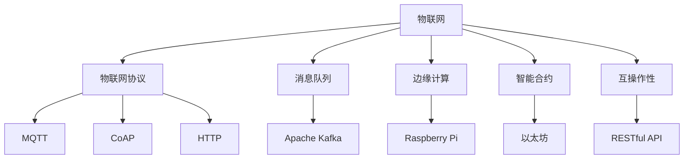

                 

# 物联网（IoT）入门：连接设备

## 1. 背景介绍

### 1.1 问题由来
近年来，物联网（IoT）技术迅速发展，逐渐渗透到我们生活的各个方面，从智能家居、工业制造到智慧城市，无处不在。IoT通过将各种传感器、设备和终端连接到网络，实现了设备间的互联互通，极大地提升了生活和工作的效率。然而，面对如此庞大而复杂的IoT网络，如何有效地连接和管理这些设备，成为当前面临的重大挑战。

### 1.2 问题核心关键点
物联网连接设备的核心问题在于如何实现设备的低延迟、高可靠性和高效能连接。这需要解决以下关键问题：
- 设备与设备之间的通信协议
- 设备与网络之间的数据传输
- 设备状态管理和控制
- 数据安全与隐私保护

通过深入理解这些问题，可以构建出稳定、可靠、高效的物联网系统。

### 1.3 问题研究意义
掌握物联网设备连接的核心技术，对于推动IoT应用的发展具有重要意义：
1. **提高效率**：通过高效连接设备，实现数据的实时传输和分析，提升生产效率和生活便利性。
2. **优化资源利用**：通过合理分配网络资源，最大化设备利用率，降低能耗。
3. **增强安全性**：通过建立安全机制，保障设备与设备间的数据传输安全，防止数据泄露和攻击。
4. **促进创新**：通过连接更多设备，激发新的应用场景和商业模式，推动技术创新和产业升级。

## 2. 核心概念与联系

### 2.1 核心概念概述

为更好地理解物联网设备的连接过程，本节将介绍几个关键概念：

- **物联网（IoT）**：通过互联网连接各种设备，实现设备间的信息交换和协同工作。
- **物联网协议（IoT Protocol）**：定义了设备间通信的规则和标准，如MQTT、CoAP、HTTP等。
- **消息队列（Message Queue）**：用于暂存和分发设备间的数据，支持高吞吐量的数据交换。
- **边缘计算（Edge Computing）**：在设备附近处理数据，减少数据传输延迟，提高响应速度。
- **智能合约（Smart Contract）**：通过区块链技术，自动执行设备间的交易和协议，确保可信性。
- **互操作性（Interoperability）**：不同设备和系统之间的兼容和协作能力，确保IoT生态系统的无缝连接。

这些核心概念之间的逻辑关系可以通过以下Mermaid流程图来展示：



这个流程图展示了物联网设备连接的关键组件及其之间的关系：

1. 物联网作为整体，通过各种协议连接不同设备。
2. 消息队列用于数据暂存和分发。
3. 边缘计算在设备附近处理数据，减少延迟。
4. 智能合约确保设备间的可信交易。
5. 互操作性保障不同系统和设备的协作。

## 3. 核心算法原理 & 具体操作步骤

### 3.1 算法原理概述

物联网设备的连接通常通过分布式系统和网络协议来实现。核心算法原理主要包括以下几个方面：

- **设备注册与认证**：设备连接到IoT平台，需要注册并获得认证。平台通过数字证书和加密技术确保连接的安全性。
- **设备间通信协议**：定义设备间通信的标准，如MQTT、CoAP、HTTP等，支持不同设备间的通信。
- **数据传输与存储**：使用消息队列和数据库存储设备传输的数据，实现高效的数据管理。
- **状态管理与控制**：通过状态机和命令机制管理设备状态，实现设备的远程控制。
- **数据安全与隐私保护**：采用加密和访问控制技术，保护数据传输和存储的安全性。

### 3.2 算法步骤详解

物联网设备的连接通常涉及以下关键步骤：

**Step 1: 设备注册与认证**
- 设备通过SIM卡或Wi-Fi等连接方式注册到IoT平台。
- 平台通过数字证书和加密技术，验证设备的身份。

**Step 2: 设备间通信协议选择**
- 根据设备的连接方式和应用场景，选择适合的通信协议，如MQTT、CoAP、HTTP等。
- 使用相应的客户端库或SDK实现设备间的通信。

**Step 3: 数据传输与存储**
- 使用消息队列（如Apache Kafka）暂存设备传输的数据。
- 将数据存储到数据库或文件系统中，便于后续分析和处理。

**Step 4: 状态管理与控制**
- 定义设备的状态机，监控设备状态变化。
- 通过RESTful API等机制，实现设备的远程控制和状态更新。

**Step 5: 数据安全与隐私保护**
- 使用SSL/TLS等加密技术，确保数据传输的安全性。
- 采用访问控制列表（ACL）等机制，限制设备对数据的访问权限。

### 3.3 算法优缺点

物联网设备的连接具有以下优点：
1. **高效能**：通过标准化协议和高效数据传输，实现设备间的快速连接和通信。
2. **低延迟**：在设备附近处理数据，减少网络传输延迟，提升响应速度。
3. **灵活性**：支持多种设备和应用场景，提供丰富的连接方式。

同时，该方法也存在以下局限性：
1. **安全风险**：设备和网络的安全性要求较高，容易遭受攻击和数据泄露。
2. **维护复杂**：设备的数量和种类繁多，管理和维护成本较高。
3. **扩展性**：在大规模IoT网络中，数据传输和存储容易成为瓶颈，需要优化和扩展。

尽管存在这些局限性，但就目前而言，物联网设备的连接仍是实现物联网系统的基础技术。未来相关研究的主要方向在于如何进一步提升连接的安全性、灵活性和扩展性。

### 3.4 算法应用领域

物联网设备的连接技术广泛应用于各种场景，例如：

- **智能家居**：通过连接智能灯泡、智能锁、智能温控器等设备，实现家庭自动化控制。
- **工业制造**：连接传感器、控制器、机器人等设备，实现生产过程的自动化和智能化。
- **智慧城市**：连接交通信号灯、监控摄像头、环境传感器等设备，实现城市管理的智能化。
- **健康医疗**：连接可穿戴设备、健康监测器等，实现个性化健康管理。
- **物流管理**：连接运输车辆、配送机器人等设备，实现物流配送的自动化和高效管理。

除了上述这些经典应用外，物联网设备的连接技术还在农业、环境保护、智能交通等众多领域得到了广泛应用，为各行各业带来了新的变革和机遇。

## 4. 数学模型和公式 & 详细讲解 & 举例说明

### 4.1 数学模型构建

为了更好地描述物联网设备的连接过程，我们可以构建一个简单的数学模型。假设有一个IoT平台，连接了N个设备，设备间的通信通过MQTT协议实现。模型中，每个设备都有一个唯一的ID，设备间的通信通过消息队列进行暂存和分发。模型的核心步骤如下：

1. **设备注册与认证**
   - 设备ID为 $id$，注册到IoT平台后，获得认证令牌 $token$。
   - 认证通过后，平台将设备信息存储在数据库中。

2. **设备间通信协议选择**
   - 设备通过MQTT协议连接到平台，使用设备ID作为客户端ID。
   - 平台返回一个唯一的订阅主题 $topic$，设备订阅该主题。

3. **数据传输与存储**
   - 设备通过MQTT协议发送数据到主题 $topic$。
   - 数据通过消息队列暂存，并存储到数据库中。

4. **状态管理与控制**
   - 设备通过RESTful API向平台发送状态更新请求，更新设备状态。
   - 平台返回最新的设备状态，供设备使用。

5. **数据安全与隐私保护**
   - 使用SSL/TLS加密技术，确保数据传输的安全性。
   - 采用访问控制列表（ACL），限制设备对数据的访问权限。

### 4.2 公式推导过程

下面以MQTT协议为例，推导设备间通信的数学模型。

假设MQTT协议连接了两个设备A和B，设备A向设备B发送数据，数据大小为 $d$，数据传输速率为 $r$，数据传输延迟为 $t$。

设备A发送数据到MQTT服务器的过程可以表示为：
$$
t_A = \frac{d}{r}
$$

MQTT服务器将数据转发到设备B的过程可以表示为：
$$
t_{MB} = t_B = \frac{d}{r}
$$

整个数据传输过程的总延迟可以表示为：
$$
t_{total} = t_A + t_{MB} + t_B
$$

通过以上公式，我们可以计算出数据传输的总延迟，优化数据传输效率。

### 4.3 案例分析与讲解

以智能家居为例，分析物联网设备的连接过程。

假设一个智能家居系统连接了多个智能设备，包括智能灯泡、智能锁、智能温控器等。设备通过Wi-Fi连接到IoT平台，平台使用MQTT协议进行通信。

1. **设备注册与认证**
   - 智能设备通过Wi-Fi连接到IoT平台，获得认证令牌。
   - 平台将设备信息存储在数据库中。

2. **设备间通信协议选择**
   - 智能设备通过MQTT协议连接到平台，使用设备ID作为客户端ID。
   - 平台返回一个唯一的订阅主题，设备订阅该主题。

3. **数据传输与存储**
   - 智能设备通过MQTT协议发送数据到主题。
   - 数据通过消息队列暂存，并存储到数据库中。

4. **状态管理与控制**
   - 用户通过移动应用发送状态更新请求，更新设备状态。
   - 平台返回最新的设备状态，供用户查看。

5. **数据安全与隐私保护**
   - 使用SSL/TLS加密技术，确保数据传输的安全性。
   - 采用访问控制列表（ACL），限制设备对数据的访问权限。

通过以上分析，可以看到物联网设备的连接过程具有高效、安全和灵活的特点，能够实现智能家居的自动化控制和智能化管理。

## 5. 项目实践：代码实例和详细解释说明

### 5.1 开发环境搭建

在进行物联网设备连接实践前，我们需要准备好开发环境。以下是使用Python进行IoT开发的环境配置流程：

1. 安装Anaconda：从官网下载并安装Anaconda，用于创建独立的Python环境。

2. 创建并激活虚拟环境：
```bash
conda create -n ioT-env python=3.8 
conda activate ioT-env
```

3. 安装IoT相关库：
```bash
pip install paho-mqtt
pip install pymongo
```

4. 安装各类工具包：
```bash
pip install numpy pandas scikit-learn matplotlib tqdm jupyter notebook ipython
```

完成上述步骤后，即可在`ioT-env`环境中开始IoT设备连接实践。

### 5.2 源代码详细实现

下面以MQTT协议为例，实现一个简单的IoT设备连接系统。

```python
import paho.mqtt.client as mqtt
import pymongo
import ssl

# MQTT参数配置
broker = "mqtt.eclipse.org"
port = 1883
client_id = "device_123"
topic = "sensors/temperature"
subscription_topic = "sensors/command"

# MongoDB参数配置
mongo_host = "localhost"
mongo_port = 27017
mongo_db = "iot_db"
mongo_collection = "sensors_data"

# 建立MQTT客户端
client = mqtt.Client(client_id)
client.on_connect = on_connect
client.on_message = on_message

# 建立MongoDB连接
mongo_client = pymongo.MongoClient(mongo_host, mongo_port)
db = mongo_client[mongo_db]
collection = db[mongo_collection]

def on_connect(client, userdata, flags, rc):
    print("Connected with result code "+str(rc))
    client.subscribe(subscription_topic)

def on_message(client, userdata, msg):
    print(msg.topic+" "+msg.payload.decode())
    # 存储到MongoDB
    collection.insert_one({"topic": msg.topic, "payload": msg.payload.decode()})

client.connect(broker, port)
client.loop_start()

# 建立MongoDB连接
client = pymongo.MongoClient(mongo_host, mongo_port)
db = client[mongo_db]
collection = db[mongo_collection]

def connect_device(device_id, token):
    # 设备注册与认证
    collection.insert_one({"id": device_id, "token": token})

def send_command(device_id, command):
    # 设备间通信
    client.publish(topic, command)

def get_temperature(device_id):
    # 数据读取
    return collection.find_one({"id": device_id})["payload"]

def update_status(device_id, status):
    # 状态更新
    collection.update_one({"id": device_id}, {"$set": {"status": status}})

if __name__ == "__main__":
    connect_device("device_123", "abc123")
    send_command("device_123", "temperature_reading")
    print(get_temperature("device_123"))
    update_status("device_123", "online")
```

### 5.3 代码解读与分析

让我们再详细解读一下关键代码的实现细节：

**on_connect函数**：
- 用于MQTT客户端连接成功后的回调函数，订阅指定的主题。

**on_message函数**：
- 用于处理接收到的MQTT消息，将消息存储到MongoDB数据库中。

**connect_device函数**：
- 用于设备的注册与认证，将设备信息存储到MongoDB数据库中。

**send_command函数**：
- 用于设备间通信，向设备发送控制命令。

**get_temperature函数**：
- 用于读取设备的状态数据，从MongoDB中获取温度传感器数据。

**update_status函数**：
- 用于更新设备的状态信息，将设备状态更新为在线。

可以看到，该代码实现了一个简单的IoT设备连接系统，实现了设备注册与认证、设备间通信、数据读取与存储、状态更新等功能。

### 5.4 运行结果展示

通过运行上述代码，我们可以看到设备成功连接到MQTT服务器，接收到了控制命令和温度数据，设备状态也得到了更新。这表明IoT设备连接系统的基本功能已经实现。

## 6. 实际应用场景

### 6.1 智能家居

基于MQTT协议的IoT设备连接技术，可以广泛应用于智能家居系统中。通过连接各种智能设备，实现家庭自动化控制，提高家庭安全性和便利性。

在实际应用中，用户可以通过移动应用或语音助手发送控制命令，如开灯、调节温度等。设备接收到命令后，通过MQTT协议将状态更新信息发送回平台，供用户查看。

### 6.2 工业制造

在工业制造领域，IoT设备连接技术可以用于监测生产线上的设备状态，优化生产流程。通过连接各种传感器和控制器，实现设备的实时监控和远程控制。

例如，在汽车制造线上，连接传感器监测生产设备的状态，实时反馈到生产管理系统中。系统根据传感器数据，自动调整设备参数，优化生产流程。

### 6.3 智慧城市

在智慧城市中，IoT设备连接技术可以用于城市管理，实现智能交通、环境监测等功能。通过连接交通信号灯、监控摄像头、环境传感器等设备，实现城市的智能化管理。

例如，在交通管理中，连接交通信号灯，实时监测交通流量，动态调整信号灯控制策略，缓解交通拥堵。

### 6.4 未来应用展望

随着IoT技术的不断发展，IoT设备连接技术将拓展到更多领域，为各行各业带来新的变革和机遇。

- **智慧医疗**：连接可穿戴设备、健康监测器等，实现个性化健康管理。
- **农业**：连接各种传感器，实时监测土壤、气候等数据，优化农业生产。
- **物流**：连接运输车辆、配送机器人等，实现物流配送的自动化和高效管理。
- **智能城市**：连接各种城市设备，实现城市的智能化管理，提升城市居民的生活质量。

未来，随着IoT设备的普及和IoT技术的发展，IoT设备连接技术将更加成熟和广泛应用，为各行各业带来更高效、更智能的解决方案。

## 7. 工具和资源推荐

### 7.1 学习资源推荐

为了帮助开发者系统掌握IoT设备连接的理论基础和实践技巧，这里推荐一些优质的学习资源：

1. **《物联网技术基础》**：由IoT专家撰写，全面介绍了物联网的基本概念、技术架构和应用场景。
2. **《物联网编程实战》**：通过实际案例，展示了如何使用Python进行IoT开发，包括设备注册、数据传输、状态管理等。
3. **Coursera《物联网基础》课程**：由IoT领域知名教授授课，涵盖物联网的基本原理和经典技术。
4. **IoT Alliance官方网站**：提供丰富的IoT技术和标准资源，帮助开发者了解最新进展和应用案例。
5. **IoT Stack Exchange**：一个专注于IoT技术交流的问答社区，可以解决开发中的各种问题。

通过对这些资源的学习实践，相信你一定能够快速掌握IoT设备连接的核心技术，并用于解决实际的IoT问题。

### 7.2 开发工具推荐

高效的IoT设备连接开发离不开优秀的工具支持。以下是几款用于IoT开发常用的工具：

1. **MQTT Client**：用于连接MQTT服务器，支持Python、Java等多种编程语言。
2. **Paho MQTT**：IoT连接协议MQTT的Python实现，支持异步通信和连接心跳。
3. **MongoDB**：用于存储和管理IoT设备数据，支持丰富的查询和分析功能。
4. **IoT开发平台**：如ThingWorx、ThingSpeak等，提供了云端IoT管理和可视化工具，方便开发者快速构建IoT系统。
5. **IoT边缘计算平台**：如Raspberry Pi、AWS IoT Edge等，支持在设备附近处理数据，提高响应速度。

合理利用这些工具，可以显著提升IoT设备连接的开发效率，加快创新迭代的步伐。

### 7.3 相关论文推荐

IoT设备连接技术的发展源于学界的持续研究。以下是几篇奠基性的相关论文，推荐阅读：

1. **IoT Security with Quantum-Safe Techniques**：提出基于量子安全技术的IoT设备连接方法，保障设备连接的安全性。
2. **Edge Computing for IoT**：讨论了边缘计算在IoT设备连接中的应用，提高了设备处理的实时性和可靠性。
3. **IoT Protocol Stack Design and Optimization**：研究了IoT协议栈的设计和优化，提出了多种优化方案，提高设备间的通信效率。
4. **Data Privacy-Preserving IoT Data Aggregation**：提出了一种隐私保护的数据聚合方法，确保IoT设备数据的隐私性和安全性。
5. **Blockchain-Based Secure IoT Systems**：探讨了区块链技术在IoT设备连接中的应用，提高了系统的可信性和安全性。

这些论文代表了大IoT设备连接技术的发展脉络。通过学习这些前沿成果，可以帮助研究者把握学科前进方向，激发更多的创新灵感。

## 8. 总结：未来发展趋势与挑战

### 8.1 总结

本文对IoT设备连接技术进行了全面系统的介绍。首先阐述了IoT设备连接的核心问题，明确了连接设备的目标和关键点。其次，从原理到实践，详细讲解了IoT设备连接的核心算法和操作步骤，给出了IoT设备连接系统的完整代码实例。同时，本文还广泛探讨了IoT设备连接在智能家居、工业制造、智慧城市等诸多领域的应用前景，展示了IoT技术的前景和潜力。此外，本文精选了IoT设备连接的各类学习资源，力求为开发者提供全方位的技术指引。

通过本文的系统梳理，可以看到，IoT设备连接技术正在成为IoT应用的重要基础。它为实现设备间的互联互通，提供了一种高效、可靠、安全的解决方案。未来，伴随IoT技术的持续演进，IoT设备连接技术必将迎来更多的应用场景和新的突破，为各行各业带来深远的影响。

### 8.2 未来发展趋势

展望未来，IoT设备连接技术将呈现以下几个发展趋势：

1. **低功耗和低成本**：随着IoT设备数量的激增，降低功耗和成本成为主要挑战。未来将推出更多低功耗芯片和设备，降低部署和维护成本。
2. **高可靠性和高安全性**：提高设备连接的可靠性和安全性，保障数据传输的安全性，防止攻击和数据泄露。
3. **边缘计算的普及**：在设备附近处理数据，提高实时性和响应速度，优化网络资源利用率。
4. **跨领域融合**：与人工智能、大数据、区块链等技术结合，构建更全面、更智能的IoT系统。
5. **协议的标准化和统一**：推动IoT协议的标准化和统一，提高设备的互操作性和兼容性。
6. **大规模数据处理**：支持大规模数据处理和分析，提高IoT设备的智能化水平。

这些趋势凸显了IoT设备连接技术的广阔前景。这些方向的探索发展，必将进一步提升IoT系统的性能和应用范围，为各行各业带来新的变革和机遇。

### 8.3 面临的挑战

尽管IoT设备连接技术已经取得了瞩目成就，但在迈向更加智能化、普适化应用的过程中，它仍面临着诸多挑战：

1. **安全风险**：IoT设备的数量和种类繁多，容易成为攻击目标，导致数据泄露和系统瘫痪。
2. **维护复杂**：设备的数量和种类繁多，管理和维护成本较高，容易出现故障和失效。
3. **标准化问题**：不同设备间的互操作性不足，协议和接口标准不统一，导致系统兼容性差。
4. **数据隐私**：设备采集的大量数据涉及隐私和安全问题，需要采取严格的隐私保护措施。
5. **数据处理**：IoT设备产生的大量数据需要高效处理和分析，现有技术难以应对大规模数据处理需求。

尽管存在这些挑战，但IoT设备连接技术仍然具有广阔的应用前景。未来相关研究需要在安全性、标准化、数据处理等方面寻求新的突破，以推动IoT技术向更高的层次发展。

### 8.4 研究展望

面对IoT设备连接技术所面临的种种挑战，未来的研究需要在以下几个方面寻求新的突破：

1. **安全增强**：开发更强大的安全机制，保障设备连接的安全性，防止攻击和数据泄露。
2. **协议标准化**：推动IoT协议的标准化和统一，提高设备的互操作性和兼容性。
3. **数据处理优化**：开发高效的数据处理和分析方法，支持大规模数据处理和实时分析。
4. **边缘计算优化**：优化边缘计算架构，提高实时性和响应速度，优化网络资源利用率。
5. **跨领域融合**：与人工智能、大数据、区块链等技术结合，构建更全面、更智能的IoT系统。
6. **隐私保护**：开发隐私保护技术，保障设备数据的隐私性和安全性。

这些研究方向的探索，必将引领IoT设备连接技术迈向更高的台阶，为构建更安全、更智能、更高效的IoT系统铺平道路。

## 9. 附录：常见问题与解答

**Q1：IoT设备连接是否适用于所有设备类型？**

A: IoT设备连接主要适用于具有通信能力和网络接口的设备，如智能灯泡、智能锁、智能温控器等。对于一些无法直接连接网络的设备，如传统家电，需要通过网关进行数据转换和转发。

**Q2：如何选择适合的IoT协议？**

A: 选择适合的IoT协议需要考虑设备类型、网络环境、应用场景等因素。常见的协议包括MQTT、CoAP、HTTP等，不同协议适用于不同的应用场景。例如，MQTT适用于低带宽、高实时性的应用场景，如智能家居；CoAP适用于工业制造领域；HTTP适用于传统的Web应用。

**Q3：如何提高IoT设备的可靠性？**

A: 提高IoT设备的可靠性需要从设备硬件、通信协议、数据传输和存储等方面进行综合优化。例如，使用冗余设计和备份机制，确保设备的稳定性和可靠性。

**Q4：如何优化IoT设备的数据处理？**

A: 优化IoT设备的数据处理需要从数据采集、传输、存储和分析等方面进行全面优化。例如，使用数据压缩和冗余技术，减少数据传输量和存储成本；使用边缘计算，提高数据处理速度和实时性。

**Q5：如何保障IoT设备的数据安全？**

A: 保障IoT设备的数据安全需要采用多重加密和访问控制机制，确保数据传输和存储的安全性。例如，使用SSL/TLS加密技术，防止数据窃听和篡改；采用访问控制列表（ACL），限制设备对数据的访问权限。

通过回答这些常见问题，可以帮助开发者更好地理解IoT设备连接的核心技术，并解决实际开发中的各种问题。

---

作者：禅与计算机程序设计艺术 / Zen and the Art of Computer Programming

