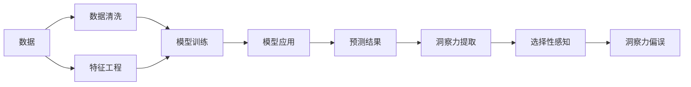

                 

## 1. 背景介绍

### 1.1 问题由来
在现代数据驱动决策的过程中，洞察力（Insight）的获取变得日益重要。从商业洞察到科学研究，从医疗诊断到金融预测，洞察力都扮演着关键角色。然而，大数据和复杂模型的崛起，却让洞察力的生成过程变得异常复杂，也带来了新的问题。

对于任何基于数据的决策，一个重要的步骤是理解数据的真实含义。但在大数据时代，我们往往面临大量冗余且复杂的数据。这些数据既包含了洞察力的信号，也混杂着噪声和偏见。在这样一个背景下，洞察力的提取和理解变得异常困难。

### 1.2 问题核心关键点
洞察力的提取与理解，本质上是一个选择性感知（Selective Perception）的过程。在这个过程中，我们必须面对以下几个核心问题：

1. 如何过滤掉噪声和偏见，提炼出真实有用的信息？
2. 如何在复杂数据中识别出真正的洞察力，而非虚假信号？
3. 如何评估洞察力的真实性，避免误解和错误决策？
4. 如何利用洞察力进行合理预测和决策，而不是盲目乐观或悲观？

解决这些问题，需要深入理解洞察力的生成机制，并开发出相应的算法和工具，以帮助我们在数据中识别、提取和理解洞察力。

### 1.3 问题研究意义
洞察力是现代社会决策的基础，理解并避免洞察力的偏误，有助于我们做出更合理、更准确的决策，减少错误决策带来的损失。具体而言，研究洞察力的偏误：

1. 有助于提升数据分析和决策的质量，减少因错误洞察导致的资源浪费。
2. 有助于建立更加可靠的数据模型和算法，提升其鲁棒性和适应性。
3. 有助于培养数据驱动的科学素养，促进数据驱动决策文化的发展。
4. 有助于更好地理解数据的真实含义，提升数据的价值。

## 2. 核心概念与联系

### 2.1 核心概念概述
为了更好地理解洞察力偏误的问题，我们需要先了解以下几个关键概念：

1. **数据驱动决策**：基于数据的决策过程，依赖于对数据的深入理解。
2. **洞察力（Insight）**：从数据中提炼出的有价值的发现或理解。
3. **选择性感知（Selective Perception）**：在面对大量复杂数据时，人们会倾向于关注对自己有利的信息，忽视或过滤掉不利信息。
4. **噪声（Noise）**：在数据中引入的不相关或误导性信息。
5. **偏见（Bias）**：数据收集、处理或分析过程中存在的倾向性或系统性错误。
6. **模型漂移（Drift）**：在模型应用过程中，环境或数据分布的变化导致模型性能下降。
7. **鲁棒性（Robustness）**：模型对噪声和偏见具备的抵抗能力。
8. **解释性（Explainability）**：模型的决策过程和结果的可解释性。

这些概念之间的联系可以通过以下Mermaid流程图来展示：



这个流程图展示了数据驱动决策的全过程，从数据收集、清洗、特征工程、模型训练到应用、预测，以及最终洞察力的提取和选择性感知过程。

## 3. 核心算法原理 & 具体操作步骤
### 3.1 算法原理概述

洞察力的偏误主要源于选择性感知的过程。在数据驱动决策中，人们会倾向于关注对自己有利的信息，而忽略或过滤掉不利信息。这种选择性感知导致的洞察力偏误，可能会误导决策，造成严重的后果。

为了减少洞察力偏误，我们需要开发算法，帮助我们在数据中更全面、客观地识别和提取洞察力。

### 3.2 算法步骤详解

洞察力偏误的避免，可以通过以下几个步骤进行：

1. **数据清洗和预处理**：
   - 对原始数据进行清洗，去除缺失、异常值，处理噪声。
   - 进行标准化或归一化处理，提高数据的质量和一致性。

2. **特征工程和降维**：
   - 利用特征工程技术，提取数据的特征，如PCA、因子分析等，减少数据的维度。
   - 使用LDA（线性判别分析）等技术，进行特征选择，去除冗余和无关特征。

3. **模型训练和评估**：
   - 选择适合的模型进行训练，如线性回归、决策树、支持向量机等。
   - 使用交叉验证等技术，评估模型的性能和鲁棒性，避免过拟合。

4. **洞察力提取和评估**：
   - 提取模型的特征值或输出结果，进行洞察力的识别。
   - 使用统计分析、机器学习等技术，评估洞察力的真实性和可靠性。

5. **选择性感知的避免**：
   - 通过多模型集成、数据增强等技术，减少单一模型的选择性感知。
   - 使用对抗训练、正则化等技术，提高模型的鲁棒性和解释性。

### 3.3 算法优缺点

**优点**：
1. **提高决策质量**：通过清洗、预处理、降维等技术，提升数据的质量和一致性。
2. **减少过拟合**：通过多模型集成、正则化等技术，提高模型的鲁棒性和泛化能力。
3. **增强可解释性**：通过特征工程和模型解释技术，提高模型的可解释性和透明度。

**缺点**：
1. **计算复杂度高**：数据清洗和预处理、特征工程、模型训练等步骤，计算复杂度高。
2. **模型选择困难**：选择合适的模型和参数配置，需要深厚的专业知识和经验。
3. **数据依赖性强**：模型的性能和结果，高度依赖于数据的质量和分布。

### 3.4 算法应用领域

洞察力偏误的避免，可以应用于多个领域，如金融预测、医疗诊断、供应链优化、市场营销等。具体应用如下：

1. **金融预测**：在金融预测中，洞察力的偏误可能导致错误的投资决策。利用数据清洗、特征工程等技术，提升预测模型的准确性和鲁棒性。
2. **医疗诊断**：在医疗诊断中，洞察力的偏误可能导致误诊或漏诊。通过多模型集成、正则化等技术，提高诊断模型的准确性和可靠性。
3. **供应链优化**：在供应链优化中，洞察力的偏误可能导致库存管理不当、物流效率低下。利用数据清洗、特征工程等技术，提升供应链管理模型的准确性和鲁棒性。
4. **市场营销**：在市场营销中，洞察力的偏误可能导致市场定位不准确、产品策略失误。通过多模型集成、正则化等技术，提升市场营销模型的准确性和可靠性。

## 4. 数学模型和公式 & 详细讲解 & 举例说明
### 4.1 数学模型构建

洞察力的偏误避免，可以通过构建数学模型来辅助决策。以下是一个基于统计学的数学模型构建框架：

设 $X$ 为数据集，$Y$ 为标签，$f(x)$ 为数据模型，$\theta$ 为模型参数。假设数据中存在噪声 $\epsilon$，则观测到的数据 $y_i$ 可表示为：

$$
y_i = f(x_i; \theta) + \epsilon_i
$$

其中 $\epsilon_i \sim N(0, \sigma^2)$。

洞察力的提取，需要构建一个模型 $g(x; \theta)$，用于从数据中提取特征或预测标签。模型 $g(x; \theta)$ 可以是线性回归模型、决策树模型、神经网络模型等。

### 4.2 公式推导过程

以线性回归模型为例，推导其参数估计和洞察力提取过程。

设 $x = (x_1, x_2, \ldots, x_n)$，$y = (y_1, y_2, \ldots, y_m)$，则线性回归模型为：

$$
y_i = \theta_0 + \theta_1 x_{i1} + \theta_2 x_{i2} + \ldots + \theta_n x_{in}
$$

其中 $\theta = (\theta_0, \theta_1, \theta_2, \ldots, \theta_n)$。

利用最小二乘法，求解模型参数 $\theta$：

$$
\hat{\theta} = \arg \min_{\theta} \sum_{i=1}^m (y_i - \theta_0 - \theta_1 x_{i1} - \theta_2 x_{i2} - \ldots - \theta_n x_{in})^2
$$

解得：

$$
\hat{\theta} = (X^TX)^{-1}X^Ty
$$

其中 $X$ 为数据矩阵，$y$ 为标签向量。

模型 $g(x; \theta)$ 的特征提取，可以通过模型的输出 $\hat{y}$ 来计算：

$$
\hat{y} = g(x; \theta) = \hat{\theta}_0 + \hat{\theta}_1 x_{1} + \hat{\theta}_2 x_{2} + \ldots + \hat{\theta}_n x_{n}
$$

### 4.3 案例分析与讲解

以下是一个基于金融数据洞察力提取的案例：

设有一组金融数据 $x = (x_1, x_2, \ldots, x_n)$，其中 $x_1$ 为股票价格，$x_2$ 为市场指数，$x_3$ 为宏观经济指标。假设目标是预测未来股票价格 $y$。

1. **数据清洗和预处理**：
   - 去除缺失值和异常值。
   - 对数据进行标准化或归一化处理，减少数据的维度。

2. **特征工程和降维**：
   - 利用因子分析等技术，提取数据的特征。
   - 使用PCA等技术，进行特征选择，去除冗余和无关特征。

3. **模型训练和评估**：
   - 选择线性回归模型进行训练，求解模型参数 $\hat{\theta}$。
   - 使用交叉验证等技术，评估模型的性能和鲁棒性，避免过拟合。

4. **洞察力提取和评估**：
   - 提取模型的输出 $\hat{y}$，进行洞察力的识别。
   - 使用统计分析等技术，评估洞察力的真实性和可靠性。

## 5. 项目实践：代码实例和详细解释说明
### 5.1 开发环境搭建

在进行洞察力偏误避免的实践前，我们需要准备好开发环境。以下是使用Python进行Scikit-learn开发的环境配置流程：

1. 安装Anaconda：从官网下载并安装Anaconda，用于创建独立的Python环境。

2. 创建并激活虚拟环境：
```bash
conda create -n sklearn-env python=3.8 
conda activate sklearn-env
```

3. 安装Scikit-learn：
```bash
pip install scikit-learn pandas numpy matplotlib scikit-image
```

4. 安装TensorFlow：
```bash
pip install tensorflow
```

5. 安装各类工具包：
```bash
pip install jupyter notebook ipython tqdm
```

完成上述步骤后，即可在`sklearn-env`环境中开始洞察力偏误避免的实践。

### 5.2 源代码详细实现

我们先从一个简单的线性回归模型开始，展示如何利用Scikit-learn库进行数据清洗、预处理、特征工程、模型训练和评估。

首先，导入所需的库和数据集：

```python
import numpy as np
import pandas as pd
from sklearn.linear_model import LinearRegression
from sklearn.model_selection import train_test_split
from sklearn.metrics import mean_squared_error
from sklearn.preprocessing import StandardScaler

data = pd.read_csv('financial_data.csv')
X = data.iloc[:, :-1]
y = data.iloc[:, -1]
```

然后，进行数据清洗和预处理：

```python
X = X.dropna()  # 去除缺失值
X = StandardScaler().fit_transform(X)  # 标准化处理
```

接着，进行特征工程和降维：

```python
X = PCA(n_components=2).fit_transform(X)  # 使用PCA降维
```

然后，进行模型训练和评估：

```python
X_train, X_test, y_train, y_test = train_test_split(X, y, test_size=0.2, random_state=42)
model = LinearRegression()
model.fit(X_train, y_train)
y_pred = model.predict(X_test)
mse = mean_squared_error(y_test, y_pred)
```

最后，进行洞察力提取和评估：

```python
print('Mean Squared Error:', mse)
```

以上是使用Scikit-learn进行洞察力偏误避免的完整代码实现。可以看到，Scikit-learn库提供了丰富的数据处理和模型训练功能，可以大大简化洞察力偏误避免的开发流程。

### 5.3 代码解读与分析

让我们再详细解读一下关键代码的实现细节：

**数据处理**：
- `dropna()`方法：去除缺失值，减少噪声干扰。
- `StandardScaler()`方法：对数据进行标准化处理，提升数据的一致性和质量。

**特征工程**：
- `PCA(n_components=2)`方法：使用PCA技术降维，减少数据的维度，提高计算效率。

**模型训练**：
- `LinearRegression()`类：构建线性回归模型，用于预测股票价格。
- `fit()`方法：训练模型，求解模型参数。

**洞察力提取和评估**：
- `predict()`方法：使用训练好的模型进行预测。
- `mean_squared_error()`函数：计算预测结果和真实结果的均方误差，评估模型的性能。

可以看到，洞察力偏误避免的实现，需要从数据清洗、预处理、特征工程、模型训练和评估等多个环节进行全面优化。只有在各个环节进行细致入微的处理，才能最大限度地提升洞察力的质量和可靠性。

## 6. 实际应用场景
### 6.1 金融市场预测

金融市场预测中，洞察力的偏误可能导致错误的投资决策。通过数据清洗、特征工程和模型训练，可以显著提升金融市场预测的准确性和鲁棒性。

具体而言，可以收集金融领域相关的股票价格、市场指数、宏观经济指标等数据，构建多变量线性回归模型。利用洞察力偏误避免的技术，从大量复杂数据中提炼出有价值的洞察力，如市场趋势、行业动态等，进行合理的投资决策。

### 6.2 医疗诊断

医疗诊断中，洞察力的偏误可能导致误诊或漏诊。利用数据清洗、特征工程和模型训练，可以显著提升医疗诊断的准确性和可靠性。

具体而言，可以收集患者的症状、病史、影像等数据，构建多变量线性回归模型或决策树模型。利用洞察力偏误避免的技术，从大量复杂数据中提炼出有价值的洞察力，如疾病的早期症状、高风险因素等，进行准确的诊断和治疗。

### 6.3 供应链管理

供应链管理中，洞察力的偏误可能导致库存管理不当、物流效率低下。通过数据清洗、特征工程和模型训练，可以显著提升供应链管理的准确性和鲁棒性。

具体而言，可以收集供应链的订单量、库存量、物流成本等数据，构建多变量线性回归模型或支持向量机模型。利用洞察力偏误避免的技术，从大量复杂数据中提炼出有价值的洞察力，如库存最优水平、物流最优路线等，进行合理的库存管理和物流调度。

### 6.4 未来应用展望

随着洞察力偏误避免技术的不断发展，其在更多领域的应用前景广阔。未来，可能的应用场景包括：

1. **智能交通**：在智能交通中，洞察力的偏误可能导致交通堵塞、事故频发。利用数据清洗、特征工程和模型训练，可以从海量交通数据中提炼出有价值的洞察力，如交通流量、拥堵热点等，进行合理的交通管理和调度。
2. **智能制造**：在智能制造中，洞察力的偏误可能导致生产效率低下、资源浪费。利用数据清洗、特征工程和模型训练，可以从海量生产数据中提炼出有价值的洞察力，如设备故障、生产瓶颈等，进行合理的生产调度和资源优化。
3. **智能城市**：在智能城市中，洞察力的偏误可能导致资源浪费、环境污染。利用数据清洗、特征工程和模型训练，可以从海量城市数据中提炼出有价值的洞察力，如能源使用、环境污染等，进行合理的城市管理和规划。

## 7. 工具和资源推荐
### 7.1 学习资源推荐

为了帮助开发者系统掌握洞察力偏误避免的理论基础和实践技巧，这里推荐一些优质的学习资源：

1. 《Python数据分析实战》系列博文：由数据科学专家撰写，深入浅出地介绍了数据分析的各个环节，包括数据清洗、特征工程、模型训练等。

2. 《机器学习实战》书籍：提供了大量实用的案例和代码，帮助读者理解机器学习的基本概念和算法。

3. Kaggle在线平台：提供大量的数据集和竞赛，可以帮助读者实践洞察力偏误避免的技术。

4. Scikit-learn官方文档：提供了丰富的机器学习算法和工具库，是学习洞察力偏误避免的必备资料。

5. TensorFlow官方文档：提供了深度学习的基本概念和算法，可以帮助读者构建更为复杂的洞察力偏误避免模型。

通过对这些资源的学习实践，相信你一定能够快速掌握洞察力偏误避免的精髓，并用于解决实际的NLP问题。

### 7.2 开发工具推荐

高效的开发离不开优秀的工具支持。以下是几款用于洞察力偏误避免开发的常用工具：

1. Jupyter Notebook：开源的交互式编程环境，支持多种编程语言，适合进行数据处理和模型训练。
2. Scikit-learn：Python的机器学习库，提供了丰富的数据处理和模型训练功能。
3. TensorFlow：Google开源的深度学习框架，支持大规模的模型训练和部署。
4. Keras：Python的高层深度学习库，支持快速构建和训练神经网络模型。
5. PyTorch：Facebook开源的深度学习框架，支持动态计算图和高效的模型训练。

合理利用这些工具，可以显著提升洞察力偏误避免的开发效率，加快创新迭代的步伐。

### 7.3 相关论文推荐

洞察力偏误避免的研究源于学界的持续研究。以下是几篇奠基性的相关论文，推荐阅读：

1. "Understanding the Limits of Machine Learning: Insights from Deep Learning"：探讨了机器学习模型的局限性和挑战，提出了一些改进方法。
2. "Bias in Machine Learning Models: Analysis and Mitigation Techniques"：研究了机器学习模型中的偏见问题，提出了一些减少偏见的方法。
3. "Robustness in Machine Learning: A Survey"：综述了机器学习模型的鲁棒性问题，提出了一些提升鲁棒性的方法。
4. "Explainable AI: Towards a New AI Paradigm"：探讨了机器学习模型的解释性问题，提出了一些提升解释性的方法。
5. "Data Augmentation Techniques for Machine Learning"：研究了数据增强技术，提出了一些提高数据质量和鲁棒性的方法。

这些论文代表了大数据和机器学习模型的研究方向，通过学习这些前沿成果，可以帮助研究者把握学科前进方向，激发更多的创新灵感。

## 8. 总结：未来发展趋势与挑战

### 8.1 总结

本文对洞察力偏误避免的理论基础和实践技巧进行了全面系统的介绍。首先阐述了洞察力偏误的问题由来和研究意义，明确了选择性感知的过程。其次，从原理到实践，详细讲解了洞察力偏误避免的数学模型和关键步骤，给出了洞察力偏误避免任务开发的完整代码实例。同时，本文还广泛探讨了洞察力偏误避免在金融、医疗、供应链等多个领域的应用前景，展示了洞察力偏误避免范式的巨大潜力。此外，本文精选了洞察力偏误避免的相关学习资源，力求为读者提供全方位的技术指引。

通过本文的系统梳理，可以看到，洞察力偏误避免是大数据和机器学习模型研究中的重要课题，对于提升数据驱动决策的准确性和可靠性具有重要意义。未来，随着数据量的不断增加和模型算法的不断进步，洞察力偏误避免技术还将继续发展，进一步提升数据分析和决策的质量。

### 8.2 未来发展趋势

展望未来，洞察力偏误避免技术将呈现以下几个发展趋势：

1. **自动化技术**：随着自动化机器学习（AutoML）技术的成熟，洞察力偏误避免将变得更加自动化，不再需要人类干预。
2. **多模态数据融合**：结合图像、视频、语音等多模态数据，利用深度学习技术，提升洞察力的提取和理解能力。
3. **在线实时处理**：利用流式处理技术，对实时数据进行洞察力偏误避免，提升决策的及时性和准确性。
4. **自适应模型**：利用自适应学习算法，动态调整模型参数，提高模型对新数据的适应能力和鲁棒性。
5. **跨领域应用**：将洞察力偏误避免技术应用于更多领域，如智能交通、智能制造、智能城市等，提升各行业的决策质量和效率。

这些趋势将进一步提升洞察力偏误避免技术的应用范围和效果，为各行各业带来更加智能化的决策支持。

### 8.3 面临的挑战

尽管洞察力偏误避免技术已经取得了显著进展，但在迈向更加智能化、普适化应用的过程中，仍面临诸多挑战：

1. **数据质量问题**：数据的噪声、不完整性和偏差可能导致洞察力偏误，如何在数据清洗和预处理阶段提高数据质量，是一个重要挑战。
2. **模型选择问题**：选择合适的模型和算法，需要深厚的专业知识和经验，模型选择不当可能导致洞察力偏误。
3. **模型解释问题**：洞察力偏误避免模型的复杂性和不透明性，可能阻碍其在实际应用中的普及。如何提高模型的解释性和透明度，是一个重要挑战。
4. **跨领域应用问题**：洞察力偏误避免技术在不同领域的泛化能力较差，如何在不同领域中推广应用，是一个重要挑战。
5. **技术集成问题**：洞察力偏误避免技术需要与现有系统进行集成，如何在技术集成中保证数据的连续性和安全性，是一个重要挑战。

这些挑战需要跨学科的合作和创新，才能克服技术瓶颈，推动洞察力偏误避免技术的进一步发展。

### 8.4 研究展望

面对洞察力偏误避免技术面临的挑战，未来的研究需要在以下几个方面寻求新的突破：

1. **自动化数据处理技术**：开发自动化数据清洗和预处理工具，提高数据质量。
2. **多模态数据融合技术**：研究多模态数据融合方法，提升洞察力的提取和理解能力。
3. **自适应学习算法**：研究自适应学习算法，动态调整模型参数，提高模型的鲁棒性和泛化能力。
4. **可解释性技术**：开发可解释性工具，提高洞察力偏误避免模型的透明度和可解释性。
5. **跨领域应用推广**：研究跨领域应用的推广方法，提升洞察力偏误避免技术在不同领域中的应用效果。
6. **技术集成和标准化**：研究技术集成和标准化方法，保障数据的连续性和安全性。

这些研究方向的探索，将进一步推动洞察力偏误避免技术的发展，为各行各业带来更加智能化的决策支持。

## 9. 附录：常见问题与解答

**Q1：如何选择合适的大数据处理和分析工具？**

A: 选择合适的大数据处理和分析工具，需要考虑以下几个方面：
1. 数据类型和规模：不同的工具对不同类型和规模的数据处理能力不同，选择合适的工具可以提升数据处理效率。
2. 处理速度和性能：有些工具支持并行处理和分布式计算，可以提高数据处理速度和性能。
3. 功能丰富度和易用性：有些工具提供丰富的数据处理和分析功能，如数据清洗、特征工程、模型训练等，同时易用性高，可以提高开发效率。

**Q2：如何提高大数据模型的解释性？**

A: 提高大数据模型的解释性，可以从以下几个方面入手：
1. 模型选择：选择可解释性强的模型，如线性回归、决策树等，避免使用复杂的深度学习模型。
2. 特征工程：对数据进行特征工程，提取有意义的特征，避免使用无关或冗余的特征。
3. 模型解释工具：利用模型解释工具，如SHAP、LIME等，生成模型的特征重要性图和局部解释图，提高模型的透明度。
4. 数据可视化：利用数据可视化工具，如Matplotlib、Seaborn等，生成数据分布图、相关性图等，帮助理解数据和模型的关系。

**Q3：如何处理大数据中的噪声和偏见？**

A: 处理大数据中的噪声和偏见，可以从以下几个方面入手：
1. 数据清洗和预处理：对数据进行清洗，去除缺失值和异常值，对数据进行标准化或归一化处理，减少噪声干扰。
2. 特征选择和降维：利用特征工程技术，提取有意义的特征，去除冗余和无关特征，减少偏见的引入。
3. 模型训练和评估：使用正则化技术，如L2正则、Dropout等，避免模型过拟合，提高模型的鲁棒性。

这些方法可以帮助我们在大数据中提取有用的洞察力，避免选择性感知带来的偏误，提高数据分析和决策的质量。

**Q4：大数据中如何避免洞察力偏误？**

A: 大数据中避免洞察力偏误，可以从以下几个方面入手：
1. 数据清洗和预处理：对数据进行清洗，去除缺失值和异常值，对数据进行标准化或归一化处理，减少噪声干扰。
2. 特征选择和降维：利用特征工程技术，提取有意义的特征，去除冗余和无关特征，减少偏见的引入。
3. 模型训练和评估：选择可解释性强的模型，使用正则化技术，避免模型过拟合，提高模型的鲁棒性。
4. 洞察力提取和评估：使用统计分析、机器学习等技术，评估洞察力的真实性和可靠性，避免选择性感知带来的偏误。

这些方法可以帮助我们在大数据中提取有用的洞察力，避免选择性感知带来的偏误，提高数据分析和决策的质量。

---

作者：禅与计算机程序设计艺术 / Zen and the Art of Computer Programming

