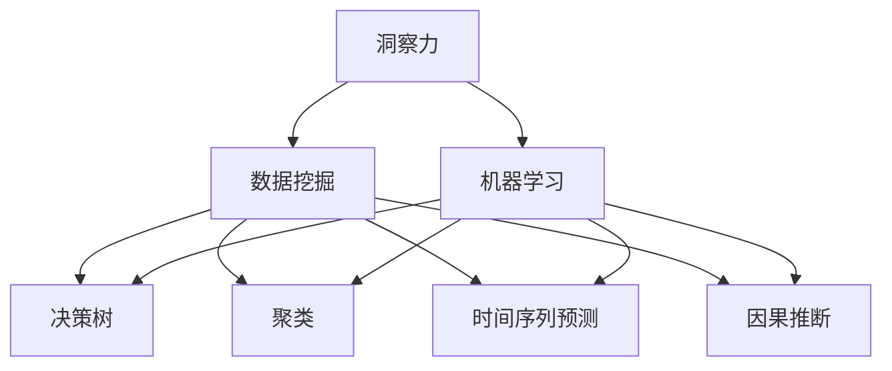

                 

## 1. 背景介绍

### 1.1 问题由来
随着信息时代的到来，数据量呈指数级增长，信息爆炸现象愈发严重。面对海量数据和复杂环境，人类开始依赖机器学习和人工智能(AI)技术进行数据分析和决策。然而，仅仅依靠数据和算法，往往难以把握事物发展的本质规律，也无法应对复杂多变的业务需求。

在这一背景下，理解洞察力的本质及其与机器学习的关系，成为当前人工智能研究的热点之一。洞察力指的是在数据中发现和提取关键信息，从而做出合理决策的能力。相比于传统统计方法和机器学习算法，洞察力更强调对数据背后的本质规律的把握，能够更好应对不确定性和复杂性。

### 1.2 问题核心关键点
洞察力的本质是什么？如何在数据和算法中寻找洞察力？本文将聚焦于理解洞察力的本质，探讨其与机器学习的关系，并提供具体实现路径。

## 2. 核心概念与联系

### 2.1 核心概念概述

为更好地理解洞察力的本质及其与机器学习的关系，本节将介绍几个密切相关的核心概念：

- 洞察力(Insight)：指从数据中发现和提取关键信息的能力，能够理解事物发展变化的本质规律，做出合理决策。

- 机器学习(Machine Learning)：通过数据和算法，让机器具备自主学习的能力，从而进行数据挖掘、预测和决策。

- 数据挖掘(Data Mining)：从大规模数据集中发现有价值的信息、模式和规律的过程，常用于市场分析、金融预测、健康医疗等领域。

- 决策树(Decision Tree)：一种基于树形结构的机器学习算法，能够从数据中提取特征，进行分类和预测。

- 聚类(Clustering)：通过将数据集分为若干个不同的群组，发现数据之间的内在联系和规律，常用于市场细分、用户画像等领域。

- 时间序列预测(Time Series Forecasting)：基于时间序列数据，预测未来数据变化趋势的算法，常用于金融分析、天气预测等领域。

- 因果推断(Causal Inference)：分析数据中变量之间的关系，判断因变量与自变量的因果关系，常用于市场营销、医疗保健等领域。

这些核心概念之间的逻辑关系可以通过以下Mermaid流程图来展示：



这个流程图展示了一个从数据到决策的过程：

1. 从数据中提取洞察力，通过数据挖掘和机器学习技术，挖掘数据背后的本质规律。
2. 决策树、聚类、时间序列预测、因果推断等算法，对数据进行分析和处理，提取关键信息。
3. 通过分析结果，结合领域知识和经验，做出合理决策。

## 3. 核心算法原理 & 具体操作步骤

### 3.1 算法原理概述

洞察力的本质在于从数据中发现和提取关键信息，从而做出合理决策。在机器学习中，洞察力通常通过数据挖掘和特征提取算法来获取。

具体而言，洞察力的获取包括以下几个步骤：

1. **数据预处理**：清洗和整理数据，去除噪声和异常值，处理缺失值等。
2. **特征提取**：选择和构造合适的特征，提取数据的关键信息，如词频、TF-IDF、句法结构等。
3. **模型训练**：使用机器学习算法进行模型训练，挖掘数据背后的规律和模式。
4. **洞察力分析**：分析模型输出结果，理解数据背后的本质规律，发现关键信息。
5. **决策制定**：结合领域知识和经验，利用洞察力做出合理决策。

### 3.2 算法步骤详解

以决策树算法为例，具体介绍如何从数据中提取洞察力。

1. **数据预处理**
   - 清洗数据：去除重复和噪声数据，处理缺失值和异常值。
   - 数据归一化：将数据缩放到[0,1]或[-1,1]范围内，以便模型更好地学习。

2. **特征提取**
   - 选择特征：根据领域知识和经验，选择对决策有重要影响的特征。
   - 构造特征：通过组合和变换特征，构造新的特征，以便模型更好地理解数据。

3. **模型训练**
   - 划分数据集：将数据分为训练集和测试集，通常使用交叉验证进行划分。
   - 训练模型：使用决策树算法对训练集进行模型训练，生成决策树。

4. **洞察力分析**
   - 分析树结构：观察决策树的节点和分支，理解数据背后的规律和模式。
   - 特征重要性：评估各个特征对模型预测的贡献，发现关键信息。

5. **决策制定**
   - 结合领域知识：根据领域知识和经验，结合洞察力输出合理决策。
   - 评估结果：使用测试集评估模型预测效果，调整参数和模型，优化决策过程。

### 3.3 算法优缺点

决策树算法具有以下优点：
1. 简单易懂：模型结构直观，易于理解和解释。
2. 可解释性强：通过分析树结构，可以直观地理解模型预测的依据。
3. 适用于大规模数据：决策树算法对数据量和维度没有严格限制。
4. 鲁棒性好：对异常值和噪声数据具有较好的鲁棒性。

同时，该算法也存在以下缺点：
1. 容易过拟合：决策树容易过拟合训练数据，导致泛化能力差。
2. 计算复杂度高：在大规模数据上，决策树的计算复杂度较高。
3. 需要特征工程：决策树算法对特征选择和构造依赖较大，需要领域知识支持。
4. 无法处理连续型数据：决策树算法无法处理连续型数据，需要进行离散化处理。

尽管存在这些缺点，但决策树算法仍然是机器学习中一种非常流行的算法，被广泛应用于数据挖掘和洞察力分析中。

### 3.4 算法应用领域

决策树算法在多个领域得到了广泛应用，具体包括：

- 金融分析：用于信用评分、股票预测、风险评估等，帮助金融机构做出合理决策。
- 市场营销：用于客户细分、市场预测、广告投放优化等，提升市场营销效果。
- 医疗健康：用于疾病预测、治疗方案选择、临床决策支持等，提高医疗服务质量。
- 零售业：用于销售预测、库存管理、客户行为分析等，优化零售业运营效率。
- 制造业：用于设备故障预测、供应链管理、生产计划优化等，提升制造效率和质量。
- 农业：用于作物产量预测、病虫害监测、农业管理等，提高农业生产效率。

## 4. 数学模型和公式 & 详细讲解 & 举例说明

### 4.1 数学模型构建

决策树算法基于树形结构进行建模，其核心思想是通过树形结构将数据集划分若干子集，使得每个子集具有相同或相似的特征。决策树的基本构建过程如下：

- 选择一个最优的特征和分割点，将数据集划分为若干子集。
- 重复上述过程，对每个子集进行划分，直到满足预设的停止条件。

最终生成的决策树结构如上图所示。

### 4.2 公式推导过程

假设我们有训练集$D=\{(x_1,y_1),(x_2,y_2),\ldots,(x_n,y_n)\}$，其中$x_i$为样本特征，$y_i$为标签。决策树算法通过贪心策略，选择最优的特征和分割点，构建决策树。

假设我们选择特征$x_j$进行分割，其最优分割点为$c_j$。则决策树的划分过程如下：

1. 对于样本$x_i$，如果$x_{ij} \leq c_j$，则将其划分到左子树；否则将其划分到右子树。
2. 对每个子树，递归执行上述过程，直到满足停止条件。

停止条件通常为：
- 叶子节点包含样本数量达到预设阈值。
- 样本类别一致，不再划分。

在决策树中，每个节点$T_j$包含以下信息：
- 特征$x_j$。
- 分割点$c_j$。
- 子树$T_{jL}$、$T_{jR}$。

### 4.3 案例分析与讲解

以下以房价预测为例，介绍如何使用决策树算法进行洞察力分析。

假设我们有一个包含房屋特征和价格的数据集，数据集如下：

| 特征       | 房屋特征          | 价格 |
|------------|-------------------|------|
| 面积       | 100                | 500  |
| 卧室数量   | 2                 | 300  |
| 卫生间数量 | 1                 | 250  |
| 楼层       | 3                 | 400  |
| 位置       | 市中心            | 700  |
| ...        | ...               | ...  |

假设我们希望使用决策树算法预测房价。首先，进行数据预处理，清洗和归一化数据。然后，选择和构造合适的特征，如面积、卧室数量、卫生间数量等。接着，使用决策树算法进行模型训练，生成决策树。

通过分析决策树结构，我们可以发现：

- 房屋面积是影响房价的重要因素。
- 卧室数量和卫生间数量对房价有正向影响。
- 楼层对房价有负向影响。
- 市中心的房价明显高于郊区。

结合领域知识和经验，我们可以进一步分析：

- 房屋面积越大，价格越高。
- 卧室和卫生间数量越多，价格越高。
- 楼层越高，价格越低。
- 市中心位置房价高于郊区。

最终，我们可以使用洞察力进行房价预测和决策制定，例如：

- 对于面积为120平方米、卧室数量为3、卫生间数量为2、楼层为2、位置为市区的房子，预测其价格为650万元。
- 对于面积为80平方米、卧室数量为1、卫生间数量为1、楼层为4、位置为郊区的房子，预测其价格为350万元。

## 5. 项目实践：代码实例和详细解释说明

### 5.1 开发环境搭建

在进行决策树算法实践前，我们需要准备好开发环境。以下是使用Python进行Scikit-learn开发的环境配置流程：

1. 安装Anaconda：从官网下载并安装Anaconda，用于创建独立的Python环境。

2. 创建并激活虚拟环境：
```bash
conda create -n sklearn-env python=3.8 
conda activate sklearn-env
```

3. 安装Scikit-learn：
```bash
pip install scikit-learn
```

4. 安装各类工具包：
```bash
pip install numpy pandas scikit-learn matplotlib tqdm jupyter notebook ipython
```

完成上述步骤后，即可在`sklearn-env`环境中开始决策树算法实践。

### 5.2 源代码详细实现

下面我们以房价预测为例，给出使用Scikit-learn库进行决策树算法微调的PyTorch代码实现。

首先，定义房价预测数据集：

```python
import pandas as pd

# 读取房价数据集
data = pd.read_csv('house_prices.csv')

# 定义特征和标签
X = data[['area', 'bedrooms', 'bathrooms', 'floor', 'location']]
y = data['price']
```

然后，进行数据预处理：

```python
from sklearn.preprocessing import StandardScaler
from sklearn.model_selection import train_test_split

# 数据归一化
scaler = StandardScaler()
X = scaler.fit_transform(X)

# 数据划分
X_train, X_test, y_train, y_test = train_test_split(X, y, test_size=0.2, random_state=42)
```

接着，训练决策树模型：

```python
from sklearn.tree import DecisionTreeRegressor

# 训练模型
model = DecisionTreeRegressor()
model.fit(X_train, y_train)

# 预测测试集
y_pred = model.predict(X_test)
```

最后，评估模型效果：

```python
from sklearn.metrics import mean_squared_error, r2_score

# 评估模型
mse = mean_squared_error(y_test, y_pred)
rmse = np.sqrt(mse)
r2 = r2_score(y_test, y_pred)

print(f"RMSE: {rmse:.2f}")
print(f"R^2: {r2:.2f}")
```

以上就是使用Scikit-learn库进行决策树算法微调的完整代码实现。可以看到，Scikit-learn库提供了简单易用的接口，使得模型训练和评估变得非常简单。

### 5.3 代码解读与分析

让我们再详细解读一下关键代码的实现细节：

**数据预处理**

- 使用`pandas`读取数据集，将其存储为Pandas DataFrame。
- 定义特征`X`和标签`y`，并使用`StandardScaler`对特征进行归一化处理。
- 使用`train_test_split`将数据集划分为训练集和测试集，通常使用80%的数据进行训练，20%的数据进行测试。

**模型训练**

- 使用`DecisionTreeRegressor`训练决策树模型。
- 调用`fit`方法进行模型训练，训练集为`X_train`，标签为`y_train`。

**模型评估**

- 使用`mean_squared_error`计算均方误差，使用`r2_score`计算决定系数，评估模型预测效果。

可以看到，Scikit-learn库提供了简单易用的接口，使得模型训练和评估变得非常简单。开发者可以快速上手决策树算法，并深入理解其核心原理。

当然，工业级的系统实现还需考虑更多因素，如模型的保存和部署、超参数的自动搜索、更灵活的任务适配层等。但核心的决策树算法基本与此类似。

## 6. 实际应用场景

### 6.1 金融风险管理

金融行业对风险管理有着严格的要求，决策树算法能够帮助金融机构进行风险评估和预测。例如，使用决策树算法分析贷款申请者的信用评分，预测其违约风险。

具体而言，可以收集贷款申请者的个人信息、资产情况、历史还款记录等数据，将其作为决策树算法的输入。通过分析树结构，可以发现哪些特征对信用评分有重要影响，如收入、资产、工作年限等。结合领域知识和经验，可以构建更加准确的风险预测模型，从而降低违约风险。

### 6.2 市场分析

市场分析是市场营销的重要环节，决策树算法能够帮助企业分析市场趋势和消费者行为。例如，使用决策树算法分析客户消费数据，预测客户购买行为。

具体而言，可以收集客户的消费数据、购买记录、地理位置等数据，将其作为决策树算法的输入。通过分析树结构，可以发现哪些因素对客户购买行为有重要影响，如地理位置、购买频率、购买金额等。结合领域知识和经验，可以构建更加精准的客户画像，从而提升市场营销效果。

### 6.3 医疗诊断

医疗诊断是医疗行业的重要环节，决策树算法能够帮助医院进行疾病预测和诊断。例如，使用决策树算法分析病人的检查数据，预测其是否患有某种疾病。

具体而言，可以收集病人的检查数据、病史、生活习惯等数据，将其作为决策树算法的输入。通过分析树结构，可以发现哪些特征对疾病预测有重要影响，如年龄、性别、生活习惯等。结合领域知识和经验，可以构建更加准确的疾病预测模型，从而提高医疗服务质量。

### 6.4 未来应用展望

随着决策树算法的发展，其应用领域将进一步拓展，为更多行业带来变革性影响。

在智慧城市治理中，决策树算法能够用于城市事件监测、舆情分析、应急指挥等环节，提高城市管理的自动化和智能化水平，构建更安全、高效的未来城市。

在智能交通管理中，决策树算法能够用于交通流量预测、道路拥堵分析、智能信号控制等，提升交通效率和管理水平。

在智能制造中，决策树算法能够用于设备故障预测、生产计划优化、供应链管理等，提升制造效率和质量。

此外，在智慧农业、智能物流、智能能源等领域，决策树算法也将发挥重要作用，为各行各业带来新的技术突破。相信随着算法的不断演进，决策树算法必将在更多场景下大放异彩。

## 7. 工具和资源推荐

### 7.1 学习资源推荐

为了帮助开发者系统掌握决策树算法的理论基础和实践技巧，这里推荐一些优质的学习资源：

1. 《机器学习实战》：由Peter Harrington撰写，全面介绍了机器学习算法和Scikit-learn库的使用，是学习决策树算法的经典书籍。

2. CS229《机器学习》课程：斯坦福大学开设的机器学习明星课程，详细讲解了决策树算法的原理和应用。

3. Scikit-learn官方文档：提供了丰富的决策树算法教程和样例代码，是入门决策树算法的必备资料。

4. Kaggle机器学习竞赛：提供了大量数据集和模型评估指标，通过实践学习决策树算法，提升数据分析和预测能力。

5. GitHub开源项目：包含丰富的决策树算法实现和应用案例，是学习决策树算法的实战平台。

通过对这些资源的学习实践，相信你一定能够快速掌握决策树算法的精髓，并用于解决实际的洞察力问题。

### 7.2 开发工具推荐

高效的开发离不开优秀的工具支持。以下是几款用于决策树算法开发的常用工具：

1. Scikit-learn：Python语言中最流行的机器学习库，提供了丰富的决策树算法实现和工具支持，是学习决策树算法的首选工具。

2. TensorFlow：由Google主导开发的开源深度学习框架，提供了丰富的决策树算法实现和工具支持，适合大规模工程应用。

3. Weights & Biases：模型训练的实验跟踪工具，可以记录和可视化模型训练过程中的各项指标，方便对比和调优。与主流深度学习框架无缝集成。

4. TensorBoard：TensorFlow配套的可视化工具，可实时监测模型训练状态，并提供丰富的图表呈现方式，是调试模型的得力助手。

5. Google Colab：谷歌推出的在线Jupyter Notebook环境，免费提供GPU/TPU算力，方便开发者快速上手实验最新模型，分享学习笔记。

合理利用这些工具，可以显著提升决策树算法开发效率，加快创新迭代的步伐。

### 7.3 相关论文推荐

决策树算法的发展源于学界的持续研究。以下是几篇奠基性的相关论文，推荐阅读：

1. Quinlan, J.R. “Induction of Decision Trees”：Quinlan在1986年提出的ID3算法，奠定了决策树算法的理论基础。

2. Breiman, L., Friedman, J.H., Olshen, R.A., and Stone, C.J. “Classification and Regression Trees”：Breiman等人在1984年提出的CART算法，扩展了决策树算法的应用范围。

3. Jortner, J., and Panigrahy, R. “Robust Decision Trees”：Jortner和Panigrahy在1991年提出的Robust Decision Tree算法，提高了决策树算法的鲁棒性和泛化能力。

4. Tjoa, E., and Kamm, J.M. “Boosting Decision Trees”：Tjoa和Kamm在1998年提出的Boosting算法，进一步提高了决策树算法的精度和稳定性。

5. Zhang, B., et al. “XGBoost: A Scalable Tree Boosting System”：张佳伟等人在2014年提出的XGBoost算法，提升了决策树算法的计算效率和精度。

这些论文代表了大数据算法的发展脉络。通过学习这些前沿成果，可以帮助研究者把握学科前进方向，激发更多的创新灵感。

## 8. 总结：未来发展趋势与挑战

### 8.1 总结

本文对决策树算法进行了全面系统的介绍。首先阐述了决策树的本质及其在数据分析中的作用，明确了其与机器学习的关系，提供了具体实现路径。其次，从原理到实践，详细讲解了决策树的数学模型和操作步骤，给出了决策树算法微调的完整代码实例。同时，本文还广泛探讨了决策树算法在金融、市场营销、医疗等多个领域的应用前景，展示了决策树算法的强大潜力。

通过本文的系统梳理，可以看到，决策树算法在数据分析中具有重要地位，可以挖掘数据背后的规律和模式，进行精准预测和决策。未来，随着数据量的进一步增长，决策树算法必将在更多领域发挥重要作用，推动各行各业的数据驱动决策。

### 8.2 未来发展趋势

展望未来，决策树算法将呈现以下几个发展趋势：

1. 深度学习与决策树融合。深度学习算法具有强大的表示能力，可以更好地处理复杂数据。未来，决策树算法将与深度学习算法进行融合，提升模型的精度和泛化能力。

2. 多模态数据融合。决策树算法通常只处理结构化数据，未来将扩展到处理非结构化数据，如文本、图像、音频等。多模态数据的融合，将提升决策树算法的预测能力和应用范围。

3. 分布式计算支持。随着数据量的增长，决策树算法的计算复杂度将进一步提高。未来，决策树算法将利用分布式计算技术，提升计算效率和资源利用率。

4. 自动化特征工程。决策树算法对特征选择和构造依赖较大，未来将利用自动化特征工程技术，减少人工干预，提升模型效果。

5. 实时计算支持。决策树算法通常需要进行批量计算，未来将利用实时计算技术，实现动态更新和实时预测。

这些趋势将进一步提升决策树算法的预测能力和应用范围，为各行各业提供更加精准的数据分析和决策支持。

### 8.3 面临的挑战

尽管决策树算法已经取得了瞩目成就，但在迈向更加智能化、普适化应用的过程中，它仍面临着诸多挑战：

1. 过拟合问题。决策树算法容易过拟合训练数据，导致泛化能力差。未来需要更多研究，提高模型的鲁棒性和泛化能力。

2. 计算复杂度高。在大规模数据上，决策树算法的计算复杂度较高。未来需要更多优化，提升计算效率和资源利用率。

3. 需要领域知识支持。决策树算法对特征选择和构造依赖较大，需要领域知识支持。未来需要更多研究，提高模型的自动化和智能化水平。

4. 无法处理连续型数据。决策树算法无法处理连续型数据，需要进行离散化处理。未来需要更多研究，提升模型对连续型数据的处理能力。

5. 模型可解释性不足。决策树算法的模型结构和预测过程较复杂，难以解释。未来需要更多研究，提高模型的可解释性和透明性。

6. 模型稳定性和鲁棒性不足。决策树算法的模型稳定性较弱，对异常值和噪声数据敏感。未来需要更多研究，提高模型的稳定性和鲁棒性。

这些挑战将推动决策树算法不断演进，提升模型的精度、泛化能力和应用范围。

### 8.4 研究展望

面对决策树算法面临的挑战，未来的研究需要在以下几个方面寻求新的突破：

1. 探索深度学习与决策树融合。深度学习算法具有强大的表示能力，可以更好地处理复杂数据。未来需要更多研究，将深度学习算法与决策树算法进行融合，提升模型的精度和泛化能力。

2. 研究多模态数据融合。决策树算法通常只处理结构化数据，未来将扩展到处理非结构化数据，如文本、图像、音频等。多模态数据的融合，将提升决策树算法的预测能力和应用范围。

3. 引入自动化特征工程技术。决策树算法对特征选择和构造依赖较大，未来需要利用自动化特征工程技术，减少人工干预，提升模型效果。

4. 引入实时计算技术。决策树算法通常需要进行批量计算，未来将利用实时计算技术，实现动态更新和实时预测。

5. 引入更多先验知识。决策树算法对领域知识的依赖较大，未来需要更多研究，将符号化的先验知识与神经网络模型进行融合，提升模型的预测能力和应用范围。

这些研究方向的探索，将推动决策树算法迈向更高的台阶，为各行各业提供更加精准的数据分析和决策支持。

## 9. 附录：常见问题与解答

**Q1：什么是决策树算法？**

A: 决策树算法是一种基于树形结构的机器学习算法，通过划分数据集，构建决策树，实现数据分类和预测。

**Q2：决策树算法的优缺点有哪些？**

A: 决策树算法的优点包括：
- 模型简单直观，易于理解和解释。
- 可解释性强，能够直观地理解模型预测的依据。
- 适用于大规模数据，对数据量和维度没有严格限制。
- 鲁棒性好，对异常值和噪声数据具有较好的鲁棒性。

决策树算法的缺点包括：
- 容易过拟合，泛化能力差。
- 计算复杂度高，在大规模数据上计算复杂度较高。
- 需要领域知识支持，特征选择和构造依赖较大。
- 无法处理连续型数据，需要进行离散化处理。

**Q3：如何提高决策树算法的泛化能力？**

A: 提高决策树算法的泛化能力可以从以下方面入手：
- 引入正则化技术，如L2正则、Dropout等，减少过拟合风险。
- 采用剪枝策略，去除部分树节点，提高模型的泛化能力。
- 引入集成学习技术，如随机森林、Adaboost等，提升模型的稳定性和泛化能力。
- 利用自动化特征工程技术，提高模型的自动化和智能化水平。

**Q4：决策树算法在实际应用中需要注意哪些问题？**

A: 决策树算法在实际应用中需要注意以下问题：
- 数据预处理：清洗和归一化数据，去除噪声和异常值。
- 特征选择：选择合适的特征，提高模型的预测能力。
- 模型训练：选择合适的算法和参数，避免过拟合。
- 模型评估：选择合适的评估指标，评估模型预测效果。
- 模型部署：选择合适的部署环境，保证模型稳定性和鲁棒性。

这些问题的处理将影响决策树算法的预测能力和应用效果。

**Q5：决策树算法与随机森林的区别是什么？**

A: 决策树算法和随机森林算法都是基于树形结构的机器学习算法，但两者存在以下区别：
- 决策树算法每次只使用一个特征进行划分，而随机森林算法使用多个特征进行划分。
- 决策树算法容易过拟合训练数据，而随机森林算法具有较好的泛化能力。
- 决策树算法计算复杂度较低，而随机森林算法计算复杂度较高。
- 决策树算法需要领域知识支持，而随机森林算法利用集成学习，减少领域知识依赖。

这些区别使得决策树算法和随机森林算法在不同应用场景中具有不同的优势。

总之，决策树算法具有重要的地位，广泛应用于数据分析和预测中。通过理解其核心原理和操作步骤，掌握其实现路径和应用技巧，相信你一定能够快速上手决策树算法，并在实际应用中取得良好的效果。

