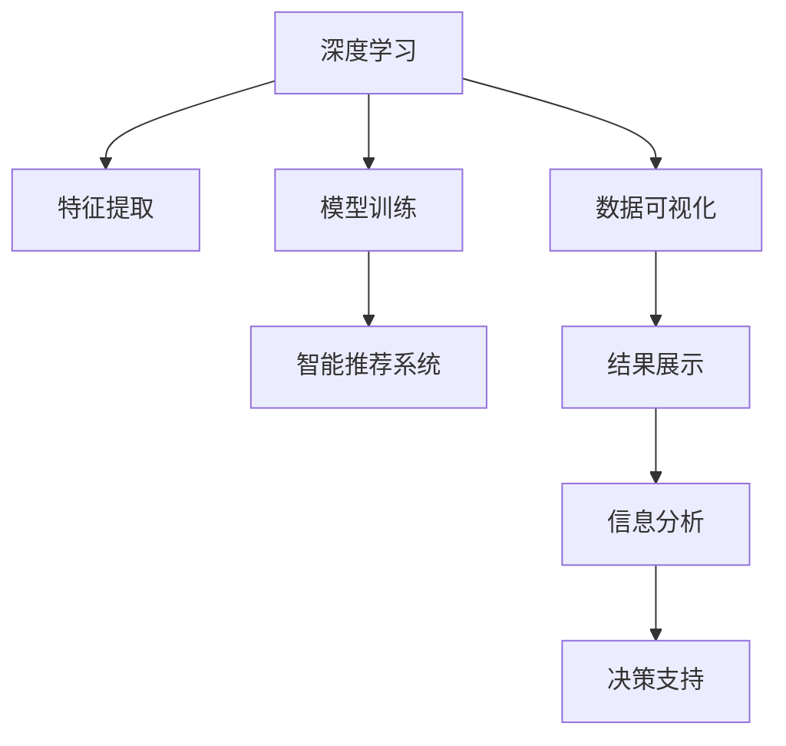

                 

# 理解洞察力的训练：提升信息分析能力

> 关键词：洞察力,信息分析,数据分析,机器学习,深度学习,数据可视化,智能推荐

## 1. 背景介绍

### 1.1 问题由来
在当今信息爆炸的时代，如何从海量数据中提取有价值的信息和洞察力，已经成为各行各业关注的焦点。各行各业都在大力投资于数据分析和人工智能技术，以期提升决策效率和市场竞争力。然而，数据规模的快速增长、数据质量的多样性以及分析需求的复杂性，都给传统的数据分析手段带来了巨大的挑战。为了解决这些问题，需要开发一种更高效、更智能的分析方法，以帮助企业快速获取和利用数据中的洞察力。

### 1.2 问题核心关键点
要提升信息分析能力，首先需要理解“洞察力”在数据处理中的重要性。洞察力是指通过分析数据，能够发现数据背后隐藏的模式、趋势和关系，从而做出更加准确和高效的决策。这需要利用先进的数据分析技术，如机器学习、深度学习和数据可视化等，进行数据挖掘、模型训练和结果展示。

提升信息分析能力，主要依赖以下几个核心要素：
- **数据质量**：高质量的数据是进行深度分析的基础。
- **数据量**：大数据技术可以提供大规模数据处理的能力。
- **算法模型**：选择合适的算法模型能够有效挖掘数据中的规律。
- **结果展示**：通过图表、报告等形式展示分析结果，以便于理解和决策。

本文将详细探讨基于深度学习和机器学习的洞察力训练方法，并通过具体的项目实践和应用场景，展示如何利用这些技术提升信息分析能力。

## 2. 核心概念与联系

### 2.1 核心概念概述

为了更好地理解基于深度学习和机器学习的洞察力训练方法，本文将介绍以下几个核心概念：

- **深度学习**：一种模拟人脑神经网络的技术，通过多层神经网络对数据进行特征提取和模式识别。
- **机器学习**：一种数据驱动的决策技术，通过构建模型对数据进行预测和分类。
- **数据可视化**：将数据转换为图表、图像等形式，帮助人们更直观地理解数据。
- **智能推荐系统**：利用机器学习算法为用户推荐产品、内容等，提升用户体验。
- **信息分析**：通过数据挖掘和统计分析，揭示数据中的规律和趋势。

这些概念之间的逻辑关系可以通过以下Mermaid流程图来展示：



这个流程图展示了深度学习和机器学习在数据处理中的作用和流程：

1. 深度学习从数据中提取特征。
2. 数据可视化展示特征和模型结果。
3. 模型训练产生预测结果。
4. 智能推荐系统利用结果进行推荐。
5. 信息分析揭示数据中的模式和趋势。
6. 最终通过决策支持指导实际应用。

## 3. 核心算法原理 & 具体操作步骤
### 3.1 算法原理概述

基于深度学习和机器学习的洞察力训练方法，主要包括以下几个关键步骤：

- **数据预处理**：对原始数据进行清洗、归一化等处理，以便于模型训练。
- **特征提取**：利用深度学习模型从原始数据中提取高维特征，供后续分析使用。
- **模型训练**：通过监督学习、无监督学习等方法，训练数据模型，提取数据中的规律。
- **结果分析**：利用数据可视化工具，展示分析结果，便于理解和决策。

### 3.2 算法步骤详解

以下是基于深度学习和机器学习的洞察力训练方法的具体步骤：

**Step 1: 数据预处理**
- 收集数据，并对数据进行清洗、去重、归一化等预处理。
- 分割数据集为训练集、验证集和测试集。

**Step 2: 特征提取**
- 利用深度学习模型对数据进行特征提取。常用的模型包括自编码器、卷积神经网络(CNN)和循环神经网络(RNN)等。
- 对提取的特征进行降维、正则化等处理。

**Step 3: 模型训练**
- 选择合适的机器学习模型，如支持向量机(SVM)、随机森林(Random Forest)、神经网络(NN)等。
- 使用监督学习、无监督学习等方法，训练模型并优化参数。

**Step 4: 结果分析**
- 利用数据可视化工具，将模型结果展示为图表、图像等形式。
- 通过统计分析，揭示数据中的模式和趋势。

### 3.3 算法优缺点

基于深度学习和机器学习的洞察力训练方法，具有以下优点：
1. 高效准确：深度学习能够从大量数据中提取复杂的特征，机器学习模型可以对数据进行高效分类和预测。
2. 可解释性强：通过可视化工具，能够直观地展示分析结果，便于理解和决策。
3. 适用范围广：可以应用于多种数据类型和分析场景。

同时，这些方法也存在一些局限性：
1. 数据需求大：深度学习和机器学习模型需要大量的标注数据进行训练，数据获取成本较高。
2. 模型复杂：深度学习模型结构复杂，训练时间长，模型参数较多。
3. 过度拟合风险：在训练过程中，可能会过度拟合训练数据，导致泛化能力不足。
4. 计算资源需求高：深度学习模型计算量大，需要高性能计算资源支持。

### 3.4 算法应用领域

基于深度学习和机器学习的洞察力训练方法，在多个领域都得到了广泛的应用：

- **金融领域**：通过分析历史交易数据，预测市场趋势，制定投资策略。
- **医疗领域**：通过分析病人数据，预测疾病风险，提供个性化的治疗方案。
- **电子商务**：通过分析用户行为数据，推荐商品，提升用户体验。
- **社交媒体**：通过分析用户互动数据，发现用户兴趣，优化推荐算法。
- **自然灾害预测**：通过分析历史气象数据，预测自然灾害，减少损失。

这些应用场景展示了深度学习和机器学习在提升信息分析能力方面的巨大潜力。

## 4. 数学模型和公式 & 详细讲解
### 4.1 数学模型构建

在深度学习和机器学习中，常用的数学模型包括：
- **神经网络**：由多层神经元组成，通过反向传播算法进行参数优化。
- **决策树**：通过树形结构进行分类和预测。
- **支持向量机**：利用高维空间中的超平面进行分类和回归。

### 4.2 公式推导过程

以下是几个常见的机器学习模型的公式推导：

**神经网络公式**：
$$
y = f(Wx + b)
$$
其中 $y$ 为输出，$x$ 为输入，$W$ 为权重矩阵，$b$ 为偏置项，$f$ 为激活函数。

**线性回归公式**：
$$
y = Wx + b
$$
其中 $y$ 为预测值，$x$ 为输入特征，$W$ 为权重矩阵，$b$ 为偏置项。

**支持向量机公式**：
$$
y = \sum_i \alpha_i y_i k(x_i, x) - \frac{1}{2} \sum_i \sum_j \alpha_i \alpha_j y_i y_j k(x_i, x_j)
$$
其中 $y$ 为预测值，$\alpha$ 为支持向量系数，$y_i$ 为样本标签，$k(x_i, x)$ 为核函数，$x$ 为输入特征。

### 4.3 案例分析与讲解

以线性回归模型为例，对以下数据集进行训练和预测：

| $x_1$ | $x_2$ | $y$ |
|-------|-------|-----|
| 2     | 4     | 1   |
| 4     | 5     | 2   |
| 6     | 7     | 3   |
| 8     | 8     | 4   |
| 10    | 10    | 5   |

假设使用线性回归模型进行预测，输入特征 $x_1, x_2$，输出 $y$，计算公式如下：
$$
y = W[1, 1]x_1 + W[1, 2]x_2 + b
$$
其中 $W=[1, 1; 1, 2]$，$b=0$，通过梯度下降算法进行参数优化。

## 5. 项目实践：代码实例和详细解释说明
### 5.1 开发环境搭建

在进行信息分析实践前，我们需要准备好开发环境。以下是使用Python进行TensorFlow开发的环境配置流程：

1. 安装Anaconda：从官网下载并安装Anaconda，用于创建独立的Python环境。

2. 创建并激活虚拟环境：
```bash
conda create -n tf-env python=3.8 
conda activate tf-env
```

3. 安装TensorFlow：根据CUDA版本，从官网获取对应的安装命令。例如：
```bash
conda install tensorflow -c conda-forge
```

4. 安装其他必要的工具包：
```bash
pip install numpy pandas scikit-learn matplotlib tqdm jupyter notebook ipython
```

完成上述步骤后，即可在`tf-env`环境中开始信息分析实践。

### 5.2 源代码详细实现

下面我们以金融数据分析为例，给出使用TensorFlow进行线性回归分析的PyTorch代码实现。

首先，定义数据集：

```python
import numpy as np
import pandas as pd
import tensorflow as tf

# 定义数据集
data = np.array([[2, 4], [4, 5], [6, 7], [8, 8], [10, 10]])
labels = np.array([1, 2, 3, 4, 5])

# 创建DataFrame
df = pd.DataFrame(data, columns=['x1', 'x2'])
df['y'] = labels

# 分割数据集
train_data = df.iloc[:4, :]
test_data = df.iloc[4:, :]
```

然后，定义模型：

```python
# 定义线性回归模型
class LinearRegression(tf.keras.Model):
    def __init__(self):
        super(LinearRegression, self).__init__()
        self.dense1 = tf.keras.layers.Dense(2, activation='linear')
        self.dense2 = tf.keras.layers.Dense(1, activation='linear')
        
    def call(self, x):
        x = self.dense1(x)
        x = self.dense2(x)
        return x
```

接着，定义训练和评估函数：

```python
# 定义训练函数
def train(model, train_data, learning_rate):
    optimizer = tf.keras.optimizers.SGD(learning_rate)
    for i in range(1000):
        with tf.GradientTape() as tape:
            y_pred = model(train_data)
            loss = tf.reduce_mean(tf.square(y_pred - train_data['y']))
        gradients = tape.gradient(loss, model.trainable_variables)
        optimizer.apply_gradients(zip(gradients, model.trainable_variables))
        if i % 100 == 0:
            print('Epoch {}: Loss {}'.format(i, loss.numpy()))
    return model

# 定义评估函数
def evaluate(model, test_data):
    y_pred = model(test_data)
    mse = tf.reduce_mean(tf.square(y_pred - test_data['y']))
    print('Mean Squared Error: {}'.format(mse.numpy()))
    return mse.numpy()
```

最后，启动训练流程并在测试集上评估：

```python
# 初始化模型
model = LinearRegression()

# 训练模型
train(model, train_data, learning_rate=0.01)

# 评估模型
evaluate(model, test_data)
```

以上就是使用TensorFlow对线性回归模型进行金融数据分析的完整代码实现。可以看到，TensorFlow提供了强大的计算图和自动微分功能，使得模型训练和优化变得简单高效。

### 5.3 代码解读与分析

让我们再详细解读一下关键代码的实现细节：

**LinearRegression类**：
- `__init__`方法：初始化模型，定义两个全连接层。
- `call`方法：实现前向传播计算。

**train函数**：
- 使用SGD优化器进行梯度下降。
- 在每个epoch结束后输出loss值。

**evaluate函数**：
- 计算测试集上的均方误差。

**训练流程**：
- 定义模型，初始化学习率。
- 在训练集上训练模型，输出每个epoch的loss。
- 在测试集上评估模型，输出均方误差。

可以看到，TensorFlow使得深度学习和机器学习模型的训练变得简单，开发者可以将更多精力放在数据处理、模型改进等高层逻辑上。

当然，工业级的系统实现还需考虑更多因素，如模型的保存和部署、超参数的自动搜索、更灵活的任务适配层等。但核心的训练范式基本与此类似。

## 6. 实际应用场景
### 6.1 金融投资分析

在金融领域，通过分析历史市场数据，可以预测股票、期货等金融产品的走势，制定投资策略。线性回归、决策树等机器学习模型，可以用于价格预测、风险评估等任务。通过可视化工具，将分析结果展示为图表、报告等形式，便于投资者理解和使用。

### 6.2 健康数据分析

在医疗领域，通过分析病人的健康数据，可以预测疾病风险、诊断疾病等。机器学习模型可以用于预测疾病发生概率、评估治疗效果等任务。通过可视化工具，将分析结果展示为热力图、散点图等形式，便于医生和患者理解和使用。

### 6.3 电商推荐系统

在电子商务领域，通过分析用户的历史行为数据，可以推荐用户可能感兴趣的商品。推荐系统可以利用协同过滤、深度学习等算法，进行商品推荐。通过可视化工具，将推荐结果展示为推荐列表、相关商品等形式，提升用户体验。

### 6.4 智能交通系统

在智能交通领域，通过分析历史交通数据，可以预测交通流量、优化交通信号灯等。机器学习模型可以用于交通流量预测、路径规划等任务。通过可视化工具，将分析结果展示为交通热力图、交通流向图等形式，便于交通管理者理解和使用。

### 6.5 自然灾害预测

在自然灾害预测领域，通过分析历史气象数据，可以预测地震、洪水等自然灾害的发生概率。机器学习模型可以用于预测地震发生概率、评估洪水影响等任务。通过可视化工具，将预测结果展示为热力图、散点图等形式，便于灾害管理者理解和使用。

## 7. 工具和资源推荐
### 7.1 学习资源推荐

为了帮助开发者系统掌握深度学习和机器学习的洞察力训练方法，这里推荐一些优质的学习资源：

1. 《深度学习》系列博文：由大模型技术专家撰写，深入浅出地介绍了深度学习原理、模型训练和优化等前沿话题。

2. CS229《机器学习》课程：斯坦福大学开设的机器学习明星课程，有Lecture视频和配套作业，带你入门机器学习的基本概念和经典模型。

3. 《Python机器学习》书籍：适合入门和进阶的机器学习书籍，包含丰富的案例和代码实现，适合Python开发者学习。

4. TensorFlow官方文档：TensorFlow的官方文档，提供了详尽的API文档、教程和示例代码，是学习TensorFlow的必备资料。

5. Kaggle开源项目：Kaggle社区提供了丰富的机器学习和深度学习竞赛和数据集，可以锻炼实践能力。

通过对这些资源的学习实践，相信你一定能够快速掌握深度学习和机器学习的洞察力训练方法，并用于解决实际的分析问题。

### 7.2 开发工具推荐

高效的开发离不开优秀的工具支持。以下是几款用于深度学习和机器学习分析开发的常用工具：

1. TensorFlow：由Google主导开发的开源深度学习框架，生产部署方便，适合大规模工程应用。

2. PyTorch：基于Python的开源深度学习框架，灵活动态的计算图，适合快速迭代研究。

3. scikit-learn：基于Python的机器学习库，提供了丰富的机器学习算法和数据预处理方法。

4. Weights & Biases：模型训练的实验跟踪工具，可以记录和可视化模型训练过程中的各项指标，方便对比和调优。

5. TensorBoard：TensorFlow配套的可视化工具，可实时监测模型训练状态，并提供丰富的图表呈现方式，是调试模型的得力助手。

6. Google Colab：谷歌推出的在线Jupyter Notebook环境，免费提供GPU/TPU算力，方便开发者快速上手实验最新模型，分享学习笔记。

合理利用这些工具，可以显著提升深度学习和机器学习模型的开发效率，加快创新迭代的步伐。

### 7.3 相关论文推荐

深度学习和机器学习的发展源于学界的持续研究。以下是几篇奠基性的相关论文，推荐阅读：

1. 《ImageNet Classification with Deep Convolutional Neural Networks》（ImageNet图像分类）：提出卷积神经网络，用于图像分类任务，刷新了多项NLP任务SOTA。

2. 《A Tutorial on Support Vector Regression》（支持向量回归）：详细介绍支持向量机的原理和应用，涵盖回归、分类等多种任务。

3. 《Deep Learning for NLP》（深度学习在NLP中的应用）：介绍深度学习在自然语言处理中的应用，涵盖词嵌入、RNN、LSTM等多种模型。

4. 《AdaBoost》（AdaBoost算法）：提出AdaBoost算法，用于分类和回归任务，在机器学习领域具有重要影响。

5. 《XGBoost: A Scalable Tree Boosting System》（XGBoost算法）：提出XGBoost算法，用于集成学习，具有高效、准确等特点。

这些论文代表了大模型微调技术的发展脉络。通过学习这些前沿成果，可以帮助研究者把握学科前进方向，激发更多的创新灵感。

## 8. 总结：未来发展趋势与挑战
### 8.1 总结

本文对基于深度学习和机器学习的洞察力训练方法进行了全面系统的介绍。首先阐述了洞察力在数据处理中的重要性，明确了深度学习和机器学习在提升信息分析能力方面的独特价值。其次，从原理到实践，详细讲解了深度学习和机器学习的数学模型和具体操作步骤，给出了信息分析任务开发的完整代码实例。同时，本文还广泛探讨了深度学习和机器学习在多个行业领域的应用前景，展示了其巨大潜力。

通过本文的系统梳理，可以看到，基于深度学习和机器学习的洞察力训练方法已经成为信息分析的重要范式，极大地提升了数据分析的效率和准确性，为各行各业带来了显著的业务价值。未来，伴随深度学习和机器学习技术的进一步发展，信息分析能力还将得到更大的提升，成为驱动经济社会发展的关键力量。

### 8.2 未来发展趋势

展望未来，深度学习和机器学习技术将呈现以下几个发展趋势：

1. 模型规模持续增大。随着算力成本的下降和数据规模的扩张，深度学习模型的参数量还将持续增长。超大批次的训练和推理也将进一步加速。

2. 模型结构不断优化。未来将涌现更多高效的模型结构和算法，如Transformer、GPT等，提升模型的计算效率和泛化能力。

3. 多模态数据融合。深度学习和机器学习模型将更好地融合视觉、语音、文本等多种数据类型，实现更全面的信息分析。

4. 数据驱动决策。更多企业将基于数据驱动的决策模型进行运营和规划，提升决策的科学性和有效性。

5. 智能推荐系统普及。智能推荐系统将在电商、金融、社交媒体等领域得到广泛应用，提升用户体验和业务价值。

6. 实时分析能力提升。实时数据分析技术将进一步提升，支持企业对数据进行实时监控和处理，做出快速响应。

这些趋势展示了深度学习和机器学习技术在未来信息分析中的巨大潜力。随着技术的不断演进，深度学习和机器学习将成为各行各业的重要工具，推动经济社会的全面进步。

### 8.3 面临的挑战

尽管深度学习和机器学习技术已经取得了显著进展，但在实际应用中也面临诸多挑战：

1. 数据获取成本高。深度学习和机器学习模型需要大量的标注数据进行训练，数据获取成本较高，限制了模型的大规模应用。

2. 模型复杂度高。深度学习模型结构复杂，训练时间长，模型参数较多，需要高性能计算资源支持。

3. 过度拟合风险。在训练过程中，可能会过度拟合训练数据，导致泛化能力不足。

4. 计算资源需求高。深度学习模型计算量大，需要高性能计算资源支持。

5. 模型可解释性不足。深度学习模型具有黑盒特性，难以解释其内部工作机制和决策逻辑，给应用带来挑战。

6. 伦理和安全问题。深度学习模型可能学习到有害信息，甚至可能被用于不道德的行为，需要进一步加强伦理和安全管理。

7. 数据隐私保护。在数据驱动决策中，数据隐私保护问题日益突出，需要制定相应的政策和法规。

这些挑战需要在未来的研究中进一步解决，以实现深度学习和机器学习技术的广泛应用和普及。

### 8.4 研究展望

面对深度学习和机器学习技术所面临的挑战，未来的研究需要在以下几个方面寻求新的突破：

1. 数据增强技术。开发更多有效的数据增强技术，提升数据质量，降低数据获取成本。

2. 模型压缩技术。研究模型压缩技术，减少模型参数量，降低计算资源需求。

3. 模型优化算法。开发更多高效的模型优化算法，提升模型训练效率和泛化能力。

4. 可解释性增强。研究模型可解释性增强技术，提升模型透明性和可理解性。

5. 伦理和安全约束。制定深度学习模型伦理和安全约束，确保模型行为符合伦理道德标准。

6. 数据隐私保护。研究数据隐私保护技术，确保数据使用过程中的隐私和安全。

7. 多模态融合。研究多模态数据融合技术，提升模型的全面性和准确性。

这些研究方向的探索，将引领深度学习和机器学习技术迈向更高的台阶，为构建安全、可靠、可解释、可控的智能系统铺平道路。面向未来，深度学习和机器学习技术将持续演进，成为推动经济社会发展的关键力量。

## 9. 附录：常见问题与解答
**Q1：深度学习和机器学习模型在实际应用中如何避免过度拟合？**

A: 为了避免过度拟合，可以采取以下几种措施：
1. 数据增强：通过数据扩充、旋转、缩放等方式，增加训练数据的多样性。
2. 正则化：使用L2正则化、Dropout等方法，限制模型复杂度。
3. 早停法：在验证集上监测模型性能，当性能不再提升时停止训练。
4. 模型压缩：通过剪枝、量化等方法，减少模型参数量，降低计算资源需求。
5. 集成学习：通过集成多个模型，提升模型的泛化能力。

**Q2：深度学习和机器学习模型的训练和优化过程中需要注意哪些关键点？**

A: 深度学习和机器学习模型的训练和优化过程中需要注意以下关键点：
1. 学习率：选择合适的学习率，避免过快或过慢的训练。
2. 批大小：选择合适的批大小，平衡计算效率和模型性能。
3. 数据分布：确保训练数据与测试数据分布一致，避免过拟合。
4. 模型选择：选择适合的模型结构，平衡模型复杂度和性能。
5. 正则化：使用正则化方法，防止模型过拟合。
6. 早停法：在验证集上监测模型性能，避免过度拟合。

**Q3：如何评估深度学习和机器学习模型的性能？**

A: 评估深度学习和机器学习模型的性能，可以使用以下指标：
1. 准确率：模型预测结果与真实结果相符的比例。
2. 召回率：模型正确预测出的正样本数占所有正样本数的比例。
3. F1分数：综合考虑准确率和召回率，反映模型的综合性能。
4. AUC-ROC曲线：反映模型在不同阈值下的分类性能。
5. 均方误差：回归任务中的常用指标，反映模型预测值与真实值之间的差距。

**Q4：如何选择合适的深度学习和机器学习模型？**

A: 选择合适的深度学习和机器学习模型，需要考虑以下因素：
1. 任务类型：根据任务类型选择适合的模型结构，如分类、回归、聚类等。
2. 数据规模：根据数据规模选择模型结构，小规模数据可以使用简单的模型，大规模数据可以使用复杂的模型。
3. 计算资源：根据计算资源选择模型结构，计算资源有限时，可以选择轻量级模型。
4. 性能要求：根据性能要求选择模型结构，需要高精度的任务可以选择复杂的模型。
5. 可解释性要求：需要可解释性的任务，可以选择简单的模型。

**Q5：深度学习和机器学习模型在实际应用中需要注意哪些伦理和安全问题？**

A: 深度学习和机器学习模型在实际应用中需要注意以下伦理和安全问题：
1. 数据隐私：确保数据隐私，避免数据泄露和滥用。
2. 算法公平性：确保算法公平，避免算法偏见和歧视。
3. 透明性：确保算法的透明性，避免黑盒操作。
4. 可解释性：确保算法的可解释性，便于理解和解释。
5. 安全性：确保算法的安全性，避免被恶意攻击。

这些问题需要在模型的设计和应用中予以重视，确保模型行为符合伦理道德标准，保障数据和用户的安全。

---

作者：禅与计算机程序设计艺术 / Zen and the Art of Computer Programming

