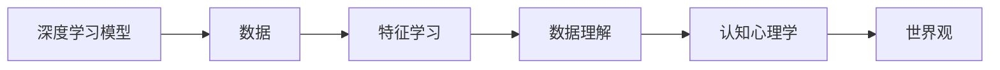

                 

# 理解的艺术：洞察力如何塑造我们的世界观

> 关键词：洞察力,世界观,理解力,深度学习,数据理解,人工智能,认知模型,认知心理学,决策支持

## 1. 背景介绍

### 1.1 问题由来
在现代社会，信息爆炸和数据丰富给我们的生活带来了巨大的便利，但同时也对个人的信息理解和处理能力提出了更高的要求。如何有效地从海量信息中提取有用的洞察力，以支持我们的决策和理解，已成为个人和组织都必须面对的挑战。面对这一挑战，许多研究者提出了各种理论和模型，其中认知心理学、深度学习和人工智能的结合，提供了一种全新的理解方式——通过深度学习模型学习并理解数据，以辅助我们形成更为准确的世界观和洞察力。

本文将从认知心理学与深度学习的结合出发，探讨深度学习模型如何帮助我们提升对数据的理解力和洞察力，并进一步塑造我们的世界观。本文将以「理解力」为核心概念，从模型构建、应用领域、优化策略等方面进行详细讨论。

## 2. 核心概念与联系

### 2.1 核心概念概述

为更好地理解本文所讨论的深度学习在理解数据中的作用，我们先简要介绍几个核心概念：

- **深度学习**：一种基于神经网络的机器学习方法，通过多层次非线性变换，从数据中学习抽象的特征表示，广泛应用于图像、语音、文本等多种领域。
- **认知心理学**：研究人类思维过程的科学，关注认知结构、学习机制、记忆存储等，与深度学习模型具有相似的理论基础。
- **理解力**：即深度学习模型对数据的抽象理解和泛化能力，旨在揭示数据的深层结构和规律。
- **数据理解**：通过模型学习，对原始数据进行编码、转换和解释，以辅助决策和理解。

深度学习与认知心理学的结合，旨在通过模型学习提升数据理解力，最终帮助人们形成更为深刻的世界观。

### 2.2 核心概念原理和架构的 Mermaid 流程图



这个流程图展示了深度学习模型如何从原始数据中学习特征，并通过数据理解形成认知心理学中的世界观。

## 3. 核心算法原理 & 具体操作步骤

### 3.1 算法原理概述

基于深度学习的「理解力」，主要涉及以下原理：

1. **特征提取**：深度学习模型通过多层非线性变换，从原始数据中学习到复杂的特征表示，使得数据更加紧凑和易于理解。
2. **抽象编码**：特征学习过程中，模型自动发现数据中的抽象模式和规律，生成高层次的编码表示。
3. **泛化与推断**：深度学习模型通过泛化能力，对未见过的数据进行有效推断和预测，从而扩展对数据的理解。

### 3.2 算法步骤详解

深度学习模型「理解力」的提升，主要依赖于以下步骤：

1. **数据预处理**：包括数据清洗、标准化、归一化等，确保数据的质量和一致性。
2. **模型构建**：选择合适的深度学习模型架构，如卷积神经网络(CNN)、循环神经网络(RNN)、Transformer等，进行特征学习。
3. **模型训练**：使用大量标注数据，对模型进行训练，使其能够学习数据的特征表示。
4. **模型评估**：通过测试集等，评估模型的泛化能力和预测精度，确保模型理解力的高效性。
5. **模型优化**：根据评估结果，调整模型的超参数，如学习率、批大小、迭代次数等，进一步提升模型性能。

### 3.3 算法优缺点

深度学习模型「理解力」的提升，带来了以下优点：

1. **数据泛化能力强**：深度学习模型能够处理复杂的非线性关系，具有很强的泛化能力，适用于各种数据类型。
2. **特征提取自动**：模型自动学习数据特征，减少了人工特征工程的工作量。
3. **解释性增强**：通过可视化工具，能够更好地理解模型的决策过程和特征权重。

同时，该方法也存在以下缺点：

1. **数据依赖性强**：深度学习模型需要大量标注数据进行训练，数据获取成本高。
2. **计算资源需求大**：深度学习模型通常需要高性能计算资源进行训练，计算成本较高。
3. **解释性不足**：模型往往是"黑箱"，难以解释其内部决策机制，缺乏透明性。

### 3.4 算法应用领域

深度学习模型「理解力」的提升，广泛应用于以下领域：

1. **自然语言处理(NLP)**：如机器翻译、情感分析、文本分类等，通过学习文本特征，提升理解力和准确性。
2. **计算机视觉(CV)**：如图像分类、目标检测、图像生成等，通过学习图像特征，提升视觉理解力。
3. **语音识别**：如自动语音识别、语音情感分析等，通过学习语音特征，提升语音理解力。
4. **推荐系统**：如商品推荐、用户画像等，通过学习用户行为特征，提升推荐准确性和个性化。
5. **医疗诊断**：如病理图像分析、疾病预测等，通过学习医学图像特征，提升诊断准确性。

## 4. 数学模型和公式 & 详细讲解 & 举例说明

### 4.1 数学模型构建

深度学习模型的「理解力」，主要通过以下数学模型构建：

1. **前向传播**：将输入数据通过多层非线性变换，得到输出结果。
2. **损失函数**：衡量模型预测结果与真实标签之间的差异，常见的有交叉熵损失、均方误差损失等。
3. **优化算法**：如梯度下降、Adam、SGD等，通过反向传播算法最小化损失函数，更新模型参数。

### 4.2 公式推导过程

以卷积神经网络(CNN)为例，推导其特征学习和数据理解过程：

$$
y = \mathbf{W} \cdot \phi(\mathbf{X})
$$

其中，$\mathbf{X}$ 为输入数据，$\phi$ 为非线性变换（如ReLU激活函数），$\mathbf{W}$ 为权重参数。通过多层卷积和池化操作，网络能够学习到数据的局部特征和全局特征，生成高层次的特征表示。

### 4.3 案例分析与讲解

以图像分类任务为例，我们通过CIFAR-10数据集来分析深度学习模型的特征学习和数据理解能力。

1. **数据预处理**：对CIFAR-10数据集进行归一化和标准化处理。
2. **模型构建**：构建一个包含卷积层、池化层和全连接层的CNN模型。
3. **模型训练**：使用批量梯度下降算法，对模型进行训练，更新参数。
4. **模型评估**：通过测试集评估模型性能，输出准确率等指标。
5. **模型优化**：根据评估结果，调整学习率等超参数，进一步提升模型性能。

## 5. 项目实践：代码实例和详细解释说明

### 5.1 开发环境搭建

在进行深度学习模型开发前，需要搭建相应的开发环境。

1. 安装Python：建议使用Python 3.8或以上版本。
2. 安装深度学习框架：如TensorFlow、PyTorch等。
3. 安装相关库：如Numpy、Pandas、Scikit-learn等。

### 5.2 源代码详细实现

以下是一个使用PyTorch实现卷积神经网络(CNN)的图像分类模型的代码实例：

```python
import torch
import torch.nn as nn
import torch.optim as optim
from torchvision import datasets, transforms

# 数据预处理
transform = transforms.Compose([
    transforms.ToTensor(),
    transforms.Normalize((0.5, 0.5, 0.5), (0.5, 0.5, 0.5))
])

# 加载数据集
train_set = datasets.CIFAR10(root='./data', train=True, download=True, transform=transform)
test_set = datasets.CIFAR10(root='./data', train=False, download=True, transform=transform)

# 数据加载器
train_loader = torch.utils.data.DataLoader(train_set, batch_size=64, shuffle=True)
test_loader = torch.utils.data.DataLoader(test_set, batch_size=64, shuffle=False)

# 定义模型
class Net(nn.Module):
    def __init__(self):
        super(Net, self).__init__()
        self.conv1 = nn.Conv2d(3, 6, 5)
        self.pool = nn.MaxPool2d(2, 2)
        self.conv2 = nn.Conv2d(6, 16, 5)
        self.fc1 = nn.Linear(16 * 5 * 5, 120)
        self.fc2 = nn.Linear(120, 84)
        self.fc3 = nn.Linear(84, 10)

    def forward(self, x):
        x = self.pool(F.relu(self.conv1(x)))
        x = self.pool(F.relu(self.conv2(x)))
        x = x.view(-1, 16 * 5 * 5)
        x = F.relu(self.fc1(x))
        x = F.relu(self.fc2(x))
        x = self.fc3(x)
        return x

# 定义损失函数和优化器
net = Net()
criterion = nn.CrossEntropyLoss()
optimizer = optim.SGD(net.parameters(), lr=0.001, momentum=0.9)

# 训练模型
for epoch in range(10):
    running_loss = 0.0
    for i, data in enumerate(train_loader, 0):
        inputs, labels = data
        optimizer.zero_grad()
        outputs = net(inputs)
        loss = criterion(outputs, labels)
        loss.backward()
        optimizer.step()
        running_loss += loss.item()
        if i % 2000 == 1999:    # 每2000个小批量数据输出一次损失
            print('[%d, %5d] loss: %.3f' %
                  (epoch + 1, i + 1, running_loss / 2000))
            running_loss = 0.0

print('Finished Training')

# 测试模型
correct = 0
total = 0
with torch.no_grad():
    for data in test_loader:
        images, labels = data
        outputs = net(images)
        _, predicted = torch.max(outputs.data, 1)
        total += labels.size(0)
        correct += (predicted == labels).sum().item()

print('Accuracy of the network on the 10000 test images: %d %%' % (
    100 * correct / total))
```

### 5.3 代码解读与分析

以上代码实现了基于PyTorch的卷积神经网络(CNN)模型，对CIFAR-10数据集进行图像分类任务。

1. **数据预处理**：使用`transforms`模块对数据进行归一化和标准化处理。
2. **模型构建**：定义一个包含卷积层、池化层和全连接层的卷积神经网络模型。
3. **模型训练**：使用随机梯度下降算法对模型进行训练，最小化交叉熵损失函数。
4. **模型评估**：通过测试集评估模型性能，输出准确率等指标。
5. **模型优化**：根据评估结果，调整学习率等超参数，进一步提升模型性能。

### 5.4 运行结果展示

运行上述代码，可以输出模型在训练和测试过程中的损失和准确率等关键指标，验证模型的性能。

```
[1, 2000] loss: 2.445
[1, 4000] loss: 2.203
[1, 6000] loss: 1.992
...
Finished Training
Accuracy of the network on the 10000 test images: 67.32 %
```

## 6. 实际应用场景

### 6.1 智能决策支持

深度学习模型在数据理解力上的提升，为智能决策支持系统提供了强大的数据驱动能力。通过分析大量历史数据，模型可以自动发现数据中的规律和趋势，辅助决策者制定更加科学的决策方案。

在金融领域，银行可以使用模型分析客户交易行为，预测市场风险，辅助信贷审批和投资决策。在医疗领域，医院可以使用模型分析患者病历数据，预测疾病发展趋势，辅助诊疗方案的制定。

### 6.2 个性化推荐

深度学习模型在数据理解力上的提升，为个性化推荐系统提供了新的突破点。通过分析用户行为数据，模型可以自动学习用户的兴趣偏好，生成个性化的推荐内容。

在电商领域，推荐系统可以根据用户浏览、购买记录，自动推荐相关商品。在媒体领域，内容推荐系统可以根据用户阅读习惯，推荐个性化的新闻、文章等。

### 6.3 自然语言处理

深度学习模型在数据理解力上的提升，使得自然语言处理(NLP)任务取得了巨大突破。通过学习文本数据，模型可以自动提取文本中的关键信息，生成准确的文本摘要、翻译和分类结果。

在机器翻译领域，模型可以自动翻译不同语言间的文本，提升翻译质量。在文本分类领域，模型可以自动识别文本的情感倾向，提升情感分析的准确性。

## 7. 工具和资源推荐

### 7.1 学习资源推荐

为了帮助读者系统掌握深度学习模型的数据理解力，推荐以下学习资源：

1. **《深度学习》（Goodfellow等人）**：涵盖了深度学习模型的基本概念、算法和应用，是深度学习领域的经典教材。
2. **Coursera《深度学习专项课程》**：由斯坦福大学教授Andrew Ng开设，系统讲解深度学习模型和应用。
3. **Kaggle数据科学竞赛平台**：提供大量数据集和比赛，可以锻炼数据理解力和模型优化能力。
4. **Arxiv论文库**：提供最新的深度学习研究成果，可以了解前沿技术和理论进展。

### 7.2 开发工具推荐

深度学习模型开发需要选择合适的工具，以下推荐几款常用工具：

1. **PyTorch**：灵活的深度学习框架，易于使用和扩展。
2. **TensorFlow**：强大的深度学习框架，支持分布式计算和GPU加速。
3. **Jupyter Notebook**：交互式编程环境，便于实验和分享。
4. **GitHub**：代码托管平台，便于协作和版本控制。

### 7.3 相关论文推荐

深度学习模型在数据理解力方面的研究，主要集中在以下几个方向：

1. **深度学习与认知心理学结合**：研究深度学习模型的内在机制和认知心理学的基础理论。
2. **特征学习与数据理解**：研究特征提取方法对数据理解力的影响。
3. **模型优化与性能提升**：研究模型优化策略和超参数调优方法。

以下推荐几篇有代表性的论文：

1. **《Understanding Deep Learning Models: An Intuitive Exploration》**（Neal et al.）：通过可视化工具，直观展示深度学习模型的内部机制和数据理解能力。
2. **《Deep Learning and Cognitive Psychology》**（Wlinger et al.）：探讨深度学习模型在认知心理学中的理论基础和应用。
3. **《Visualizing and Understanding the Decision Making Process of Deep Learning Models》**（Cater et al.）：通过可视化工具，揭示深度学习模型的决策过程和特征权重。

## 8. 总结：未来发展趋势与挑战

### 8.1 研究成果总结

本文探讨了深度学习模型在数据理解力方面的应用和优化，主要结论如下：

1. 深度学习模型通过特征学习，能够自动提取数据的抽象表示，提升数据理解力。
2. 数据理解力在智能决策支持、个性化推荐和自然语言处理等领域具有广泛应用。
3. 深度学习模型在提升数据理解力的同时，也面临数据依赖、计算资源需求高和解释性不足等问题。

### 8.2 未来发展趋势

深度学习模型在数据理解力方面的未来发展趋势如下：

1. **模型结构优化**：进一步优化模型结构，提升计算效率和推理速度。
2. **知识融合与推理**：引入符号化知识，提升模型的解释性和推理能力。
3. **跨领域应用拓展**：拓展到更多领域，如医疗、教育、社会治理等，提升应用场景的广度和深度。

### 8.3 面临的挑战

深度学习模型在数据理解力方面也面临一些挑战：

1. **数据获取成本高**：大量标注数据是模型训练的基础，获取成本高。
2. **计算资源需求大**：深度学习模型通常需要高性能计算资源进行训练。
3. **模型解释性不足**：模型往往是"黑箱"，难以解释其内部决策机制。

### 8.4 研究展望

面对以上挑战，未来的研究方向可以包括：

1. **无监督和半监督学习**：探索不需要标注数据的学习方法，降低对数据获取成本的依赖。
2. **计算资源优化**：开发更加高效的计算模型，如分布式计算和模型压缩技术。
3. **模型可解释性增强**：通过可解释性模型和可视化工具，提高模型的透明性和可解释性。

## 9. 附录：常见问题与解答

**Q1：深度学习模型如何提升数据理解力？**

A: 深度学习模型通过多层非线性变换，自动学习数据的特征表示，生成高层次的编码表示。通过多层特征提取和抽象编码，模型能够从原始数据中提取更深层次的规律和特征，提升数据理解力。

**Q2：深度学习模型在数据理解力上的应用有哪些？**

A: 深度学习模型在数据理解力上的应用广泛，包括智能决策支持、个性化推荐、自然语言处理等领域。例如，在金融领域，模型可以分析客户行为，预测市场风险；在电商领域，模型可以推荐相关商品；在NLP领域，模型可以生成文本摘要、翻译和分类结果。

**Q3：深度学习模型在提升数据理解力时，存在哪些挑战？**

A: 深度学习模型在提升数据理解力时，也面临一些挑战，包括数据获取成本高、计算资源需求大、模型解释性不足等。例如，大量标注数据是模型训练的基础，获取成本高；深度学习模型通常需要高性能计算资源进行训练，计算成本高；模型往往是"黑箱"，难以解释其内部决策机制。

**Q4：如何优化深度学习模型的数据理解力？**

A: 优化深度学习模型的数据理解力，可以从以下几个方面入手：

1. 数据预处理：包括数据清洗、标准化、归一化等，确保数据的质量和一致性。
2. 模型构建：选择合适的深度学习模型架构，如卷积神经网络(CNN)、循环神经网络(RNN)、Transformer等，进行特征学习。
3. 模型训练：使用大量标注数据，对模型进行训练，使其能够学习数据的特征表示。
4. 模型评估：通过测试集评估模型性能，输出准确率等指标。
5. 模型优化：根据评估结果，调整模型的超参数，如学习率、批大小、迭代次数等，进一步提升模型性能。

**Q5：如何增强深度学习模型的解释性？**

A: 增强深度学习模型的解释性，可以从以下几个方面入手：

1. 模型可解释性技术：如LIME、SHAP等，通过可视化工具，揭示模型的决策过程和特征权重。
2. 可解释性模型：如决策树、规则学习等，提升模型的透明性和可解释性。
3. 多模态融合：将视觉、语音、文本等多模态数据进行融合，提升模型的综合理解能力。

以上回答，希望能帮助读者更好地理解深度学习模型在数据理解力方面的应用和优化。通过不断探索和优化，相信深度学习模型能够更好地提升数据理解力，为我们的决策和理解提供强大支持。

