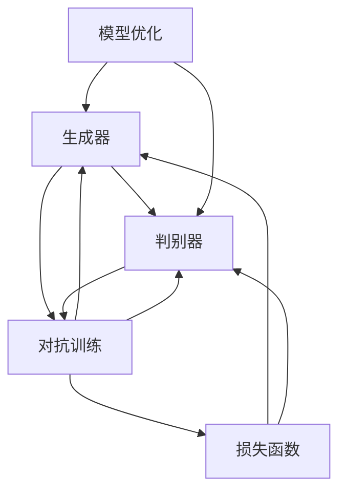

                 

# 生成对抗网络（GAN）：创造性AI应用

> 关键词：生成对抗网络,创造性AI,图像生成,图像修复,风格迁移,音乐生成,自然语言处理,模型优化

## 1. 背景介绍

### 1.1 问题由来

生成对抗网络（Generative Adversarial Networks, GANs）是由Ian Goodfellow、Yoshua Bengio和Aaron Courville于2014年提出的一种新型深度学习模型。GANs通过一对对抗的神经网络模型——生成器（Generator）和判别器（Discriminator），能够在无需监督的情况下生成高质量的图像、音频、视频等多模态数据，具有广泛的应用前景。

GANs的核心思想是：生成器和判别器分别通过神经网络构建。生成器负责生成尽可能逼真的样本，判别器则负责区分样本是真实数据还是生成器伪造的数据。两个网络通过对抗性训练，不断提升生成器的生成能力和判别器的判别能力，最终达到一种平衡状态，生成器能够生成以假乱真的样本。

GANs的提出，极大推动了深度学习技术在创造性AI应用中的发展，使得计算机能够生成出与真实世界高度相似的新数据。GANs还被广泛应用于图像生成、图像修复、风格迁移、音乐生成、自然语言处理等多个领域，极大地拓展了人工智能的应用边界。

### 1.2 问题核心关键点

GANs的成功主要源于以下几个关键点：

- 对抗训练：生成器和判别器通过不断对抗更新，提升生成器的生成能力和判别器的判别能力。
- 无监督学习：GANs不需要大量的标注数据，能够在大规模无标签数据上训练生成器。
- 强大表达能力：GANs通过生成器可学习到复杂多样的数据分布，生成高质量的样本。
- 模型灵活性：GANs能够灵活应用于不同模态的数据生成，如图像、音频、文本等。

以上这些关键点，共同构成了GANs的强大能力，使得其能够在各个领域取得显著的成果。

### 1.3 问题研究意义

研究GANs的核心算法和实践方法，对于推动生成式AI技术的发展，拓展人工智能的应用范围，具有重要意义：

1. 提供高效的数据生成手段：GANs能够从无标签数据中学习生成模型，减少标注成本，提升数据生成效率。
2. 增强模型的创造能力：GANs能够生成高质量、多样化的数据，增强模型的创造力和泛化能力。
3. 提升AI应用的落地性：GANs在图像生成、风格迁移、音乐生成等领域的应用，极大地拓展了人工智能技术的市场应用前景。
4. 实现跨模态数据生成：GANs能够灵活应用于不同模态的数据生成，如将图像转化为文本、将音乐转化为图像等，为跨模态数据融合提供了新的思路。
5. 推动深度学习研究进展：GANs作为深度学习领域的创新技术，不断催生新的研究方向和算法，推动深度学习技术的不断进步。

总之，GANs不仅在理论研究上具有重要意义，还在实际应用中展现了巨大的潜力和价值，是推动深度学习技术发展的重要力量。

## 2. 核心概念与联系

### 2.1 核心概念概述

为更好地理解GANs的核心算法和实践方法，本节将介绍几个密切相关的核心概念：

- 生成对抗网络（GANs）：一种由生成器和判别器组成的深度学习模型，通过对抗训练生成高质量的新数据。
- 生成器（Generator）：负责生成尽可能逼真的样本，结构类似于解码器，能够学习数据的分布。
- 判别器（Discriminator）：负责区分样本是真实数据还是生成器伪造的数据，结构类似于分类器，能够学习数据的判别能力。
- 损失函数：用于衡量生成器和判别器之间的对抗性能，包括交叉熵损失、对抗损失等。
- 对抗训练：生成器和判别器通过对抗性更新，提升模型的生成能力和判别能力，达到一种平衡状态。
- 样本空间：生成器和判别器通过对抗训练，学习到的样本空间，用于生成和判别新数据。
- 模型优化：通过优化生成器和判别器的参数，提高GANs的生成能力和判别能力。

这些核心概念之间的逻辑关系可以通过以下Mermaid流程图来展示：



这个流程图展示了GANs的构成和训练过程：

1. 生成器和判别器通过对抗性训练，不断提升生成能力和判别能力。
2. 对抗训练过程中，通过优化生成器和判别器的参数，优化损失函数，提升模型的性能。
3. 生成器和判别器通过对抗训练，学习到样本空间，用于生成和判别新数据。

## 3. 核心算法原理 & 具体操作步骤
### 3.1 算法原理概述

GANs的训练过程可以概括为以下几步：

1. 生成器和判别器的初始化。
2. 生成器尝试生成样本，判别器尝试区分样本。
3. 计算生成器和判别器的损失函数，分别反向传播更新参数。
4. 不断重复步骤2和3，直到生成器和判别器达到平衡状态，生成器能够生成以假乱真的样本。

GANs的训练目标是通过对抗训练，使生成器生成的样本与真实数据在判别器无法区分的状态下达到最优。具体而言，GANs的训练目标可以表示为：

$$
\mathop{\min}_{G}\mathop{\max}_{D} E_{x\sim p_{data}}[\log D(x)] + E_{z\sim p(z)}[\log (1-D(G(z)))]
$$

其中，$G$ 为生成器，$D$ 为判别器，$x$ 为真实数据，$z$ 为生成器的输入噪声。

在训练过程中，生成器试图生成尽可能逼真的样本，使其在判别器下获得尽可能高的评价；而判别器则试图尽可能区分生成器和真实数据，使其对生成器生成的样本评价尽可能低。两个网络通过不断的对抗训练，不断提升自身的性能。

### 3.2 算法步骤详解

基于GANs的训练过程可以分解为以下几个关键步骤：

**Step 1: 初始化生成器和判别器**

生成器和判别器的初始化可以使用随机噪声等方法，通常生成器会随机生成样本，判别器会随机选择一些真实数据和生成的数据进行训练。

**Step 2: 生成和判别**

生成器尝试生成样本，判别器尝试判别样本。生成器的输入通常是随机噪声，输出为生成的样本。判别器的输入为样本，输出为样本是真实数据还是生成器的概率。

**Step 3: 计算损失函数**

生成器和判别器的损失函数可以分别表示为：

- 生成器的损失函数：
$$
L_G = -E_{z\sim p(z)}[\log (1-D(G(z))))
$$

- 判别器的损失函数：
$$
L_D = -E_{x\sim p_{data}}[\log D(x)] - E_{z\sim p(z)}[\log D(G(z))]
$$

其中，$E$ 表示期望，$p(z)$ 为生成器的输入噪声分布，$p_{data}$ 为真实数据的分布。

**Step 4: 反向传播与优化**

通过计算生成器和判别器的损失函数，分别反向传播更新生成器和判别器的参数，可以使用常见的优化算法如AdamW、SGD等。

**Step 5: 对抗训练**

在训练过程中，生成器和判别器交替进行训练。先训练生成器，再训练判别器，反之亦然，直到生成器生成的样本在判别器下无法区分。

### 3.3 算法优缺点

GANs在生成数据时具有以下优点：

1. 无需标注数据：GANs通过无监督学习，能够从大规模无标签数据中生成高质量的样本，减少了标注成本。
2. 生成数据多样：GANs生成的样本具有高度的多样性和创造性，能够生成出新颖的数据，拓展数据集的范围。
3. 生成速度较快：GANs的生成过程相对简单，生成的样本速度较快，能够快速提供大量高质量数据。

同时，GANs也存在以下缺点：

1. 训练不稳定：GANs的训练过程易陷入局部最优，生成器和判别器无法达到平衡状态。
2. 数据质量不高：GANs生成的样本存在一定的噪声和失真，无法保证样本的质量。
3. 生成样本可控性差：GANs生成的样本具有随机性，难以控制样本的具体特性。
4. 训练复杂度高：GANs的训练过程复杂，需要多次迭代训练，才能达到理想的生成效果。

尽管存在这些局限性，但GANs在大数据时代，仍以其高效的数据生成能力和创造性AI应用的广泛前景，受到学界和产业界的广泛关注。

### 3.4 算法应用领域

GANs的强大生成能力，使得其在多个领域得到了广泛应用，例如：

- 图像生成：使用GANs生成逼真的人脸、动物、景观等图像，可用于艺术创作、游戏设计等领域。
- 图像修复：通过GANs修复损坏的图片、视频，提高图像质量。
- 风格迁移：将一幅图像的风格转换为另一幅图像的风格，增强图像的表现力。
- 音乐生成：通过GANs生成具有创造性的音乐作品，可用于音乐创作、影视配乐等领域。
- 自然语言处理：通过GANs生成具有创造性的文本，如诗歌、小说等，丰富文本内容。
- 游戏设计：生成逼真的游戏角色、场景，提升游戏体验。
- 虚拟现实：生成逼真的虚拟环境，用于虚拟现实、增强现实等领域。

除了上述这些应用场景外，GANs还在艺术、时尚、医疗等多个领域得到应用，展示出其强大的生成能力。

## 4. 数学模型和公式 & 详细讲解 & 举例说明
### 4.1 数学模型构建

GANs的训练过程可以数学化表示为：

- 生成器的目标：最大化生成样本的质量
$$
\max_{G} \mathbb{E}_{z\sim p(z)}[\log (1-D(G(z)))
$$

- 判别器的目标：最大化区分真实样本和生成样本的能力
$$
\max_{D} \mathbb{E}_{x\sim p_{data}}[\log D(x)] + \mathbb{E}_{z\sim p(z)}[\log (1-D(G(z)))
$$

其中，$\mathbb{E}$ 表示期望，$p(z)$ 为生成器的输入噪声分布，$p_{data}$ 为真实数据的分布。

GANs的训练目标可以表示为：

$$
\mathop{\min}_{G}\mathop{\max}_{D} E_{x\sim p_{data}}[\log D(x)] + E_{z\sim p(z)}[\log (1-D(G(z)))
$$

在训练过程中，通过优化生成器和判别器的参数，使得生成器和判别器达到一种平衡状态，生成器生成的样本在判别器下无法区分。

### 4.2 公式推导过程

以下是GANs训练过程的数学推导：

- 生成器的目标：最大化生成样本的质量
$$
\max_{G} \mathbb{E}_{z\sim p(z)}[\log (1-D(G(z)))
$$

- 判别器的目标：最大化区分真实样本和生成样本的能力
$$
\max_{D} \mathbb{E}_{x\sim p_{data}}[\log D(x)] + \mathbb{E}_{z\sim p(z)}[\log (1-D(G(z)))
$$

将两个目标函数相加，得到GANs的训练目标：

$$
\mathop{\min}_{G}\mathop{\max}_{D} E_{x\sim p_{data}}[\log D(x)] + E_{z\sim p(z)}[\log (1-D(G(z)))
$$

其中，$E_{x\sim p_{data}}[\log D(x)]$ 表示判别器区分真实样本和生成样本的能力，$E_{z\sim p(z)}[\log (1-D(G(z)])$ 表示生成器生成样本的能力。

在训练过程中，通过不断优化生成器和判别器的参数，使得生成器和判别器达到一种平衡状态，生成器生成的样本在判别器下无法区分。

### 4.3 案例分析与讲解

以GANs生成逼真的人脸图像为例，展示GANs的训练过程。

假设生成器的输入为随机噪声 $z$，输出为人脸图像 $G(z)$。判别器的输入为人脸图像 $x$，输出为人脸图像是真实数据还是生成器的概率 $D(x)$。

- 生成器训练：生成器尝试生成尽可能逼真的人脸图像，使得在判别器下获得尽可能高的评价。生成器的损失函数可以表示为：
$$
L_G = -E_{z\sim p(z)}[\log (1-D(G(z)))
$$

- 判别器训练：判别器尝试区分真实人脸图像和生成器伪造的人脸图像。判别器的损失函数可以表示为：
$$
L_D = -E_{x\sim p_{data}}[\log D(x)] - E_{z\sim p(z)}[\log D(G(z)])
$$

在训练过程中，生成器和判别器交替进行训练，不断优化自身参数，使得生成器生成的样本在判别器下无法区分。

## 5. 项目实践：代码实例和详细解释说明
### 5.1 开发环境搭建

在进行GANs项目实践前，我们需要准备好开发环境。以下是使用Python进行TensorFlow或PyTorch开发的环境配置流程：

1. 安装Anaconda：从官网下载并安装Anaconda，用于创建独立的Python环境。

2. 创建并激活虚拟环境：
```bash
conda create -n tf-env python=3.8 
conda activate tf-env
```

3. 安装TensorFlow或PyTorch：
```bash
conda install tensorflow=2.7
```

4. 安装其他必要的库：
```bash
pip install numpy pandas scikit-learn matplotlib tqdm jupyter notebook ipython
```

完成上述步骤后，即可在`tf-env`环境中开始GANs项目实践。

### 5.2 源代码详细实现

下面以GANs生成逼真的人脸图像为例，给出使用TensorFlow或PyTorch实现GANs的代码实现。

```python
import tensorflow as tf
import numpy as np
from tensorflow.keras.layers import Input, Dense, Reshape, Flatten
from tensorflow.keras.models import Model
from tensorflow.keras.optimizers import Adam
import matplotlib.pyplot as plt

# 定义生成器和判别器
def build_generator(z_dim, img_dim):
    input_z = Input(shape=(z_dim,))
    x = Dense(256)(input_z)
    x = LeakyReLU()(x)
    x = Dense(512)(x)
    x = LeakyReLU()(x)
    x = Dense(1024)(x)
    x = LeakyReLU()(x)
    x = Dense(img_dim * img_dim, activation='tanh')(x)
    x = Reshape((img_dim, img_dim, 1))(x)
    return Model(input_z, x)

def build_discriminator(img_dim):
    input_img = Input(shape=(img_dim, img_dim, 1))
    x = Flatten()(input_img)
    x = Dense(1024)(x)
    x = LeakyReLU()(x)
    x = Dense(512)(x)
    x = LeakyReLU()(x)
    x = Dense(256)(x)
    x = LeakyReLU()(x)
    output = Dense(1, activation='sigmoid')(x)
    return Model(input_img, output)

# 加载MNIST数据集
(x_train, _), (x_test, _) = tf.keras.datasets.mnist.load_data()
x_train = x_train.reshape(-1, 28, 28, 1).astype('float32') / 255.0
x_test = x_test.reshape(-1, 28, 28, 1).astype('float32') / 255.0

# 定义生成器和判别器的输入和输出
z_dim = 100
img_dim = 28
g_input = Input(shape=(z_dim,))
g_output = build_generator(z_dim, img_dim)(g_input)
d_input = Input(shape=(img_dim, img_dim, 1))
d_output = build_discriminator(img_dim)(d_input)

# 定义生成器和判别器的损失函数
g_loss = tf.keras.losses.BinaryCrossentropy()(tf.ones_like(g_output), g_output)
d_loss_real = tf.keras.losses.BinaryCrossentropy()(tf.ones_like(d_output), d_output)
d_loss_fake = tf.keras.losses.BinaryCrossentropy()(tf.zeros_like(d_output), d_output)
g_loss = g_loss
d_loss = tf.keras.losses.add([d_loss_real, d_loss_fake])
d_loss = d_loss * 0.5

# 定义优化器
g_optimizer = Adam(learning_rate=0.0002, beta_1=0.5)
d_optimizer = Adam(learning_rate=0.0002, beta_1=0.5)

# 定义训练函数
@tf.function
def train_step(x):
    with tf.GradientTape() as g_tape, tf.GradientTape() as d_tape:
        g_sample = g(g_input)
        d_loss_real = d_loss_real(x)
        d_loss_fake = d_loss_fake(g_sample)
        d_loss = d_loss_real + d_loss_fake
        g_loss = g_loss(g_sample)
    g_gradients = g_tape.gradient(g_loss, g_model.trainable_variables)
    d_gradients = d_tape.gradient(d_loss, d_model.trainable_variables)
    g_optimizer.apply_gradients(zip(g_gradients, g_model.trainable_variables))
    d_optimizer.apply_gradients(zip(d_gradients, d_model.trainable_variables))

# 训练函数
@tf.function
def train_epoch(x):
    for batch in x:
        train_step(batch)

# 生成函数
def generate_samples(n_samples):
    z = np.random.normal(0, 1, (n_samples, z_dim))
    return g(z)

# 训练模型
num_epochs = 100
batch_size = 256
for epoch in range(num_epochs):
    for batch in tf.data.Dataset.from_tensor_slices(x_train).batch(batch_size):
        train_epoch(batch)
    if (epoch + 1) % 10 == 0:
        print(f'Epoch {epoch+1}/{num_epochs}')
        samples = generate_samples(16)
        plt.imshow(samples.reshape(4, 28, 28), interpolation='nearest', cmap='gray')
        plt.show()

# 生成样本并保存
samples = generate_samples(16)
plt.imshow(samples.reshape(4, 28, 28), interpolation='nearest', cmap='gray')
plt.show()
```

以上代码实现了使用TensorFlow构建GANs生成逼真人脸图像的过程。

## 6. 实际应用场景

### 6.1 智能艺术创作

GANs在智能艺术创作领域具有巨大的潜力，可以生成高逼真度的艺术作品，如绘画、雕塑、设计图等。艺术家可以利用GANs生成新颖的艺术作品，提升创作效率和艺术表现力。

在技术实现上，可以通过训练GANs生成各种风格的艺术作品，如古典艺术、抽象艺术、街头涂鸦等。收集不同风格的艺术作品，构建风格迁移数据库，训练生成器将一种风格转换为另一种风格，生成全新的艺术作品。

### 6.2 虚拟现实与游戏设计

GANs在虚拟现实和游戏设计中的应用也非常广泛。通过生成逼真的虚拟环境和角色，可以提升用户的沉浸感和体验感。

在虚拟现实中，GANs可以生成逼真的场景和环境，增强用户的互动性和体验感。在游戏设计中，GANs可以生成逼真的角色和场景，提高游戏的趣味性和可玩性。

### 6.3 图像修复与增强

GANs在图像修复和增强方面也展现出强大的能力。通过GANs生成逼真的图像，可以修复损坏的图片、增强图像的质量，提高图像的清晰度和细节。

在图像修复方面，GANs可以自动修复损坏的图片，如去除图片中的噪点、修复损坏的部分等。在图像增强方面，GANs可以增强图像的色彩、对比度、清晰度，提升图像的视觉效果。

### 6.4 音乐生成与处理

GANs在音乐生成和处理方面也有广泛的应用。通过GANs生成具有创造性的音乐作品，可以提升音乐的丰富性和多样性。

在音乐生成方面，GANs可以生成逼真的音乐作品，如钢琴曲、弦乐曲等。在音乐处理方面，GANs可以进行音乐的降噪、去噪、风格转换等，提升音乐的处理效果。

## 7. 工具和资源推荐

### 7.1 学习资源推荐

为了帮助开发者系统掌握GANs的理论基础和实践技巧，这里推荐一些优质的学习资源：

1. 《Generative Adversarial Networks: An Overview》：对GANs的核心原理和应用进行了全面介绍，适合深入学习。

2. 《Generative Adversarial Nets》论文：GANs的原始论文，详细介绍了GANs的训练过程和理论基础。

3. 《The Essence of Generative Adversarial Nets》博客：一篇对GANs进行深入浅出介绍的博客，适合快速入门。

4. 《Generative Adversarial Networks》课程：斯坦福大学开设的深度学习课程，包含GANs的相关内容。

5. TensorFlow官方文档：TensorFlow官方文档，提供了丰富的GANs相关教程和样例代码。

6. PyTorch官方文档：PyTorch官方文档，提供了丰富的GANs相关教程和样例代码。

通过对这些资源的学习实践，相信你一定能够快速掌握GANs的理论基础和实践技巧，并用于解决实际的生成式AI问题。

### 7.2 开发工具推荐

高效的开发离不开优秀的工具支持。以下是几款用于GANs开发的常用工具：

1. TensorFlow：由Google主导开发的深度学习框架，支持分布式计算，适合大规模工程应用。

2. PyTorch：由Facebook主导开发的深度学习框架，灵活动态，适合快速迭代研究。

3. Keras：高层次的深度学习API，易于上手，适合初学者。

4. OpenAI的DALL-E：基于Transformer架构的图像生成模型，能够生成高质量的图像。

5. NVIDIA的GANlab：用于GANs训练和推理的可视化工具，便于调试和可视化。

6. PyTorch Lightning：基于PyTorch的深度学习框架，支持模型的分布式训练和可视化。

7. TensorFlow Serving：用于部署和推理的深度学习服务框架，支持模型的高效部署。

合理利用这些工具，可以显著提升GANs开发效率，加快创新迭代的步伐。

### 7.3 相关论文推荐

GANs作为深度学习领域的创新技术，不断催生新的研究方向和算法，以下是几篇奠基性的相关论文，推荐阅读：

1. Generative Adversarial Nets：提出GANs的原始论文，详细介绍了GANs的训练过程和理论基础。

2. Improved Techniques for Training GANs：提出了一些改进GANs训练的方法，如WGAN、WGAN-GP等。

3. Progressive Growing of GANs for Improved Quality, Stability, and Variation：提出渐进式生成对抗网络，解决了GANs训练不稳定的问题。

4. Mode-Collapse: A Mode Connectivity Perspective：解释了GANs训练中模式塌陷的问题，提出了解决方案。

5. A Style-Based Generator Architecture for Generative Adversarial Networks：提出了风格GANs，利用风格生成器进行风格迁移。

6. GANs Trained by a Two Time-Scale Minimax Procedure Can Generate Photos That Are Indistinguishable from Real Photos：通过双时间尺度训练，生成高逼真度的图片。

这些论文代表了大GANs的研究进展，通过学习这些前沿成果，可以帮助研究者把握学科前进方向，激发更多的创新灵感。

## 8. 总结：未来发展趋势与挑战

### 8.1 研究成果总结

GANs自提出以来，在生成高质量数据、创造性AI应用等方面展现了巨大的潜力。研究者们不断探索和改进GANs的训练方法和架构，推动了GANs技术的发展。

### 8.2 未来发展趋势

展望未来，GANs在生成式AI领域将有以下几个发展趋势：

1. 参数高效的GANs：开发更加参数高效的GANs模型，在固定大部分生成器参数的情况下，只更新少量的任务相关参数，提升生成能力和训练效率。

2. 多模态GANs：将GANs应用于多模态数据生成，如将图像、音频、文本等多种模态的数据进行联合生成。

3. 对抗训练改进：研究更加稳定的对抗训练方法，避免GANs训练过程中出现模式塌陷等问题。

4. 强化学习与GANs结合：将强化学习与GANs结合，增强生成器的生成能力和判别器的判别能力，提升生成质量和多样性。

5. 生成式对话系统：利用GANs生成逼真的对话内容，提升对话系统的自然度和互动性。

6. 实时生成系统：开发实时生成系统，支持高并发、低延迟的数据生成，提升用户体验。

7. 跨领域生成：将GANs应用于跨领域的生成任务，如将图像转换为文本，将音乐转换为图像等，拓展生成式AI的应用场景。

### 8.3 面临的挑战

尽管GANs在生成式AI领域取得了显著的成果，但仍然面临以下挑战：

1. 训练不稳定：GANs的训练过程易陷入局部最优，生成器和判别器无法达到平衡状态。

2. 生成数据质量不高：GANs生成的样本存在一定的噪声和失真，难以保证样本的质量。

3. 数据依赖性强：GANs的生成能力依赖于训练数据的质量和多样性，数据不足时生成效果较差。

4. 计算资源需求高：GANs的训练过程计算复杂度高，需要高性能的硬件资源支持。

5. 对抗攻击脆弱：GANs生成的样本存在对抗攻击的风险，容易被识别为伪造数据。

6. 缺乏通用性：GANs的生成效果依赖于特定的训练数据和模型架构，缺乏通用性。

### 8.4 研究展望

为了应对这些挑战，未来的GANs研究需要在以下几个方面寻求新的突破：

1. 引入对抗训练改进：研究更加稳定的对抗训练方法，避免GANs训练过程中出现模式塌陷等问题。

2. 开发参数高效的GANs模型：在固定大部分生成器参数的情况下，只更新少量的任务相关参数，提升生成能力和训练效率。

3. 多模态GANs研究：将GANs应用于多模态数据生成，如将图像、音频、文本等多种模态的数据进行联合生成。

4. 强化学习与GANs结合：将强化学习与GANs结合，增强生成器的生成能力和判别器的判别能力，提升生成质量和多样性。

5. 实时生成系统研究：开发实时生成系统，支持高并发、低延迟的数据生成，提升用户体验。

6. 跨领域生成研究：将GANs应用于跨领域的生成任务，如将图像转换为文本，将音乐转换为图像等，拓展生成式AI的应用场景。

7. 对抗攻击防范研究：研究GANs生成的样本对抗攻击的方法，增强样本的鲁棒性和安全性。

这些研究方向的探索，必将引领GANs技术迈向更高的台阶，为生成式AI应用提供更强大的技术支撑。

## 9. 附录：常见问题与解答

**Q1: GANs为什么训练不稳定？**

A: GANs训练不稳定主要源于生成器和判别器之间的对抗性更新。在训练过程中，生成器试图生成尽可能逼真的样本，使得在判别器下获得尽可能高的评价；而判别器则试图区分真实样本和生成样本。两个网络通过不断的对抗更新，不断提升自身的性能。然而，这种对抗性的更新容易导致网络陷入局部最优，无法达到平衡状态。

**Q2: GANs生成的数据质量不高，如何解决？**

A: GANs生成的数据质量不高通常与生成器网络的架构和训练方式有关。可以通过以下方法提升生成质量：

1. 改进生成器网络架构：使用更复杂的生成器网络，如U-Net、ResNet等，提高生成器生成高质量样本的能力。

2. 优化训练过程：使用更加稳定的对抗训练方法，如WGAN、WGAN-GP等，避免生成器和判别器陷入局部最优。

3. 数据增强：通过数据增强技术，扩充训练集的多样性，提升生成器生成高质量样本的能力。

**Q3: 如何优化GANs的计算效率？**

A: GANs的训练过程计算复杂度高，可以通过以下方法优化计算效率：

1. 使用分布式训练：将GANs模型在多个GPU或TPU上并行训练，提升训练速度。

2. 使用混合精度训练：使用混合精度技术，减少计算资源消耗，提升训练效率。

3. 使用GPU加速：将GANs模型部署在GPU上，利用GPU的高计算能力，加速训练过程。

**Q4: 如何提升GANs的生成多样性？**

A: 提升GANs的生成多样性可以通过以下方法实现：

1. 改进生成器网络架构：使用更加复杂的生成器网络，如U-Net、ResNet等，提升生成器生成多样性样本的能力。

2. 优化训练过程：使用更加稳定的对抗训练方法，如WGAN、WGAN-GP等，避免生成器和判别器陷入局部最优。

3. 数据增强：通过数据增强技术，扩充训练集的多样性，提升生成器生成多样化样本的能力。

**Q5: GANs在实际应用中需要注意哪些问题？**

A: 在实际应用中，需要注意以下问题：

1. 模型裁剪：去除不必要的层和参数，减小模型尺寸，加快推理速度。

2. 量化加速：将浮点模型转为定点模型，压缩存储空间，提高计算效率。

3. 服务化封装：将模型封装为标准化服务接口，便于集成调用。

4. 监控告警：实时采集系统指标，设置异常告警阈值，确保服务稳定性。

5. 安全防护：采用访问鉴权、数据脱敏等措施，保障数据和模型安全。

这些问题需要开发者在实际应用中不断迭代和优化，确保模型的高性能、稳定性和安全性。

---

作者：禅与计算机程序设计艺术 / Zen and the Art of Computer Programming

